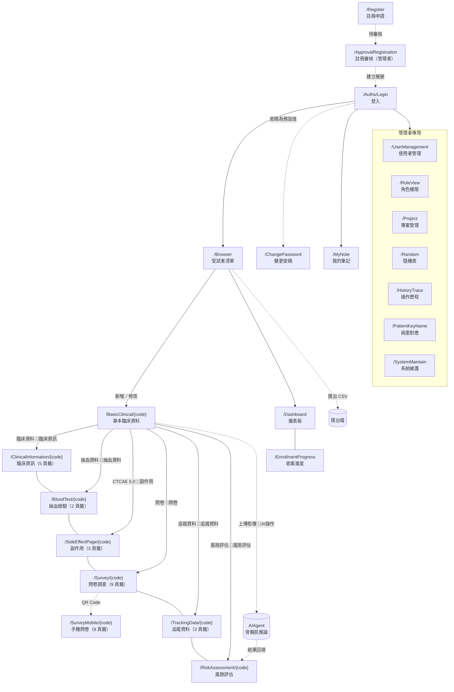

# 畫面導覽地圖

- 文件用途：全系統路由的導覽關係、每條路徑的權限閘門，以及每個畫面為什麼存在、誰會用
- 主要讀者：所有人——使用者、開發者與 AI 助手
- 對應系統版本：1.1.230
- 最後核對日期：2026/08/10
- 編碼：UTF-8（繁體中文，含 BOM）

---

> 路由與文件的完整對照（含程式來源）在 [KM 覆蓋矩陣](../KM/README.md)。本文件回答的是**怎麼走到那裡、需要什麼權限、為什麼需要這個畫面**。

## 一、全系統導覽圖

🔑 ＝ 該條導覽線的權限閘門（`BottomNavigationView` 的 `CheckShowPage`）。

## 二、六個切換鈕與它們的權限

進入某位受試者後，畫面底部固定有六個彩色切換鈕（`BottomNavigationView`）：

| 按鈕文字 | 目的地 | 按鈕檢查的權限 | 目的頁檢查的權限 |
| --- | --- | --- | --- |
| 🧾 臨床資料 | `/ClinicalInformation/{code}` | 🔴 `臨床資訊` | 🔴 `臨床資料` |
| 💉 抽血資料 | `/BloodTest/{code}` | `抽血資料` | `抽血資料` |
| 🧮 CTCAE 5.0 | `/SideEffectPage/{code}` | `副作用` | `副作用` |
| 📝 問卷 | `/Survey/{code}` | `問卷` | `問卷` |
| 🔄 追蹤資料 | `/TrackingData/{code}` | `追蹤資料` | `追蹤資料` |
| ⚠️ 風險評估 | `/RiskAssessment/{code}` | `風險評估` | `風險評估` |

### 🔴 第一列的按鈕與頁面檢查的是**兩個不同的權限**

「臨床資料」按鈕檢查 `ROLE臨床資訊`（值 `臨床資訊`），但 `/ClinicalInformation` 這一頁自己檢查的是 `ROLE臨床資料`（值 `臨床資料`）。造成兩種怪現象：

| 使用者權限 | 會發生什麼 |
| --- | --- |
| 有「臨床資訊」、沒有「臨床資料」 | 按鈕按得下去，導過去後看到「你沒有權限存取此頁面」 |
| 有「臨床資料」、沒有「臨床資訊」 | 按鈕被擋住，但**直接輸入網址可以進去** |

其餘五條路徑的按鈕與頁面權限一致。

## 三、每個畫面為什麼需要、誰會用

### 入口與總覽

| 畫面 | 為什麼需要 | 誰會用 |
| --- | --- | --- |
| [登入](../KM/登入-Login.md) | 系統入口，決定你是誰、能看到什麼 | 所有人 |
| [受試者清單](../KM/受試者清單-Browser.md) | 日常工作的主入口：找人、收案、匯出 | 研究護理師、醫師、管理者 |
| [儀表板](../KM/儀表板-Dashboard.md) | 一眼看收案進度與分組分布 | PI、管理者 |
| [收案進度](../KM/收案進度-EnrollmentProgress.md) | 醫院 × 癌別 × 期別 × 組別交叉表，供研究簡報截圖 | PI、研究助理 |

### 一位受試者的資料

| 畫面 | 為什麼需要 | 誰會用 |
| --- | --- | --- |
| [基本臨床資料](../KM/基本臨床資料-BasicClinical.md) | 收案後的第一站；**填妥癌別與分期才會進入隨機分組** | 研究護理師 |
| [臨床資訊](../KM/臨床資訊-ClinicalInformation.md) | 手術、病理、化療、用藥、病史的登錄處 | 研究護理師 |
| [抽血檢驗](../KM/抽血檢驗-BloodTest.md) | 檢驗數值登錄；也是**血液副作用分級的數值來源** | 研究護理師 |
| [副作用](../KM/副作用-SideEffect.md) | 依 CTCAE 5.0 判讀副作用嚴重度 | 研究護理師、醫師 |
| [問卷調查](../KM/問卷調查-Survey.md) ／ [手機問卷](../KM/手機問卷-SurveyMobile.md) | 收集受試者自填資料；手機版供受試者掃 QR 自填 | 研究護理師／受試者本人 |
| [追蹤資料](../KM/追蹤資料-TrackingData.md) | 主治療之外的縱向追蹤 | 研究護理師 |
| [風險評估](../KM/風險評估-RiskAssessment.md) | 看 AI 骨骼肌分析結果並由兩位醫師簽核 | 放射科醫師、婦產科醫師 |

### 管理者專用

| 畫面 | 為什麼需要 | 誰會用 |
| --- | --- | --- |
| [使用者管理](../KM/使用者管理-UserManagement.md) | 開帳號、設角色、停用離職者 | 系統管理者 |
| [角色權限](../KM/角色權限-RoleView.md) | 定義每個角色能看到哪些功能 | 系統管理者 |
| [專案管理](../KM/專案管理-Project.md) | 維護試驗計畫清單 | 系統管理者 |
| [隨機表](../KM/隨機表-Random.md) | 檢視與校正受試者與隨機分組的對應 | 系統管理者 |
| [操作歷程](../KM/操作歷程-HistoryTrace.md) | 稽核軌跡，滿足臨床試驗的可追溯性要求 | 系統管理者、稽核 |
| [病患對應](../KM/病患對應-PatientKeyName.md) | 下載 AI 結果、變更病歷號 | 系統管理者 |
| [系統維護](../KM/系統維護-SystemMaintain.md) | 測試醫院 WCF 介面、一次性資料修復 | 維運人員 |

### 沒有使用手冊的四個路由

`/`（首頁轉址）、`/Auths/Logout`（登出處理）、`/Error`（系統錯誤頁）、`/Sample`（開發範例頁）——沒有使用者可操作的內容。

## 四、⚠️ 導覽上的三個坑

1. 🔴 **「臨床資料」按鈕與目的頁權限不一致**（見第二節）。
2. ⚠️ **六個切換鈕之間可以互相跳**，但都必須先從受試者清單進入某位受試者；直接輸入 `/BloodTest` 而不帶 `{code}` 不會有畫面。
3. ⚠️ **`/Export` 是空殼**：側邊選單看得到，但真正的匯出按鈕在受試者清單上。
