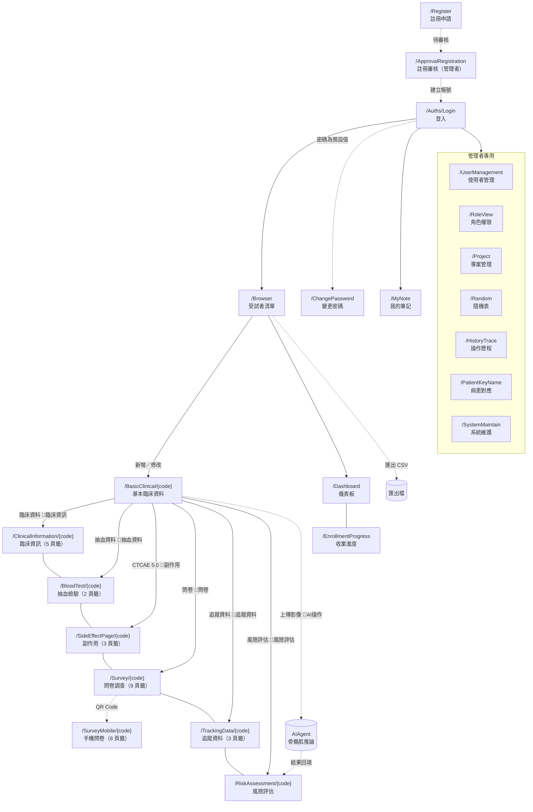

# CTMS 系統完整說明書

- 文件用途：把使用者操作、欄位參考與技術說明組裝成單一檔案，供交付、稽核與離線查閱
- 主要讀者：使用者、開發者、維運人員與稽核
- 對應系統版本：1.1.232 (2026/08/10)
- 最後核對日期：見各章節標頭（本檔為組裝產物，不另行對版）
- 編碼：UTF-8（繁體中文，含 BOM）

---

> 🔴 **本檔由 `scripts/Build-UserManual.ps1` 產生，請勿直接編輯。** 要改內容請改對應的來源檔，再重跑腳本；`scripts/Test-Docs.ps1` 會比對檔尾的來源雜湊，來源改了卻沒重跑就會檢查失敗。

## 目錄

### 導讀與畫面導覽

- [接手指南（新手快速上手）](#接手指南新手快速上手)
- [畫面導覽地圖](#畫面導覽地圖)

### 使用者篇：怎麼操作

- [新手入門：從收案到匯出](#新手入門從收案到匯出)
- [共通訊息與錯誤訊息](#共通訊息與錯誤訊息)
- [手機問卷（/SurveyMobile）](#手機問卷surveymobile)
- [收案進度（/EnrollmentProgress）](#收案進度enrollmentprogress)
- [我的筆記（/MyNote）](#我的筆記mynote)
- [系統維護（/SystemMaintain）](#系統維護systemmaintain)
- [角色與檢視權限（/RoleView）](#角色與檢視權限roleview)
- [使用者管理（/UserManagement）](#使用者管理usermanagement)
- [受試者清單（/Browser）](#受試者清單browser)
- [抽血檢驗（/BloodTest）](#抽血檢驗bloodtest)
- [建立帳號（/SignUp）](#建立帳號signup)
- [AI 風險評估（/RiskAssessment）](#ai-風險評估riskassessment)
- [病患對應（KeyName）（/PatientKeyName）](#病患對應keynamepatientkeyname)
- [追蹤資料與影像（/TrackingData）](#追蹤資料與影像trackingdata)
- [副作用（/SideEffectPage）](#副作用sideeffectpage)
- [問卷（/Questionnaire）](#問卷questionnaire)
- [問卷調查（/Survey）](#問卷調查survey)
- [基本臨床資料（/BasicClinical）](#基本臨床資料basicclinical)
- [專案管理（/Project）](#專案管理project)
- [登入（/Auths/Login）](#登入authslogin)
- [註冊（/Register）](#註冊register)
- [註冊審核（/ApprovalRegistration）](#註冊審核approvalregistration)
- [資料匯出（/Export）](#資料匯出export)
- [儀表板（/Dashboard）](#儀表板dashboard)
- [操作歷程（/HistoryTrace）](#操作歷程historytrace)
- [隨機表（/Random）](#隨機表random)
- [臨床資訊（/ClinicalInformation）](#臨床資訊clinicalinformation)
- [變更密碼（/ChangePassword）](#變更密碼changepassword)

### 欄位參考篇：每個頁籤的每個欄位

- [系統維護（`/SystemMaintain`）欄位參考](#系統維護systemmaintain欄位參考)
- [使用者管理（`/UserManagement`）欄位參考](#使用者管理usermanagement欄位參考)
- [受試者清單（`/Browser`）欄位參考](#受試者清單browser欄位參考)
- [抽血檢驗（`/BloodTest/{code}`）欄位參考](#抽血檢驗bloodtestcode欄位參考)
- [風險評估（`/RiskAssessment/{code}`）欄位參考](#風險評估riskassessmentcode欄位參考)
- [追蹤資料（`/TrackingData/{code}`）欄位參考](#追蹤資料trackingdatacode欄位參考)
- [副作用（`/SideEffectPage/{code}`）欄位參考](#副作用sideeffectpagecode欄位參考)
- [問卷調查（`/Survey/{code}`）與手機問卷（`/SurveyMobile/{code}`）欄位參考](#問卷調查surveycode與手機問卷surveymobilecode欄位參考)
- [基本臨床資料（`/BasicClinical/{code}`）欄位參考](#基本臨床資料basicclinicalcode欄位參考)
- [專案管理（`/Project`）與角色權限（`/RoleView`）欄位參考](#專案管理project與角色權限roleview欄位參考)
- [建立帳號（`/SignUp`）、註冊（`/Register`）與註冊審核（`/ApprovalRegistration`）欄位參考](#建立帳號signup註冊register與註冊審核approvalregistration欄位參考)
- [登入（`/Auths/Login`）與變更密碼（`/ChangePassword`）欄位參考](#登入authslogin與變更密碼changepassword欄位參考)
- [操作歷程（`/HistoryTrace`）與病患對應（`/PatientKeyName`）欄位參考](#操作歷程historytrace與病患對應patientkeyname欄位參考)
- [隨機表（`/Random`）欄位參考](#隨機表random欄位參考)
- [臨床資訊（`/ClinicalInformation/{code}`）欄位參考](#臨床資訊clinicalinformationcode欄位參考)

### 功能模組篇：每個功能背後的邏輯

- [個案管理（受測者瀏覽 /Browser）](#個案管理受測者瀏覽-browser)
- [儀表板](#儀表板)
- [收案進度統計](#收案進度統計)
- [臨床資訊與病史](#臨床資訊與病史)
- [治療紀錄](#治療紀錄)
- [抽血檢驗](#抽血檢驗)
- [副作用與 CTCAE 分級](#副作用與-ctcae-分級)
- [問卷收集](#問卷收集)
- [追蹤資料與縱向影像](#追蹤資料與縱向影像)
- [AI 風險評估與骨骼肌分析](#ai-風險評估與骨骼肌分析)
- [簽核確認](#簽核確認)
- [DICOM 影像處理](#dicom-影像處理)
- [受試者編號與隨機分組](#受試者編號與隨機分組)
- [使用者與權限管理](#使用者與權限管理)
- [資料匯入匯出](#資料匯入匯出)
- [操作歷程與稽核](#操作歷程與稽核)
- [CTMS AI 推論架構總覽](#ctms-ai-推論架構總覽)
- [CTMS AI 推論流程一：上傳 DICOM 後直接推論](#ctms-ai-推論流程一上傳-dicom-後直接推論)
- [CTMS AI 推論流程二：上傳人工標註檔後重跑推論](#ctms-ai-推論流程二上傳人工標註檔後重跑推論)
- [AIAgent 專案說明](#aiagent-專案說明)

### 技術篇：資料怎麼被處理與紀錄

- [開發慣例與限制速查（AI／開發者必讀）](#開發慣例與限制速查ai開發者必讀)
- [啟動與初始化](#啟動與初始化)
- [領域資料模型](#領域資料模型)
- [Visit Code：資料結構與關聯](#visit-code資料結構與關聯)
- [問卷與抽血資料的建立與維護](#問卷與抽血資料的建立與維護)
- [外部服務串接](#外部服務串接)
- [資料讀寫與運作狀態落點](#資料讀寫與運作狀態落點)
- [認證授權與權限機制](#認證授權與權限機制)
- [文件維護規範](#文件維護規範)

---

## 本檔未收錄的文件

下列文件留在 `docs/` 各分類內，**沒有**組裝進本檔（多為歷史紀錄、測試報告與擴充指南）。這份清單由腳本自動產生，不會漏列。

- [01-系統總覽/系統總覽.md](01-系統總覽/系統總覽.md)
- [02-架構/技術棧.md](02-架構/技術棧.md)
- [02-架構/解決方案架構.md](02-架構/解決方案架構.md)
- [02-架構/資料流與分層.md](02-架構/資料流與分層.md)
- [06-部署與維護/部署與環境設定.md](06-部署與維護/部署與環境設定.md)
- [06-部署與維護/資料庫與EFCore.md](06-部署與維護/資料庫與EFCore.md)
- [06-部署與維護/HIS串接.md](06-部署與維護/HIS串接.md)
- [07-擴充指南/新增三家醫院-重新檢查報告.md](07-擴充指南/新增三家醫院-重新檢查報告.md)
- [07-擴充指南/新增三家醫院-實施做法.md](07-擴充指南/新增三家醫院-實施做法.md)
- [07-擴充指南/新增醫院.md](07-擴充指南/新增醫院.md)
- [08-測試/人工測試檢查清單-新增三家醫院.md](08-測試/人工測試檢查清單-新增三家醫院.md)
- [08-測試/AI自動化測試-成果報告（GM）.md](08-測試/AI自動化測試-成果報告（GM）.md)
- [08-測試/AI自動化測試-成果簡報（GM）.md](08-測試/AI自動化測試-成果簡報（GM）.md)
- [08-測試/AI自動化測試-隨機表缺口修復記錄.md](08-測試/AI自動化測試-隨機表缺口修復記錄.md)
- [08-測試/E2E-Playwright-自動測試製作全紀錄.md](08-測試/E2E-Playwright-自動測試製作全紀錄.md)
- [08-測試/tests-e2e-腳本說明.md](08-測試/tests-e2e-腳本說明.md)
- [09-變更紀錄/2026-08-10-建立文件防腐機制.md](09-變更紀錄/2026-08-10-建立文件防腐機制.md)
- [10-規劃待辦/文件體系建置盤點.md](10-規劃待辦/文件體系建置盤點.md)

---

## 導讀與畫面導覽

### 接手指南（新手快速上手）

- 文件用途：給非原始開發者的最快上手指南：系統在幹嘛、程式碼放哪、有哪些地雷
- 主要讀者：開發者與 AI 助手
- 對應系統版本：未核對（僅醫院相關敘述已對照 `HospitalRegistry` 核對）
- 最後核對日期：未核對（醫院敘述：2026/08/10）
- 編碼：UTF-8（繁體中文，含 BOM）

---

> 這份文件寫給**準備接手這套系統、但不是原始開發者**的人。目標是用最少時間讓你搞懂：這系統在幹嘛、資料長怎樣、程式碼放哪、我該從哪看起。看完這頁再依需要往深處鑽。

---

#### 1. 這系統到底在做什麼？（一分鐘版）

**CTMS = 婦科癌症臨床試驗管理平臺。** 給醫院的臨床試驗團隊用，管理「子宮內膜癌 / 卵巢癌」試驗中每位**受試者（病人）**的所有資料，並用 **AI 分析 CT 影像的骨骼肌**來評估風險、決定化療劑量。

服務多家合作醫院；⭐ 名單的唯一出處是 `HospitalRegistry.All`（見 [新增醫院](07-擴充指南/新增醫院.md)），這裡刻意不抄一份。

用白話講，它幫醫護做四件事：
1. **收案分組** — 病人進來，給編號，抽籤分到「實驗組（用 AI 輔助）」或「對照組」。
2. **登錄資料** — 病史、手術、化療、抽血、副作用、問卷……一次次回診累積。
3. **AI 風險評估** — 上傳 CT 影像，系統算出骨骼肌指標，判斷是否高風險、要不要降劑量，醫師簽核確認。
4. **匯出與稽核** — 把資料攤平匯出成 Excel 給研究分析，全程留操作紀錄。

---

#### 2. 誰在用？（角色）

| 角色 | 大概在做什麼 |
| --- | --- |
| CRC / 研究護理師 | 收案、登錄臨床資料、抽血、問卷 |
| 放射科醫師 | 確認 AI 影像分析結果並簽名 |
| 婦產科醫師 | 確認風險評估結果並簽名、決定劑量 |
| 系統管理員 | 開帳號、審核註冊、權限、隨機分組表維護 |

系統用**角色權限（ROLE...）**控制誰能看/改哪一頁。

---

#### 3. 一位受試者的資料生命週期（整體流程）

```
收案 ──► 產生受試者編號(如 NCKUH0001) ──► 亂數表抽籤分組(實驗/對照)
   │
   ▼
每次回診(Visit Code) 累積登錄：
   臨床資訊/病史 → 手術/病理 → 化療/用藥 → 抽血檢驗 → 副作用分級 → 問卷
   │
   ▼
上傳 CT 的 DICOM 影像 ──► AIAgent 背景服務跑 AI 模型 ──► 算骨骼肌指標
   │                                                    (SMI/SMD/SMA/IMAT…)
   ▼
判定「高風險 / 是否降 15% 劑量」 ──► 放射科 + 婦產科醫師雙簽核
   │
   ▼
匯出 Excel/CSV 給研究分析（全程留操作稽核歷程）
```

**關鍵概念：Visit Code（回診代碼）。** 幾乎所有臨床資料都掛在某一次回診下，同一位病人會有多筆。匯出時就是把「病人 × 每次回診」攤平成一列一列的大表。

---

#### 4. 這是什麼技術做的？（接手前先知道）

- **語言/框架**：C# / **.NET 9** + **Blazor Server**（網頁 UI 是 `.razor` 元件，邏輯在後端跑）。
- **UI 套件**：MudBlazor、Syncfusion、AntDesign（三套混用）。
- **資料庫**：**SQLite** + **EF Core**。⚠️ 重要特色：大部分臨床資料**不是拆成一堆資料表**，而是整包序列化成 **JSON 存在 `Patient.JsonData` 這個欄位**裡。所以你在資料庫看不到「抽血表」「化療表」，它們都在 JSON 裡。
- **AI 背景服務**：另有一支獨立的 **AIAgent** Worker 服務，專門輪詢資料夾、轉 DICOM 影像、跑 R 語言的 AI 模型。
- **執行環境**：Windows（用到 WCF、Windows 版 PDF 轉檔元件）。

---

#### 5. 程式碼怎麼分（我要改東西該去哪找）

方案（`src/CTMS/CTMS.sln`）有 9 個專案，記住這幾個就夠開始：

| 專案 | 是什麼 | 你何時會動它 |
| --- | --- | --- |
| **CTMS** | 主網站（所有畫面 `.razor` + 後端） | 改畫面、改流程 → 幾乎都在這 |
| **CTMS.Business** | 商業邏輯（各種 Service） | 改計算/判定邏輯 |
| **CTMS.DataModel** | 資料傳輸模型（DTO / JSON 結構） | 改欄位結構 |
| **CTMS.EntityModel** | EF Core 實體 + 資料庫遷移 | 改資料表、加 Migration |
| **CTMS.ExcelUtility** | Excel 匯入匯出 | 改匯出大表 |
| **AIAgent / AIAgent.Business** | 獨立 AI 背景服務 | 改 AI 推論管線 |

**找畫面的訣竅**：畫面在 `CTMS/Components/Pages/`（整頁）與 `CTMS/Components/Views/`（區塊）。例如個案清單邏輯在 [BrowseView.razor.cs](../src/CTMS/CTMS/Components/Views/Commons/BrowseView.razor.cs)。

---

#### 6. 幾個接手時容易踩到的地雷

- **醫院清單已集中化**：自 1.1.222 起醫院定義集中在 `HospitalRegistry`（`CTMS.Share/Helpers`），原本散落約 18 處的 `switch` / 連續 `if` 都改讀這份清單，新增醫院是「清單加一筆＋備妥資料檔」。🔴 但共用 prefix 的分院要設 `IsPrefixOwner = false`，設錯不會報錯、統計會默默算到母院。務必照 [新增醫院指南](07-擴充指南/新增醫院.md) 走。
- **資料在 JSON 裡**：直接查資料庫看不到臨床細節，要透過程式反序列化 `JsonData` 才看得懂。
- **`/Export` 頁是空殼**：真正能用的匯出按鈕在**個案清單（BrowseView）**上，不是那個看起來像匯出頁的 `/Export`。
- **有已知的小 UI 綁定瑕疵**（複製貼上殘留），詳見各模組文件的說明，接手後可視情況修。
- **改文件要補 BOM**：`docs/` 下所有 `.md` 必須是 UTF-8 **含 BOM**；提交前在本機跑 `pwsh scripts/Test-Docs.ps1`（⚠️ 沒有 CI，不會自動擋）。版本號每次建置要把最後一碼 +1。詳見 [文件維護規範](#文件維護規範)。

---

#### 7. 接下來看哪裡？（依你的目的）

| 你想做的事 | 去看 |
| --- | --- |
| 更完整理解系統與領域 | [系統總覽](01-系統總覽/系統總覽.md) |
| 了解整體架構與專案分層 | [解決方案架構](02-架構/解決方案架構.md)、[資料流與分層](02-架構/資料流與分層.md) |
| 搞懂資料長怎樣（JSON 結構） | [領域資料模型](#領域資料模型) |
| 改某個功能畫面 | [04-功能模組/](04-功能模組/) 對應文件（重點看「畫面商業邏輯」章） |
| 理解 AI 影像分析怎麼跑 | [AI 推論總覽](#ctms-ai-推論架構總覽)、[AIAgent 背景服務](#aiagent-專案說明) |
| 部署 / 環境設定 | [部署與環境設定](06-部署與維護/部署與環境設定.md) |
| 全部文件的索引 | [docs/README.md](README.md) |


---

### 畫面導覽地圖

- 文件用途：全系統路由的導覽關係、每條路徑的權限閘門，以及每個畫面為什麼存在、誰會用
- 主要讀者：所有人——使用者、開發者與 AI 助手
- 對應系統版本：1.1.230
- 最後核對日期：2026/08/10
- 編碼：UTF-8（繁體中文，含 BOM）

---

> 路由與文件的完整對照（含程式來源）在 [KM 覆蓋矩陣](KM/README.md)。本文件回答的是**怎麼走到那裡、需要什麼權限、為什麼需要這個畫面**。

#### 一、全系統導覽圖



🔑 ＝ 該條導覽線的權限閘門（`BottomNavigationView` 的 `CheckShowPage`）。

#### 二、六個切換鈕與它們的權限

進入某位受試者後，畫面底部固定有六個彩色切換鈕（`BottomNavigationView`）：

| 按鈕文字 | 目的地 | 按鈕檢查的權限 | 目的頁檢查的權限 |
| --- | --- | --- | --- |
| 🧾 臨床資料 | `/ClinicalInformation/{code}` | 🔴 `臨床資訊` | 🔴 `臨床資料` |
| 💉 抽血資料 | `/BloodTest/{code}` | `抽血資料` | `抽血資料` |
| 🧮 CTCAE 5.0 | `/SideEffectPage/{code}` | `副作用` | `副作用` |
| 📝 問卷 | `/Survey/{code}` | `問卷` | `問卷` |
| 🔄 追蹤資料 | `/TrackingData/{code}` | `追蹤資料` | `追蹤資料` |
| ⚠️ 風險評估 | `/RiskAssessment/{code}` | `風險評估` | `風險評估` |

##### 🔴 第一列的按鈕與頁面檢查的是**兩個不同的權限**

「臨床資料」按鈕檢查 `ROLE臨床資訊`（值 `臨床資訊`），但 `/ClinicalInformation` 這一頁自己檢查的是 `ROLE臨床資料`（值 `臨床資料`）。造成兩種怪現象：

| 使用者權限 | 會發生什麼 |
| --- | --- |
| 有「臨床資訊」、沒有「臨床資料」 | 按鈕按得下去，導過去後看到「你沒有權限存取此頁面」 |
| 有「臨床資料」、沒有「臨床資訊」 | 按鈕被擋住，但**直接輸入網址可以進去** |

其餘五條路徑的按鈕與頁面權限一致。

#### 三、每個畫面為什麼需要、誰會用

##### 入口與總覽

| 畫面 | 為什麼需要 | 誰會用 |
| --- | --- | --- |
| [登入](#登入authslogin) | 系統入口，決定你是誰、能看到什麼 | 所有人 |
| [受試者清單](#受試者清單browser) | 日常工作的主入口：找人、收案、匯出 | 研究護理師、醫師、管理者 |
| [儀表板](#儀表板dashboard) | 一眼看收案進度與分組分布 | PI、管理者 |
| [收案進度](#收案進度enrollmentprogress) | 醫院 × 癌別 × 期別 × 組別交叉表，供研究簡報截圖 | PI、研究助理 |

##### 一位受試者的資料

| 畫面 | 為什麼需要 | 誰會用 |
| --- | --- | --- |
| [基本臨床資料](#基本臨床資料basicclinical) | 收案後的第一站；**填妥癌別與分期才會進入隨機分組** | 研究護理師 |
| [臨床資訊](#臨床資訊clinicalinformation) | 手術、病理、化療、用藥、病史的登錄處 | 研究護理師 |
| [抽血檢驗](#抽血檢驗bloodtest) | 檢驗數值登錄；也是**血液副作用分級的數值來源** | 研究護理師 |
| [副作用](#副作用sideeffectpage) | 依 CTCAE 5.0 判讀副作用嚴重度 | 研究護理師、醫師 |
| [問卷調查](#問卷調查survey) ／ [手機問卷](#手機問卷surveymobile) | 收集受試者自填資料；手機版供受試者掃 QR 自填 | 研究護理師／受試者本人 |
| [追蹤資料](#追蹤資料與影像trackingdata) | 主治療之外的縱向追蹤 | 研究護理師 |
| [風險評估](#ai-風險評估riskassessment) | 看 AI 骨骼肌分析結果並由兩位醫師簽核 | 放射科醫師、婦產科醫師 |

##### 管理者專用

| 畫面 | 為什麼需要 | 誰會用 |
| --- | --- | --- |
| [使用者管理](#使用者管理usermanagement) | 開帳號、設角色、停用離職者 | 系統管理者 |
| [角色權限](#角色與檢視權限roleview) | 定義每個角色能看到哪些功能 | 系統管理者 |
| [專案管理](#專案管理project) | 維護試驗計畫清單 | 系統管理者 |
| [隨機表](#隨機表random) | 檢視與校正受試者與隨機分組的對應 | 系統管理者 |
| [操作歷程](#操作歷程historytrace) | 稽核軌跡，滿足臨床試驗的可追溯性要求 | 系統管理者、稽核 |
| [病患對應](#病患對應keynamepatientkeyname) | 下載 AI 結果、變更病歷號 | 系統管理者 |
| [系統維護](#系統維護systemmaintain) | 測試醫院 WCF 介面、一次性資料修復 | 維運人員 |

##### 沒有使用手冊的四個路由

`/`（首頁轉址）、`/Auths/Logout`（登出處理）、`/Error`（系統錯誤頁）、`/Sample`（開發範例頁）——沒有使用者可操作的內容。

#### 四、⚠️ 導覽上的三個坑

1. 🔴 **「臨床資料」按鈕與目的頁權限不一致**（見第二節）。
2. ⚠️ **六個切換鈕之間可以互相跳**，但都必須先從受試者清單進入某位受試者；直接輸入 `/BloodTest` 而不帶 `{code}` 不會有畫面。
3. ⚠️ **`/Export` 是空殼**：側邊選單看得到，但真正的匯出按鈕在受試者清單上。


---

## 使用者篇：怎麼操作

### 新手入門：從收案到匯出

- 文件用途：用一位受試者的完整流程，把 26 份分散的畫面手冊串成一條路
- 主要讀者：第一次使用本系統的研究護理師、醫師與管理者
- 對應系統版本：1.1.229
- 最後核對日期：2026/08/10
- 編碼：UTF-8（繁體中文，含 BOM）

---

這份是**流程書**：從頭讀到尾，你會知道一位受試者從進來到資料交出去，中間會經過哪些畫面、每一步的重點是什麼。

⚠️ 這裡**不重複**任何欄位與按鈕的細節——那些寫在各畫面自己的手冊裡，需要時點進去看。同一件事只寫在一個地方，你才不會遇到兩份文件講不一樣。

#### 全流程一眼看完

```
登入
 └─► 受試者清單 ──► 新增受試者（自動產生病人編號）
                      │
                      ▼
                 基本臨床資料（填癌別與分期）──► 系統進行隨機分組
                      │
                      ▼
        每次回診（Visit Code）逐次累積登錄：
        臨床資訊 → 抽血檢驗 → 副作用 → 問卷 → 追蹤資料
                      │
                      ▼
        上傳 CT 影像 ──► AI 分析骨骼肌 ──► 風險評估結果
                      │
                      ▼
        放射科醫師簽名 ＋ 婦產科醫師簽名
                      │
                      ▼
        從受試者清單匯出 Excel／CSV 給統計分析
```

#### 第 1 步：登入

從 [登入](#登入authslogin) 進入系統。

- ⚠️ 「使用者帳號不存在」和「密碼不正確」是**兩句不同的訊息**。看到前者就別再試密碼了，那是帳號打錯或還沒開通。
- 還沒有帳號：走 [註冊](#註冊register) 送申請，再由管理者在 [註冊審核](#註冊審核approvalregistration) 建立帳號。
- 密碼還是預設值時，系統會要求你先到 [變更密碼](#變更密碼changepassword) 改掉。

#### 第 2 步：收案——新增一位受試者

在 [受試者清單](#受試者清單browser) 按「新增受測者資料」，選院別與收案日期。

- 系統會**自動產生病人編號**（例如 `NCKUH0001`），開頭英文代表收案醫院，不需要也不應該自己編。
- 這個清單是你日後的主要入口：找人、改資料、切換收案／退出狀態、匯出，都從這裡開始。

#### 第 3 步：填基本資料，讓系統分組

點進該位受試者，進入 [基本臨床資料](#基本臨床資料basicclinical)。

- **填妥癌別與分期，才會進入隨機分組。** 這是整個流程的關卡：資料沒填齊，後面的組別就不會出現。
- 分組結果（實驗組／對照組）由系統依隨機表決定。管理者可在 [隨機表](#隨機表random) 檢視與校正對應關係。

#### 第 4 步：每次回診，逐步登錄資料

從這裡開始，所有資料都掛在**某一次回診（Visit Code）**之下。同一位受試者會有很多筆，各自屬於不同回診。

| 要登錄什麼 | 去哪個畫面 |
| --- | --- |
| 手術、病理報告、化療、合併用藥、病史 | [臨床資訊](#臨床資訊clinicalinformation) |
| 血液與生化檢驗數值 | [抽血檢驗](#抽血檢驗bloodtest) |
| 副作用嚴重程度（CTCAE 分級） | [副作用](#副作用sideeffectpage) |
| 各類問卷（研究人員代填） | [問卷調查](#問卷調查survey) |
| 各類問卷（受試者自己用手機填） | [手機問卷](#手機問卷surveymobile) |
| 主治療之外的其他治療、藥物與追蹤影像 | [追蹤資料](#追蹤資料與影像trackingdata) |

⚠️ **先確認自己在正確的 Visit Code 上再輸入。** 填錯回診不會有任何警告，資料會安靜地存到別次去。

#### 第 5 步：AI 風險評估與雙醫師簽核

上傳 CT 影像後，系統會送去做 AI 骨骼肌分析，結果呈現在 [風險評估](#ai-風險評估riskassessment)。

- 送出時畫面會說「已經將此紀錄送至 AI 推論中」——那是**送出**，不是完成。分析要花時間，稍後回來重新整理才看得到結果。
- 結果要由**放射科醫師**與**婦產科醫師各簽一次**。兩個確認框的文字只差「放射科／婦產科」幾個字，按之前先看清楚自己是哪個角色。

#### 第 6 步：匯出資料

回到 [受試者清單](#受試者清單browser)，用上方的匯出按鈕。

- 🔴 **匯出永遠針對全部受試者，不會只匯出你目前篩選出來的那些。** 篩選只影響畫面上看到的清單。
- ⚠️ 側邊選單裡的「[資料匯出](#資料匯出export)」（`/Export`）目前是**空殼**，按鈕沒有作用。真正能用的匯出在受試者清單上。

#### 隨時可以看的

| 想知道什麼 | 去哪 |
| --- | --- |
| 現在收了多少人、各組多少 | [儀表板](#儀表板dashboard) |
| 醫院 × 癌別 × 期別 × 組別的交叉統計 | [收案進度](#收案進度enrollmentprogress) |
| 誰在什麼時候改了什麼（管理者） | [操作歷程](#操作歷程historytrace) |
| 記一下自己的備忘 | [我的筆記](#我的筆記mynote) |

#### 遇到看不懂的錯誤訊息

先查 [共通訊息與錯誤訊息](#共通訊息與錯誤訊息)——儲存、修改、刪除失敗的訊息都集中在那裡。查不到再看該畫面手冊的「狀態與訊息」章節。

#### 三個最容易踩到的地雷

1. 🔴 **匯出不受篩選影響**——以為匯出的是篩選結果，拿到的其實是全部。
2. ⚠️ **Visit Code 選錯不會有警告**——資料會安靜地存到別次回診。
3. ⚠️ **「送出 AI 推論」不等於「分析完成」**——訊息只代表送出成功。

> 全部畫面的清單與各自的手冊，見 [KM 索引](KM/README.md)。


---

### 共通訊息與錯誤訊息

- 文件用途：所有畫面共用的資料存取錯誤訊息一覽，供使用者以畫面上看到的文字回頭查詢
- 主要讀者：系統使用者（研究護理師、醫師、管理者）
- 對應系統版本：1.1.229
- 最後核對日期：2026/08/10
- 編碼：UTF-8（繁體中文，含 BOM）

---

系統的**儲存、修改、刪除**動作失敗時，畫面會跳出一個「警告」或「錯誤」對話框，內容是下表這幾句其中一句。它們不屬於某一個畫面——**任何畫面都可能出現**，所以集中寫在這裡，各畫面文件不重複列出。

> 下列文字**逐字取自程式碼**，可直接複製到搜尋列比對。

#### 一、儲存與修改失敗

| 畫面文字 | 白話意思 | 你該怎麼辦 |
| --- | --- | --- |
| 要新增的紀錄已經存在無法新增 | 這筆資料的關鍵欄位與既有資料重複 | 改一個不重複的值，或改用「修改」既有那一筆 |
| 要修改的紀錄已經存在無法修改 | 改完之後會與另一筆資料重複 | 換一個不重複的值 |
| 要更新的紀錄 發生同時存取衝突 已經不存在資料庫上 | 你在編輯的同時，別人把這筆刪掉了 | 重新整理畫面，確認資料是否還在 |
| 無法修改紀錄 | 系統找不到要修改的那一筆 | 重新整理畫面後再試一次 |
| 新增記錄發生例外異常 | 系統內部錯誤 | 重試一次；仍失敗請記下當時的操作並回報 |
| 修改記錄發生例外異常 | 系統內部錯誤 | 同上 |

#### 二、刪除失敗

| 畫面文字 | 白話意思 | 你該怎麼辦 |
| --- | --- | --- |
| 無法刪除紀錄 | 系統找不到要刪除的那一筆 | 重新整理畫面 |
| 無法刪除紀錄 要刪除的紀錄已經不存在資料庫上 | 這筆已經被刪掉了 | 重新整理畫面 |
| 該紀錄無法刪除因為有其他資料表在使用中 | 有其他資料正在引用它（例如角色仍被帳號使用） | 先解除引用（例如把帳號改成別的角色）再刪 |
| 刪除記錄發生例外異常 | 系統內部錯誤 | 重試；仍失敗請回報 |

#### 三、帳號相關的保護訊息

| 畫面文字 | 什麼情況會看到 |
| --- | --- |
| 開發者帳號不可以被新增 | 想新增一個帳號名稱為 `support` 的帳號 |
| 開發者帳號不可以被刪除 | 想刪除 `support` 帳號 |
| 開發者帳號不可以被停用 | 想把 `support` 帳號改成停用 |
| 使用者帳號不存在 | 登入時輸入的帳號不存在 |
| 密碼不正確 | 登入時密碼錯誤 |

#### 四、⚠️ 兩個容易誤會的地方

- ⚠️ **「要更新的紀錄 發生同時存取衝突」不代表你操作錯誤**，而是同一筆資料被兩個人同時動到。重新整理後確認別人改了什麼，再決定要不要覆蓋。
- ⚠️ 訊息中出現「紀錄」「記錄」兩種寫法（例如「無法刪除紀錄」與「刪除記錄發生例外異常」），這是程式裡原本的用字差異。**搜尋時請照畫面上看到的字**，不要自行代換。

> 各畫面**自己特有的**訊息寫在該畫面的文件裡，見 [KM 索引](KM/README.md)。


---

### 手機問卷（/SurveyMobile）

- 文件用途：使用者操作說明：/SurveyMobile 手機版受試者自填問卷 的欄位、按鈕與常見問答
- 主要讀者：系統使用者（研究護理師、醫師、管理者）
- 對應系統版本：未核對（沿用建立時內容）
- 最後核對日期：未核對
- 編碼：UTF-8（繁體中文，含 BOM）

---

#### 這個畫面是做什麼的？

這是**手機版的問卷填答頁**，設計給**受試者本人用自己的手機**填答用。通常受試者是從研究人員提供的 QR Code 掃描、或點手機連結進來的。

進來後就是一排問卷分頁，受試者可以直接在手機上逐份作答：

- 化療副作用、標靶副作用、放療副作用
- WHOQOL 問卷
- 個人史、家族史
- 生活品質、健康

和電腦版的「[問卷調查](#問卷調查survey)」相比，這個手機版**刻意做得比較單純**：沒有上方的系統標題列、沒有「返回上頁」、沒有 QR Code 分頁，也沒有下方那排跳其他畫面的按鈕，讓受試者專心填問卷就好。

#### 怎麼進到這個畫面？

- **不需要登入、也不需要權限**。受試者只要掃描研究人員提供的 QR Code，或點開「手機填寫連結」，就會直接進到自己的填答頁。
- 這個連結是研究人員在電腦版「問卷調查」畫面的「QR Code」分頁產生的，對應的就是這一位受試者。

#### 畫面欄位說明

##### 分頁（畫面上方一排標籤，每一個是一份問卷）

| 分頁 | 這是什麼問卷 |
| --- | --- |
| 化療副作用 | 化療期間的副作用自填問卷。 |
| 標靶副作用 | 標靶治療的副作用問卷。 |
| 放療副作用 | 放射治療的副作用問卷。 |
| WHOQOL 問卷 | 世界衛生組織生活品質問卷。 |
| 個人史 | 個人病史（例如是否停經、抽菸習慣等）。 |
| 家族史 | 家族疾病史。 |
| 生活品質 | 生活品質相關問卷（周邊神經症狀）。 |
| 健康 | 健康狀態問卷。 |

> 手機版沒有「QR Code」這個分頁（QR Code 是給研究人員在電腦上產生的）。

##### 每份問卷內的題目

| 欄位 | 這是什麼意思 | 怎麼填 / 範例 | 必填 |
| --- | --- | --- | --- |
| 題號 | 每一題前面的編號（例如 7.0、7.1）。 | 系統顯示，不用填。 | 否 |
| 題目 | 這一題要問的內容。 | 系統顯示，不用填。 | 否 |
| 選項題 | 有選項的題目，會列出可點選的項目。 | 直接點你要的那一項，點了會打勾（每題只能選一項）。 | 依問卷 |
| 填空題 | 沒有選項的題目，會出現一個輸入框。 | 直接在框內輸入文字（例如年紀、身高、體重、菸齡等）。 | 依問卷 |

> 有些題目會**依前一題的答案自動出現或隱藏**。例如「是否停經」選「是」，才會接著出現後續相關題目；選「否」就不會出現。

#### 按鈕與操作說明

| 按鈕 | 做什麼 | 誰可以用 |
| --- | --- | --- |
| 儲存（各問卷分頁下方） | 把目前這份問卷填的答案存檔，存好會跳出「儲存成功」。 | 受試者本人（掃 QR 後直接使用） |

> 手機版沒有「返回上頁」，也沒有跳去其他畫面的按鈕，只需要專心填問卷、按「儲存」即可。

#### 常見操作步驟

##### 我是受試者，我想用手機填問卷
1. 掃描研究人員給的 QR Code，或點開他傳給你的「手機填寫連結」。
2. 進到畫面後，從上方分頁點你要填的那一份問卷。
3. 逐題作答：有選項的直接點，沒選項的在框內打字。
4. 填完後按下方的「儲存」，看到「儲存成功」就完成這一份。
5. 其他分頁的問卷也用同樣方式填、分別儲存。

##### 我想確認每份問卷都存好了
1. 每填完一份，按該分頁的「儲存」並確認出現「儲存成功」。
2. 再切換到下一個分頁繼續填。

#### 狀態與訊息

> 下列文字**逐字取自程式碼**，可直接用畫面上看到的字回頭搜尋；`{ }` 內是執行時才代入的實際值。

| 出現時機 | 類型 | 畫面上的文字 |
| --- | --- | --- |
| 任何一份問卷按儲存 | 訊息框 | 標題「資訊」／內容「儲存成功」 |

⚠️ 各問卷分頁共用同一句「儲存成功」，不會標明存的是哪一份。

> 儲存、修改或刪除失敗時出現的共通訊息（例如「要新增的紀錄已經存在無法新增」）集中在 [共通訊息與錯誤訊息](#共通訊息與錯誤訊息)，本頁不重複列出。

#### 常見問答（FAQ）

**Q：我需要帳號密碼才能填手機問卷嗎？**
A：不需要。手機問卷是給受試者本人掃 QR 後直接填答，不用登入。

**Q：手機版為什麼比電腦版少了幾個分頁和按鈕？**
A：手機版是特別為受試者自己填答簡化過的，所以沒有 QR Code 分頁、沒有「返回上頁」、也沒有跳到其他畫面的那排按鈕，讓你專心作答。

**Q：換到別的分頁前，剛填的會不會不見？**
A：每份問卷分頁各自有「儲存」。換分頁前請先按「儲存」、確認看到「儲存成功」，才不會漏存。

**Q：為什麼有些題目一開始沒出現，選了某個答案後才冒出來？**
A：這是正常設計。部分題目會依你前一題的答案自動顯示或隱藏。

**Q：我在手機上填的答案，研究人員看得到嗎？**
A：看得到。你透過這個手機連結填的答案，會存回同一位受試者，研究人員在電腦版「問卷調查」畫面就能看到。

**Q：這個連結可以給別人用嗎？**
A：不建議。這個連結對應的就是你這一位受試者，填的答案會算在你身上，請勿轉給其他人填。


---

### 收案進度（/EnrollmentProgress）

- 文件用途：使用者操作說明：/EnrollmentProgress 收案交叉統計表 的欄位、按鈕與常見問答
- 主要讀者：系統使用者（研究護理師、醫師、管理者）
- 對應系統版本：未核對（沿用建立時內容）
- 最後核對日期：未核對
- 編碼：UTF-8（繁體中文，含 BOM）

---

#### 這個畫面是做什麼的？

這是一張**收案進度總表**，把目前試驗的收案人數，依「醫院 → 癌別 → 期別 → 分組」層層拆開，用一張表格一次呈現。它主要是給你**做進度報告、直接截圖放進簡報**用的。

表格上會告訴你：

- 每一家醫院、每一種癌別、每一個期別，各收了多少對照組、多少實驗組。
- 每家醫院的**小計人數**，以及全部醫院合起來的**總計人數**。
- 兩個計畫預定的里程碑目標人數（期中分析、期末分析），方便對照目前進度離目標還差多少。

這個畫面只用來**看**，沒有任何可以填寫或修改的欄位。

#### 怎麼進到這個畫面？

- 直接在網址列輸入結尾為 `/EnrollmentProgress` 的網址。
- 這個畫面**沒有放進任何選單**，所以只能靠輸入網址進入。
- 進入後系統會即時重新統計一次，稍等「統計中…」跑完就會出現表格。

#### 畫面欄位說明

整張表由上而下分成「分層」「分組」「小計與總計」「里程碑」四個區塊：

| 表格區塊 | 這是什麼意思 |
| --- | --- |
| ① 分層－醫院 | 最上面一排，把收案醫院分成三家：成大、郭綜合、奇美（柳營奇美會併入奇美一起算）。 |
| ① 分層－癌別 | 每家醫院底下再分兩種癌別：卵巢癌、內膜癌。 |
| ① 分層－期別 | 每種癌別底下再分四個期別：I、II、III、IV。 |
| ② 分組－對照組 | 該格條件下，分到對照組的人數。 |
| ② 分組－實驗組 | 該格條件下，分到實驗組的人數。 |
| 小計收案數 | 該家醫院所有格子加起來的人數。 |
| 總計收案數（至 …） | 各醫院小計再加總的全試驗人數；括號內是統計的基準日，以民國年顯示（例如 115.08.04）。 |
| 啟動期中分析（116.01） | 計畫預定的里程碑：期中分析啟動目標為 206 人。此為固定目標值，不是目前人數。 |
| 啟動期末分析（116.07） | 計畫預定的里程碑：期末分析啟動目標為 294 人。此為固定目標值，不是目前人數。 |

> 表格裡的格子如果是 0，會直接**留白**不顯示數字，這樣截圖比較清爽。

> 如果有些人已經收案、也已經分組，但因為醫院、癌別或期別資料還沒填齊，沒辦法歸到任何一格，表格下方會出現一行小字，說明有幾筆因此沒被列進表內。

#### 常見操作步驟（我想做…要怎麼做）

##### 我想擷取最新的收案進度做報告
1. 在網址列輸入結尾為 `/EnrollmentProgress` 的網址進入。
2. 等「統計中…」跑完，表格出現後，數字就是進入當下的最新統計。
3. 用電腦的截圖工具把整張表格擷取下來，貼進簡報即可。

#### 狀態與訊息

這個畫面是唯讀的交叉統計表，**沒有自己的提示訊息**（程式內沒有任何訊息框或確認框）。

⚠️ 待補（尚未查證）：資料載入失敗時畫面會怎麼呈現。

> 儲存、修改或刪除失敗時出現的共通訊息（例如「要新增的紀錄已經存在無法新增」）集中在 [共通訊息與錯誤訊息](#共通訊息與錯誤訊息)，本頁不重複列出。

#### 常見問答（FAQ）

**Q：這張表的人數，和儀表板上看到的人數為什麼對不起來？**
A：這張表**只算已經隨機分組（對照組或實驗組）的收案者**。儀表板的「總病例數」還包含已收案但尚未分組的人，所以儀表板的數字通常會比這張表的總計來得多。這是正常的，兩邊的口徑不一樣。

**Q：我剛新增的受試者，為什麼沒出現在這張表裡？**
A：因為他還沒完成隨機分組。只有已經分到對照組或實驗組的人才會被算進這張表。要進入分組，得先幫他把癌別與期別填好。

**Q：有些格子是空的，是資料漏掉了嗎？**
A：不是。人數為 0 的格子會刻意留白，不顯示 0，只是表示那個組合目前還沒有人而已。

**Q：「啟動期中分析 206 人」「啟動期末分析 294 人」是目前收到的人數嗎？**
A：不是。這兩個數字是計畫**預先訂好的里程碑目標人數**，固定不變，是拿來和目前總計人數對照、看還差多少的。

**Q：括號裡的日期（例如 115.08.04）是什麼？**
A：那是這次統計的基準日，也就是你進入畫面、系統重算的那一天，以民國年顯示。

**Q：表格下方出現「另有 N 筆…未列入表格」是什麼意思？**
A：代表有 N 位受試者雖然已收案也已分組，但他的醫院、癌別或期別其中一項還沒填，系統無法把他歸到表格的某一格，所以先不列入。把缺的資料補齊後，他就會出現在對應格子裡。


---

### 我的筆記（/MyNote）

- 文件用途：使用者操作說明：/MyNote 個人記事 的欄位、按鈕與常見問答
- 主要讀者：系統使用者（研究護理師、醫師、管理者）
- 對應系統版本：未核對（沿用建立時內容）
- 最後核對日期：未核對
- 編碼：UTF-8（繁體中文，含 BOM）

---

#### 這個畫面是做什麼的？

這是一個簡單的**個人記事**畫面，讓你把想記下來的事情建立成一筆一筆的筆記。你可以在這裡：

- **新增**一筆筆記。
- **修改**已建立的筆記名稱。
- **刪除**不需要的筆記。
- 用**分頁**瀏覽所有筆記。

#### 怎麼進到這個畫面？

- 網址：`/MyNote`。

#### 畫面欄位說明

##### 清單欄位（每一筆筆記一列）

| 欄位 | 這是什麼意思 |
| --- | --- |
| 代號 | 系統給每筆筆記的編號。 |
| 名稱 | 這筆筆記的名稱（內容）。 |

##### 新增／編輯欄位（點「新增」或「Edit」才會出現）

| 欄位 | 怎麼填 / 範例 | 必填 |
| --- | --- | --- |
| 記事名稱 | 輸入你要記下的內容，例如「下週回診提醒」。 | 是 |

#### 按鈕與操作說明

| 按鈕 | 做什麼 | 誰可以用 |
| --- | --- | --- |
| 新增 | 打開視窗，建立一筆新的筆記。 | 全部 |
| Edit（每列） | 打開視窗，修改該筆筆記的名稱。 | 全部 |
| Delete（每列） | 刪除該筆筆記。 | 全部 |
| 儲存 | 在新增／編輯視窗中，把內容存起來。 | 全部 |
| 關閉 | 關掉視窗，不做變更。 | 全部 |

#### 常見操作步驟

##### 我想新增一筆筆記
1. 點「新增」。
2. 在「記事名稱」欄輸入內容。
3. 按「儲存」。清單就會出現這筆新筆記。

##### 我想修改一筆筆記
1. 在清單找到那一列，點「Edit」。
2. 修改「記事名稱」。
3. 按「儲存」。

##### 我想刪除一筆筆記
1. 在該列點「Delete」。
2. 該筆筆記就會從清單移除。

##### 我想看更多筆記
1. 清單一頁顯示固定筆數，用清單下方的分頁切換頁面，即可瀏覽其他筆記。

#### 狀態與訊息

這個畫面的程式內**沒有訊息框或確認框**。

⚠️ 待補（尚未查證）：刪除筆記時是否有任何確認提示。**在確認之前，請把刪除當成不可復原的動作。**

> 儲存、修改或刪除失敗時出現的共通訊息（例如「要新增的紀錄已經存在無法新增」）集中在 [共通訊息與錯誤訊息](#共通訊息與錯誤訊息)，本頁不重複列出。

#### 常見問答（FAQ）

**Q：新增筆記時「代號」要自己填嗎？**
A：不用。代號由系統自動給，你只要填「記事名稱」即可。

**Q：按「關閉」和按「儲存」有什麼不同？**
A：「儲存」會把你輸入的內容存起來；「關閉」只是關掉視窗、不會存任何變更。

**Q：刪除筆記會跳確認嗎？**
A：點「Delete」會直接刪除該筆筆記，操作前請確認是不是真的要刪。


---

### 系統維護（/SystemMaintain）

- 文件用途：使用者操作說明：/SystemMaintain 連線測試與一次性資料修復 的欄位、按鈕與常見問答
- 主要讀者：系統使用者（研究護理師、醫師、管理者）
- 對應系統版本：未核對（沿用建立時內容）
- 最後核對日期：未核對
- 編碼：UTF-8（繁體中文，含 BOM）

---

#### 這個畫面是做什麼的？

這是給**系統管理者**使用的維護工具頁。它把幾類「一次性修復／重建」與「連線測試」的工作集中在同一頁，主要用來：

- **測試**系統與醫院檢驗系統之間的連線是否正常，並試查某位病人的抽血檢驗資料。
- 針對過去累積的資料做**一次性修正**（例如補齊缺漏的抽血單位、修正某院的檢驗參考區間、補正問卷筆數等）。
- 在特殊情況下，把某醫院的**隨機表重建**（例如把高榮、嘉長的隨機表比照奇美完全重做）。

> 這頁上的按鈕多半是「執行一次就會實際改動資料」的維護動作，不是日常操作。**執行前請務必確認**，並在確定需要時才按。

#### 怎麼進到這個畫面？（含所需權限）

- 網址：`/SystemMaintain`。
- **限管理者**使用。若你不是管理者，畫面會顯示「你沒有權限存取此頁面」，看不到任何維護按鈕。

#### 畫面欄位說明

畫面上半部是「檢驗系統連線測試」區，需要你填以下欄位後再按查詢：

| 欄位 | 這是什麼意思 | 怎麼填 / 範例 | 必填 |
| --- | --- | --- | --- |
| Chart No | 要查詢的那位病人的病歷號。 | 直接輸入病歷號。 | 是 |
| Begin Time / bg | 查詢的**起始日期**。 | 年月日八碼，例如 `20240101`。 | 是 |
| End Time / ed | 查詢的**結束日期**。 | 年月日八碼，例如 `20241231`。 | 是 |

> 查詢完成後，畫面下方會列出查到的資料表與內容，並可展開查看原始回傳資料，用來確認連線與資料是否正確。

#### 按鈕與操作說明

| 按鈕 | 做什麼 | 誰可以用 |
| --- | --- | --- |
| 測試 API | 測試系統對外連線是否正常。 | 僅管理者 |
| 呼叫 SYSPOWER API | 依上方填的病歷號與起訖日期，向醫院檢驗系統查詢該病人的抽血檢驗資料，並把結果顯示在下方。用來確認連線與資料是否正確。 | 僅管理者 |
| 奇美與郭綜合抽血項目修正 | 一次性修正奇美、郭綜合兩家醫院既有的抽血項目資料。 | 僅管理者 |
| Whooqol問卷缺少數量的修正 | 一次性補正生活品質問卷（WHOQOL）筆數不足的資料。 | 僅管理者 |
| 2026/03/26 修正成大的 eGFR參考區間是>=60 | 一次性把成大醫院抽血生化「eGFR」的參考區間更新為「大於等於 60」。 | 僅管理者 |
| 補齊既有抽血血液/生化單位 | 一次性把過去缺少單位的抽血血液／生化資料補上單位。 | 僅管理者 |
| 高榮/嘉長隨機表比照奇美（複製） | 把高榮、嘉長兩家醫院的隨機表**移除既有項目後，比照奇美完全重建**（複製奇美的排列內容）。只適用於這兩院「還沒有任何受試者被配號」的情況。 | 僅管理者 |

> 除了上方的連線測試外，其餘每一個按鈕都會**實際改動系統資料**，且多半是「一次性」的修復或重建。請在確認確有需要時才執行。

#### 常見操作步驟

##### 我想測試檢驗系統的連線、試查一位病人的檢驗資料
1. 在「Chart No」輸入病人的病歷號。
2. 在「Begin Time / bg」「End Time / ed」分別輸入查詢的起、迄日期（八碼，如 `20240101`）。
3. 按「呼叫 SYSPOWER API」。
4. 等畫面下方出現查詢結果後，展開資料表確認內容是否正確。

##### 我想執行某一項資料修正
1. 先確認這項修正**確實需要執行**（這些多半是一次性動作）。
2. 找到對應按鈕（例如「補齊既有抽血血液/生化單位」）並按下。
3. 依畫面提示的訊息或確認框完成。

##### 我想把高榮、嘉長的隨機表比照奇美重建
1. 先確認高榮、嘉長這兩院**目前還沒有任何受試者被配到隨機組別**（此動作會清掉這兩院既有的隨機表項目）。
2. 按「高榮/嘉長隨機表比照奇美（複製）」。
3. 系統會移除這兩院既有的隨機表項目，並比照奇美重新建立。

#### ✍️ 命名與填寫建議

- 日期欄位接受三種格式：`yyyyMMdd`、`yyyy-MM-dd`、`yyyy/MM/dd`，擇一即可。
- 呼叫醫院介面前**必須先填病歷號（chartNo）**。

#### 狀態與訊息

> 下列文字**逐字取自程式碼**，可直接用畫面上看到的字回頭搜尋；`{ }` 內是執行時才代入的實際值。

這個畫面的訊息**不是跳出對話框，而是直接顯示在按鈕下方的色塊裡**（藍色為一般資訊、黃色為警告）。

| 出現時機 | 類型 | 畫面上的文字 |
| --- | --- | --- |
| 沒填病歷號就呼叫 | 藍色資訊 | 請先輸入 chartNo。 |
| 呼叫完成 | 藍色資訊 | WCF 呼叫完成。 |
| 呼叫完成但用藥日期格式錯 | 藍色資訊 | LIS WCF 呼叫完成；用藥查詢日期格式錯誤：{錯誤說明} |
| 呼叫失敗 | 藍色資訊 | WCF 呼叫失敗：{錯誤說明} |
| 回應解析不出資料 | 黃色警告 | 沒有解析到任何 DataTable，請先查看 Raw XML。 |
| 回應格式有問題 | 黃色警告 | XML 解析失敗：{錯誤說明} |
| 開始日期格式錯 | 畫面訊息 | 開始日期請輸入 yyyyMMdd、yyyy-MM-dd 或 yyyy/MM/dd。 |
| 結束日期格式錯 | 畫面訊息 | 結束日期請輸入 yyyyMMdd、yyyy-MM-dd 或 yyyy/MM/dd。 |

⚠️ 「WCF 呼叫完成。」只代表**呼叫這個動作完成**，不代表真的查到資料。有沒有資料要看下方的結果表格。

> 儲存、修改或刪除失敗時出現的共通訊息（例如「要新增的紀錄已經存在無法新增」）集中在 [共通訊息與錯誤訊息](#共通訊息與錯誤訊息)，本頁不重複列出。

#### 常見問答（FAQ）

**Q：這頁的按鈕我可以隨便按嗎？**
A：不建議。除了上方的連線測試外，其他按鈕都會實際改動系統資料，而且大多是「一次性修復／重建」。請在確定需要、並了解它會做什麼之後再執行。

**Q：為什麼我進來只看到「你沒有權限存取此頁面」？**
A：這頁只開放給管理者。若你不是管理者就無法使用，請洽系統管理者。

**Q：「呼叫 SYSPOWER API」查不到資料怎麼辦？**
A：先確認病歷號、起訖日期是否正確（日期要八碼，例如 `20240101`），再重試。若仍查不到，可能是該區間內沒有資料或連線異常，請洽系統管理者協助。

**Q：「高榮/嘉長隨機表比照奇美（複製）」會不會影響已經分好組的受試者？**
A：這個動作會移除高榮、嘉長既有的隨機表項目後重建，**只適用於這兩院還沒有任何受試者被配號的情況**。若已經有受試者配了組別，請勿執行，以免清掉既有的分配。

**Q：這些「一次性修正」按鈕按第二次會怎樣？**
A：它們是為了修正過去特定資料而做的一次性動作，重複執行通常沒有意義。請不要反覆點按，如有疑問請先洽系統管理者。


---

### 角色與檢視權限（/RoleView）

- 文件用途：使用者操作說明：/RoleView 角色可用功能與可見計畫設定 的欄位、按鈕與常見問答
- 主要讀者：系統使用者（研究護理師、醫師、管理者）
- 對應系統版本：未核對（沿用建立時內容）
- 最後核對日期：未核對
- 編碼：UTF-8（繁體中文，含 BOM）

---

#### 這個畫面是做什麼的？

這是**管理者設定「角色」的地方**。系統用角色來決定每一群使用者能用哪些功能、能看哪些試驗計畫。你可以在這裡：

- 看到目前所有角色的清單。
- **新增**一個角色，並勾選這個角色可以使用的功能。
- **修改**角色的名稱與可用功能。
- 設定角色可以檢視的**試驗計畫**（透過「明細」）。
- **刪除**不再使用的角色。

> 設定好角色後，再到「使用者管理」畫面把使用者指定到對應角色，該使用者登入後就會依角色取得對應的功能。

#### 怎麼進到這個畫面？

- 從上方管理功能列進入「角色管理」，或直接開啟網址 `/RoleView`。
- **只有管理者**才能進入。若你不是管理者，畫面會顯示「你沒有權限存取此頁面」。

#### 畫面欄位說明

##### 清單欄位（每一個角色一列）

| 欄位 | 這是什麼意思 |
| --- | --- |
| 訂單名稱 | 這一欄顯示的其實是**角色的名稱**（例如「醫師」「護理師」「放射科」）。 |
| 命令 | 該列的動作按鈕：「明細」「修改」「刪除」。 |

##### 新增／修改對話框欄位

| 欄位 | 這是什麼意思 | 怎麼填 / 範例 | 必填 |
| --- | --- | --- | --- |
| 名稱 | 角色的名稱。 | 例如 `醫師`、`個案管理師`。 | 是 |
| 請勾選需要功能項目 | 一整排可勾選的功能。勾起來的項目，就是這個角色能使用的功能。 | 依這個角色的職責勾選（見下方清單）。 | 否 |

可勾選的功能項目共有：瀏覽、新增病患、臨床資訊、臨床資料、抽血資料、副作用、問卷、風險評估、通知放射科醫師、風險評估影像確認、風險評估結果確認、風險評估確認歷程、AI操作、備份還原、追蹤資料。

##### 「明細」對話框欄位（設定角色可檢視的試驗計畫）

| 欄位 | 這是什麼意思 |
| --- | --- |
| 名稱 | 這個角色可以檢視的試驗計畫名稱。 |
| 命令 | 該列的動作按鈕：「修改」「刪除」。 |

> 在「明細」的編輯對話框裡，「專案」欄不能直接打字，要點欄位旁的放大鏡從計畫清單挑選。

#### 按鈕與操作說明

| 按鈕 | 做什麼 | 誰可以用 |
| --- | --- | --- |
| 新增 | 開啟空白對話框，建立一個新角色並勾選功能。 | 管理者 |
| 重新整理 | 重新載入角色清單。 | 管理者 |
| 搜尋 | 在清單上方輸入關鍵字，快速過濾角色。 | 管理者 |
| 明細（每列） | 開啟這個角色可檢視的試驗計畫清單，可在此新增或移除計畫。 | 管理者 |
| 修改（每列） | 開啟該角色的對話框，改名稱或調整勾選的功能。 | 管理者 |
| 刪除（每列） | 刪除該角色（會先跳確認框）。 | 管理者 |
| 儲存 | 儲存目前對話框的內容。 | 管理者 |
| 取消 | 放棄目前的編輯，關閉對話框。 | 管理者 |
| 關閉（明細） | 關閉「明細」對話框。 | 管理者 |

#### 常見操作步驟

##### 我想新增一個角色
1. 點「新增」。
2. 在「名稱」填入角色名稱。
3. 在「請勾選需要功能項目」勾選這個角色該有的功能。
4. 按「儲存」。

##### 我想調整某個角色能用的功能
1. 在清單找到那一列，點「修改」。
2. 依需要勾選或取消勾選功能項目。
3. 按「儲存」。改完後，屬於這個角色的使用者**下次登入**即會依新設定生效。

##### 我想設定某個角色能看哪些試驗計畫
1. 在該角色那一列點「明細」。
2. 在對話框內新增一列，點「專案」欄旁的放大鏡挑選計畫。
3. 按「儲存」。不需要的計畫可用該列的「刪除」移除。
4. 完成後按「關閉」。

##### 我想刪除一個角色
1. 在該列點「刪除」。
2. 在確認框確認後即完成。

#### 狀態與訊息

> 下列文字**逐字取自程式碼**，可直接用畫面上看到的字回頭搜尋；`{ }` 內是執行時才代入的實際值。

| 出現時機 | 類型 | 畫面上的文字 |
| --- | --- | --- |
| 刪除一個角色 | 確認框 | 標題「警告」／內容「確認要刪除這筆紀錄嗎?」 |
| 刪除仍被帳號使用中的角色 | 訊息框 | 標題「警告」／內容「該紀錄無法刪除因為有其他資料表在使用中」 |
| 其他驗證沒過 | 訊息框 | 標題「警告」／內容為失敗原因 |

⚠️ 看到「該紀錄無法刪除因為有其他資料表在使用中」，代表還有帳號掛在這個角色上。先到 [使用者管理](#使用者管理usermanagement) 把那些帳號改成別的角色，再回來刪。

> 儲存、修改或刪除失敗時出現的共通訊息（例如「要新增的紀錄已經存在無法新增」）集中在 [共通訊息與錯誤訊息](#共通訊息與錯誤訊息)，本頁不重複列出。

#### 常見問答（FAQ）

**Q：清單標題寫「訂單名稱」，這裡不是跟訂單無關嗎？**
A：對，這個欄位標題是沿用的字樣，實際顯示的是**角色名稱**。你可以把它當成「角色名稱」來看。

**Q：我改了角色的功能勾選，為什麼使用者馬上沒有變化？**
A：角色的變更會在使用者**重新登入後**才套用。請該使用者登出再登入一次。

**Q：功能勾選（例如「臨床資料」）和「明細」裡的計畫有什麼不同？**
A：功能勾選決定這個角色**能操作哪些畫面／動作**；「明細」裡的計畫決定這個角色**能看到哪些試驗計畫的資料**。兩者搭配使用。

**Q：一個使用者可以同時屬於多個角色嗎？**
A：不行。每位使用者在「使用者管理」畫面只會被指定**一個**角色。若需要不同的功能組合，請另外建立合適的角色。

**Q：刪除角色會不會影響已經指定這個角色的使用者？**
A：會。若某角色仍被使用者使用，刪除前請先把那些使用者改指定到別的角色，以免他們登入後沒有可用功能。


---

### 使用者管理（/UserManagement）

- 文件用途：使用者操作說明：/UserManagement 帳號、角色與啟用狀態維護 的欄位、按鈕與常見問答
- 主要讀者：系統使用者（研究護理師、醫師、管理者）
- 對應系統版本：未核對（沿用建立時內容）
- 最後核對日期：未核對
- 編碼：UTF-8（繁體中文，含 BOM）

---

#### 這個畫面是做什麼的？

這是**管理者維護系統帳號**的地方。你可以在這裡：

- 看到目前所有使用者的清單（帳號、名稱、是否啟用）。
- **新增**一個新的使用者帳號。
- **修改**某個使用者的資料（名稱、密碼、電子郵件、是否為管理者、所屬角色）。
- 把帳號**啟用或停用**（停用後該使用者就無法登入）。
- **刪除**不再需要的帳號。

> 每位使用者會被指定一個「角色」，角色決定他登入後能使用哪些功能。角色本身在「角色與檢視權限」畫面設定。

#### 怎麼進到這個畫面？

- 從上方管理功能列進入「使用者管理」，或直接開啟網址 `/UserManagement`。
- **只有管理者**才能進入。如果你不是管理者，畫面會顯示「你沒有權限存取此頁面」。

#### 畫面欄位說明

##### 清單欄位（每一位使用者一列）

| 欄位 | 這是什麼意思 |
| --- | --- |
| 帳號 | 這位使用者登入時輸入的帳號。 |
| 名稱 | 使用者的姓名。 |
| 啟用 | 目前帳號狀態。綠色圓形代表「啟用中」，紅色圓形代表「已停用」。點這個圖示可以切換狀態。 |
| 命令 | 該列的動作按鈕：「修改」與「刪除」。 |

##### 新增／修改對話框欄位

| 欄位 | 這是什麼意思 | 怎麼填 / 範例 | 必填 |
| --- | --- | --- | --- |
| 帳號 | 使用者登入用的帳號。 | 例如 `wang.doctor`。帳號不可與現有帳號重複。 | 是 |
| 名稱 | 使用者的姓名。 | 例如 `王醫師`。 | 是 |
| 密碼 | 登入用的密碼。 | 輸入時會以圓點遮蔽。新增帳號時請設定一組密碼。 | 是 |
| 電子郵件信箱 | 使用者的聯絡信箱。 | 例如 `wang@hospital.org`。 | 否 |
| 是否為管理者 | 勾選後，這位使用者就擁有管理者權限，可進入所有管理畫面。 | 一般使用者不要勾。 | 否 |
| 角色 | 這位使用者所屬的角色，決定他能使用哪些功能。 | 點欄位旁的放大鏡，從角色清單挑一個。此欄不能直接打字。 | 是 |
| 啟用 | 勾選代表帳號可正常登入；取消勾選代表停用。 | 新帳號通常維持勾選。 | 否 |

#### 按鈕與操作說明

| 按鈕 | 做什麼 | 誰可以用 |
| --- | --- | --- |
| 新增 | 開啟空白對話框，建立一位新使用者。 | 管理者 |
| 重新整理 | 重新載入清單，取得最新資料。 | 管理者 |
| 搜尋 | 在清單上方輸入關鍵字，快速過濾使用者。 | 管理者 |
| 啟用圖示（每列） | 點一下切換該帳號的啟用／停用狀態。 | 管理者 |
| 修改（每列） | 開啟該使用者的資料對話框進行編輯。 | 管理者 |
| 刪除（每列） | 刪除該使用者帳號（會先跳確認框）。 | 管理者 |
| 放大鏡（角色欄旁） | 開啟角色清單，替這位使用者挑選角色。 | 管理者 |
| 儲存 | 儲存目前對話框的內容。 | 管理者 |
| 取消 | 放棄目前的編輯，關閉對話框。 | 管理者 |

#### 常見操作步驟

##### 我想新增一位使用者
1. 點「新增」。
2. 依序填入「帳號」「名稱」「密碼」，需要的話填「電子郵件信箱」。
3. 若這位使用者要當管理者，勾「是否為管理者」。
4. 點「角色」欄旁的放大鏡，從清單挑一個角色。
5. 確認「啟用」有勾選，按「儲存」。

##### 我想修改某位使用者的資料
1. 在清單找到那一列，點「修改」。
2. 更改需要調整的欄位（例如更換角色或重設密碼）。
3. 按「儲存」。

##### 我想停用（或重新啟用）一個帳號
1. 在該列的「啟用」欄，看目前是綠色（啟用中）還是紅色（已停用）。
2. 直接點該圖示即可切換。停用後這位使用者就無法登入。

##### 我想刪除一個帳號
1. 在該列點「刪除」。
2. 在確認框確認後即完成。

#### ✍️ 命名與填寫建議

- **帳號 `support` 是系統保留的開發者帳號**：不可新增同名帳號、不可刪除、不可停用，動了就會跳警告。
- 密碼欄**不可留空**。⚠️ 但系統沒有強制密碼強度，請自行採用足夠長度與複雜度（見 [認證授權與權限機制](#認證授權與權限機制)）。

#### 狀態與訊息

> 下列文字**逐字取自程式碼**，可直接用畫面上看到的字回頭搜尋；`{ }` 內是執行時才代入的實際值。

| 出現時機 | 類型 | 畫面上的文字 |
| --- | --- | --- |
| 刪除一個帳號 | 確認框 | 標題「警告」／內容「確認要刪除這筆紀錄嗎?」 |
| 密碼欄空白就儲存 | 訊息框 | 標題「警告」／內容「密碼不能為空白」 |
| 想停用 `support` 帳號 | 訊息框 | 標題「警告」／內容「開發者帳號不可以被停用」 |
| 其他驗證沒過 | 訊息框 | 標題「警告」／內容為失敗原因 |

> 儲存、修改或刪除失敗時出現的共通訊息（例如「要新增的紀錄已經存在無法新增」）集中在 [共通訊息與錯誤訊息](#共通訊息與錯誤訊息)，本頁不重複列出。

#### 常見問答（FAQ）

**Q：為什麼我進不了這個畫面，只看到「你沒有權限存取此頁面」？**
A：這個畫面只開放給管理者。請聯絡系統管理者，把你的帳號設為管理者，或改由管理者代為維護帳號。

**Q：「角色」欄位為什麼打不了字？**
A：角色不能手動輸入，必須點欄位旁的放大鏡從既有角色清單挑選。若清單裡沒有你要的角色，請先到「角色與檢視權限」畫面新增角色。

**Q：勾了「是否為管理者」和選「角色」有什麼差別？**
A：「是否為管理者」決定這個人能不能進入各種管理畫面（例如使用者管理、角色設定）；「角色」則決定他在一般功能畫面上能看到、能操作哪些項目。兩者是分開控制的。

**Q：停用帳號和刪除帳號有什麼不同？**
A：停用只是暫時擋住登入，帳號資料還在，日後可再啟用；刪除則會把帳號移除。若只是人員暫時離開，建議用停用。

**Q：我幫使用者改了密碼，他要怎麼登入？**
A：請把新密碼告知本人，他用新密碼登入即可。若系統判斷該密碼屬於初始密碼，他第一次登入時會被要求先變更密碼。


---

### 受試者清單（/Browser）

- 文件用途：使用者操作說明：/Browser 受試者總清單 的欄位、按鈕與常見問答
- 主要讀者：系統使用者（研究護理師、醫師、管理者）
- 對應系統版本：未核對（沿用建立時內容）
- 最後核對日期：未核對
- 編碼：UTF-8（繁體中文，含 BOM）

---

#### 這個畫面是做什麼的？

這是研究團隊日常工作的**主要入口**。系統把所有受試者集中成一份清單，你可以在這裡：

- 用醫院、癌別、狀態、收案日期或關鍵字**找到**特定受試者。
- **新增**一位受試者（系統會自動幫他產生病人編號）。
- 點進某位受試者去**編輯**他的臨床資料。
- （管理者）把受試者在**收案 / 退出**兩種狀態間切換。
- 把資料**匯出**成 Excel（CSV）。

#### 怎麼進到這個畫面？

- 網址：`/Browser`。
- 需要「瀏覽」權限才能進入。若你沒有權限，畫面不會顯示清單。

#### 畫面欄位說明

##### 清單欄位（每一位受試者一列）

| 欄位 | 這是什麼意思 |
| --- | --- |
| 收案日期 | 這位受試者被收案的日期。 |
| 病人編號 | 系統自動產生的唯一編號（例如 `NCKUH0001`），開頭英文代表收案醫院。 |
| 醫院名稱 | 收案的合作醫院。 |
| 癌症類型 | 受試者的癌別。 |
| 期別 | 癌症分期（例如 I、II、III、IV）。 |
| 組別 | 隨機分組結果：對照組、實驗組，或 NA（尚未分組）。 |
| 狀態 | 收案或退出。 |
| 操作 | 該列的動作按鈕：「修改」；管理者另有「變更狀態」。 |

##### 篩選條件欄位（點「篩選條件」按鈕才會展開）

| 欄位 | 怎麼填 | 必填 |
| --- | --- | --- |
| 醫院名稱 | 下拉選一家醫院，選了立即套用。可同時選多個。 | 否 |
| 癌症類型 | 下拉選一種癌別，選了立即套用。 | 否 |
| 狀態 | 下拉選「收案」或「退出」。 | 否 |
| 收案開始日 | 只看這一天（含）之後收案的人。可清除。 | 否 |
| 收案結束日 | 只看這一天（含）之前收案的人。可清除。 | 否 |
| 搜尋受測者編號 | 輸入關鍵字後點放大鏡才會套用。**實際是比對「醫院或癌別」關鍵字**（見下方 FAQ）。 | 否 |

> 每套用一個條件，上方會出現一個可移除的標籤；點標籤上的叉叉可單獨移除該條件。清單標題會顯示「共找到 N 位符合條件的受測者」。

#### 按鈕與操作說明

| 按鈕 | 做什麼 | 誰可以用 |
| --- | --- | --- |
| 新增受測者資料 | 開啟對話框，選擇院別與收案日期後建立一位新受試者。 | 有「新增病患」權限者 |
| 儀表板 | 跳到收案進度總覽（`/Dashboard`）。 | 全部 |
| 匯出 Excel | 匯出**大表**（所有受試者的完整欄位）成 CSV。 | 全部 |
| 單一筆excel匯出 | 匯出單一筆格式的 CSV。 | 全部 |
| 問卷匯出 | 匯出問卷資料的 CSV。 | 全部 |
| 篩選條件 | 展開／收合上方的篩選條件區。 | 全部 |
| 清除所有篩選條件 | 一次移除目前所有篩選與關鍵字，回到完整清單。 | 全部 |
| 修改（每列） | 進入該位受試者的臨床資料編輯畫面。 | 全部 |
| 變更狀態（每列） | 把該位受試者在「收案 ↔ 退出」之間切換（會先跳確認框）。 | 僅管理者 |

> 三種匯出永遠針對**全部受試者**，不受目前畫面上的篩選影響。

#### 常見操作步驟（我想做…要怎麼做）

##### 我想找出某家醫院、某個癌別的受試者
1. 點「篩選條件」展開條件區。
2. 在「醫院名稱」「癌症類型」下拉各選你要的值（可再加狀態、日期區間）。
3. 清單會立即更新，標題顯示符合的人數。
4. 想重來就按「清除所有篩選條件」。

##### 我想新增一位受試者
1. 點「新增受測者資料」。
2. 在對話框選「醫院名稱」與「收案日期」。
3. 按「確認」。系統會**自動產生病人編號**並把他加到清單。

##### 我想編輯某位受試者的資料
1. 在清單找到那一列。
2. 點該列的「修改」，進入臨床資料編輯畫面。

##### 我想讓某位受試者退出（或重新收案）
1. （需管理者）在該列點「變更狀態」。
2. 在確認框確認「收案 變更為 退出」（或反向），按確認即完成。

##### 我想把資料匯出成 Excel
1. 依需求點「匯出 Excel」「單一筆excel匯出」或「問卷匯出」。
2. 系統會產生 CSV 檔並自動下載。

#### 狀態與訊息

> 下列文字**逐字取自程式碼**，可直接用畫面上看到的字回頭搜尋；`{ }` 內是執行時才代入的實際值。

| 出現時機 | 類型 | 畫面上的文字 |
| --- | --- | --- |
| 按某一列的「變更狀態」 | 確認框 | 標題「變更受測者狀態」／內容「確定要變更受測者 {病人編號} 的狀態從 {原狀態→新狀態} 嗎？」 |
| 刪除某位受測者 | 確認框 | 標題「刪除受測者資料」／內容「確定要刪除受測者 {病人編號} 的資料嗎？」 |
| 刪除完成 | 訊息框 | 標題「成功」／內容「受測者資料已成功刪除。」 |
| 新增完成 | 訊息框 | 標題「成功」／內容「受測者資料已成功新增。」 |
| 新增或刪除失敗 | 訊息框 | 標題「錯誤」／內容為系統回傳的失敗原因 |

⚠️ 變更狀態與刪除**都會先跳確認框**，按下「確定」才真的執行。

> 儲存、修改或刪除失敗時出現的共通訊息（例如「要新增的紀錄已經存在無法新增」）集中在 [共通訊息與錯誤訊息](#共通訊息與錯誤訊息)，本頁不重複列出。

#### 常見問答（FAQ）

**Q：為什麼我看不到「新增受測者資料」或「變更狀態」按鈕？**
A：這兩個動作需要權限。「新增受測者資料」需要「新增病患」權限；「變更狀態」只有管理者看得到、用得到。

**Q：新增受試者時病人編號要自己填嗎？**
A：不用。你只要選醫院和收案日期，系統會依醫院自動產生下一個流水編號（例如 `NCKUH0001`）。

**Q：我在「搜尋受測者編號」欄輸入病人編號，為什麼查不到？**
A：這個欄位雖然提示「搜尋受測者編號」，但實際比對的是**醫院或癌別**的關鍵字，不是病人編號。要找特定編號，建議改用醫院／癌別／狀態等下拉條件縮小範圍。

**Q：我匯出的資料是目前篩選後的，還是全部？**
A：是**全部受試者**。匯出不會套用你畫面上的篩選條件。

**Q：我離開這頁再回來，之前的篩選條件還在，正常嗎？**
A：正常。系統會記住你上次的篩選條件，方便接續工作。要回到完整清單請按「清除所有篩選條件」。

**Q：新增受試者後，他會馬上出現在隨機表（分好組）嗎？**
A：不會。新增只會產生病人編號。要進入隨機分組，必須先到臨床資料畫面填好「癌別」與「癌症分期」並儲存。詳見 [隨機表](#隨機表random)。


---

### 抽血檢驗（/BloodTest）

- 文件用途：使用者操作說明：/BloodTest 血液與生化檢驗數值登錄 的欄位、按鈕與常見問答
- 主要讀者：系統使用者（研究護理師、醫師、管理者）
- 對應系統版本：未核對（沿用建立時內容）
- 最後核對日期：未核對
- 編碼：UTF-8（繁體中文，含 BOM）

---

#### 這個畫面是做什麼的？

這個畫面用來**檢視與登錄**某一位受試者每次回診的抽血檢驗結果，分成兩個頁籤：

- **抽血檢驗(血液)**：血球相關的檢驗項目（例如白血球、血色素、血小板等）。
- **抽血檢驗(生化)**：生化相關的檢驗項目（例如血糖、電解質、腫瘤標記等）。

系統會自動把你填入的數值和該項目的「參考區間」比對，**超出正常範圍的數值會用紅字標示**，方便你一眼看出異常。這裡填的血球數值，也會成為「副作用」畫面判斷嚴重程度的依據。

如果醫院檢驗系統有提供介接，你還可以用「呼叫」功能，直接從醫院系統把該次抽血結果**拉進來**，不必逐筆手動輸入。

#### 怎麼進到這個畫面？（含所需權限）

1. 先從受試者清單點進某一位受試者的臨床資料。
2. 在畫面下方的功能列點「💉 抽血資料」。
3. 需要「抽血資料」的存取權限才能進入；沒有權限時，畫面會顯示「你沒有權限存取此頁面」。

進入後，先在上方「Visit Code」選擇要看的**回診次別**，畫面才會顯示該次的檢驗項目。

#### 畫面欄位說明

##### 上方選擇

| 欄位 | 這是什麼意思 | 怎麼填 / 範例 | 必填 |
| --- | --- | --- | --- |
| Visit Code | 要檢視或登錄的回診次別。 | 從下拉選單選一個回診次別，下方表格會跟著換成該次的資料。 | 是 |

##### 檢驗項目表格（每一列一個檢驗項目）

| 欄位 | 這是什麼意思 | 怎麼填 / 範例 | 必填 |
| --- | --- | --- | --- |
| 檢驗項目 | 檢驗的名稱。 | 系統既定，不可修改。 | － |
| 單位 | 這個數值的計量單位。 | 系統既定，不可修改。 | － |
| 參考區間 | 這個項目的正常範圍，系統用它判斷你填的數值是否異常。 | 系統既定，不可修改（例如 `3.4-9.5`）。 | － |
| 檢驗數據 | 這次抽血的實際數值。 | 進入編輯狀態後輸入數字；超出參考區間會自動變紅字。 | 否 |
| Sampling | 這一列的採檢日期。 | 進入編輯狀態後用日期選擇器選日期。 | 否 |

#### 按鈕與操作說明

| 按鈕 | 做什麼 | 誰可以用 |
| --- | --- | --- |
| 編輯 | 讓表格進入可輸入狀態，才能填數值與日期。 | 有「抽血資料」權限者 |
| 呼叫 | 打開查詢視窗，從醫院檢驗系統把抽血結果拉進來。 | 有「抽血資料」權限者 |
| 儲存 | 把這次輸入的數值與日期存檔。 | 有「抽血資料」權限者 |
| 取消 | 放棄尚未儲存的修改，回到儲存前的內容。 | 有「抽血資料」權限者 |
| 解除鎖定 / 鎖定編輯 | 切換是否保護「已經有數值」的欄位（見下方說明）。 | 有「抽血資料」權限者 |
| 重新設定所有日期 | 先選一個日期，再按「重新設定」，把有填數值的項目採檢日期一次改成同一天。 | 有「抽血資料」權限者 |

> **關於「鎖定編輯」**：進入編輯時預設是**鎖定**狀態，此時**只有原本還沒填數值的項目**可以輸入，已經填過的舊數值會被保護、不能改，避免不小心覆蓋掉歷史資料。若確實需要修改已有的數值，請先按「解除鎖定」。

#### 常見操作步驟

##### 我想登錄某一次回診的抽血數值
1. 在「Visit Code」選要登錄的回診次別。
2. 點右上角的「編輯」。
3. 在「檢驗數據」欄逐項填入數值，並在「Sampling」選採檢日期。
4. 確認無誤後按「儲存」。

##### 我想把所有項目的採檢日期設成同一天
1. 點「編輯」進入可輸入狀態。
2. 在「重新設定所有日期」旁選好日期。
3. 按「重新設定」，有填數值的項目採檢日期會一次帶入該日期。
4. 按「儲存」。

##### 我想修改一筆已經填過的數值
1. 點「編輯」。
2. 按「解除鎖定」，讓已有數值的欄位也能修改。
3. 改好數值後按「儲存」。

##### 我想直接從醫院系統匯入抽血結果
1. 先在「Visit Code」選好要匯入的回診次別。
2. 點「呼叫」，打開「查詢抽血結果」視窗。
3. 填入病歷號與查詢的起訖日期，按「查詢」。
4. 確認查到的資料無誤後按「確認」，數值會帶回表格。
5. 匯入後**不會自動存檔**，請再按「儲存」才會保留。

#### 狀態與訊息

> 下列文字**逐字取自程式碼**，可直接用畫面上看到的字回頭搜尋；`{ }` 內是執行時才代入的實際值。

| 出現時機 | 類型 | 畫面上的文字 |
| --- | --- | --- |
| 從醫院系統查詢抽血資料，欄位沒填齊 | 訊息框 | 標題「錯誤」／內容「請確認輸入的資料是否完整，病歷號、起訖日期必須要有值」 |

> 儲存、修改或刪除失敗時出現的共通訊息（例如「要新增的紀錄已經存在無法新增」）集中在 [共通訊息與錯誤訊息](#共通訊息與錯誤訊息)，本頁不重複列出。

#### 常見問答（FAQ）

**Q：為什麼有些數值顯示成紅色？**
A：代表那個數值超出了該項目的參考區間（正常範圍），提醒你注意可能的異常。系統只是標示，不會自動更改你填的數字。

**Q：我點了編輯，為什麼有些欄位還是不能打字？**
A：因為畫面預設處於「鎖定編輯」狀態，只讓還沒填過的項目輸入，已有數值的項目會被保護。要改舊數值，請先按「解除鎖定」。

**Q：我用「呼叫」查到資料、也按了確認，關掉畫面後卻不見了？**
A：匯入只是把數值帶進表格，並沒有存檔。請記得最後按「儲存」，資料才會真正保留。

**Q：按「呼叫」時出現找不到可用回診次別的提示怎麼辦？**
A：請先回到上方「Visit Code」選一個有效的回診次別，再重新點「呼叫」。

**Q：血液和生化要分開填嗎？**
A：是的，兩者在不同頁籤，各自有自己的檢驗項目與儲存動作，請分別填寫與儲存。

**Q：我在這裡填的血球數值，和「副作用」畫面有關係嗎？**
A：有。副作用畫面會拿這裡的白血球、血色素、血小板等數值來判斷嚴重程度，所以請確保抽血數值正確並已儲存。


---

### 建立帳號（/SignUp）

- 文件用途：使用者操作說明：/SignUp 帳號申請單 的欄位、按鈕與常見問答
- 主要讀者：系統使用者（研究護理師、醫師、管理者）
- 對應系統版本：未核對（沿用建立時內容）
- 最後核對日期：未核對
- 編碼：UTF-8（繁體中文，含 BOM）

---

#### 這個畫面是做什麼的？

這是一張**帳號申請單**。想要使用本平臺、但還沒有帳號的人，可以在這裡填寫基本資料，向管理者提出「請幫我開一個帳號」的申請。

在整個帳號流程裡，這個畫面屬於**第一步（提出申請）**：

- **這個畫面（建立帳號）**：填申請單、送出。
- **註冊審核**：管理者看到你的申請後，決定要不要幫你正式開通帳號。

也就是說，在這裡送出申請並**不代表帳號馬上就能用**，還要等管理者審核並建立帳號之後才算完成。

> 平臺另有一張功能相近的申請單「[註冊](#註冊register)」。兩張單子都是用來提出帳號申請，差別在於欄位不同（註冊那張會請你當場設定密碼；這張則多了一個「備註說明」欄位可以寫申請原因）。實際請用單位規定的那一張。

#### 怎麼進到這個畫面？（含所需權限）

- 網址：`/SignUp`。
- 不需要先登入就能開啟，任何要申請帳號的人都可以填。

#### 畫面欄位說明

| 欄位 | 這是什麼意思 | 怎麼填 / 範例 | 必填 |
| --- | --- | --- | --- |
| 帳號 | 你想使用的登入帳號。 | 輸入想用的帳號名稱（例如 `wang.doctor`）。 | 是 |
| 姓名 | 你的真實姓名。 | 輸入本名（例如 `王小明`）。 | 是 |
| 信箱 | 你的電子郵件，後續通知會寄到這裡。 | 輸入常用信箱（例如 `wang@hospital.org`）。 | 是 |
| 備註說明 | 補充說明，例如申請原因、所屬單位或想要的權限。 | 自由填寫，方便管理者判斷。 | 否 |

#### 按鈕與操作說明

| 按鈕 | 做什麼 | 誰可以用 |
| --- | --- | --- |
| 送出 | 把你填好的申請資料送出給管理者。 | 任何要申請帳號的人 |

#### 常見操作步驟

##### 我想申請一個新帳號
1. 開啟這個畫面。
2. 填「帳號」「姓名」「信箱」，需要的話在「備註說明」寫上申請原因。
3. 按「送出」。
4. 接著等管理者在「註冊審核」畫面幫你建立帳號；完成後你才能用這組帳號登入。

#### 狀態與訊息

這個畫面的程式內**沒有訊息框或確認框**——因為**送出功能尚未實作**，按下去不會有成功或失敗的提示。

要真的建立帳號，請走 [註冊](#註冊register) → [註冊審核](#註冊審核approvalregistration)，或由管理者在 [使用者管理](#使用者管理usermanagement) 直接新增。

> 儲存、修改或刪除失敗時出現的共通訊息（例如「要新增的紀錄已經存在無法新增」）集中在 [共通訊息與錯誤訊息](#共通訊息與錯誤訊息)，本頁不重複列出。

#### 常見問答（FAQ）

**Q：送出之後帳號就能直接登入了嗎？**
A：不行。這裡只是提出申請，還要等管理者在「[註冊審核](#註冊審核approvalregistration)」畫面確認並幫你建立帳號，之後才能登入使用。

**Q：這張單子和「註冊」那張有什麼不一樣？**
A：兩張都是帳號申請單。「註冊」會請你在申請時自己設定密碼；這張「建立帳號」則多了「備註說明」欄位，可以寫申請原因。請依你單位的指示使用其中一張。

**Q：我要填的密碼在哪裡？**
A：這張單子上沒有密碼欄位。若你的單位要求申請時就設定密碼，請改用「[註冊](#註冊register)」那張申請單。

**Q：多久會通過？**
A：由管理者人工審核，時間依單位作業而定。通過與否通常會透過你填的信箱通知。


---

### AI 風險評估（/RiskAssessment）

- 文件用途：使用者操作說明：/RiskAssessment AI 分析結果與醫師簽名 的欄位、按鈕與常見問答
- 主要讀者：系統使用者（研究護理師、醫師、管理者）
- 對應系統版本：未核對（沿用建立時內容）
- 最後核對日期：未核對
- 編碼：UTF-8（繁體中文，含 BOM）

---

#### 這個畫面是做什麼的？

這個畫面用來呈現**AI 影像分析的結果**，並讓醫師對結果**簽名確認**。

系統會針對受試者的 CT 影像，量測腰部一段肌肉的面積、密度與脂肪變化，換算成一組骨骼肌指標，並由 AI 判斷這位受試者的**風險程度**，以及**這次化療是否需要降低劑量**。放射科醫師與婦產科醫師看過結果後，各自在畫面上簽名確認。

簡單說，你在這裡可以：

- 看 CT 影像（原始影像與 AI 標註後的肌肉影像各一張）。
- 看骨骼肌各項量測數值（詳細內容表）。
- 看這位受試者屬於實驗組還是對照組、需不需要參考 AI 輔助決策。
- 看 AI 判定的風險程度與是否需要降 15% 劑量。
- （放射科／婦產科醫師）對結果簽名確認，並查看歷史簽呈。

#### 怎麼進到這個畫面？（含所需權限）

- 從某位受試者的臨床資料進入，透過畫面下方的導覽切換到「風險評估」。
- 需要「風險評估」權限才能開啟。若沒有權限，畫面會顯示「你沒有權限存取此頁面」。
- 簽名確認另需對應的醫師權限（見下方按鈕說明與 FAQ）。

#### 畫面欄位說明

##### 詳細內容（骨骼肌量測數值）

這一區是 AI 從 CT 影像量測出來的數值，由系統自動帶入，**不需要手動填寫**。

| 欄位 | 這是什麼意思 | 必填 |
| --- | --- | --- |
| 骨骼肌面積（SMA） | 這段肌肉的總面積。 | 系統自動 |
| 骨骼肌指標（SMI） | 肌肉面積再依身高換算後的指標，用來評估肌少症。 | 系統自動 |
| 骨骼肌密度（SMD） | 肌肉的密度，數值後面帶「HU」單位。 | 系統自動 |
| 肌間/肌肉脂肪組織（IMAT） | 夾在肌肉之間的脂肪量，單位為平方公分。 | 系統自動 |
| 低密度肌肉區域（LAMA） | 密度偏低（品質較差）的肌肉面積，單位為平方公分。 | 系統自動 |
| 正常密度肌肉區域（NAMA） | 密度正常（品質較好）的肌肉面積，單位為平方公分。 | 系統自動 |
| 肌肉脂肪變性（Myosteatosis） | 肌肉脂肪化的程度，單位為平方公分。 | 系統自動 |

##### AI 輔助決策系統結果

| 欄位 | 這是什麼意思 | 必填 |
| --- | --- | --- |
| 風險程度 | AI 判定的結果，會顯示「高風險」或「低風險」。 | 系統自動 |
| 是否需要降 15% 劑量 | AI 給的用藥建議，會顯示「需要」或「不需要」。 | 系統自動 |

##### 研究組別

| 欄位 | 這是什麼意思 |
| --- | --- |
| 實驗組／對照組 | 這位受試者的分組。實驗組會顯示「需使用 AI 輔助決策系統」；對照組會顯示「不需使用 AI 輔助決策系統」。 |

##### 簽名確認紀錄

| 欄位 | 這是什麼意思 |
| --- | --- |
| 放射科醫師 | 已簽名確認的放射科醫師姓名與簽名日期。尚未簽名時為空白。 |
| 婦產科醫師 | 已簽名確認的婦產科醫師姓名與簽名日期。尚未簽名時為空白。 |

#### 按鈕與操作說明

| 按鈕 | 做什麼 | 誰可以用 |
| --- | --- | --- |
| 簽名確認（放射科醫師） | 以放射科醫師身分確認這份風險評估結果，會先跳出確認框再完成。 | 有放射科影像確認權限者 |
| 簽名確認（婦產科醫師） | 以婦產科醫師身分確認這份風險評估結果，會先跳出確認框再完成。 | 有婦產科結果確認權限者 |
| 歷史簽呈 | 開啟視窗，檢視這位受試者過去的簽名確認紀錄。 | 有查看確認歷程權限者 |

#### 常見操作步驟

##### 我想查看某位受試者的風險評估結果
1. 進入該受試者的臨床資料，切換到「風險評估」。
2. 若結果已產生，畫面會顯示兩張 CT 影像、詳細內容數值表、研究組別與 AI 輔助決策結果。
3. 若畫面沒有出現任何結果，表示 AI 分析尚未完成（見下方 FAQ）。

##### 我想以放射科醫師身分簽名確認
1. 確認畫面已顯示風險評估結果。
2. 在「簽名確認紀錄」區，點放射科醫師這一列的「簽名確認」。
3. 在跳出的確認框確認「以放射科醫師身分確認」，按確認即完成，該列會顯示你的姓名與日期。

##### 我想以婦產科醫師身分簽名確認
1. 在「簽名確認紀錄」區，點婦產科醫師這一列的「簽名確認」。
2. 在確認框確認後即完成簽名。

##### 我想查看過去的簽名紀錄
1. 點「簽名確認紀錄」標題旁的「歷史簽呈」。
2. 在跳出的視窗檢視歷史簽名清單。

#### 狀態與訊息

> 下列文字**逐字取自程式碼**，可直接用畫面上看到的字回頭搜尋；`{ }` 內是執行時才代入的實際值。

| 出現時機 | 類型 | 畫面上的文字 |
| --- | --- | --- |
| 按婦產科醫師簽名確認 | 確認框 | 標題「再次確認」／內容「確定要以婦產科醫師身分確認這些影像與數據正確無誤嗎？」 |
| 按放射科醫師簽名確認 | 確認框 | 標題「再次確認」／內容「確定要以放射科醫師身分確認這些影像與數據正確無誤嗎？」 |

⚠️ 兩個角色**各簽各的**，句子只差「婦產科／放射科」四個字，按之前先確認自己按的是哪一個。

> 儲存、修改或刪除失敗時出現的共通訊息（例如「要新增的紀錄已經存在無法新增」）集中在 [共通訊息與錯誤訊息](#共通訊息與錯誤訊息)，本頁不重複列出。

#### 常見問答（FAQ）

**Q：我進到風險評估畫面，卻只看到標題和病人編號，其他都是空的？**
A：表示這位受試者的 AI 分析還沒完成，所以沒有結果可顯示。要等影像送出分析、系統跑完，畫面才會出現影像、數值表與 AI 結果。分析是在受試者的臨床資料頁送出的，不是在這個畫面。

**Q：風險程度和降劑量是誰算的？我可以自己改嗎？**
A：這兩項都是 AI 依影像分析結果自動判定的，畫面上只能檢視、不能手動修改。風險程度顯示「高風險」時，是否需要降 15% 劑量就會顯示「需要」；顯示「低風險」時就是「不需要」。

**Q：實驗組和對照組有什麼差別？**
A：差別在於「是否建議參考 AI 輔助決策」。實驗組會標示「需使用 AI 輔助決策系統」，對照組標示「不需使用」。無論哪一組，系統都會算出風險結果，只是對照組不採用 AI 的用藥建議。

**Q：為什麼我看不到、或按不了「簽名確認」按鈕？**
A：簽名需要對應的醫師權限。放射科的簽名需要放射科影像確認權限，婦產科的簽名需要婦產科結果確認權限。沒有權限點下去會出現「你沒有權限操作此功能」。

**Q：兩張 CT 影像有什麼不同？**
A：一張是原始的 CT 掃描影像，另一張是 AI 分析後、把肌肉區域標註出來的影像，方便對照 AI 是如何辨識肌肉範圍的。

**Q：簽名後可以反悔嗎？**
A：簽名時系統會先跳確認框，按「否」就不會簽下去。若已簽名需要更正，請洽系統管理者，並可透過「歷史簽呈」查看過往紀錄。


---

### 病患對應（KeyName）（/PatientKeyName）

- 文件用途：使用者操作說明：/PatientKeyName 下載 AI 結果與變更病歷號 的欄位、按鈕與常見問答
- 主要讀者：系統使用者（研究護理師、醫師、管理者）
- 對應系統版本：未核對（沿用建立時內容）
- 最後核對日期：未核對
- 編碼：UTF-8（繁體中文，含 BOM）

---

#### 這個畫面是做什麼的？

這個畫面把每位受試者的**病人編號（Subject Code）**與其對應的 **AI 資料夾名稱（Key Name）**放在一起管理，主要用來：

- **下載**某位受試者的 AI 結果（會打包成壓縮檔）。
- 幫某位受試者**變更病歷號**（把新的病人編號一次套用到相關資料上）。
- **清除**那些沒有對應到任何受試者、用不到的資料夾。

#### 怎麼進到這個畫面？（含所需權限）

- 網址：`/PatientKeyName`。
- **限管理者**使用。若你不是管理者，畫面會顯示「你沒有權限存取此頁面」，看不到清單。

#### 畫面欄位說明

畫面分成上、下兩份清單。

##### 上方清單：沒有用到的資料夾

| 欄位 | 這是什麼意思 |
| --- | --- |
| Key Name 目錄 | 系統裡目前**沒有對應到任何受試者**的資料夾名稱。只有存在這類資料夾時，這份清單與上方的「刪除」按鈕才會出現。 |

##### 下方清單：受試者與其資料夾對應

| 欄位 | 這是什麼意思 |
| --- | --- |
| Subject Code | 這位受試者的病人編號（例如 `NCKUH0001`）。 |
| Key Name | 這位受試者對應的 AI 資料夾名稱。**點這一格就會下載**該受試者的 AI 結果壓縮檔。 |
| 動作 | 這一列的操作按鈕：「變更病歷號」。 |

#### 按鈕與操作說明

| 按鈕 | 做什麼 | 誰可以用 |
| --- | --- | --- |
| 刪除（上方清單） | 一次刪除所有「沒有對應到任何受試者」的資料夾。 | 僅管理者 |
| Key Name（可點的欄位） | 下載這位受試者的 AI 結果（系統會打包成壓縮檔並下載）。 | 僅管理者 |
| 變更病歷號（每列） | 幫這位受試者換一個新的病人編號，並把這個新編號一併套用到他的隨機表、影像檔與各項臨床資料上。 | 僅管理者 |

> 「刪除」與「變更病歷號」都會實際改動資料，屬管理者維護操作，執行前請確認。

#### 常見操作步驟

##### 我想下載某位受試者的 AI 結果
1. 在下方清單找到那一位受試者（用 Subject Code 對照）。
2. 點該列的「Key Name」欄位。
3. 系統會把該受試者的資料打包成壓縮檔並自動下載。

##### 我想幫某位受試者變更病歷號
1. 在下方清單找到那一位受試者的那一列。
2. 點該列的「變更病歷號」。
3. 在跳出的視窗輸入新的病人編號後確認。
4. 系統會把新的編號一併更新到他的隨機表、影像檔與各項臨床資料。

##### 我想清掉沒有用到的資料夾
1. 確認畫面上方有出現「Key Name 目錄」清單（代表確實有用不到的資料夾）。
2. 按上方的「刪除」。
3. 系統會刪除所有沒有對應到受試者的資料夾，並顯示「已成功刪除所有沒有用到的目錄」。

#### ✍️ 命名與填寫建議

- 新的 Subject Code **不可與既有的重複**，重複會被擋下並要求重新輸入。

#### 狀態與訊息

> 下列文字**逐字取自程式碼**，可直接用畫面上看到的字回頭搜尋；`{ }` 內是執行時才代入的實際值。

| 出現時機 | 類型 | 畫面上的文字 |
| --- | --- | --- |
| 清除未使用目錄完成 | 訊息框 | 標題「資訊」／內容「已成功刪除所有沒有用到的目錄。」 |
| 變更的 Subject Code 已存在 | 訊息框 | 標題「錯誤」／內容「此 Subject Code 已存在，請重新輸入。」 |

> 儲存、修改或刪除失敗時出現的共通訊息（例如「要新增的紀錄已經存在無法新增」）集中在 [共通訊息與錯誤訊息](#共通訊息與錯誤訊息)，本頁不重複列出。

#### 常見問答（FAQ）

**Q：點 Key Name 沒有反應、沒有下載檔案？**
A：只有這位受試者確實有對應的資料夾（Key Name 不是空的）時才能下載。若該受試者還沒有對應資料夾，點了不會有下載。

**Q：變更病歷號時提示「此 Subject Code 已存在」怎麼辦？**
A：代表你輸入的新編號已經被其他受試者使用了。請改用一個尚未被使用的編號再試一次。

**Q：變更病歷號後，舊編號的資料會怎樣？**
A：系統會把新的編號套用到這位受試者的隨機表、影像檔與各項臨床資料上，讓所有資料改用新的編號。請務必確認新編號輸入正確再確認。

**Q：上方為什麼有時候沒有出現「Key Name 目錄」清單和「刪除」按鈕？**
A：代表目前沒有「用不到的資料夾」。只有存在沒對應到任何受試者的資料夾時，這份清單與刪除按鈕才會出現。

**Q：「刪除」會不會把受試者正在用的資料夾也刪掉？**
A：不會。這個動作只會刪除**沒有對應到任何受試者**的資料夾；有受試者對應的資料夾不會被列入，也不會被刪除。


---

### 追蹤資料與影像（/TrackingData）

- 文件用途：使用者操作說明：/TrackingData 各回診的其他治療與追蹤影像 的欄位、按鈕與常見問答
- 主要讀者：系統使用者（研究護理師、醫師、管理者）
- 對應系統版本：未核對（沿用建立時內容）
- 最後核對日期：未核對
- 編碼：UTF-8（繁體中文，含 BOM）

---

#### 這個畫面是做什麼的？

這個畫面用來記錄受試者在試驗期間、**主要治療之外**的追蹤資料，依「回診次別（Visit Code）」一次一次累積，方便日後對照同一位受試者跨多次回診的變化。

畫面上方有一個「Visit Code」下拉，先選要看哪一次回診，下方三個分頁分別記錄不同類型的資料：

- **其他治療**：這次回診在住院、急診、門診三種情境下所做的治療、檢驗、影像與其他事項。
- **其他治療-藥物**：這次回診的用藥處方明細。
- **其他治療-影像**：這次回診的影像檢查醫令與報告內容。

其中「藥物」和「影像」兩個分頁可以透過「呼叫」功能，直接向醫院系統查詢資料再帶進來，不必逐筆手打。

#### 怎麼進到這個畫面？（含所需權限）

- 從某位受試者的臨床資料進入，透過畫面下方的導覽切換到「追蹤資料」。
- 需要「追蹤資料」權限才能開啟。若沒有權限，畫面會顯示「你沒有權限存取此頁面」。

#### 畫面欄位說明

##### 共用欄位

| 欄位 | 這是什麼意思 | 怎麼填 | 必填 |
| --- | --- | --- | --- |
| Visit Code | 回診次別。切換不同的 Visit Code，就會顯示那一次回診的資料。 | 從下拉選單選一個。 | 是 |

##### 「其他治療」分頁

每一次回診固定有三列，代表三種就醫情境，情境名稱不可修改。

| 欄位 | 這是什麼意思 | 怎麼填 / 範例 | 必填 |
| --- | --- | --- | --- |
| （情境） | 就醫情境，固定為 Admission（住院）、ER（急診）、Clinics（門診）三列。 | 系統固定，不可修改。 | — |
| Visit | 回診日期。 | 編輯時用日期選擇器挑日期（例如 2026-08-04）。 | 否 |
| Treatment | 這次做的治療。 | 編輯時直接輸入文字。 | 否 |
| Lab | 這次做的檢驗。 | 編輯時直接輸入文字。 | 否 |
| Image | 這次做的影像檢查。 | 編輯時直接輸入文字。 | 否 |
| Others | 其他要記錄的事項。 | 編輯時直接輸入文字。 | 否 |

##### 「其他治療-藥物」分頁

每一列是一筆用藥處方，內容多由「呼叫」功能查回後帶入。

| 欄位 | 這是什麼意思 |
| --- | --- |
| 藥品代碼 | 這筆處方的藥品代碼。 |
| 藥品名稱 | 藥品名稱。 |
| 頻次 | 用藥頻率。 |
| 劑量值 | 劑量。 |
| 劑量單位 | 劑量的單位。 |
| 給藥途徑 | 用藥方式。 |
| 起日 | 這筆處方的開始日期。 |
| 訖日 | 這筆處方的結束日期。 |

##### 「其他治療-影像」分頁

每一列是一筆影像檢查與報告，內容多由「呼叫」功能查回後帶入。

| 欄位 | 這是什麼意思 |
| --- | --- |
| Execute Time | 檢查的執行時間。 |
| Order Code | 檢查醫令代碼。 |
| Order Name | 檢查醫令名稱。 |
| Report Text | 檢查報告的文字內容。 |

#### 按鈕與操作說明

| 按鈕 | 做什麼 | 誰可以用 |
| --- | --- | --- |
| 編輯（「其他治療」分頁） | 切換到編輯模式，各欄位變成可輸入。 | 有追蹤資料權限者 |
| 儲存 | 儲存這次回診的變更，並記錄操作歷程。 | 有追蹤資料權限者 |
| 取消 | 放棄尚未儲存的變更，回到檢視狀態。 | 有追蹤資料權限者 |
| 呼叫（「藥物」「影像」分頁） | 開啟查詢視窗，向醫院系統查詢用藥或影像報告，勾選後帶入清單。 | 有追蹤資料權限者 |
| 刪除（每列，「藥物」「影像」分頁） | 刪除清單中的這一筆資料。 | 有追蹤資料權限者 |

##### 「呼叫」查詢視窗的欄位

點「呼叫」後會跳出查詢視窗，填好條件按「查詢」，下方會列出查到的資料，勾選要的項目後按「確認」帶回主畫面（按「取消」則不帶入）。

| 欄位 | 這是什麼意思 | 範例 |
| --- | --- | --- |
| Chart No | 病歷號。 | 請輸入病歷號 |
| Begin Time／Begin Date | 查詢起始日。 | 20240101 |
| End Time／End Date | 查詢結束日。 | 20241231 |
| RequestNo（僅影像查詢） | 檢查申請單號。 | 請輸入 RequestNo |

#### 常見操作步驟

##### 我想查看某一次回診的追蹤資料
1. 在畫面上方的「Visit Code」下拉選出那一次回診。
2. 在三個分頁之間切換，檢視該次的其他治療、用藥、影像資料。

##### 我想登錄「其他治療」的內容
1. 先在「Visit Code」選好要登錄的回診。
2. 在「其他治療」分頁點右上角的「編輯」。
3. 依住院、急診、門診三列分別填寫日期、治療、檢驗、影像、其他等欄位。
4. 完成後按「儲存」；不想保留就按「取消」。

##### 我想用「呼叫」查用藥或影像資料帶進來
1. 切換到「其他治療-藥物」或「其他治療-影像」分頁。
2. 點右上角的「呼叫」。
3. 在查詢視窗輸入病歷號與日期區間（影像另可輸入 RequestNo），按「查詢」。
4. 在查到的清單勾選要保留的項目，按「確認」帶回主畫面。

##### 我想刪掉一筆用藥或影像資料
1. 在「藥物」或「影像」分頁找到那一列。
2. 點該列的「刪除」。

#### 狀態與訊息

> 下列文字**逐字取自程式碼**，可直接用畫面上看到的字回頭搜尋；`{ }` 內是執行時才代入的實際值。

| 出現時機 | 類型 | 畫面上的文字 |
| --- | --- | --- |
| 查詢用藥資料，欄位沒填齊 | 訊息框 | 標題「錯誤」／內容「請確認輸入的資料是否完整，病歷號、起訖日期必須要有值」 |
| 查詢報告資料，欄位沒填齊 | 訊息框 | 標題「錯誤」／內容同上 |

> 儲存、修改或刪除失敗時出現的共通訊息（例如「要新增的紀錄已經存在無法新增」）集中在 [共通訊息與錯誤訊息](#共通訊息與錯誤訊息)，本頁不重複列出。

#### 常見問答（FAQ）

**Q：Visit Code 是什麼？為什麼一定要先選？**
A：Visit Code 就是回診次別。所有追蹤資料都是「按回診次別」分開存的，先選好 Visit Code，畫面才知道要顯示哪一次的資料；切換 Visit Code 等於切換到另一次回診的資料集。

**Q：「其他治療」為什麼只有三列，還不能新增列？**
A：這是刻意設計的。每次回診固定用 Admission（住院）、ER（急診）、Clinics（門診）三種情境各一列來記錄，你只需要填每一列的內容，不需要、也無法自行增減列數。

**Q：「呼叫」查回來的資料會馬上存起來嗎？**
A：查詢視窗按「確認」會把勾選的資料帶進主畫面清單。實際的保存以主畫面的儲存流程為準，請確認清單內容正確。若不想帶入，在查詢視窗按「取消」即可。

**Q：我在「其他治療」改了資料，離開卻沒存到？**
A：編輯後一定要按「儲存」才會保留。若按了「取消」或未儲存就離開，這次的變更會被放棄。

**Q：藥物和影像分頁怎麼沒有「編輯」，只有「呼叫」？**
A：這兩個分頁的資料主要靠「呼叫」向醫院系統查詢後帶入，所以提供的是「呼叫」查詢與逐列「刪除」，而不是逐欄手動編輯。


---

### 副作用（/SideEffectPage）

- 文件用途：使用者操作說明：/SideEffectPage 副作用嚴重程度記錄 的欄位、按鈕與常見問答
- 主要讀者：系統使用者（研究護理師、醫師、管理者）
- 對應系統版本：未核對（沿用建立時內容）
- 最後核對日期：未核對
- 編碼：UTF-8（繁體中文，含 BOM）

---

#### 這個畫面是做什麼的？

這個畫面用來檢視某一位受試者每次回診的**副作用嚴重程度**，分成三個頁籤：

- **血液副作用 (Adverse event)**：把抽血檢驗的白血球、絕對嗜中性白血球數、血色素、血小板四項數值，自動對應到 grade 1 到 grade 5 的嚴重程度，並**把符合的那一格高亮起來**。
- **其他副作用1**：噁心、嘔吐、口腔炎、拉肚子、便秘、食慾不振等腸胃相關副作用的分級表。
- **其他副作用2**：周邊感覺神經異常、疲倦、紅疹、手足症候群、掉髮等副作用的分級表。

這裡的「grade（分級）」代表副作用的**嚴重程度**：數字越大越嚴重（grade 1 最輕微，grade 5 最嚴重）。畫面會把受試者目前落在的等級高亮顯示，讓研究人員快速判讀。

> 血液副作用的數值來自「抽血檢驗」畫面，所以這一頁的血液分級只呈現結果、不需在這裡輸入數字。

#### 怎麼進到這個畫面？（含所需權限）

1. 先從受試者清單點進某一位受試者的臨床資料。
2. 在畫面下方的功能列點「🧮 CTCAE 5.0」。
3. 需要「副作用」的存取權限才能進入；沒有權限時，畫面會顯示「你沒有權限存取此頁面」。

進入後，先在上方「Visit Code」選擇要看的**回診次別**，畫面才會顯示該次的分級表。

#### 畫面欄位說明

##### 上方選擇

| 欄位 | 這是什麼意思 | 怎麼填 / 範例 | 必填 |
| --- | --- | --- | --- |
| Visit Code | 要檢視的回診次別。 | 從下拉選單選一個回診次別，下方分級表會跟著換成該次的結果。 | 是 |

##### 血液副作用分級表

表格固定為五個等級（grade 1 到 grade 5）× 四個項目。每一格是該項目、該等級的說明文字，系統會把受試者目前符合的那一格**高亮**起來。

| 欄位 | 這是什麼意思 |
| --- | --- |
| 白血球 | 白血球數值對應的嚴重程度分級。 |
| 絕對嗜中性白血球數 | 由抽血數值計算後對應的嚴重程度分級。 |
| 血色素 | 血色素數值對應的嚴重程度分級。 |
| 血小板 | 血小板數值對應的嚴重程度分級。 |

##### 其他副作用1 / 其他副作用2 分級表

同樣是五個等級（grade 1 到 grade 5）的分級表，各欄位為一種副作用，每格說明該副作用在該等級的情形。

| 欄位（其他副作用1） | 這是什麼意思 |
| --- | --- |
| 噁心 | 噁心的嚴重程度分級。 |
| 嘔吐 | 嘔吐的嚴重程度分級。 |
| 口腔炎 | 口腔炎的嚴重程度分級。 |
| 拉肚子 | 腹瀉的嚴重程度分級。 |
| 便秘 | 便秘的嚴重程度分級。 |
| 食慾不振 | 食慾不振的嚴重程度分級。 |

| 欄位（其他副作用2） | 這是什麼意思 |
| --- | --- |
| 周邊感覺神經異常 | 周邊感覺神經異常的嚴重程度分級。 |
| 疲倦 | 疲倦的嚴重程度分級。 |
| 紅疹 | 紅疹的嚴重程度分級。 |
| 手足症候群 | 手足症候群的嚴重程度分級。 |
| 掉髮 | 掉髮的嚴重程度分級。 |

#### 按鈕與操作說明

| 按鈕 | 做什麼 | 誰可以用 |
| --- | --- | --- |
| 更新 | 在「其他副作用1」「其他副作用2」頁籤重新載入最新的分級結果。 | 有「副作用」權限者 |

> 「血液副作用」頁籤只呈現分級結果，沒有輸入或儲存按鈕。

#### 常見操作步驟

##### 我想看某一次回診的血液副作用分級
1. 進入畫面後停在「血液副作用 (Adverse event)」頁籤。
2. 在「Visit Code」選要看的回診次別。
3. 表格會把受試者符合的等級高亮起來，即為該次的分級結果。

##### 我想看腸胃或其他副作用的分級
1. 切到「其他副作用1」或「其他副作用2」頁籤。
2. 在「Visit Code」選回診次別。
3. 若覺得資料沒有更新到最新，點「更新」重新載入。

#### 狀態與訊息

> 下列文字**逐字取自程式碼**，可直接用畫面上看到的字回頭搜尋；`{ }` 內是執行時才代入的實際值。

| 出現時機 | 類型 | 畫面上的文字 |
| --- | --- | --- |
| 刪除某次回診的血液副作用紀錄 | 確認框 | 標題「警告」／內容「確認要刪除這筆 Visit Code ({回診代碼}) 紀錄嗎?」 |
| 開啟 Visit Code 評估日期視窗時沒有帶入資料 | 確認框 | 標題「警告」／內容「沒有傳入任何 Visit Code 物件」 |

⚠️ 第一句的句尾是**半形問號 `?`**，搜尋時請照抄。

> 儲存、修改或刪除失敗時出現的共通訊息（例如「要新增的紀錄已經存在無法新增」）集中在 [共通訊息與錯誤訊息](#共通訊息與錯誤訊息)，本頁不重複列出。

#### 常見問答（FAQ）

**Q：grade 1 到 grade 5 是什麼意思？**
A：代表副作用的嚴重程度。數字越大越嚴重，grade 1 最輕微、grade 5 最嚴重。畫面會把受試者目前落在的等級高亮起來。

**Q：血液副作用這一頁為什麼不能輸入數值？**
A：因為它的數值來自「抽血檢驗」畫面。你在抽血檢驗填好白血球、血色素、血小板等數值並儲存後，這一頁就會自動換算並高亮對應的等級。

**Q：我在抽血檢驗改了數值，這裡卻沒變？**
A：請確認抽血檢驗那邊已經「儲存」，並在這裡重新選一次相同的「Visit Code」，或在其他副作用頁籤點「更新」重新載入。

**Q：為什麼有些等級（例如標示為「-」或「Death」）永遠不會被高亮？**
A：那些是僅供對照顯示的等級，實務上不會被判定命中，屬正常情形，不必擔心。


---

### 問卷（/Questionnaire）

- 文件用途：使用者操作說明：/Questionnaire 生活品質問卷入口 的欄位、按鈕與常見問答
- 主要讀者：系統使用者（研究護理師、醫師、管理者）
- 對應系統版本：未核對（沿用建立時內容）
- 最後核對日期：未核對
- 編碼：UTF-8（繁體中文，含 BOM）

---

#### 這個畫面是做什麼的？

這是一個**單獨的「生活品質問卷」入口**，用來填寫「台灣簡明版世界衛生組織生活品質問卷」（WHOQOL）。

> 提醒：目前這個入口**只會顯示問卷標題**，還沒有把題目載入進來，所以進來後看不到題目、也沒有儲存按鈕。如果你要實際填寫並儲存 WHOQOL 問卷，請改到「[問卷調查](#問卷調查survey)」畫面，點上方的「WHOQOL 問卷」分頁。那裡才是完整可填、可存的版本。

#### 怎麼進到這個畫面？

- 需要「問卷」權限才能進入。若你沒有權限，畫面會顯示「你沒有權限存取此頁面」，看不到內容。
- 這個入口通常是從某位受試者的資料頁連進來的（進來後上方有「返回上頁」可回到該位受試者的臨床資料畫面）。

#### 畫面欄位說明

目前這個畫面只顯示一個標題區塊，沒有可填寫的欄位。

| 欄位 | 這是什麼意思 | 怎麼填 / 範例 | 必填 |
| --- | --- | --- | --- |
| 台灣簡明版世界衛生組織生活品質問卷 | 這是畫面上唯一顯示的標題，代表這一頁對應的是 WHOQOL 生活品質問卷。 | 只是標題，不用填寫。 | 否 |

> 要看到並填寫實際題目（例如身心狀況、日常生活滿意度等），請到「問卷調查」畫面的「WHOQOL 問卷」分頁。

#### 按鈕與操作說明

| 按鈕 | 做什麼 | 誰可以用 |
| --- | --- | --- |
| 返回上頁 | 回到這位受試者的臨床資料畫面。 | 有「問卷」權限者 |

> 這個入口目前沒有「儲存」按鈕，因為題目尚未載入。

#### 常見操作步驟

##### 我想填寫並儲存 WHOQOL 生活品質問卷
1. 這個「問卷」入口目前不能填寫，請改到「[問卷調查](#問卷調查survey)」畫面。
2. 在上方分頁點「WHOQOL 問卷」。
3. 依題目作答後，按該分頁下方的「儲存」。

##### 我想回到受試者的臨床資料
1. 點畫面上方的「返回上頁」即可回到該位受試者的臨床資料畫面。

#### 狀態與訊息

這個畫面目前只顯示標題、無法填答，**沒有任何提示訊息**。要填問卷請改用 [問卷調查](#問卷調查survey)。

> 儲存、修改或刪除失敗時出現的共通訊息（例如「要新增的紀錄已經存在無法新增」）集中在 [共通訊息與錯誤訊息](#共通訊息與錯誤訊息)，本頁不重複列出。

#### 常見問答（FAQ）

**Q：我進到這一頁，為什麼只看到一個標題、沒有任何題目？**
A：這個「問卷」入口目前只顯示 WHOQOL 的標題，題目還沒有載入進來。要實際填寫，請到「問卷調查」畫面的「WHOQOL 問卷」分頁。

**Q：這一頁和「問卷調查」畫面的「WHOQOL 問卷」分頁有什麼不同？**
A：兩者對應的都是同一份 WHOQOL 生活品質問卷，但這個「問卷」入口目前只是一個標題頁；真正能作答、能存檔的是「問卷調查」畫面裡的「WHOQOL 問卷」分頁。

**Q：為什麼我進不去這個畫面，出現「沒有權限」？**
A：進入這個畫面需要「問卷」權限。請聯絡系統管理者為你開通。


---

### 問卷調查（/Survey）

- 文件用途：使用者操作說明：/Survey 電腦版完整問卷填答 的欄位、按鈕與常見問答
- 主要讀者：系統使用者（研究護理師、醫師、管理者）
- 對應系統版本：未核對（沿用建立時內容）
- 最後核對日期：未核對
- 編碼：UTF-8（繁體中文，含 BOM）

---

#### 這個畫面是做什麼的？

這是研究人員在**電腦上**幫某一位受試者填寫各類問卷的地方。系統把多份問卷集中成上方的分頁，你可以在同一個畫面：

- 逐一分頁填寫**副作用問卷**（化療、標靶、放療）。
- 填寫 **WHOQOL 生活品質問卷**。
- 填寫**個人史、家族史**。
- 填寫 **CIPN（生活品質）、EQ5D（健康）** 問卷。
- 產生一張 **QR Code**，讓受試者用手機自己掃描填答。
- 切換不同的「Visit Code（回診）」，分別填寫每一次回診的問卷。

畫面最上方會顯示這位受試者的病人編號與組別，方便你確認填的是不是同一個人。

#### 怎麼進到這個畫面？

- 需要「問卷」權限才能進入。若你沒有權限，畫面會顯示「你沒有權限存取此頁面」。
- 一般是從某位受試者的臨床資料畫面，點下方那排彩色按鈕中的「📝 問卷」進來。
- 畫面上方有「返回上頁」可回到這位受試者的臨床資料畫面。

#### 畫面欄位說明

##### 上方共同欄位

| 欄位 | 這是什麼意思 | 怎麼填 / 範例 | 必填 |
| --- | --- | --- | --- |
| 病人編號與組別 | 畫面最上方顯示目前正在填問卷的受試者編號與其分組。 | 系統自動帶出，不用填。 | 否 |
| Visit Code | 這次要填的是哪一次回診的問卷。切換後，下方題目會換成該次回診的內容。 | 從下拉選單選一個回診（未選時顯示「選擇一個值」）。 | 是 |

##### 分頁（上方一排標籤，每一個是一份問卷）

| 分頁 | 這是什麼問卷 |
| --- | --- |
| 化療副作用 | 化療期間的副作用自填問卷。 |
| 標靶副作用 | 標靶治療的副作用問卷。 |
| 放療副作用 | 放射治療的副作用問卷。 |
| WHOQOL 問卷 | 世界衛生組織生活品質問卷。 |
| 個人史 | 受試者的個人病史（例如是否停經、抽菸習慣等）。 |
| 家族史 | 家族疾病史。 |
| CIPN | 生活品質相關問卷（周邊神經症狀）。 |
| EQ5D | 健康狀態問卷。 |
| QR Code | 產生手機填答連結與 QR Code（見下方說明）。 |

> 每個分頁標籤上會有一個小圖示，用來提示這份問卷目前的完成狀態，方便你一眼看出哪些還沒填完。

##### 每份問卷內的題目

| 欄位 | 這是什麼意思 | 怎麼填 / 範例 | 必填 |
| --- | --- | --- | --- |
| 題號 | 每一題前面的編號（例如 7.0、7.1），方便對照。 | 系統顯示，不用填。 | 否 |
| 題目 | 這一題要問的內容。 | 系統顯示，不用填。 | 否 |
| 選項題 | 有選項的題目，會列出可點選的項目。 | 直接點你要的那一項，點了會打勾（每題只能選一項）。 | 依問卷 |
| 填空題 | 沒有選項的題目，會出現一個輸入框。 | 直接在框內輸入文字（例如年紀、身高、體重、菸齡等）。 | 依問卷 |

> 有些題目會**依你前一題的答案自動出現或隱藏**。例如「個人史」問卷中，若「是否停經」選「是」，才會接著出現「停經年紀」等後續題目；選「否」就不會出現。

##### QR Code 分頁

| 欄位 | 這是什麼意思 | 怎麼填 / 範例 | 必填 |
| --- | --- | --- | --- |
| 手機填寫連結 | 一段可點的網址，點開後就是這位受試者的手機填答頁。 | 系統自動產生，可直接點開或複製給受試者。 | 否 |
| QR Code 圖片 | 上述連結對應的 QR Code。 | 讓受試者用手機掃描，即可在手機上填答。 | 否 |

#### 按鈕與操作說明

| 按鈕 | 做什麼 | 誰可以用 |
| --- | --- | --- |
| 儲存（各問卷分頁下方） | 把目前這份問卷填的答案存檔，存好會跳出「儲存成功」。 | 有「問卷」權限者 |
| 返回上頁（上方） | 回到這位受試者的臨床資料畫面。 | 有「問卷」權限者 |
| 🧾 臨床資料（下方彩色列） | 跳到這位受試者的臨床資料畫面。 | 有對應權限者 |
| 💉 抽血資料（下方彩色列） | 跳到抽血資料畫面。 | 有對應權限者 |
| 🧮 CTCAE 5.0（下方彩色列） | 跳到副作用（CTCAE 分級）畫面。 | 有對應權限者 |
| 📝 問卷（下方彩色列） | 停留 / 回到問卷畫面。 | 有「問卷」權限者 |
| 🔄 追蹤資料（下方彩色列） | 跳到追蹤資料畫面。 | 有對應權限者 |
| ⚠️ 風險評估（下方彩色列） | 跳到風險評估畫面。 | 有對應權限者 |

> 每份問卷分頁各自有自己的「儲存」，換分頁前記得先存，避免答案沒存到。

#### 常見操作步驟

##### 我想幫受試者填一份副作用問卷
1. 確認上方顯示的病人編號是正確的受試者。
2. 在「Visit Code」下拉選好要填的那一次回診。
3. 點上方分頁（例如「化療副作用」）。
4. 逐題作答：有選項的直接點，沒選項的在框內打字。
5. 填完後按該分頁下方的「儲存」，看到「儲存成功」即完成。

##### 我想切換到別次回診再填一次
1. 在「Visit Code」下拉改選另一個回診。
2. 下方題目會換成該次回診的內容，重新作答後再按「儲存」。

##### 我想讓受試者用自己的手機填問卷
1. 點上方的「QR Code」分頁。
2. 把畫面上的 QR Code 給受試者用手機掃描；或把「手機填寫連結」複製傳給他。
3. 受試者會進到手機版填答頁（詳見 [手機問卷](#手機問卷surveymobile)）。

##### 我想回到受試者的臨床資料
1. 點上方的「返回上頁」，或下方那排按鈕中的「🧾 臨床資料」。

#### 狀態與訊息

> 下列文字**逐字取自程式碼**，可直接用畫面上看到的字回頭搜尋；`{ }` 內是執行時才代入的實際值。

| 出現時機 | 類型 | 畫面上的文字 |
| --- | --- | --- |
| 任何一份問卷按儲存 | 訊息框 | 標題「資訊」／內容「儲存成功」 |

⚠️ 九個問卷分頁**共用同一句**「儲存成功」，訊息本身不會告訴你存的是哪一份。存完請確認自己還在原本那個分頁。

> 儲存、修改或刪除失敗時出現的共通訊息（例如「要新增的紀錄已經存在無法新增」）集中在 [共通訊息與錯誤訊息](#共通訊息與錯誤訊息)，本頁不重複列出。

#### 常見問答（FAQ）

**Q：我換到別的分頁，剛剛填的答案會不會不見？**
A：每份問卷分頁各自有「儲存」按鈕。換分頁前請先按該分頁的「儲存」，確定看到「儲存成功」再離開，才不會漏存。

**Q：為什麼有些題目本來沒看到，選了某個答案後才冒出來？**
A：這是正常設計。部分題目會依你前一題的答案自動顯示或隱藏，例如「是否停經」選「是」才會出現後續相關題目。

**Q：我把某題答案改掉、讓後續題目隱藏了，那些已經填過的答案會怎樣？**
A：隱藏的題目可能仍保留先前填過的答案。如果你變更了分支，建議回頭確認相關題目的答案是否還正確。

**Q：「Visit Code」是什麼？我一定要選嗎？**
A：它代表這份問卷是對應哪一次回診。要正確填到對的回診，請先在上方選好 Visit Code 再作答。

**Q：QR Code 分頁產生的連結，是這位受試者專屬的嗎？**
A：是。連結對應的就是目前這位受試者，受試者掃描後填的答案會回寫到同一個人身上。

**Q：我在「WHOQOL 問卷」分頁填的，和另一個「問卷」入口是同一份嗎？**
A：對應的是同一份 WHOQOL 生活品質問卷，但這裡（「問卷調查」的「WHOQOL 問卷」分頁）才是可實際填寫、可存檔的版本；單獨的「[問卷](#問卷questionnaire)」入口目前只顯示標題。


---

### 基本臨床資料（/BasicClinical）

- 文件用途：使用者操作說明：/BasicClinical 單一受試者核心資料頁 的欄位、按鈕與常見問答
- 主要讀者：系統使用者（研究護理師、醫師、管理者）
- 對應系統版本：未核對（沿用建立時內容）
- 最後核對日期：未核對
- 編碼：UTF-8（繁體中文，含 BOM）

---

#### 這個畫面是做什麼的？

這是**單一位受試者的主工作台**。你從受試者清單點某位受試者的「修改」進來後，就會看到這一頁。系統把這位受試者最重要的臨床資料整合在同一畫面，你可以在這裡：

- 檢視與編輯**病人基本資料**（癌別、收案／退出日期、年齡、身高體重、體能狀態等）。
- 檢視與編輯**癌症狀態**（癌症分期、組織型態、分子標記等）。
- 檢視 **CT 影像**與（有權限者）操作 **AI 推論**。
- 設定這位受試者各時點的 **Visit Code**。
- 由畫面下方的彩色按鈕，切換到這位受試者的**抽血、副作用、問卷、追蹤、風險評估**等其他資料。

> 最重要的一件事：受試者要進入「隨機分組」、病人編號才會出現在隨機表，**必須在這個畫面把「臨床資訊 癌別」和「癌症分期（2023 FIGO）」兩個欄位填好並按儲存**。詳見下方操作步驟與常見問答。

#### 怎麼進到這個畫面？

- 從**受試者清單**點某位受試者那一列的「修改」，就會進到他的基本臨床資料頁。
- 需要「瀏覽」權限才能進入。若你沒有權限，畫面會顯示無權限訊息、看不到資料。
- 畫面左上角有返回鍵，可回到受試者清單。

#### 畫面欄位說明

畫面上方會顯示這位受試者的**病人編號**與目前**組別**（括號內；尚未分組會是 NA）。編號開頭字母代表癌別：**E＝子宮內膜癌、O＝卵巢癌**。

資料分成三張卡片。進入時是唯讀，按「編輯」後欄位才會變成可填寫。

##### 卡片一：病人基本資料（粉紅色標題）

| 欄位 | 這是什麼意思 | 怎麼填 / 範例 | 必填 |
| --- | --- | --- | --- |
| 病人編號 Subject No | 系統自動產生的唯一編號 | 不可修改，只供檢視。 | — |
| 臨床資訊 癌別 | 這位受試者的癌別 | 下拉選 EC（子宮內膜癌）或 OC（卵巢癌）。**這是分組必填欄位之一。** | 是（要分組） |
| 收案日期 | 收案的日期 | 用日期選擇器選，格式為年-月-日。 | — |
| 退出日期 | 受試者退出的日期 | 若尚未退出可留空。 | 否 |
| 年齡 (Age) | 受試者年齡 | 下拉選（約 20–80 歲）。 | — |
| 月經狀態 | 停經或未停經 | 下拉選擇。 | — |
| 身高 (Height) cm | 身高 | 下拉選擇；改動後系統會自動重算 BMI 與體表面積。 | — |
| 體重 (BW) kg | 體重 | 下拉選擇；改動後系統會自動重算 BMI 與體表面積。 | — |
| BMI (kg / m²) | 身體質量指數 | 系統自動算出，不必也不能手動填。 | — |
| 體表面積 (BSA) m² | 體表面積 | 系統自動算出，不必也不能手動填。 | — |
| 腰圍 (AC) cm | 腰圍 | 直接輸入數字。 | 否 |
| 日常體能狀態 (PS) | 病人日常活動能力等級 | 下拉選擇。 | — |

##### 卡片二：癌症狀態（黃色標題）

| 欄位 | 這是什麼意思 | 怎麼填 / 範例 | 必填 |
| --- | --- | --- | --- |
| 癌症分期 (2023 FIGO) | 依 2023 FIGO 標準的癌症分期 | 下拉選擇；可選項目會依上面選的癌別自動切換。**這是分組必填欄位之一。** | 是（要分組） |
| AJCC c stage | 臨床分期（T／N／M 三段） | 分別選 T、N、M，系統會依對照表自動顯示分期結果。 | 否 |
| AJCC p stage | 病理分期（T／N／M 三段） | 同上，分別選 T、N、M。 | 否 |
| 組織型態 | 腫瘤的組織型態與細分類 | 下拉選擇；**型態主分類只在癌別為 EC 時出現**，選到「Others」會多出一格讓你補充文字。 | 否 |
| MMR protein | 四種 MMR 蛋白的判讀結果 | 按「設定」勾選各蛋白，畫面會顯示綜合結果。 | 否 |
| p53 | p53 判讀結果 | 下拉選擇。 | 否 |
| Hormon status | 荷爾蒙受體 ER／PR 狀態與百分比 | 分別選 ER、PR 狀態，並各填一個百分比。 | 否 |

> 說明：AJCC 分期與 FIGO 分期的可選內容是依對照表自動帶出的，不是自由打字；癌別決定了可用的分期清單與組織型態選項。BMI、體表面積是自動算出的欄位，編輯時也是唯讀。

##### 卡片三：CT Image / Report（綠色標題）

顯示這位受試者的 CT 影像。影像下方是一排 AI 相關按鈕，**只有具「AI 操作」權限的人才看得到**（詳見下方按鈕說明）。

#### 按鈕與操作說明

##### 頁面上方按鈕

| 按鈕 | 做什麼 | 誰可以用 |
| --- | --- | --- |
| 編輯 | 讓三張卡片的欄位變成可填寫狀態。 | 可進入此頁者 |
| 儲存 | 儲存這次的修改；儲存時會依癌別與癌症分期判定是否分組。 | 編輯中時出現 |
| 取消 | 放棄這次修改、還原成儲存前的內容。 | 編輯中時出現 |
| Visit Code | 開啟設定視窗，維護這位受試者各時點（Visit Code）。 | 可進入此頁者 |
| 通知放射科醫師 | 寄出通知信給放射科醫師（會先跳出確認視窗）。 | 可進入此頁者 |
| 設定（MMR protein 欄） | 開啟勾選視窗，設定四種 MMR 蛋白判讀。 | 編輯中時出現 |
| 病人編號區塊（可點） | 點一下會在二次確認後**重新計算組別**。誤點時請按取消。 | 可進入此頁者 |

##### CT 影像下方的 AI 按鈕（需「AI 操作」權限）

| 按鈕 | 做什麼 | 誰可以用 |
| --- | --- | --- |
| 上傳影像 | 上傳這位受試者的 CT 影像。 | 有「AI 操作」權限者 |
| 上傳修改標註 | 上傳人工修改後的影像標註。 | 有「AI 操作」權限者 |
| AI 推論 | 把影像送去做 AI 推論。送出後狀態會變成「處理中」，並清除原本兩位醫師的簽名（需重新確認）。 | 有「AI 操作」權限者 |
| 推論狀態呈現 | 檢視目前 AI 推論的狀態與結果。 | 有「AI 操作」權限者 |

##### 畫面最下方的彩色導覽按鈕

這一排按鈕帶你到**同一位受試者**的其他資料頁；沒有對應權限時點下去會出現提示。

| 按鈕 | 帶你去哪 |
| --- | --- |
| 臨床資料 | 這位受試者的臨床資訊頁（手術、病理、化療、合併用藥、病史）。 |
| 抽血資料 | 抽血檢驗資料。 |
| CTCAE 5.0 | 副作用（不良事件）紀錄。 |
| 問卷 | 問卷資料。 |
| 追蹤資料 | 治療後追蹤資料。 |
| 風險評估 | 風險評估與簽名。 |

#### 常見操作步驟

##### 我想編輯這位受試者的基本臨床資料
1. 按右上角的「編輯」。
2. 修改需要的欄位（身高、體重改動後 BMI／體表面積會自動更新）。
3. 按「儲存」。想放棄就按「取消」還原。

##### 我想讓這位受試者進入隨機分組（出現在隨機表）
1. 按「編輯」。
2. 在卡片一把「臨床資訊 癌別」選好（EC 或 OC）。
3. 在卡片二把「癌症分期（2023 FIGO）」選好。
4. 按「儲存」。儲存後系統會依癌別與分期判定組別，這位受試者的病人編號才會出現在隨機表。

##### 我想設定 MMR protein
1. 先按「編輯」進入編輯狀態。
2. 在「MMR protein」欄按「設定」。
3. 在跳出的視窗勾選各蛋白判讀，確認後畫面會顯示綜合結果。
4. 記得最後按「儲存」。

##### 我想設定這位受試者的 Visit Code
1. 按上方的「Visit Code」。
2. 在跳出的視窗維護各時點資料，確認即完成。

##### 我想切到這位受試者的抽血 / 副作用 / 問卷等其他資料
1. 拉到畫面最下方的一排彩色按鈕。
2. 點你要去的那一個（例如「抽血資料」「CTCAE 5.0」）。

#### 狀態與訊息

> 下列文字**逐字取自程式碼**，可直接用畫面上看到的字回頭搜尋；`{ }` 內是執行時才代入的實際值。

| 出現時機 | 類型 | 畫面上的文字 |
| --- | --- | --- |
| 送出 AI 推論後 | 訊息框 | 標題「資訊」／內容「已經將此紀錄送至 AI 推論中 (ID: {代號})」 |
| 上傳人工標註檔後 | 訊息框 | 標題「資訊」／內容「已經將此 人工標註 紀錄送至 AI 推論中 (ID: {代號})」 |
| 人工標註所需目錄不存在 | 訊息框 | 標題「警告」／內容「處理上傳人工標註檔案 需要目錄 {路徑} 不存在.」 |
| 送出前的檢查沒通過 | 訊息框 | 標題「錯誤」／內容為該次檢查的失敗原因 |
| 按「重新計算組別」 | 確認框 | 標題「再次確認」／內容「確定要重新計算亂數表中的組別嗎？」 |
| 按「通知放射科醫師」 | 確認框 | 標題「再次確認」／內容「確定要寄送通知給放射科醫師嗎？」 |
| 刪除一個 Visit Code | 確認框 | 標題「警告」／內容「確定要刪除 Visit Code : {回診代碼} 嗎？」 |

> 儲存、修改或刪除失敗時出現的共通訊息（例如「要新增的紀錄已經存在無法新增」）集中在 [共通訊息與錯誤訊息](#共通訊息與錯誤訊息)，本頁不重複列出。

#### 常見問答（FAQ）

**Q：我只是在受試者清單新增了一位受試者，他會自動分組、出現在隨機表嗎？**
A：不會。新增只會產生病人編號。要分組，必須進到這個基本臨床資料畫面，把「臨床資訊 癌別」和「癌症分期（2023 FIGO）」兩個欄位填好並按「儲存」，之後他才會出現在隨機表。

**Q：我填了癌別和分期也按了儲存，組別卻還是 NA？**
A：請確認兩個欄位都確實選了值再儲存（癌別 EC／OC 與癌症分期兩者缺一不可）。都填妥並儲存後，上方病人編號旁的括號才會顯示組別。

**Q：BMI 和體表面積要自己算、自己填嗎？**
A：不用。你只要填身高和體重，系統會自動算出 BMI 與體表面積，這兩欄不開放手動修改。

**Q：為什麼「組織型態」的主分類有時候看不到？**
A：組織型態主分類只在癌別選 EC（子宮內膜癌）時才會出現；若癌別是 OC（卵巢癌），系統會採固定型態，畫面就不顯示該下拉。

**Q：為什麼我看不到「上傳影像」「AI 推論」那一排按鈕？**
A：這些是 AI 相關操作，需要「AI 操作」權限才看得到、用得到。

**Q：我按了「AI 推論」，原本兩位醫師的簽名不見了，正常嗎？**
A：正常。重新推論會清除舊的簽名並重置 AI 狀態，代表結果需要重新確認，是刻意的設計。

**Q：我不小心點到上方的病人編號，跳出確認視窗，會怎樣？**
A：那是「重新計算組別」的確認。若不是想重算，按取消即可，不會有任何變更。

**Q：這個畫面填錯了會擋我儲存嗎？**
A：系統不會對每一欄做必填或格式的硬性檢查，資料正確與否主要靠下拉選單限制。請自行確認關鍵欄位（尤其癌別與分期）填寫正確再儲存。


---

### 專案管理（/Project）

- 文件用途：使用者操作說明：/Project 試驗計畫清單維護 的欄位、按鈕與常見問答
- 主要讀者：系統使用者（研究護理師、醫師、管理者）
- 對應系統版本：未核對（沿用建立時內容）
- 最後核對日期：未核對
- 編碼：UTF-8（繁體中文，含 BOM）

---

#### 這個畫面是做什麼的？

這是管理者用來維護系統中**專案**清單的畫面。你可以在這裡：

- **查看**目前所有的專案。
- **新增**一個專案。
- **修改**專案的名稱。
- **刪除**不再需要的專案。
- 用**關鍵字搜尋**特定專案。

#### 怎麼進到這個畫面？

- 網址：`/Project`。
- 只有**管理者**能進入。若你不是管理者，畫面會顯示「你沒有權限存取此頁面」。
- 進入後，畫面上方有一排切換按鈕：「首頁」「使用者管理」「專案管理」「角色管理」，可快速在這些管理畫面之間切換。

#### 畫面欄位說明

##### 清單欄位（每一個專案一列）

| 欄位 | 這是什麼意思 |
| --- | --- |
| 名稱 | 專案的名稱。（在寬螢幕上會自動收起，改用手機等窄螢幕時才會出現。） |

##### 新增／編輯欄位（點「新增」或某列的「編輯」才會出現）

| 欄位 | 怎麼填 / 範例 | 必填 |
| --- | --- | --- |
| 名稱 | 輸入專案名稱。 | 是 |

#### 按鈕與操作說明

| 按鈕 | 做什麼 | 誰可以用 |
| --- | --- | --- |
| 新增 | 打開視窗，建立一個新專案。 | 管理者 |
| 重新整理 | 重新載入清單，取得最新的專案。 | 管理者 |
| 搜尋 | 在搜尋框輸入關鍵字，找出符合的專案。 | 管理者 |
| 編輯（每列） | 打開視窗，修改該專案的名稱。 | 管理者 |
| 刪除（每列） | 刪除該專案（會先跳確認）。 | 管理者 |
| 儲存 | 在新增／編輯視窗中，把內容存起來。 | 管理者 |
| 取消 | 關掉視窗，不做變更。 | 管理者 |
| 首頁 / 使用者管理 / 專案管理 / 角色管理（上方） | 切換到對應的管理畫面。 | 管理者 |

#### 常見操作步驟

##### 我想新增一個專案
1. 點「新增」。
2. 在「名稱」欄輸入專案名稱。
3. 按「儲存」。清單就會出現這個新專案。

##### 我想修改專案名稱
1. 在清單找到那一列，點「編輯」。
2. 修改「名稱」。
3. 按「儲存」。

##### 我想刪除一個專案
1. 在該列點「刪除」。
2. 在確認框按確認即完成。

##### 我想找特定的專案
1. 在上方搜尋框輸入關鍵字。
2. 清單會列出符合的專案。

##### 我想切換到其他管理畫面
1. 點畫面上方的「使用者管理」「角色管理」或「首頁」按鈕，即可跳到對應畫面。

#### ✍️ 命名與填寫建議

- 計畫**名稱不可留空**，留空儲存會跳警告。

#### 狀態與訊息

> 下列文字**逐字取自程式碼**，可直接用畫面上看到的字回頭搜尋；`{ }` 內是執行時才代入的實際值。

| 出現時機 | 類型 | 畫面上的文字 |
| --- | --- | --- |
| 刪除一個計畫 | 確認框 | 標題「警告」／內容「確認要刪除這筆紀錄嗎?」 |
| 名稱空白就儲存 | 訊息框 | 標題「警告」／內容「名稱不能為空白」 |
| 其他驗證沒過 | 訊息框 | 標題「警告」／內容為失敗原因 |

> 儲存、修改或刪除失敗時出現的共通訊息（例如「要新增的紀錄已經存在無法新增」）集中在 [共通訊息與錯誤訊息](#共通訊息與錯誤訊息)，本頁不重複列出。

#### 常見問答（FAQ）

**Q：為什麼我進不了這個畫面？**
A：這個畫面只開放給管理者。若你不是管理者，會看到「你沒有權限存取此頁面」。

**Q：清單上為什麼有時看不到「名稱」欄？**
A：名稱欄在較寬的螢幕上會自動收起；用手機或把視窗縮小就會顯示。

**Q：按「取消」和按「儲存」有什麼不同？**
A：「儲存」會把你輸入的內容存起來；「取消」只是關掉視窗、不會存任何變更。


---

### 登入（/Auths/Login）

- 文件用途：使用者操作說明：/Auths/Login 系統登入 的欄位、按鈕與常見問答
- 主要讀者：系統使用者（研究護理師、醫師、管理者）
- 對應系統版本：未核對（沿用建立時內容）
- 最後核對日期：未核對
- 編碼：UTF-8（繁體中文，含 BOM）

---

#### 這個畫面是做什麼的？

這是進入系統的**入口**。畫面標題為「AI 臨床試驗管理平臺」，卡片上寫「使用者登入」。你在這裡輸入帳號與密碼，通過驗證後就能進入系統使用各項功能。

#### 怎麼進到這個畫面？

- 開啟系統網址，尚未登入時會自動來到這個畫面（網址 `/Auths/Login`）。
- 任何人都可以看到這個畫面，但要有正確的帳號、密碼才能登入。

#### 畫面欄位說明

| 欄位 | 這是什麼意思 | 怎麼填 / 範例 | 必填 |
| --- | --- | --- | --- |
| 帳號 | 你的登入帳號。 | 由管理者建立帳號時提供給你。 | 是 |
| 密碼 | 你的登入密碼。 | 輸入時會以圓點遮蔽。 | 是 |

#### 按鈕與操作說明

| 按鈕 | 做什麼 | 誰可以用 |
| --- | --- | --- |
| 登入 | 送出帳號與密碼進行驗證，通過後進入系統。 | 全部 |
| 帳號申請 | 前往帳號申請畫面，填寫資料向管理者申請帳號。 | 尚未有帳號的人 |

#### 常見操作步驟

##### 我想登入系統
1. 在「帳號」輸入你的帳號。
2. 在「密碼」輸入你的密碼。
3. 點「登入」。
4. 驗證通過就會進入系統首頁。

##### 我還沒有帳號
1. 點畫面下方的「帳號申請」。
2. 依畫面指示填寫資料送出。
3. 等管理者審核並建立帳號後，再回到本畫面登入。

#### 狀態與訊息

> 下列文字**逐字取自程式碼**，可直接用畫面上看到的字回頭搜尋；`{ }` 內是執行時才代入的實際值。

| 出現時機 | 類型 | 畫面上的文字 |
| --- | --- | --- |
| 沒輸入帳號就登入 | 畫面訊息 | 請輸入帳號 |
| 沒輸入密碼就登入 | 畫面訊息 | 請輸入密碼 |
| 帳號不存在 | 畫面訊息 | 使用者帳號不存在 |
| 密碼錯誤 | 畫面訊息 | 密碼不正確 |

⚠️ 「使用者帳號不存在」與「密碼不正確」是**兩句不同的訊息**——看到前者代表帳號本身打錯或尚未建立，不要一直重試密碼。

> 儲存、修改或刪除失敗時出現的共通訊息（例如「要新增的紀錄已經存在無法新增」）集中在 [共通訊息與錯誤訊息](#共通訊息與錯誤訊息)，本頁不重複列出。

#### 常見問答（FAQ）

**Q：按「登入」後出現「請輸入帳號」或「請輸入密碼」？**
A：代表帳號或密碼欄還沒填。請把兩欄都填好再按「登入」。

**Q：帳號密碼確定沒打錯，卻登不進去？**
A：可能是密碼錯誤，或你的帳號已被停用。請再確認密碼；若仍無法登入，請聯絡管理者確認帳號狀態。

**Q：登入後為什麼馬上被要求變更密碼？**
A：代表你目前用的是初始密碼。基於安全考量，系統會請你先到「變更密碼」畫面設定自己的密碼，改完才能正常使用。

**Q：我送出「帳號申請」後就能馬上登入嗎？**
A：不行。申請送出後要等管理者審核並建立帳號，之後才能用該帳號登入。


---

### 註冊（/Register）

- 文件用途：使用者操作說明：/Register 公開註冊申請 的欄位、按鈕與常見問答
- 主要讀者：系統使用者（研究護理師、醫師、管理者）
- 對應系統版本：未核對（沿用建立時內容）
- 最後核對日期：未核對
- 編碼：UTF-8（繁體中文，含 BOM）

---

#### 這個畫面是做什麼的？

這是給**還沒有帳號的人**提出帳號申請的畫面。你在這裡填好基本資料並自己設定一組密碼，按下送出後，系統會把你的申請放進**待審核**清單，等管理者處理。

在整個帳號流程裡，這個畫面屬於**申請階段**：

- **這個畫面（註冊）**：填申請資料、設定密碼、送出申請。
- **註冊審核**：管理者檢視你的申請，確認後幫你正式建立帳號。

送出申請**不代表馬上就能登入**，要等管理者審核建立帳號後才算完成。

#### 怎麼進到這個畫面？（含所需權限）

- 網址：`/Register`。
- 不需要先登入就能開啟，任何要申請帳號的人都可以填。
- 畫面下方有「回到登入」連結，可回到登入畫面。

#### 畫面欄位說明

| 欄位 | 這是什麼意思 | 怎麼填 / 範例 | 必填 |
| --- | --- | --- | --- |
| 名稱 | 你的姓名。 | 輸入本名（例如 `王小明`）。 | 是 |
| 帳號 | 你想使用的登入帳號。 | 輸入想用的帳號名稱（例如 `wang.doctor`）。 | 是 |
| 密碼 | 你要設定的登入密碼。 | 自行設定一組密碼並牢記。 | 是 |
| 信箱 | 你的電子郵件，後續通知會寄到這裡。 | 輸入常用信箱（例如 `wang@hospital.org`）。 | 是 |

> 四個欄位都要填。只要有任何一欄空白，送出時會出現「請完整填寫所有欄位」的提醒。

#### 按鈕與操作說明

| 按鈕 | 做什麼 | 誰可以用 |
| --- | --- | --- |
| 送出申請 | 把你填好的申請資料送出，加入待審核清單。 | 任何要申請帳號的人 |
| 回到登入 | 不申請，回到登入畫面。 | 全部 |

#### 常見操作步驟

##### 我想申請一個新帳號
1. 開啟這個畫面。
2. 依序填好「名稱」「帳號」「密碼」「信箱」四個欄位。
3. 按「送出申請」。
4. 看到「申請已送出，系統將通知您後續處理」的訊息，代表申請成功，畫面會自動回到首頁。
5. 接著等管理者在「註冊審核」畫面幫你建立帳號；完成後才能用這組帳號和密碼登入。

#### 狀態與訊息

> 下列文字**逐字取自程式碼**，可直接用畫面上看到的字回頭搜尋；`{ }` 內是執行時才代入的實際值。

| 出現時機 | 類型 | 畫面上的文字 |
| --- | --- | --- |
| 欄位沒填齊 | 畫面訊息 | 請完整填寫所有欄位 |
| 送出成功 | 畫面訊息 | 申請已送出，系統將通知您後續處理。 |
| 送出成功 | 訊息框 | 標題「錯誤」／內容「帳號 「{你填的帳號}」 申請已送出，系統將通知您後續處理！」 |
| 送出發生問題 | 畫面訊息 | 註冊發生錯誤，請稍後再試。 |

🔴 **送出成功時跳出的對話框，標題寫的是「錯誤」**——那是程式裡把標題填錯了，內容其實是成功訊息（「申請已送出」）。**看到「錯誤」兩個字不代表申請失敗**，請以內容為準。

> 儲存、修改或刪除失敗時出現的共通訊息（例如「要新增的紀錄已經存在無法新增」）集中在 [共通訊息與錯誤訊息](#共通訊息與錯誤訊息)，本頁不重複列出。

#### 常見問答（FAQ）

**Q：送出申請後就能馬上登入了嗎？**
A：不行。申請會先進入「待審核」狀態，要等管理者在「[註冊審核](#註冊審核approvalregistration)」畫面確認並幫你建立帳號，之後才能登入。

**Q：按送出後跳出「請完整填寫所有欄位」怎麼辦？**
A：代表有欄位沒填。請確認「名稱、帳號、密碼、信箱」四欄都有填寫，再按一次「送出申請」。

**Q：我設定的密碼之後就是登入密碼嗎？**
A：是。管理者建立帳號時會沿用你申請時設定的密碼。若擔心安全，登入後可自行變更密碼。

**Q：我送出後畫面自己跳回首頁了，是失敗了嗎？**
A：不是。看到「申請已送出」的訊息就代表送出成功，之後畫面會自動回到首頁，這是正常流程。


---

### 註冊審核（/ApprovalRegistration）

- 文件用途：使用者操作說明：/ApprovalRegistration 註冊申請審核 的欄位、按鈕與常見問答
- 主要讀者：系統使用者（研究護理師、醫師、管理者）
- 對應系統版本：未核對（沿用建立時內容）
- 最後核對日期：未核對
- 編碼：UTF-8（繁體中文，含 BOM）

---

#### 這個畫面是做什麼的？

這是**管理者專用**的畫面，用來處理別人送來的帳號申請。畫面會把所有申請集中成一份清單，你可以在這裡：

- 看到有哪些人提出了帳號申請、目前的處理狀態。
- 幫某位申請人**建立正式帳號**（建立後對方就能登入）。
- 把不需要的申請**刪除**。

在整個帳號流程裡，這個畫面屬於**最後一步（審核與建立）**：

- **註冊 / 建立帳號**：申請人填申請單、送出。
- **這個畫面（註冊審核）**：管理者確認申請、幫對方建立正式帳號。

申請人送出的資料會先停在「待審核」，一直要到你在這裡按下「建立帳號」，對方才真正擁有可以登入的帳號。

#### 怎麼進到這個畫面？（含所需權限）

- 網址：`/ApprovalRegistration`。
- **僅限管理者**。不是管理者進來會看到「你沒有權限存取此頁面」，看不到清單。

#### 畫面欄位說明

清單中每一筆就是一位申請人：

| 欄位 | 這是什麼意思 | 必填 |
| --- | --- | --- |
| 名稱 | 申請人的姓名。 | 由申請人填寫 |
| 帳號 | 申請人想使用的登入帳號。 | 由申請人填寫 |
| 電子郵件 | 申請人的信箱。 | 由申請人填寫 |
| 建立時間 | 這筆申請送出的日期時間。 | 系統自動記錄 |
| 狀態 | 這筆申請目前的處理狀態：**待審核**（還沒處理）或**已建立帳號**（已幫對方開通）。 | 系統自動顯示 |
| 命令 | 這一列可做的動作：「建立帳號」與「刪除」。 | — |

> 如果目前沒有任何申請，畫面會顯示「沒有申請帳號的資訊」。

#### 按鈕與操作說明

| 按鈕 | 做什麼 | 誰可以用 |
| --- | --- | --- |
| 建立帳號（每列） | 依這筆申請的資料建立一個可登入的正式帳號，並把該筆狀態改為「已建立帳號」。 | 僅管理者 |
| 刪除（每列） | 把這筆申請從清單移除。 | 僅管理者 |

#### 常見操作步驟

##### 我想幫某位申請人開通帳號
1. 在清單找到那一位申請人。
2. 點該列的「建立帳號」。
3. 在跳出的確認框確認「確定建立〈姓名〉帳號嗎？」，按確認。
4. 建立成功後，該列狀態會變成「已建立帳號」，對方就能用申請時的帳號密碼登入了。

##### 我想刪除一筆不需要的申請
1. 在清單找到那一列。
2. 點該列的「刪除」。
3. 在確認框確認「確定刪除〈姓名〉帳號嗎？」，按確認即移除。

#### 狀態與訊息

> 下列文字**逐字取自程式碼**，可直接用畫面上看到的字回頭搜尋；`{ }` 內是執行時才代入的實際值。

| 出現時機 | 類型 | 畫面上的文字 |
| --- | --- | --- |
| 建立帳號 | 確認框 | 標題「再次確認」／內容「確定建立 「{申請人姓名}」 帳號確認嗎？」 |
| 刪除申請 | 確認框 | 標題「再次確認」／內容「確定刪除 「{申請人姓名}」 帳號確認嗎？」 |
| 帳號名稱已被使用 | 訊息框 | 標題「錯誤」／內容「帳號 「{帳號}」 已存在，無法建立帳號！」 |

⚠️ 確認框顯示的是**姓名**，訊息框顯示的是**帳號**。同名不同帳號時，請看清楚再按確定。

> 儲存、修改或刪除失敗時出現的共通訊息（例如「要新增的紀錄已經存在無法新增」）集中在 [共通訊息與錯誤訊息](#共通訊息與錯誤訊息)，本頁不重複列出。

#### 常見問答（FAQ）

**Q：我進來卻看到「你沒有權限存取此頁面」？**
A：這個畫面只有管理者能使用。若你確定需要審核帳號的權限，請聯絡系統管理者調整。

**Q：按「建立帳號」時跳出「帳號已存在，無法建立帳號」？**
A：代表這個帳號或信箱已經有人在用了，不能重複建立。請和申請人確認是否已經有帳號，或請對方換一組帳號 / 信箱重新申請。

**Q：新建立的帳號密碼是什麼？**
A：會沿用申請人在申請時自己設定的密碼。你不需要另外幫對方設定密碼。

**Q：「刪除」會不會把已經建立好的帳號一起刪掉？**
A：不會。刪除只是把這筆「申請紀錄」從清單移除，已經建立好、可以登入的帳號不受影響。

**Q：新建立的帳號有哪些權限？**
A：系統會給新帳號一組預設權限（例如瀏覽、新增病患、臨床資訊、臨床資料、抽血資料、副作用、問卷、追蹤資料、風險評估）。若對方還需要其他功能，請再由管理者另外調整權限。

**Q：狀態一直停在「待審核」是正常的嗎？**
A：正常。只要還沒有人按「建立帳號」，狀態就會維持「待審核」。要幫對方開通，請點該列的「建立帳號」。


---

### 資料匯出（/Export）

- 文件用途：使用者操作說明：/Export 資料匯出說明 的欄位、按鈕與常見問答
- 主要讀者：系統使用者（研究護理師、醫師、管理者）
- 對應系統版本：未核對（沿用建立時內容）
- 最後核對日期：未核對
- 編碼：UTF-8（繁體中文，含 BOM）

---

#### 這個畫面是做什麼的？

這個網址原本是規劃給「資料匯出」用的，但**目前還在建置中，還不是實際匯出資料的地方**。頁面上只有一顆匯出按鈕，現在按下去不會有任何作用。

**要真正把受試者資料匯出，請到「[受試者清單](#受試者清單browser)」畫面操作**，那裡上方有三顆匯出按鈕，是目前唯一可以正常匯出資料的地方。

匯出出來的檔案是可以用 Excel 開啟的表格檔（中文不會亂碼），方便交給統計或研究人員分析。

#### 怎麼進到這個畫面？

- 這個網址（結尾為 `/Export`）目前無法正常使用，先不用進來。
- 想匯出資料，請改走：受試者清單畫面 → 上方三顆匯出按鈕（見下方說明）。

#### 按鈕與操作說明

以下三顆按鈕都在**受試者清單**畫面上方，是實際可用的匯出功能：

| 按鈕 | 做什麼 | 誰可以用 |
| --- | --- | --- |
| 匯出 Excel | 匯出「大表」：每位受試者的**每一次訪視**各一列，包含化療、抽血檢驗、副作用、追蹤治療等回診時記錄的資料。 | 全部 |
| 單一筆excel匯出 | 匯出「單列表」：每位受試者只占**一列**，包含臨床資訊、風險評估、手術、病理、合併用藥、病史等每人只有一份的資料。 | 全部 |
| 問卷匯出 | 匯出「問卷表」：每位受試者的每一次訪視各一列，包含各種問卷（副作用、生活品質、健康狀況、個人史、家族史等）的逐題作答。 | 全部 |

> 三種匯出永遠針對**全部受試者**，不會因為你在受試者清單上設了篩選條件而只匯出部分人。

> 三個檔案的角度不同（訪視、單人、問卷），統計時通常會把需要的檔案各自匯出，再一起分析。

#### 常見操作步驟（我想做…要怎麼做）

##### 我想把所有受試者的資料匯出成 Excel
1. 到「受試者清單」畫面。
2. 依你的需要，點上方的「匯出 Excel」「單一筆excel匯出」或「問卷匯出」。
3. 系統會產生檔案並自動下載到你的電腦，用 Excel 打開即可。

##### 我想同時拿到訪視、單人、問卷三份資料
1. 到「受試者清單」畫面。
2. 三顆匯出按鈕**各點一次**，會分別下載三個檔案。
3. 交給統計人員時，一併把三個檔案提供出去。

#### 狀態與訊息

這個畫面沒有可執行的動作，**沒有任何提示訊息**。實際的匯出按鈕在 [受試者清單](#受試者清單browser)。

> 儲存、修改或刪除失敗時出現的共通訊息（例如「要新增的紀錄已經存在無法新增」）集中在 [共通訊息與錯誤訊息](#共通訊息與錯誤訊息)，本頁不重複列出。

#### 常見問答（FAQ）

**Q：我進到這個「資料匯出」頁，按了畫面上的匯出按鈕卻沒反應，是壞了嗎？**
A：這個頁面目前還在建置中，上面的按鈕還不能用。請改到「受試者清單」畫面，用那裡上方的三顆匯出按鈕來匯出。

**Q：我要匯出資料，到底該去哪裡？**
A：到「受試者清單」畫面。上方有「匯出 Excel」「單一筆excel匯出」「問卷匯出」三顆按鈕，那才是目前正式的匯出入口。

**Q：三種匯出有什麼不一樣，我該用哪一個？**
A：「匯出 Excel」是每次訪視一列的大表（化療、抽血、副作用等）；「單一筆excel匯出」是每人一列（臨床資訊、風險評估、手術、病理等）；「問卷匯出」是各種問卷的逐題答案。看你要分析哪一類資料就匯出哪一個，也可以三個都匯出。

**Q：我在受試者清單設了篩選條件，匯出的會只有篩選後的人嗎？**
A：不會。匯出永遠是**全部受試者**，不受畫面上的篩選影響。

**Q：匯出的檔案用 Excel 打開會不會中文變亂碼？**
A：不會。系統匯出的檔案已經處理過編碼，用 Excel 開啟中文會正常顯示。


---

### 儀表板（/Dashboard）

- 文件用途：使用者操作說明：/Dashboard 收案進度單頁總覽 的欄位、按鈕與常見問答
- 主要讀者：系統使用者（研究護理師、醫師、管理者）
- 對應系統版本：未核對（沿用建立時內容）
- 最後核對日期：未核對
- 編碼：UTF-8（繁體中文，含 BOM）

---

#### 這個畫面是做什麼的？

儀表板把整個試驗的**收案進度**整理成一頁總覽，讓你一眼掌握：收了多少人、離目標還差多少、各醫院與各分期的分佈、實驗組與對照組人數、高風險個案數等。畫面是**唯讀**的，數字進入時即時重算。

> 重要：所有統計只計算**狀態為「收案」**的受試者；已退出的人不列入。

#### 怎麼進到這個畫面？

- 網址：`/Dashboard`。
- 也可以在[受試者清單](#受試者清單browser)畫面點「儀表板」按鈕進來。
- 右上可切換明亮／深色主題。

#### 畫面欄位說明

##### 上方摘要卡片

| 卡片 | 這個數字是什麼意思 |
| --- | --- |
| 合作醫院 | 目前合作的醫院家數，副標列出醫院名稱。共用同一編號前綴的分院（如柳營奇美）會併入母院（奇美）計算。 |
| 總病例數 | 目前收案中的總人數；副標「本月新增 N 例」是這個月新收的人數。 |
| 完成率 | 目前收案人數相對於**目標人數（294）**的百分比。 |
| 分析報告 | 已完成 AI 分析報告的人數。 |
| 實驗組人數 | 被分到實驗組（AI）的人數。 |
| 對照組人數 | 被分到對照組（Dr）的人數。 |
| 高風險人數 | 風險評估結果為「高風險」的人數。 |

##### 統計圖表

| 圖表 | 內容 |
| --- | --- |
| 醫院統計（長條圖） | 各醫院的收案人數，並拆成實驗組／對照組。 |
| 分期統計（長條圖） | 依癌症分期 I / II / III / IV 的人數分佈。 |
| 癌別統計（圓餅圖） | 卵巢癌與子宮內膜癌的比例。 |
| 完成率（圓餅圖） | 已完成與未完成（目標人數減已收案）的比例。 |

#### 按鈕與操作說明

儀表板是總覽畫面，**沒有需要輸入或送出的操作按鈕**。你能做的是：

| 動作 | 說明 |
| --- | --- |
| 切換主題 | 右上角切換明亮／深色顯示。 |
| 回清單 | 透過左側選單或網址回到[受試者清單](#受試者清單browser)進行實際作業。 |

#### 常見操作步驟（我想做…要怎麼做）

##### 我想知道整體收案進度到哪裡
1. 進入 `/Dashboard`。
2. 看「總病例數」與「完成率」兩張卡片，即為目前收案數與相對目標（294）的達成率。

##### 我想知道某家醫院收了多少人
1. 看「醫院統計」長條圖，每根長條就是一家醫院的收案人數（並區分實驗組／對照組）。

#### 狀態與訊息

這個畫面只呈現統計結果，**沒有自己的提示訊息**（程式內沒有任何訊息框或確認框）。

⚠️ 待補（尚未查證）：資料載入失敗時畫面會怎麼呈現。

> 儲存、修改或刪除失敗時出現的共通訊息（例如「要新增的紀錄已經存在無法新增」）集中在 [共通訊息與錯誤訊息](#共通訊息與錯誤訊息)，本頁不重複列出。

#### 常見問答（FAQ）

**Q：這些數字包含已經退出的受試者嗎？**
A：不包含。儀表板只統計「收案」中的受試者。

**Q：完成率的分母「294」是什麼？可以改嗎？**
A：294 是這個試驗設定的目標收案人數。它是系統內建值，如需調整要請系統維護人員修改。

**Q：柳營奇美醫院的個案會算在哪裡？**
A：會併入「奇美」一起計算，因為兩者共用同一組病人編號。

**Q：為什麼某家醫院沒有出現在「醫院統計」長條圖裡？**
A：長條圖只顯示系統能正確辨識院名的醫院。若某位受試者的醫院名稱無法對應到合作醫院清單，他不會進入這張圖（但仍會計入總病例數等不分醫院的統計）。

**Q：我重新整理頁面，數字會更新嗎？**
A：會。每次進入或重新整理，系統都會重新計算最新的收案統計。


---

### 操作歷程（/HistoryTrace）

- 文件用途：使用者操作說明：/HistoryTrace 系統操作稽核紀錄 的欄位、按鈕與常見問答
- 主要讀者：系統使用者（研究護理師、醫師、管理者）
- 對應系統版本：未核對（沿用建立時內容）
- 最後核對日期：未核對
- 編碼：UTF-8（繁體中文，含 BOM）

---

#### 這個畫面是做什麼的？

這是系統的**操作紀錄簿**（稽核軌跡）。使用者在系統裡做過的重要動作——例如登入、修改臨床資料、簽核確認、變更門診代碼等——都會被自動記錄下來，集中在這個畫面。你可以在這裡：

- **查看**誰、在什麼時間、對哪一位受試者、做了什麼事。
- 用**關鍵字搜尋**特定的紀錄。
- **修改**某一筆紀錄的內容。
- 對某一筆紀錄按「重試」，讓系統**重新產生**這筆操作的內容摘要。
- **刪除**不需要的紀錄。

> 這些紀錄是系統在你操作時**自動寫入**的，一般情況你不需要自己新增；此畫面主要用來檢視與查詢。

#### 怎麼進到這個畫面？

- 網址：`/HistoryTrace`。
- 只有**管理者**能進入。若你不是管理者，畫面會顯示「你沒有權限存取此頁面」。

#### 畫面欄位說明

##### 清單欄位（每一筆操作一列）

| 欄位 | 這是什麼意思 |
| --- | --- |
| 使用者 | 執行這個操作的人。 |
| 類型 | 這是哪一類操作（例如登入、門診代碼異動等）。 |
| Subject No | 這筆操作對應的受試者編號；有些操作（例如登入）沒有對應受試者，會是空白。 |
| 主題 | 這筆操作的摘要說明。 |
| 詳細說明 | 這筆操作的細節內容。（在寬螢幕上會自動收起、不顯示，改用手機等窄螢幕時才會出現。） |
| 發生時間 | 這筆操作發生的日期與時間。（在寬螢幕上會自動收起，窄螢幕才會出現。） |

> 清單預設把**最新的操作排在最上面**。

##### 編輯欄位（點某一列的「編輯」才會出現）

| 欄位 | 怎麼填 / 範例 | 必填 |
| --- | --- | --- |
| 使用者 | 操作者名稱。 | 是 |
| 分類 | 這筆操作的類別。 | 是 |
| 主題 | 操作摘要（可輸入多行）。 | 是 |
| 詳細說明 | 操作明細（可輸入多行）。 | 是 |

#### 按鈕與操作說明

| 按鈕 | 做什麼 | 誰可以用 |
| --- | --- | --- |
| 新增 | 開啟一筆空白紀錄的編輯視窗（一般情況紀錄由系統自動產生，很少手動用）。 | 管理者 |
| 重新整理 | 重新載入清單，取得最新的紀錄。 | 管理者 |
| 搜尋 | 在搜尋框輸入關鍵字，比對主題、類型、受試者編號與詳細說明。 | 管理者 |
| 編輯（每列） | 打開該筆紀錄的編輯視窗，可修改使用者、分類、主題、詳細說明。 | 管理者 |
| 重試（每列） | 讓系統重新產生這筆操作的主題與詳細說明。 | 管理者 |
| 刪除（每列） | 刪除該筆紀錄（會先跳確認）。 | 管理者 |

#### 常見操作步驟

##### 我想查某一位受試者的操作紀錄
1. 在上方搜尋框輸入該受試者的編號。
2. 清單會列出比對到的紀錄。
3. 想看更多欄位（詳細說明、發生時間）時，可用手機或縮小視窗檢視。

##### 我想找某一類操作（例如登入）
1. 在搜尋框輸入該類別的關鍵字（例如「登入」）。
2. 清單會列出符合的紀錄。

##### 我想修改一筆紀錄的內容
1. 在清單找到那一列，點「編輯」。
2. 修改使用者、分類、主題或詳細說明。
3. 按「儲存」。

##### 我想讓系統重新產生某筆操作的摘要
1. 在該列點「重試」。
2. 系統會重新整理這筆操作的主題與詳細說明。

##### 我想刪除一筆紀錄
1. 在該列點「刪除」。
2. 在確認框按確認即完成。

#### 狀態與訊息

> 下列文字**逐字取自程式碼**，可直接用畫面上看到的字回頭搜尋；`{ }` 內是執行時才代入的實際值。

| 出現時機 | 類型 | 畫面上的文字 |
| --- | --- | --- |
| 刪除一筆操作歷程 | 確認框 | 標題「警告」／內容「確認要刪除這筆紀錄嗎?」 |
| 送出 AI 差異分析 | 訊息框 | 標題「資訊」／內容「已經送出，透過 AI 進行操作差異分析」 |
| 儲存或刪除失敗 | 訊息框 | 標題「警告」／內容為失敗原因 |

⚠️ 「已經送出，透過 AI 進行操作差異分析」只代表**送出**，不代表分析已完成。分析結果要稍後重新整理才看得到。

> 儲存、修改或刪除失敗時出現的共通訊息（例如「要新增的紀錄已經存在無法新增」）集中在 [共通訊息與錯誤訊息](#共通訊息與錯誤訊息)，本頁不重複列出。

#### 常見問答（FAQ）

**Q：這些紀錄是我要自己一筆一筆輸入的嗎？**
A：不用。你在系統裡做重要操作時，系統會**自動**寫入紀錄。這個畫面主要用來查看與查詢。

**Q：為什麼有些紀錄的「主題」或「詳細說明」看起來還沒有內容？**
A：部分操作的摘要是由系統在背景自動整理產生的，可能需要一點時間；若一直沒有出現，可以按該列的「重試」重新產生。

**Q：清單上為什麼看不到「詳細說明」和「發生時間」這兩欄？**
A：這兩欄在較寬的螢幕上會自動收起，避免畫面太擠；用手機或把視窗縮小就會顯示。

**Q：為什麼我進不了這個畫面？**
A：這個畫面只開放給管理者。若你不是管理者，會看到「你沒有權限存取此頁面」。

**Q：紀錄可以刪除嗎？刪了會怎樣？**
A：管理者可以刪除，但操作紀錄是用來追溯與稽核的重要資料，刪除或修改前請審慎評估，以免影響紀錄的完整性。


---

### 隨機表（/Random）

- 文件用途：使用者操作說明：/Random 受試者隨機分組對應維護 的欄位、按鈕與常見問答
- 主要讀者：系統使用者（研究護理師、醫師、管理者）
- 對應系統版本：未核對（沿用建立時內容）
- 最後核對日期：未核對
- 編碼：UTF-8（繁體中文，含 BOM）

---

#### 這個畫面是做什麼的？

隨機表用來**檢視每位受試者的隨機分組對應**——也就是某個病人編號被分到哪一組（Treatment）。清單本身是事先由統計專家準備好的亂數順序，系統只負責「依條件把下一個空位分給受試者」。管理者可以在這裡查看各條件的分派情形，必要時**人工校正**某一筆的病人編號對應。

> 這是**管理者專用**畫面。非管理者進入會看到「你沒有權限存取此頁面」。

#### 怎麼進到這個畫面？

- 網址：`/Random`。
- 需要**管理者**權限。

#### 畫面結構：分頁怎麼看

畫面上方有多個分頁，依「**醫院 × 癌別 × 分期**」組合切分，例如「奇美 EC Early」「高榮 OC Advance」等。最後一個分頁是「**最後自動編號**」，可查各醫院目前用到的最後一個流水序號。

- 癌別：EC＝子宮內膜癌、OC＝卵巢癌。
- 分期：Early＝早期（第 I、II 期）、Advance＝晚期（第 III、IV 期）。

#### 畫面欄位說明

每個分頁是一張表格，欄位如下：

| 欄位 | 這是什麼意思 |
| --- | --- |
| Id | 這一列在隨機表中的順序編號。 |
| BlockId | 區組編號。隨機分組以「區組」為單位維持組別平衡。 |
| BlockSize | 該區組的大小（幾個人一組）。 |
| Treatment | 這一列預先決定好的**組別**（分派結果）。 |
| SubjectNo | 被分到這一列的**病人編號**。空白代表這個位置還沒有人。 |

#### 按鈕與操作說明

| 按鈕 | 做什麼 | 誰可以用 |
| --- | --- | --- |
| 編輯（每列） | 讓該列的「SubjectNo」變成可輸入，用於人工校正對應。 | 管理者 |
| 儲存 | 儲存你剛剛修改的病人編號對應（會先跳確認框）。 | 管理者 |
| 取消 | 放棄這次修改，恢復原值。 | 管理者 |

> 人工編輯只會更新該筆的病人編號對應，**不會重新洗牌**、也不會重新檢查區組平衡，屬校正用途，請謹慎使用。

#### 隨機表最重要的規則：受試者何時才會出現在這裡？

**新增一位受試者時，隨機表不會有任何變化。** 要讓一個病人編號出現在隨機表上（＝被分組），必須：

1. 先[新增受試者](#受試者清單browser)（此時只產生病人編號，還沒進隨機表）。
2. 進入該受試者的臨床資料畫面，填好**兩個關鍵欄位**並**儲存**：
   - **癌別**（EC 子宮內膜癌 / OC 卵巢癌）
   - **癌症分期**（FIGO 分期：I、II → Early；III、IV → Advance）
3. 儲存後，系統才會在「同醫院 × 同癌別 × 同分期」的隨機表中，把下一個空位分給這個病人編號，並填入組別（Treatment）。

只建立受試者、或臨床資料沒填齊癌別與分期，這個編號就**不會**出現在任何分頁。

#### 常見操作步驟（我想做…要怎麼做）

##### 我想查某位受試者被分到哪一組
1. 先確認他的醫院、癌別、分期。
2. 點對應的分頁（例如「奇美 EC Early」）。
3. 在 SubjectNo 欄找到他的病人編號，同列的 Treatment 就是他的組別。

##### 我要修正某一筆的病人編號對應
1. 找到要修正的那一列，點「編輯」。
2. 修改 SubjectNo 欄的內容。
3. 點「儲存」，在確認框確認。

#### 狀態與訊息

> 下列文字**逐字取自程式碼**，可直接用畫面上看到的字回頭搜尋；`{ }` 內是執行時才代入的實際值。

| 出現時機 | 類型 | 畫面上的文字 |
| --- | --- | --- |
| 按儲存（隨機表或最後編號） | 確認框 | 標題「再次確認」／內容「確定要儲存此次修改動作嗎？」 |
| 清除某個 Subject Code | 確認框 | 標題「再次確認」／內容「確定要清除這個 Subject Code 嗎？」 |

> 儲存、修改或刪除失敗時出現的共通訊息（例如「要新增的紀錄已經存在無法新增」）集中在 [共通訊息與錯誤訊息](#共通訊息與錯誤訊息)，本頁不重複列出。

#### 常見問答（FAQ）

**Q：我剛新增了一位受試者，為什麼隨機表上找不到他？**
A：這是正常的。新增只會產生病人編號，**還沒分組**。請到他的臨床資料畫面填好「癌別」與「癌症分期」並儲存，之後他才會出現在對應分頁。

**Q：我進 `/Random` 卻看到「你沒有權限存取此頁面」？**
A：隨機表只開放給管理者。請用具管理者權限的帳號登入，或洽系統管理者。

**Q：EC / OC、Early / Advance 分別是什麼意思？**
A：EC＝子宮內膜癌、OC＝卵巢癌；Early＝早期（第 I、II 期）、Advance＝晚期（第 III、IV 期）。分期由臨床資料的 FIGO 癌症分期決定。

**Q：為什麼高榮、嘉長的隨機表內容看起來跟奇美一樣？**
A：這是刻意設計。隨機表由統計專家提供，高榮與嘉長沿用奇美的排列（內容、順序完全相同），系統不會自行以亂數產生。

**Q：受試者的分期或癌別後來改了，組別會跟著變嗎？**
A：會。當這兩個條件變更並儲存時，系統會釋放原本的位置，並在新的「醫院 × 癌別 × 分期」條件下重新取一個空位分派。


---

### 臨床資訊（/ClinicalInformation）

- 文件用途：使用者操作說明：/ClinicalInformation 手術、病理、化療等分頁 的欄位、按鈕與常見問答
- 主要讀者：系統使用者（研究護理師、醫師、管理者）
- 對應系統版本：未核對（沿用建立時內容）
- 最後核對日期：未核對
- 編碼：UTF-8（繁體中文，含 BOM）

---

#### 這個畫面是做什麼的？

這是某一位受試者的**臨床資料頁**，用頁籤把治療與病史相關資料集中在一起。你可以在這裡分頁維護同一位受試者的：

- **手術**：手術日期、術式、術中各器官／腹腔的探查所見。
- **病理報告**：切片日期、Histology、TNM 分期與各部位病理判讀。
- **化學治療**：每個療程的治療日期、BSA 與各項化療劑量。
- **合併用藥**：治療期間併用的藥物清單。
- **病史記錄**：各系統的病史（Yes／No）基線表。

每個頁籤的資料都以 **Visit Code（時點）** 區分，方便記錄不同回診／療程的資料。

#### 怎麼進到這個畫面？

- 從某位受試者的**基本臨床資料**畫面，點最下方彩色按鈕的「臨床資料」即可進入。
- 需要「臨床資料」權限才能進入。若你沒有權限，畫面會顯示無權限訊息。
- 畫面左上角有返回鍵，可回到該受試者的基本臨床資料畫面。

#### 畫面欄位說明

畫面上方是**五個頁籤**：手術、病理報告、化學治療、合併用藥、病史記錄。點頁籤即可切換。每個頁籤都會顯示這位受試者的**病人編號**與**組別**，並各自有「編輯／儲存／取消」與一個 **Visit Code** 下拉可切換時點。

以下依頁籤說明重點欄位（各欄位進入時唯讀，按「編輯」後才可填寫）。

##### 頁籤一：手術

以格狀表格呈現，主要內容：

| 欄位 | 這是什麼意思 | 怎麼填 / 範例 | 必填 |
| --- | --- | --- | --- |
| Subject NO. | 受試者編號 | 直接輸入。 | 否 |
| 手術日期 | 開刀日期 | 用日期選擇器選。 | 否 |
| 術式 | 手術方式 | 直接輸入文字。 | 否 |
| OP outcome | 手術結果 | 直接輸入文字。 | 否 |
| 各器官／腹腔探查（如 Ascites、Uterus、Cervix、Endometrium、Left/Right adnexa、Pelvic peritoneal cavity 等） | 各部位是否正常（normal／abnormal）與所見 | 多為下拉選 normal 或 abnormal。**選到 abnormal 時，會自動多出腫瘤位置（site）、數量（Tumor number）、大小（Tumor size）等欄位讓你補充**；切回 normal 會自動清空這些細項。 | 否 |
| Residual tumor、Optimal、Other organ involvement 等 | 殘餘腫瘤與其他所見 | 下拉或直接輸入文字。 | 否 |

##### 頁籤二：病理報告

以格狀表格呈現，全部都是文字欄位（直接輸入）：Subject NO.、切片日期（日期選擇器）、Histology、TNM Stage、Myometrium、Uterine Serosa Involvement、Blood/lymphatic vessel invasion、Cervix、Parametrium、Ovary-Right、Ovary-Left、Fallopian tube-Right、Fallopian tube-Left、Vagina、Regional Lymph Nodes、Isolated tumor cells 等病理判讀欄位。

##### 頁籤三：化學治療

同一個時點下可以有**多筆**療程紀錄，以表格逐列呈現。每一列欄位：

| 欄位 | 這是什麼意思 | 怎麼填 / 範例 | 必填 |
| --- | --- | --- | --- |
| Treatment Date | 治療日期 | 用日期選擇器選。 | 否 |
| BSA | 體表面積 | 直接輸入。 | 否 |
| Regimen Paclitaxel 175 mg/m² | 紫杉醇劑量 | 直接輸入。 | 否 |
| Regimen Carboplatin AUC 5 | 卡鉑劑量 | 直接輸入。 | 否 |
| Reduction | 減量情形 | 直接輸入。 | 否 |
| Bevacizumab Kg/mg | 癌思停劑量 | 直接輸入。 | 否 |

##### 頁籤四：合併用藥

同一個時點下可以有**多筆**用藥紀錄，以表格逐列呈現。每一列欄位：

| 欄位 | 這是什麼意思 | 怎麼填 / 範例 | 必填 |
| --- | --- | --- | --- |
| No. | 序號 | 系統自動編號，不必手動填。 | — |
| Treatment Date | 用藥日期 | 用日期選擇器選。 | 否 |
| Durg（藥名） | 藥品名稱 | 直接輸入。 | 否 |
| Dose | 劑量 | 直接輸入。 | 否 |
| Route Code | 給藥途徑 | 直接輸入。 | 否 |
| Unit Code | 單位 | 直接輸入。 | 否 |

##### 頁籤五：病史記錄

以格狀表格呈現各系統的病史，每一項都用 **Yes／No** 下拉填寫，包括：Cardiovascular（含高血壓）、Peripheral Vascular、Respiratory、Gastrointestinal、Renal、Genitourinary、Metabolic（含糖尿病）、Hematologic-Lymphatic、Musculoskeletal、Dermatologic、Drug Abuse、Tobacco、Neurologic、Psychiatric、Allergies、Neoplasia、Alcohol Use、immunity（含 HIV）、Hepatobiliary（含 HBV／HCV）、other（specify）。

#### 按鈕與操作說明

五個頁籤共用相同的操作按鈕；化學治療與合併用藥另有新增／刪除列的按鈕。

| 按鈕 | 做什麼 | 誰可以用 |
| --- | --- | --- |
| 頁籤（手術／病理報告／化學治療／合併用藥／病史記錄） | 切換到對應的資料頁。 | 可進入此頁者 |
| Visit Code（下拉） | 切換要檢視／編輯的時點。 | 可進入此頁者 |
| 編輯 | 讓欄位變成可填寫。 | 可進入此頁者 |
| 儲存 | 儲存這次修改。 | 編輯中時出現 |
| 取消 | 放棄修改、還原成儲存前內容。 | 編輯中時出現 |
| 新增一筆紀錄（化療／合併用藥） | 在目前時點的表格新增一列。**新增後會立即存檔。** | 可進入此頁者 |
| 垃圾桶圖示（化療／合併用藥每列） | 刪除該列紀錄。**刪除後會立即存檔。** | 唯讀檢視時每列前出現 |

#### 常見操作步驟

##### 我想維護某位受試者的手術紀錄
1. 進到「臨床資訊」頁，點「手術」頁籤。
2. 用上方 Visit Code 下拉選好要記錄的時點。
3. 按「編輯」，填手術日期、術式與各部位所見。
4. 若某部位選了 abnormal，會多出位置／數量／大小欄位，一併補上。
5. 按「儲存」。

##### 我想新增一筆化學治療（或合併用藥）紀錄
1. 點「化學治療」（或「合併用藥」）頁籤，先選好 Visit Code。
2. 按「新增一筆紀錄」，表格會多出一列（此時已自動存檔）。
3. 按「編輯」填入日期與各項數值，再按「儲存」。

##### 我想刪除一筆化療（或合併用藥）紀錄
1. 在唯讀檢視狀態下，找到要刪的那一列。
2. 點該列前面的垃圾桶圖示，該列會被刪除並立即存檔。

##### 我想填某位受試者的病史
1. 點「病史記錄」頁籤，選好 Visit Code。
2. 按「編輯」，逐項用 Yes／No 下拉填寫。
3. 按「儲存」。

#### 狀態與訊息

> 下列文字**逐字取自程式碼**，可直接用畫面上看到的字回頭搜尋；`{ }` 內是執行時才代入的實際值。

| 出現時機 | 類型 | 畫面上的文字 |
| --- | --- | --- |
| 開啟 Visit Code 評估日期視窗時沒有帶入資料 | 確認框 | 標題「警告」／內容「沒有傳入任何 Visit Code 物件」 |

⚠️ 這句是程式的防呆訊息，正常操作看不到。看到就代表畫面狀態異常，請重新整理；重複出現請回報。

> 儲存、修改或刪除失敗時出現的共通訊息（例如「要新增的紀錄已經存在無法新增」）集中在 [共通訊息與錯誤訊息](#共通訊息與錯誤訊息)，本頁不重複列出。

#### 常見問答（FAQ）

**Q：這一頁能不能讓受試者進入隨機分組？**
A：不行。隨機分組是由「基本臨床資料」畫面的「臨床資訊 癌別」與「癌症分期（2023 FIGO）」決定的。要讓受試者出現在隨機表，請回到基本臨床資料畫面填好那兩個欄位並儲存。這一頁的手術、病理、化療等資料不會影響分組。

**Q：為什麼切了頁籤，看到的資料好像不一樣？**
A：每個頁籤的資料是分開的，而且都會依你選的 Visit Code（時點）顯示。若某頁看起來是空的，請先確認上方 Visit Code 是否選對時點。

**Q：化療和合併用藥的「新增一筆紀錄」和垃圾桶，按了要再按儲存嗎？**
A：不用。這兩個頁籤的新增列與刪除列是**立即存檔**的。不過列裡各欄位的內容，仍要按「編輯」填好後按「儲存」才會保存。

**Q：合併用藥的「No.」序號要自己編嗎？**
A：不用。序號由系統自動排列，新增或刪除紀錄後會自動重新編號。

**Q：手術頁某個部位我改回 normal，原本填的腫瘤位置和大小會怎樣？**
A：切回 normal 時，系統會自動清空該部位原本的位置／數量／大小等細項，避免留下無效資料。

**Q：這些頁籤填錯會擋我儲存嗎？**
A：不會，系統沒有對每一欄做必填或格式的硬性檢查。像劑量、術式、病理判讀等自由輸入欄位，請自行確認內容正確再儲存。


---

### 變更密碼（/ChangePassword）

- 文件用途：使用者操作說明：/ChangePassword 變更登入密碼 的欄位、按鈕與常見問答
- 主要讀者：系統使用者（研究護理師、醫師、管理者）
- 對應系統版本：未核對（沿用建立時內容）
- 最後核對日期：未核對
- 編碼：UTF-8（繁體中文，含 BOM）

---

#### 這個畫面是做什麼的？

這是**讓你自己更改登入密碼**的地方。畫面標題為「AI 臨床試驗管理平臺」，卡片上寫「變更密碼」。你在這裡輸入新密碼並確認一次，系統就會把你的密碼換成新的。

系統也會在下列情況主動帶你到這個畫面：當你還在使用**初始密碼**時，登入後會被要求先變更密碼，改完才能正常使用系統。

#### 怎麼進到這個畫面？

- 登入後從功能選單進入「變更密碼」，或直接開啟網址 `/ChangePassword`。
- 需要**先登入**。若尚未登入，系統會把你導回登入畫面。
- 只會變更**你自己**的密碼。（要幫別人重設密碼，請由管理者到「使用者管理」畫面操作。）

#### 畫面欄位說明

| 欄位 | 這是什麼意思 | 怎麼填 / 範例 | 必填 |
| --- | --- | --- | --- |
| 密碼 | 你想設定的新密碼。 | 輸入時會以圓點遮蔽。 | 是 |
| 確認密碼 | 再輸入一次相同的新密碼，用來確認沒有打錯。 | 必須和上面的「密碼」完全一樣。 | 是 |

#### 按鈕與操作說明

| 按鈕 | 做什麼 | 誰可以用 |
| --- | --- | --- |
| 變更密碼 | 送出並套用新密碼。成功後系統會請你重新登入。 | 已登入的使用者本人 |

#### 常見操作步驟

##### 我想更改自己的密碼
1. 進入「變更密碼」畫面。
2. 在「密碼」輸入新密碼。
3. 在「確認密碼」再輸入一次相同的密碼。
4. 點「變更密碼」。
5. 系統會把你登出，請用**新密碼**重新登入。

#### ✍️ 命名與填寫建議

- 新密碼與確認密碼**必須完全一致**，否則不會通過。
- ⚠️ **系統目前沒有強制密碼強度**（程式裡有強度檢查的實作，但沒有被啟用）。也就是說很短、很簡單的密碼也會被接受——請自行採用足夠長度與複雜度。技術細節見 [認證授權與權限機制](#認證授權與權限機制)。
- 若你的密碼目前是 `123456`，系統會在登入後要求你先變更密碼。

#### 狀態與訊息

> 下列文字**逐字取自程式碼**，可直接用畫面上看到的字回頭搜尋；`{ }` 內是執行時才代入的實際值。

| 出現時機 | 類型 | 畫面上的文字 |
| --- | --- | --- |
| 沒輸入密碼 | 畫面訊息 | 請輸入密碼 |
| 兩次輸入不一致 | 畫面訊息 | 密碼與確認密碼不相符 |
| 欄位提示文字 | 輸入框提示 | 請輸入密碼／請再次輸入密碼 |

> 儲存、修改或刪除失敗時出現的共通訊息（例如「要新增的紀錄已經存在無法新增」）集中在 [共通訊息與錯誤訊息](#共通訊息與錯誤訊息)，本頁不重複列出。

#### 常見問答（FAQ）

**Q：我按了「變更密碼」，畫面出現「請輸入密碼」？**
A：代表「密碼」或「確認密碼」有一欄是空的。請把兩欄都填好再送出。

**Q：出現「密碼與確認密碼不相符」怎麼辦？**
A：代表你兩欄輸入的內容不一樣。請重新確認，兩欄要輸入完全相同的密碼。

**Q：改完密碼後為什麼被登出了？**
A：這是正常的。為了確保新密碼生效，系統會請你重新登入一次，用新密碼登入即可。

**Q：一登入就被要求變更密碼，可以跳過嗎？**
A：不行。這代表你目前用的是初始密碼，基於安全考量必須先改成自己的密碼，改完才能繼續使用系統。

**Q：我忘記舊密碼，這個畫面能用嗎？**
A：這個畫面需要先登入才能進入，無法用來找回忘記的密碼。請聯絡管理者，由管理者到「使用者管理」畫面幫你重設。


---

## 欄位參考篇：每個頁籤的每個欄位

### 系統維護（`/SystemMaintain`）欄位參考

- 文件用途：系統維護頁的查詢欄位、結果區塊與訊息
- 主要讀者：開發者、AI 助手與維運人員
- 對應系統版本：1.1.230
- 最後核對日期：2026/08/10
- 編碼：UTF-8（繁體中文，含 BOM）

---

> 這個畫面是**醫院介面（WCF）的測試工具**，不是給研究人員日常使用的。介面本身的說明見 [外部服務串接](#外部服務串接)。操作說明看 [KM／系統維護](#系統維護systemmaintain)。

#### 一、畫面基本資料

| 項目 | 值 |
| --- | --- |
| 路由 | `/SystemMaintain` |
| 主元件 | `SystemMaintainView` |
| 頁籤 | 無；畫面依「查詢條件 → 呼叫 → 三個結果區塊」由上而下排列 |

#### 二、查詢條件欄位

| 畫面標題 | 控制項 | 提示文字 |
| --- | --- | --- |
| Chart No | 文字框 | `請輸入病歷號` |
| Begin Time / bg | 文字框 | `例如 20240101` |
| End Time / ed | 文字框 | `例如 20241231` |

⚠️ 日期是**文字框不是日期選擇器**，可接受 `yyyyMMdd`、`yyyy-MM-dd`、`yyyy/MM/dd` 三種格式；格式錯會出現「開始日期請輸入 yyyyMMdd、yyyy-MM-dd 或 yyyy/MM/dd。」

#### 三、按鈕

| 按鈕 | 按下去會發生什麼 |
| --- | --- |
| 呼叫 SYSPOWER API | 依上面三個條件呼叫醫院 WCF 介面，結果填進下方三個區塊 |

#### 四、條件顯示規則

這個畫面的顯示規則幾乎全部是「有資料才出現」：

| 觸發 | 結果 |
| --- | --- |
| `ApiCallMessage` 不為空 | 按鈕下方出現藍色資訊列 |
| `LabDataResult` 不為 null | 出現「檢驗數值」結果區塊 |
| `TextReportResult` 不為 null | 出現「敘述型報告」結果區塊 |
| `MedicationResult` 不為 null | 出現「用藥」結果區塊 |
| 任一區塊的 `ParseMessage` 不為空 | 該區塊上方出現黃色警告列 |
| 某張結果表 `Rows.Count == 0` | 該表顯示「沒有資料」的替代內容 |
| `MedicationRequestSummary` 或 `MedicationRequestRawXml` 不為空 | 出現用藥請求的摘要／原始 XML 區塊 |

⚠️ 結果表的欄位（`@column`）是**依回傳的 DataTable 動態產生**的，不是固定欄位——醫院介面改欄位，畫面就跟著變。

#### 五、訊息

| 情況 | 類型 | 畫面文字 |
| --- | --- | --- |
| 沒填病歷號 | 藍色資訊 | 請先輸入 chartNo。 |
| 呼叫完成 | 藍色資訊 | WCF 呼叫完成。 |
| 呼叫完成但用藥日期格式錯 | 藍色資訊 | LIS WCF 呼叫完成；用藥查詢日期格式錯誤：{錯誤說明} |
| 呼叫失敗 | 藍色資訊 | WCF 呼叫失敗：{錯誤說明} |
| 解析不到資料 | 黃色警告 | 沒有解析到任何 DataTable，請先查看 Raw XML。 |
| 回應格式有問題 | 黃色警告 | XML 解析失敗：{錯誤說明} |
| 開始／結束日期格式錯 | 畫面訊息 | 開始日期請輸入 yyyyMMdd、yyyy-MM-dd 或 yyyy/MM/dd。（結束日期同格式） |

⚠️ 「WCF 呼叫完成。」只代表**呼叫這個動作完成**，不代表查到資料。


---

### 使用者管理（`/UserManagement`）欄位參考

- 文件用途：使用者管理頁的編輯表單欄位與按鈕行為
- 主要讀者：開發者、AI 助手與系統管理者
- 對應系統版本：1.1.230
- 最後核對日期：2026/08/10
- 編碼：UTF-8（繁體中文，含 BOM）

---

> 本文件**只寫程式碼查證得到的事實**。操作說明看 [KM／使用者管理](#使用者管理usermanagement)；權限機制看 [認證授權與權限機制](#認證授權與權限機制)。

#### 一、畫面基本資料

| 項目 | 值 |
| --- | --- |
| 路由 | `/UserManagement` |
| 主元件 | `MyUserView`（頁面 `MyUserPage`），資料透過 `MyUserViewModel` |
| 頁籤 | 無 |

#### 二、編輯表單欄位

| 畫面標題 | 控制項 | 繫結屬性 | 提示文字 | 何時出現 |
| --- | --- | --- | --- | --- |
| 帳號 | 文字框 | `CurrentRecord.Account` | `請輸入帳號` | 編輯對話框 |
| 名稱 | 文字框 | `CurrentRecord.Name` | `請輸入帳號使用者姓名` | 編輯對話框 |
| 密碼 | 文字框 | `CurrentRecord.PasswordPlaintext` | `請輸入密碼` | 編輯對話框 |
| 電子郵件信箱 | 文字框 | `CurrentRecord.Email` | `請輸入電子郵件信箱` | 編輯對話框 |
| 是否為管理者 | 開關／勾選 | `CurrentRecord.IsAdmin` | — | 編輯對話框 |
| （角色選擇） | 文字框＋挑選鈕 | 由 `OnOpenPicker` 開啟角色挑選器 | — | 編輯對話框 |
| 啟用 | 開關／勾選 | `CurrentRecord.Status` | — | 編輯對話框 |

⚠️ **密碼欄位存的是明文屬性 `PasswordPlaintext`**，儲存時才由 `PasswordHelper.GetPasswordSHA` 轉成雜湊；留空代表不改密碼。

#### 三、條件顯示規則

**無依欄位值變化的條件顯示。**

#### 四、按鈕與驗證

| 按鈕 | 按下去會發生什麼 | 訊息 |
| --- | --- | --- |
| 確認（`OnRecordEditConfirm`） | 驗證後儲存 | 密碼空白 → 「密碼不能為空白」；其他驗證失敗 → 顯示服務回傳訊息 |
| 取消（`OnRecordEditCancel`） | 關閉對話框，不儲存 | — |
| 刪除 | 移除該帳號 | 確認框：「確認要刪除這筆紀錄嗎?」 |

##### 🔒 `support` 帳號的三道保護

| 動作 | 結果訊息 |
| --- | --- |
| 新增帳號名為 `support` | 開發者帳號不可以被新增 |
| 刪除 `support` | 開發者帳號不可以被刪除 |
| 停用 `support` | 開發者帳號不可以被停用 |

⚠️ 即使成功停用其他管理者帳號，`support` 的密碼與管理員身分**每次系統啟動都會被重設**，詳見 [認證授權與權限機制](#認證授權與權限機制) 第四節。


---

### 受試者清單（`/Browser`）欄位參考

- 文件用途：受試者清單頁的篩選欄位、清單欄位與按鈕行為
- 主要讀者：開發者、AI 助手與需要查欄位定義的研究人員
- 對應系統版本：1.1.230
- 最後核對日期：2026/08/10
- 編碼：UTF-8（繁體中文，含 BOM）

---

> 本文件**只寫程式碼查證得到的事實**。操作說明看 [KM／受試者清單](#受試者清單browser)。

#### 一、畫面基本資料

| 項目 | 值 |
| --- | --- |
| 路由 | `/Browser` |
| 主元件 | `BrowseView`（頁面 `BrowserPage`） |
| 頁籤 | 無 |

#### 二、篩選條件欄位

⚠️ **整個篩選區塊預設是收合的**，要按「篩選條件」按鈕才會展開（`@if (isShowFilter)`）。

| 畫面標題 | 控制項 | 繫結屬性 | 可選值 | 何時出現 |
| --- | --- | --- | --- | --- |
| 醫院名稱 | 下拉 | `Select院別` | ⭐ 來自 `Get院別()`，內容是 **`HospitalRegistry.All` 的每一筆 `DisplayName`**——醫院清單不寫在畫面裡 | 展開篩選區時 |
| 癌症類型 | 下拉 | `Select癌別` | `子宮內膜癌`／`卵巢癌`（`Get癌別`） | 展開篩選區時 |
| 狀態 | 下拉 | `Select狀態` | 收案／退出（`Get狀態`，值取自 `MagicObjectHelper.Patient狀態_收案` 與 `_退出`） | 展開篩選區時 |
| 收案開始日 | 日期 | `收案開始日` | 提示文字：`請選擇收案開始日` | 展開篩選區時 |
| 收案結束日 | 日期 | `收案結束日` | 提示文字：`請選擇收案結束日` | 展開篩選區時 |
| （關鍵字） | 文字框 | 由 `OnSetKeyword` 套用 | 提示文字：**`搜尋受測者編號`** | 展開篩選區時 |

🔴 **關鍵字欄位的提示文字是「搜尋受測者編號」，但實際比對的不是受試者編號**——這一點在 [KM／受試者清單](#受試者清單browser) 的 FAQ 有說明。提示文字與實際行為不符，是靜默的誤導。

⚠️ 下拉類條件**選了就立即套用**；關鍵字要按放大鏡（`OnSetKeyword`）才套用。

#### 三、清單欄位

清單資料來源為 `patientsAdapterModel`。欄位定義見 [KM／受試者清單](#受試者清單browser) 的「清單欄位」表（收案日期、病人編號、醫院名稱、癌症類型、期別、組別、狀態、操作）。

#### 四、條件顯示規則

| 觸發 | 結果 |
| --- | --- |
| 按「篩選條件」 | 展開／收合整個篩選區塊 |
| `isAdmin` 為真 | 每列多出「變更狀態」動作；非管理者看不到 |

#### 五、按鈕

按鈕清單、權限與確認框文字見 [KM／受試者清單](#受試者清單browser)。此處只補充程式面的重點：

- 🔴 **三個匯出按鈕都不吃篩選條件**，永遠匯出全部受試者。
- 「變更狀態」與「刪除」都會先跳確認框，文字見 KM 的「狀態與訊息」章節。


---

### 抽血檢驗（`/BloodTest/{code}`）欄位參考

- 文件用途：抽血檢驗頁兩個頁籤的欄位結構、鎖定編輯規則、異常判定與按鈕行為
- 主要讀者：開發者、AI 助手與需要查欄位定義的研究人員
- 對應系統版本：1.1.230
- 最後核對日期：2026/08/10
- 編碼：UTF-8（繁體中文，含 BOM）

---

> 本文件**只寫程式碼查證得到的事實**。操作說明看 [KM／抽血檢驗](#抽血檢驗bloodtest)。

#### 一、畫面基本資料

| 項目 | 值 |
| --- | --- |
| 路由 | `/BloodTest/{code}` |
| 存取權限 | `MagicObjectHelper.ROLE抽血資料`；無權限時整頁換成 `你沒有權限存取此頁面` |
| 頁籤 | 2 個：`抽血檢驗(血液)`（`BloodTestView`）、`抽血檢驗(生化)`（`BloodChemistryTestView`） |

#### 二、欄位結構（兩個頁籤相同）

這兩個頁籤**不是固定表單，而是一張逐列的檢驗項目表**。列數由資料檔決定，不是寫死在畫面裡。

| 表頭 | 控制項 | 繫結屬性 | 何時可編輯 |
| --- | --- | --- | --- |
| 檢驗項目 | 唯讀文字 | `item.項目名稱` | 永不可編輯 |
| 單位 | 唯讀文字 | `item.單位` | 永不可編輯 |
| 參考區間 | 唯讀文字 | `item.參考區間` | 永不可編輯 |
| 檢驗數據 | 文字框 | `item.檢驗數值` | 編輯模式，且受「鎖定編輯」影響（見下節） |
| Sampling | 日期 `yyyy-MM-dd` | `item.SamplingDate` | 同上 |

資料模型為 `TestItem檢驗項目`，另有一個不顯示的 `TextClassName` 欄位用來上色。

##### ⭐ 項目清單的唯一出處是資料檔，不是程式碼

| 類別 | 資料檔 | 項數 |
| --- | --- | --- |
| 血液（Hematology） | `src/CTMS/CTMS/Data/抽血檢驗血液.json`（各院另有 `抽血檢驗血液1`～`4`） | **16 項** |
| 生化（Chemistry） | `src/CTMS/CTMS/Data/抽血檢驗生化.json`（各院另有 `抽血檢驗生化1`～`4`） | **27 項** |

每家醫院用哪一個檔，由 `HospitalRegistry` 的 `BloodHematologyFile` / `BloodBiochemistryFile` 決定（見 [新增醫院](07-擴充指南/新增醫院.md)）。⚠️ **不同醫院的項目名稱與參考區間可能不同**，本文件不列出 43 個項目，以免與資料檔分岔。

#### 三、條件顯示規則

##### 異常值上色

| 條件 | 結果 |
| --- | --- |
| 參考區間為空 | 一律視為正常 |
| 檢驗數值落在參考區間外 | 該格套用「異常」樣式（紅字），來源 `BloodExameService` 設定的 `TextClassName` |
| 其餘 | 套用「正常」樣式 |

⚠️ 上色是**顯示時計算**的，不會存進資料；改了參考區間資料檔，既有紀錄的紅字會跟著變。

##### 🔴 鎖定編輯（`isLockEdit`）

畫面上有一個鎖定鈕。開啟鎖定後，**同一列能不能編輯取決於「這一列原本有沒有值」**：

| 進入編輯模式時的狀態 | 鎖定關閉 | 鎖定開啟 |
| --- | --- | --- |
| 該項目原本**沒有值** | 可編輯 | **可編輯** |
| 該項目原本**已有值** | 可編輯 | 🔴 **變成唯讀文字**，改不了 |
| 該項目不存在於原始資料 | 可編輯 | 可編輯 |

🔴 **鎖定開啟時，已填過的值在編輯模式下看起來就像純文字**——沒有任何提示說明「這格為什麼不能改」。要改必須先關掉鎖定。

「檢驗數據」與「Sampling」兩欄各自套用這套規則，判斷依據都是**檢驗數值**是否原本就有值。

#### 四、按鈕

| 按鈕 | 出現條件 | 按下去會發生什麼 | 確認框 |
| --- | --- | --- | --- |
| 編輯 | 檢視模式 | 進入編輯模式 | — |
| 儲存 | 編輯模式 | 整包 `JsonData` 寫回資料庫，並寫操作歷程 | — |
| 取消 | 編輯模式 | 丟棄未存的修改 | — |
| 鎖定編輯 | 編輯模式 | 切換 `isLockEdit`，影響上一節的可編輯規則 | — |
| 重新設定所有日期 | 編輯模式 | 先在旁邊的日期選擇器挑一個日期，按「重新設定」把**整張表所有列的 Sampling 日期**一次覆蓋 | ⚠️ **無確認框** |
| （查詢 API） | 檢視模式 | 開啟「從醫院系統查詢抽血資料」對話框（`OnShowApiDialogAsync`） | 欄位沒填齊會跳「請確認輸入的資料是否完整，病歷號、起訖日期必須要有值」 |

🔴 **「重新設定」會一次改掉整張表的日期，沒有確認框、也不能只套用到部分列。** 按錯只能按「取消」放棄整批修改（前提是還沒按儲存）。

#### 五、⚠️ 已知問題

| # | 問題 | 後果 |
| --- | --- | --- |
| 1 | 🔴 鎖定編輯把「已有值」的格子變成純文字，畫面上沒有任何說明 | 使用者會以為系統壞了或自己沒進編輯模式 |
| 2 | 🔴 「重新設定所有日期」無確認框且一次覆蓋全表 | 誤按會蓋掉所有列的採檢日期 |
| 3 | ⚠️ 血液與生化兩個頁籤的邏輯各自實作在 `BloodTestView` 與 `BloodChemistryTestView` | 改一邊忘了改另一邊，兩個頁籤行為會不一致 |


---

### 風險評估（`/RiskAssessment/{code}`）欄位參考

- 文件用途：風險評估頁的顯示欄位、簽核按鈕與條件顯示規則
- 主要讀者：開發者、AI 助手與需要查欄位定義的研究人員
- 對應系統版本：1.1.230
- 最後核對日期：2026/08/10
- 編碼：UTF-8（繁體中文，含 BOM）

---

> 本文件**只寫程式碼查證得到的事實**，不解釋各項骨骼肌指標的臨床意義。操作說明看 [KM／風險評估](#ai-風險評估riskassessment)；推論流程看 [05-AI推論](05-AI推論/)。

#### 一、畫面基本資料

| 項目 | 值 |
| --- | --- |
| 路由 | `/RiskAssessment/{code}` |
| 主元件 | `RiskAssessmentView`（頁面 `RiskAssessmentPage`） |
| 存取權限 | `MagicObjectHelper.ROLE風險評估` |
| 頁籤 | 無 |

🔴 **這個畫面沒有任何可輸入的欄位。** 所有數值都是 AI 推論的結果，只能看、不能改；使用者能做的只有「簽名確認」。

#### 二、顯示欄位

##### 骨骼肌分析指標（全部唯讀）

| 畫面標題 | 繫結屬性 |
| --- | --- |
| SMA 骨骼肌面積 | `data.SMA骨骼肌面積` |
| SMI 骨骼肌指標 | `data.SMI骨骼肌指標` |
| SMD 骨骼肌密度 (HU) | `data.SMD骨骼肌密度` |
| IMAT 肌間肌肉脂肪組織 (平方公分) | `data.IMAT肌間肌肉脂肪組織` |
| LAMA 低密度肌肉區域 (平方公分) | `data.LAMA低密度肌肉區域` |
| NAMA 正常密度肌肉區域 (平方公分) | `data.NAMA正常密度肌肉區域` |
| Myosteatosis 肌肉脂肪變性 (平方公分) | `data.Myosteatosis肌肉脂肪變性` |

##### 分組與風險判定（全部唯讀）

| 畫面位置 | 繫結屬性 | 說明 |
| --- | --- | --- |
| 面板標題 | `data.ExperimentalControl` | 實驗組／對照組 |
| 「本個案為 …」 | `data.ExperimentalControl` | 同上，內文重複顯示 |
| 「… 使用AI輔助決策系統」 | `data.ExperimentalControlMessage` | 依組別顯示是否使用 AI 輔助 |
| 風險程度 | `data.風險程度` | |
| 是否需要降 15% 劑量 | `data.是否需要降15Percent劑量` | |

#### 三、條件顯示規則

| 觸發 | 結果 |
| --- | --- |
| `hasRiskAssessment` 為真 | 顯示整個指標與判定區塊；為假時整塊不顯示 |
| `isShowHistory` 為真 | 顯示簽核歷史清單 |

⚠️ **還沒跑過 AI 推論的受試者，這一頁幾乎是空的**——不是壞掉，是還沒有結果。

#### 四、按鈕

| 按鈕 | 出現條件 | 按下去會發生什麼 | 確認框 |
| --- | --- | --- | --- |
| 簽名確認（放射科） | 一律顯示 | 以放射科醫師身分簽核 | 「確定要以放射科醫師身分確認這些影像與數據正確無誤嗎？」 |
| 簽名確認（婦產科） | 一律顯示 | 以婦產科醫師身分簽核 | 「確定要以婦產科醫師身分確認這些影像與數據正確無誤嗎？」 |
| （檢視簽核歷史）`OnShowHistory` | 一律顯示 | 展開／收合簽核歷史 | — |

⚠️ **兩顆按鈕的文字都是「簽名確認」**，差別只在確認框裡的「放射科／婦產科」四個字。按之前先看清楚確認框。

⚠️ 兩個角色的按鈕**不會依登入者角色隱藏**——畫面上都看得到，也都按得下去。實際簽核紀錄留的是誰的名字，見 [簽核確認](#簽核確認)。


---

### 追蹤資料（`/TrackingData/{code}`）欄位參考

- 文件用途：追蹤資料頁三個頁籤的欄位、按鈕與資料來源
- 主要讀者：開發者、AI 助手與需要查欄位定義的研究人員
- 對應系統版本：1.1.230
- 最後核對日期：2026/08/10
- 編碼：UTF-8（繁體中文，含 BOM）

---

> 本文件**只寫程式碼查證得到的事實**。操作說明看 [KM／追蹤資料](#追蹤資料與影像trackingdata)。

#### 一、畫面基本資料

| 項目 | 值 |
| --- | --- |
| 路由 | `/TrackingData/{code}` |
| 存取權限 | `MagicObjectHelper.ROLE追蹤資料` |
| 頁籤 | 3 個：`其他治療`（`OtherTreatmentView`）、`其他治療-藥物`（`OtherMedicationView`）、`其他治療-影像`（`OtherImageView`） |

三個頁籤共通：頂端有 Visit Code 下拉、右上角「編輯／儲存／取消」，行為與 [臨床資訊](#臨床資訊clinicalinformationcode欄位參考) 第二節相同。**都無法新增 Visit Code。**

#### 二、頁籤：其他治療（`OtherTreatmentView`）

##### 欄位表

多筆表格，每列一筆紀錄。

| 表頭 | 控制項 | 繫結屬性 | 何時出現 |
| --- | --- | --- | --- |
| Visit | 日期 `yyyy-MM-dd` | `item.Visit` | 編輯模式 |
| Treatment | 文字框 | `item.Treatment` | 編輯模式 |
| Lab | 文字框 | `item.Lab` | 編輯模式 |
| Image | 文字框 | `item.Image` | 編輯模式 |
| Others | 文字框 | `item.Others` | 編輯模式 |

##### 條件顯示規則

**無。** 五個欄位一律顯示，差別只在檢視／編輯模式。

##### 按鈕

只有共通的「編輯／儲存／取消」。

#### 三、頁籤：其他治療-藥物（`OtherMedicationView`）

##### 欄位表

| 表頭 | 繫結屬性 | 說明 |
| --- | --- | --- |
| 藥品代碼 | `item` 對應欄位 | 唯讀或文字框，依編輯模式 |
| 藥品名稱 | 同上 | |
| 頻次 | 同上 | |
| 劑量值 | 同上 | |
| 劑量單位 | 同上 | |
| 給藥途徑 | 同上 | |
| 起日 | 同上 | |
| 訖日 | 同上 | |

⚠️ **待補（尚未查證）**：這八欄各自對應的屬性名稱，以及哪些欄位在編輯模式是輸入控制項。

##### 按鈕

| 按鈕 | 出現條件 | 按下去會發生什麼 | 確認框 |
| --- | --- | --- | --- |
| 新增一筆紀錄 | 有 Visit Code 資料時 | 新增一列 | ⚠️ 待補 |
| 刪除（每列） | 每列都有 | 移除該列 | ⚠️ 待補 |
| （查詢 API） | 檢視模式 | 開啟用藥查詢對話框（`OnShowApiDialog`）；欄位沒填齊會跳「請確認輸入的資料是否完整，病歷號、起訖日期必須要有值」 | — |
| 編輯／儲存／取消 | 見第一節 | | |

#### 四、頁籤：其他治療-影像（`OtherImageView`）

##### 欄位表

| 表頭 | 說明 |
| --- | --- |
| Execute Time | 檢查執行時間 |
| Order Code | 醫囑代碼 |
| Order Name | 醫囑名稱 |
| Report Text | 報告內容 |

⚠️ **待補（尚未查證）**：四欄的繫結屬性名稱與可編輯性。

##### 按鈕

| 按鈕 | 出現條件 | 按下去會發生什麼 |
| --- | --- | --- |
| 刪除（每列） | 每列都有 | 移除該列 |
| （查詢 API） | 檢視模式 | 開啟報告查詢對話框（`OnShowApiDialog`），錯誤訊息同上 |
| 編輯／儲存／取消 | 見第一節 | |

#### 五、條件顯示規則彙總

三個頁籤都**沒有依欄位值變化的條件顯示**，唯一的顯示條件是檢視／編輯模式，以及「沒有任何 Visit Code 紀錄時整張表不顯示」。


---

### 副作用（`/SideEffectPage/{code}`）欄位參考

- 文件用途：副作用頁三個頁籤的欄位結構、CTCAE 分級呈現方式與按鈕行為
- 主要讀者：開發者、AI 助手與需要查欄位定義的研究人員
- 對應系統版本：1.1.230
- 最後核對日期：2026/08/10
- 編碼：UTF-8（繁體中文，含 BOM）

---

> 本文件**只寫程式碼查證得到的事實**。操作說明看 [KM／副作用](#副作用sideeffectpage)。

#### 一、畫面基本資料

| 項目 | 值 |
| --- | --- |
| 路由 | `/SideEffectPage/{code}` |
| 存取權限 | `MagicObjectHelper.ROLE副作用` |
| 頁籤 | 3 個：`血液副作用 (Adverse event)`、`其他副作用1`、`其他副作用2` |

##### 🔴 血液副作用頁籤掛的是 Demo 元件

`SideEffectPage` 裡，正式的 `HematologicSideEffectsView` **整行被註解掉**，實際渲染的是 **`HematologicSideEffectsDemoView`**。

後果：
- 使用者看到的是 Demo 版的行為，正式版的功能（新增／修改／刪除 Visit Code 三個按鈕）**在畫面上不存在**。
- 正式版 `HematologicSideEffectsView` 仍留在專案裡且仍會被編譯，維護時很容易改到**沒有被使用的那一份**。

#### 二、頁籤：血液副作用（`HematologicSideEffectsDemoView`）

##### 欄位表

這個頁籤**不是輸入表單，而是一張 CTCAE 分級對照表**：四個檢驗指標 × grade 1～4，每格顯示該級距的說明文字，並依受試者的實際檢驗值套用強調樣式。

| 欄（指標） | 繫結屬性 |
| --- | --- |
| White blood cell 白血球 | `data.WhiteBloodCell白血球` |
| Neutrophil count 絕對嗜中性白血球數 | `data.NeutrophilCount絕對嗜中性白血球數` |
| hemoglobin (Hb) 血色素 | `data.HemoglobinHb血色素` |
| Platelet count 血小板 | `data.PlateletCount血小板` |

| 列 | 內容 |
| --- | --- |
| grade 1 ～ grade 4 | 各指標的 `GradeN.Title`（級距說明文字），並套用 `GradeN.ApplyCssClass` |

⭐ **數值來源是抽血檢驗**，不是在這一頁輸入的——見 [抽血檢驗](#抽血檢驗bloodtestcode欄位參考)。

##### 條件顯示規則

| 觸發 | 結果 |
| --- | --- |
| 受試者的檢驗值落在某個 grade 的級距內 | 該格套用 `ApplyCssClass` 強調樣式 |
| 沒有任何 Visit Code 紀錄 | 整張表不顯示（`@if (data != null)`） |

##### 按鈕

Demo 元件**只有 Visit Code 下拉，沒有任何操作按鈕**（沒有編輯、沒有儲存）。

#### 三、頁籤：其他副作用1（`Survey1SideEffectsView`）

##### 欄位表

| 表頭 | 說明 |
| --- | --- |
| Nausea（噁心） | |
| Vomiting（嘔吐） | |
| Mucositis oral（口腔炎） | |
| Diarrhea（拉肚子） | |
| Constipation便秘 | ⚠️ 表頭中英文之間**沒有全形括號**，與其他欄不一致 |
| 食慾不振 | ⚠️ 只有中文，沒有英文 |

⚠️ **待補（尚未查證）**：各欄的繫結屬性、分級的輸入方式（下拉或文字）。

##### 按鈕

頁面上有一個以 `@(async () => …)` 綁定的按鈕，⚠️ **待補（尚未查證）**其顯示文字與行為。

#### 四、頁籤：其他副作用2（`Survey2SideEffectsView`）

⚠️ **待補（尚未查證）**：欄位與按鈕結構。

#### 五、⚠️ 已知問題

| # | 問題 | 後果 |
| --- | --- | --- |
| 1 | 🔴 正式的 `HematologicSideEffectsView` 被註解、實際用 Demo 版 | 維護者容易改到沒有被使用的元件；Demo 版沒有 Visit Code 的新增／修改／刪除按鈕 |
| 2 | ⚠️ 「其他副作用1」的表頭中英文標示格式不一致 | 匯出或搜尋時容易對不上 |


---

### 問卷調查（`/Survey/{code}`）與手機問卷（`/SurveyMobile/{code}`）欄位參考

- 文件用途：問卷的題目結構、題型、條件分支規則與資料來源
- 主要讀者：開發者、AI 助手與問卷維護者
- 對應系統版本：1.1.230
- 最後核對日期：2026/08/10
- 編碼：UTF-8（繁體中文，含 BOM）

---

> 🔴 **本文件不逐題複製 206 道題目的文字。** 題目的唯一出處是 `src/CTMS/CTMS/Data/` 下的 JSON 資料檔——抄進文件必然與資料檔分岔，而且沒有任何機制會發現。本文件寫的是**結構與規則**。
>
> 操作說明看 [KM／問卷調查](#問卷調查survey) 與 [KM／手機問卷](#手機問卷surveymobile)。

#### 一、兩個畫面的關係

| | 問卷調查 `/Survey/{code}` | 手機問卷 `/SurveyMobile/{code}` |
| --- | --- | --- |
| 給誰用 | 研究人員代填 | 受試者掃 QR 後自填 |
| 頁籤數 | **9** | **8** |
| 差異 | 多一個 `QR Code` 頁籤 | 沒有 QR Code 頁籤，也沒有頂部 `HeaderView` |
| 元件 | 兩者共用同一組 `*SurveyView` 元件 | 同左 |

⚠️ **八份問卷的填答元件是共用的**，兩個畫面顯示的題目完全相同；改一份問卷資料，電腦版與手機版同時改變。

#### 二、頁籤與資料檔對照

| 頁籤標題 | 元件 | 資料檔 | 題數 | 條件題數 |
| --- | --- | --- | --- | --- |
| 化療副作用 | `ChemotherapySideEffectsSurveyView` | `化療副作用自填問卷.json` | 33 | 22 |
| 標靶副作用 | `TargetedTherapySideEffectsView` | `標靶副作用.json` | 24 | 16 |
| 放療副作用 | `RadiotherapySideEffectsView` | `放療副作用.json` | 36 | 24 |
| WHOQOL 問卷 | `WhoqolQuestionnaireView` | `whooqol問卷.json` | 28 | 0 |
| 個人史 | `PersonalHistorySurveyView` | `個人史問卷.json` | 49 | 19 |
| 家族史 | `FamilyHistorySurveyView` | `家族史問卷.json` | 11 | 6 |
| CIPN | `QualityOfLifeSurveyView` | `QOL-CIPN20生活品質問卷.json` | 20 | 0 |
| EQ5D | `HealthSurveyView` | `EQ-5D-3L健康問卷.json` | 5 | 0 |
| QR Code | `QRCodeSurveyView` | — | — | — |

⚠️ **頁籤標題與資料檔名稱不一致**：頁籤叫「CIPN」對應的檔案是 `QOL-CIPN20生活品質問卷.json`、頁籤叫「EQ5D」對應 `EQ-5D-3L健康問卷.json`、頁籤「WHOQOL 問卷」對應 `whooqol問卷.json`（檔名少一個 `q`、全小寫）。找檔案時不要照頁籤名搜。

⭐ 合計 **206 題**、**87 條條件顯示規則**。這兩個數字的真相在資料檔，本表隨資料檔改版就會過期——改問卷後請重新統計。

#### 三、題目的欄位結構

> 問卷沒有固定表單，**「一題」就相當於其他畫面的「一個欄位」**，所以這一節取代欄位表。

每一題是 JSON 陣列 `questions` 裡的一個物件：

| 鍵 | 型別 | 說明 |
| --- | --- | --- |
| `id` | 字串 | 題號，形如 `"1.0"`、`"1.1"`。⚠️ **是字串不是數字**，`1.10` 與 `1.1` 是不同的題 |
| `type` | 字串 | 題型，見下表 |
| `text` | 字串 | 題目文字 |
| `options` | 陣列 | 選項清單，每項為 `{ "value": 數字, "label": "文字" }`。僅 `single-choice` 有 |
| `visibilityCondition` | 物件 | 條件顯示規則，見第四節。沒有這個鍵就代表一律顯示 |

##### 題型

| `type` | 畫面上的控制項 | 使用題數 |
| --- | --- | --- |
| `single-choice` | 單選（依 `options` 產生） | 175 |
| `number` | 數字輸入 | 31 |

⚠️ **全系統只有這兩種題型**。要加新題型必須改元件程式碼，不是改 JSON 就好。

#### 四、⭐ 條件顯示規則（87 條）

這是使用者最常問的「選了什麼會讓題目跑出來」。規則寫在題目自己的 `visibilityCondition` 上：

```json
{
  "id": "1.1",
  "type": "number",
  "text": "症狀自化療後第幾天開始",
  "visibilityCondition": { "questionId": "1.0", "anyOf": [2, 3, 4] }
}
```

讀法：**當第 `1.0` 題的答案是 `2`、`3` 或 `4` 其中之一時，才顯示這一題。**

| 鍵 | 意義 |
| --- | --- |
| `questionId` | 要看哪一題的答案 |
| `anyOf` | 該題答案**符合其中任一個值**就顯示；比對的是選項的 `value`（數字），不是 `label` |

規則的一致性（已查證）：

- 87 條規則**全部只用 `questionId` + `anyOf` 這兩個鍵**，沒有其他形式（沒有 AND、沒有巢狀條件、沒有跨問卷條件）。
- 條件**只依賴同一份問卷內的另一題**。
- 典型模式是「第 N.0 題問有沒有症狀，答『有』才展開 N.1、N.2 …的細節題」。

##### 三份問卷完全沒有條件顯示

`whooqol問卷`、`QOL-CIPN20生活品質問卷`、`EQ-5D-3L健康問卷` 的所有題目一律顯示。

##### ⚠️ 條件連鎖的後果

- 隱藏的題目**不會清掉已填的答案**——先答了細節題、再把主題改成「否」，細節答案仍留在資料裡。
- 條件只看**直接指定的那一題**：若主題被隱藏，掛在它下面的細節題**仍依自己的條件判斷**，不會自動一起隱藏。

#### 五、按鈕與訊息

| 按鈕 | 出現條件 | 行為 | 訊息 |
| --- | --- | --- | --- |
| 儲存 | 每份問卷各自有 | 寫回 `Patient.JsonData` | 訊息框標題「資訊」／內容 **「儲存成功」** |

⚠️ **九個問卷頁籤共用同一句「儲存成功」**，訊息不會告訴你存的是哪一份。

#### 六、⚠️ 已知問題

| # | 問題 | 後果 |
| --- | --- | --- |
| 1 | ⚠️ 頁籤標題與資料檔名稱對不上（CIPN／EQ5D／WHOQOL） | 維護者容易找錯檔案 |
| 2 | ⚠️ 隱藏題目不清除已填答案 | 匯出時會出現「主題答否、細節卻有值」的矛盾資料 |
| 3 | ⚠️ 題號是字串比對 | 新增題目時若用 `1.10` 這種編號，排序與比對容易出錯 |


---

### 基本臨床資料（`/BasicClinical/{code}`）欄位參考

- 文件用途：基本臨床資料頁的逐欄位、下拉選項、條件顯示規則與按鈕行為
- 主要讀者：開發者、AI 助手與需要查欄位定義的研究人員
- 對應系統版本：1.1.230
- 最後核對日期：2026/08/10
- 編碼：UTF-8（繁體中文，含 BOM）

---

> 本文件**只寫程式碼查證得到的事實**，不寫欄位的臨床意義。操作說明看 [KM／基本臨床資料](#基本臨床資料basicclinical)。

#### 一、畫面基本資料

| 項目 | 值 |
| --- | --- |
| 路由 | `/BasicClinical/{code}` |
| 主元件 | `BasicClinical2View`（頁面 `BasicClinicalPage2`） |
| 畫面標題 | `Basic clinical presentation 臨床資訊` |
| 頁籤 | **無**。畫面分成三個區塊：病人基本資料、癌症資訊、CT Image 與操作 |
| 底部 | `BottomNavigationView`（六個切換鈕，見 [畫面導覽地圖](#畫面導覽地圖)） |

⭐ **這個畫面是唯一可以新增 Visit Code 的臨床畫面之一**（另一個是副作用頁）。臨床資訊頁的五個頁籤都只能選、不能新增。

#### 二、共通行為

與 [臨床資訊](#臨床資訊clinicalinformationcode欄位參考) 相同的檢視／編輯雙模式：右上角「✏️ 編輯」→ 出現「儲存」「取消」。

⚠️ **編輯模式下，「Visit Code」與「通知放射科醫師」兩個按鈕會消失**（它們只在檢視模式顯示）。

#### 三、區塊一：病人基本資料

##### 欄位表

| 畫面標題 | 控制項 | 繫結屬性 | 可選值 | 何時出現 |
| --- | --- | --- | --- | --- |
| 病人編號 Subject No | **唯讀顯示** | `臨床資訊.SubjectNo` | — | 一律顯示（下方附註 `(E代表內膜癌, O代表卵巢癌)`） |
| 臨床資訊 癌別 | 下拉 | `臨床資訊.ECorOC` | `EC`／`OC`（`Get癌別Code`） | 編輯模式 |
| 收案日期 | 日期 `yyyy-MM-dd` | `臨床資訊.收案日期` | — | 編輯模式 |
| 退出日期 | 日期 `yyyy-MM-dd` | `臨床資訊.退出日期` | — | 編輯模式 |
| 年齡 (Age) | 下拉 | `臨床資訊.年齡Age` | `20`～`80`（`GetAge`，共 61 項） | 編輯模式 |
| 月經狀態 | 下拉 | `臨床資訊.月經狀態` | 存進去的值是 `停經`／`未停經`；**畫面上顯示的是 `0 停經`／`1 未停經`**（`Get月經狀態`） | 編輯模式 |
| 身高 (Height) cm | 下拉 | `臨床資訊.身高Height` | `140`～`200`，畫面顯示 `140cm` 這種格式（`Get身高Height`，共 61 項） | 編輯模式 |
| 體重 (BW) kg | 下拉 | `臨床資訊.體重BW` | `30`～`120`，畫面顯示 `30kg`（`Get體重BW`，共 91 項） | 編輯模式 |
| BMI (kg / m²) | **唯讀（自動計算）** | `臨床資訊.BMI` | — | 一律顯示 |
| 體表面積 (BSA) m² | **唯讀（自動計算）** | `臨床資訊.BSA` | — | 一律顯示 |
| 腰圍 (AC) cm | 文字框 | `臨床資訊.AbdominalCircumference` | 自由輸入 | 編輯模式 |
| 日常體能狀態 (PS) | 下拉 | `臨床資訊.日常體能狀態PS` | `0`／`1`／`2`（`Get日常體能狀態PS`） | 編輯模式 |

⚠️ **BMI 與 BSA 不能手動輸入**：改身高或體重時由 `CalculateBMIAndBSA()` 重算。編輯模式與檢視模式顯示的是同一段唯讀文字。

⚠️ **Subject No 在畫面上不能改**：程式裡編輯用的輸入框已被註解掉。要改編號請到 [病患對應](#病患對應keynamepatientkeyname)。

#### 四、區塊二：癌症資訊

##### 欄位表

| 畫面標題 | 控制項 | 繫結屬性 | 可選值 | 何時出現 |
| --- | --- | --- | --- | --- |
| 癌症分期(2023 FIGO) | 下拉 | `臨床資訊.FIGOStaging` | ⭐ **依癌別動態切換**，見下方條件表 | 編輯模式 |
| AJCC c stage | 三個下拉（T／N／M） | `臨床資訊.AJCC_C_StageT`／`N`／`M` | T：`TX`,`T0`,`T1`,`T1a`,`T1b`,`T2`,`T3`,`T3a`,`T3b`,`T4`（`GetAJCC_CP_StageT`）<br>N：`NX`,`N0`,`N0(i+)`,`N1`,`N1mi`,`N1a`,`N2`,`N2mi`,`N2a`（`GetAJCC_CP_StageN`）<br>M：`M0`,`M1`,`M1a`,`M1b`（`GetAJCC_CP_StageM`） | 編輯模式 |
| AJCC p stage | 三個下拉（T／N／M） | `臨床資訊.AJCC_P_StageT`／`N`／`M` | 與 c stage 完全相同的三組清單 | 編輯模式 |
| 組織型態 | 下拉 | `臨床資訊.HistologicalType` | `Type I`／`Type II`（`Get組織型態`） | 🔴 **只有癌別 = `EC` 時才顯示**（見條件表） |
| 組織型態細項 | 下拉 | `臨床資訊.HistologicalTypeDetail` | ⭐ 依「組織型態 × 癌別」動態，見下方條件表 | 編輯模式 |
| （細項選 Others 後出現的文字框） | 文字框 | `臨床資訊.HistologicalTypeDetailOther` | 自由輸入 | **僅當組織型態細項 = `Others`** |
| MMR protein | **按鈕開對話框** | `臨床資訊.MMRProteinSetting` | 對話框內選 `PMS2`／`MSH6`／`MLH1`／`MSH2`（`GetMMRProtein`），每項可設 `Preserved`／`Loss`（`GetMMRProteinDetail`） | 「設定」按鈕僅編輯模式；結果文字一律顯示 |
| p53 | 下拉 | `臨床資訊.P53` | `Wild-type`／`Abnormal - null`／`Abnormal - Overexpression`（`GetP53`） | 編輯模式 |
| Hormon status → ER | 下拉 | `臨床資訊.HormonStatusER` | `ER Positive(%)`／`ER Negative`（`GetHormonStatusER`） | 編輯模式 |
| Hormon status → ER 百分比 | 文字框（後方接 `%`） | `臨床資訊.HormonStatusERPercent` | 自由輸入 | 編輯模式（⚠️ 選 `ER Negative` 也照樣顯示） |
| Hormon status → PR | 下拉 | `臨床資訊.HormonStatusPR` | `PR Positive(%)`／`PR Negative`（`GetHormonStatusPR`） | 編輯模式 |
| Hormon status → PR 百分比 | 文字框（後方接 `%`） | `臨床資訊.HormonStatusPRPercent` | 自由輸入 | 編輯模式 |

##### 條件顯示規則

| 觸發欄位 | 值 | 造成的變化 |
| --- | --- | --- |
| 臨床資訊 癌別 | `EC` | 「癌症分期(2023 FIGO)」的選項換成**子宮內膜癌 19 項**：`IA`,`IB`,`IC`,`IIA`,`IIB`,`IIC`,`IIIA`,`IIIB`,`IIIC1`,`IIIC1i`,`IIIC1ii`,`IIIC2`,`IIIC2i`,`IIIC2ii`,`IVA`,`IVB`,`IA3`,`IAmPOLEmut`,`IICmp53abn`（`GetFIGO癌症分期子宮內膜癌EndometrialCancer`）<br>並且**顯示「組織型態」下拉** |
| 臨床資訊 癌別 | `OC` | 選項換成**卵巢癌 14 項**：`IA`,`IB`,`IC1`,`IC2`,`IC3`,`IIA`,`IIB`,`IIIA1(i)`,`IIIA1(ii)`,`IIIA2`,`IIIB`,`IIIC`,`IVA`,`IVB`（`GetFIGO癌症分期卵巢癌OvarianCancer`）<br>🔴 **「組織型態」下拉隱藏，並由程式自動設成 `Type II`**——使用者沒得選，也看不到被設了什麼 |
| 組織型態 | `Type I` | 細項變成 3 項：`Endometrioid adenocarcinoma Grade 1`／`Grade 2`／`Grade 3` |
| 組織型態 = `Type II` 且癌別 = `EC` | | 細項變成 8 項：`Serous`,`Clear cell`,`Carcinosarcoma`,`Mixed cell adenocarcinoma`,`Neuroendocrine tumors`,`Dedifferentiated carcinoma`,`Undifferentiated carcinoma`,`Others` |
| 組織型態 = `Type II` 且癌別 = `OC` | | 細項變成 7 項（**全小寫**）：`serous`,`endometrioid `,`clear cell`,`mucinous`,`carcinosarcoma`,`mixed cell adenocarcinoma`,`neuroendocrine tumors`,`Others` |
| 組織型態細項 | `Others` | 下方出現「其他說明」文字框 |

⚠️ EC 與 OC 的細項選項**大小寫不同**（`Serous` vs `serous`），統計時是兩個不同的值。
⚠️ OC 的 `endometrioid ` 選項值**尾端有一個空白**（`Key = "endometrioid "`），比對時要注意。

#### 五、區塊三：CT Image 與操作

| 按鈕 | 出現條件 | 按下去會發生什麼 |
| --- | --- | --- |
| 上傳影像 | **需 `ROLEAI操作` 權限** | 開啟 DICOM 上傳對話框 |
| 上傳修改標註 | 需 `ROLEAI操作` 權限 | 開啟人工標註上傳對話框 |
| AI推論 | 需 `ROLEAI操作` 權限 | 把這筆送進 AI 推論，成功後顯示「已經將此紀錄送至 AI 推論中 (ID: …)」 |
| 推論狀態呈現 | 需 `ROLEAI操作` 權限 | 顯示推論狀態 |

⚠️ 沒有 `ROLEAI操作` 權限時，這四個按鈕**整組不顯示**（不是變灰）。

#### 六、其他按鈕

| 按鈕 | 出現條件 | 按下去會發生什麼 | 確認框 |
| --- | --- | --- | --- |
| 編輯／儲存／取消 | 見第二節 | | |
| Visit Code | **僅檢視模式** | 開啟 Visit Code 維護對話框（新增／編輯回診次別） | 刪除時：「確定要刪除 Visit Code : {代碼} 嗎？」 |
| 通知放射科醫師 | **僅檢視模式** | 寄送通知 | 「確定要寄送通知給放射科醫師嗎？」 |
| MMR protein 的「設定」 | 僅編輯模式 | 開啟 MMR protein 設定對話框 | — |

##### 🔴 隱藏的觸發：點病人編號會重算隨機組別

畫面標題下方顯示 Subject No 的那一整塊**是可點擊的**，點下去會觸發「重新計算亂數表中的組別」，並跳出確認框：

> 確定要重新計算亂數表中的組別嗎？

🔴 **它沒有按鈕外觀、沒有游標變化提示**，看起來只是一段文字。誤點會跳出一個跟目前操作完全無關的確認框；按下確定會改動這位受試者的分組。

#### 七、⚠️ 已知問題彙總

| # | 問題 | 後果 |
| --- | --- | --- |
| 1 | 🔴 點 Subject No 區塊會觸發重算隨機組別，且無任何視覺提示 | 誤觸可能改掉分組 |
| 2 | 🔴 癌別選 `OC` 時，組織型態被程式自動設為 `Type II` 且下拉隱藏 | 使用者不知道這個欄位被填了什麼 |
| 3 | ⚠️ EC 與 OC 的組織型態細項大小寫不一致、OC 的 `endometrioid ` 尾端多一個空白 | 匯出統計時同義值會被算成不同類別 |
| 4 | ⚠️ ER／PR 的百分比欄位在選 `Negative` 時仍然顯示 | 可能填入沒有意義的百分比 |
| 5 | ⚠️ BMI／BSA 的 `@if (editMode)` 兩個分支內容完全相同 | 冗餘程式碼，不影響行為 |


---

### 專案管理（`/Project`）與角色權限（`/RoleView`）欄位參考

- 文件用途：專案管理與角色權限兩個維護畫面的欄位與按鈕行為
- 主要讀者：開發者、AI 助手與系統管理者
- 對應系統版本：1.1.230
- 最後核對日期：2026/08/10
- 編碼：UTF-8（繁體中文，含 BOM）

---

> 兩個畫面欄位都很少，合併成一份。操作說明看 [KM／專案管理](#專案管理project) 與 [KM／角色權限](#角色與檢視權限roleview)。

#### 一、專案管理（`/Project`）

##### 欄位表

| 畫面標題 | 控制項 | 繫結屬性 | 提示文字 |
| --- | --- | --- | --- |
| 名稱 | 文字框 | `CurrentRecord.Name` | `請輸入名稱` |

**整個編輯表單只有一個欄位。**

##### 條件顯示規則

**無。**

##### 按鈕與訊息

| 按鈕 | 行為 | 訊息 |
| --- | --- | --- |
| 確認（`OnRecordEditConfirm`） | 驗證後儲存 | 名稱空白 → 「名稱不能為空白」 |
| 取消（`OnRecordEditCancel`） | 關閉不存 | — |
| 刪除 | 移除該計畫 | 確認框：「確認要刪除這筆紀錄嗎?」 |

#### 二、角色權限（`/RoleView`）

##### 欄位表

| 畫面標題 | 控制項 | 繫結屬性 | 說明 |
| --- | --- | --- | --- |
| 名稱 | 文字框 | `CurrentRecord.Name` | 角色名稱 |
| `@role.Name`（動態） | 勾選 | 每個功能一列 | ⭐ **權限項目是逐一動態產生的**，清單來自角色定義而非寫死在畫面 |

⚠️ 權限項目的標題直接取自 `role.Name`，所以畫面上看到的功能名稱與程式裡的 `ROLE*` 常數一致（例如 `臨床資料`、`抽血資料`）。常數清單在 `MagicObjectHelper`。

##### 條件顯示規則

**無依欄位值變化的條件顯示。**

##### 按鈕與訊息

| 按鈕 | 行為 | 訊息 |
| --- | --- | --- |
| 確認（`OnRecordEditConfirm`） | 儲存角色與其權限勾選 | 驗證失敗顯示服務回傳訊息 |
| 取消（`OnRecordEditCancel`） | 關閉不存 | — |
| 刪除 | 移除該角色 | 確認框：「確認要刪除這筆紀錄嗎?」<br>🔴 角色仍被帳號使用時：「該紀錄無法刪除因為有其他資料表在使用中」 |

##### ⚠️ 權限變更不會立即生效

登入時系統把角色的權限 JSON **複製**到目前使用者的 `RoleJson`。在這個畫面改了角色權限後，**已登入的使用者不會馬上套用新權限**——刷新時機尚未查證，見 [認證授權與權限機制](#認證授權與權限機制) 第六節。


---

### 建立帳號（`/SignUp`）、註冊（`/Register`）與註冊審核（`/ApprovalRegistration`）欄位參考

- 文件用途：帳號申請三個畫面的欄位、按鈕與訊息
- 主要讀者：開發者、AI 助手與系統管理者
- 對應系統版本：1.1.230
- 最後核對日期：2026/08/10
- 編碼：UTF-8（繁體中文，含 BOM）

---

> 三個畫面屬於同一條帳號申請流程，合併成一份。操作說明看 [KM／註冊](#註冊register)、[KM／註冊審核](#註冊審核approvalregistration)、[KM／建立帳號](#建立帳號signup)。

#### 一、註冊（`/Register`）— 對外的申請單

畫面標題 `帳號申請`。

##### 欄位表

| 畫面標題 | 控制項 | 繫結屬性 |
| --- | --- | --- |
| 名稱 | 文字框 | `Model.Name` |
| 帳號 | 文字框 | `Model.Account` |
| 密碼 | 密碼框 | `Model.Password` |
| 信箱 | 文字框 | `Model.Email` |

##### 條件顯示規則

| 觸發 | 結果 |
| --- | --- |
| `Message` 不為空 | 下方出現訊息區塊 |

##### 訊息

| 情況 | 畫面文字 |
| --- | --- |
| 欄位沒填齊 | 請完整填寫所有欄位 |
| 送出成功（訊息區） | 申請已送出，系統將通知您後續處理。 |
| 送出成功（對話框） | 標題「錯誤」／內容「帳號 「{帳號}」 申請已送出，系統將通知您後續處理！」 |
| 發生問題 | 註冊發生錯誤，請稍後再試。 |

🔴 **成功時跳出的對話框標題寫的是「錯誤」**——程式把標題填錯了，內容其實是成功訊息。

#### 二、建立帳號（`/SignUp`）— 尚未實作送出

主元件 `SignUpAccountView`。

##### 欄位表

| 畫面標題 | 控制項 | 繫結屬性 |
| --- | --- | --- |
| 帳號 | 文字框 | `data.Account` |
| 姓名 | 文字框 | `data.Name` |
| 信箱 | 文字框 | `data.Email` |
| 備註說明 | 文字框 | `data.Note` |

##### 按鈕

| 按鈕 | 行為 |
| --- | --- |
| 送出（`OnSignAsync`） | ⚠️ **送出功能尚未實作**，按下去不會有成功或失敗的提示 |

要真的建立帳號請走「註冊 → 註冊審核」，或由管理者在 [使用者管理](#使用者管理usermanagement欄位參考) 直接新增。

#### 三、註冊審核（`/ApprovalRegistration`）

主元件 `ApprovalRegistrationView`。畫面為申請清單，每列可建立或刪除。

##### 條件顯示規則

**無依欄位值變化的條件顯示。**

##### 按鈕與訊息

| 按鈕 | 按下去會發生什麼 | 確認框／訊息 |
| --- | --- | --- |
| 建立帳號 | 依申請單建立正式帳號，密碼沿用申請時填的 | 確認框：「確定建立 「{申請人姓名}」 帳號確認嗎？」 |
| 刪除 | 移除該筆申請 | 確認框：「確定刪除 「{申請人姓名}」 帳號確認嗎？」 |
| （帳號重複時） | 建立失敗 | 訊息框標題「錯誤」／「帳號 「{帳號}」 已存在，無法建立帳號！」 |

⚠️ **確認框顯示的是姓名，錯誤訊息顯示的是帳號**。同名不同帳號時容易按錯。

🔒 建立出來的帳號密碼由申請人自己在註冊時決定，**系統不檢查強度**（見 [認證授權與權限機制](#認證授權與權限機制)）。


---

### 登入（`/Auths/Login`）與變更密碼（`/ChangePassword`）欄位參考

- 文件用途：登入與變更密碼兩個畫面的欄位、驗證訊息與按鈕行為
- 主要讀者：開發者、AI 助手與維運人員
- 對應系統版本：1.1.230
- 最後核對日期：2026/08/10
- 編碼：UTF-8（繁體中文，含 BOM）

---

> 兩個畫面都很小，合併成一份。操作說明看 [KM／登入](#登入authslogin) 與 [KM／變更密碼](#變更密碼changepassword)。

#### 一、登入（`/Auths/Login`）

##### 欄位表

| 畫面標題 | 控制項 | 繫結屬性 | 提示文字 | 何時出現 |
| --- | --- | --- | --- | --- |
| 帳號 | 文字框 | `Input.Account` | `請輸入帳號` | 一律顯示 |
| 密碼 | 密碼框 | `Input.Password` | `請輸入密碼` | 一律顯示 |
| **驗證碼** | 文字框＋圖片 | — | `請輸入驗證碼` | 一律顯示 |

⚠️ **登入畫面有驗證碼欄位**（旁邊有一張「驗證圖片」），[KM／登入](#登入authslogin) 目前沒有提到它。⚠️ 待補（尚未查證）：驗證碼比對的實作位置與錯誤訊息。

畫面標題為 `使用者登入`，送出鈕文字為 `登入`。

##### 條件顯示規則

**無。**

##### 訊息

| 情況 | 畫面文字 |
| --- | --- |
| 沒填帳號 | 請輸入帳號 |
| 沒填密碼 | 請輸入密碼 |
| 帳號不存在 | 使用者帳號不存在 |
| 密碼錯誤 | 密碼不正確 |

⚠️ 「帳號不存在」與「密碼不正確」是兩句不同的訊息，會洩漏帳號是否存在。

#### 二、變更密碼（`/ChangePassword`）

##### 欄位表

| 畫面標題 | 控制項 | 繫結屬性 | 提示文字 |
| --- | --- | --- | --- |
| 密碼 | 密碼框 | `Input.NewPassword1` | `請輸入密碼` |
| 確認密碼 | 密碼框 | `Input.NewPassword2` | `請再次輸入密碼` |

畫面標題為 `變更密碼`。

##### 條件顯示規則

| 觸發 | 結果 |
| --- | --- |
| `message` 不為空 | 下方出現訊息區塊 |

##### 驗證規則與訊息

| 情況 | 畫面文字 | 來源 |
| --- | --- | --- |
| 沒輸入密碼 | 請輸入密碼 | 送出時檢查 |
| 兩次不一致 | 密碼與確認密碼不相符 | 送出時檢查，另有相同文字的欄位驗證屬性（`[Compare]`） |

🔴 **沒有任何密碼強度限制**。`PasswordCheck` 類別實作了完整的強度檢查，但這個畫面（以及全專案）**都沒有呼叫它**——一個字元的密碼也會被接受。詳見 [認證授權與權限機制](#認證授權與權限機制) 第二節。

##### 按鈕

| 按鈕 | 按下去會發生什麼 |
| --- | --- |
| 送出（`ProcessChangePassword`） | 驗證兩欄一致後更新密碼 |


---

### 操作歷程（`/HistoryTrace`）與病患對應（`/PatientKeyName`）欄位參考

- 文件用途：兩個管理者專用畫面的欄位與按鈕行為
- 主要讀者：開發者、AI 助手與系統管理者
- 對應系統版本：1.1.230
- 最後核對日期：2026/08/10
- 編碼：UTF-8（繁體中文，含 BOM）

---

> 操作說明看 [KM／操作歷程](#操作歷程historytrace) 與 [KM／病患對應](#病患對應keynamepatientkeyname)。

#### 一、操作歷程（`/HistoryTrace`）

主元件 `OperationHistoryTraceView`，資料透過 `OperationHistoryTraceViewModel`。

##### 編輯表單欄位

| 畫面標題 | 控制項 | 繫結屬性 | 提示文字 |
| --- | --- | --- | --- |
| 使用者 | 文字框 | `CurrentRecord.User` | `請輸入使用者` |
| 分類 | 文字框 | `CurrentRecord.Category` | `請輸入分類` |
| 主題 | 文字框 | `CurrentRecord.Name` | `請輸入主題` |
| 詳細說明 | 文字框 | `CurrentRecord.Description` | `請輸入詳細說明` |

⚠️ **稽核紀錄是可以被編輯與刪除的**。分類欄位的值由系統寫入時帶入（例如 `臨床資料 手術`），但在這個畫面是自由文字，改成什麼都可以。

##### 條件顯示規則

**無。**

##### 按鈕與訊息

| 按鈕 | 行為 | 訊息 |
| --- | --- | --- |
| 確認（`OnRecordEditConfirm`） | 儲存修改 | 驗證失敗顯示服務回傳訊息 |
| 取消（`OnRecordEditCancel`） | 關閉不存 | — |
| 刪除 | 移除該筆歷程 | 確認框：「確認要刪除這筆紀錄嗎?」 |
| （送出 AI 差異分析） | 交給 GPT 產生異動摘要 | 「已經送出，透過 AI 進行操作差異分析」 |

⚠️ 送出訊息只代表**送出**，不代表分析完成；結果要重新整理才看得到。

#### 二、病患對應（`/PatientKeyName`）

主元件 `PatientKeyNameView`。

##### 欄位表

畫面分成兩張表：

**表一：Key Name 目錄**

| 表頭 | 說明 |
| --- | --- |
| Key Name 目錄 | AI 結果檔所在的目錄清單（唯讀） |

**表二：Subject Code 對應**

| 表頭 | 控制項 | 說明 |
| --- | --- | --- |
| Subject Code | 唯讀 | 受試者編號 |
| Key Name | 唯讀 | 對應的 AI 結果目錄名 |
| 動作 | 按鈕 | 每列的操作 |

##### 條件顯示規則

| 觸發 | 結果 |
| --- | --- |
| `KeyNameList` 為空 | 目錄表不顯示 |
| `Items` 為空 | 對應表不顯示 |

##### 按鈕與訊息

| 按鈕 | 按下去會發生什麼 | 訊息 |
| --- | --- | --- |
| （刪除未使用目錄）`OnDeleteKeyNameDirectory` | 刪掉所有沒有被對應到的 Key Name 目錄 | 完成後：「已成功刪除所有沒有用到的目錄。」 |
| 變更病歷號 | 開啟新 Subject Code 輸入對話框 | 重複時：「此 Subject Code 已存在，請重新輸入。」 |

🔴 **「刪除未使用目錄」直接刪除檔案系統上的目錄**，訊息是完成後才出現的，⚠️ 待補（尚未查證）：按下去之前是否有確認框。


---

### 隨機表（`/Random`）欄位參考

- 文件用途：隨機表頁的欄位、頁籤結構與按鈕行為
- 主要讀者：開發者、AI 助手與系統管理者
- 對應系統版本：1.1.230
- 最後核對日期：2026/08/10
- 編碼：UTF-8（繁體中文，含 BOM）

---

> 本文件**只寫程式碼查證得到的事實**。操作說明與「受試者何時才會出現在這裡」的規則看 [KM／隨機表](#隨機表random)。

#### 一、畫面基本資料

| 項目 | 值 |
| --- | --- |
| 路由 | `/Random` |
| 主元件 | `RandomView`＋`LastSubjectNoView`（頁面 `RandomPage`） |
| 頁籤 | ⭐ **動態產生**：每個 prefix 擁有醫院一個頁籤，再加上固定的「最後自動編號」頁籤 |

⚠️ **頁籤數量不是寫死的**：來源是 `HospitalRegistry.PrefixOwners`，新增醫院就會多一個頁籤。文件不記家數，見 [新增醫院](07-擴充指南/新增醫院.md)。

#### 二、隨機表欄位（`RandomView`）

| 表頭 | 控制項 | 繫結屬性 | 何時可編輯 |
| --- | --- | --- | --- |
| Hospital | 唯讀 | — | 永不可編輯 |
| ECorOC | 唯讀 | — | 永不可編輯 |
| EarlyOrAdvance | 唯讀 | — | 永不可編輯 |
| Id | 唯讀 | — | 永不可編輯 |
| BlockId | 唯讀 | — | 永不可編輯 |
| BlockSize | 唯讀 | — | 永不可編輯 |
| Treatment | 唯讀 | — | 永不可編輯 |
| SubjectNo | 文字框 | `item.SubjectNo` | **僅編輯模式** |
| 命令 | 按鈕 | — | 每列一個清除鈕 |

🔴 **整張隨機表只有 `SubjectNo` 一欄可以改。** 其餘欄位（分組結果 `Treatment`、區塊 `BlockId`／`BlockSize`）都是唯讀——也就是說，這個畫面能做的是「把某個受試者編號對應到某一列」，不是改分組結果。

#### 三、條件顯示規則

| 觸發 | 結果 |
| --- | --- |
| `Items` 為空 | 整張表不顯示 |
| `IsEditing` | `SubjectNo` 變成輸入框；右上出現「儲存」「取消」 |

#### 四、按鈕

| 按鈕 | 出現條件 | 按下去會發生什麼 | 確認框 |
| --- | --- | --- | --- |
| 儲存 | 編輯模式 | 寫回隨機表 | 「確定要儲存此次修改動作嗎？」 |
| 取消 | 編輯模式 | 放棄修改 | — |
| 清除（每列） | 每列 | 清掉該列的 Subject Code | 「確定要清除這個 Subject Code 嗎？」 |
| 儲存（最後自動編號頁籤） | 編輯模式 | 寫回最後編號 | 「確定要儲存此次修改動作嗎？」 |

⭐ 隨機表的資料實體與運作規範見 [受試者編號與隨機分組](#受試者編號與隨機分組)。


---

### 臨床資訊（`/ClinicalInformation/{code}`）欄位參考

- 文件用途：臨床資訊頁五個頁籤的逐欄位、下拉選項、條件顯示規則與按鈕行為
- 主要讀者：開發者、AI 助手與需要查欄位定義的研究人員
- 對應系統版本：1.1.230
- 最後核對日期：2026/08/10
- 編碼：UTF-8（繁體中文，含 BOM）

---

> 本文件**只寫程式碼查證得到的事實**。欄位的臨床意義不在本文件範圍內——那需要臨床知識，推測出來的說明會被當成事實引用。
>
> 操作說明看 [KM／臨床資訊](#臨床資訊clinicalinformation)；資料怎麼存看 [領域資料模型](#領域資料模型)。

#### 一、畫面基本資料

| 項目 | 值 | 來源 |
| --- | --- | --- |
| 路由 | `/ClinicalInformation/{code}`，`code` 為 Subject No | `ClinicalInformationPage` |
| 瀏覽器標題 | `臨床資料 儀錶板`（原始碼即為「儀**錶**板」） | `<PageTitle>` |
| 存取權限 | `MagicObjectHelper.ROLE臨床資料`（值：**`臨床資料`**） | `CheckAccessPage` |
| 無權限時 | 整頁換成紅色警示列，文字為 **`你沒有權限存取此頁面`**，五個頁籤完全不顯示 | `MagicObjectHelper.你沒有權限存取此頁面` |
| 版面 | `EmptyLayout`＋頂部 `HeaderView`（返回 `/BasicClinical/{code}`）＋底部 `BottomNavigationView` | `ClinicalInformationPage` |

##### 五個頁籤

| 順序 | 頁籤標題 | 元件 | 操作歷程分類 |
| --- | --- | --- | --- |
| 1 | 手術 | `SurgeryView` | `臨床資料 手術` |
| 2 | 病理報告 | `PathologyReportView` | `臨床資料 病理報告` |
| 3 | 化學治療 | `ChemotherapyView` | `臨床資料 化學治療` |
| 4 | 合併用藥 | `CommonMedicationView` | `臨床資料 合併用藥` |
| 5 | 病史記錄 | `BaselineMedicalHistoryFormView` | `臨床資料 病史記錄` |

#### 二、五個頁籤的共通行為

##### 檢視／編輯雙模式

每個頁籤右上角預設是「✏️ 編輯」文字鈕；按下去切換成編輯模式，出現「儲存」「取消」兩個按鈕。

| 按鈕 | 出現條件 | 按下去會發生什麼 |
| --- | --- | --- |
| 編輯 | 檢視模式 | 切成編輯模式，並把當前資料序列化存起來當作異動前快照 |
| 儲存 | 編輯模式 | 整包 `JsonData` 寫回資料庫 → 回到檢視模式 → 寫一筆操作歷程（含異動前後差異） |
| 取消 | 編輯模式 | 從資料庫原始 JSON 重新載入、丟棄未存的修改 → 回到檢視模式 |

⚠️ **多數欄位只在編輯模式才是輸入控制項**，檢視模式是純文字。欄位表的「何時出現」欄若寫「編輯模式」，指的就是這件事。

##### Visit Code 切換

每個頁籤最上方有一個 Visit Code 下拉，切換後畫面換成該次回診的資料。

| 項目 | 說明 |
| --- | --- |
| 選項來源 | 這個頁籤**已存在的紀錄**（`header.Items`），不是固定清單 |
| 顯示格式 | `A: {評估日期 yyyy-MM-dd} B: {Timeline} C: Cycle {CycleMonth}`（`VisitCodeModel.GetVisitCodeTitle()`） |
| 排序 | `VisitCodeHelper.Sort` |
| 空值提示 | `選擇一個值` |

🔴 **這五個頁籤都無法新增 Visit Code。** 程式裡雖然有 `ShowVisitCodeDialog` 變數（化學治療頁還掛了 `VisitCodeAssessmentDateDialog` 元件與 Add／Edit 分支），但**全頁沒有任何地方把它設為 `true`**，那段是死程式碼。要新增回診次別必須到 [基本臨床資料](#基本臨床資料basicclinical) 或 [副作用](#副作用sideeffectpage) 畫面。

⚠️ 沒有任何 Visit Code 紀錄時，整個表格區塊不顯示（`@if (data != null)`），畫面上只剩標題與空的下拉。

---

#### 三、頁籤：手術（`SurgeryView`）

##### 欄位表

| 畫面標題 | 控制項 | 繫結屬性 | 可選值 | 何時出現 |
| --- | --- | --- | --- | --- |
| Subject NO. | 文字框 | `data.SubjectNo` | 自由輸入 | 編輯模式 |
| 手術日期 | 日期 `yyyy-MM-dd` | `data.手術日期` | — | 編輯模式 |
| 術式 | 文字框 | `data.術式` | 自由輸入 | 編輯模式 |
| OP outcome | 文字框 | `data.OPOutcome` | 自由輸入 | 編輯模式 |
| 【Ascites】 | 下拉 | `data.Ascites` | `Yes`／`No`（`GetAscites`） | 編輯模式 |
| 【Uterus】 | 下拉 | `data.Uterus` | `normal`／`abnormal`（`GetUterus`） | 編輯模式 |
| site（Uterus 之下） | 下拉 | `data.UterusSite` | `cervix`／`Endometrium`／`myometrium`（`GetSite`） | **僅當 `Uterus` = `abnormal`** |
| Tumor number（Uterus 之下） | 下拉 | `data.UterusTumorNumber` | `1`／`2`／`more`（`GetTumorNumber`） | **僅當 `Uterus` = `abnormal`** |
| Tumor size（Uterus 之下） | 文字框 | `data.UterusTumorSize` | 自由輸入 | **僅當 `Uterus` = `abnormal`** |
| 【Cervix】 | 下拉 | `data.Cervix` | `normal`／`abnormal`（`GetCervix`） | 編輯模式 |
| site（Cervix 之下） | 下拉 | `data.CervixSite` | `cervix`／`Endometrium`／`myometrium`（`GetSite`） | **僅當 `Cervix` = `abnormal`** |
| Tumor number（Cervix 之下） | 下拉 | `data.CervixTumorNumber` | `1`／`2`／`more`（`GetTumorNumber`） | **僅當 `Cervix` = `abnormal`** |
| 【Endometrium】 | 下拉 | `data.Endometrium` | `normal`／`abnormal`（`GetEndometrium`） | 編輯模式 |
| 【Myometrium】 | 文字框 | `data.Myometrium` | 自由輸入 | 編輯模式 |
| 【Cul de sac】 | 文字框 | `data.CulDeSac` | 自由輸入 | 編輯模式 |
| 【Ovarian surface rupture or not】-Right ovary | 下拉 | 🔴 `data.OvarianSurfaceRuptureOrNotLeftOvary` | `no rupture`／`rupture during the operation`／`rupture before operation`（`GetOvarianSurfaceRuptureOrNotLeftOvary`） | 編輯模式 |
| 【Ovarian surface rupture or not】-Left ovary | 下拉 | 🔴 `data.OvarianSurfaceRuptureOrNotRightOvary` | 同上（`GetOvarianSurfaceRuptureOrNotRightOvary`） | 編輯模式 |
| 【Left adnexa】 | 下拉 | `data.LeftAdnexa` | `normal`／`abnormal`（`GetLeftAdnexa`） | 編輯模式 |
| Tumor number（Left adnexa 之下） | 下拉 | `data.LeftAdnexaTumorNumber` | `1`／`2`／`more`（`GetTumorNumber`） | **僅當 `LeftAdnexa` = `abnormal`** |
| Tumor size（Left adnexa 之下） | 文字框 | `data.LeftAdnexaTumorSize` | 自由輸入 | **僅當 `LeftAdnexa` = `abnormal`** |
| 【Right adnexa】 | 下拉 | `data.RightAdnexa` | `normal`／`abnormal`（`GetRightAdnexa`） | 編輯模式 |
| Tumor number（Right adnexa 之下） | 下拉 | `data.RightAdnexaTumorNumber` | `1`／`2`／`more`（`GetTumorNumber`） | **僅當 `RightAdnexa` = `abnormal`** |
| Tumor size（Right adnexa 之下） | 文字框 | `data.RightAdnexaTumorSize` | 自由輸入 | **僅當 `RightAdnexa` = `abnormal`** |
| 【Pelvic peritoneal cavity】 | 下拉 | `data.PelvicPeritonealCavity` | `free of tumor`／`Not free`（`GetPelvicPeritonealCavity`） | 編輯模式 |
| Tumor size（Pelvic 之下） | 文字框 | `data.PelvicPeritonealCavityTumorSize` | 自由輸入 | 🔴 **永遠不會出現**（見已知問題 3） |
| 【Extrapelvic peritoneal cavity】 | 文字框 | `data.ExtrapelvicPeritonealCavity` | 自由輸入 | 編輯模式 |
| 【Other organ involvement (gross looking)】 | 文字框 | `data.OtherOrganInvolvementGrossLooking` | 自由輸入 | 編輯模式 |
| 【Optimal】 | 文字框 | `data.Optimal` | 自由輸入 | 編輯模式 |
| 【Residual tumor】 | 下拉 | `data.ResidualTumor` | `No visible residual (R0)`／`residual tumor <1 cm (R1)`／`gross tumor >1 cm (R2)`（`GetResidualTumor`） | 編輯模式 |

##### 條件顯示規則

| 觸發欄位 | 選到什麼值 | 會出現 | 改回什麼值會消失 |
| --- | --- | --- | --- |
| 【Uterus】 | `abnormal` | site、Tumor number、Tumor size 三個欄位 | `normal` |
| 【Cervix】 | `abnormal` | site、Tumor number 兩個欄位（**沒有 Tumor size**，與 Uterus 不對稱） | `normal` |
| 【Left adnexa】 | `abnormal` | Tumor number、Tumor size | `normal` |
| 【Right adnexa】 | `abnormal` | Tumor number、Tumor size | `normal` |
| 【Endometrium】 | 任何值 | 無附屬欄位 | — |
| 【Pelvic peritoneal cavity】 | 程式條件寫 `abnormal`，但選項只有 `free of tumor`／`Not free` | 🔴 條件永遠不成立，Tumor size 永遠不出現 | — |

⚠️ **欄位消失時，已經填過的值不會被清掉**——它仍在 `JsonData` 裡，只是畫面不顯示。把【Uterus】從 `abnormal` 改回 `normal` 再儲存，`UterusTumorSize` 的舊值會留著。

##### 按鈕

只有共通的「編輯／儲存／取消」，見第二節。**本頁籤沒有新增、刪除或其他按鈕。**

##### ⚠️ 已知問題

| # | 問題 | 後果 |
| --- | --- | --- |
| 1 | 🔴 **左右卵巢破裂欄位與標題相反**：標題「-Right ovary」那一格綁的是 `OvarianSurfaceRuptureOrNotLeftOvary`，標題「-Left ovary」那一格綁 `...RightOvary` | 使用者照標題填，**左右會存反**。因為兩邊選項完全相同，畫面上看不出任何異常 |
| 2 | 🔴 **【Pelvic peritoneal cavity】檢視模式顯示錯欄位**：非編輯模式顯示的是 `data.RightAdnexa` 與 `RightAdnexaTumorSize` | 存完切回檢視模式，看到的是右側附屬器的值，會讓人以為自己填錯或沒存到 |
| 3 | 🔴 **`PelvicPeritonealCavityTumorSize` 是死欄位**：顯示條件寫 `== "abnormal"`，但該下拉的選項是 `free of tumor`／`Not free`，永遠不會等於 `abnormal` | 這個欄位在畫面上**永遠無法輸入** |
| 4 | ⚠️ `DropDownListDataService` 有 `GetExtrapelvicPeritonealCavity()` 與 `GetExtrapelvicPeritonealCavityOtherFinding()` 兩組選項，但【Extrapelvic peritoneal cavity】用的是自由文字框 | 兩個方法沒有任何呼叫者；資料因此是自由文字、無法統計 |

---

#### 四、頁籤：病理報告（`PathologyReportView`）

##### 欄位表

全部為自由輸入，**沒有任何下拉選單**。

| 畫面標題 | 控制項 | 繫結屬性 | 何時出現 |
| --- | --- | --- | --- |
| Subject NO. | 文字框 | `data.SubjectNo` | 編輯模式 |
| 切片日期 | 日期 `yyyy-MM-dd` | `data.切片日期` | 編輯模式 |
| Histology | 文字框 | `data.Histology` | 編輯模式 |
| TNM Stage | 文字框 | `data.TnmStage` | 編輯模式 |
| 【Myometrium】 | 文字框 | `data.Myometrium` | 編輯模式 |
| 【Uterine Serosa Involvement】 | 文字框 | `data.UterineSerosaInvolvement` | 編輯模式 |
| 【Blood/lymphatic vessel invasion】 | 文字框 | `data.BloodLymphaticVesselInvasion` | 編輯模式 |
| 【Cervix】 | 文字框 | `data.Cervix` | 編輯模式 |
| 【Parametrium】 | 文字框 | `data.Parametrium` | 編輯模式 |
| 【Ovary-Right】 | 文字框 | `data.OvaryRight` | 編輯模式 |
| 【Ovary-Left】 | 文字框 | `data.OvaryLeft` | 編輯模式 |
| 【Fallopian tube - Right】 | 文字框 | `data.FallopianTubeRight` | 編輯模式 |
| 【Fallopian tube - Left】 | 文字框 | `data.FallopianTubeLeft` | 編輯模式 |
| 【Vagina】 | 文字框 | `data.Vagina` | 編輯模式 |
| 【Regional Lymph Nodes】 | 文字框 | `data.RegionalLymphNodes` | 編輯模式 |
| 【Isolated tumor cells】 | 文字框 | `data.IsolatedTumorCells` | 編輯模式 |
| 【Additional pathological findings】 | 文字框 | `data.AdditionalPathologicalFindings` | 編輯模式 |
| 【Immunohistochemical test】 | 文字框 | `data.ImmunohistochemicalTest` | 編輯模式 |
| （無標題的第三格） | 文字框 | 🔴 `data.ImmunohistochemicalTest`（與上一格**同一個屬性**） | 編輯模式 |

##### 條件顯示規則

**無。** 這個頁籤沒有任何條件顯示，所有欄位一律出現（差別只在檢視／編輯模式）。

##### 按鈕

只有共通的「編輯／儲存／取消」。

##### ⚠️ 已知問題

| # | 問題 | 後果 |
| --- | --- | --- |
| 1 | 🔴 **最後一列有兩格都綁 `data.ImmunohistochemicalTest`**，其中第三格沒有表頭文字 | 在任一格輸入都會蓋掉另一格；兩格永遠顯示相同內容，看起來像畫面重複 |

---

#### 五、頁籤：化學治療（`ChemotherapyView`）

這個頁籤是**多筆表格**：同一個 Visit Code 底下可以有多列治療紀錄（`data.Items`）。

##### 欄位表

每一列（`item`）的欄位：

| 表頭 | 控制項 | 繫結屬性 | 何時出現 |
| --- | --- | --- | --- |
| （表頭顯示該筆的 Subject No） | 日期 `yyyy-MM-dd` | `item.TreatmentDate` | 編輯模式 |
| BSA | 文字框 | `item.BSA` | 編輯模式 |
| Regimen<br>Paclitaxel 175 mg/m2 | 文字框 | `item.RegimenPaclitaxel` | 編輯模式 |
| Regimen<br>Carboplatin AUC 5 | 文字框 | `item.RegimenCarboplatin` | 編輯模式 |
| Reduction | 文字框 | `item.Reduction` | 編輯模式 |
| Bevacizumab<br>Kg/mg | 文字框 | `item.Bevacizumab` | 編輯模式 |

⚠️ 第一欄的表頭是 `@data.SubjectNo`——**顯示的是受試者編號，不是欄位名稱**，但該欄實際填的是治療日期。

##### 條件顯示規則

| 觸發 | 結果 |
| --- | --- |
| 檢視模式 | 每列最前面出現🗑️ 刪除鈕，日期以文字顯示 |
| 編輯模式 | 🗑️ 刪除鈕**消失**，日期變成日期選擇器 |

⚠️ **刪除鈕只在檢視模式出現**，這與一般「編輯模式才能改資料」的直覺相反。

##### 按鈕

| 按鈕 | 出現條件 | 按下去會發生什麼 | 確認框 |
| --- | --- | --- | --- |
| 新增一筆紀錄 | 一律顯示（有 Visit Code 資料時） | 在目前 Visit Code 底下加一列空白紀錄，**並立即寫入資料庫**（內部直接呼叫儲存） | **無** |
| 🗑️（每列） | **僅檢視模式** | 移除該列，**並立即寫入資料庫** | **無** |
| 編輯／儲存／取消 | 見第二節 | | |

🔴 **新增與刪除都不經過確認框、也不需要按儲存，按下去就直接進資料庫。** 刪錯沒有復原機制，只能從 [操作歷程](#操作歷程historytrace) 查誰在什麼時候刪的。

##### ⚠️ 已知問題

| # | 問題 | 後果 |
| --- | --- | --- |
| 1 | ⚠️ 頁面掛了 `VisitCodeAssessmentDateDialog` 與 `OnVisiteCodeConfirmAsync`（含 `Add`／`Edit` 兩種模式），但沒有任何按鈕會開啟它 | 死程式碼；這個頁籤**無法新增或編輯 Visit Code** |

---

#### 六、頁籤：合併用藥（`CommonMedicationView`）

與化學治療同為**多筆表格**，行為完全一致。

##### 欄位表

| 表頭 | 控制項 | 繫結屬性 | 何時出現 |
| --- | --- | --- | --- |
| （表頭顯示該筆的 Subject No） | 唯讀序號 `No.{Index}` | `item.Index` | 一律顯示 |
| Treatment Date | 日期 `yyyy-MM-dd` | `item.TreatmentDate` | 編輯模式 |
| **Durg** | 文字框 | `item.Durg` | 編輯模式 |
| Dose | 文字框 | `item.Dose` | 編輯模式 |
| Route Code | 文字框 | `item.RouteCode` | 編輯模式 |
| Unit Code | 文字框 | `item.UnitCode` | 編輯模式 |

⚠️ **表頭與欄位名稱都拼成 `Durg`**（正確拼法應為 `Drug`）。畫面上看到的就是 `Durg`，搜尋時請照抄。

##### 條件顯示規則

| 觸發 | 結果 |
| --- | --- |
| 檢視模式 | 每列序號前出現 🗑️ 刪除鈕 |
| 編輯模式 | 🗑️ 刪除鈕消失，其餘欄位變成輸入控制項 |

##### 按鈕

| 按鈕 | 出現條件 | 按下去會發生什麼 | 確認框 |
| --- | --- | --- | --- |
| 新增一筆紀錄 | 一律顯示 | 加一列空白紀錄並**立即寫入資料庫** | **無** |
| 🗑️（每列） | **僅檢視模式** | 移除該列並**立即寫入資料庫** | **無** |
| 編輯／儲存／取消 | 見第二節 | | |

🔴 同化學治療：新增與刪除都**沒有確認框、立即生效**。

---

#### 七、頁籤：病史記錄（`BaselineMedicalHistoryFormView`）

##### 欄位表

20 個欄位**全部是同一種 Yes/No 下拉**，選項來自 `GetStringYesNo()`：`Yes`／`No`，空值提示為 `選擇 Yes or No`。

| 畫面標題 | 繫結屬性 |
| --- | --- |
| Cardiovascular (include HTN ) | `data.CardiovascularIncludeHtn` |
| Peripheral Vascular | `data.PeripheralVascular` |
| Respiratory | `data.Respiratory` |
| Gastrointestinal | `data.Gastrointestinal` |
| Renal | `data.Renal` |
| Genitourinary | `data.Genitourinary` |
| Metabolic (Include Diabetes) | `data.EndocrineMetabolicIncludeDiabetes` |
| Hematologic-Lymphatic | `data.HematologicLymphatic` |
| Musculoskeletal | `data.Musculoskeletal` |
| Dermatologic | `data.Dermatologic` |
| Drug Abuse | `data.DrugAbuse` |
| Tobacco | `data.Tobacco` |
| Neurologic | `data.Neurologic` |
| Psychiatric | `data.Psychiatric` |
| Allergies | `data.Allergies` |
| Neoplasia | `data.Neoplasia` |
| Alcohol Use | `data.AlcoholUse` |
| immunity (Include HIV) | `data.ImmunityIncludeHiv` |
| Hepatobiliary(Include HBV/HCV) | `data.HepatobiliaryIncludeHbvHcv` |
| other (specify) | `data.OtherSpecify` |

⚠️ 畫面標題「Metabolic (Include Diabetes)」對應的屬性名是 `EndocrineMetabolicIncludeDiabetes`（多了 `Endocrine`）；「other (specify)」是**下拉不是文字框**，只能選 Yes／No，**沒有地方填 specify 的內容**。

##### 條件顯示規則

**無。** 20 個欄位一律顯示，沒有任何依選值展開的子欄位。

##### 按鈕

只有共通的「編輯／儲存／取消」。

---

#### 八、全頁已知問題彙總

| 頁籤 | # | 問題 |
| --- | --- | --- |
| 手術 | 🔴 | 左右卵巢破裂欄位與標題相反，照標題填會存反 |
| 手術 | 🔴 | 【Pelvic peritoneal cavity】檢視模式顯示 `RightAdnexa` 的值 |
| 手術 | 🔴 | `PelvicPeritonealCavityTumorSize` 條件永遠不成立，欄位無法輸入 |
| 病理報告 | 🔴 | 最後一列兩格綁同一個 `ImmunohistochemicalTest` |
| 化學治療／合併用藥 | 🔴 | 新增與刪除**無確認框且立即寫入資料庫** |
| 化學治療／合併用藥 | ⚠️ | 刪除鈕只在**檢視模式**出現 |
| 合併用藥 | ⚠️ | 欄位與表頭拼字為 `Durg` |
| 病史記錄 | ⚠️ | 「other (specify)」只能選 Yes／No，無處填說明 |
| 全部 | 🔴 | 五個頁籤都**無法新增 Visit Code**（觸發程式碼從未被呼叫） |

> 這張表只記錄**查證到的程式行為**，不代表已排定修正。要排入待辦請寫進 [10-規劃待辦](10-規劃待辦/)。


---

## 功能模組篇：每個功能背後的邏輯

### 個案管理（受測者瀏覽 /Browser）

- 文件用途：/Browser 受測者清單的搜尋、篩選、新增、編輯與狀態切換實作
- 主要讀者：開發者與 AI 助手
- 對應系統版本：未核對（沿用建立時內容）
- 最後核對日期：未核對
- 編碼：UTF-8（繁體中文，含 BOM）

---

> 本文件說明 `/Browser` 受測者清單頁的搜尋、篩選、新增、編輯與狀態切換功能，內容以實際 `.razor` 與 Service 程式碼為依據。

#### 1. 目的與業務意圖

`/Browser` 是研究團隊圍繞「單一受測者個案」展開日常工作的主要入口。它把所有受測者集中為一份清單，提供：

- 依醫院、癌別、狀態、收案日期區間與關鍵字搜尋／篩選。
- 新增受測者（自動產生 Subject No 並建立空白個案）。
- 進入個案編輯（導向 `/BasicClinical/{code}`）。
- 管理者切換受測者「收案 / 退出」狀態。
- 三種 CSV 匯出（大表、單一筆、問卷）。

它確保收案、追蹤、退出等動作有統一入口，並把狀態變更與新增動作寫入操作歷程，符合研究治理需求。

#### 2. 使用情境與角色

| 角色 | 在本頁的工作 |
| --- | --- |
| 臨床研究護理師 / CRC | 找個案、新增受測者、進入個案維護資料、匯出資料 |
| 研究主持人（PI）/ 協同醫師 | 篩選特定族群、檢視收案進度 |
| 系統管理者 | 上述全部，另可切換受測者狀態（一般使用者看不到「變更狀態」按鈕） |

權限：進入頁面需 `ROLE瀏覽`；新增受測者需 `ROLE新增病患`；「變更狀態」按鈕僅在 `isAdmin == true`（管理者）時顯示。

#### 3. 關鍵頁面（Razor）

| 檔案 | 責任 |
| --- | --- |
| [BrowserPage.razor](../src/CTMS/CTMS/Components/Pages/ClinicalInformation/BrowserPage.razor) | 路由 `/Browser`，檢查 `ROLE瀏覽` 權限，套用 `EmptyLayout`，掛載 `HeaderView` 與 `BrowseView`。 |
| [BrowseView.razor](../src/CTMS/CTMS/Components/Views/Commons/BrowseView.razor) | 主畫面：功能按鈕列、篩選區、結果表格（AntDesign `Table`）。 |
| [BrowseView.razor.cs](../src/CTMS/CTMS/Components/Views/Commons/BrowseView.razor.cs) | 主要商業邏輯：載入資料、篩選、新增、編輯、刪除、變更狀態、匯出。 |
| [AddPatientDialog.razor](../src/CTMS/CTMS/Components/Views/Commons/AddPatientDialog.razor) ／ [.razor.cs](../src/CTMS/CTMS/Components/Views/Commons/AddPatientDialog.razor.cs) | 新增受測者對話框：選擇院別與收案日期。 |

> 註：頁面標題硬編碼為「成大醫院 - 醫療數據儀表版」。

#### 4. 關鍵服務與方法

| 服務 | 主要方法 | 用途 |
| --- | --- | --- |
| [PatientService](../src/CTMS/CTMS/Services/PatientService.cs) | `GetAsync(BrowseSearchingModel)` | 依篩選條件查詢並分頁，回傳 `DataRequestResult<PatientAdapterModel>`。 |
| | `GetAsync()` | 取得全部受測者（匯出用）。 |
| | `AddEmptyAsync(AddNewPatientViewModel)` | 依院別產生 Subject No 前綴、建立空白個案。 |
| | `UpdateAsync(PatientAdapterModel)` | 更新個案（含回填抽血單位）。 |
| | `DeleteAsync(int id)` | 刪除個案。 |
| | `ChangeStatusData(PatientAdapterModel)` | 收案↔退出狀態互換。 |
| [BrowseSearchingService](../src/CTMS/CTMS.Business/Services/ClinicalInformation/BrowseSearchingService.cs) | `AddHospital / AddCancerType / AddStatus`、`Remove*`、`SetSearchKeyword`、`Set收案開始日 / Set收案結束日`、`Reset` | 維護跨頁籤保留的搜尋狀態 `BrowseSearchingModel`（Scoped 注入，切回本頁時保留上次條件）。 |
| [SubjectNoGeneratorService](../src/CTMS/CTMS.Business/Services/ClinicalInformation/SubjectNoGeneratorService.cs) | `GenerateAsync(prefix)` | 依院別前綴產生流水 Subject No。 |
| [DropDownListDataService](../src/CTMS/CTMS.Business/Services/ClinicalInformation/DropDownListDataService.cs) | `Get院別 / Get癌別 / Get狀態` | 提供篩選下拉選單資料來源。 |
| [OperationHistoryTraceService](../src/CTMS/CTMS.Business/Services/Main臨床資料HelperService.cs)（同層 Services） | `AddAsync(...)` | 新增與變更狀態時寫入操作歷程。 |
| [RandomListService](../src/CTMS/CTMS.Business/Services/ClinicalInformation/SubjectNoGeneratorService.cs)（同命名空間） | `RemoveAsync` | 刪除個案時一併移除隨機表對應的 Subject No。 |

#### 5. 畫面商業邏輯（核心）

##### 5.1 結果表格（受測者清單）

清單以 AntDesign `Table` 呈現，欄位由 `PatientAdapterModel`（[PatientAdapterModel.cs](../src/CTMS/CTMS/AdapterModels/PatientAdapterModel.cs)）對應：

| 欄位（標題） | 來源屬性 | 說明 |
| --- | --- | --- |
| 收案日期 | `收案日期` | 取自 `JsonData` 的 `臨床資訊.收案日期`，格式 `yyyy-MM-dd`。 |
| 病人編號 | `SubjectNo` | 取自 `臨床資訊.SubjectNo`（非 `Patient.Code`）。 |
| 醫院名稱 | `醫院` | 直接取資料表欄位。 |
| 癌症類型 | `癌別` | 直接取資料表欄位。 |
| 期別 | `期別` | 取自 `臨床資訊.FIGOStaging`。 |
| 組別 | `組別中文` | 由 `Get組別DisplayName()` 將英文組別碼轉中文（對照組／實驗組／NA）。 |
| 狀態 | `狀態` | 收案／退出。 |
| 操作 | — | 「修改」按鈕；管理者另有「變更狀態」按鈕。 |

**資料載入（`ReloadAsync`）**：呼叫 `PatientService.GetAsync(BrowseSearchingModel)`，再逐筆 `patientData.FromJson(item.JsonData)` 解出 `收案日期 / SubjectNo / 期別 / 組別`，並更新 `FoundCount`（「共找到 N 位符合條件的受測者」）。

- 條件顯示邏輯：`@if (isAdmin)` 才渲染「變更狀態」按鈕。
- 分頁：`PageIndex / PageSize / Total` 雙向綁定 `BrowseSearchingService.BrowseSearchingModel`，換頁時 `OnTableChange` 重設 `PageIndex` 後 `ReloadAsync`。
- 程式碼未見對清單欄位的輸入驗證（清單為唯讀顯示）。

##### 5.2 篩選條件區（`isShowFilter` 切換顯示）

點「篩選條件」按鈕切換 `isShowFilter`。欄位：

| 欄位 | 型別 | 必填 | 行為 |
| --- | --- | --- | --- |
| 醫院名稱 | 下拉（`List院別`） | 否 | `On院別Changed`：若該名稱尚未在條件中，加入 tag 並 `BrowseSearchingService.AddHospital`，立即 `ReloadAsync`。 |
| 癌症類型 | 下拉（`List癌別`） | 否 | `On癌別Changed`：同上，呼叫 `AddCancerType`。 |
| 狀態 | 下拉（`List狀態`） | 否 | `On狀態Changed`：同上，呼叫 `AddStatus`。 |
| 收案開始日 | `DateTime?`（可清除） | 否 | `On收案開始日ChangedAsync`：`Set收案開始日`，同步 tag，`ReloadAsync`。 |
| 收案結束日 | `DateTime?`（可清除） | 否 | `On收案結束日ChangedAsync`：`Set收案結束日`，同步 tag，`ReloadAsync`。 |
| 搜尋受測者編號 | 文字（`Keyword`） | 否 | 點搜尋圖示 `OnSetKeyword` 才套用（`SetSearchKeyword` 後 `ReloadAsync`）。 |

**篩選比對規則**（在 `PatientService.GetAsync(BrowseSearchingModel)` 內，逐筆過濾後再分頁）：

- 院別 / 癌別 / 狀態：清單非空時，必須 `Contains` 該筆的對應欄位，否則略過（OR 同類、AND 跨類）。
- 收案開始日：`臨床資訊.收案日期.Date < 開始日` 略過。
- 收案結束日：`臨床資訊.收案日期.Date > 結束日` 略過。
- 關鍵字：以 `SearchKeyword` 比對「**癌別或醫院**」是否 `Contains`（注意：實際比對的是癌別／醫院欄位，UI 提示文字雖為「搜尋受測者編號」，但程式並未比對 Subject No）。

**篩選標籤（tag）**：每個已選條件以可移除 tag 呈現；`RemoveFilterAsync` 依 `Category` 從對應集合移除並重載；「清除所有篩選條件」呼叫 `RemovellFilterAsync` → `BrowseSearchingService.Reset()`。

- 計算欄位：`FoundCount`（= `dataRequestResult.Count`）顯示符合筆數。
- 條件相依：日期 tag 名稱由 `同步收案日期篩選條件()` 動態組出（如「收案開始日：2026-06-01」）。

##### 5.3 新增受測者（AddPatientDialog）

點「新增受測者資料」→ `OnAddAsync`：先 `CheckShowPage(ROLE新增病患)`，無權限直接返回；有權限則開啟對話框。

對話框欄位（[AddPatientDialog.razor](../src/CTMS/CTMS/Components/Views/Commons/AddPatientDialog.razor)）：

| 欄位 | 型別 | 必填 | 預設 |
| --- | --- | --- | --- |
| 醫院名稱 | 下拉（`List院別`） | 是（建檔依此產生前綴） | 清單第一筆 |
| 收案日期 | `DateTime` | 是 | `DateTime.Now` |

- 驗證：程式碼未見明確的必填驗證或錯誤訊息；按「確認」即帶 `院別 + Select收案日期` 回呼。
- 回呼後 `OnAddPatientAsync`：若 `addNewPatientViewModel.院別 != null` 才執行 `AddNewPatientAsync`，否則視為取消。

**建檔邏輯（`PatientService.AddEmptyAsync`）**：

1. 依院別決定 Subject No 前綴：成大醫院 / 奇美醫院 / 郭綜合醫院分別對應 `prefix成大醫院 / prefix奇美醫院 / prefix郭綜合醫院`（其他院別前綴為空字串）。
2. `SubjectNoGeneratorService.GenerateAsync(prefix)` 產生 `newSubjectNo`，寫入 `臨床資訊.SubjectNo`、收案日期。
3. 建立 `Patient`：`Code = Guid`、`Name = SubjectNo`、`癌別/AI評估/AI處理/組別 = NA`、`狀態 = 收案`。
4. 成功後寫操作歷程（類別「建立紀錄」），顯示「受測者資料已成功新增」，並 `ReloadAsync`。

##### 5.4 編輯與變更狀態

- **修改（`OnEditAsync`）**：載入該筆 `JsonData` 後導向 `/BasicClinical/{patientAdapterModel.Code}`（注意：用 `Patient.Code`，非 Subject No）。
- **變更狀態（`OnChangeStatusAsync`，僅管理者）**：
  - 收案 → 顯示確認「收案 變更為 退出」；確認後 `ChangeStatusData`，寫操作歷程（類別「變更狀態」），重載。
  - 退出 → 顯示確認「退出 變更為 收案」；流程相同。
  - 防呆：以 `ConfirmBox` 二次確認，取消則不變更。

##### 5.5 匯出

| 按鈕 | 方法 | 服務 | 檔名 |
| --- | --- | --- | --- |
| 匯出 Excel | `On匯出ExcelAsync` | `PatientCsvExportService.Export` | `CTMS大表_yyyyMMdd_HHmmss.csv` |
| 單一筆 excel 匯出 | `On單一比ExcelAsync` | `PatientSingleRowCsvExportService.Export` | `CTMS單一筆_...csv` |
| 問卷匯出 | `On問卷匯出Async` | `PatientSurveyCsvExportService.Export` | `CTMS問卷_...csv` |

三者皆取 `PatientService.GetAsync()` 全部資料、反序列化每筆 `JsonData` 為 `PatientData`，產生 CSV bytes 後以 JS `downloadFileFromStream` 下載。匯出不分頁、不套用畫面篩選。

#### 6. 資料模型與欄位

- 清單顯示模型：`PatientAdapterModel`（[PatientAdapterModel.cs](../src/CTMS/CTMS/AdapterModels/PatientAdapterModel.cs)）。
- 資料表實體：`Patient`（`Code / Name / 醫院 / 癌別 / 組別 / 狀態 / JsonData` 等）。
- 個案結構化資料：`PatientData.臨床資訊`（`BasicClinicalPresentation_臨床資訊`），所有臨床欄位序列化於 `Patient.JsonData`。
- 搜尋狀態：`BrowseSearchingModel`。

詳見 [領域資料模型](#領域資料模型)。

#### 7. 資料流程

1. 進入 `/Browser` → 檢查 `ROLE瀏覽`。
2. `BrowseView` 初始化：從 `BrowseSearchingService` 還原上次篩選條件與關鍵字、重建 tag。
3. 使用者調整篩選／關鍵字 → 對應 `On*Changed` → 更新 `BrowseSearchingModel` → `ReloadAsync` → `PatientService.GetAsync(...)` 過濾＋分頁 → 解 `JsonData` 填欄 → 更新表格與 `FoundCount`。
4. 新增 → `AddEmptyAsync` 產生 Subject No、寫入 `Patient`（`JsonData` 為初始 `PatientData`）→ 操作歷程 → 重載。
5. 修改 → 導向 `/BasicClinical/{Code}`，後續編輯在該頁寫回 `JsonData`。
6. 變更狀態 → `ChangeStatusData` 直接更新 `Patient.狀態` → 操作歷程 → 重載。

#### 8. 與其他模組的關聯

- **臨床資訊與病史**：「修改」導向 `/BasicClinical/{code}`，是個案工作的下一站。
- **隨機分派**：新增時產生 Subject No；刪除時 `RandomListService.RemoveAsync` 釋放對應編號。
- **操作歷程**：新增、變更狀態均寫入 `OperationHistoryTrace`。
- **儀表板**：功能列「儀表板」按鈕導向 `/Dashboard`。

#### 9. 擴充與變更影響點

| 需求 | 需修改 |
| --- | --- |
| 新增合作醫院（新前綴） | `AddEmptyAsync` 的 `switch (院別)`、`MagicObjectHelper` 院別前綴常數、`DropDownListDataService.Get院別`。 |
| 新增篩選條件 | `BrowseView.razor`（新增下拉/事件）、`BrowseSearchingModel`、`PatientService.GetAsync(BrowseSearchingModel)` 過濾邏輯、`BrowseSearchingService`。 |
| 修正關鍵字搜尋對象 | `PatientService.GetAsync(BrowseSearchingModel)` 中 `SearchKeyword` 的比對欄位。 |
| 清單新增欄位 | `PatientAdapterModel`、`BrowseView.razor` 的 `Column`、`ReloadAsync` 的填值。 |
| 調整匯出內容 | 對應的 `Patient*CsvExportService`。 |

#### 10. 業務規則與注意事項

- `{code}` 路由參數一律是 `Patient.Code`（GUID），畫面顯示的 Subject No 僅供辨識。
- 搜尋關鍵字「實際比對癌別／醫院」，與提示文字「搜尋受測者編號」不一致，屬已知落差。
- 篩選狀態以 Scoped Service 保留，跨頁返回時會沿用上次條件；要重設請用「清除所有篩選條件」。
- 「變更狀態」僅管理者可見可用，且為收案↔退出雙向切換，沒有第三種狀態。
- 匯出永遠針對全部受測者，不受目前篩選影響。
- 新增受測者對話框缺乏必填驗證；院別預設為清單第一筆，須留意誤建。


---

### 儀表板

- 文件用途：/Dashboard 各卡片與圖表的資料來源、計算方式與依醫院分組邏輯
- 主要讀者：開發者與 AI 助手
- 對應系統版本：未核對（沿用建立時內容）
- 最後核對日期：未核對
- 編碼：UTF-8（繁體中文，含 BOM）

---

/ Dashboard 醫療數據儀表板（路由 `/Dashboard`）。本文件說明儀表板每張卡片與圖表的資料來源、計算方式，以及最關鍵的「依醫院分組」邏輯，並標明新增醫院時必須一起調整的程式點。

#### 1. 目的與業務意圖

提供臨床試驗收案進度的單頁總覽，讓專案管理者一眼掌握：

- 合作醫院家數與名稱（目前成大、奇美、郭綜合、高榮、嘉長五家；柳營奇美併入奇美統計）。
- 全試驗的總收案數、本月新增、相對於目標人數（294）的完成率。
- 實驗組（AI）／對照組（Dr）人數、AI 分析報告完成數、高風險個案數。
- 依醫院、依 FIGO 分期、依癌別（卵巢癌 / 子宮內膜癌）的分組統計，以及完成 / 未完成分佈。

#### 2. 使用情境與角色

- 角色：專案管理者、研究護理師、檢視試驗整體進度的成員。
- 情境：登入後進入 `/Dashboard`，系統即時重算統計並以卡片與 Chart.js 圖表呈現。頁面採 `EmptyLayout`，可切換明 / 暗主題。

#### 3. 關鍵頁面（Razor）

- [DashboardPage.razor](../src/CTMS/CTMS/Components/Pages/ClinicalInformation/DashboardPage.razor) — `@page "/Dashboard"`，僅掛載 `<DashboardView />`。
- [DashboardView.razor](../src/CTMS/CTMS/Components/Views/ClinicalInformation/DashboardView.razor) — 版面（側欄、四張摘要卡、第二排三張卡、四張圖表）。
- [DashboardView.razor.cs](../src/CTMS/CTMS/Components/Views/ClinicalInformation/DashboardView.razor.cs) — 初始化時呼叫 `Build()` 與 `RefreshAsync()`，並以 JS interop `initDashboardCharts` 把 ViewModel 傳給前端繪圖。
- [dashboard.js](../src/CTMS/CTMS/wwwroot/js/dashboard.js) — 以 Chart.js 繪製醫院、分期、癌別、完成率四張圖；資料由 ViewModel 提供。

#### 4. 關鍵服務與方法

- [DashboardService.cs](../src/CTMS/CTMS.Business/Services/DashboardService.cs)
  - `Build()` — 初始化 `DashboardViewModel`，建立醫院清單與各統計容器（歸零）。
  - `RefreshAsync()` — 逐頁讀取狀態為「收案」的病人，累加各項統計。
  - `GetHospitalName(string?)`（private）— 呼叫 `HospitalRegistry.NormalizeToOwnerShortName` 將 `Patient.醫院` 正規化為 prefix 擁有者短名（柳營奇美醫院 → 奇美），是依醫院分組的核心。
- [DashboardViewModel.cs](../src/CTMS/CTMS.DataModel/Models/Dashboard/DashboardViewModel.cs) — ViewModel 與其 `ComputeCompletion()`。
- [HospitalRegistry.cs](../src/CTMS/CTMS.Share/Helpers/HospitalRegistry.cs) — 集中化醫院清單（`PrefixOwners`、`NormalizeToOwnerShortName`）。
- [MagicObjectHelper.cs](../src/CTMS/CTMS.Share/Helpers/MagicObjectHelper.cs) — 醫院字串常數、組別常數（`組別實驗組英文 = "AI"`、`組別對照組英文 = "Dr"`）。

#### 5. 畫面商業邏輯（核心）

> 資料母體：`RefreshAsync()` 只統計 `Patient.狀態 == 收案`（[DashboardService.cs:137](../src/CTMS/CTMS.Business/Services/DashboardService.cs)）的病人，分頁（pageSize=10）讀取後，把每筆 `JsonData` 反序列化為 `PatientData` 再累加。

| 卡片 / 圖表 | 資料來源 | 計算方式 | 依醫院分組 | 條件顯示 |
| --- | --- | --- | --- | --- |
| 合作醫院 | `Summary.HospitalNames` | `Build()` 由 `HospitalRegistry.PrefixOwners` 產生短名清單；卡片數值取 `HospitalStats.Count()`，副標取 `GetHospitalList()`（頓號串接） | 讀 registry（共用 prefix 分院不另列） | 無 |
| 總病例數 | `Summary.TotalCases` | 每筆收案病人 `TotalCases++`；副標「本月新增 N 例」取 `NewCasesThisMonth`（收案日期年月等於今日年月時 +1） | 不分組 | 無 |
| 完成率 | `Summary.CompletionRatePercent` | `RefreshAsync` 對每筆 `CompletionRate++`，最後 `ComputeCompletion()` 以 `CompletionRate / TargetCases(294) * 100` 取百分比；成長率同理用 `CompletionRateGrowth`（本月收案數） | 不分組 | 無 |
| 分析報告 | `Summary.AnalysisReportCount` | 對有 `KeyName` 的病人呼叫 `aiIntegrateService.CheckAIProcess(KeyName, onlyCheck:true)`，回傳完成才 +1 | 不分組 | 無 |
| 實驗組人數 | `Summary.ExperimentalGroupCount` | `patient.組別 == "AI"` 時 +1 | 不分組 | 無 |
| 對照組人數 | `Summary.ControlGroupCount` | `patient.組別 == "Dr"` 時 +1 | 不分組 | 無 |
| 高風險人數 | `Summary.HighRiskCount` 等 | `臨床資訊.RiskAssessmentResult.風險程度 == "高風險"` 時 +1，並再依 AI / Dr 拆分實驗組 / 對照組 | 不分組 | 無 |
| 醫院統計（長條圖） | `HospitalStats`（List of `HospitalCaseStat`） | 每筆病人先由 `GetHospitalName(patient.醫院)` 正規化院名，找到對應 `HospitalCaseStat` 後，依 AI / Dr 累加 `ExperimentalGroupCount` / `ControlGroupCount` 與 `CaseCount` | **核心分組點**：依醫院字串比對歸戶 | 正規化失敗（registry 查無）則整筆跳過不計入此圖 |
| 分期統計（長條圖） | `StageStats`（I / II / III / IV） | 取 `臨床資訊.FIGOStaging`，由開頭字串（先比 IV，再 III、II、I）歸入分期，再依 AI / Dr 累加 | 不分組（跨醫院合計） | 分期字串為空則略過 |
| 癌別統計（圓餅） | `CancerTypeStats` | `臨床資訊.CancerType` 含「卵巢癌」或「子宮內膜癌」分別累加，並依 AI / Dr 拆組 | 不分組 | 無 |
| 完成率（圓餅） | `CompletionStats` | `ComputeCompletion()`：已完成 = `TotalCases`，未完成 = `TargetCases - TotalCases` | 不分組 | 無 |

依醫院分組的關鍵在 `GetHospitalName()`（[DashboardService.cs](../src/CTMS/CTMS.Business/Services/DashboardService.cs)）：呼叫 `HospitalRegistry.NormalizeToOwnerShortName(Patient.醫院)`，**先以 `DisplayName` 精確比對**（「高雄榮民總醫院」不含短名「高榮」，靠 `Contains(短名)` 會漏算），找到後歸戶到該 prefix 擁有者的短名（柳營奇美醫院 → 奇美）；`Contains(短名)` 僅為既有資料的容錯 fallback。`Build()` 的 `HospitalStats` 亦由同一份 `PrefixOwners` 產生，兩者天然一致，不再有平行清單漏改的風險。

前端 [dashboard.js:142](../src/CTMS/CTMS/wwwroot/js/dashboard.js) 以 `viewModel.hospitalStats.map(h => h.hospitalName)` 動態取得長條圖的 X 軸標籤與資料，可隨 `HospitalStats` 筆數自動延伸；其 fallback 預設值寫死 `['成大','奇美','郭綜合','高榮','嘉長']`，僅在 ViewModel 為空時才會用到。

#### 6. 資料模型與欄位

`DashboardViewModel`（[DashboardViewModel.cs](../src/CTMS/CTMS.DataModel/Models/Dashboard/DashboardViewModel.cs)）：

- `Summary : DashboardSummary` — 摘要卡片區。含 `PartnerHospitalCount`、`HospitalNames`、`TotalCases`、`TargetCases(=294)`、`NewCasesThisMonth`、`CompletionRate*`、`AnalysisReportCount`、`Experimental/ControlGroupCount`、`HighRisk*`。
- `HospitalStats : List<HospitalCaseStat>` — 每家醫院一筆，含 `HospitalName`、`CaseCount`、`ExperimentalGroupCount`、`ControlGroupCount`。
- `StageStats : List<CancerStageStat>` — I / II / III / IV。
- `CancerTypeStats : CancerTypeDistribution` — 卵巢癌 / 子宮內膜癌與各自實驗 / 對照組。
- `CompletionStats : CompletionDistribution` — 已完成 / 未完成。

病人來源實體 `Patient`（含 `醫院`、`組別`、`狀態`、`JsonData`）與 `PatientData` 結構詳見 [領域資料模型](#領域資料模型)。

#### 7. 資料流程

1. 進入 `/Dashboard` → `DashboardView` 初始化。
2. `DashboardService.Build()` 建立空 ViewModel（醫院容器由 `HospitalRegistry.PrefixOwners` 產生）。
3. `DashboardService.RefreshAsync()` 分頁查 `狀態==收案` 的 `Patient`，逐筆反序列化 `JsonData`，依組別 / 醫院 / 分期 / 癌別 / 風險累加。
4. `ComputeCompletion()` 換算完成率與完成 / 未完成例數。
5. `OnAfterRenderAsync` 以 JS interop `initDashboardCharts(Dashboard)` 把 ViewModel 傳給 `dashboard.js` 繪圖。

#### 8. 與其他模組的關聯

- **個案管理**：病人的 `醫院`、`組別`、`收案日期`、`狀態` 由收案流程寫入，是儀表板統計母體。見 [個案管理](#個案管理受測者瀏覽-browser)。
- **AI 風險評估**：分析報告卡與高風險統計來自 `RiskAssessmentResult` 與 `aiIntegrateService.CheckAIProcess`。見 [AI風險評估與骨骼肌分析](#ai-風險評估與骨骼肌分析)。
- **隨機分組**：組別（AI / Dr）由隨機表分派，影響每一張實驗 / 對照組統計。

#### 9. 擴充與變更影響點

新增醫院時，儀表板**不需修改程式**：`HospitalNames`、`HospitalStats`、`GetHospitalName` 皆讀取 `HospitalRegistry`，在 registry 加一筆後自動生效。僅 `dashboard.js` 的 fallback 預設值可選擇性補上（正常情形由 ViewModel 驅動，非必要）。

完整端到端清單見 [擴充指南：新增醫院](07-擴充指南/新增醫院.md)。

#### 10. 業務規則與注意事項

- 統計母體僅含 `狀態==收案`；退出個案不列入。
- `TargetCases` 固定為 294（`DashboardSummary` 預設值），新增醫院若需調整目標人數須改此處或改為設定值。
- 醫院長條圖只承認 `GetHospitalName()` 能正規化（registry 查得到）的醫院；其餘 `醫院` 值的病人不進入該圖（但仍計入總病例、組別等不分組統計）。共用 prefix 的分院（柳營奇美）自動併入 prefix 擁有者（奇美）長條。
- `MonthlyGrowthRate` 目前實作上等同總病例數累加（每筆 +1），副標顯示以 `NewCasesThisMonth` 為主，閱讀時留意此差異。


---

### 收案進度統計

- 文件用途：/EnrollmentProgress 交叉統計表的表格結構、統計口徑與資料來源
- 主要讀者：開發者與 AI 助手
- 對應系統版本：未核對（沿用建立時內容）
- 最後核對日期：未核對
- 編碼：UTF-8（繁體中文，含 BOM）

---

收案進度統計頁（路由 `/EnrollmentProgress`）。本文件說明此頁的目的、表格結構、統計口徑與資料來源。此頁供截圖使用，版面對應研究簡報「1-6. 收案進度」表格，但採系統既有深色儀表板風格。

#### 1. 目的與業務意圖

以單一表格呈現全試驗的收案進度交叉統計，供進度報告直接截圖使用：

- **① 分層**：醫院（成大 / 奇美 / 郭綜合 / 高榮 / 嘉長）× 癌別（卵巢癌 / 內膜癌）× 期別（FIGO I / II / III / IV）。
- **② 分組**：對照組（Dr）／ 實驗組（AI）。
- 各醫院小計收案數、總計收案數（統計基準日為「今天」，以民國年顯示，例：`115.07.02`）。
- 里程碑列：「啟動期中分析 (116.01)：206 人」「啟動期末分析 (116.07)：294 人」為研究計畫固定值，直接寫死於畫面。

#### 2. 使用情境與角色

- 角色：專案管理者、需要在簡報中呈現收案進度的成員。
- 情境：瀏覽 `/EnrollmentProgress`（僅獨立網址，未加入任何選單），頁面即時重算統計後呈現，直接以作業系統截圖工具擷取。

#### 3. 關鍵頁面（Razor）

- [EnrollmentProgressPage.razor](../src/CTMS/CTMS/Components/Pages/ClinicalInformation/EnrollmentProgressPage.razor) — `@page "/EnrollmentProgress"`、`EmptyLayout`，僅掛載 `<EnrollmentProgressView />`。
- [EnrollmentProgressView.razor](../src/CTMS/CTMS/Components/Views/ClinicalInformation/EnrollmentProgressView.razor) — 表格版面（三列表頭 + 對照組/實驗組兩列 + 小計 + 總計 + 兩列里程碑）。
- [EnrollmentProgressView.razor.cs](../src/CTMS/CTMS/Components/Views/ClinicalInformation/EnrollmentProgressView.razor.cs) — 初始化時呼叫 `Build()` 與 `RefreshAsync()`；`AsOfDate` 屬性產生民國年基準日字串。
- [EnrollmentProgressView.razor.css](../src/CTMS/CTMS/Components/Views/ClinicalInformation/EnrollmentProgressView.razor.css) — scoped 樣式，沿用儀表板深色卡片風格（`#2a2a2a` 底、`#3a3a3a` 卡片、teal 強調色）。

#### 4. 關鍵服務與方法

- [EnrollmentProgressService.cs](../src/CTMS/CTMS.Business/Services/EnrollmentProgressService.cs)
  - `Build()` — 建立 N 醫院 × 2 癌別 × 4 期別 的全零骨架。醫院清單由 `HospitalRegistry.PrefixOwners` 產生（目前 5 家，順序同 registry：成大、奇美、郭綜合、高榮、嘉長），新增醫院時此頁自動跟上。
  - `RefreshAsync()` — 分頁讀取狀態為「收案」的病人並累加。**不做** AI 報告檢查，比 `DashboardService.RefreshAsync()` 輕量。
  - `GetHospitalName()` / `GetCancerName()` / `GetStageName()`（private）— 三個歸類函式，規則見下節。
- [EnrollmentProgressViewModel.cs](../src/CTMS/CTMS.DataModel/Models/Dashboard/EnrollmentProgressViewModel.cs) — `Hospitals`（含 `Cancers` → `Stages` 巢狀結構）、`TotalCount`、`UnclassifiedCount`。
- DI 註冊：`Program.cs` 中 `AddScoped<EnrollmentProgressService>()`（緊鄰 `DashboardService`）。

#### 5. 畫面商業邏輯（核心）

> 統計口徑與儀表板一致：資料母體為 `Patient.狀態 == "收案"`，且**只計已隨機分組**（`組別` 為 `AI` 或 `Dr`）的病人。因此表內所有格子加總恆等於總計收案數，截圖數字不會自相矛盾。

每筆病人依下列規則歸入唯一一格；規則全部沿用 `DashboardService` 的既有邏輯：

| 維度 | 來源欄位 | 歸類規則 | 無法歸類時 |
| --- | --- | --- | --- |
| 醫院 | `Patient.醫院` | `HospitalRegistry.NormalizeToOwnerShortName()`：先精確比對 `DisplayName` 再歸戶到 prefix 擁有者短名，`Contains` 短名僅為容錯 fallback（「柳營奇美醫院」併入奇美；「高雄榮民總醫院」不含短名「高榮」，故不能只靠 `Contains`）。與儀表板同一函式 | 計入 `UnclassifiedCount` |
| 癌別 | `臨床資訊.CancerType`（JsonData） | 含「卵巢癌」→ 卵巢癌；含「子宮內膜癌」→ 內膜癌 | 計入 `UnclassifiedCount` |
| 期別 | `臨床資訊.FIGOStaging`（JsonData） | 開頭字串比對，由長到短：IV → III → II → I（避免 `IA` 誤判） | 計入 `UnclassifiedCount` |
| 分組 | `Patient.組別` | `AI` → 實驗組；`Dr` → 對照組 | **整筆跳過**（不計入任何數字，含總計） |

- **小計收案數** = 該醫院所有格子加總；**總計收案數** = 各家小計加總。
- 表頭文字為「短名 + 醫院」（`EnrollmentProgressView.razor` 既有樣板），故新增兩家顯示為「高榮醫院」「嘉長醫院」。
- `UnclassifiedCount`（已收案、已分組，但醫院/癌別/期別任一無法歸類）> 0 時，表格下方顯示註記說明未列入的筆數；為 0 時不顯示。
- 空格顯示空白（不顯示 0），與簡報表格慣例一致。

##### 與儀表板數字的關係

- 本頁「總計收案數 + 未歸類註記數」=儀表板「實驗組人數 + 對照組人數」。
- 儀表板「總病例數」通常會**大於**本頁總計，因為儀表板總病例數包含尚未隨機分組的收案病人。

#### 6. 新增醫院時的調整點

本頁是「醫院綁定點」之一（參見 [07-擴充指南/新增醫院.md](07-擴充指南/新增醫院.md)）：

1. `EnrollmentProgressService.Build()` 的醫院清單。
2. `EnrollmentProgressService.GetHospitalName()` 的比對分支（與 `DashboardService.GetHospitalName()` 同構，需一起改）。
3. 表格為固定 24 欄版面，新增醫院會自動隨 `Hospitals` 清單長出欄位，但需確認截圖寬度仍可容納。

#### 7. 相關文件

- 設計決議：[superpowers/specs/2026-07-02-收案進度統計頁-design.md](superpowers/specs/2026-07-02-收案進度統計頁-design.md)
- 統計口徑參照：[儀表板](#儀表板)


---

### 臨床資訊與病史

- 文件用途：/BasicClinical 個案總控台與病史記錄頁籤的畫面商業邏輯
- 主要讀者：開發者與 AI 助手
- 對應系統版本：未核對（沿用建立時內容）
- 最後核對日期：未核對
- 編碼：UTF-8（繁體中文，含 BOM）

---

> 本文件涵蓋 `/BasicClinical/{code}`（個案總控台與基本臨床資訊）以及 `/ClinicalInformation/{code}` 內「病史記錄」（基線病史表）兩個畫面。治療性子頁籤（手術、病理報告、化學治療、合併用藥）另見 [治療紀錄](#治療紀錄)。內容以實際 `.razor` / Service 程式碼為依據。

#### 1. 目的與業務意圖

- **`/BasicClinical/{code}`**：單一受測者的主工作台。把收案主檔（Subject No、收案/退出日期）、人體測量（身高/體重/BMI/BSA/腰圍）、癌症狀態（FIGO/AJCC 分期、組織型態、MMR、p53、Hormone status）、CT 影像與 AI 推論控制點整合於一頁；儲存時依癌別與分期觸發隨機分組。
- **`/ClinicalInformation/{code}` → 病史記錄**：以基線病史表（Baseline Medical History Form）記錄各系統的 Yes/No 病史，依 Visit Code 分時點維護。

#### 2. 使用情境與角色

| 角色 | 工作 |
| --- | --- |
| CRC / 護理師 | 維護基本臨床資料、人體測量、分期、病史 |
| 協同醫師 / PI | 確認臨床資料、組織型態與分子標記 |
| 放射科醫師 | 影像標註、AI 結果（透過通知與 AI 流程） |

權限：`/BasicClinical` 進入需 `ROLE瀏覽`；AI 相關按鈕另受 `ROLEAI操作` 控制。`/ClinicalInformation` 進入需 `ROLE臨床資料`。

#### 3. 關鍵頁面（Razor）

| 檔案 | 責任 |
| --- | --- |
| [BasicClinicalPage2.razor](../src/CTMS/CTMS/Components/Pages/ClinicalInformation/BasicClinicalPage2.razor) | 路由 `/BasicClinical/{code}`，檢查 `ROLE瀏覽`，掛載 `BasicClinical2View` 與底部導覽。 |
| [BasicClinical2View.razor](../src/CTMS/CTMS/Components/Views/ClinicalInformation/BasicClinical2View.razor) | 三大資訊卡（病人基本資料、癌症狀態、CT/Report）的版面與下拉選單。 |
| [BasicClinical2View.razor.cs](../src/CTMS/CTMS/Components/Views/ClinicalInformation/BasicClinical2View.razor.cs) | 全部商業邏輯：載入、計算、分期連動、AI 流程、儲存、隨機分組。 |
| [ClinicalInformationPage.razor](../src/CTMS/CTMS/Components/Pages/ClinicalInformation/ClinicalInformationPage.razor) | 路由 `/ClinicalInformation/{code}`，檢查 `ROLE臨床資料`，以 `MudTabs` 串接五個治療/病史子頁籤。 |
| [BaselineMedicalHistoryFormView.razor](../src/CTMS/CTMS/Components/Views/ClinicalInformation/BaselineMedicalHistoryFormView.razor) | 「病史記錄」頁籤：基線病史 Yes/No 表。 |
| [VisitCodeDialog.razor.cs](../src/CTMS/CTMS/Components/Views/Commons/VisitCodeDialog.razor.cs) | Visit Code 設定對話框（由 BasicClinical 開啟）。 |
| [MMRProteinSettingDialog.razor](../src/CTMS/CTMS/Components/Commons/Dialogs/MMRProteinSettingDialog.razor) | MMR protein 四蛋白勾選對話框。 |

#### 4. 關鍵服務與方法

| 服務 | 主要方法 | 用途 |
| --- | --- | --- |
| [PatientService](../src/CTMS/CTMS/Services/PatientService.cs) | `GetAsync(code)`、`UpdateAsync(model)` | 讀取／寫回個案 `JsonData`（更新時回填抽血單位、Name=SubjectNo、癌別=CancerType）。 |
| [CancerStageService](../src/CTMS/CTMS.Business/Services/ClinicalInformation/CancerStageService.cs) | `ReadAll()`、`GetStageNames(ECorOC, c/p, T, N, M)` | 由 `Data/EndometrialCancerStage.json` / `OvarianCancerStage.json` 讀取分期樹，依 TNM 推導 AJCC 分期顯示字串。 |
| [DropDownListDataService](../src/CTMS/CTMS.Business/Services/ClinicalInformation/DropDownListDataService.cs) | `Get癌別Code / GetAge / Get身高Height / Get體重BW / GetFIGO癌症分期*…/ Get組織型態 / Get組織型態Detail / GetMMRProtein / GetP53 / GetHormonStatusER/PR / GetStringYesNo` | 各下拉選單資料來源。 |
| [Main臨床資料HelperService](../src/CTMS/CTMS.Business/Services/Main臨床資料HelperService.cs) | `SyncData(subjectNo, 臨床資料, visitCodeSetModel)` | Visit Code 變更後同步各資料表的節點。 |
| [RandomListService](../src/CTMS/CTMS.Business/Services/ClinicalInformation/SubjectNoGeneratorService.cs)（同命名空間） | `AssignRandomToStudyCodeAsync`、`ReComputeRandomListAsync` | 依 SubjectNo+FIGO+ECorOC 指派／重算組別。 |
| [AIIntegrateService](../src/CTMS/CTMS.Business/Services/ClinicalInformation/AIIntegrateService.cs) | `PushToAICheck / PushToAI / CheckAIProcess / GetInputCsv / GetOnputCsv / Get腰圍ACAsync` | AI 推論前置檢查、送件、輪詢、結果回填。 |
| [OperationHistoryTraceService] | `AddAsync(...)` | 儲存、Visit Code、上傳、AI 等動作寫操作歷程。 |

#### 5. 畫面商業邏輯（核心）

##### 5.1 BasicClinical2View — 病人基本資料卡

進入唯讀，點「編輯」切 `editMode=true`；`OnChangeEditMode` 會先快照 `beforePatientData`（供取消還原與隨機分組前後比對）。下拉值皆透過 `On*Changed` 寫回 `patientData.臨床資訊`。

| 欄位 | 型別 | 編輯控制項 | 必填 | 連動 / 規則 |
| --- | --- | --- | --- | --- |
| 病人編號 Subject No | string | 唯讀（編輯也不開放） | — | 由新增時產生；提示「E=內膜癌, O=卵巢癌」。 |
| 臨床資訊 癌別（ECorOC） | string | 下拉（EC/OC） | — | `OnECOrOCCChanged`：`CalculateCancerType()`、`RefreshFIGO癌症分期()`、重設組織型態（OC 強制 Type II、EC 預設 Type I）。 |
| 收案日期 | DateTime | DatePicker | — | 格式 `yyyy-MM-dd`。 |
| 退出日期 | DateTime? | DatePicker | 否 | 可空。 |
| 年齡 Age | string | 下拉 | — | 模型註解：20–80 歲（清單來源 `GetAge`）。 |
| 月經狀態 | string | 下拉 | — | 0 停經 / 1 未停經。 |
| 身高 Height (cm) | string | 下拉 | — | `On身高HeightChanged` → `CalculateBMIAndBSA()`。 |
| 體重 BW (kg) | string | 下拉 | — | `On體重BWChanged` → `CalculateBMIAndBSA()`。 |
| BMI (kg/m²) | string | 唯讀（自動計算） | — | 衍生值，見下方計算規則。 |
| 體表面積 BSA (m²) | string | 唯讀（自動計算） | — | 衍生值。 |
| 腰圍 AC (cm) | string | TextBox | — | AI 完成時也可能由 `Get腰圍ACAsync` 回填。 |
| 日常體能狀態 PS | string | 下拉 | — | 0/1/2。 |

**計算/連動欄位（[BasicClinicalPresentation_臨床資訊.cs](../src/CTMS/CTMS.DataModel/Models/ClinicalInformation/BasicClinicalPresentation_臨床資訊.cs)）**：

- `BMI = 體重 / (身高(m))²`，格式 `F2`；身高、體重須 > 0。
- `BSA = √(體重 × 身高(cm) / 3600)`，格式 `F2`。
- 兩者在身高或體重變更時即時重算（`CalculateBMIAndBSA`）。
- `CancerType`：EC→「子宮內膜癌」、OC→「卵巢癌」、其他→「未知」。

##### 5.2 BasicClinical2View — 癌症狀態卡

| 欄位 | 型別 | 編輯控制項 | 連動 / 規則 |
| --- | --- | --- | --- |
| 癌症分期 (2023 FIGO) | string | 下拉 | 清單依癌別切換：EC 用 `GetFIGO癌症分期子宮內膜癌`、OC 用 `…卵巢癌`（`RefreshFIGO癌症分期`）。 |
| AJCC c stage（T/N/M 三下拉） | string | 三組下拉 | 任一變更 → `CancerStageService.GetStageNames(ECorOC, "c", T, N, M)` 重算 `AJCCClinicalStage` 顯示字串。 |
| AJCC p stage（T/N/M 三下拉） | string | 三組下拉 | 同上，重算 `AJCCPathologicalStage`。 |
| 組織型態 HistologicalType | string | 下拉（僅 EC 顯示） | `@if (ECorOC == EC)` 才顯示型態下拉；`On組織型態Changed` → `Refresh組織型態Detail()`。 |
| 組織型態 Detail | string | 下拉 | 來源 `Get組織型態Detail(型態, 癌別)`，依上層型態與癌別過濾。 |
| 組織型態 Detail Other | string | TextBox | 條件顯示：`Select組織型態Detail.Key == "Others"` 時才出現。 |
| MMR protein | — | 「設定」按鈕 + 顯示結果 | 開 `MMRProteinSettingDialog` 勾選 MSH2/MSH6/PMS2/MLH1；結果由 `MMRProteinSetting.GetProteinResult()`（任一 Loss→Loss；全 Unknown→Unknown；否則 Preserve）。 |
| p53 | string | 下拉 | `OnP53Changed`。 |
| Hormone status ER / PR | string + % | 下拉 + 百分比 TextBox | 唯讀時以 `GetErPrStatus()` 組合顯示（依 ER/PR Positive/Negative 與百分比格式化）。 |

- 條件顯示重點：`組織型態`（型態下拉）只在 **EC** 顯示；OC 在 `OnECOrOCCChanged` 中被強制設為 Type II。
- 分期推導：AJCC 顯示字串並非自由輸入，而由 TNM 經 `GetStageNames` 對照 `Data/*CancerStage.json` 產生（找不到對應 Stage 名稱時退為 `(c/pTNM)`）。

##### 5.3 BasicClinical2View — CT Image / Report 卡與 AI 流程

- CT 影像：顯示 `UploadFinalPath/{ImagePng}`，以 `imageVersion`（Ticks）破快取。
- AI 操作按鈕（**僅 `ROLEAI操作` 顯示**）：上傳影像、上傳修改標註、AI 推論、推論狀態呈現。
  - `OnPushToAIBtn`：先 `PushToAICheck`（前置檢查，回傳非空訊息則中止並提示）；通過才 `PushToAI`，設 `AI處理=處理中、AI評估=NA`，清空兩位醫師簽名，寫操作歷程。
  - 背景輪詢：`OnAfterRenderAsync` 啟動每秒輪詢 Task，`editMode` 時跳過；當 `AI處理==處理中` 且 `CheckAIProcess` 完成，呼叫 `ShowAICompletionAsync` 回填 SMD/IMAT/LAMA/NAMA/SMA/SMI/Myosteatosis 與風險程度、實驗組/對照組，設 `AI處理=已完成`。
  - 通知放射科醫師：`OnNotifyRadiologistAsync` 開 `NotifyDicomDialog`，確認後 `SendEmailService.SendNotifyEmailAsync`。

##### 5.4 BasicClinical 儲存與隨機分組（`OnSave`）

1. 以「儲存前快照 `beforePatientData`」與「目前值」各組一個 `RandomParameterMode`（SubjectNo + FIGO + ECorOC，`Parse()`）。
2. `RandomListService.AssignRandomToStudyCodeAsync(before, after)` 回傳 `Treatment`，寫入 `patientAdapterModel.組別`。
3. `patientAdapterModel.JsonData = patientData.ToJson()` → `PatientService.UpdateAsync`。
4. 寫操作歷程（類別「臨床資訊」），帶儲存前後 `臨床資訊` JSON 供差異追蹤。
5. **取消（`OnCancel`）**：`patientData.FromJson(patientAdapterModel.JsonData)` 還原、`editMode=false`。
6. 額外：點 Subject No 區塊觸發 `OnRecomputeRandomListAsync`（二次確認後 `ReComputeRandomListAsync` 重算組別）。

> 儲存沒有欄位層級的必填／格式硬性驗證；資料正確性仰賴下拉選單限制可選值。

##### 5.5 Visit Code 設定（由 BasicClinical 開啟）

- `OnShowVisitCode`：先 `臨床資料.CollectVisitCode(VisitCodeSetModel)` 收集所有資料表現有 Visit Code，快照 source JSON，開啟 `VisitCodeDialog`。
- 確認後 `OnVisitCodeAsync`：`Main臨床資料HelperService.SyncData(...)` 同步各表節點，回填抽血血液/生化單位（`BloodExameService.FillUnits*`），`SyncData()` 後 `UpdateAsync`，寫操作歷程（類別「VisitCode」，帶 source/target）。

##### 5.6 病史記錄（BaselineMedicalHistoryFormView）

位於 `/ClinicalInformation/{code}` 的「病史記錄」頁籤。以 Visit Code 下拉切換節點（`OnVisitCodeChanged`），編輯模式以 Yes/No 下拉填寫。

欄位（皆為 string，下拉值來自 `GetStringYesNo()`，對應 [BaselineMedicalHistoryForm.cs](../src/CTMS/CTMS.DataModel/Models/ClinicalInformation/BaselineMedicalHistoryForm.cs)）：

| 區塊 | 欄位 |
| --- | --- |
| 第一列 | Cardiovascular (include HTN)、Peripheral Vascular、Respiratory、Gastrointestinal、Renal |
| 第二列 | Genitourinary、Metabolic (include Diabetes)、Hematologic-Lymphatic、Musculoskeletal、Dermatologic |
| 第三列 | Drug Abuse、Tobacco、Neurologic、Psychiatric、Allergies |
| 第四列 | Neoplasia、Alcohol Use、immunity (include HIV)、Hepatobiliary (include HBV/HCV)、other (specify) |

- 條件顯示：唯讀時直接顯示文字，`editMode` 時顯示 Yes/No 下拉。
- 驗證：程式碼未見明確驗證；值僅限 Yes/No 清單。
- 儲存（`OnSave`）：`UpdateAsync` 後寫操作歷程（類別「病史記錄」，帶整個 BaselineMedicalHistoryForm 的 source/target JSON）；取消還原並 `InitData(false)`。

#### 6. 資料模型與欄位

- 基本臨床資訊：`BasicClinicalPresentation_臨床資訊`（含 `MMRProteinSetting`、`ProteinInfo`、`RiskAssessmentResult`、`SignatureNode`）——[BasicClinicalPresentation_臨床資訊.cs](../src/CTMS/CTMS.DataModel/Models/ClinicalInformation/BasicClinicalPresentation_臨床資訊.cs)。
- 病史表：`BaselineMedicalHistoryForm` / `BaselineMedicalHistoryFormNode`。
- 分期樹：`CancerStage` / `StageNode`（由 `Data/EndometrialCancerStage.json`、`OvarianCancerStage.json` 載入）。
- 個案容器：`PatientData`（`臨床資訊` + `臨床資料`(Main臨床資料)），序列化於 `Patient.JsonData`。

詳見 [領域資料模型](#領域資料模型)。

#### 7. 資料流程

1. 進入頁面 → 權限檢查 → `GetDataAsync`：`CancerStageService.ReadAll()`、`PatientService.GetAsync(code)`、`FromJson`、`CalculateCancerType`、初始化下拉、`BuildStage`。
2. 編輯欄位 → `On*Changed` 寫回 `patientData.臨床資訊`（人體測量即時算 BMI/BSA；TNM 即時算 AJCC；癌別切換重整 FIGO 與組織型態）。
3. 儲存 → 隨機分組 → `ToJson` → `UpdateAsync` → 操作歷程。
4. AI/影像/Visit Code 動作各自更新 `JsonData` 並寫歷程；AI 結果由背景輪詢回填。
5. 病史記錄頁籤獨立 `GetAsync/UpdateAsync` 同一筆 `JsonData` 的 `臨床資料.BaselineMedicalHistoryForm`。

#### 8. 與其他模組的關聯

- **個案管理**：由 `/Browser` 的「修改」進入本頁。
- **治療紀錄**：`/ClinicalInformation` 其餘四個頁籤（手術/病理/化療/合併用藥）見 [治療紀錄](#治療紀錄)。
- **風險評估**：BasicClinical 的 AI 流程結果在 `/RiskAssessment/{code}` 呈現與簽名。
- **隨機分派**：儲存時依 FIGO/ECorOC 指派組別。
- **底部導覽 `BottomNavigationView`**：切換抽血、副作用、問卷、追蹤、風險評估（各受對應 ROLE 權限）。

#### 9. 擴充與變更影響點

| 需求 | 需修改 |
| --- | --- |
| 新增癌別 | `CalculateCancerType`、`RefreshFIGO癌症分期`、`GetStageNames`、新增對應 `*CancerStage.json`、`Get組織型態Detail`、`DropDownListDataService` 癌別碼。 |
| 新增基本臨床欄位 | `BasicClinicalPresentation_臨床資訊`、`BasicClinical2View.razor`(+.cs 下拉/事件)、可能影響匯出服務。 |
| 調整 BMI/BSA 公式 | `BasicClinicalPresentation_臨床資訊.CalculateBMI/CalculateBSA`。 |
| 新增病史項目 | `BaselineMedicalHistoryFormNode`、`BaselineMedicalHistoryFormView.razor`、`DropDownListDataInit`。 |
| 調整 AI 回填指標 | `ShowAICompletionAsync` 與 `RiskAssessmentResult`。 |

#### 10. 業務規則與注意事項

- AJCC 與 FIGO 顯示值來自分期 JSON 對照，非自由輸入；癌別決定可用的 FIGO 清單與組織型態。
- 組織型態下拉僅 EC 顯示；OC 固定 Type II。
- BMI/BSA 為衍生欄位，編輯時也唯讀，隨身高/體重自動更新。
- AI 推論會清空既有兩位醫師簽名並重置 AI 狀態，屬刻意設計（重新推論需重新確認）。
- 背景輪詢在 `editMode` 期間暫停，避免編輯中被覆蓋；元件 `Dispose` 時取消輪詢。
- 儲存無欄位層級驗證，資料品質依賴下拉選單與分期對照表。


---

### 治療紀錄

- 文件用途：手術、病理報告、化學治療、合併用藥四個治療頁籤的畫面商業邏輯
- 主要讀者：開發者與 AI 助手
- 對應系統版本：未核對（沿用建立時內容）
- 最後核對日期：未核對
- 編碼：UTF-8（繁體中文，含 BOM）

---

> 本文件涵蓋 `/ClinicalInformation/{code}` 內四個治療相關頁籤：手術（SurgeryView）、病理報告（PathologyReportView）、化學治療（ChemotherapyView）、合併用藥（CommonMedicationView）。同頁的「病史記錄」頁籤見 [臨床資訊與病史](#臨床資訊與病史)；治療後追蹤（其他治療/藥物/影像）見追蹤資料模組。內容以實際 `.razor` 程式碼為依據。

#### 1. 目的與業務意圖

治療紀錄把受測者治療前後的結構化臨床資料保存於同一個案，並以 **Visit Code** 分時點維護 longitudinal data：

- **手術**：手術日期、術式、OP outcome 與各器官/腹腔的探查所見（normal/abnormal 與腫瘤位置、數量、大小）。
- **病理報告**：切片日期、Histology、TNM Stage 與各組織侵犯/淋巴結等病理判讀。
- **化學治療**：每個療程的治療日期、BSA 與 Regimen 劑量（Paclitaxel/Carboplatin/Bevacizumab、Reduction）。
- **合併用藥**：併用藥物清單（藥名、劑量、途徑、單位）。

這些結構化資料有利於後續研究分析、審查與資料清理。

#### 2. 使用情境與角色

| 角色 | 工作 |
| --- | --- |
| CRC / 護理師 | 依 Visit Code 維護手術、病理、化療、合併用藥紀錄 |
| 協同醫師 / PI | 確認術中所見、病理判讀與治療劑量 |

權限：四個頁籤皆在 `/ClinicalInformation/{code}` 之下，進入需 `ROLE臨床資料`。

#### 3. 關鍵頁面（Razor）

| 檔案 | 責任 |
| --- | --- |
| [ClinicalInformationPage.razor](../src/CTMS/CTMS/Components/Pages/ClinicalInformation/ClinicalInformationPage.razor) | 路由與 `MudTabs` 容器，掛載四個治療頁籤 + 病史記錄 + 底部導覽。 |
| [SurgeryView.razor](../src/CTMS/CTMS/Components/Views/ClinicalInformation/SurgeryView.razor) | 手術紀錄表（單一節點/Visit Code，含 normal/abnormal 條件展開）。 |
| [PathologyReportView.razor](../src/CTMS/CTMS/Components/Views/ClinicalInformation/PathologyReportView.razor) | 病理報告表（單一節點/Visit Code，純文字欄位）。 |
| [ChemotherapyView.razor](../src/CTMS/CTMS/Components/Views/ClinicalInformation/ChemotherapyView.razor) | 化學治療表（一個 Visit Code 節點下可多筆 Item）。 |
| [CommonMedicationView.razor](../src/CTMS/CTMS/Components/Views/ClinicalInformation/CommonMedicationView.razor) | 合併用藥表（一個 Visit Code 節點下可多筆 Item，含 Index）。 |

四個頁籤共用相同骨架：標題 + `SubjectNoView` + 編輯/儲存/取消、Visit Code 下拉（`ListVisitCode`，`VisitCodeHelper.Sort` 排序）、唯讀/編輯切換。

#### 4. 關鍵服務與方法

| 服務 | 方法 | 用途 |
| --- | --- | --- |
| [PatientService](../src/CTMS/CTMS/Services/PatientService.cs) | `GetAsync(code)`、`UpdateAsync(model)` | 讀取／寫回 `JsonData`。 |
| [DropDownListDataService](../src/CTMS/CTMS.Business/Services/ClinicalInformation/DropDownListDataService.cs) | `GetAscites / GetUterus / GetCervix / GetEndometrium / GetSite / GetTumorNumber / GetLeftAdnexa / GetRightAdnexa / GetOvarianSurfaceRuptureOrNot* / GetPelvicPeritonealCavity / GetResidualTumor` | 手術頁各下拉選項。 |
| [OperationHistoryTraceService] | `AddAsync(...)` | 每次儲存寫操作歷程（類別：臨床資料手術／病理報告／化學治療／合併用藥），帶該表 source/target JSON。 |
| `VisitCodeHelper` | `Sort(list)` | Visit Code 下拉排序。 |
| `VisitCodeAssessmentDateDialog`（化療頁掛載） | — | 新增/編輯 Visit Code 評估日期（`OnVisiteCodeConfirmAsync` 依 `Add/Edit` 模式運作）。 |

#### 5. 畫面商業邏輯（核心）

##### 共通模式（四頁籤皆同）

- 初始化：`OnInitializedAsync` → `GetAsync(code)` → `FromJson` → `InitData(true)`：取 `header = patientData.臨床資料.<該表>`，`data = header.Items.FirstOrDefault()`，建立 Visit Code 下拉並選第一筆。
- Visit Code 切換：`OnVisitCodeChanged` 依 `VisitCode.Id` 找對應節點換 `data`。
- 編輯：`OnChangeEditMode` 切 `editMode`，並 `JsonConvert.SerializeObject(該表)` 快照 `sourceObjectJson`。
- 儲存：`OnSave` → `ToJson` → `UpdateAsync` → `editMode=false` → 快照 `targetObjectJson` → 寫操作歷程。
- 取消：`OnCancel` → `FromJson(原 JsonData)` → `InitData(false)` → `editMode=false`（合併用藥另呼叫 `ReIndexItems`）。
- 條件顯示通則：`@if (editMode)` 顯示輸入控制項，否則顯示文字。

##### 5.1 手術（SurgeryView）

單一 Visit Code 節點 `臨床資料手術Node`（[檔案](../src/CTMS/CTMS.DataModel/Models/ClinicalInformation/臨床資料手術Node.cs)），無 Items 多筆。

主要欄位：

| 欄位 | 型別 | 控制項 |
| --- | --- | --- |
| Subject NO. | string | TextBox |
| 手術日期 | DateTime | DatePicker（`yyyy-MM-dd`） |
| 術式 | string | TextBox |
| OP outcome | string | TextBox |
| Ascites | string | 下拉（`GetAscites`） |
| Uterus | string | 下拉（normal/abnormal） |
| Cervix | string | 下拉（normal/abnormal） |
| Endometrium / Myometrium / Cul de sac | string | 下拉 / TextBox |
| Ovarian surface rupture（Left/Right ovary） | string | 下拉 |
| Left/Right adnexa | string | 下拉（normal/abnormal） |
| Pelvic / Extrapelvic peritoneal cavity | string | 下拉 / TextBox |
| Other organ involvement、Optimal、Residual tumor | string | TextBox / 下拉 |

**條件顯示邏輯（abnormal 才展開）**：

- `Uterus == "abnormal"` → 顯示 site（`GetSite`）、Tumor number（`GetTumorNumber`）、Tumor size（TextBox）。
- `Cervix == "abnormal"` → 顯示 site、Tumor number。
- `LeftAdnexa == "abnormal"` → Tumor number、Tumor size。
- `RightAdnexa == "abnormal"` → Tumor number、Tumor size。
- `PelvicPeritonealCavity == "abnormal"` → Tumor size。

**相依清空（防止殘留 abnormal 細項）**：

- `OnUterusChanged`：選 `normal` 時清空 `UterusSite / UterusTumorNumber / UterusTumorSize`。
- `OnCervixChanged`：選 `normal` 時清空 `CervixSite / CervixTumorNumber`。

> 已知 UI 瑕疵：唯讀模式下「Pelvic peritoneal cavity」欄位實際顯示的是 `RightAdnexa`／`RightAdnexaTumorSize`（程式複製貼上殘留），編輯模式則正確綁定 `PelvicPeritonealCavity*`。
> 驗證：程式碼未見必填或格式驗證；值受下拉清單限制。

##### 5.2 病理報告（PathologyReportView）

單一 Visit Code 節點 `臨床資料病理報告Node`（[檔案](../src/CTMS/CTMS.DataModel/Models/ClinicalInformation/臨床資料病理報告Node.cs)），全部為純文字 TextBox（無條件展開、無下拉）。

欄位：Subject NO.、切片日期（DatePicker）、Histology、TNM Stage、Myometrium、Uterine Serosa Involvement、Blood/lymphatic vessel invasion、Cervix、Parametrium、Ovary-Right、Ovary-Left、Fallopian tube-Right、Fallopian tube-Left、Vagina、Regional Lymph Nodes、Isolated tumor cells、Additional pathological findings、Immunohistochemical test。

- 條件顯示：僅 `editMode` 切換 TextBox/文字。
- 驗證：程式碼未見明確驗證。
- 已知 UI 瑕疵：表格末欄重複綁定 `ImmunohistochemicalTest`（同一欄位出現兩格）。

##### 5.3 化學治療（ChemotherapyView）

節點 `臨床資料化學治療Node` 之下有多筆 `臨床資料化學治療Item`（[檔案](../src/CTMS/CTMS.DataModel/Models/ClinicalInformation/臨床資料化學治療Node.cs)）。以表格逐列呈現 Items：

| 欄位 | 型別 | 控制項 |
| --- | --- | --- |
| Treatment Date | DateTime | DatePicker |
| BSA | string | TextBox |
| Regimen Paclitaxel 175 mg/m² | string | TextBox |
| Regimen Carboplatin AUC 5 | string | TextBox |
| Reduction | string | TextBox |
| Bevacizumab Kg/mg | string | TextBox |

- 新增列：`OnAddAsync` → `data.Items.Add(new 臨床資料化學治療Item())` → **立即 `OnSave`**（新增即存）。
- 刪除列：唯讀模式每列前的垃圾桶鈕 `OnDeleteAsync(item)` → 移除後立即 `OnSave`。
- 條件顯示：唯讀模式才顯示刪除鈕；編輯模式顯示日期 picker。
- 新增 Visit Code 節點：`OnVisiteCodeConfirmAsync`（`Add` 模式新增節點、`Edit` 模式更新 AssessmentDate/CycleMonth/Timeline）後 `SyncData` + `UpdateAsync`。
- 驗證：程式碼未見欄位驗證；劑量為自由文字。

##### 5.4 合併用藥（CommonMedicationView）

節點 `臨床資料合併用藥Node` 之下有多筆 `臨床資料合併用藥Item`（含 `Index`）（[檔案](../src/CTMS/CTMS.DataModel/Models/ClinicalInformation/臨床資料合併用藥Node.cs)）：

| 欄位 | 型別 | 控制項 |
| --- | --- | --- |
| No.（Index） | int | 自動編號（唯讀顯示） |
| Treatment Date | DateTime | DatePicker |
| Durg（藥名，原拼寫如此） | string | TextBox |
| Dose | string | TextBox |
| Route Code | string | TextBox |
| Unit Code | string | TextBox |

- 新增列：`OnAddAsync` → `Add` → `ReIndexItems()`（重編 1..n）→ 立即 `OnSave`。
- 刪除列：`OnDeleteAsync(item)` → 移除 → `ReIndexItems` → 立即 `OnSave`。
- 計算欄位：`Index` 由 `ReIndexItems` 依序重排。
- 驗證：程式碼未見欄位驗證。

#### 6. 資料模型與欄位

- `Main臨床資料`（[Main臨床資料.cs](../src/CTMS/CTMS.DataModel/Models/ClinicalInformation/Main臨床資料.cs)）聚合所有臨床資料表，並提供 `CollectVisitCode / RemoveVisitCode / ReplaceVisitCode` 維護跨表 Visit Code 一致性。
- 治療相關節點：`臨床資料手術` / `臨床資料手術Node`、`臨床資料病理報告` / `…Node`、`臨床資料化學治療` / `…Node` / `…Item`、`臨床資料合併用藥` / `…Node` / `…Item`。
- 每個 Node 皆含 `VisitCodeModel VisitCode`，作為時點鍵。

詳見 [領域資料模型](#領域資料模型)。

#### 7. 資料流程

1. 進入 `/ClinicalInformation/{code}` → `ROLE臨床資料` → 選頁籤。
2. 該頁籤 `GetAsync(code)` → `FromJson` → 取對應 `header/data` → 建 Visit Code 下拉。
3. 切 Visit Code → 換 `data` 節點。
4. 編輯欄位（手術的 abnormal 細項依答案展開；化療/合併用藥可增刪列）。
5. 儲存 → `ToJson` → `UpdateAsync`（寫回同一筆 `Patient.JsonData`）→ 操作歷程（帶該表 source/target）。
6. 化療/合併用藥的新增與刪除為「即時儲存」，不需另按儲存。

#### 8. 與其他模組的關聯

- **臨床資訊與病史**：同頁 `MudTabs` 的其他頁籤；Visit Code 由 `/BasicClinical` 的 Visit Code 設定統一管理（`Main臨床資料.CollectVisitCode`）。
- **個案管理**：經 `/Browser` → `/BasicClinical` → 底部導覽進入本頁。
- **操作歷程**：每次儲存產生稽核紀錄。
- **追蹤資料**：治療後的其他治療/藥物/影像在 `/TrackingData/{code}`，與此處同屬 `Main臨床資料`。

#### 9. 擴充與變更影響點

| 需求 | 需修改 |
| --- | --- |
| 手術新增器官/欄位 | `臨床資料手術Node`、`SurgeryView.razor`(下拉/事件/條件展開)、`DropDownListDataService` 對應清單。 |
| 病理報告新增欄位 | `臨床資料病理報告Node`、`PathologyReportView.razor`。 |
| 化療新增 Regimen 欄位 | `臨床資料化學治療Item`、`ChemotherapyView.razor` 表頭與列。 |
| 合併用藥新增欄位 | `臨床資料合併用藥Item`、`CommonMedicationView.razor`。 |
| 新增治療資料表（新頁籤） | `Main臨床資料`（含 `CollectVisitCode/RemoveVisitCode/ReplaceVisitCode` 三處）、`DataTabeEnums`、`ClinicalInformationPage.razor` 新增 `MudTabPanel`、新 View 與其匯出/同步邏輯。 |
| 修正前述 UI 綁定瑕疵 | `SurgeryView.razor`（Pelvic 唯讀格）、`PathologyReportView.razor`（重複 IHC 欄）。 |

#### 10. 業務規則與注意事項

- 每個治療頁籤的資料以 Visit Code 為時點鍵；新增 Visit Code 應透過 BasicClinical 的 Visit Code 設定或化療頁的評估日期對話框，避免各表時點不一致。
- 手術 abnormal 細項採條件顯示，切回 normal 時會清空對應細項，避免殘留無效資料。
- 化療與合併用藥的「新增列／刪除列」為即時寫回資料庫（無暫存）。
- 四頁籤儲存皆無欄位層級驗證，資料品質依賴下拉選單與操作規範；自由文字欄位（劑量、術式、病理判讀）需人工把關。
- 已知顯示瑕疵（SurgeryView 唯讀 Pelvic 欄、PathologyReportView 重複 IHC 欄）不影響儲存的底層欄位值，但會誤導唯讀檢視，建議修正。


---

### 抽血檢驗

- 文件用途：血液與生化檢驗值的檢視維護、異常判定與成大 API 匯入
- 主要讀者：開發者與 AI 助手
- 對應系統版本：未核對（沿用建立時內容）
- 最後核對日期：未核對
- 編碼：UTF-8（繁體中文，含 BOM）

---

#### 1. 目的與業務意圖

提供受試者各次回診（Visit Code）的抽血檢驗結果之檢視與維護，分為「血液（Hematology）」與「生化（Chemistry）」兩大類。系統會將每筆檢驗數值與其參考區間比對，自動標示「異常」項目（紅字），並作為後續「血液副作用 CTCAE 分級」的數值來源。同時支援透過 API 自醫院檢驗系統（成大）匯入抽血結果，減少人工輸入。

#### 2. 使用情境與角色

- 角色：具備 `ROLE抽血資料` 權限的臨床研究人員 / CRA。頁面進入時於 `OnInitializedAsync` 透過 `AuthenticationStateHelper.CheckAccessPage(MagicObjectHelper.ROLE抽血資料)` 檢查，無權限顯示「你沒有權限存取此頁面」。
- 情境：
  - 受試者回診後，依 Visit Code 檢視或登錄該次抽血數值與採檢日期。
  - 透過「呼叫」按鈕，從醫院 API 拉取該次抽血結果並比對匯入。
  - 批次設定整批項目的採檢日期（Sampling Date）。

#### 3. 關鍵頁面（Razor）

- [BloodTestPage.razor](../src/CTMS/CTMS/Components/Pages/ClinicalInformation/BloodTestPage.razor) — 路由 `/BloodTest/{code}`，採 `EmptyLayout`。內含兩個 `MudTabPanel`：
  - 「抽血檢驗(血液)」→ [BloodTestView](../src/CTMS/CTMS/Components/Views/ClinicalInformation/BloodTestView.razor)
  - 「抽血檢驗(生化)」→ `BloodChemistryTestView`
- [BloodTestView.razor](../src/CTMS/CTMS/Components/Views/ClinicalInformation/BloodTestView.razor) ＋ [BloodTestView.razor.cs](../src/CTMS/CTMS/Components/Views/ClinicalInformation/BloodTestView.razor.cs) — 血液頁主畫面與邏輯（生化頁結構相似）。

#### 4. 關鍵服務與方法

[BloodExameService.cs](../src/CTMS/CTMS.Business/Services/ClinicalInformation/BloodExameService.cs)

| 方法 | 用途 |
| --- | --- |
| `Read血液Node` / `Read生化Node` | 自 `Data\` 下對應 SubjectNo 的 JSON 樣板讀取項目清單。 |
| `ReadFile` | 反序列化 `List<TestItem檢驗項目>` 並呼叫 `NormalizeBloodExameItems`。 |
| `NormalizeBloodExameItems` | 以 `BloodTestItemNameUnitHelper.Parse` 正規化「項目名稱 / 單位」。 |
| `FillUnitsFor血液Node` / `FillUnitsFor生化Node` | 由樣板補齊缺漏的單位。 |
| `MatchApiBloodResult` | 將血液 API 回傳值（`BloodApiModel`）以「項目名稱包含」比對並填入數值/單位/參考區間/採檢日期，最後 `CheckBloodExame`。 |
| `MatchApiChemistrydResult` | 生化 API 比對，含 K/Na/LDL-C/HDL-C/CA125/CA19-9/Glucose/HbA1c 等特殊命名對映規則。 |
| `CheckBloodExame` | 解析參考區間字串→判定區間類型→計算異常標示。 |
| `計算血液檢查的異常` | 依參考區間類型逐筆設定 `TextClassName`（正常/異常）。 |

#### 5. 畫面商業邏輯（核心）

##### 5.1 表格欄位清單（每列一個 `TestItem檢驗項目`）

| 欄位 | 型別 | 必填 | 說明 |
| --- | --- | --- | --- |
| 檢驗項目（項目名稱） | string | 樣板既定 | 唯讀顯示，正規化後名稱。 |
| 單位 | string | 否 | 唯讀顯示，可由樣板補齊。 |
| 參考區間 | string | 否 | 唯讀顯示，例 `3.4-9.5`、`<60`、`≦50`、`>40`、`≧50`。 |
| 檢驗數據（檢驗數值） | string | 否 | 編輯模式下可輸入（`SfTextBox`）。 |
| Sampling（SamplingDate） | DateTime? | 否 | 編輯模式下以 `SfDatePicker`（`yyyy-MM-dd`）輸入。 |

##### 5.2 輸入驗證與異常標示（參考區間判讀）

數值不在前端做型別限制（自由文字），實際判讀在 `CheckBloodExame → 計算血液檢查的異常`。流程：

1. 解析「參考區間」字串，依符號決定 `參考區間類型` 與 `參考區間開始/結束`：

| 字串含 | 參考區間類型 | 開始/結束 |
| --- | --- | --- |
| `-` | 區間 | split 前段 / 後段 |
| `<` | 小於 | 去符號後同值 |
| `≦` | 小於等於 | 去符號後同值 |
| `>` | 大於 | 去符號後同值 |
| `≧` | 大於等於 | 去符號後同值 |

2. 逐筆判斷異常，命中即將 `TextClassName` 設為 `異常檢驗數計類別`（CSS `blood-red`），否則 `正常檢驗數計類別`（`blood-black`）。判定條件：

| 類型 | 判定為「異常」的條件 |
| --- | --- |
| 區間 | 值 `< 參考區間開始` 或 值 `> 參考區間結束` |
| 大於（>x） | 值 `<= 參考區間結束` |
| 大於等於（≧x） | 值 `< 參考區間結束` |
| 小於（<x） | 值 `>= 參考區間開始` |
| 小於等於（≦x） | 值 `> 參考區間開始` |

> 數值為空字串時不判異常；參考區間為空時直接視為正常。markup 透過 `<td class="result-cell @item.TextClassName">` 套用紅/黑字。

##### 5.3 條件顯示邏輯（鎖定編輯 / 防覆蓋）

`editMode`（編輯）與 `isLockEdit`（鎖定編輯，預設 `true`）兩旗標控制「檢驗數據」與「Sampling」儲存格的可編輯性：

- 非編輯模式：純文字顯示。
- 編輯模式 + 未鎖定（`isLockEdit == false`）：所有列皆可編輯。
- 編輯模式 + 鎖定（`isLockEdit == true`）：以 `dataOriginal`（載入時的深拷貝）為基準防覆蓋——
  - 該項目在原始資料不存在 → 可編輯；
  - 原始資料中該項目「檢驗數值」為空 → 可編輯；
  - 原始資料中該項目已有數值 → 唯讀（避免覆寫既有值）。

##### 5.4 計算 / 連動

- 「重新設定所有日期」：選 `resetDate` 後 `OnResetDate` 將「有檢驗數值」的列之 `SamplingDate` 一次設為該日期（空值列略過）。
- API 匯入（`OnGetBloodApiAsync`）：需先選定有 `AssessmentDate` 的 Visit Code，否則 `OnShowApiDialogAsync` 顯示「沒有發現可用的 Visit Code」。確認後呼叫 `MatchApiBloodResult`，並將 `Band`（帶狀性中性球）項目強制設為 `0`。匯入後不自動儲存（`OnSave` 註解掉），需手動儲存。

##### 5.5 儲存 / 送出檢查

`OnSave`：重新 `CheckBloodExame` → `PatientService.UpdateAsync` 寫回病患 JSON → 重建 `dataOriginal` 深拷貝 → 寫入操作日誌（`OperationHistoryTraceService`，分類 `OperationCategory抽血檢驗血液`，含異動前/後 JSON）。`OnCancel` 由原始 JSON 還原並重新判讀。

#### 6. 資料模型與欄位

詳見 [領域資料模型](#領域資料模型)。核心型別：

- [TestItem檢驗項目.cs](../src/CTMS/CTMS.DataModel/Models/ClinicalInformation/TestItem檢驗項目.cs)：項目名稱、單位、參考區間、參考區間開始/結束、參考區間類型、檢驗數值、SamplingDate、TextClassName。
- [BloodTest抽血檢驗血液.cs](../src/CTMS/CTMS.DataModel/Models/ClinicalInformation/BloodTest抽血檢驗血液.cs) / [Node](../src/CTMS/CTMS.DataModel/Models/ClinicalInformation/BloodTest抽血檢驗血液Node.cs)：以 Visit Code 為單位的節點容器（`Items` + 每節點的 `抽血檢驗血液` 清單）。
- 生化對應 [BloodTest抽血檢驗生化.cs](../src/CTMS/CTMS.DataModel/Models/ClinicalInformation/BloodTest抽血檢驗生化.cs) / [Node](../src/CTMS/CTMS.DataModel/Models/ClinicalInformation/BloodTest抽血檢驗生化Node.cs)。

#### 7. 資料流程

1. 載入：`PatientService.GetAsync(code)` → `PatientData.FromJson` → `InitData` 取 `臨床資料.抽血檢驗血液` 的首筆 Visit Code 節點 → 正規化 + 補單位 + `CheckBloodExame`。
2. 切換 Visit Code（`OnVisitCodeChanged`）：依 `VisitCode.Id` 取對應節點並重建 `dataOriginal`。
3. 編輯 / API 匯入 → 修改記憶體中的 `TestItem`。
4. 儲存：`CheckBloodExame` → `PatientData.ToJson` → `UpdateAsync` → 寫操作日誌。

#### 8. 與其他模組的關聯

- 副作用模組：`SideEffectsService` 透過 `main臨床資料.抽血檢驗血液` 取得 WBC/Neutrophil/Hb/Platelet 數值，計算 CTCAE 分級（見[副作用與CTCAE分級](#副作用與-ctcae-分級)）。
- Visit Code：與全模組共用的回診碼，`VisitCodeHelper.Sort` 排序下拉。
- 病患主檔：所有資料序列化於 `PatientData` JSON 內。

#### 9. 擴充與變更影響點

- 新增檢驗項目：調整 `Data\` 下對應的抽血樣板 JSON（血液 / 生化）；若該項目參與副作用計算，需同步 `MagicObjectHelper` 的標準名稱常數與 `BloodTestItemNameUnitHelper.NormalizeItemName`。
- 新增 API 來源欄位：在 `MatchApiBloodResult` / `MatchApiChemistrydResult` 補命名對映規則。
- 異常判讀規則調整：集中於 `CheckBloodExame`／`計算血液檢查的異常`。

#### 10. 業務規則與注意事項

- 「鎖定編輯」預設開啟，避免覆寫已存在的歷史數值；需要修正既有值時須先「解除鎖定」。
- API 匯入後 `Band` 一律設 0（報告常未提供帶狀性中性球比例）。
- 參考區間需符合可解析格式（含 `-`/`<`/`≦`/`>`/`≧`），否則類型不被設定、不會判異常。
- 「重新設定所有日期」僅套用於已有檢驗數值之列。


---

### 副作用與 CTCAE 分級

- 文件用途：各次回診副作用的記錄方式與 CTCAE 分級判定
- 主要讀者：開發者與 AI 助手
- 對應系統版本：未核對（沿用建立時內容）
- 最後核對日期：未核對
- 編碼：UTF-8（繁體中文，含 BOM）

---

#### 1. 目的與業務意圖

呈現受試者各次回診的副作用情形，分為兩部分：

1. **血液副作用（Adverse Event）**：依 CTCAE 標準，將抽血檢驗的白血球（WBC）、絕對嗜中性白血球數（ANC）、血色素（Hb）、血小板（Platelet）等四項數值，自動對應到 Grade 1–5 等級並於分級表上高亮顯示命中等級。
2. **其他副作用（問卷型）**：以自填問卷形式收集化療相關副作用。

目的是讓研究人員快速辨識血液毒性等級，輔助劑量調整與不良事件通報。

#### 2. 使用情境與角色

- 角色：具備 `ROLE副作用` 權限者；`SideEffectPage` 於 `OnInitializedAsync` 以 `CheckAccessPage(MagicObjectHelper.ROLE副作用)` 驗證，無權限顯示「你沒有權限存取此頁面」。
- 情境：選定 Visit Code 後檢視該次抽血數值落在哪個 CTCAE 等級；或登錄問卷型副作用。

#### 3. 關鍵頁面（Razor）

- [SideEffectPage.razor](../src/CTMS/CTMS/Components/Pages/ClinicalInformation/SideEffectPage.razor) — 路由 `/SideEffectPage/{code}`，`EmptyLayout`。三個 `MudTabPanel`：
  - 「血液副作用 (Adverse event)」→ [HematologicSideEffectsDemoView](../src/CTMS/CTMS/Components/Views/ClinicalInformation/HematologicSideEffectsDemoView.razor)（目前啟用；`HematologicSideEffectsView` 已註解停用）
  - 「其他副作用1」→ [Survey1SideEffectsView](../src/CTMS/CTMS/Components/Views/ClinicalInformation/Survey1SideEffectsView.razor)
  - 「其他副作用2」→ [Survey2SideEffectsView](../src/CTMS/CTMS/Components/Views/ClinicalInformation/Survey2SideEffectsView.razor)

#### 4. 關鍵服務與方法

[SideEffectsService.cs](../src/CTMS/CTMS.Business/Services/ClinicalInformation/SideEffectsService.cs)

| 方法 | 用途 |
| --- | --- |
| `InitAll` | 一次初始化四項 CTCAE 分級門檻（`Init血液副作用...`）。 |
| `Init血液副作用WhiteBloodCell白血球` / `...NeutrophilCount絕對嗜中性白血球數` / `...HemoglobinHb血色素` / `...PlateletCount血小板` | 設定各項 Grade1–5 的 `Title` 與門檻值 `GradeValue1`（下界）/`GradeValue2`（上界）。 |
| `Update副作用All` / `Update副作用...` | 由抽血數值更新各項 `RetriveValue` 並呼叫 `ComputeGrade`。 |
| `ComputeGrade` | 依數值落在哪個 `[GradeValue1, GradeValue2)` 區間，將該 Grade 的 CSS 設為命中（`ResetCssClassFound`）。 |
| `ComputeGradeByDemo` | 依 SubjectNo（含 `-C`）展示用的固定高亮。 |
| `FindItemByName` | 以 `BloodTestItemNameUnitHelper.NormalizeItemName` 比對標準項目名稱。 |

> 標準項目名稱常數來自 `MagicObjectHelper`：`WhiteBloodCell白血球WBC`、`NeutrophilCount絕對嗜中性白血球數Seg`、`NeutrophilCount帶狀性中性球Band`、`HemoglobinHb血色素Hb`、`PlateletCount血小板Plt`。

#### 5. 畫面商業邏輯（核心）

##### 5.1 血液副作用分級表（HematologicSideEffectsDemoView）

- 欄位：先選 Visit Code（`SfDropDownList`，連動 `OnVisitCodeChanged`），表格固定 5 列（grade 1–5）× 4 欄（白血球 / 絕對嗜中性白血球數 / 血色素 / 血小板）。
- 每格顯示 `GradeItem.Title`，並以 `class="@...GradeX.ApplyCssClass"` 套用高亮；命中等級為 `FoundClass`，未命中為 `NotFoundClass`。
- 此 Demo View 僅顯示分級表（不含輸入欄），數值來源為抽血檢驗模組。

##### 5.2 CTCAE 分級門檻與判定機制

判定邏輯（`ComputeGrade`）：對每個項目，命中條件為
`GradeValueN1 <= 受測值 < GradeValueN2`（左閉右開）。命中即把該 Grade 標記為 Found。

> 單位換算：WBC 與 Platelet 的受測值與 LLN 皆乘以 1000（如 WBC `4.6 (10^3/μL)` → `4600/μL`）；Hb 不乘。
> Grade1 的上界 `GradeValue2` 在 `Update副作用...` 中被動態改寫為該項目「參考區間開始（LLN）」（WBC/Platelet ×1000，Hb 不乘）。下表為 `Init` 階段的靜態預設值。

實際數值門檻（取自 `SideEffectsService` 各 `Init` 方法；GradeValue1=下界、GradeValue2=上界）：

###### 白血球 WBC（單位 /mm³）

| Grade | Title | 下界 | 上界 |
| --- | --- | --- | --- |
| 1 | <LLN - 3000/mm3 | 3000 | 0（執行期改為 LLN×1000） |
| 2 | <3000 - 2000/mm3 | 2000 | 3000 |
| 3 | <2000 - 1000/mm3 | 1000 | 2000 |
| 4 | <1000 | 0 | 1000 |
| 5 | - | 0 | 0 |

###### 絕對嗜中性白血球數 ANC（單位 /mm³）

| Grade | Title | 下界 | 上界 |
| --- | --- | --- | --- |
| 1 | <LLN - 1500/mm3 | 1500 | 0 |
| 2 | <1500 - 1000/mm3 | 1000 | 1500 |
| 3 | <1000 - 500/mm3 | 500 | 1000 |
| 4 | <500 | 0 | 500 |
| 5 | - | 0 | 0 |

> ANC 計算公式（`Update副作用NeutrophilCount...`）：`ANC = WBC × 1000 × (Seg% + Band%)`，其中 Seg/Band 取自血液檢驗項目；若無 Band，Band% 視為 0。

###### 血色素 Hb（單位 g/dL，不 ×1000）

| Grade | Title | 下界 | 上界 |
| --- | --- | --- | --- |
| 1 | <LLN - 10.0 g/dL | 10.0 | 0（執行期改為 LLN） |
| 2 | Hgb <10.0 - 8.0 g/dL | 8.0 | 10.0 |
| 3 | Hgb <8.0 g/dL | 0 | 8.0 |
| 4 | - | 0 | 0 |
| 5 | Death | 0 | 0 |

###### 血小板 Platelet（單位 /mm³）

| Grade | Title | 下界 | 上界 |
| --- | --- | --- | --- |
| 1 | <LLN - 75,000/mm3 | 75000 | 0 |
| 2 | <75,000 - 50,000/mm3 | 50000 | 75000 |
| 3 | <50,000 - 25,000/mm3 | 25000 | 50000 |
| 4 | <25,000/mm3 | 0 | 25000 |
| 5 | - | 0 | 0 |

> 註：Grade 上界為 0 者（如各項 Grade5、Hb Grade4）因「下界 <= 值 < 0」永不成立，故不會被命中——屬於僅供顯示的占位等級（Hb 的 Death、其餘的 `-`）。

##### 5.3 其他副作用（問卷型）

「其他副作用1/2」（Survey1/Survey2SideEffectsView）以問卷卡片形式呈現，邏輯與[問卷收集](#問卷收集)模組一致（選項點選、`IsVisible` 條件顯示、儲存寫回病患 JSON）。化療副作用之自填問卷主要走 `/Survey` 路由，詳見問卷收集文件。

##### 5.4 儲存 / 送出

血液副作用 Demo View 為唯讀分級展示，未提供儲存；問卷型副作用以各 View 的「儲存」按鈕寫回 `PatientService.UpdateAsync`。

#### 6. 資料模型與欄位

詳見 [領域資料模型](#領域資料模型)。核心型別：

- [HematologicSideEffects血液副作用.cs](../src/CTMS/CTMS.DataModel/Models/ClinicalInformation/HematologicSideEffects血液副作用.cs) / [Node](../src/CTMS/CTMS.DataModel/Models/ClinicalInformation/HematologicSideEffects血液副作用Node.cs)：每 Visit Code 一節點，含四個 `GradeItemSideEffectsItem`。
- `GradeItemSideEffectsItem`：`RetriveValue` + `Grade1..Grade5`（`GradeItem`：`Title`、`GradeValue1/2`、`ApplyCssClass`）。
- 問卷型：[Survey化療副作用.cs](../src/CTMS/CTMS.DataModel/Models/ClinicalInformation/Survey化療副作用.cs)、[Survey1SideEffects副作用.cs](../src/CTMS/CTMS.DataModel/Models/ClinicalInformation/Survey1SideEffects副作用.cs)、[Survey2SideEffects副作用.cs](../src/CTMS/CTMS.DataModel/Models/ClinicalInformation/Survey2SideEffects副作用.cs)。

#### 7. 資料流程

1. 載入 `PatientData` → 取 `臨床資料.HematologicSideEffects血液副作用` 首筆節點。
2. 切換 Visit Code → 取對應節點。
3. 分級展示：以 `Init` 設定門檻、`Update副作用...` 由抽血數值計算 `RetriveValue`、`ComputeGrade` 標記命中等級。
4. 問卷型副作用：選項變更即時更新並可儲存。

#### 8. 與其他模組的關聯

- 抽血檢驗：CTCAE 受測值（WBC/Seg/Band/Hb/Platelet）來自 `main臨床資料.抽血檢驗血液`，依 Visit Code 比對（見[抽血檢驗](#抽血檢驗)）。
- 問卷收集：問卷型副作用共用 `SurveyService` 與 `Question`／`VisibilityCondition` 機制（見[問卷收集](#問卷收集)）。
- Visit Code：跨模組共用回診碼。

#### 9. 擴充與變更影響點

- 調整 CTCAE 門檻：修改對應 `Init血液副作用...` 方法中的 `GradeValueN1/N2` 與 `Title`（並注意 WBC/Platelet 的 ×1000 與 Hb 不乘的單位差異）。
- 新增分級項目：於 `HematologicSideEffects血液副作用Node` 增欄、`InitAll`/`Update副作用All` 增對應方法、Demo View 表格增欄、補 `MagicObjectHelper` 標準名稱。
- ANC 計算調整：集中於 `Update副作用NeutrophilCount絕對嗜中性白血球數`。

#### 10. 業務規則與注意事項

- 命中判定為左閉右開 `[下界, 上界)`；門檻值以字串存放，計算時 `ToDouble()` 轉換。
- WBC/Platelet 受測值與 LLN 一律 ×1000；Hb 不乘——調整門檻時務必對齊單位。
- Grade1 上界於執行期被改為「參考區間開始（LLN）」，故與 `Init` 預設的靜態上界不同。
- 上界為 0 的等級（`-`、Death）僅供顯示，不會被命中。
- 目前頁面採用 `HematologicSideEffectsDemoView`（展示版），舊版 `HematologicSideEffectsView` 已停用。


---

### 問卷收集

- 文件用途：八類問卷的資料結構、條件分支顯示與 QR Code 行動填答
- 主要讀者：開發者與 AI 助手
- 對應系統版本：未核對（沿用建立時內容）
- 最後核對日期：未核對
- 編碼：UTF-8（繁體中文，含 BOM）

---

#### 1. 目的與業務意圖

集中收集受試者的各類自填問卷與病史資料，並支援以 QR Code 讓受試者在行動裝置上自行填答。涵蓋八類問卷：化療副作用、標靶副作用、放療副作用、WHOQOL、個人史、家族史、生活品質（QOL-CIPN20）、健康（EQ-5D-3L）。問卷採「題目—選項」結構，並以 `VisibilityCondition` 實現「依前一題答案動態顯示後續題目」的條件分支。

#### 2. 使用情境與角色

- 角色：具備 `ROLE問卷` 權限者（`/Survey`、`/Questionnaire` 於 `OnInitializedAsync` 以 `CheckAccessPage(MagicObjectHelper.ROLE問卷)` 驗證）。`/SurveyMobile` 為行動裝置填答頁，權限檢查已被註解停用（供受試者掃 QR 後直接填答）。
- 情境：
  - 研究人員於桌機 `/Survey/{code}` 逐分頁填寫各問卷。
  - 透過「QR Code」分頁產生連結，受試者掃描後於 `/SurveyMobile/{code}` 自填。
  - `/Questionnaire/{code}` 為獨立的「生活品質問卷（WHOQOL）」入口。

#### 3. 關鍵頁面（Razor）

| 頁面 | 路由 | 內容 |
| --- | --- | --- |
| [SurveyPage.razor](../src/CTMS/CTMS/Components/Pages/ClinicalInformation/SurveyPage.razor) | `/Survey/{code}` | 9 個分頁：化療/標靶/放療副作用、WHOQOL、個人史、家族史、CIPN（生活品質）、EQ5D（健康）、QR Code。分頁圖示由 `OnSurveyTabDisplayModelChanged` 依完成度設定。 |
| [SurveyMobilePage.razor](../src/CTMS/CTMS/Components/Pages/ClinicalInformation/SurveyMobilePage.razor) | `/SurveyMobile/{code}` | 行動版，無 Header、無 QR 分頁、無權限檢查。 |
| [QuestionnairePage.razor](../src/CTMS/CTMS/Components/Pages/ClinicalInformation/QuestionnairePage.razor) | `/Questionnaire/{code}` | 單一「生活品質問卷」分頁（`WhooqolView`）。 |

各問卷 View（共用同一卡片結構與條件顯示機制）：
[ChemotherapySideEffectsSurveyView](../src/CTMS/CTMS/Components/Views/ClinicalInformation/ChemotherapySideEffectsSurveyView.razor)、`TargetedTherapySideEffectsView`、`RadiotherapySideEffectsView`、`WhoqolQuestionnaireView`、[PersonalHistorySurveyView](../src/CTMS/CTMS/Components/Views/ClinicalInformation/PersonalHistorySurveyView.razor)、[FamilyHistorySurveyView](../src/CTMS/CTMS/Components/Views/ClinicalInformation/FamilyHistorySurveyView.razor)、[QualityOfLifeSurveyView](../src/CTMS/CTMS/Components/Views/ClinicalInformation/QualityOfLifeSurveyView.razor)、[HealthSurveyView](../src/CTMS/CTMS/Components/Views/ClinicalInformation/HealthSurveyView.razor)、[QRCodeSurveyView](../src/CTMS/CTMS/Components/Views/ClinicalInformation/QRCodeSurveyView.razor)。

#### 4. 關鍵服務與方法

[SurveyService.cs](../src/CTMS/CTMS.Business/Services/ClinicalInformation/SurveyService.cs)

| 方法 | 用途 |
| --- | --- |
| `Read(Survey問卷)` | 自 `Data\` 載入八份問卷 JSON 樣板（化療副作用自填問卷、放療副作用、標靶副作用、whooqol問卷、個人史問卷、家族史問卷、QOL-CIPN20生活品質問卷、EQ-5D-3L健康問卷）。 |
| `ReadFile` | 反序列化單份 `Survey`。 |
| `Reset(List<Question>)` | 將「具備 `VisibilityCondition.AnyOf` 條件」的題目一律先設 `IsVisible = false`（隱藏待觸發）。 |
| `RefreshByQuestionChanged(survey, question)` | 某題答案變更時，重算所有「以該題為條件來源」之題目的可見性。 |

#### 5. 畫面商業邏輯（核心）

##### 5.1 問卷卡片欄位

每題對應一個 `Question`：

| 欄位 | 型別 | 說明 |
| --- | --- | --- |
| Id | string | 題號（如 `7.0`、`7.1`），顯示於標題。 |
| Type | string | 題型（如 `single-choice`）。 |
| Text | string | 題目文字。 |
| Answer | string | 答案；選項題存選項 `Value` 的字串，自由題存文字。 |
| Options | List\<Option\> | 選項（`Value`/`Label`/`CheckBoxIcon`）。 |
| VisibilityCondition | 物件 | `QuestionId` + `AnyOf`（觸發顯示的答案值清單）。 |
| IsVisible | bool | 是否顯示（預設 true）。 |

##### 5.2 輸入與選項操作

- 有選項（`Options.Count > 0`）：渲染為可點選清單，點選觸發 `OnOptionChange`——清空 `Answer`、所有選項 icon 還原為 `CheckBoxBlankIcon`、命中選項設 `CheckBoxIcon`、`Answer = option.Value.ToString()`，再呼叫 `SurveyService.RefreshByQuestionChanged` 連動後續題。
- 無選項：渲染 `SfTextBox` 綁定 `item.Answer`（自由填答，如生日、身高、體重、菸齡）。
- 程式碼未見明確的必填 / 格式 / 範圍驗證（自由題為純文字輸入）。

##### 5.3 條件顯示邏輯（VisibilityCondition 機制）— 核心

題目於 markup 以 `@if (item.IsVisible == false) { continue; }` 決定是否渲染。`IsVisible` 的計算規則：

1. **初始化（`Reset`）**：所有「帶 `AnyOf` 條件」的題目先設為 `IsVisible = false`（隱藏）；無條件題目維持預設 true。View 載入時對每題再跑一次 `RefreshByQuestionChanged` 以套用初始可見性。
2. **答案變更（`RefreshByQuestionChanged`）**：找出所有 `VisibilityCondition.QuestionId == 被改動題.Id` 的相依題；將被改動題的 `Answer` 轉為 int（`answerValue`）：
   - 若可轉換且相依題有 `AnyOf` → `IsVisible = AnyOf.Contains(answerValue)`。
   - 否則 → `IsVisible = false`。

**實例（個人史問卷，[個人史問卷.json](../src/CTMS/CTMS/Data/個人史問卷.json)）**：

- 題 `7.0「是否停經」`選項：1=是、2=否。
- 題 `7.1「停經年紀」`、`7.2「停經後是否使用過女性荷爾蒙補充治療」` 之 `visibilityCondition = { questionId: "7.0", anyOf: [1] }`。
- 因此：受試者在 7.0 選「1（是）」→ 7.1、7.2 顯示；選「2（否）」→ 兩題隱藏。
- 多層鏈：7.2 選「1（是）」→ 觸發 7.3「接受過多久的女性荷爾蒙補充治療」（`questionId: "7.2", anyOf: [1]`），形成層層展開。
- 多值觸發：題 `11.0「是否有吸菸習慣」`（1=是/2=否/3=已戒菸）→ 11.1「菸齡」、11.2「平均每天抽菸的數量」之 `anyOf: [1, 3]`，即「是」或「已戒菸」皆顯示。

##### 5.4 QR Code 連結產生（QRCodeSurveyView）

- `currentMobilePageUrl = currentPageUrl.Replace("Survey", "SurveyMobile")`——把當前 `/Survey/...` 網址置換為 `/SurveyMobile/...`。
- 以 `QRCoder`（`QRCodeGenerator` ECCLevel.Q，`PngByteQRCode`，pixelsPerModule=10）產生 PNG，轉 base64 data URL 顯示（400×400），並提供可點連結。

##### 5.5 儲存 / 送出檢查

- 每份問卷 View 提供「儲存」按鈕（`OnSaveAsync`）：`patientAdapterModel.JsonData = patientData.ToJson()` → `PatientService.UpdateAsync` → `InitData(false)` 重載目前 Visit Code → `editMode = false` → 顯示「儲存成功」MessageBox。
- `OnCancel`：由 `patientAdapterModel.JsonData` 還原 `patientData` 並重載目前 Visit Code。
- 載入時對首筆節點呼叫 `Reset` + 逐題 `RefreshByQuestionChanged`，確保條件題的初始顯示正確。

#### 6. 資料模型與欄位

詳見 [領域資料模型](#領域資料模型)。核心型別：

- [Question.cs](../src/CTMS/CTMS.DataModel/Models/ClinicalInformation/Question.cs)：`Question`（Id/Type/Text/Answer/Options/VisibilityCondition/IsVisible）、`Option`（Value/Label/HasCheck/CheckBoxIcon）、`VisibilityCondition`（QuestionId/AnyOf）。
- 問卷容器：[Survey問卷.cs](../src/CTMS/CTMS.DataModel/Models/ClinicalInformation/Survey問卷.cs)、各問卷型別如 [SurveyWhooqol問卷.cs](../src/CTMS/CTMS.DataModel/Models/ClinicalInformation/SurveyWhooqol問卷.cs)、[Survey個人史問卷.cs](../src/CTMS/CTMS.DataModel/Models/ClinicalInformation/Survey個人史問卷.cs)、[Survey家族史問卷.cs](../src/CTMS/CTMS.DataModel/Models/ClinicalInformation/Survey家族史問卷.cs)、[Survey生活品質問卷.cs](../src/CTMS/CTMS.DataModel/Models/ClinicalInformation/Survey生活品質問卷.cs)、[Survey健康問卷.cs](../src/CTMS/CTMS.DataModel/Models/ClinicalInformation/Survey健康問卷.cs)、[Survey化療副作用.cs](../src/CTMS/CTMS.DataModel/Models/ClinicalInformation/Survey化療副作用.cs)、[Survey標靶副作用.cs](../src/CTMS/CTMS.DataModel/Models/ClinicalInformation/Survey標靶副作用.cs)、[Survey放療副作用.cs](../src/CTMS/CTMS.DataModel/Models/ClinicalInformation/Survey放療副作用.cs)（皆有對應 `...Node` 含 Visit Code）。

#### 7. 資料流程

1. 載入：`PatientService.GetAsync(code)` → `PatientData.FromJson` → `InitData(true)` 取對應問卷 `header.Items` 首筆節點 → `Reset` + 逐題 `RefreshByQuestionChanged`。
2. 切換 Visit Code（`OnVisitCodeChanged`）→ 取對應節點。
3. 填答：`OnOptionChange` / `SfTextBox` 更新 `Answer` → 連動 `RefreshByQuestionChanged`。
4. 儲存：`ToJson` → `UpdateAsync`。
5. 行動填答：`/Survey` 產 QR → 受試者於 `/SurveyMobile/{code}` 填答後儲存，回寫同一病患 JSON。

#### 8. 與其他模組的關聯

- 副作用模組：化療/標靶/放療副作用問卷與「其他副作用」共用 `SurveyService` 與條件顯示機制（見[副作用與CTCAE分級](#副作用與-ctcae-分級)）。
- 病患主檔：所有問卷答案序列化於 `PatientData` 臨床資料 JSON。
- Visit Code：各問卷依回診碼分節點。
- CSV 匯出：`PatientSurveyCsvExportService`、`SurveyTabDisplayHelper`（分頁完成度圖示）等周邊服務。

#### 9. 擴充與變更影響點

- 新增問卷：於 `Data\` 新增 JSON 樣板並在 `SurveyService.Read` 加入讀取；新增對應 `Survey...問卷` 型別與 `...Node`、`SurveyPage` 分頁與 View。
- 新增條件分支：於問卷 JSON 為題目加 `visibilityCondition`（`questionId` + `anyOf`），無需改程式即生效。
- 行動填答行為：`SurveyMobilePage` 權限檢查目前停用，如需鎖權限須還原該段註解。
- QR 連結規則：`QRCodeSurveyView` 以字串置換 `Survey`→`SurveyMobile`，調整路由時需同步。

#### 10. 業務規則與注意事項

- `RefreshByQuestionChanged` 中，答案無法轉成 int 時相依題一律設為 `false`（隱藏）；自由文字題不宜作為條件來源。
- 條件題隱藏時其 `Answer` 仍可能殘留舊值（未自動清空），調整答案改變分支時須留意殘值。
- `OnOptionChange` 為單選語義：每次點選會清空同題所有選項勾選再設定本選項。
- 行動版 `/SurveyMobile` 無 Header 與權限檢查，僅供 QR 掃描後填答；其網址由桌機 `/Survey` 直接字串置換產生。
- 問卷 JSON 須為 UTF-8、結構符合 `Survey`／`Question` 模型，否則反序列化失敗。


---

### 追蹤資料與縱向影像

- 文件用途：/TrackingData 主治療之外的縱向追蹤資料與影像
- 主要讀者：開發者與 AI 助手
- 對應系統版本：未核對（沿用建立時內容）
- 最後核對日期：未核對
- 編碼：UTF-8（繁體中文，含 BOM）

---

#### 1. 目的與業務意圖

本模組（路由 `/TrackingData/{code}`，code 為 Subject No）記錄受試者於試驗期間「主治療之外」的縱向（longitudinal）追蹤資料，依 Visit Code（回診次別）逐次累積，分三類：

1. **其他治療（OtherTreatment）**：每次回診的就醫情境（Admission / ER / Clinics）所做的治療、檢驗、影像、其他。
2. **其他治療-藥物（OtherMedication）**：該次回診的用藥處方明細。
3. **其他治療-影像（OtherTreatmentImage）**：該次回診的影像檢查（醫令）與報告文字。

三類皆以「Visit Code 為時間軸」組織，便於檢視同一受試者跨回診的縱向變化。

#### 2. 使用情境與角色

- **角色**：具 `ROLE追蹤資料` 權限者。[TrackingDataPage](../src/CTMS/CTMS/Components/Pages/ClinicalInformation/TrackingDataPage.razor) 於 `OnInitializedAsync` 以 `AuthenticationStateHelper.CheckAccessPage(MagicObjectHelper.ROLE追蹤資料)` 檢查，無權限顯示「你沒有權限存取此頁面」。
- **情境**：受試者回診後，選擇對應 Visit Code，於三個分頁登錄 / 檢視該次的其他治療、用藥、影像資料。

#### 3. 關鍵頁面（Razor）

- [TrackingDataPage.razor](../src/CTMS/CTMS/Components/Pages/ClinicalInformation/TrackingDataPage.razor) — 路由 `/TrackingData/{code}`，`EmptyLayout`。`HeaderView`（返回 `/BasicClinical/{Code}`）＋ 三個 `MudTabPanel`：
  - 「其他治療」→ `OtherTreatmentView`
  - 「其他治療-藥物」→ `OtherMedicationView`
  - 「其他治療-影像」→ `OtherImageView`
  - 底部 `BottomNavigationView`（受試者各模組導覽）。
- [OtherTreatmentView.razor](../src/CTMS/CTMS/Components/Views/ClinicalInformation/OtherTreatmentView.razor) — 其他治療表格與編輯。
- `OtherMedicationView` ＋ [OtherMedicationView.razor.cs](../src/CTMS/CTMS/Components/Views/ClinicalInformation/OtherMedicationView.razor.cs) — 用藥明細。
- `OtherImageView` — 影像明細。

三個 View 皆以 `[Parameter] Code`（Subject No）為主鍵，並透過 `SfDropDownList` 的 Visit Code 切換載入對應資料。

#### 4. 關鍵服務與方法

資料以「每位受試者 / 每個 Visit Code」的 JSON 樣板存於 `Data\` 下（與抽血、問卷等臨床資料相同的檔案式儲存模式）。各 View 共用：

- `PatientService` — 取得受試者基本資料（`patientAdapterModel`）。
- `DropDownListDataService` — 提供 Visit Code 下拉清單來源。
- `OperationHistoryTraceService` — 編輯儲存後寫入操作歷程（見 [操作歷程與稽核](#操作歷程與稽核)）。
- Visit Code 的新增 / 切換由 `VisitCodeDialog` / `VisitCodeModel` 處理；`OnVisitCodeChanged` 觸發重新載入該次資料。

> 註：追蹤資料無獨立的 `BusinessService`，讀寫集中在各 View 的 code-behind 與檔案式 JSON 樣板。

#### 5. 畫面商業邏輯（核心）

##### 5.1 其他治療（OtherTreatmentView）

**資料結構**：`OtherTreatmentNode { VisitCode, SubjectNo, Items: List<OtherTreatmentItem> }`。新建一節（`BuildItem`）時固定產生三列，`First` 分別為 `Admission` / `ER` / `Clinics`。

表格欄位（每列一個 `OtherTreatmentItem`）：

| 欄位 | 型別 | 編輯控制項 | 說明 |
| --- | --- | --- | --- |
| `First` | string | 唯讀 | 就醫情境（Admission / ER / Clinics），固定三列 |
| `Visit` | DateTime? | `SfDatePicker`（yyyy-MM-dd） | 回診日期 |
| `Treatment` | string | `SfTextBox` | 治療 |
| `Lab` | string | `SfTextBox` | 檢驗 |
| `Image` | string | `SfTextBox` | 影像 |
| `Others` | string | `SfTextBox` | 其他 |

**條件顯示**：以 `editMode` 旗標切換——非編輯時顯示純文字，編輯時顯示輸入控制項（`@if (editMode)`）。頁首「編輯」圖示進入編輯，出現「儲存 / 取消」按鈕。

**Visit Code 連動**：頂部 `SfDropDownList`（Visit Code）`ValueChange` → `OnVisitCodeChanged` 重新載入該 Visit Code 對應的 `OtherTreatmentNode`（`data`），切換不同回診即顯示不同資料。

##### 5.2 其他治療-藥物（OtherMedicationView）

**資料結構**：`OtherMedicationNode { VisitCode, SubjectNo, Items: List<OtherMedicationItem> }`。

`OtherMedicationItem` 欄位（用藥處方，皆 string）：

| 欄位 | 說明 |
| --- | --- |
| `Order_Code` | 醫令代碼 |
| `Pharmacy_Name` | 藥品名稱 |
| `Frequency_Code` | 頻率代碼 |
| `Totally_Dosage_Unit` | 總劑量單位 |
| `Dosage_Unit` | 單次劑量單位 |
| `Usage_Code` | 用法代碼 |
| `Order_Effect_Date` | 醫令生效日 |
| `Order_End_Date` | 醫令結束日 |

亦以 Visit Code 切換載入，編輯 / 儲存模式與其他治療一致。

##### 5.3 其他治療-影像（OtherImageView）

**資料結構**：`OtherTreatmentImageNode { VisitCode, SubjectNo, Items: List<OtherTreatmentImageItem> }`。

`OtherTreatmentImageItem` 欄位（皆 string）：

| 欄位 | 說明 |
| --- | --- |
| `ExecuteTime` | 執行時間 |
| `OrderCode` | 醫令代碼 |
| `OrderName` | 醫令名稱 |
| `ReportText` | 報告內容文字 |

此頁聚焦影像檢查的醫令與報告文字，為「縱向影像」記錄。

##### 5.4 儲存與稽核

各 View 進入編輯後填寫，按「儲存」彈確認框，確認後將 `Node` 序列化寫回對應 Subject No / Visit Code 的 JSON，並透過 `OperationHistoryTraceService.AddAsync` 記錄操作歷程（可帶前後 JSON 差異）。「取消」放棄變更、退出編輯模式。

#### 6. 資料模型與欄位

詳見 [領域資料模型](#領域資料模型)。

- [OtherTreatment.cs](../src/CTMS/CTMS.DataModel/Models/ClinicalInformation/OtherTreatment.cs) / [OtherTreatmentNode.cs](../src/CTMS/CTMS.DataModel/Models/ClinicalInformation/OtherTreatmentNode.cs)
- [OtherMedication.cs](../src/CTMS/CTMS.DataModel/Models/ClinicalInformation/OtherMedication.cs) / [OtherMedicationNode.cs](../src/CTMS/CTMS.DataModel/Models/ClinicalInformation/OtherMedicationNode.cs)
- [OtherTreatmentImage.cs](../src/CTMS/CTMS.DataModel/Models/ClinicalInformation/OtherTreatmentImage.cs) / [OtherTreatmentImageNode.cs](../src/CTMS/CTMS.DataModel/Models/ClinicalInformation/OtherTreatmentImageNode.cs)

三個 `XxxNode` 皆含 `VisitCode`、`SubjectNo` 與 `Items` 清單；外層 `Xxx` 類別僅持有 `Items`（多個 Node / Item 的集合容器）。

#### 7. 資料流程

進入 `/TrackingData/{code}` → 權限檢查（`ROLE追蹤資料`）→ 選 Visit Code → 各分頁載入對應 Subject No + Visit Code 的 JSON → 編輯 → 儲存（寫回 JSON ＋ 寫操作歷程）。返回 `/BasicClinical/{Code}`。

#### 8. 與其他模組的關聯

- **使用者與權限**：以 `ROLE追蹤資料` 控管（見 [使用者與權限管理](#使用者與權限管理)）。
- **Visit Code / 臨床資料**：Visit Code 為共用時間軸；`/BasicClinical/{Code}` 為返回點與受試者資料樞紐。
- **操作歷程與稽核**：編輯儲存寫入稽核軌跡（見 [操作歷程與稽核](#操作歷程與稽核)）。
- **受試者編號**：`{code}` 即 Subject No（見 [受試者編號與隨機分組](#受試者編號與隨機分組)）。

#### 9. 擴充與變更影響點

- 新增追蹤欄位：在對應 `XxxItem` 類別加屬性，並於該 View 的表格與編輯區（`@if (editMode)`）同步加欄。
- 新增第四類追蹤資料：於 `TrackingDataPage` 增加 `MudTabPanel` 與對應 View，並建立 `XxxNode` 模型與 JSON 樣板。
- 其他治療的固定三列（Admission / ER / Clinics）定義於 `OtherTreatmentNode.BuildItem`，調整情境需改此處。

#### 10. 業務規則與注意事項

- 三類追蹤資料皆以「Subject No × Visit Code」為定位鍵；切換 Visit Code 等於切換資料集。
- 「其他治療」每節固定三列（Admission / ER / Clinics），不可動態增減列（僅編輯各列內容）。
- 編輯採整節儲存（`editMode` 控制），未按儲存的變更於取消後丟棄。
- 資料以檔案式 JSON 樣板儲存於 `Data\`，與抽血、問卷等臨床模組一致，非關聯式資料表。


---

### AI 風險評估與骨骼肌分析

- 文件用途：/RiskAssessment 骨骼肌綜合分析結果的呈現與簽核
- 主要讀者：開發者與 AI 助手
- 對應系統版本：未核對（沿用建立時內容）
- 最後核對日期：未核對
- 編碼：UTF-8（繁體中文，含 BOM）

---

#### 1. 目的與業務意圖

本模組對應「風險評估」頁籤（路由 `/RiskAssessment/{code}`），用於呈現 AI 推論完成後的骨骼肌綜合分析結果，並由放射科與婦產科醫師對結果進行簽核確認。

業務意圖：在化療給藥前，利用 CT 影像上 L3 椎體位置的骨骼肌與脂肪量測，評估個案的肌少症 / 肌肉脂肪變性風險，據以決定「是否需要降 15% 劑量」，作為 AI 輔助決策的臨床建議。實驗組（AI 組）會採用此 AI 輔助建議，對照組（Dr 組）則不採用。

> 注意：本文聚焦於「風險評估『頁面』」如何呈現結果、推論前置檢查（Push-to-AI）、組別判定與風險判定邏輯。完整的 AI 推論流水線（DICOM 上傳 → Phase1/2/3）另見 [05-AI推論 overview](#ctms-ai-推論架構總覽) 與 [flow-1-dicom-upload](#ctms-ai-推論流程一上傳-dicom-後直接推論)。

#### 2. 使用情境與角色

| 角色 | 權限常數 | 動作 |
| --- | --- | --- |
| AI 操作人員 | `ROLEAI操作` | 在臨床資料頁觸發「送 AI 推論」（PushToAI）、確認推論狀態 |
| 一般使用者 | `ROLE風險評估` | 進入風險評估頁檢視結果 |
| 放射科醫師 | `ROLE風險評估影像確認` | 對影像與數據進行簽名確認 |
| 婦產科醫師 | `ROLE風險評估結果確認` | 對影像與數據進行簽名確認 |
| 稽核 | `ROLE風險評估確認歷程` | 檢視歷史簽呈 |

權限常數定義於 [MagicObjectHelper.cs](../src/CTMS/CTMS.Share/Helpers/MagicObjectHelper.cs)。

#### 3. 關鍵頁面（Razor）

| 頁面 / 元件 | 路徑 | 說明 |
| --- | --- | --- |
| RiskAssessmentPage | [RiskAssessmentPage.razor](../src/CTMS/CTMS/Components/Pages/ClinicalInformation/RiskAssessmentPage.razor) | 路由頁，`OnInitializedAsync` 檢查 `ROLE風險評估` 權限，無權限則顯示提示 |
| RiskAssessmentView | [RiskAssessmentView.razor](../src/CTMS/CTMS/Components/Views/ClinicalInformation/RiskAssessmentView.razor) / [.razor.cs](../src/CTMS/CTMS/Components/Views/ClinicalInformation/RiskAssessmentView.razor.cs) | 結果呈現與簽名確認的主畫面 |
| SignHistoryDialog | [SignHistoryDialog.razor](../src/CTMS/CTMS/Components/Commons/Dialogs/SignHistoryDialog.razor) | 顯示歷史簽呈清單 |
| BasicClinical2View | [BasicClinical2View.razor.cs](../src/CTMS/CTMS/Components/Views/ClinicalInformation/BasicClinical2View.razor.cs) | 臨床資料頁，承載「送 AI 推論」按鈕與推論完成後寫回 RiskAssessmentResult 的邏輯 |

#### 4. 關鍵服務與方法

| 服務 / 方法 | 檔案 | 職責 |
| --- | --- | --- |
| `AIIntegrateService.PushToAICheck` | [AIIntegrateService.cs](../src/CTMS/CTMS.Business/Services/ClinicalInformation/AIIntegrateService.cs) | 送 AI 前的前置檢查，回傳錯誤訊息字串（空字串代表通過） |
| `AIIntegrateService.PushToAI` | 同上 | 建立 `PatientAIInfo`、產生 `KeyName`、複製 DICOM 到上傳暫存區、`CreateInBound` 入列 |
| `AIIntegrateService.CheckAIProcess` | 同上 | 檢查 Phase3Result 是否產出 `output.csv`，並回拷結果目錄 |
| `AIIntegrateService.GetInputCsv` | 同上 | 讀取 `Phase3Result/input.csv` → `InputCsvModel`（各骨骼肌量測值） |
| `AIIntegrateService.GetOnputCsv` | 同上 | 讀取 `Phase3Result/output.csv`，依內容判定風險程度與是否需降劑量 |
| `AIIntegrateService.Get腰圍ACAsync` | 同上 | 讀取 `Phase2Result/{KeyName}.csv` 取得腰圍 |
| `ShowAICompletionAsync` | BasicClinical2View.razor.cs | 推論完成後計算各指標、組別並寫回 `RiskAssessmentResult` |

#### 5. 畫面商業邏輯（核心）

##### 5.1 風險評估頁的整體顯示條件

`RiskAssessmentView.InitData()`：

- 從 `patientData.臨床資訊.RiskAssessmentResult` 取得 `data`。
- 只有當 `data != null` 且 `data.風險程度` 非空字串時，`hasRiskAssessment = true`，整個結果區塊（影像、指標表、AI 結果、簽名）才會顯示；否則畫面只剩標題與 SubjectNo。
- 換言之：**尚未完成 AI 推論（無風險程度）時，頁面不顯示任何結果與簽名鈕**。

##### 5.2 影像顯示（左 / 右兩張）

- 左圖：`UploadFiles/{ImagePng}?v={imageVersion}`，即 Phase1 的原始 CT PNG。
- 右圖（AI 影像）：`imageAIUrl = UploadFiles/{KeyName}/Phase2Result/{KeyName}_muscle5.png`，為 AI 分割後的肌肉標註影像。
- `imageVersion = DateTime.Now.Ticks`，作為查詢字串避免瀏覽器快取。

##### 5.3 骨骼肌指標表（詳細內容）

直接綁定 `RiskAssessmentResult` 欄位，單位由樣板硬編：

| 顯示欄位 | 綁定屬性 | 單位（樣板） |
| --- | --- | --- |
| 骨骼肌面積 (SMA) | `SMA骨骼肌面積` | （無） |
| 骨骼肌指標 (SMI) | `SMI骨骼肌指標` | （無） |
| 骨骼肌密度 (SMD) | `SMD骨骼肌密度` | HU |
| 肌間/肌肉脂肪組織 (IMAT) | `IMAT肌間肌肉脂肪組織` | 平方公分 |
| 低密度肌肉區域 (LAMA) | `LAMA低密度肌肉區域` | 平方公分 |
| 正常密度肌肉區域 (NAMA) | `NAMA正常密度肌肉區域` | 平方公分 |
| 肌肉脂肪變性 (Myosteatosis) | `Myosteatosis肌肉脂肪變性` | 平方公分 |

##### 5.4 指標計算（推論完成後寫回）

於 `BasicClinical2View.ShowAICompletionAsync()`，自 `InputCsvModel`（Phase3Result/input.csv）計算後寫回 `RiskAssessmentResult`，皆 `ToString("F2")`：

- `SMD骨骼肌密度` = `Total_SMD`
- `IMAT肌間肌肉脂肪組織` = `Total_ImatA`
- `LAMA低密度肌肉區域` = `Total_LamaA`
- `NAMA正常密度肌肉區域` = `Total_NamaA`
- `SMA骨骼肌面積` = `Total_LamaA + Total_NamaA`（低密度 + 正常密度肌肉面積之和）
- `SMI骨骼肌指標` = `(Total_LamaA + Total_NamaA) / (身高公尺)^2`（身高來自 `臨床資訊.Height`，cm → m）
- `Myosteatosis肌肉脂肪變性` = `Total_ImatA + Total_LamaA`
- 另由 `Get腰圍ACAsync` 取 `Phase2Result/{KeyName}.csv` 的腰圍寫入 `臨床資訊.AbdominalCircumference`

##### 5.5 風險程度與是否降 15% 劑量的判定

於 `AIIntegrateService.GetOnputCsv(KeyName)`，讀取 `Phase3Result/output.csv` 全文轉小寫後字串比對：

```
若 output 內容包含 "a grade III AE"（小寫比對）
    → 風險程度 = "高風險"，是否需要降15%劑量 = "需要"
否則
    → 風險程度 = "低風險"，是否需要降15%劑量 = "不需要"
```

亦即：**風險與降劑量為同一條件決定，僅二分（高/低、需要/不需要）**，並非由各骨骼肌指標在前端計算門檻。判定來源完全是 AI 輸出的 `output.csv`。

##### 5.6 實驗組 / 對照組的顯示

於 `ShowAICompletionAsync()` 依 `patientAdapterModel.組別` 決定：

- `組別 == "AI"` → `ExperimentalControl = 實驗組`
- 否則 → `ExperimentalControl = 對照組`

樣板「研究組別」面板顯示：
- 標題與本文：`@data.ExperimentalControl`（「實驗組」或「對照組」）。
- `ExperimentalControlMessage`：實驗組 → `"需"`、對照組 → `"不需"`，組成「**需/不需** 使用 AI 輔助決策系統」字句（見 RiskAssessmentResult.ExperimentalControlMessage）。

組別本身由亂數表指派（`BasicClinical2View.OnSave` / `OnRecomputeRandomListAsync` 呼叫 `RandomListService`），值為 `"AI"`（實驗）或 `"Dr"`（對照）。

##### 5.7 簽名鈕的顯示與權限前置檢查

- 簽名區塊只在 `hasRiskAssessment == true` 時隨結果一同顯示，兩顆「簽名確認」按鈕（放射科、婦產科）恆常呈現於該區塊。
- 點擊放射科簽名 `On放射科醫師確認SignAsync`：先檢查 `CheckAccessPage(ROLE風險評估影像確認)`，否則跳「你沒有權限操作此功能」並中止；通過後彈出 ConfirmBox 二次確認「確定要以放射科醫師身分確認…」，使用者按否則中止。
- 點擊婦產科簽名 `On婦產科醫師確認SignAsync`：先檢查 `CheckAccessPage(ROLE風險評估結果確認)`，流程同上。
- 簽名成功後：寫入 `SignatureNode`（SignatureId/Name/Date）、加入對應 List、`AI評估 = 已完成`、更新病患並記錄操作日誌。詳見 [簽核確認.md](#簽核確認)。

##### 5.8 送 AI 推論的前置檢查（PushToAICheck，關鍵）

於臨床資料頁 `OnPushToAIBtn`（先檢查 `ROLEAI操作` 權限）呼叫 `PushToAICheck(patient, patientData, dicomImage)`，依序檢查，**任一不通過即回傳錯誤訊息並以 MessageBox 顯示、停止送 AI**：

| 順序 | 條件 | 失敗訊息 |
| --- | --- | --- |
| 1 | `臨床資訊.Age` 為空或 `ToInt() == 0` | 年齡未填 |
| 2 | `臨床資訊.Height` 為空或 `ToInt() == 0` | 身高未填 |
| 3 | `臨床資訊.Weight` 為空或 `ToInt() == 0` | 體重未填 |
| 4 | `臨床資訊.ECorOC`（癌別）為空 | 癌別未填 |
| 5 | DICOM 檔案 `File.Exists(dicomImage)` 為 false | 影像檔案不存在 |

通過後 `PushToAI` 建立 `PatientAIInfo`（`Gender` 固定 `"F"`）、`InitKeyName()` 產生 `KeyName`（`yyyyMMddHHmmss` + 微秒 4 碼）、把 DICOM 複製到 `UploadTemp/{KeyName}.dcm` 並 `CreateInBound` 入列；隨後病患 `AI處理 = 處理中`、`AI評估 = NA`、清空兩位醫師的當前簽名節點。

##### 5.9 驗證規則小結

- 送 AI 前：年齡 / 身高 / 體重須為非零數字、癌別必填、DICOM 必須存在。
- 顯示結果前：必須有 `風險程度`（推論完成）。
- 簽名前：需對應角色權限 + 二次確認。

#### 6. 資料模型與欄位

詳見 [領域資料模型](#領域資料模型)。本模組相關：

- `RiskAssessmentResult`（[原始碼](../src/CTMS/CTMS.DataModel/Models/ClinicalInformation/RiskAssessmentResult.cs)）：`ExperimentalControl`、`ExperimentalControlMessage`、`風險程度`、`是否需要降15Percent劑量`、`SMA骨骼肌面積`、`SMI骨骼肌指標`、`SMD骨骼肌密度`、`IMAT肌間肌肉脂肪組織`、`LAMA低密度肌肉區域`、`NAMA正常密度肌肉區域`、`Myosteatosis肌肉脂肪變性`、`ImagePng` 等。
- `InputCsvModel`（[原始碼](../src/CTMS/CTMS.DataModel/Models/AIAgent/InputCsvModel.cs)）：`Total_SMD`、`Total_SMG`、`Total_ImatA`、`Total_LamaA`、`Total_NamaA`、`VatA`、`SatA`、`Myosteatosis` 等，為 AI 量測原始值。
- `SignatureNode`（[原始碼](../src/CTMS/CTMS.DataModel/Models/ClinicalInformation/SignatureNode.cs)）：簽名紀錄。
- `PatientAIInfo`（[原始碼](../src/CTMS/CTMS.DataModel/Models/AIAgent/PatientAIInfo.cs)）：送入 AI 的病患輸入。

掛載點為 `BasicClinicalPresentation_臨床資訊`（`KeyName`、`RiskAssessmentResult`、`RadiologistConfirmation(List)`、`ObstetricianGynecologistConfirmation(List)`）。

#### 7. 資料流程

1. 上傳 DICOM → 轉 PNG（見 [DICOM影像處理.md](#dicom-影像處理)）。
2. 臨床資料頁按「送 AI 推論」→ `PushToAICheck` 通過 → `PushToAI` 入列，`AI處理=處理中`。
3. AI 背景服務跑 Phase1/2/3，產出 `input.csv` / `output.csv` / 標註 PNG（見 [05-AI推論](#ctms-ai-推論架構總覽)）。
4. `CheckAIProcess` 偵測到 `output.csv` → `ShowAICompletionAsync` 計算指標、判定風險/降劑量、依組別設定實驗/對照、寫回 `RiskAssessmentResult`、`AI處理=已完成`。
5. 風險評估頁讀 `RiskAssessmentResult` 呈現 → 放射科 / 婦產科簽名確認。

#### 8. 與其他模組的關聯

- AI 推論流水線：[overview](#ctms-ai-推論架構總覽)、[flow-1-dicom-upload](#ctms-ai-推論流程一上傳-dicom-後直接推論)、[flow-2-manual-annotation](#ctms-ai-推論流程二上傳人工標註檔後重跑推論)、[AIAgent背景服務](#aiagent-專案說明)。
- DICOM 轉檔：[DICOM影像處理.md](#dicom-影像處理)。
- 醫師簽核：[簽核確認.md](#簽核確認)。
- 組別指派：亂數表服務（`RandomListService`），於臨床資料儲存時決定 `AI` / `Dr`。

#### 9. 擴充與變更影響點

- **風險判定規則**：目前以 `output.csv` 是否含 `"a grade III AE"` 二分。若要改為多級風險或以指標門檻計算，需改 `GetOnputCsv`。
- **指標公式**：SMA / SMI / Myosteatosis 的計算集中於 `ShowAICompletionAsync`，變更公式只需改此處。
- **影像路徑**：左圖 `ImagePng`、右圖 `{KeyName}/Phase2Result/{KeyName}_muscle5.png` 為硬編慣例，AI 輸出檔名變動會影響右圖。
- **新增量測欄位**：需同步 `InputCsvModel`、`InputCsvService.Read` 的 header 對應、`RiskAssessmentResult` 與樣板表格。

#### 10. 業務規則與注意事項

- 性別在送 AI 時固定為 `"F"`（本研究為婦科個案）。
- 風險程度與是否降劑量為同一布林條件，不可各自獨立設定。
- 實驗 / 對照的顯示僅影響「是否建議採用 AI 輔助決策」的文字，AI 仍會對兩組都產出風險結果。
- 結果區塊與簽名鈕在「風險程度為空」時完全不顯示，避免醫師對未完成的推論誤簽。
- `GetOnputCsv` 以「全文轉小寫 + Contains」比對，對 `output.csv` 格式變動較敏感，務必維持關鍵字一致性。


---

### 簽核確認

- 文件用途：放射科與婦產科醫師雙簽核的流程與歷史簽呈紀錄
- 主要讀者：開發者與 AI 助手
- 對應系統版本：未核對（沿用建立時內容）
- 最後核對日期：未核對
- 編碼：UTF-8（繁體中文，含 BOM）

---

#### 1. 目的與業務意圖

風險評估結果（AI / 臨床數據與影像）需由**放射科醫師**與**婦產科醫師**兩個角色分別進行簽名確認，作為「影像與數據正確無誤」的核可紀錄。每次簽名會留存簽名者、姓名與時間，並累積成歷史簽呈清單以供稽核追溯。

#### 2. 使用情境與角色

| 角色 | 權限常數 | 動作 |
| --- | --- | --- |
| 放射科醫師 | `ROLE風險評估影像確認` | 對影像與數據進行簽名確認 |
| 婦產科醫師 | `ROLE風險評估結果確認` | 對影像與數據進行簽名確認 |
| 稽核 / 檢視 | `ROLE風險評估確認歷程` | 開啟「歷史簽呈」檢視歷次簽名 |

權限常數定義於 [MagicObjectHelper.cs](../src/CTMS/CTMS.Share/Helpers/MagicObjectHelper.cs)。

#### 3. 關鍵頁面（Razor）

| 元件 | 路徑 | 說明 |
| --- | --- | --- |
| RiskAssessmentView | [RiskAssessmentView.razor](../src/CTMS/CTMS/Components/Views/ClinicalInformation/RiskAssessmentView.razor) / [.razor.cs](../src/CTMS/CTMS/Components/Views/ClinicalInformation/RiskAssessmentView.razor.cs) | 顯示兩位醫師當前簽名與「簽名確認」鈕，承載簽名邏輯 |
| SignHistoryDialog | [SignHistoryDialog.razor](../src/CTMS/CTMS/Components/Commons/Dialogs/SignHistoryDialog.razor) | 「歷史簽呈」對話框，顯示放射科 / 婦產科簽名歷程 |

#### 4. 關鍵服務與方法

| 方法 | 路徑 | 職責 |
| --- | --- | --- |
| `On放射科醫師確認SignAsync` | RiskAssessmentView.razor.cs | 放射科醫師簽名流程 |
| `On婦產科醫師確認SignAsync` | RiskAssessmentView.razor.cs | 婦產科醫師簽名流程 |
| `OnShowHistory` / `OnShowHistoryClosed` | RiskAssessmentView.razor.cs | 開啟 / 關閉歷史簽呈 |
| `AuthenticationStateHelper.CheckAccessPage` | — | 角色權限檢查 |
| `PatientService.UpdateAsync` | — | 寫回簽名後的病患 JSON |
| `OperationHistoryTraceService.AddAsync` | — | 記錄簽名操作日誌（含前後值差異） |

#### 5. 畫面商業邏輯（核心）

##### 5.1 簽名區塊的顯示條件

- 簽名區塊隨整個風險評估結果一同呈現，前提是 `hasRiskAssessment == true`（即 `RiskAssessmentResult.風險程度` 非空、AI 推論已完成）。**推論未完成時不顯示簽名鈕**，避免對未完成結果誤簽。
- 兩位醫師各有一塊：顯示 `SignatureName`（簽名者姓名）與 `SignatureDate`（時間），以及一顆「簽名確認」鈕。
- 面板標題旁有「歷史簽呈」連結（`OnShowHistory`）。

##### 5.2 放射科醫師簽名（On放射科醫師確認SignAsync）

1. **權限前置檢查**：`CheckAccessPage(ROLE風險評估影像確認)`，false → 顯示「你沒有權限操作此功能」並中止。
2. **二次確認**：ConfirmBox「確定要以放射科醫師身分確認這些影像與數據正確無誤嗎？」，按否則中止。
3. **使用者檢核**：`myUserAdapterModel != null && Id > 0` 才執行寫入。
4. 取簽名前 `RadiologistConfirmationList` 序列化為 `sourceObjectJson`。
5. 建立 `SignatureNode { SignatureId = 使用者Id, SignatureName = 使用者Name, SignatureDate = now("yyyy/MM/dd HH:mm:ss") }`。
6. 設 `臨床資訊.RadiologistConfirmation = 此節點`，並 `RadiologistConfirmationList.Add(此節點)`（保留歷程）。
7. 寫回 `patientAdapterModel.JsonData`，設 `AI評估 = 已完成`，`PatientService.UpdateAsync`。
8. 更新畫面綁定 `signatureNode放射科醫師確認`，序列化新 List 為 `targetObjectJson`。
9. 記錄操作日誌（`OperationCategory放射科風險評估確認`，含 source/target 差異）。

##### 5.3 婦產科醫師簽名（On婦產科醫師確認SignAsync）

流程與放射科對稱，差異在：

- 權限常數為 `ROLE風險評估結果確認`。
- 二次確認文案為「確定要以婦產科醫師身分確認…」。
- 操作對象為 `ObstetricianGynecologistConfirmation` / `ObstetricianGynecologistConfirmationList`。
- 操作日誌類別為 `OperationCategory婦產科風險評估確認`。

##### 5.4 兩位醫師簽名相互獨立

- 放射科與婦產科各自維護一個當前節點與一個歷程 List，互不影響、無先後順序強制。
- 任一方簽名都會把病患 `AI評估` 設為 `已完成`。

##### 5.5 歷史簽呈（SignHistoryDialog）

- 點「歷史簽呈」設 `isShowHistory = true` 開啟對話框，傳入 `patientData` 與 `patientAdapterModel`。
- 關閉時 `OnShowHistoryClosed` 重新 `PatientService.GetAsync(Code)` 載入、`InitData()`、`StateHasChanged()` 刷新當前簽名顯示。

##### 5.6 驗證規則小結

- 必須具備對應角色權限。
- 必須通過二次確認。
- 必須有有效登入使用者（`Id > 0`）。
- 每次簽名以「新增節點」方式累積，**不覆蓋歷程**（當前節點會更新為最新一筆）。

#### 6. 資料模型與欄位

詳見 [領域資料模型](#領域資料模型)。本模組相關：

- `SignatureNode`（[原始碼](../src/CTMS/CTMS.DataModel/Models/ClinicalInformation/SignatureNode.cs)）：`SignatureId`、`SignatureName`、`SignatureDate`；實作 `ICloneable`。
- 掛載於 `BasicClinicalPresentation_臨床資訊`：
  - `RadiologistConfirmation : SignatureNode`（當前放射科簽名）
  - `RadiologistConfirmationList : List<SignatureNode>`（放射科歷程）
  - `ObstetricianGynecologistConfirmation : SignatureNode`（當前婦產科簽名）
  - `ObstetricianGynecologistConfirmationList : List<SignatureNode>`（婦產科歷程）

#### 7. 資料流程

1. AI 推論完成 → 風險評估頁顯示結果與簽名區塊。
2. 醫師點「簽名確認」→ 權限檢查 → 二次確認。
3. 建立 `SignatureNode` → 更新當前節點 + 加入歷程 List。
4. 寫回病患 JSON（`AI評估 = 已完成`）→ 記錄操作日誌。
5. 重整畫面顯示最新簽名；可透過「歷史簽呈」回顧歷程。

#### 8. 與其他模組的關聯

- 風險評估結果與其顯示前置：[AI風險評估與骨骼肌分析.md](#ai-風險評估與骨骼肌分析)。
- 簽核對象的 AI 推論來源：[05-AI推論 overview](#ctms-ai-推論架構總覽)、[flow-1-dicom-upload](#ctms-ai-推論流程一上傳-dicom-後直接推論)。

#### 9. 擴充與變更影響點

- **新增第三方簽核角色**：需新增權限常數、`臨床資訊` 的當前節點與 List、樣板區塊與一組 `On...SignAsync`。
- **簽核流程強制順序 / 退簽**：目前無順序與退簽機制，若需先放射後婦產或撤回，需在 `On...SignAsync` 加狀態判斷。
- **簽名稽核欄位擴充**（如簽名圖檔、IP）：擴充 `SignatureNode` 並同步歷程序列化。

#### 10. 業務規則與注意事項

- 簽名以伺服器時間 `yyyy/MM/dd HH:mm:ss` 記錄。
- 任一醫師簽名即把 `AI評估` 標為「已完成」；兩位簽核彼此獨立，無「雙簽才完成」的硬性聯合條件（如需聯合判定，屬擴充點）。
- 簽名歷程僅累加，當前顯示為最近一次；查歷程須開「歷史簽呈」。
- 操作日誌保存簽名前後的 List 差異，可供稽核還原。


---

### DICOM 影像處理

- 文件用途：App 內把上傳的 DICOM 檔轉為 PNG 的處理流程
- 主要讀者：開發者與 AI 助手
- 對應系統版本：未核對（沿用建立時內容）
- 最後核對日期：未核對
- 編碼：UTF-8（繁體中文，含 BOM）

---

#### 1. 目的與業務意圖

本模組負責「App 內」的 DICOM 影像轉檔：將上傳的 DICOM（`.dicm`）檔轉為 PNG，供兩種用途使用：

1. **網頁顯示**：在臨床資料頁與風險評估頁以 `` 直接呈現 CT 影像（瀏覽器無法原生顯示 DICOM）。
2. **AI 輸入前置**：上傳後保留原始 DICOM，於送 AI 推論時複製進上傳暫存區作為推論輸入。

> 注意：完整的 AI 推論流水線（DICOM 上傳 → Phase1/2/3 各階段處理）另行記載於 [05-AI推論 overview](#ctms-ai-推論架構總覽) 與 [flow-1-dicom-upload](#ctms-ai-推論流程一上傳-dicom-後直接推論)；本文僅涵蓋 App 內的轉檔服務與上傳對話框，不重複描述推論管線。

#### 2. 使用情境與角色

| 角色 | 權限 | 動作 |
| --- | --- | --- |
| AI 操作人員 | `ROLEAI操作` | 在臨床資料頁開啟「上傳 DICOM」對話框並上傳檔案 |

上傳完成後系統自動轉 PNG，無需額外操作。

#### 3. 關鍵頁面（Razor）

| 元件 | 路徑 | 說明 |
| --- | --- | --- |
| UploadDicomDialog | [UploadDicomDialog.razor.cs](../src/CTMS/CTMS/Components/Views/Commons/UploadDicomDialog.razor.cs) | DICOM 上傳對話框，內含上傳事件 `UploaderChange`，於上傳後呼叫轉檔 |
| BasicClinical2View | [BasicClinical2View.razor.cs](../src/CTMS/CTMS/Components/Views/ClinicalInformation/BasicClinical2View.razor.cs) | `OnUploadBtn`（檢查 `ROLEAI操作`）開啟對話框；`OnUploadDicomAsync` 接收回呼後更新影像版本 |

#### 4. 關鍵服務與方法

| 服務 / 方法 | 路徑 | 職責 |
| --- | --- | --- |
| `DicomService.ConvertSingleFile(dicomPath, pngPath)` | [DicomService.cs](../src/CTMS/CTMS.Business/Services/Dicoms/DicomService.cs) | 把單一 DICOM 檔渲染並輸出為 PNG |
| `DicomService`（建構式 `InitializeDicom`） | 同上 | 啟動時以 `DicomSetupBuilder` 註冊 fo-dicom 服務 |
| `UploadDicomDialog.UploaderChange` | UploadDicomDialog.razor.cs | 接收上傳串流、存成 `.dicm`、再呼叫 `ConvertSingleFile` |

#### 5. 畫面商業邏輯（核心）

##### 5.1 上傳與存檔流程（UploadDicomDialog.UploaderChange）

逐一處理上傳檔案（取第一個後 `break`）：

1. 以 `file.OpenReadStream(20 * 1024 * 1024)` 開啟串流（**上傳大小上限 20 MB**）。
2. 來源檔名固定為 `{SubjectNo}.dicm`（`SubjectNo` 由父頁帶入）。
3. 存到 `UploadFinalPath`（= `UploadFiles`）目錄下，`FileMode.Create`（覆蓋同名）。
4. 轉 PNG：目標檔名 `{SubjectNo}.png`，路徑同在 `UploadFiles` 下，呼叫 `DicomService.ConvertSingleFile(dicomFilePath, pngFilePath)`。
5. 關閉對話框並 `OnConfirmCallback.InvokeAsync(sourceDicomPath)` 回傳 DICOM 路徑給父頁。

##### 5.2 轉檔邏輯（DicomService.ConvertSingleFile）

1. 若目標 PNG 已存在則先 `File.Delete`（確保覆蓋為最新）。
2. `DicomFile.Open(dicomPath)` 開檔 → `new DicomImage(dataset)`。
3. `dicomImage.RenderImage()` 渲染 → `.AsSharpImage()` 轉為 ImageSharp 影像。
4. 以 `FileStream(FileMode.Create)` + `PngEncoder()` 存成 PNG。
5. 任一例外皆 `logger.LogError` 後 `throw`（**不靜默吞錯**）。

##### 5.3 fo-dicom 初始化（建構式）

`InitializeDicom` 以 `DicomSetupBuilder` 註冊：

- `AddFellowOakDicom()`
- `AddTranscoderManager<NativeTranscoderManager>()`（支援壓縮 transfer syntax 的解碼）
- `AddImageManager<ImageSharpImageManager>()`（以 ImageSharp 作為影像後端）
- `.SkipValidation()` 後 `Build()`

初始化失敗會記錄錯誤並 `throw`。此為服務建構式邏輯，非畫面控制項。

##### 5.4 上傳後的頁面更新（BasicClinical2View.OnUploadDicomAsync）

- 將 `臨床資訊.Image = SubjectNo`、寫回病患 JSON、更新 `imageVersion = DateTime.Now.Ticks`（破快取）。
- 記錄操作日誌（`OperationCategory上傳影像` / `完成影像上傳`）。
- 關閉對話框、`GetDataAsync` 重載、`StateHasChanged`。

##### 5.5 影像在頁面上的引用

- 風險評估頁左圖：`UploadFiles/{ImagePng}?v={imageVersion}`。
- 臨床資料頁：`image = Path.Combine(UploadFinalPath, 臨床資訊.ImagePng)`。
- AI 標註影像（推論後）：`{KeyName}/Phase2Result/{KeyName}_muscle5.png`（由 AI 流水線產出，非本服務轉檔）。

##### 5.6 驗證 / 限制

- 上傳串流上限 20 MB（`OpenReadStream` 參數）。
- 不檢核副檔名 / DICOM 合法性；非法 DICOM 會在 `ConvertSingleFile` 拋例外（fo-dicom 啟用 `SkipValidation`，但渲染失敗仍會 throw）。
- 檔名以 `SubjectNo` 為鍵，**同一受試者重複上傳會覆蓋**先前影像與 PNG。

#### 6. 資料模型與欄位

詳見 [領域資料模型](#領域資料模型)。本模組相關：

- `RiskAssessmentResult`（[原始碼](../src/CTMS/CTMS.DataModel/Models/ClinicalInformation/RiskAssessmentResult.cs)）：`Image`、`ImageExtension`、`ImageDicom`（`{Image}.dicm`）、`ImagePng`。
- `臨床資訊.Image` / `ImagePng` / `ImageDicom`：影像檔名鍵（`BasicClinicalPresentation_臨床資訊`）。
- `PatientAIInfo.DicomFilename`：送 AI 時的 DICOM 來源檔名（[原始碼](../src/CTMS/CTMS.DataModel/Models/AIAgent/PatientAIInfo.cs)）。

#### 7. 資料流程

1. 使用者於臨床資料頁按上傳 → `UploadDicomDialog` 開啟。
2. 上傳檔案 → 存為 `UploadFiles/{SubjectNo}.dicm`。
3. `ConvertSingleFile` → 產生 `UploadFiles/{SubjectNo}.png`（供網頁顯示）。
4. 回呼 `OnUploadDicomAsync` → 更新病患影像欄位、刷新畫面。
5. 送 AI 推論時：`PushToAI` 將 `UploadFiles/{ImageDicom}` 複製為 `UploadTemp/{KeyName}.dcm` 作為推論輸入（見 [AI風險評估與骨骼肌分析.md](#ai-風險評估與骨骼肌分析) 與 [flow-1-dicom-upload](#ctms-ai-推論流程一上傳-dicom-後直接推論)）。

#### 8. 與其他模組的關聯

- AI 推論輸入與 Phase1/2/3 處理：[overview](#ctms-ai-推論架構總覽)、[flow-1-dicom-upload](#ctms-ai-推論流程一上傳-dicom-後直接推論)。
- 風險評估結果呈現：[AI風險評估與骨骼肌分析.md](#ai-風險評估與骨骼肌分析)。

#### 9. 擴充與變更影響點

- **上傳大小上限**：改 `UploaderChange` 的 `OpenReadStream(20 * 1024 * 1024)`。
- **影像後端 / Transfer Syntax 支援**：改 `InitializeDicom` 的 `DicomSetupBuilder` 設定（如新增 Codec）。
- **檔名規則**：目前以 `SubjectNo` 命名 `.dicm` / `.png`，若改為多影像需調整命名避免覆蓋。
- **輸出格式**：`PngEncoder()` 可替換為其他 ImageSharp encoder。

#### 10. 業務規則與注意事項

- DICOM 不能直接在瀏覽器顯示，故所有頁面顯示用的都是轉出的 PNG。
- 轉檔在伺服器端同步執行（上傳即轉），大檔需留意回應時間。
- 轉檔失敗會 throw，呼叫端應預期例外（目前 `UploaderChange` 的 try/catch 為空，實務上例外會冒泡到框架）。
- 原始 `.dicm` 會保留，AI 推論使用的是原始 DICOM 而非 PNG。


---

### 受試者編號與隨機分組

- 文件用途：Subject No 產生規則與亂數表分組的實作
- 主要讀者：開發者與 AI 助手
- 對應系統版本：未核對（沿用建立時內容）
- 最後核對日期：未核對
- 編碼：UTF-8（繁體中文，含 BOM）

---

#### 1. 目的與業務意圖

本模組負責兩件互相關聯的事：

1. **受試者編號（Subject No）產生**：當在某院區新增一位受試者時，依「院區代碼 + 流水序號」自動產生唯一的 Subject No（例如 `NCKUH0001`），確保跨院區不重複、可辨識來源院區。
2. **隨機分組（Randomization）**：依事先在 Excel 隨機表（`RandomList.xlsx`）中預先產生的區組（block）亂數清單，將受試者依「院區 × 癌別（EC/OC）× 分期（Early/Advance）」對應到一組治療組別（Treatment）。`/Random` 頁面（隨機表）供管理者檢視與維護此清單與其 Subject No 對應。

設計上採「預先產生 + 依序取用」的封閉清單法（permuted block randomization 的離線版本）：亂數順序、區組大小與治療組別都已在 Excel 中決定好，系統只負責「依條件取下一筆尚未使用的亂數碼」，避免線上即時亂數造成不平衡。

#### 2. 使用情境與角色

- **受試者編號**：在新增受試者流程（`PatientService.AddEmptyAsync`）中自動觸發，使用者不直接操作；輸入只有「院別」選擇。
- **隨機表 `/Random`**：限管理者（`IsAdmin`）。頁面 `OnInitializedAsync` 透過 `AuthenticationStateHelper.CheckIsAdmin()` 檢查，非管理者顯示「你沒有權限存取此頁面」。依 `HospitalRegistry.PrefixOwners` 動態產生分頁（目前 20 個：5 院 × EC/OC × Early/Advance）檢視亂數清單，並可手動編輯（修正）某筆的 Subject No 對應；另有「最後自動編號」分頁檢視各院最後序號。

#### 3. 關鍵頁面（Razor）

- [RandomPage.razor](../src/CTMS/CTMS/Components/Pages/AdminTools/RandomPage.razor) — 路由 `/Random`，`EmptyLayout`。內含 13 個 `MudTabPanel`：12 個對應 3 院 × EC/OC × Early/Advance，每個帶入 [RandomView](../src/CTMS/CTMS/Components/Views/AdminTools/RandomView.razor) 並以 `Hospital`、`ECorOC`、`EarlyOrAdvance` 三個參數過濾；最後一個分頁為 `LastSubjectNoView`（最後自動編號）。
- [RandomView.razor](../src/CTMS/CTMS/Components/Views/AdminTools/RandomView.razor) — 單一條件的亂數清單表格，欄位：Id / BlockId / BlockSize / Treatment / SubjectNo。提供「編輯 → 儲存 / 取消」流程。
- 受試者編號本身沒有獨立頁面，於新增受試者頁面（`AddNewPatient` 流程）的「院別」選擇後在後端產生。

#### 4. 關鍵服務與方法

[SubjectNoGeneratorService.cs](../src/CTMS/CTMS.Business/Services/ClinicalInformation/SubjectNoGeneratorService.cs)

| 方法 | 用途 |
| --- | --- |
| `InitialAsync()` | 若 `Data\SubjectNoGenerator.json` 不存在則建立初始檔（各 prefix 擁有者序號皆 0），否則讀入（缺鍵自動補 0）。 |
| `GenerateAsync(string site)` | 依院區代碼將對應計數器 +1，組出 Subject No 後存回 JSON。**院區代碼不支援時擲出例外**。 |

[RandomListService.cs](../src/CTMS/CTMS.ExcelUtility/Services/RandomListService.cs)（namespace `SyncExcel.Services`）

| 方法 | 用途 |
| --- | --- |
| `InitialAsync()` | 若 `Data\RandomListRuntime.json` 不存在則自 `RandomList.xlsx` 讀入（`ReadExcel`）並存成 JSON；存在則讀 JSON 後**自癒補讀**——發現 `HospitalRegistry.PrefixOwners` 中有醫院不在清單內時，只補讀該院分頁附加存檔（既有分配不受影響，新增醫院升版零手動步驟）。 |
| `ReadExcel()` / `ReadSheet(...)` | 依 `HospitalRegistry.PrefixOwners` 逐院讀 Early/Advance 工作表（目前 5 院 × 2 = 10 個分頁），每列同時複製成 EC 與 OC 兩筆（見 5.3）。 |
| `AssignRandomToStudyCodeAsync(before, after)` | 當受試者的「分期 / 癌別」改變時，釋放舊亂數碼並取一筆新的尚未使用亂數碼，回傳其 Treatment。 |
| `ReComputeRandomListAsync(parameterMode)` | 若該 SubjectNo 已對應過則回傳既有 Treatment；否則取下一筆未使用者並指派。 |
| `RemoveAsync(after)` | 將指定 SubjectNo 從亂數清單清空（釋放回未使用）。 |
| `SaveAsync(List<RandomListItem>)` | 套用畫面手動編輯後的 SubjectNo 變更。 |

[RandomParameterMode.cs](../src/CTMS/CTMS.DataModel/Models/ClinicalInformation/RandomParameterMode.cs) 的 `Parse()` 負責由臨床資料推導隨機分組的兩個關鍵條件（見 5.4）。

#### 5. 畫面商業邏輯（核心）

##### 5.1 受試者編號（Subject No）組成規則

**位置**：[SubjectNoGeneratorService.GenerateAsync](../src/CTMS/CTMS.Business/Services/ClinicalInformation/SubjectNoGeneratorService.cs)（第 34–58 行）。

組成為「**院區英文代碼 + 4 位數補零流水序號**」，序號各 prefix 擁有者獨立累加（定義集中於 [HospitalRegistry](../src/CTMS/CTMS.Share/Helpers/HospitalRegistry.cs)）：

| 院區 | 代碼值（Prefix） | 計數鍵（CounterKey） | 範例 |
| --- | --- | --- | --- |
| 成大醫院 | `NCKUH` | `NCKUH成大` | `NCKUH0001` |
| 奇美醫院 | `CHIMEIH` | `CHIMEIH奇美` | `CHIMEIH0001` |
| 柳營奇美醫院 | `CHIMEIH`（沿用奇美） | `CHIMEIH奇美`（共用） | 接續奇美序號 |
| 郭綜合醫院 | `KGH` | `KGH郭綜合` | `KGH0001` |
| 高雄榮民總醫院 | `KSVGH` | `KSVGH高榮` | `KSVGH0001` |
| 嘉義長庚紀念醫院 | `CYCGMH` | `CYCGMH嘉長` | `CYCGMH0001` |

規則細節：

- 流水序號以 C# 格式字串 `:0000` 補零，故 1~9999 為四位數，超過 9999 後位數自然增長（無上限保護）。
- `GenerateAsync` 以 `HospitalRegistry.GetOwnerByPrefix(site)` 找到擁有者後將 `Counters[CounterKey]` `++` 再組字串，**從 0001 起算**（初始值 0，第一筆即 1）。柳營奇美傳入 `CHIMEIH`，自動與奇美共用同一計數。
- 計數器持久化於 `Data\SubjectNoGenerator.json`（`SubjectNoGeneratorModel.Counters : Dictionary<string,int>`，鍵 = `CounterKey`）。每次 `GenerateAsync` 會先 `ReadAsync` 再 `SaveAsync`，確保以磁碟最新值為準；`ReadAsync` 對 registry 中缺少的鍵自動補 0（新醫院不需手動改 JSON）。
- 「院別中文 → 代碼」的轉換不在本服務內，而在呼叫端 [PatientService.AddEmptyAsync](../src/CTMS/CTMS/Services/PatientService.cs)：`HospitalRegistry.GetByDisplayName(院別)?.Prefix`，再傳入 `GenerateAsync`。
- 傳入不支援的院區代碼時，`GenerateAsync` 會 `LogError` 並擲出 `Exception("不支援的院區代碼 …")`。

##### 5.2 新增受試者時的「院別」輸入

新增受試者的唯一輸入是「院別」（`AddNewPatientViewModel.院別`，必填，下拉選項來自 `HospitalRegistry.All`，目前六選一）。後端據此推導 `subjectNoPrefix` 並產生 Subject No 寫入 `臨床資訊.SubjectNo`。若院別在 registry 查無，`subjectNoPrefix` 為空字串，`GenerateAsync` 將擲例外。

##### 5.3 隨機表清單的載入與「EC/OC 雙寫」邏輯

**位置**：[RandomListService.ReadSheet](../src/CTMS/CTMS.ExcelUtility/Services/RandomListService.cs)（第 61–88 行）。

Excel `RandomList.xlsx` 的隨機表工作表由 `HospitalRegistry.PrefixOwners` 的 `SheetEarly/SheetAdvance` 決定（分頁名常數於 `MagicObjectHelper`）：

| 工作表名 | Hospital | EarlyOrAdvance |
| --- | --- | --- |
| `成大Early` / `成大Advance` | `NCKUH` | Early / Advance |
| `奇美Early` / `奇美Advance` | `CHIMEIH` | Early / Advance |
| `郭綜合Early` / `郭綜合Advance` | `KGH` | Early / Advance |
| `高榮Early` / `高榮Advance` | `KSVGH` | Early / Advance |
| `嘉長Early` / `嘉長Advance` | `CYCGMH` | Early / Advance |

（柳營奇美無自己的分頁，隨機分組時經 prefix 判定為 `CHIMEIH`，抽奇美的表。）

> **`高榮Early/高榮Advance`、`嘉長Early/嘉長Advance` 四個分頁的內容為 `奇美Early/奇美Advance` 的完整複本**（順序、內容皆相同）。隨機表由統計專家提供、非系統亂數產生；高榮／嘉長沿用奇美的排列。

每個工作表自第 2 列讀到第 1999 列，逐列欄位對映：A=Id、B=BlockId、C=BlockSize、D=Treatment、E=SubjectNo。

**關鍵連動**：Excel 內並未分 EC/OC，程式對每一列同時建立兩筆 `RandomListItem`——一筆 `ECorOC = EC`，另一筆是其 `Clone()` 後改為 `OC`。因此 10 個工作表展開成 20 種（院 × EC/OC × Early/Advance）的清單，與 `/Random` 依 registry 動態產生的 20 個隨機表分頁一一對應。`Id` 為空的列略過。

##### 5.4 隨機分組條件的推導（Parse）

**位置**：[RandomParameterMode.Parse](../src/CTMS/CTMS.DataModel/Models/ClinicalInformation/RandomParameterMode.cs)（第 34–56 行）。

- **EarlyOrAdvance（分期）** 由癌症分期 `FIGO`（2023 FIGO）推導：
  - `FIGO` 以 `IV` 或 `III` 開頭 → `Advance`（晚期，3、4 期）。
  - 以 `II` 或 `I` 開頭 → `Early`（早期，1、2 期）。
  - 判斷順序刻意先比 `IV`/`III` 再比 `II`/`I`，避免 `III` 被誤判為 `I`。
- **Hospital（院區）** 由 `HospitalRegistry.GetOwnerBySubjectNo(SubjectNo)`（`Contains` prefix）判斷；共用 prefix 的分院（柳營奇美）視為其 prefix 擁有者（奇美）。五個 prefix 互不為子字串，比對順序無關緊要。
- **ECorOC（癌別）** 為外部傳入（子宮內膜癌 EC / 卵巢癌 OC），非由 Parse 推導。

##### 5.5 取用亂數碼（指派 Treatment）的核心邏輯

**位置**：[AssignRandomToStudyCodeAsync](../src/CTMS/CTMS.ExcelUtility/Services/RandomListService.cs)（第 93–140 行）與 `ReComputeRandomListAsync`。

- 若 `after` 的 `EarlyOrAdvance` 或 `ECorOC` 為空，直接回傳 `NA`（無法分組）。
- **條件變更時**（`before` 與 `after` 的分期或癌別不同）：
  1. 找出 `before.SubjectNo` 對應的舊亂數列，將其 `SubjectNo` 前綴 `**` 標記為「已使用、不再重複取用」。
  2. 在「同院 × 同 EC/OC × 同分期且 `SubjectNo == ""`（尚未使用）」中，依 `Id` 排序取**第一筆**指派給此 SubjectNo，回傳其 `Treatment`。
- **條件未變更時**：直接以 `SubjectNo` 找回既有列的 `Treatment`。
- 區組（Block）平衡由 Excel 中 `BlockId`/`BlockSize`/`Treatment` 的排列預先保證；程式僅「依 Id 順序取下一筆未使用」即落實 block 內治療組別的平衡。

##### 5.6 `/Random` 手動編輯

[RandomView](../src/CTMS/CTMS/Components/Views/AdminTools/RandomView.razor) 預設唯讀，僅顯示 Id / BlockId / BlockSize / Treatment / SubjectNo。點編輯圖示後 `SubjectNo` 變為可輸入文字框，按「儲存」彈出確認框，確認後呼叫 `RandomListService.SaveAsync(Items)` 依「Id + Hospital + ECorOC + EarlyOrAdvance」比對更新該筆 `SubjectNo`。此為人工校正用途，不重新洗牌。

##### 5.7 受試者編號何時出現在隨機表（啟用規則）

**關鍵規則：新增受試者時，隨機表不會有任何變化；受試者編號要出現在隨機表上，必須先在 BasicClinical 畫面填妥「癌別」與「癌症分期」兩個欄位並儲存。**

流程如下：

1. **新增受試者**只透過 [SubjectNoGeneratorService.GenerateAsync](../src/CTMS/CTMS.Business/Services/ClinicalInformation/SubjectNoGeneratorService.cs) 產生 Subject No 並寫入 `臨床資訊.SubjectNo`（見 5.1）。**此時該編號尚未進入隨機表**——隨機表的任一分頁都不會出現這個 Subject No。
2. 開啟 **BasicClinical** 畫面（路由 `@page "/BasicClinical/{code}"`，[BasicClinicalPage2.razor](../src/CTMS/CTMS/Components/Pages/ClinicalInformation/BasicClinicalPage2.razor) → [BasicClinical2View](../src/CTMS/CTMS/Components/Views/ClinicalInformation/BasicClinical2View.razor)）檢視／編輯該受試者的臨床資訊。進入編輯模式時 `OnChangeEditMode` 會先快照編輯前狀態 `beforePatientData`（[BasicClinical2View.razor.cs:1113](../src/CTMS/CTMS/Components/Views/ClinicalInformation/BasicClinical2View.razor.cs)）。
3. 修改臨床資訊中的兩個關鍵欄位並**儲存**：
   - **癌別**（`ECorOC`）：EC（子宮內膜癌）/ OC（卵巢癌）。
   - **癌症分期**（`FIGOStaging`，2023 FIGO）：分期 **I、II 屬 Early**；**III、IV 屬 Advance**（推導見 5.4 [RandomParameterMode.Parse](../src/CTMS/CTMS.DataModel/Models/ClinicalInformation/RandomParameterMode.cs)）。
4. 儲存時 `OnSave`（[BasicClinical2View.razor.cs:1124](../src/CTMS/CTMS/Components/Views/ClinicalInformation/BasicClinical2View.razor.cs)）以編輯前／後兩組 `RandomParameterMode` 呼叫 `AssignRandomToStudyCodeAsync`。**唯有當儲存後的 `EarlyOrAdvance` 與 `ECorOC` 皆非空、且與編輯前快照不同**時（[RandomListService.cs](../src/CTMS/CTMS.ExcelUtility/Services/RandomListService.cs)），才會在「同院 × 同 EC/OC × 同分期」中取第一筆空位填入此 Subject No——**此刻該編號才出現在隨機表**，並回填 Treatment（組別）、存回 `RandomListRuntime.json`。

因此：

- 只建立受試者、或開啟 BasicClinical 但未填「癌別＋分期」就儲存 → 隨機表**不變**（`AssignRandomToStudyCodeAsync` 因條件為空直接回傳 `NA`，不寫入）。
- 驅動 Early/Advance 的是 **FIGO 癌症分期**欄位（非 AJCC 臨床／病理分期）；且需相對「進入編輯前」有實際變更才會取號，重複儲存相同值不會再取一筆。

#### 6. 資料模型與欄位

詳見 [領域資料模型](#領域資料模型)。本模組相關型別：

- `SubjectNoGeneratorModel`：`Counters : Dictionary<string,int>`（鍵 = `HospitalRegistry` 的 `CounterKey`，如 `NCKUH成大`、`KSVGH高榮`）。持久化於 `Data\SubjectNoGenerator.json`（扁平 JSON，形狀與舊版固定屬性相同）。
- `RandomListModel` / `RandomListItem`：`Hospital`、`ECorOC`、`EarlyOrAdvance`、`Id`、`BlockId`、`BlockSize`、`Treatment`、`SubjectNo`。持久化於 `Data\RandomListRuntime.json`。
- `RandomParameterMode`：`SubjectNo`、`FIGO`、`RandomId`、`Treatment`、`EarlyOrAdvance`、`Hospital`、`ECorOC`。

#### 7. 資料流程

**受試者編號**：新增受試者（選院別）→ `PatientService.AddEmptyAsync` 院別轉代碼 → `SubjectNoGeneratorService.GenerateAsync` 序號 +1、組字串 → 寫回 `SubjectNoGenerator.json` → 設定 `臨床資訊.SubjectNo`。

**隨機分組**：於 **BasicClinical** 畫面臨床資料填入 `FIGO`、選 EC/OC → `RandomParameterMode.Parse` 推導 Hospital/分期 → `AssignRandomToStudyCodeAsync` / `ReComputeRandomListAsync` 取下一筆未使用亂數列 → 回傳 `Treatment` 並將該列 `SubjectNo` 標記為已用 → 存回 `RandomListRuntime.json`。**受試者編號要出現在隨機表上，前提是這兩個欄位皆已填妥並儲存（啟用規則詳見 5.7）；只新增受試者不會使其進入隨機表。**

#### 8. 與其他模組的關聯

- **新增受試者 / 臨床資訊**：Subject No 為全系統主鍵式識別碼，幾乎所有臨床資料 JSON 檔以 SubjectNo 命名。
- **臨床資料**：`FIGO`、EC/OC 來源，驅動隨機分組條件。
- **使用者與權限**：`/Random` 受 `IsAdmin` 管控（見 [使用者與權限管理](#使用者與權限管理)）。

#### 9. 擴充與變更影響點

> 本模組所有院區判斷已改讀 [HospitalRegistry](../src/CTMS/CTMS.Share/Helpers/HospitalRegistry.cs)。**新增院區只需**：`MagicObjectHelper` 補常數 → registry 加一筆 → `RandomList.xlsx` 加該院 2 個工作表（自癒補讀會在啟動時自動載入）。`SubjectNoGeneratorService`、`SubjectNoGeneratorModel`、`RandomListService`、`RandomParameterMode`、`PatientService`、`RandomPage`、`LastSubjectNoView` 皆不需再修改。完整做法見 [新增醫院](07-擴充指南/新增醫院.md)。

> **覆蓋既有院別的隨機表（升級舊系統）**：自癒補讀只補「runtime 完全缺少」的院、**不會覆蓋既有資料**。若需以更新後的 `RandomList.xlsx` 覆蓋某院既有 runtime（例如高榮／嘉長改為比照奇美完全複製），須到 `/SystemMaintain` 按「高榮/嘉長隨機表比照奇美（複製）」一次性重建（[SystemMaintainServices.Fix_20260710_高榮嘉長隨機表比照奇美](../src/CTMS/CTMS/Services/SystemMaintainServices.cs) → [RandomListService.RebuildOwnersFromExcelAsync](../src/CTMS/CTMS.ExcelUtility/Services/RandomListService.cs)）。此按鈕會移除該兩院既有項目並自 xlsx 重建，僅適用於尚未配號的院別。

#### 10. 業務規則與注意事項

- **隨機表啟用規則（詳見 5.7）**：新增受試者只產生 Subject No，**不會**使其出現在隨機表；必須在 BasicClinical 填妥「癌別（EC/OC）＋癌症分期（FIGO，I/II→Early、III/IV→Advance）」並儲存，Subject No 才會被指派到隨機表的某一列。現行測試（自動／人工）務必依此規則驗證，不可只建案就檢查隨機表。
- **高榮／嘉長隨機表為奇美之完整複本**：隨機表由統計專家提供、非系統可自行產生。高榮（KSVGH）、嘉長（CYCGMH）的 `RandomList.xlsx` 分頁為奇美（CHIMEIH）對應分頁的完整複製（順序、內容皆相同），系統不得自行以亂數產生序列。
- Subject No 不支援院別時直接擲例外，新增受試者前須確保院別存在於 `HospitalRegistry`。
- 序號計數無上限與回收機制；刪除受試者不會回收已配發的序號。
- 亂數清單採「封閉清單」：被取用過的列會以 `**` 前綴標記，不會重複配發；若某條件的未使用列耗盡，`AssignRandomToStudyCodeAsync` 會找不到可用列而回傳 `NA`／不指派 Treatment——Excel 需備足列數（程式讀到第 1999 列）。
- `RandomListRuntime.json` 一旦產生就成為執行期真實資料來源（含已落地的隨機分配）；**生產環境不可刪檔重建**（會清空既有指派）。新增醫院由 `InitialAsync` 自癒補讀自動載入新院分頁；只有開發環境要「全新重建」才刪除該 JSON。
- 手動編輯 `/Random` 的 SubjectNo 不會重新檢查 block 平衡，屬人工校正，需謹慎。


---

### 使用者與權限管理

- 文件用途：帳號生命週期與角色授權控制的實作
- 主要讀者：開發者與 AI 助手
- 對應系統版本：未核對（沿用建立時內容）
- 最後核對日期：未核對
- 編碼：UTF-8（繁體中文，含 BOM）

---

#### 1. 目的與業務意圖

本模組涵蓋平臺的帳號生命週期與授權控制：

1. **帳號申請與審核**：外部使用者透過 `/Register` 申請帳號，管理者於 `/ApprovalRegistration` 審核並建立正式帳號（`待審核 → 已建立帳號`）。
2. **使用者管理**：`/UserManagement`（`MyUserPage`）維護 `MyUser`，設定其角色（`RoleView`）與個別功能權限。
3. **角色管理**：`/RoleView` 維護角色，以勾選方式決定該角色可存取的功能項目（`ROLE*`），並關聯可見的試驗計畫（Project）。
4. **計畫管理**：`/Project` 維護試驗計畫，作為角色 ↔ 計畫的多對多授權基礎。
5. **變更密碼**：`/ChangePassword` 供使用者自行變更密碼，並承載「強制變更初始密碼」流程。

授權模型：使用者 `MyUser` 透過 `RoleViewId` 關聯一個 `RoleView`，角色的 `TabViewJson`（功能權限 JSON 陣列）決定登入後 `CurrentUser.RoleList` 內容，頁面以 `CheckAccessPage(ROLE*)` 比對此清單做存取控制；管理頁面（如 `/Random`、`/HistoryTrace`、`/RoleView`）另以 `IsAdmin` 控管。

#### 2. 使用情境與角色

| 頁面 | 路由 | 進入限制 |
| --- | --- | --- |
| 帳號申請 | `/Register` | 公開（未登入可填） |
| 審核註冊 | `/ApprovalRegistration` | 管理者 |
| 使用者管理 | `/UserManagement`（`MyUserPage`） | 管理者 |
| 角色管理 | `/RoleView` | 管理者（`CheckIsAdmin`） |
| 計畫管理 | `/Project`（`ProjectPage`） | 管理者 |
| 變更密碼 | `/ChangePassword` | 已登入使用者本人 |

#### 3. 關鍵頁面（Razor）

- [RegisterPage.razor](../src/CTMS/CTMS/Components/Pages/AdminTools/RegisterPage.razor) — `/Register`，`NoFooterLayout`。`EditForm` + `DataAnnotationsValidator`，欄位：名稱 / 帳號 / 密碼 / 信箱。送出寫入 `RegisterModelService`（JSON 清單），狀態設為「待審核」。
- [ApprovalRegistrationPage.razor](../src/CTMS/CTMS/Components/Pages/AdminTools/ApprovalRegistrationPage.razor) ＋ [ApprovalRegistrationView.razor](../src/CTMS/CTMS/Components/Views/AdminTools/ApprovalRegistrationView.razor) — 申請清單表格，提供「建立帳號 / 刪除」。
- [RoleViewPage.razor](../src/CTMS/CTMS/Components/Pages/Datas/RoleViewPage.razor) ＋ [RoleViewView.razor](../src/CTMS/CTMS/Components/Views/Datas/RoleViewView.razor) — 角色清單與編輯對話框（含權限勾選）。
- `MyUserPage.razor`（`/UserManagement`）＋ MyUser 編輯 View — 使用者維護。
- [ProjectPage.razor](../src/CTMS/CTMS/Components/Pages/Datas/ProjectPage.razor) — 計畫維護。
- [ChangePasswordPage.razor](../src/CTMS/CTMS/Components/Pages/AdminTools/ChangePasswordPage.razor) — 變更密碼。

#### 4. 關鍵服務與方法

[MyUserService.cs](../src/CTMS/CTMS/Services/MyUserService.cs)

| 方法 | 用途 |
| --- | --- |
| `AddAsync(model)` / `AddAsync(model, roleId)` | 新增使用者；前者由 `RolePermission` 序列化成 `RoleJson`，後者指定 `RoleViewId`（審核建立帳號用）。 |
| `UpdateAsync` | 更新使用者並重算 `RoleJson`。 |
| `BeforeAddCheckAsync` | 禁止新增開發者帳號、帳號重複檢查。 |
| `ChangePasswordAsync(id, password)` | 以該使用者 `Salt` 做 `PasswordHelper.GetPasswordSHA` 後寫入。 |
| `NeedChangePasswordAsync(user)` | 判斷密碼是否等於初始密碼雜湊（`MagicObjectHelper.NeedChangePassword`），決定是否強制改密碼。 |
| `CheckExist(registerModel)` | 以 Email 或帳號判斷是否已存在。 |
| `CheckUser(account, password)` | 登入驗證；開發者帳號走特殊雜湊驗證。 |
| `DisableIt` / `EnableIt` | 停用 / 啟用帳號（`Status`）。 |

[RolePermissionService.cs](../src/CTMS/CTMS.Business/Services/RolePermissionService.cs)

| 方法 | 用途 |
| --- | --- |
| `GetRolePermissionAllName()` | 回傳全部 15 個 `ROLE*` 權限名稱清單（勾選來源）。 |
| `GetGet預設新建帳號角色ToJsonPermissionAllName()` | 預設新帳號角色的 9 項權限。 |
| `InitializePermissionSetting()` | 建立全部權限節點（預設 `Enable=false`）供勾選。 |
| `SetPermissionInput(rolePermission, permissions)` | 依清單把對應節點設為勾選。 |
| `GetPermissionInput` / `GetPermissionInputToJson` | 取勾選項目 / 序列化成 JSON（存入 `TabViewJson` 或 `RoleJson`）。 |

[RoleViewService.cs](../src/CTMS/CTMS/Services/RoleViewService.cs)：`AddAsync`/`UpdateAsync` 把勾選結果寫入 `RoleView.TabViewJson`；`Get預設新建帳號角色Async` 取預設角色。

[AuthenticationStateHelper.cs](../src/CTMS/CTMS/Helper/AuthenticationStateHelper.cs)：`Check`（登入態 + 強制改密碼 + 載入權限）、`CheckIsAdmin`、`CheckAccessPage(name)`、`CheckShowPage`。

#### 5. 畫面商業邏輯（核心）

##### 5.1 `/Register` 帳號申請表單

| 欄位 | 型別 | 必填 | 驗證 |
| --- | --- | --- | --- |
| 名稱 `Model.Name` | string | 是 | `DataAnnotations` + 送出前 `IsNullOrWhiteSpace` 檢查 |
| 帳號 `Model.Account` | string | 是 | 同上 |
| 密碼 `Model.Password` | string | 是 | 同上 |
| 信箱 `Model.Email` | string(email) | 是 | `type="email"` + 同上 |

送出（`RegisterUser`）邏輯：四欄任一空白 → 顯示「請完整填寫所有欄位」。通過後設定 `Status = "待審核"`、`CreateAt = 現在時間`，加入 `RegisterModelService.RegisterModels` 並 `Save()`。**此頁僅將申請寫入待審核清單，不直接建立 `MyUser`**，並提示「申請已送出」後導回首頁。

##### 5.2 `/ApprovalRegistration` 審核狀態機

申請清單來自 `RegisterModelService`，欄位顯示：名稱 / 帳號 / 電子郵件 / 建立時間 / 狀態。每列兩個動作：

**建立帳號（`OnCreateItem`）狀態轉換**：

1. `MyUserService.CheckExist(item)` 檢查帳號 / Email 是否已存在 → 已存在則提示「已存在，無法建立帳號」並中止。
2. 確認框「確定建立帳號嗎？」→ 取消則中止。
3. 取得預設角色 `RoleViewService.Get預設新建帳號角色Async()`，建立 `MyUserAdapterModel`：`IsAdmin=false`、`Salt=Guid`、`Status=true`、`RoleJson="[]"`、`RoleViewId=預設角色.Id`，密碼以 `Salt` 雜湊申請時填的密碼。
4. `MyUserService.AddAsync(model, role.Id)` 建立帳號。
5. 將該申請項目 `Status` 更新為「**已建立帳號**」並 `Save()`。

> 狀態流轉：`待審核`（Register 送出）→ `已建立帳號`（審核通過）。「刪除」（`OnDeleteItem`）則確認後從清單移除，不影響已建立的 `MyUser`。

##### 5.3 `/RoleView` 角色權限勾選 → 頁面權限控制的對應

**位置**：[RoleViewView.razor](../src/CTMS/CTMS/Components/Views/Datas/RoleViewView.razor)（第 69–81 行）。編輯對話框內：

- 欄位「名稱」（必填）。
- 「請勾選需要功能項目」：`foreach` 走訪 `CurrentRecord.RolePermission.Permissions`，每項以 `SfCheckBox` 綁定 `role.Enable`。權限項目來自 `RolePermissionService.GetRolePermissionAllName()`，共 15 項：

| `ROLE*` 常數 | 值 | `ROLE*` 常數 | 值 |
| --- | --- | --- | --- |
| `ROLE瀏覽` | 瀏覽 | `ROLE通知放射科醫師` | 通知放射科醫師 |
| `ROLE新增病患` | 新增病患 | `ROLE風險評估影像確認` | 風險評估影像確認 |
| `ROLE臨床資訊` | 臨床資訊 | `ROLE風險評估結果確認` | 風險評估結果確認 |
| `ROLE臨床資料` | 臨床資料 | `ROLE風險評估確認歷程` | 風險評估確認歷程 |
| `ROLE抽血資料` | 抽血資料 | `ROLEAI操作` | AI操作 |
| `ROLE副作用` | 副作用 | `ROLE備份還原` | 備份還原 |
| `ROLE問卷` | 問卷 | `ROLE追蹤資料` | 追蹤資料 |
| `ROLE風險評估` | 風險評估 | | |

**儲存時**：`RoleViewService` 以 `GetPermissionInputToJson` 將勾選的項目序列化成 JSON 字串存入 `RoleView.TabViewJson`（第 106 / 131 行）。

**登入時生效**：[AuthenticationStateHelper.Check](../src/CTMS/CTMS/Helper/AuthenticationStateHelper.cs)（第 80–84 行）將該使用者所屬 `RoleView.TabViewJson` 反序列化並寫入 `CurrentUser.RoleJson` / `RoleList`。

**頁面控制**：各功能頁 `OnInitializedAsync` 呼叫 `CheckAccessPage(MagicObjectHelper.ROLE某項)`（內部即 `CurrentUser.RoleList.Contains(name)`），不含則顯示「你沒有權限存取此頁面」。例如追蹤資料頁檢查 `ROLE追蹤資料`、抽血頁檢查 `ROLE抽血資料`。`CheckShowPage` 則用於即時隱藏 / 提示。

> 注意：`MyUser` 另有自身的 `RoleJson` 欄位（由使用者管理頁的權限勾選寫入），但登入後 `RoleList` 實際載入的是「所屬 `RoleView` 的 `TabViewJson`」。亦即**頁面存取權最終以角色（RoleView）的勾選為準**。

##### 5.4 `/UserManagement`（MyUser）

編輯使用者時可設定帳號 / 名稱 / Email / 是否管理者（`IsAdmin`）/ 所屬角色（`RoleViewId`）/ 狀態（`Status`）。`IsAdmin=true` 者可進入所有管理頁（`CheckIsAdmin`）。新增 / 修改的限制見 `BeforeAddCheckAsync` / `BeforeUpdateCheckAsync`：禁止建立開發者帳號、帳號不可重複；開發者帳號不可刪除。

##### 5.5 `/ChangePassword` 密碼一致驗證與強制改密碼

**位置**：[ChangePasswordPage.razor](../src/CTMS/CTMS/Components/Pages/AdminTools/ChangePasswordPage.razor)。

| 欄位 | 型別 | 必填 | 驗證 |
| --- | --- | --- | --- |
| 密碼 `NewPassword1` | password | 是 | `[Required]` |
| 確認密碼 `NewPassword2` | password | 是 | `[Required]` + `[Compare("NewPassword1")]`「密碼與確認密碼不相符」 |

`ProcessChangePassword`：任一空白 → 「請輸入密碼」；兩者不符 → 「密碼與確認密碼不相符」；通過後 `MyUserService.ChangePasswordAsync(CurrentUser.Id, NewPassword1)`，成功則導向 `/Auths/Logout`（強制重新登入）。

**強制變更**：登入時 `AuthenticationStateHelper.Check` 會以 `NeedChangePasswordAsync` 比對密碼是否仍為初始值（`MagicObjectHelper.NeedChangePassword` 的雜湊），若是則導向 `/ChangePassword`，使用者改完才能正常使用。

#### 6. 資料模型與欄位

詳見 [領域資料模型](#領域資料模型)。

- [MyUser.cs](../src/CTMS/CTMS.EntityModel/Models/MyUser.cs)：`Account`（必填）、`Password`、`Name`（必填）、`Salt`、`Status`、`Email`、`IsAdmin`、`RoleJson`、`RoleViewId` / `RoleView`。
- [RoleView.cs](../src/CTMS/CTMS.EntityModel/Models/RoleView.cs)：`Name`（必填）、`TabViewJson`（必填，功能權限 JSON）、`RoleViewProject` / `Project`（多對多）。
- [RoleViewDetail.cs](../src/CTMS/CTMS.EntityModel/Models/RoleViewDetail.cs)：`RoleViewId` × `ProjectId` 關聯。
- [RolePermission.cs](../src/CTMS/CTMS.DataModel/Models/RolePermission.cs)：`Permissions: List<RolePermissionNode{ Name, Enable }>`（畫面勾選模型）。

#### 7. 資料流程

**申請 → 建立帳號**：`/Register` 寫入待審核 JSON → `/ApprovalRegistration` 建立 `MyUser`（帶預設角色、雜湊密碼）→ 申請狀態改「已建立帳號」。

**權限生效**：`/RoleView` 勾選 → `TabViewJson` → 登入 `Check` 反序列化 → `CurrentUser.RoleList` → 各頁 `CheckAccessPage` 比對。

**密碼**：`/ChangePassword` 一致驗證 → `ChangePasswordAsync` 雜湊寫入 → 登出重登。

#### 8. 與其他模組的關聯

- **所有功能頁**：以 `CheckAccessPage(ROLE*)` 受本模組授權控管。
- **管理頁（`/Random`、`/HistoryTrace`、`/RoleView`、`/UserManagement`）**：以 `IsAdmin` 控管。
- **操作歷程**：建立 / 變更帳號等操作可被記錄至 [操作歷程與稽核](#操作歷程與稽核)。

#### 9. 擴充與變更影響點

> **新增一個功能權限項目（`ROLE*`）** 需同步修改：

| 變更點 | 檔案:位置 |
| --- | --- |
| 定義新 `ROLE* = "…"` 常數 | [MagicObjectHelper.cs](../src/CTMS/CTMS.Share/Helpers/MagicObjectHelper.cs)（第 39–53 行附近） |
| 加入全部權限清單（勾選才會出現） | [RolePermissionService.GetRolePermissionAllName](../src/CTMS/CTMS.Business/Services/RolePermissionService.cs)（第 14–34 行） |
| 視需要加入預設新帳號角色清單 | 同檔 `GetGet預設新建帳號角色ToJsonPermissionAllName`（第 36–50 行） |
| 在要保護的頁面 `OnInitializedAsync` 加 `CheckAccessPage(新ROLE)` | 對應頁面 Razor |

新增角色或計畫只需在 `/RoleView`、`/Project` 操作，不需改程式碼。

#### 10. 業務規則與注意事項

- 帳號申請不會直接建立帳號，須管理者於審核頁建立；建立前以帳號 / Email 防重複。
- 預設新帳號僅取得 9 項權限（瀏覽、新增病患、臨床資訊、臨床資料、抽血資料、副作用、問卷、追蹤資料、風險評估），其餘需另行賦予。
- 頁面存取權以「所屬角色 `RoleView.TabViewJson`」為準；若使用者 `RoleView == null`，登入時會被導向登出。
- 密碼一律以 `Salt + SHA` 雜湊儲存；初始密碼會觸發強制變更流程。
- 開發者帳號（`MagicObjectHelper.開發者帳號`）不可新增 / 刪除，登入走特殊雜湊驗證。


---

### 資料匯入匯出

- 文件用途：病患 × 訪視巢狀資料攤平成大表 CSV 的匯出實作與匯入欄位對應
- 主要讀者：開發者與 AI 助手
- 對應系統版本：未核對（沿用建立時內容）
- 最後核對日期：未核對
- 編碼：UTF-8（繁體中文，含 BOM）

---

本文件詳述 CTMS 將「病患 × 訪視」巢狀臨床資料**攤平（flatten）成大表 CSV** 的匯出實作，以及匯入面（AI 風險評估輸入 CSV）的欄位對應與解析。重點章節為第 6 章（扁平化實作細節）。

---

#### 1. 目的與業務意圖 — 為何要把病患×訪視攤平成大表

CTMS 內每位病患的臨床資料是以高度巢狀的物件結構儲存（`PatientData` → `臨床資料`(`Main臨床資料`) → 各分類模組 → 多筆 `VisitCode`（訪視）→ 多筆檢驗/副作用/問卷項目），並以 JSON 字串保存在資料庫的 `JsonData` 欄位。這種結構適合表單編輯，但**不適合統計與研究分析**。

研究人員（婦癌 EC/OC 臨床試驗）需要的是一張「可直接餵進 Excel / R / Python / 統計軟體」的**二維大表**：每一格都是一個純量值、欄位語意固定、列與列之間可比較。因此匯出服務的職責就是把巢狀結構**攤平**成扁平的列 × 欄表格，輸出為 UTF-8（含 BOM）CSV，讓 Excel 開啟中文不亂碼。

攤平的核心取捨：

- **病患層級**（一位病患只有一份，如臨床資訊、風險評估、手術、病理）→ 一位病患一列。
- **訪視層級**（隨每次回診重複，如抽血、CTCAE 副作用、問卷）→ 一位病患 × 每個 VisitCode 一列。

為避免欄位爆炸與重複，系統將兩種粒度拆成**三個獨立的匯出服務**，各自輸出一個 CSV 檔（見第 4、6 章）。

---

#### 2. 使用情境與角色

| 角色 | 情境 |
|------|------|
| 研究助理 / 資料管理員 | 在病患瀏覽頁批次匯出全體病患資料，交付統計分析 |
| 統計 / 研究人員 | 取得三個 CSV，於 Excel / 統計軟體中合併分析 |
| AI 風險評估流程 | 反向使用「匯入面」：讀取 CT 影像分析產生的 `InputCsv`，餵入 AI 風險評估（見第 7、9 章） |

匯出為「全體病患、不分頁」的批次操作；目前沒有逐筆或條件篩選匯出。

---

#### 3. 關鍵頁面（Razor）— ExportPage.razor 與其實際現況

> **誠實現況說明：** [`ExportPage.razor`](../src/CTMS/CTMS/Components/Pages/AdminTools/ExportPage.razor)（路由 `/Export`）**目前是未完成的原型骨架**，並非實際的匯出入口。其完整內容僅有一個標題與一個按鈕，`@code` 區塊是空的，`ExportData` 方法**並不存在**，按鈕點下去會編譯/執行失敗或無作用：
>
> ```razor
> @page "/Export"
> <h3>ExportPage</h3>
> <button class="btn btn-primary" @onclick="ExportData">Export Data</button>
> @code {
> }
> ```
>
> README 中關於 `/Export` 為原型的描述屬實。**真正可用的匯出 UI 並不在這個頁面，而是在病患瀏覽頁 `BrowseView`。**

實際匯出入口位於 [`BrowseView.razor`](../src/CTMS/CTMS/Components/Views/Commons/BrowseView.razor)（約 41–48 行）的三顆按鈕：

| 按鈕文字 | 圖示 | 觸發 handler | 對應服務 | 下載檔名 |
|----------|------|--------------|----------|----------|
| 匯出 Excel | 📥 | `On匯出ExcelAsync()` | `PatientCsvExportService`（訪視大表） | `CTMS大表_{時間}.csv` |
| 單一筆excel匯出 | 📊 | `On單一比ExcelAsync()` | `PatientSingleRowCsvExportService`（病患單列） | `CTMS單一筆_{時間}.csv` |
| 問卷匯出 | 📋 | `On問卷匯出Async()` | `PatientSurveyCsvExportService`（問卷大表） | `CTMS問卷_{時間}.csv` |

handler 邏輯位於 [`BrowseView.razor.cs`](../src/CTMS/CTMS/Components/Views/Commons/BrowseView.razor.cs)（約 322–391 行）。

---

#### 4. 關鍵服務與方法

三個匯出服務都位於 `CTMS.Business`，輸出格式皆為 **CSV（非 Excel）**，並以 `Encoding.UTF8.GetPreamble()` 加上 UTF-8 BOM。另有 `CTMS.ExcelUtility` 專案負責「匯入面」對 Excel/CSV 的讀取（非匯出）。

| 服務 | 檔案 | 主要方法簽章 | 列結構 | 輸出 |
|------|------|--------------|--------|------|
| `PatientCsvExportService` | [PatientCsvExportService.cs](../src/CTMS/CTMS.Business/Services/ClinicalInformation/PatientCsvExportService.cs) | `byte[] Export(List<PatientData> patients)` | 病患 × VisitCode 一列 | CSV（UTF-8 BOM） |
| `PatientSingleRowCsvExportService` | [PatientSingleRowCsvExportService.cs](../src/CTMS/CTMS.Business/Services/ClinicalInformation/PatientSingleRowCsvExportService.cs) | `byte[] Export(List<PatientData> patients)` | 病患一列 | CSV（UTF-8 BOM） |
| `PatientSurveyCsvExportService` | [PatientSurveyCsvExportService.cs](../src/CTMS/CTMS.Business/Services/ClinicalInformation/PatientSurveyCsvExportService.cs) | `byte[] Export(List<PatientData> patients)` | 病患 × VisitCode 一列 | CSV（UTF-8 BOM） |

##### 4.1 PatientCsvExportService（訪視大表）

職責：每位病人 × 每個 VisitCode 攤平成一列；涵蓋**訪視層級**資料（化學治療、抽血血液、抽血生化、CTCAE 血液/其他副作用、追蹤其他治療/藥物/影像）。病患層級資料刻意不重複（交由單列服務）。

主要私有方法：

- `BuildColumnCatalog(...)` — 依資料動態建立欄位目錄（`List<ColumnDef>`，`ColumnDef(Key, Header)`）。
- `BuildRow(...)` — 為單一 (病患, VisitCode) 產生一列；以 `Dictionary<Key,值>` 暫存，最後依欄位目錄順序投影成 `List<string>`。
- `CollectAllVisitCodes(Main臨床資料 m)` — 蒐集該病患所有模組出現過的 VisitCode（去重）。
- `LoadBloodItemColumns(...)`、`NormalizeItemName`、`ExtractChineseName`、`DeduplicateColumnsByDisplayName`、`ResolveColumnKey` — 動態血液/生化檢驗欄位的建立與去重（見第 6 章）。

##### 4.2 PatientSingleRowCsvExportService（病患單列）

職責：每位病人一列，僅含**病患層級**欄位：臨床資訊、風險評估（`Risk_` 前綴，含骨骼肌 SMA/SMI/SMD/IMAT/LAMA/NAMA/Myosteatosis）、手術（`OP_`）、病理報告（`Path_`）、合併用藥（`Med_{i}_`，1:N slot）、病史紀錄（`MH_`）。本服務由 [docs/superpowers/plans/2026-04-17-single-row-excel-export.md](superpowers/plans/2026-04-17-single-row-excel-export.md) 之計畫實作；實作後相較計畫**已擴充**為加上中文表頭（`ColumnDef`）、退出日期欄位，以及手術/病理/病史等區塊（計畫初版僅臨床資訊＋風險評估）。

主要私有方法：`BuildColumns(int max合併用藥)`、`ResolveHospital(subjectNo)`（由 SubjectNo 前綴判定奇美/郭綜合/成大醫院）。

##### 4.3 PatientSurveyCsvExportService（問卷大表）

職責：每位病人 × 每個 VisitCode 一列，涵蓋八種問卷（化療/標靶/放療副作用、WHOQOL、個人史、家族史、CIPN 生活品質、EQ-5D 健康）。

主要私有方法：`LoadSurveyQuestionIds()` — 從 `Data/*.json` 問卷範本載入每份問卷的題目 ID 清單，用以建立欄位；`FillSurvey(...)` — 將每位病患該訪視的答案填入。

##### 4.4 CTMS.ExcelUtility（匯入面，EPPlus 8.1.1 + Syncfusion.XlsIO）

[CTMS.ExcelUtility.csproj](../src/CTMS/CTMS.ExcelUtility/CTMS.ExcelUtility.csproj) 引用兩套 Excel 函式庫：

- **EPPlus 8.1.1**（`OfficeOpenXml`）
- **Syncfusion.XlsIO.Net.Core 26.2.12**（`Syncfusion.XlsIO`）

注意此專案**主要用於「讀取/匯入」，並非產生匯出 CSV**。匯出 CSV 全部以純 `StringBuilder` 手刻，未使用這兩套函式庫。ExcelUtility 內：

- [InputCsvService.cs](../src/CTMS/CTMS.ExcelUtility/Services/InputCsvService.cs) — `Read(filename)` 讀取 AI 影像分析輸出的單列 CSV（見第 7 章）。
- [RiskAssessmentExcelService.cs](../src/CTMS/CTMS.ExcelUtility/Services/RiskAssessmentExcelService.cs) — `ReadExcel(filename)` 用 **EPPlus** 把 CSV 內容寫入記憶體工作表後，再以固定儲存格位址（如 `B2`、`C13`、`G13`=Total SMG、`B31`）抽取骨骼肌指標；`ReadExcel20250916(filename)` 為舊版，用 **Syncfusion.XlsIO** 直接開啟 `.xlsx`。

---

#### 5. 畫面商業邏輯（核心）— 操作選項與觸發流程

> 因 `ExportPage` 為原型，以下描述實際生效的 `BrowseView` 流程。

三個 handler 流程一致（以 `On匯出ExcelAsync` 為例，`BrowseView.razor.cs` 約 326–348 行）：

```
1. var allPatients = await PatientService.GetAsync();   // 取得全部病人，不分頁
2. foreach 每位病人：new PatientData().FromJson(item.JsonData)  // 反序列化 JsonData
3. var csvBytes = XxxCsvExportService.Export(patientDataList);  // 呼叫對應匯出服務
4. new MemoryStream(csvBytes) → DotNetStreamReference
5. JS.InvokeVoidAsync("downloadFileFromStream", fileName, streamRef);  // 瀏覽器下載
```

前置檢查 / 注意事項：

- **無顯式空集合檢查**：若沒有病患，仍會產生只有表頭的 CSV。
- 每位病患的 `JsonData` 經 `FromJson` 反序列化為 `PatientData`；若 JSON 損毀會在此拋例外。
- 下載透過 `downloadFileFromStream` JS interop（Blazor Server 標準串流下載模式）。
- 三個服務都以 DI 注入（`[Inject]`，於 `Program.cs` 以 `AddTransient` 註冊）。

---

#### 6. 扁平化實作細節（本文件重點）

##### 6.1 巢狀結構如何展開成欄

`PatientCsvExportService.Export` 的攤平分為兩階段：**先掃描全體建立欄位目錄，再逐列填值**。

**階段一 — 動態決定欄位數量（two-pass）：** 因為某些區塊是 1:N（一次訪視可有多筆），欄位數需由全體資料的最大筆數決定。`Export` 先遍歷所有病患求出：

- `max化學治療` = 任一訪視化學治療項目的最大筆數 → 產生 `Chemo_1_`…`Chemo_N_` slot 欄組。
- `max其他治療藥物` = 追蹤其他治療藥物最大筆數 → 產生 `OTMed_1_`…`OTMed_N_`。
- 血液/生化檢驗欄位：先由 `Data/抽血檢驗血液*.json`、`抽血檢驗生化*.json` 範本載入基礎欄位，再掃描所有病患實際出現的項目，以 `TryAdd` 補入未在範本中的項目。

**階段二 — 逐列填值：** 對每位病患呼叫 `CollectAllVisitCodes` 蒐集所有訪視；若無訪視則輸出一列（訪視欄留空），否則**每個 VisitCode 各輸出一列**。每列以 `BuildRow` 產生：建立 `Dictionary<Key,值>`，依各模組以 `Items.FirstOrDefault(x => x.VisitCode.CompareTo(vc))` 找出對應該訪視的資料填入，最後依欄位目錄 `columns.Select(c => dict[c.Key] ?? "")` 投影成固定順序的列。

VisitCode 的對應比較由 [`VisitCodeModel.CompareTo`](../src/CTMS/CTMS.DataModel/Models/ClinicalInformation/VisitCodeModel.cs) 負責（比較 `AssessmentDate.Date` + `Timeline` + `CycleMonth`）；就診代碼字串由 `GetVisitCodeTitle()` 組成，格式為 `A: yyyy-MM-dd B: {Timeline} C: Cycle {CycleMonth}`。

##### 6.2 欄位命名規則（模組 + 項目 + 屬性 組成欄名）

每個 `ColumnDef` 有兩個字串：**`Key`**（內部用、英數，給 `Dictionary` 對位）與 **`Header`**（CSV 表頭、中文）。`PairCols(keyPrefix, headerPrefix, items)` 將前綴與項目組合成多欄。命名樣式：

| 區塊 | Key 樣式 | Header 樣式 | 範例 Header |
|------|----------|-------------|-------------|
| 病人識別 | `SubjectNo` | `病人編號` | 病人編號 |
| 就診資訊 | `Visit*` | `就診_*` | 就診_代碼 / 就診_評估日期 / 就診_Timeline / 就診_Cycle/Month |
| 化學治療 (1:N) | `Chemo_{i}_欄` | `臨床資料_化學治療_{i}_欄` | 臨床資料_化學治療_1_治療日期 |
| 抽血血液 | `Blood_{key}_{Unit/Value/SamplingDate}` | `抽血血液_{中文項目}_{單位/數值/採檢日期}` | 抽血血液_血色素_數值 |
| 抽血生化 | `Biochem_{key}_…` | `抽血生化_{中文項目}_…` | 抽血生化_肌酸酐_數值 |
| CTCAE 血液副作用 | `SE_Blood_{項目}_{RetriveValue/SelectedGrade}` | `CTCAE_血液副作用_{項目}_{數值/等級}` | CTCAE_血液副作用_白血球_等級 |
| CTCAE 其他副作用 | `SE1_{項目}_…` / `SE2_{項目}_…` | `CTCAE_副作用_{項目}_…` | CTCAE_副作用_噁心_等級 |
| 追蹤其他治療 | `OT_{Admission/ER/Clinics}_欄` | `追蹤_其他治療_{group}_欄` | 追蹤_其他治療_ER_就診 |
| 追蹤其他治療藥物 (1:N) | `OTMed_{i}_欄` | `追蹤_其他治療藥物_{i}_欄` | 追蹤_其他治療藥物_1_Drug |
| 追蹤影像 | `OTImg_欄` | `追蹤_影像_欄` | 追蹤_影像_CXR |

**檢驗項目欄名的衍生（重點細節）：** 原始 `項目名稱` 可能含括號單位與英中混雜，因此：

- `NormalizeItemName(name)` → 先用 Regex 移除括號內容（通常是單位），再把空白與特殊符號（`( ) [ ] / . ^ ³ μ`）替換成 `_` → 得到 `Key`。
- `ExtractChineseName(name)` → 抓取開頭連續中文字（`一-鿿` 等）作為顯示名 → 用於 `Header`。
- `DeduplicateColumnsByDisplayName(...)` 以 `NormalizeDisplayName`（去括號、去符號、轉大寫）為準去除同名重複欄，避免同一檢驗項目因細微差異被排到後方形成大片空白欄。
- 填值時 `ResolveColumnKey(欄位字典, 項目名稱)` 先以正規化 Key 命中，否則以正規化顯示名回退匹配既有欄位。
- 每個檢驗項目固定展開 3 欄：`單位 / 數值 / 採檢日期`。單位由 `ResolveItemUnit`（優先用 `item.單位`，否則由 `項目名稱` 括號抽取）。

**CTCAE 等級的衍生：** `GetSelectedGrade(item)` 依 `Grade1..Grade5` 中第一個 `ApplyCssClass != "not-found"` 的等級回傳 `"1".."5"`；`FillGradeItem` 同時輸出 `_數值`(RetriveValue) 與 `_等級`(SelectedGrade) 兩欄。

**追蹤影像的衍生：** `ResolveOtherTreatmentImageTarget(orderName)` 以醫令名稱關鍵字（`CXR/X-RAY`、`EKG/ECG`、`BRAIN+MRI`、`BONE`、`ABD+CT`、`CHEST+CT`）對應到固定的 `OTImg_*` 欄位與其日期欄。

##### 6.3 多筆訪視如何攤平：多列（非同列多欄）

**經程式碼確認：多筆訪視攤平為「多列」**。`PatientCsvExportService` 與 `PatientSurveyCsvExportService` 都是 `foreach (var vc in visitCodes)` 各輸出一列（同一病患的 SubjectNo 在每列重複），訪視本身不會橫向展開成欄。唯一橫向展開（同列多欄）的是**單一訪視內的 1:N 子項目**（化學治療、其他治療藥物以 `_{i}_` slot 展開）。對照之下，`PatientSingleRowCsvExportService` 完全不展開訪視，一病患恆一列。

##### 6.4 三種匯出服務的列/欄結構差異

| 項目 | PatientCsvExportService | PatientSingleRowCsvExportService | PatientSurveyCsvExportService |
|------|-------------------------|----------------------------------|-------------------------------|
| 列粒度 | 病患 × VisitCode | 病患（一列） | 病患 × VisitCode |
| 對位欄 | SubjectNo + 就診四欄 | SubjectNo + Hospital | SubjectNo + 就診四欄 |
| 主要內容 | 化療/抽血血液/抽血生化/CTCAE/追蹤治療·藥物·影像 | 臨床資訊/風險評估/手術/病理/合併用藥/病史 | 八種問卷的逐題答案 |
| 欄位來源 | 範本 JSON + 全體掃描動態決定 | 固定欄位 + 合併用藥 1:N | 問卷範本 JSON 的題目 ID |
| 1:N 展開 | 化療、其他治療藥物 | 合併用藥 | 無（題目即欄） |

##### 6.5 CTMS.ExcelUtility 在 Excel 產生中的角色

匯出端**不產生 Excel**，僅產生 CSV。`CTMS.ExcelUtility` 的 EPPlus / Syncfusion.XlsIO 僅用於匯入端讀取 Excel/CSV（見 4.4 / 第 7 章）。EPPlus 8 需設定授權（`ExcelPackage.License.SetNonCommercialOrganization(...)`）。

##### 6.6 CSV 與 Excel 兩種輸出的差異

| 面向 | CSV（三個匯出服務） | Excel（ExcelUtility 讀取端） |
|------|---------------------|------------------------------|
| 函式庫 | 無，純 `StringBuilder` | EPPlus / Syncfusion.XlsIO |
| 編碼 | UTF-8 **含 BOM**（`GetPreamble`），中文於 Excel 不亂碼 | 由函式庫處理 |
| 逸出 | `EscapeCsv`：含 `,` `"` `\n` 時加雙引號並把 `"` 轉成 `""` | 不適用 |
| 用途 | 對外匯出、研究分析 | 讀入 AI 分析結果 |

---

#### 7. 匯入面 — InputCsvModel / InputCsvService

[`InputCsvService.Read(filename)`](../src/CTMS/CTMS.ExcelUtility/Services/InputCsvService.cs) 讀取 CT 影像骨骼肌分析輸出的**單列 CSV**（第 0 列表頭、第 1 列值），逐欄以 `switch (header.ToLower())` 對應填入 [`InputCsvModel`](../src/CTMS/CTMS.DataModel/Models/AIAgent/InputCsvModel.cs)。表頭以 `.` 分隔，模型屬性以 `_` 命名，並接受多種別名：

| CSV 表頭（接受的別名） | InputCsvModel 屬性 | 意義 |
|------------------------|--------------------|------|
| `id` | `ID` | 影像/病例識別 |
| `age` | `Age` | 年齡 |
| `tumor.grade` | `Tumor_Grade` | 腫瘤分級 |
| `body.height.cm` | `body_height_cm` | 身高 |
| `body.weight.kg` | `body_weight_kg` | 體重 |
| `vertebral.body.area.cm2` / `sma` | `Vertebral_Body_Area_cm2` | 椎體面積 / 骨骼肌面積 |
| `total.smd` / `smd` | `Total_SMD` | 骨骼肌密度 |
| `total.smg` / `smg` | `Total_SMG` | **骨骼肌綜合指標（Skeletal Muscle Gauge）** |
| `total.imata` / `imata` | `Total_ImatA` | 肌間脂肪組織面積 |
| `total.lamaa` / `lamaa` | `Total_LamaA` | 低密度肌肉區域面積 |
| `total.namaa` / `namaa` | `Total_NamaA` | 正常密度肌肉區域面積 |
| `vata` | `VatA` | 內臟脂肪面積 |
| `sata` | `SatA` | 皮下脂肪面積 |

> `InputCsvModel` 另含 `Myosteatosis` 屬性（肌肉脂肪變性），但 `Read` 的 `switch` 目前**未對其做 CSV 對應**（無對應 case），屬於模型欄位但未由匯入解析填值 — 待後續確認是否刻意。`Total_SMG` 為近期新增欄位（見 git 紀錄 `Add Total.SMG 骨骼肌綜合指標`），`InputCsvService` 與 `RiskAssessmentExcelService`（`G13`）皆已支援。

`InputCsvModel.ToJson()` 以 `JavaScriptEncoder.Create(UnicodeRanges.All)` 序列化（避免中文被轉義），這份 JSON 即作為 **AI 風險評估的輸入**。

---

#### 8. 資料模型與欄位

匯出來源 `PatientData` / `Main臨床資料` / `BasicClinicalPresentation_臨床資訊` / `RiskAssessmentResult` / `VisitCodeModel` 等領域模型的完整定義，見 [領域資料模型](#領域資料模型)。

---

#### 9. 與其他模組的關聯

匯入面的 `InputCsvModel`（含 `Total.SMG` 等骨骼肌指標）是**餵給 AI 風險評估的輸入資料**；其骨骼肌分析、風險分級邏輯詳見 [AI風險評估與骨骼肌分析](#ai-風險評估與骨骼肌分析)（若該文件尚未建立，請參考 [05-AI推論/overview](#ctms-ai-推論架構總覽)）。匯出面的單列服務則把計算後的 `RiskAssessmentResult`（`Risk_` 欄位）回寫進 CSV，形成「輸入 → AI → 輸出回匯出」的閉環。

---

#### 10. 擴充與變更影響點

| 變更 | 影響 |
|------|------|
| **新增臨床資訊/風險評估/手術/病理欄位** | 於 `PatientSingleRowCsvExportService.BuildColumns` 加 `ColumnDef`，並於 `Export` 的 `dict[...]` 填值；兩處須一致。 |
| **新增訪視層級欄位**（如新副作用） | 於 `PatientCsvExportService.BuildColumnCatalog` 加欄，並於 `BuildRow` 填值；若該模組有新 VisitCode 來源，需加入 `CollectAllVisitCodes`。 |
| **新增檢驗項目** | 一般**無須改碼**：項目會被全體掃描自動 `TryAdd` 成欄；若要保證欄序在前，於 `Data/抽血檢驗*.json` 範本加入。 |
| **新增問卷或題目** | 於 `Data/*.json` 問卷範本加題目即自動成欄（`LoadSurveyQuestionIds` 讀取）；新增整份問卷需在 `LoadSurveyQuestionIds` 的 mapping 與 `FillSurvey` 呼叫補一條。 |
| **新增醫院** | `PatientSingleRowCsvExportService.ResolveHospital` 依 SubjectNo 前綴判定，需新增 `MagicObjectHelper` 前綴與對應分支。 |
| **AI 輸入新增欄位**（如再新增骨骼肌指標） | 於 `InputCsvModel` 加屬性、`InputCsvService.Read` 加 `case`、必要時 `RiskAssessmentExcelService` 加儲存格位址。 |

---

#### 11. 業務規則與注意事項

- **CSV 一律 UTF-8 + BOM**：以 `Encoding.UTF8.GetPreamble()` 前置，確保 Excel 開啟中文不亂碼。
- **逐欄逸出**：`EscapeCsv` 處理逗號、雙引號、換行；三個服務各自有一份相同實作。
- **訪視多筆 → 多列**，列間以重複的 SubjectNo 連結；切勿誤以為單列多欄。
- **1:N slot 欄寬由全體最大筆數決定**：少筆病患該 slot 留空，屬正常。
- **同一訪視同檢驗項目多筆**：`BuildRow` 合併時「優先保留有值的那筆」（`!string.IsNullOrEmpty(value) || !dict.ContainsKey(...)`）。
- **`/Export` 頁面為原型**，請勿視為正式入口；正式入口在 `BrowseView` 三顆按鈕。
- **`Myosteatosis` 匯入未對應**：`InputCsvService.Read` 無對應 case（待確認）。
- **無權限/分頁過濾**：匯出永遠是全體病患，無條件篩選。


---

### 操作歷程與稽核

- 文件用途：OperationHistoryTrace 稽核軌跡的寫入、檢視與差異摘要產生
- 主要讀者：開發者與 AI 助手
- 對應系統版本：未核對（沿用建立時內容）
- 最後核對日期：未核對
- 編碼：UTF-8（繁體中文，含 BOM）

---

#### 1. 目的與業務意圖

提供全系統的操作稽核軌跡（Audit Trail）：將使用者的關鍵操作（登入、編輯臨床資料、簽核確認、Visit Code 異動等）寫入 `OperationHistoryTrace` 資料表，並可選擇性地以 GPT 自動產生「異動前後差異摘要」。`/HistoryTrace` 頁面供管理者檢視、搜尋、編修與重新產生這些稽核紀錄，滿足臨床試驗對資料可追溯性（traceability）的法規要求。

#### 2. 使用情境與角色

- **角色**：限管理者。`OperationHistoryTracePage` 於 `OnInitializedAsync` 以 `AuthenticationStateHelper.CheckIsAdmin()` 檢查，非管理者顯示「你沒有權限存取此頁面」。
- **情境**：
  - 稽核員 / 管理者檢視某受試者（Subject No）或某類操作的歷史紀錄。
  - 以關鍵字搜尋（主題 / 類型 / Subject No / 詳細說明）。
  - 對既有紀錄做編修，或「重試（Retry）」重新產生差異摘要。
- **寫入端**：紀錄由各功能於操作完成時主動呼叫 `OperationHistoryTraceService.AddAsync` 產生（使用者不直接新增）。

#### 3. 關鍵頁面（Razor）

- [OperationHistoryTracePage.razor](../src/CTMS/CTMS/Components/Pages/AdminTools/OperationHistoryTracePage.razor) — 路由 `/HistoryTrace`，`EmptyLayout`，含 `AdminHeaderView` 與 `OperationHistoryTraceView`。
- [OperationHistoryTraceView.razor](../src/CTMS/CTMS/Components/Views/AdminTools/OperationHistoryTraceView.razor) — Syncfusion `SfGrid` 清單（分頁 15 筆）＋ 編輯對話框。欄位：使用者 / 類型 / Subject No / 主題 / 詳細說明 / 發生時間；命令欄含「編輯 / 重試 / 刪除」三個按鈕。

#### 4. 關鍵服務與方法

[OperationHistoryTraceService.cs](../src/CTMS/CTMS/Services/OperationHistoryTraceService.cs)

| 方法 | 用途 |
| --- | --- |
| `GetAsync(dataRequest)` | 清單查詢，支援關鍵字搜尋（Name / Category / SubjectCode / Description），預設依 `CreateAt` 降冪、分頁。 |
| `AddAsync(paraObject, sourceObjectJson, targetObjectJson, 操作對象)` | 寫入一筆稽核紀錄；`CreateAt` 設為現在。若 `操作對象` 非空，另呼叫 `OperationHistoryTraceContentService.SaveAsync` 產生差異摘要。 |
| `UpdateAsync` | 更新紀錄（差異摘要產生後回填 `Name` / `Description` 亦走此方法）。 |
| `DeleteAsync(id)` | 刪除紀錄。 |

[OperationHistoryTraceContentService.cs](../src/CTMS/CTMS/Services/OperationHistoryTraceContentService.cs)：`Process操作差異摘要Async` 以 `Task.Run` 背景組裝 Prompt（最初說明 / 原始資料 / 編輯後 / 指示），呼叫 `GptService.Get操作差異摘要Async`，將回傳 `OperationHistoryTraceResponseModel`（`IsChanged` / `Summary` / `Detail`）在 `IsChanged==true` 時回填該紀錄的 `Name`（摘要）與 `Description`（明細）。

[OperationHistoryTraceAdapterModel.Build(user, subjectCode, category, name, description)](../src/CTMS/CTMS/AdapterModels/OperationHistoryTraceAdapterModel.cs)：呼叫端建立紀錄的便捷工廠。

#### 5. 畫面商業邏輯（核心）

##### 5.1 清單欄位（每列一筆 `OperationHistoryTraceAdapterModel`）

| 欄位 | 型別 | 說明 |
| --- | --- | --- |
| 使用者 `User` | string | 操作者名稱 |
| 類型 `Category` | string | 操作分類（如「登入」、Visit Code 類別等） |
| Subject No `SubjectCode` | string? | 關聯受試者（可空，如登入無 Subject） |
| 主題 `Name` | string | 操作摘要（可由 GPT 產生） |
| 詳細說明 `Description` | string | 操作明細（可由 GPT 產生）；窄螢幕（min-width:640px）隱藏 |
| 發生時間 `CreateAt` | DateTime | 建立時間；窄螢幕隱藏 |

清單預設依 `CreateAt` 降冪排序，最近的操作在最上。

##### 5.2 搜尋

工具列搜尋框比對 `Name`、`Category`、`SubjectCode`、`Description`（`Contains`，OR 條件）。空字串則回傳全部。

##### 5.3 命令按鈕

- **編輯**：開啟對話框（`operation-history-edit-dialog`），可改使用者 / 分類（`Category`）/ 主題（`Name`，多行）/ 詳細說明（`Description`，多行），按「儲存」呼叫 `UpdateAsync`。
- **重試（Retry）**：重新觸發差異摘要產生流程（GPT 重新生成主題與說明）。
- **刪除**：刪除該筆稽核紀錄（`DeleteAsync`）。

##### 5.4 稽核紀錄的寫入時機（差異摘要連動）

`AddAsync` 的後兩個 JSON 參數與 `操作對象` 是「AI 差異摘要」的開關：

- 只記事件（無前後差異），呼叫時 `操作對象` 留空，例如登入：
  `AddAsync(Build(使用者名, "", OperationCategory登入, "使用者登入操作", "…"))`（見 [Login.razor](../src/CTMS/CTMS/Components/Auths/Login.razor) 第 198 行）。
- 需記錄資料異動差異時帶入 `sourceObjectJson`、`targetObjectJson` 與 `操作對象`，例如 Visit Code 異動：
  `AddAsync(Build(…, SubjectNo, OperationCategoryVisitCode, "-", "-"), sourceJson, targetJson, OperationCategoryVisitCode)`（見 [VisitCodeDialog.razor.cs](../src/CTMS/CTMS/Components/Views/Commons/VisitCodeDialog.razor.cs) 第 158 行）。此時主題 / 說明先以「-」佔位，再由 GPT 背景生成回填。

#### 6. 資料模型與欄位

詳見 [領域資料模型](#領域資料模型)。

- [OperationHistoryTrace.cs](../src/CTMS/CTMS.EntityModel/Models/OperationHistoryTrace.cs)：`Id`、`User`、`SubjectCode?`、`Category`、`Name`、`Description`、`CreateAt`（`[Index(nameof(CreateAt))]` 已建索引以利時間排序）。
- `OperationHistoryTraceResponseModel`：GPT 回傳模型（`IsChanged` / `Summary` / `Detail`）。

#### 7. 資料流程

功能頁操作完成 → 呼叫 `OperationHistoryTraceService.AddAsync`（帶或不帶差異 JSON）→ 寫入 `OperationHistoryTrace`。若帶 `操作對象`：背景 `Task.Run` 組 Prompt → `GptService` 產生差異摘要 → `IsChanged==true` 時 `UpdateAsync` 回填 `Name`/`Description`。`/HistoryTrace` 以 `GetAsync` 查詢呈現（降冪、可搜尋、可編修 / 重試 / 刪除）。

#### 8. 與其他模組的關聯

- **使用者與權限**：頁面受 `IsAdmin` 控管（見 [使用者與權限管理](#使用者與權限管理)）；登入事件由此模組記錄。
- **簽核確認**：簽名操作日誌（含前後值差異）寫入本表（見 [簽核確認](#簽核確認)）。
- **臨床資料 / Visit Code / 追蹤資料**：資料異動透過 `AddAsync` 帶差異 JSON 記錄。
- **AI 推論 / GptService**：差異摘要由 GPT 產生。

#### 9. 擴充與變更影響點

- 新增可稽核的操作：在該操作完成處呼叫 `OperationHistoryTraceService.AddAsync`，以 `OperationHistoryTraceAdapterModel.Build(...)` 帶入 `User`、`SubjectCode`、`Category`、`Name`、`Description`；需差異摘要時補上前後 JSON 與 `操作對象`。
- 新增操作分類常數（`OperationCategoryXXX`）建議統一於 [MagicObjectHelper.cs](../src/CTMS/CTMS.Share/Helpers/MagicObjectHelper.cs) 定義。
- 差異摘要 Prompt 樣板亦於 `MagicObjectHelper`（`Prompt最初說明Instruction` 等）維護。

#### 10. 業務規則與注意事項

- 稽核紀錄理論上為唯讀稽核資料，但 `/HistoryTrace` 仍開放編修 / 刪除（限管理者），使用時須注意稽核完整性。
- 差異摘要由 GPT 背景產生，屬非同步；`IsChanged==false` 或 GPT 失敗時不回填，紀錄維持原 `Name`/`Description`（可能為「-」）。「重試」可重新產生。
- `CreateAt` 一律以伺服器 `DateTime.Now` 設定；清單預設依此降冪。


---

### CTMS AI 推論架構總覽

- 文件用途：兩條 AI 推論流程的共同架構與元件分工
- 主要讀者：開發者與 AI 助手
- 對應系統版本：未核對（沿用建立時內容）
- 最後核對日期：未核對
- 編碼：UTF-8（繁體中文，含 BOM）

---

#### 文件目的

本文件提供 CTMS 內兩條 AI 推論流程的共同架構說明，讓工程師或 AI 助手在閱讀細節文件前，先理解系統中哪些元件負責 UI、哪些元件負責送件、哪些元件負責背景輪詢與結果回填。

本文件不重複展開所有步驟細節。若要追單一路徑，請再搭配以下文件閱讀：

- `docs/ai-inference-flow-1-dicom-upload.md`
- `docs/ai-inference-flow-2-manual-annotation.md`

#### 核心元件與責任

##### 1. 前端頁面入口

AI 推論相關按鈕與對話框入口集中在以下檔案：

- `src/CTMS/CTMS/Components/Views/ClinicalInformation/BasicClinical2View.razor`
- `src/CTMS/CTMS/Components/Views/ClinicalInformation/BasicClinical2View.razor.cs`

在 `BasicClinical2View` 中，使用者可看到 4 個與 AI 相關的按鈕：

- `上傳影像`
- `上傳修改標註`
- `AI推論`
- `推論狀態呈現`

其中：

- `上傳影像` 走的是 DICOM 直接推論流程。
- `上傳修改標註` 走的是人工標註檔重跑流程。
- `AI推論` 主要對應第一條流程的送件入口。
- `推論狀態呈現` 與 `OnAfterRenderAsync` 的輪詢一起負責結果確認與回填。

##### 2. 檔案上傳元件

上傳動作分別由兩個共用元件負責：

- `src/CTMS/CTMS/Components/Views/Commons/UploadDicomDialog.razor.cs`
- `src/CTMS/CTMS/Components/Views/Commons/UploadManualAnnotationView.razor.cs`

責任分工如下：

- `UploadDicomDialog` 將上傳的 DICOM 檔寫入 `UploadFinalPath`，並同步轉出 PNG 圖檔供前端顯示。
- `UploadManualAnnotationView` 只把人工標註 json 檔暫存到 `UploadTempPath`，不直接送進 AIAgent。

##### 3. Web 與 AIAgent 之間的橋接層

`src/CTMS/CTMS.Business/Services/ClinicalInformation/AIIntegrateService.cs` 是 Web 端和 AIAgent queue 機制之間的橋接服務。

它的主要責任有 4 類：

- 送件前檢查：`PushToAICheck`
- 建立新 AI 工作：`PushToAI`
- 檢查完成並複製結果：`CheckAIProcess`
- 人工標註重跑橋接：`ManualAnnotationPreprocess`、`ManualAnnotationProcess`

這一層不執行 AI 模型本身，而是負責整理病患資料、複製檔案與把資料夾放到正確 queue。

##### 4. AIAgent 背景程式

`AIAgent` 是一個常駐輪詢的 .NET Worker，相關核心檔案如下：

- `src/CTMS/AIAgent/Program.cs`
- `src/CTMS/AIAgent/AIAgentWorker.cs`
- `src/CTMS/AIAgent.Business/Services/AgentService.cs`

責任分工如下：

- `Program.cs`
  - 啟動 Host。
  - 註冊背景 worker 與所需 service。
  - 檢查是否已有同名 `AIAgent` 行程，避免同時執行多個 worker。
- `AIAgentWorker.cs`
  - 啟動後先建立 queue 相關目錄。
  - 進入持續輪詢，反覆呼叫 `agentService.RunAsync()`。
- `AgentService.cs`
  - 以固定順序推進 queue。
  - 負責各階段資料夾搬移、指令 JSON 產生、等待外部結果、呼叫 Rscript 產生風險評估輸出。

#### 共通資料夾與名詞

##### `UploadFinalPath`

CTMS Web 端使用的最終檔案區。完成推論後，前端會從這裡讀取病患對應的 AI 結果資料夾與輸出檔案。

典型用途：

- 上傳後的 DICOM 與 PNG 暫存在這裡。
- `CheckAIProcess` 完成時，會把 `Complete/<KeyName>` 的內容複製到這裡。
- 畫面顯示的 Phase1/Phase2/Phase3 結果，最終都回到這裡。

##### `UploadTempPath`

Web 端的暫存區。

典型用途：

- `PushToAI` 會先把 DICOM 複製到這裡再建立 Inbound 工作。
- 人工標註流程會在這裡重建 `<KeyName>` 工作資料夾，之後再送到 `Phase2Queue`。

##### `KeyName`

AI 工作的唯一識別碼，也是 queue 中資料夾名稱的核心鍵值。

用途包括：

- 對應 queue 內的病患工作資料夾名稱。
- 對應 `UploadFinalPath/<KeyName>` 的結果資料夾。
- 對應 `Phase1Result`、`Phase2Result`、`Phase3Result` 的主要檔名。

第一條流程通常會新建 `KeyName`。第二條流程則保留既有個案的 `KeyName`，以便覆蓋既有結果並沿用同一份個案資料。

##### `PatientData.json`

這裡指的是 AIAgent 使用的病患 AI 工作描述檔，不是 CTMS 資料庫中的病患主資料列本身。

在 AI 工作資料夾中，`PatientData.json` 會保存：

- `KeyName`
- `SubjectCode`
- `Age`
- `Height`
- `Weight`
- `癌別`
- `DicomFilename`

人工標註流程會重寫這個檔案，以確保 Phase2 之後仍能用既有 DICOM 路徑與同一個 `KeyName` 續跑。

##### Queue 概念

`AIAgent` 不是用資料庫表格排程，而是使用資料夾作為 queue。核心階段如下：

- `Inbound`
- `Phase1`
- `Phase1Waiting`
- `Phase2`
- `Phase2Waiting`
- `Phase3`
- `Phase3Waiting`
- `OutBound`
- `Complete`

`AgentService.RunAsync()` 每輪都依固定順序掃描這些資料夾並推進工作。

#### 兩條流程的共同點

不論是 DICOM 直接推論，還是人工標註重跑，兩者都有以下共同點：

- UI 入口都在 `BasicClinical2View`。
- Web 端都透過 `AIIntegrateService` 對 AIAgent queue 做橋接。
- AIAgent 都以資料夾式 queue 輪詢推進。
- 完成判斷都依賴 `Phase3Result/output.csv` 是否存在。
- 前端最終都由 `ShowAICompletionAsync()` 把結果寫回 `patientData.臨床資訊.RiskAssessmentResult`。

#### 兩條流程的關鍵差異

##### 第一條流程：DICOM 直接推論

特徵如下：

- 由 `上傳影像` 與 `AI推論` 兩個動作組成。
- 送件前會執行 `PushToAICheck`。
- 會建立新的 `PatientAIInfo` 與新的 Inbound 工作。
- 會完整走完 `Inbound -> Phase1 -> Phase2 -> Phase3 -> Complete`。
- 需要先從 DICOM 產生 Phase1 標註結果。

##### 第二條流程：人工標註重跑

特徵如下：

- 由 `上傳修改標註` 啟動。
- 不重新分析 DICOM 來生成初始標註。
- 前提是個案已經有既有 AI 結果，至少要有 `Phase1Result` 與既有 `PatientData.json`。
- Web 端會先把現有結果重建成 AIAgent 可接受的工作資料夾。
- 之後直接送到 `Phase2Queue`，跳過 `Inbound` 與 `Phase1`。

#### 前端完成判斷與回填方式

##### 自動輪詢

`BasicClinical2View.OnAfterRenderAsync(bool firstRender)` 在首次 render 後會建立背景檢查工作：

- 每秒抓一次最新病患資料。
- 若 `patientAdapterModel.AI處理 != 處理中`，就不繼續檢查。
- 若狀態仍為處理中，則呼叫 `AIIntegrateService.CheckAIProcess(taskPatientData.臨床資訊.KeyName)`。
- 一旦發現完成，就呼叫 `ShowAICompletionAsync()`。

##### 手動確認

使用者也可以按下 `推論狀態呈現` 按鈕，對應 `OnConfirmAIBtn()`：

- 手動執行 `CheckAIProcess`
- 若未完成則顯示「AI處理尚未完成」
- 若完成則直接執行 `ShowAICompletionAsync()`

##### 結果回填

`ShowAICompletionAsync()` 會把推論產物轉成畫面可用的欄位：

- 從 Phase2 CSV 讀取腰圍
- 從 `Phase3Result/input.csv` 讀取骨骼肌與脂肪相關數值
- 從 `Phase3Result/output.csv` 判斷風險程度與是否需要降劑量
- 設定 `RiskAssessmentResult.ImagePng`
- 更新病患 JSON 與 AI 狀態

#### 閱讀建議

若目標是理解整體維護脈絡，建議閱讀順序如下：

1. 先讀本文件，建立共同名詞與責任分工。
2. 再讀 `docs/ai-inference-flow-1-dicom-upload.md`，理解標準送件流程。
3. 最後讀 `docs/ai-inference-flow-2-manual-annotation.md`，理解人工標註重跑如何跳過 Phase1。

若目標是排查特定問題，可依情境切入：

- UI 按鈕沒反應：先看 `BasicClinical2View`
- 送件資料夾建立錯誤：先看 `AIIntegrateService`
- Queue 沒有往下推進：先看 `AIAgentWorker` 與 `AgentService`
- 結果沒有回到畫面：先看 `CheckAIProcess` 與 `ShowAICompletionAsync`


---

### CTMS AI 推論流程一：上傳 DICOM 後直接推論

- 文件用途：上傳 DICOM 後直接推論的標準路徑
- 主要讀者：開發者與 AI 助手
- 對應系統版本：未核對（沿用建立時內容）
- 最後核對日期：未核對
- 編碼：UTF-8（繁體中文，含 BOM）

---

#### 文件目的

本文件描述 CTMS 中最標準的 AI 推論路徑，也就是使用者先上傳 DICOM 影像，再由畫面觸發 `AIAgent` 進行完整三階段推論。

這條流程會完整經過 AIAgent 的標準 queue pipeline，因此是理解整體系統行為時最重要的一條主路徑。

#### 適用情境

適用於以下情境：

- 個案剛建立，尚未有 AI 推論結果。
- 使用者希望從原始 DICOM 開始執行完整流程。
- 系統需要自動產生 Phase1 標註、Phase2 定量分析與 Phase3 風險評估。

不適用於以下情境：

- 使用者已有人工作業後的標註 json，且只想重跑後段流程。
- 個案已有既有 `KeyName` 與 `Phase1Result`，希望直接跳過標註生成。

#### 入口元件與方法

此流程主要由以下檔案組成：

- `src/CTMS/CTMS/Components/Views/ClinicalInformation/BasicClinical2View.razor`
- `src/CTMS/CTMS/Components/Views/ClinicalInformation/BasicClinical2View.razor.cs`
- `src/CTMS/CTMS/Components/Views/Commons/UploadDicomDialog.razor.cs`
- `src/CTMS/CTMS.Business/Services/ClinicalInformation/AIIntegrateService.cs`
- `src/CTMS/AIAgent.Business/Services/AgentService.cs`

前端入口方法如下：

- `OnUploadBtn()`
- `OnUploadDicomAsync(string filename)`
- `OnPushToAIBtn()`
- `OnAfterRenderAsync(bool firstRender)`
- `OnConfirmAIBtn()`
- `ShowAICompletionAsync()`

#### 流程總覽

這條流程可以拆成 6 個階段：

1. 使用者上傳 DICOM
2. CTMS 前端檢查送件條件
3. Web 端建立 AI 工作並投遞到 `Inbound`
4. `AIAgent` 推進 Phase1、Phase2、Phase3
5. 前端輪詢完成狀態
6. 完成後回填推論結果到病患資料

#### 階段一：上傳 DICOM

##### 入口

使用者在 `BasicClinical2View` 點擊 `上傳影像`，會觸發：

- `OnUploadBtn()`

此方法只做一件事：若目前使用者有 `ROLEAI操作` 權限，就把 `ShowUploadDicomDialog` 設為 `true`，開啟 `UploadDicomDialog`。

##### 實際上傳

`UploadDicomDialog.UploaderChange()` 會處理實際檔案上傳。程式行為如下：

1. 讀取使用者上傳檔案流。
2. 以 `<SubjectNo>.dicm` 為檔名寫入 `MagicObjectHelper.UploadFinalPath`。
3. 立刻把該 DICOM 轉成 `<SubjectNo>.png`，同樣寫入 `UploadFinalPath`。
4. 呼叫 `OnConfirmCallback`，把儲存後的 DICOM 路徑回傳給 `BasicClinical2View`。

##### 上傳後處理

`BasicClinical2View.OnUploadDicomAsync(string filename)` 在收到 callback 後，會：

1. 更新 `patientData.臨床資訊.Image`
2. 將 `patientData` 寫回 `patientAdapterModel.JsonData`
3. 呼叫 `PatientService.UpdateAsync`
4. 更新畫面版本戳記 `imageVersion`
5. 關閉上傳視窗並重新載入畫面資料
6. 記錄操作日誌

目前實作中，這一步是把 DICOM 與 PNG 準備到 CTMS 自己的上傳區，但尚未建立 AIAgent queue 工作。

#### 階段二：送件前檢查

##### 入口

使用者點擊 `AI推論`，會執行：

- `OnPushToAIBtn()`

##### 權限檢查

`OnPushToAIBtn()` 第一個檢查是：

- 若沒有 `ROLEAI操作` 權限，直接 return。

##### 組合 DICOM 路徑

方法內會先重新呼叫 `GetDataAsync()` 取得最新病患資料，接著組出：

- `dicomImage = Path.Combine(currentRootPath, MagicObjectHelper.UploadFinalPath, patientData.臨床資訊.ImageDicom)`

這表示送件時真正使用的是病患資料中的 `ImageDicom` 欄位所對應檔案，而不是純看畫面目前顯示哪張圖。

##### `PushToAICheck`

正式送件前，`OnPushToAIBtn()` 會呼叫：

- `AIIntegrateService.PushToAICheck(patient, patientData, dicomImage)`

此方法會檢查以下條件：

- `Age` 不可為空或 0
- `Height` 不可為空或 0
- `Weight` 不可為空或 0
- `ECorOC` 不可為空
- `dicomImage` 檔案必須存在

若任一條件不成立，會回傳錯誤訊息並由畫面顯示 MessageBox，中止送件。

#### 階段三：建立新 AI 工作並投遞到 Inbound

##### `PushToAI`

檢查通過後，`OnPushToAIBtn()` 會呼叫：

- `AIIntegrateService.PushToAI(patient, patientData, dicomImage)`

這一步是第一條流程的核心橋接點。

##### `PatientAIInfo` 建立

`PushToAI()` 會組出一份新的 `PatientAIInfo`，其中包含：

- `Age`
- `Code`
- `Gender`
- `Height`
- `Weight`
- `SubjectCode`
- `癌別`
- `DicomFilename`
- `DestionatioDicomFilename`
- `DestionatioPatientJSONFilename`

建立後會呼叫：

- `patientAIInfo.InitKeyName()`

也就是說，這條流程通常會產生一個新的 `KeyName`，作為本次 AI 工作識別碼。

##### 暫存 DICOM 並建立 Inbound 工作

`PushToAI()` 接著會：

1. 取得目前工作目錄
2. 組出 `UploadTempPath`
3. 把原始 DICOM 複製成 `UploadTempPath/<KeyName>.dcm`
4. 呼叫 `agentService.CreateInBound(patientAIInfo, agentsetting)`

到這一步為止，Web 端的責任已完成。接下來工作會交給 `AIAgent` 透過 queue 推進。

##### 更新病患狀態

回到 `OnPushToAIBtn()` 之後，前端還會做以下更新：

1. 清空 `ObstetricianGynecologistConfirmation`
2. 清空 `RadiologistConfirmation`
3. 把新的 `KeyName` 寫回 `patientData.臨床資訊.KeyName`
4. 把病患 JSON 寫回資料庫
5. 將 `patientAdapterModel.AI處理` 設為 `處理中`
6. 將 `patientAdapterModel.AI評估` 設為 `NA`
7. 記錄操作日誌
8. 顯示「已經將此紀錄送至 AI 推論中」的提示訊息

這個 `AI處理 = 處理中` 狀態，也是後續前端輪詢是否要繼續檢查的重要依據。

#### 階段四：AIAgent 完整三階段推論

##### 背景輪詢進入點

`AIAgentWorker.ExecuteAsync()` 啟動後，會持續呼叫：

- `agentService.RunAsync()`

`RunAsync()` 每輪固定依序執行：

1. `ProceeInBoundAsync()`
2. `ProceePhase1Async()`
3. `ProceePhase1WaitingAsync()`
4. `ProceePhase2Async()`
5. `ProceePhase2WaitingAsync()`
6. `ProceePhase3Async()`
7. `ProceePhase3WaitingAsync()`
8. `ProceeCompleteAsync()`

##### Phase 1：標註生成

此流程在 Phase 1 會做以下事情：

1. 把 `Inbound/<KeyName>` 搬到 `Phase1/<KeyName>`
2. 讀取病患 `PatientData.json`
3. 複製 DICOM 到 AIAgent 使用的位置
4. 產生 `Phase1LabelGeneration` JSON
5. 將個案移到 `Phase1Waiting`
6. 等待外部標註結果寫回 `Phase1TmpFolder/<KeyName>`
7. 若暫存結果檔案數量達門檻，複製回 `Phase1Result`
8. 把個案推進 `Phase2`

這一段代表系統會從 DICOM 自動生成標註，所以第一條流程一定經過這一步。

##### Phase 2：定量分析

Phase 2 會利用 Phase1 產物進行定量分析：

1. 把個案從 `Phase2` 移到 `Phase2Waiting`
2. 讀取 `PatientData.json`
3. 產生 `Phase2QuantitativeAnalysis` JSON
4. 把 `Phase1Result` 的標註 json 當作輸入
5. 等待外部定量分析結果寫回 `Phase2TmpFolder/<KeyName>`
6. 若檔案數量達門檻，複製回 `Phase2Result`
7. 把個案推進 `Phase3`

##### Phase 3：風險評估

Phase 3 不是再呼叫前述 AI 標註模型，而是轉成風險評估輸入並執行 Rscript：

1. 把個案從 `Phase3` 移到 `Phase3Waiting`
2. 複製整個工作資料夾到 `OutBound/<KeyName>`
3. 從 `Phase2Result/<KeyName>.csv` 讀值
4. 依癌別產生 `Phase3Result/input.csv`
5. 若癌別為 EC，使用 EC 模型參數
6. 若癌別為 OC，使用 OC 模型參數
7. 呼叫 `Rscript` 產生 `Phase3Result/output.csv`

##### 完成條件

最後由 `ProceeCompleteAsync()` 檢查：

- `OutBound/<KeyName>/Phase3Result/output.csv` 是否存在

若存在，才會將個案移轉到：

- `Complete/<KeyName>`

這是前端完成判斷的主要依據。

#### 階段五：前端輪詢完成狀態

##### 自動輪詢

`BasicClinical2View.OnAfterRenderAsync(bool firstRender)` 在第一次 render 後，會啟動背景檢查 Task：

1. 每秒重新讀取病患資料
2. 若頁面正在編輯模式，則跳過本輪
3. 若 `taskPatientAdapterModel.AI處理 != 處理中`，則跳過檢查
4. 否則呼叫 `AIIntegrateService.CheckAIProcess(taskPatientData.臨床資訊.KeyName)`

##### `CheckAIProcess` 的行為

`CheckAIProcess` 會檢查：

- `Complete/<KeyName>/Phase3Result` 是否存在
- 該目錄下是否有檔案
- 是否能找到 `output.csv`

若未完成，直接回傳 `false`。

若已完成：

1. 確保 `UploadFinalPath/<KeyName>` 存在
2. 將 `Complete/<KeyName>` 整個資料夾複製到 `UploadFinalPath/<KeyName>`
3. 回傳 `true`

這表示前端畫面最終讀的是 CTMS 自己的 `UploadFinalPath`，不是直接讀 queue 內的 `Complete`。

##### 手動確認入口

使用者點擊 `推論狀態呈現` 時，會觸發 `OnConfirmAIBtn()`，它本質上也是呼叫 `CheckAIProcess`，只是改成由使用者主動發起。

#### 階段六：完成後回填資料到病患欄位

當 `CheckAIProcess` 成功後，前端會執行：

- `ShowAICompletionAsync()`

##### 回填內容

此方法會把 AI 結果轉成 CTMS 病患資料中的欄位：

- 從 `Get腰圍ACAsync()` 讀取 Phase2 CSV 內的腰圍
- 從 `GetInputCsv()` 讀取 `Phase3Result/input.csv`
- 從 `GetOnputCsv()` 讀取 `Phase3Result/output.csv`
- 組出 `RiskAssessmentResult.ImagePng`
- 計算或填入：
  - `SMD骨骼肌密度`
  - `IMAT肌間肌肉脂肪組織`
  - `LAMA低密度肌肉區域`
  - `NAMA正常密度肌肉區域`
  - `SMA骨骼肌面積`
  - `SMI骨骼肌指標`
  - `Myosteatosis肌肉脂肪變性`
  - `風險程度`
  - `是否需要降15Percent劑量`

同時也會根據 `patientAdapterModel.組別` 補上 `ExperimentalControl`，最後再更新病患 JSON 與顯示完成訊息。

#### 完成判斷機制

本節專門說明第一種作法在程式中如何判定 AI 已完成，以及完成訊息是在哪個點被顯示。

##### 完成判斷入口

這條流程有兩個完成判斷入口，兩者共用同一套判斷核心：

- 自動輪詢：`BasicClinical2View.OnAfterRenderAsync(bool firstRender)`
- 手動檢查：`BasicClinical2View.OnConfirmAIBtn()`

兩條路徑最後都會呼叫：

- `AIIntegrateService.CheckAIProcess(KeyName)`

若 `CheckAIProcess()` 回傳 `true`，才會進一步進入：

- `BasicClinical2View.ShowAICompletionAsync()`

##### 自動輪詢判斷

`OnAfterRenderAsync()` 在首次 render 後會建立 `checkTask`，其行為如下：

1. 每秒重新抓一次最新病患資料。
2. 若頁面仍在編輯模式，跳過本輪。
3. 若 `taskPatientAdapterModel.AI處理 != 處理中`，跳過本輪。
4. 只有在 `AI處理 == 處理中` 時，才呼叫 `CheckAIProcess(taskPatientData.臨床資訊.KeyName)`。

也就是說，這裡不是只要有 AI 結果資料夾就算完成，而是病患狀態必須仍在「處理中」，系統才會進入完成檢查。

##### 手動檢查判斷

使用者按下 `推論狀態呈現` 按鈕時，會執行 `OnConfirmAIBtn()`。

這條路徑也會：

1. 重新取得最新病患資料。
2. 呼叫 `CheckAIProcess(patientData.臨床資訊.KeyName)`。
3. 若回傳 `false`，顯示「AI處理 尚未 完成，請稍後再確認」。
4. 若回傳 `true`，直接呼叫 `ShowAICompletionAsync()`。

因此，手動檢查和自動輪詢的差異只在於觸發時機不同，不在於完成判斷邏輯不同。

##### 完成訊息的觸發條件

`CheckAIProcess(KeyName)` 的完成條件非常明確，依據如下：

- `Complete/<KeyName>/Phase3Result` 目錄必須存在。
- 該目錄內必須有檔案。
- 檔案中必須找得到 `output.csv`。

只有滿足以上條件，`CheckAIProcess()` 才會：

1. 把 `Complete/<KeyName>` 整份複製到 `UploadFinalPath/<KeyName>`。
2. 回傳 `true`。

而完成訊息本身：

- `"AI處理  已經  完成，可以在 風險評估 頁籤看到推論結果"`

並不是在 `CheckAIProcess()` 內顯示，而是只會在 `ShowAICompletionAsync()` 內顯示。

因此，完成訊息的唯一觸發點是：

- `CheckAIProcess()` 判定完成
- 接著進入 `ShowAICompletionAsync()`
- 最後由 `MessageBox.Show(...)` 顯示完成訊息

##### 本流程是否可能提早顯示完成

在目前設計下，這條流程不會因為只有 Phase1 或 Phase2 結果出現，就提早顯示完成訊息。

原因是：

- `CheckAIProcess()` 不檢查 `Phase1Result` 是否存在
- 也不檢查 `Phase2Result` 是否存在
- 它只承認 `Complete/<KeyName>/Phase3Result/output.csv` 為完成依據

所以，只要 Phase3 的最終輸出尚未就緒，畫面就不會顯示「AI處理 已經 完成」。

##### 維護注意事項

- 若未來有人修改 `CheckAIProcess()` 的判斷條件，必須同步更新自動輪詢與手動檢查文件，因為兩者共用同一個核心方法。
- 若未來把完成訊息移出 `ShowAICompletionAsync()`，文件中「完成訊息唯一觸發點」的描述也必須一起修正。
- 若排查「為什麼畫面沒顯示完成」，應依序檢查：`AI處理` 狀態、`Complete/<KeyName>/Phase3Result/output.csv`、`CheckAIProcess()` 是否成功複製結果回 `UploadFinalPath/<KeyName>`。

#### 關鍵限制與維護重點

##### 1. 這條流程一定需要可用的 DICOM 檔案

若 `PushToAICheck()` 找不到 DICOM 或必要欄位缺漏，就無法送件。

##### 2. 這條流程會新建 `KeyName`

第一條流程不是重用既有 AI 工作，而是建立新的 `PatientAIInfo` 與新的 queue 工作資料夾。

##### 3. 完成判斷不是只看 Phase1 或 Phase2

前端的完成條件是 `Phase3Result/output.csv` 已存在並成功複製回 `UploadFinalPath/<KeyName>`，不是只要標註圖出來就算完成。

##### 4. 結果顯示依賴回填

即使 queue 內已有完成結果，若 `CheckAIProcess()` 尚未把結果從 `Complete` 複製回 CTMS 的 `UploadFinalPath`，前端仍可能看不到完整結果。

##### 5. Phase3 其實經過 `OutBound`

雖然 UI 層通常只描述到 `Complete`，但實際上 `ProceePhase3WaitingAsync()` 先把工作複製到 `OutBound`，再由 `ProceeCompleteAsync()` 檢查 `output.csv` 後移到 `Complete`。

#### 一句話總結

第一條流程是「從原始 DICOM 建立全新 AI 工作，完整走過標註生成、定量分析與風險評估，最後再由前端輪詢把完成結果回填到病患資料」。


---

### CTMS AI 推論流程二：上傳人工標註檔後重跑推論

- 文件用途：上傳人工標註檔後跳過自動標註、從後段重跑推論的路徑
- 主要讀者：開發者與 AI 助手
- 對應系統版本：未核對（沿用建立時內容）
- 最後核對日期：未核對
- 編碼：UTF-8（繁體中文，含 BOM）

---

#### 文件目的

本文件描述 CTMS 中另一條特殊 AI 推論路徑，也就是使用者上傳人工標註後的 json 檔，讓系統跳過 DICOM 自動標註階段，直接從後段流程重新推論。

這條流程的重點不在「重新分析 DICOM」，而在「把既有個案結果重組成 AIAgent 可接受的 Phase2 工作」。

#### 適用情境

適用於以下情境：

- 個案已經做過一次 AI 推論。
- 使用者已經人工修正或人工標註完成。
- 希望保留既有 `KeyName` 與個案上下文，重新執行後段分析。

不適用於以下情境：

- 個案從未做過 AI 推論。
- 系統尚未產生既有 `Phase1Result`。
- 沒有可用的 `PatientData.json` 與既有 DICOM 對應資訊。

#### 入口元件與方法

此流程主要由以下檔案組成：

- `src/CTMS/CTMS/Components/Views/ClinicalInformation/BasicClinical2View.razor`
- `src/CTMS/CTMS/Components/Views/ClinicalInformation/BasicClinical2View.razor.cs`
- `src/CTMS/CTMS/Components/Views/Commons/UploadManualAnnotationView.razor.cs`
- `src/CTMS/CTMS.Business/Services/ClinicalInformation/AIIntegrateService.cs`
- `src/CTMS/AIAgent.Business/Services/AgentService.cs`

前端入口方法如下：

- `OnUploadEditAnnotationsBtn()`
- `OnUploadShowUploadManualAnnotationDialogAsync(string filename)`
- `OnAfterRenderAsync(bool firstRender)`
- `OnConfirmAIBtn()`
- `ShowAICompletionAsync()`

#### 這條流程和第一條流程最大的差異

最重要的差異只有一句話：

這條流程不重新從 DICOM 產生 Phase1 標註，而是利用既有個案資料與人工標註檔，直接建立 `Phase2Queue` 可用的工作資料夾。

因此它的本質不是「重做整條 pipeline」，而是「接續既有個案的中後段 pipeline」。

#### 前置條件

此流程必須依賴已存在的舊 AI 結果。從程式來看，至少需要以下條件：

- `UploadFinalPath/<KeyName>/Phase1Result` 必須存在
- `Phase1Result` 內必須至少找得到一個 `.json` 檔
- `UploadFinalPath/<KeyName>` 根目錄下必須有 `PatientData.json`
- `PatientData.json` 內必須能讀到既有的 `DicomFilename`
- 當前病患資料上必須已有 `patientData.臨床資訊.KeyName`

換句話說，這條流程不是給全新個案用的，而是建立在「已有上一輪 AI 工作成果」之上。

#### 階段一：上傳人工標註檔

##### 入口

使用者在 `BasicClinical2View` 點擊 `上傳修改標註`，會觸發：

- `OnUploadEditAnnotationsBtn()`

若目前使用者有 `ROLEAI操作` 權限，就把 `ShowUploadManualAnnotationDialog` 設為 `true`，開啟 `UploadManualAnnotationView`。

##### 實際上傳

`UploadManualAnnotationView.UploaderChange()` 的行為相對單純：

1. 讀取使用者上傳檔案流
2. 以原始檔名存到 `MagicObjectHelper.UploadTempPath`
3. 呼叫 callback，把暫存檔路徑回傳給 `BasicClinical2View`

這裡有一個重要特徵：

- 上傳元件只負責把人工標註 json 暫存到 `UploadTempPath`
- 這一步尚未建立 `<KeyName>` 工作資料夾
- 也尚未直接呼叫 `PushToAI`

#### 階段二：確認既有結果是否足夠重跑

##### 入口方法

`BasicClinical2View.OnUploadShowUploadManualAnnotationDialogAsync(string filename)` 收到 callback 後，會開始執行整個重建流程。

##### 組出既有與暫存路徑

方法一開始會組出以下幾組路徑：

- `prepareRootPath = UploadTempPath/<KeyName>`
- `prepareAIResult1Path = UploadTempPath/<KeyName>/Phase1Result`
- `hasAIResultRootPath = UploadFinalPath/<KeyName>`
- `hasAIResult1Path = UploadFinalPath/<KeyName>/Phase1Result`
- `hasAIResult2Path = UploadFinalPath/<KeyName>/Phase2Result`
- `hasAIResu3t1Path = UploadFinalPath/<KeyName>/Phase3Result`

這些名稱直接顯示出此流程的設計目標：不是建立全新工作，而是用既有 `<KeyName>` 的結果做重建。

##### 驗證 `Phase1Result`

接著程式會先檢查：

1. `hasAIResult1Path` 是否存在
2. 該資料夾內是否至少有一個 `.json` 檔

若任何條件不成立，方法會直接：

- `Logger.LogWarning(...)`
- `return`

因此，只要既有 `Phase1Result` 不完整，這條流程就無法繼續。

#### 階段三：清理舊完成結果並把病患狀態改回處理中

##### 清除舊 Complete 結果

在正式重建前，程式會呼叫：

- `AIIntegrateService.ManualAnnotationPreprocess(patientData.臨床資訊.KeyName)`

此方法的實作非常直接：

- 找出 `Complete/<KeyName>`
- 直接刪除整個完成資料夾

這代表人工標註重跑會先把既有完成結果視為失效，避免前端讀到舊資料。

##### 更新病患狀態

回到 `OnUploadShowUploadManualAnnotationDialogAsync()`，接著會：

1. 重新抓最新 `PatientAdapterModel`
2. 將 `AI處理` 設為 `處理中`
3. 呼叫 `PatientService.UpdateAsync`

這樣前端的自動輪詢才會重新啟動完成檢查。

#### 階段四：在 `UploadTemp/<KeyName>` 重建工作資料夾

這是第二條流程最核心的部分。

##### 建立新的暫時工作根目錄

程式會先確保：

- `UploadTemp/<KeyName>/Phase1Result` 是乾淨的

具體作法是：

1. 若 `prepareAIResult1Path` 已存在，先刪除
2. 再重新建立 `prepareAIResult1Path`

##### 複製既有 `Phase1Result`

接著會把 `hasAIResult1Path` 內所有檔案複製到：

- `UploadTemp/<KeyName>/Phase1Result`

這一步的意義是把「原本上一輪完成後放在 UploadFinalPath 的 Phase1 結果」重新整理進新的工作資料夾。

##### 複製既有根目錄檔案

程式接著還會把 `UploadFinalPath/<KeyName>` 根目錄下的所有檔案複製到：

- `UploadTemp/<KeyName>`

這通常包含：

- 舊版 `PatientData.json`
- 其他根目錄層級檔案

##### 重寫 `PatientData.json`

之後程式會讀取既有的：

- `UploadFinalPath/<KeyName>/PatientData.json`

並反序列化成 `PatientAIInfo fromFile`，從中取出既有：

- `DicomFilename`

接著再根據目前病患畫面資料，重新組一份新的 `PatientAIInfo`：

- `Age`
- `Code`
- `Gender`
- `Height`
- `Weight`
- `SubjectCode`
- `癌別`
- `DicomFilename = fromFile.DicomFilename`
- `KeyName = patientData.臨床資訊.KeyName`

最後把這份新內容寫回：

- `UploadTemp/<KeyName>/PatientData.json`

##### 這一步的真正目的

這代表人工標註流程不是單純把使用者上傳的 json 交給 AIAgent，而是：

1. 沿用既有工作識別碼 `KeyName`
2. 沿用既有 DICOM 檔路徑
3. 把既有 Phase1 結果放回工作資料夾
4. 再讓 AIAgent 從後段 queue 接手

也就是說，這條流程本質上是在「重建工作上下文」。

#### 階段五：直接送到 `Phase2Queue`

##### `ManualAnnotationProcess`

當 `UploadTemp/<KeyName>` 重建完成後，程式會呼叫：

- `AIIntegrateService.ManualAnnotationProcess(prepareRootPath)`

此方法的實作如下：

1. 找到 `agentsetting.GetPhase2QueuePath()`
2. 取出來源資料夾名稱，也就是 `<KeyName>`
3. 把 `UploadTemp/<KeyName>` 整個資料夾複製到 `Phase2Queue/<KeyName>`

##### 這條流程為什麼會跳過 Phase1

因為送件入口不是：

- `PushToAI()`
- `CreateInBound()`

而是直接：

- 複製到 `Phase2Queue`

因此 AIAgent 收到的已經不是需要從 DICOM 開始的新工作，而是「已有 `PatientData.json` 與 `Phase1Result` 的工作資料夾」。

這就是第二條流程與第一條流程最關鍵的分流點。

#### 階段六：AIAgent 接續後段流程

當工作進入 `Phase2Queue` 後，後續就與第一條流程後半段趨於一致。

##### Phase 2

`AgentService.ProceePhase2Async()` 與 `ProceePhase2WaitingAsync()` 會：

1. 讀取 `PatientData.json`
2. 產生 `Phase2QuantitativeAnalysis` JSON
3. 使用 `Phase1Result` 中的標註 json 當作輸入
4. 等待外部定量分析結果
5. 把結果寫回 `Phase2Result`
6. 把個案推進 `Phase3`

##### Phase 3

`AgentService.ProceePhase3Async()` 與 `ProceePhase3WaitingAsync()` 會：

1. 建立 `OutBound/<KeyName>`
2. 從 `Phase2Result/<KeyName>.csv` 讀值
3. 產生 `Phase3Result/input.csv`
4. 呼叫 `Rscript`
5. 產生 `Phase3Result/output.csv`

##### 完成

`ProceeCompleteAsync()` 會檢查 `output.csv` 是否存在，存在才把工作移到：

- `Complete/<KeyName>`

因此第二條流程雖然跳過了 Phase1，但後半段仍然會經過：

- `Phase2`
- `Phase2Waiting`
- `Phase3`
- `Phase3Waiting`
- `OutBound`
- `Complete`

#### 階段七：前端完成檢查與回填

這一段和第一條流程幾乎相同。

##### 自動輪詢

`BasicClinical2View.OnAfterRenderAsync()` 在病患 `AI處理` 狀態為 `處理中` 時，每秒會呼叫一次：

- `AIIntegrateService.CheckAIProcess(patientData.臨床資訊.KeyName)`

##### `CheckAIProcess` 完成時

若 `Complete/<KeyName>/Phase3Result/output.csv` 已存在，`CheckAIProcess()` 會：

1. 把 `Complete/<KeyName>` 整份複製到 `UploadFinalPath/<KeyName>`
2. 回傳 `true`

##### `ShowAICompletionAsync()`

前端接著會像第一條流程一樣：

- 回填腰圍
- 回填骨骼肌與脂肪分析欄位
- 解析風險評估輸出
- 更新 `RiskAssessmentResult`
- 更新病患資料與畫面

因此，對畫面最終呈現來說，兩條流程的出口是相同的；差異只發生在送件與前段 queue。

#### 完成判斷機制

本節專門說明第二種作法在程式中如何判定人工標註重跑已完成，以及為什麼正常情況下不會提早顯示完成訊息。

##### 完成判斷入口

這條流程的完成判斷入口與第一種作法相同，仍然有兩個：

- 自動輪詢：`BasicClinical2View.OnAfterRenderAsync(bool firstRender)`
- 手動檢查：`BasicClinical2View.OnConfirmAIBtn()`

兩者最後仍然共用：

- `AIIntegrateService.CheckAIProcess(KeyName)`

完成訊息也仍然只會在：

- `BasicClinical2View.ShowAICompletionAsync()`

被顯示。

##### 自動輪詢判斷

人工標註流程開始時，`OnUploadShowUploadManualAnnotationDialogAsync(string filename)` 會先做兩件和完成判斷直接相關的事情：

1. 呼叫 `AIIntegrateService.ManualAnnotationPreprocess(patientData.臨床資訊.KeyName)` 刪除舊的 `Complete/<KeyName>`。
2. 把 `taskPatientAdapterModel.AI處理` 設回 `處理中`。

因此 `OnAfterRenderAsync()` 內的 `checkTask` 之後會重新開始檢查，但它檢查的是「新的人工標註重跑結果」，不是上一次 DICOM 推論留下的完成狀態。

`checkTask` 的判斷條件依然是：

1. 每秒輪詢一次。
2. 若 `AI處理 != 處理中`，不檢查。
3. 若 `AI處理 == 處理中`，才呼叫 `CheckAIProcess(KeyName)`。

##### 手動檢查判斷

使用者按下 `推論狀態呈現` 時，`OnConfirmAIBtn()` 仍然會直接呼叫：

- `CheckAIProcess(patientData.臨床資訊.KeyName)`

因此在人工標註流程裡，手動檢查也不會繞過既有判斷邏輯。只要新的完成條件尚未成立，就會和自動輪詢一樣得到 `false`，並顯示「AI處理 尚未 完成」。

##### 完成訊息的觸發條件

這條流程雖然是人工標註重跑，但 `CheckAIProcess()` 的完成條件並沒有改變，仍然是：

- `Complete/<KeyName>/Phase3Result` 存在
- 該目錄內已有檔案
- 其中找得到 `output.csv`

只有當新的人工標註重跑真的產出新的 `Complete/<KeyName>/Phase3Result/output.csv`，`CheckAIProcess()` 才會回傳 `true`，然後再由 `ShowAICompletionAsync()` 顯示：

- `"AI處理  已經  完成，可以在 風險評估 頁籤看到推論結果"`

因此，完成訊息的唯一觸發點仍然是 `ShowAICompletionAsync()`，而不是人工標註檔案剛上傳完成的當下。

##### 本流程是否可能提早顯示完成

正常情況下，不會。

原因如下：

- 人工標註重跑開始時，會先刪除舊的 `Complete/<KeyName>`。
- 同時把病患 `AI處理` 狀態設回 `處理中`。
- `CheckAIProcess()` 只認 `Complete/<KeyName>/Phase3Result/output.csv`，不會因為 `UploadFinalPath` 內還有舊檔案就直接判定完成。

所以即使這個個案之前已經完成過第一種 DICOM 推論，只要新的人工標註重跑尚未產出新的 `output.csv`，就不會提前顯示：

- `"AI處理  已經  完成，可以在 風險評估 頁籤看到推論結果"`

##### 例外與風險

這條流程仍有一個必須明確記錄的風險：

- 若 `ManualAnnotationPreprocess()` 沒有成功刪除舊的 `Complete/<KeyName>`，則 `CheckAIProcess()` 仍可能因為舊的 `output.csv` 殘留而回傳 `true`。

在這種異常情況下，系統就可能提早顯示完成訊息，讓人誤以為新的人工標註推論已經完成。

也就是說，這條流程的「不會提早顯示完成」成立前提是：

- `ManualAnnotationPreprocess()` 有成功清掉舊的完成結果。

##### 維護注意事項

- 若有人修改 `ManualAnnotationPreprocess()` 的刪除邏輯，必須重新確認人工標註流程是否仍然能避免舊完成結果干擾。
- 若有人改成讓人工標註流程產生新的 `KeyName`，則目前文件中「沿用同一個 `KeyName` 重跑」的完成判斷說明也必須一起調整。
- 若未來排查「人工標註重跑為什麼一開始就顯示已完成」，優先檢查：`Complete/<KeyName>` 是否真的被刪除、`AI處理` 是否已設回 `處理中`、`CheckAIProcess()` 是否讀到舊 `output.csv`。

#### 關鍵限制與維護重點

##### 1. 這不是全新送件流程

第二條流程不會建立新的 Inbound 工作，也不會呼叫 `PushToAI()`。

##### 2. 這不是重新分析 DICOM 取得標註

它的設計目的是重用人工標註結果，直接跳過自動標註生成。

##### 3. 它依賴既有 `Phase1Result`

若既有個案沒有 Phase1 結果，或者該結果中沒有 json 標註檔，流程會直接中止。

##### 4. 它保留既有 `KeyName`

這點非常重要。此流程是用同一個 `<KeyName>` 覆寫既有結果，而不是另開一個全新工作編號。

##### 5. 它會先刪除舊完成結果

`ManualAnnotationPreprocess()` 會先刪掉 `Complete/<KeyName>`，避免舊 `output.csv` 被前端誤判成新一輪已完成。

##### 6. 它實際上重建的是「AIAgent 工作資料夾」

使用者雖然只上傳了一個人工標註 json，但系統真正送進 queue 的內容不只那個 json，還包含：

- 重建後的 `PatientData.json`
- 既有 `Phase1Result`
- 根目錄下既有必要檔案

這是後續維護此流程時最重要的理解點。

#### 和第一條流程的對照結論

若要用一句話對比兩條流程：

- 第一條流程是「從 DICOM 建立全新 AI 工作，完整跑完所有階段」。
- 第二條流程是「沿用既有個案與人工標註成果，重建工作上下文後直接從 Phase2 接續重跑」。

#### 一句話總結

第二條流程的本質不是把 json 直接丟給模型，而是利用既有 `KeyName`、既有 `PatientData.json`、既有 `Phase1Result` 與人工標註成果，重建出一份可被 AIAgent 後段流程接受的工作資料夾，再從 `Phase2Queue` 開始續跑。


---

### AIAgent 專案說明

- 文件用途：AIAgent Worker 的佇列輪詢、三階段推論管線與結果回填
- 主要讀者：開發者與 AI 助手
- 對應系統版本：未核對（沿用建立時內容）
- 最後核對日期：未核對
- 編碼：UTF-8（繁體中文，含 BOM）

---

#### 專案定位

`AIAgent` 是一個以 .NET Worker 形式執行的背景 Console 程式，本身不提供 UI，也不直接與使用者互動。它的主要責任是持續監看指定資料夾與佇列，接手 CTMS 建立好的病患個案與 DICOM 影像，將資料推進三階段 AI 推論流程，最後產出風險評估結果供 CTMS 顯示與確認。

從整體角度來看，CTMS Web 負責建立個案、收集臨床資訊並觸發 AI 推論；`AIAgent` 負責搬運資料、生成推論指令、等待外部 AI 結果、呼叫風險模型並整理輸出；CTMS 再將完成結果回填到畫面與病患資料中。

#### 整體架構與角色

- `CTMS Web`
  - 由使用者在臨床資訊頁面觸發 AI 推論。
  - 建立 `PatientAIInfo`、檢查必要欄位、複製 DICOM，並將個案投遞到 `Inbound`。
  - 定期檢查 AI 是否完成，完成後將結果顯示在風險評估頁面。
- `AIAgent`
  - 常駐執行的背景輪詢程式。
  - 維護 `Inbound`、`Phase1`、`Phase1Waiting`、`Phase2`、`Phase2Waiting`、`Phase3`、`Phase3Waiting`、`OutBound`、`Complete` 等資料夾式佇列。
  - 依固定順序推進個案，並負責階段間的檔案搬移與輸入產生。
- `AI 推論服務`
  - 根據 `InferencePath` 下的 JSON 指令執行 Phase 1 與 Phase 2。
  - 使用 `tmp_folder` 回填標註生成與定量分析結果。
- `R 風險模型`
  - 在 Phase 3 接收 `input.csv`。
  - 依病患 `癌別` 選擇 EC 或 OC 模型，輸出 `output.csv`。

若對照架構圖來看，`AIAgent` 位在 CTMS 與 AI 模型之間，前端由 CTMS 將要評估的資料放進 `InBound`，中間經過 `Phase1`、`Phase2`、`Phase3` 三段處理與等待佇列，最後結果整理到 `OutBound` 與 `Complete`，再由 CTMS 取回並更新畫面。

#### 端到端流程

1. 使用者在 CTMS 臨床資訊頁面觸發 AI 推論。
2. CTMS 先檢查年齡、身高、體重、癌別與 DICOM 是否齊備，接著建立 `PatientAIInfo`，產生唯一的 `KeyName`，並透過 `AgentService.CreateInBound()` 將個案放進 `Inbound`。
3. `AIAgent` 啟動後持續輪詢各佇列，依序將個案推進到 `Phase1`、`Phase2`、`Phase3`。
4. 外部 AI 推論服務讀取 `InferencePath` 下的 JSON 指令，根據其中的 DICOM 路徑、標註 JSON 路徑與 `tmp_folder`，輸出對應的分析結果。
5. `AIAgent` 在 Phase 3 讀取 Phase 2 的定量分析 CSV，組出 `input.csv`，再呼叫 `Rscript` 執行風險模型，產生 `output.csv`。
6. CTMS 檢查 `Complete/<KeyName>/Phase3Result/output.csv` 是否存在；若存在，便將結果複製到 `UploadFiles/<KeyName>`，更新 `AI處理` 狀態，並在風險評估頁面顯示圖片、數值與醫師確認資訊。

#### AIAgent 背景執行邏輯

##### 啟動方式

`Program.cs` 會完成以下工作：

- 檢查是否已有同名 `AIAgent` 行程存在，若有則本次直接結束，避免同時有多個背景代理程式並行處理同一批資料。
- 初始化 NLog。
- 建立 Host，註冊 `AIAgentWorker`、`AgentService`、`PatientAIInfoService`、`Phase1Phase2Service`、`DirectoryHelperService`、`RiskAssessmentExcelService`。
- 將 `appsettings.json` 中的 `AgentSetting` 綁定到強型別 `Agentsetting`。

##### 背景輪詢

`AIAgentWorker` 是實際執行背景工作的 `BackgroundService`。啟動後會先呼叫 `PrepareQueueDirectoryAsync()` 建立所需資料夾，然後在未取消前持續執行：

- 每次循環約隔 `500ms`。
- 每輪呼叫一次 `agentService.RunAsync()`。
- `RunAsync()` 內部在各階段之間再加上短暫延遲，避免過度頻繁 I/O。

`RunAsync()` 的固定處理順序如下：

1. `ProceeInBoundAsync`
2. `ProceePhase1Async`
3. `ProceePhase1WaitingAsync`
4. `ProceePhase2Async`
5. `ProceePhase2WaitingAsync`
6. `ProceePhase3Async`
7. `ProceePhase3WaitingAsync`
8. `ProceeCompleteAsync`

這個設計屬於典型的「輪詢式」處理，而不是事件驅動式。也就是說，`AIAgent` 不會在檔案建立當下被通知，而是靠固定頻率掃描各資料夾判斷是否有新工作或已完成的結果。

#### 三階段 AI 推論說明

##### Phase 1 標註生成

Phase 1 的主要目標是根據 DICOM 與病患基本資料產生標註內容。

- 輸入
  - DICOM 路徑
  - 病患年齡、性別、身高、體重
- `AIAgent` 行為
  - 將 `Inbound` 的病患資料夾搬到 `Phase1`
  - 讀取 `PatientData.json`
  - 將 DICOM 複製到 `DicomFolderPath`
  - 產生 `Phase1LabelGeneration` JSON 到 `InferencePath`
  - 將個案移到 `Phase1Waiting`
  - 等待 `Phase1TmpFolder/<KeyName>` 產生結果
- 完成判斷
  - `Phase1TmpFolder/<KeyName>` 內檔案數量至少 2 個
- 主要產物
  - 標註 JSON
  - 彩色標註影像 PNG
  - `Phase1Result/<KeyName>.json`

若對照流程圖，這一段對應「CanWellBeing 標註分析」，由 L3 DICOM 與病患基本資料生成標註內容與影像。

##### Phase 2 定量分析

Phase 2 會利用 DICOM 與 Phase 1 的標註結果進行定量分析。

- 輸入
  - DICOM
  - Phase 1 產生的標註 JSON
- `AIAgent` 行為
  - 將個案從 `Phase2` 推到 `Phase2Waiting`
  - 產生 `Phase2QuantitativeAnalysis` JSON 到 `InferencePath`
  - 將 `Phase1Result/<KeyName>.json` 路徑寫入 `jsons`
  - 等待 `Phase2TmpFolder/<KeyName>` 產生結果
- 完成判斷
  - `Phase2TmpFolder/<KeyName>` 內檔案數量至少 23 個
- 主要產物
  - 更多分析圖片 PNG
  - `Phase2Result/<KeyName>.csv`

這一段對應流程圖中的「CanWellBeing 定量分析」，使用第一階段的標註內容進一步產出面積、密度等定量數值。

##### Phase 3 風險評估

Phase 3 會讀取第二階段的定量分析結果，轉成風險模型所需格式後進行風險評估。

- 輸入
  - `Phase2Result/<KeyName>.csv`
- `AIAgent` 行為
  - 將個案從 `Phase3` 推到 `Phase3Waiting`
  - 複製個案資料到 `OutBound`
  - 讀取定量分析 CSV
  - 依 `癌別` 生成 `Phase3Result/input.csv`
  - EC 使用 `風險評估模型`
  - OC 使用 `風險評估模型OC`
  - 透過 `Rscript` 執行模型，輸出 `Phase3Result/output.csv`
- 主要產物
  - `Phase3Result/input.csv`
  - `Phase3Result/output.csv`

對照第二張圖，這一段相當於把「CanWellBeing 定量分析結果」轉成 `Input.csv`，再交給風險評估模型處理，最後得到 `output.csv`。

#### 資料夾與檔案流向

##### 主要設定路徑

| 設定名稱 | 用途 |
| --- | --- |
| `DicomFolderPath` | 集中放置 AIAgent 處理中的 DICOM 檔案。 |
| `QueueFolderPath` | 所有資料夾式佇列的根目錄。 |
| `QueueFolderPath\\InBound` | CTMS 新投遞進來的個案入口。 |
| `QueueFolderPath\\Phase1` | 準備進入 Phase 1 的個案。 |
| `QueueFolderPath\\Phase1Waiting` | 已送出 Phase 1 指令、等待標註結果的個案。 |
| `Phase1TmpFolder` | 外部 AI 回填 Phase 1 結果的暫存位置。 |
| `QueueFolderPath\\Phase2` | 準備進入 Phase 2 的個案。 |
| `QueueFolderPath\\Phase2Waiting` | 已送出 Phase 2 指令、等待定量分析結果的個案。 |
| `Phase2TmpFolder` | 外部 AI 回填 Phase 2 結果的暫存位置。 |
| `QueueFolderPath\\Phase3` | 準備進入 Phase 3 的個案。 |
| `QueueFolderPath\\Phase3Waiting` | 等待產生 Phase 3 風險評估輸入與輸出的個案。 |
| `QueueFolderPath\\OutBound` | 已整理完成、等待 CTMS 取回的個案資料夾。 |
| `QueueFolderPath\\Complete` | 已確認完成的個案資料夾。 |
| `InferencePath` | 提供外部 AI 服務讀取的推論指令 JSON 存放位置。 |

##### 個案資料夾範例

下列為單一病患個案在完成後的大致結構：

```text
<KeyName>/
|-- PatientData.json
|-- <KeyName>.dcm
|-- Phase1Result/
|   |-- <KeyName>.json
|   `-- <KeyName>.png
|-- Phase2Result/
|   |-- <KeyName>.csv
|   `-- <KeyName>_muscle5.png
`-- Phase3Result/
    |-- input.csv
    `-- output.csv
```

實際檔案數量可能依外部 AI 產物而增加，但 `PatientData.json`、DICOM、Phase1/2/3 結果資料夾是整體流程的核心結構。

#### 關鍵資料模型與產物

##### `PatientAIInfo`

`PatientAIInfo` 是 CTMS 與 AIAgent 共用的病患 AI 工作資料模型，主要欄位包括：

- `KeyName`
  - 每次送 AI 時產生的唯一工作識別碼。
- `Code`
  - CTMS 病患代碼。
- `SubjectCode`
  - 受試者編號。
- `Height`、`Weight`、`Age`、`Gender`
  - 推論與風險評估所需基本資料。
- `癌別`
  - 目前實作用於切換 EC 或 OC 風險模型。
- `DicomFilename`
  - DICOM 檔案路徑。

##### `Phase1LabelGeneration`

Phase 1 指令 JSON 的核心欄位如下：

- `files`
  - 需要分析的 DICOM 檔案路徑。
- `optional`
  - 年齡、性別、身高、體重等附加資訊。
- `tmp_folder`
  - 外部 AI 應寫回結果的資料夾。

##### `Phase2QuantitativeAnalysis`

Phase 2 的資料結構繼承自 Phase 1，另外增加：

- `jsons`
  - Phase 1 標註 JSON 的路徑清單。

##### `input.csv`

`input.csv` 是 Phase 3 風險模型的輸入檔，實作上依 `癌別` 使用不同欄位格式：

- EC
  - 包含 `Age`、`Tumor.Grade`、`body.height.cm`、`body.weight.kg`、`Vertebral.Body.Area.cm2`、`Total.SMD`、`Total.ImatA`、`Total.LamaA`、`Total.NamaA`、`VatA`、`SatA`。
- OC
  - 包含 `Body.Height.cm`、`Body.Weight.kg`、`SMA`、`SMD`、`ImatA`、`LamaA`、`NamaA`、`MyosteatosisA`、`VatA`、`SatA`。

##### `output.csv`

`output.csv` 由 R 模型輸出。CTMS 目前不是解析完整結構，而是直接讀檔內容：

- 若內容包含 `a grade III AE`，則視為高風險，並判定「需要」降 15% 劑量。
- 否則視為低風險，並判定「不需要」降 15% 劑量。

#### CTMS 端如何整合結果

##### 建立 AI 工作

CTMS 在 `AIIntegrateService.PushToAI()` 中建立工作，主要步驟如下：

- 從 `Patient` 與 `PatientData` 組出 `PatientAIInfo`
- 將前端上傳的 DICOM 複製到暫存位置
- 呼叫 `agentService.CreateInBound()` 建立 `Inbound/<KeyName>` 個案資料夾
- 寫入 DICOM 與 `PatientData.json`

在臨床資訊頁面 `BasicClinical2View` 中，送出成功後會：

- 將 `patientData.臨床資訊.KeyName` 設成此次 AI 工作編號
- 把 `AI處理` 設為 `處理中`
- 把 `AI評估` 設為 `NA`
- 寫入操作歷程

##### 檢查 AI 是否完成

CTMS 透過 `AIIntegrateService.CheckAIProcess()` 檢查：

- `Complete/<KeyName>/Phase3Result/output.csv` 是否存在

若檔案存在，代表整個 AI 流程已完成。接著 CTMS 會把完整結果從 `Complete/<KeyName>` 複製到：

- `UploadFiles/<KeyName>`

##### 回填畫面與病患資料

`BasicClinical2View` 偵測到完成後，會呼叫 `ShowAICompletionAsync()`，做以下處理：

- 讀取 Phase 2 的結果 CSV，回填腰圍等數值
- 讀取 `Phase3Result/input.csv`，計算並寫入：
  - `SMD骨骼肌密度`
  - `IMAT肌間肌肉脂肪組織`
  - `LAMA低密度肌肉區域`
  - `NAMA正常密度肌肉區域`
  - `SMA骨骼肌面積`
  - `SMI骨骼肌指標`
  - `Myosteatosis肌肉脂肪變性`
- 讀取 `output.csv`，判斷風險程度與是否需降劑量
- 將 `AI處理` 從 `處理中` 更新成 `已完成`

在 `RiskAssessmentView` 中，CTMS 會顯示：

- AI 產生的分析圖片
- 風險評估數值
- 婦產科醫師與放射科醫師確認狀態

#### 目前實作特性與注意事項

- 同一時間僅允許一個 `AIAgent` 行程運行。
- 整體流程依賴資料夾式佇列，而不是 Message Queue 或資料庫工作佇列。
- `AIAgent` 以輪詢方式處理工作，不是事件驅動。
- Phase 1 是否完成，是以 `Phase1TmpFolder/<KeyName>` 內至少 2 個檔案作為判斷。
- Phase 2 是否完成，是以 `Phase2TmpFolder/<KeyName>` 內至少 23 個檔案作為判斷。
- Phase 3 依 `癌別` 切換兩套 R 模型：
  - EC 使用 `風險評估模型`
  - OC 使用 `風險評估模型OC`
- 失敗處理目前以 logging 為主，沒有明確的重試佇列、補償機制或告警流程。
- 各階段大量依賴資料夾搬移與複製，若目錄名稱衝突、權限不足或外部程序占用檔案，流程可能中斷。
- `Complete` 是 CTMS 取回結果的來源，而 `UploadFiles/<KeyName>` 則是 CTMS 最終顯示與保存 AI 結果的位置。

#### 實作細節（AIAgent 與 AIAgent.Business）

本節以實際程式碼為依據，補充 `AIAgent`（Worker Service 主機）與 `AIAgent.Business`（佇列處理邏輯）兩個專案的實作細節。相關原始碼：

- [Program.cs](../src/CTMS/AIAgent/Program.cs)
- [AIAgentWorker.cs](../src/CTMS/AIAgent/AIAgentWorker.cs)
- [AgentService.cs](../src/CTMS/AIAgent.Business/Services/AgentService.cs)
- [Phase1Phase2Service.cs](../src/CTMS/AIAgent.Business/Services/Phase1Phase2Service.cs)
- [PatientAIInfoService.cs](../src/CTMS/AIAgent.Business/Services/PatientAIInfoService.cs)
- [DirectoryHelperService.cs](../src/CTMS/AIAgent.Business/Services/DirectoryHelperService.cs)
- [Agentsetting.cs](../src/CTMS/AIAgent.Business/Models/Agentsetting.cs)

延伸閱讀：[總覽](#ctms-ai-推論架構總覽)、[流程一：DICOM 上傳](#ctms-ai-推論流程一上傳-dicom-後直接推論)、[流程二：手動標註](#ctms-ai-推論流程二上傳人工標註檔後重跑推論)、部署設定請見 [HIS 串接](06-部署與維護/HIS串接.md)。

##### 1. 服務型態與啟動

`AIAgent` 是一個 .NET 9 的 **Worker Service**（泛型主機）。`Program.cs` 的 `Main` 依序完成：

1. **單一實例檢查**：以 `Process.GetProcesses()` 取得所有行程，過濾出 `ProcessName` 含 `aiagent`（不分大小寫）者。若清單中存在「Id 與目前行程不同」的同名行程，便印出 `Process {Id} will be killed!` 並直接 `return`，使本次啟動立即結束。
   - 注意：實作上是「**新啟動者主動退出**」，而非真的終止舊行程（訊息文字雖為 will be killed，但程式並未呼叫 `Kill()`）。此判斷僅依行程名稱，未使用 Mutex 或具名鎖。
2. **NLog 初始化**：`NLog.LogManager.Setup().LoadConfigurationFromAppSettings()` 載入設定，組態檔為 [nlog.config](../src/CTMS/AIAgent/nlog.config)，輸出到 `c:\temp\AIAgent-${shortdate}.log`，最低層級 `Information`。
3. **建立泛型主機並註冊服務**（皆為 `AddTransient`，背景服務為 `AddHostedService`）：
   - `AIAgentWorker`（HostedService）
   - `AgentService`、`PatientAIInfoService`、`Phase1Phase2Service`、`DirectoryHelperService`、`RiskAssessmentExcelService`
4. **設定強型別繫結**：`builder.Services.Configure<Agentsetting>(...GetSection(MagicObjectHelper.Agentsetting))`。
   - `MagicObjectHelper.Agentsetting` 常數值為字串 `"Agentsetting"`，而 `appsettings.json` 中的區段名稱為 `AgentSetting`。.NET 設定鍵不分大小寫，故仍能正確繫結。
5. 例外時記錄到 NLog 並重新拋出；`finally` 區呼叫 `NLog.LogManager.Shutdown()` 確保 flush。

##### 2. Worker 主迴圈

`AIAgentWorker` 繼承 `BackgroundService`，`ExecuteAsync` 行為：

1. 啟動時先呼叫 `agentService.PrepareQueueDirectoryAsync()`，建立所有佇列與資料夾（不存在才建立）。
2. 進入 `while (!stoppingToken.IsCancellationRequested)` 迴圈：
   - 每輪呼叫一次 `await agentService.RunAsync()`。
   - 每輪結尾 `await Task.Delay(500, stoppingToken)`，即**約 500ms 輪詢一次**。
3. `OperationCanceledException`（取消時）會被吞掉視為正常結束；其他例外則記錄後重新拋出，使服務停止。

`RunAsync()`（[AgentService.cs](../src/CTMS/AIAgent.Business/Services/AgentService.cs)）為單次輪詢，固定依序執行下列八個階段，**每個階段之間以 `Task.Delay(150)` 節流**：

1. `ProceeInBoundAsync`
2. `ProceePhase1Async`
3. `ProceePhase1WaitingAsync`
4. `ProceePhase2Async`
5. `ProceePhase2WaitingAsync`
6. `ProceePhase3Async`
7. `ProceePhase3WaitingAsync`
8. `ProceeCompleteAsync`

整體為**輪詢式（polling）非事件驅動**：不監聽檔案系統事件，而是每輪重新 `Directory.GetDirectories(...)` 掃描各佇列判斷有無新工作或已就緒結果。

> 程式碼中保有 `Sample()` 與被註解掉的測試投遞區塊（`CreateInBound`），僅供開發測試用，正式流程不會執行。

##### 3. 佇列與資料夾

所有路徑由 `Agentsetting` 強型別與其 `Get*Path()` 輔助方法組出（多數為 `Path.Combine(QueueFolderPath, *QueueName)`）。`PrepareQueueDirectoryAsync()` 啟動時會建立下列每一個目錄。

| 設定 / 方法 | 預設值（AIAgent appsettings） | 用途 |
| --- | --- | --- |
| `DicomFolderPath` | `C:\temp\Dicom` | 集中存放處理中的 DICOM（以 `<KeyName>.dcm` 命名），供推論指令的 `files` 引用。 |
| `QueueFolderPath` | `C:\temp\CTMS\Queue` | 所有資料夾式佇列的根目錄。 |
| `InBound`（`InBoundQueueName`） | `InBound` | CTMS 投遞新個案的入口。`ProceeInBoundAsync` 將其搬到 `Phase1`。 |
| `Phase1`（`Phase1QueueName`） | `Phase1` | 待進入 Phase 1 標註生成的個案。 |
| `Phase1Waiting`（`Phase1WaitingQueueName`） | `Phase1Waiting` | 已送出 Phase 1 指令、等待外部標註結果回填的個案。 |
| `Phase1TmpFolder` | `C:\CanWellBeing\temp1` | 外部 AI（CanWellBeing）回填 Phase 1 結果的暫存根目錄，內含 `<KeyName>/`。**不在 `QueueFolderPath` 底下**。 |
| `Phase2`（`Phase2QueueName`） | `Phase2` | 待進入 Phase 2 定量分析的個案。 |
| `Phase2Waiting`（`Phase2WaitingQueueName`） | `Phase2Waiting` | 已送出 Phase 2 指令、等待定量分析結果的個案。 |
| `Phase2TmpFolder` | `C:\CanWellBeing\temp2` | 外部 AI 回填 Phase 2 結果的暫存根目錄。同樣獨立於 `QueueFolderPath`。 |
| `Phase3`（`Phase3QueueName`） | `Phase3` | 待進入 Phase 3 風險評估的個案。 |
| `Phase3Waiting`（`Phase3WaitingQueueName`） | `Phase3Waiting` | 等待產生風險評估輸入並執行 R 模型的個案。 |
| `OutBound`（`OutBoundQueueName`） | `OutBound` | 由 Phase3Waiting 複製過來、承載 `input.csv`/`output.csv` 的個案資料夾。 |
| `Complete`（`CompleteQueueName`） | `Complete` | 已完成（已產出 `output.csv`）的個案，供 CTMS 取回。 |
| `InferencePath` | `C:\CanWellBeing\inference` | 提供外部 AI 服務讀取的推論指令 JSON（`<KeyName>.json`）存放位置。 |
| `風險評估模型` | `C:\EndometrioidCancer` | EC（子宮內膜癌）R 模型工作目錄。 |
| `風險評估模型OC` | `C:\EndometrioidCancer\OvarianCancer` | OC（卵巢癌）R 模型工作目錄。 |

> `Phase1TmpFolder`/`Phase2TmpFolder` 取得路徑時是 `Path.Combine(Phase1TmpFolder)`（單一參數，等同原值），與其它「`QueueFolderPath` + 名稱」的佇列不同，代表暫存資料夾路徑可獨立於佇列根目錄設定。

##### 4. 多階段處理管線 Phase1/2/3

每個階段方法都先 `Directory.GetDirectories(...)` 掃描來源佇列，並以「**JSON 檔名前綴 `PatientData`**」（`MagicObjectHelper.PrefixPatientData`）找出 `PatientData.json`，再用 `PatientAIInfoService.ReadAsync` 還原 `PatientAIInfo`。

| 階段方法 | 來源佇列 | 行為摘要 | 去向 |
| --- | --- | --- | --- |
| `ProceeInBoundAsync` | `InBound` | 對每個資料夾 `Directory.Move` 到 `Phase1`（含 1 秒模擬延遲；目的端同名會擲例外）。 | `Phase1` |
| `ProceePhase1Async` | `Phase1` | 若 `Phase1Waiting` 已有同名先刪除；讀 `PatientData.json`；`CopyDicomAsync` 複製 DICOM 到 `DicomFolderPath`；`BuildPhase1標註生成Json` + `SavePhase1標註生成Json` 產生指令 JSON 到 `InferencePath` 並建立 `Phase1TmpFolder/<KeyName>`；`MoveToPhase1WaitingAsync`。 | `Phase1Waiting` |
| `ProceePhase1WaitingAsync` | `Phase1Waiting` × `Phase1TmpFolder` | 以同名比對暫存資料夾；當 `Phase1TmpFolder/<KeyName>` 內**檔案數 ≥ 2** 視為就緒，`CopyDirectory` 回填到個案的 `Phase1Result/`，再 `MoveToPhase2Async`。 | `Phase2` |
| `ProceePhase2Async` | `Phase2` | 若 `Phase2Waiting` 已有同名先刪除；`MoveToPhase2WaitingAsync`；`BuildPhase2標註生成Json`（含 Phase1 結果 JSON 路徑 `jsons`）+ `SavePhase1定量分析Json` 寫指令 JSON 到 `InferencePath`、建立 `Phase2TmpFolder/<KeyName>`。 | `Phase2Waiting` |
| `ProceePhase2WaitingAsync` | `Phase2Waiting` × `Phase2TmpFolder` | 當 `Phase2TmpFolder/<KeyName>` 內**檔案數 ≥ 23** 視為就緒，回填到 `Phase2Result/`，再 `MoveToPhase3Async`。 | `Phase3` |
| `ProceePhase3Async` | `Phase3` | 若 `Phase3Waiting` 已有同名先刪除；`MoveToPhase3WaitingAsync`。 | `Phase3Waiting` |
| `ProceePhase3WaitingAsync` | `Phase3Waiting` | `CopyToOutBoundAsync` 複製到 `OutBound`；讀 `Phase2Result/<KeyName>.csv` 產生 `Phase3Result/input.csv`（依癌別）；刪除 `Phase3Waiting` 來源；依癌別呼叫 `Rscript` 產生 `Phase3Result/output.csv`。 | `OutBound`（產出輸出檔） |
| `ProceeCompleteAsync` | `OutBound` | 檢查 `OutBound/<KeyName>/Phase3Result/output.csv` 是否存在；存在才 `MoveToCompletionWaitingAsync` 複製到 `Complete` 並刪除 `OutBound` 來源。 | `Complete` |

搬移/複製細節由 [Phase1Phase2Service.cs](../src/CTMS/AIAgent.Business/Services/Phase1Phase2Service.cs) 與 [DirectoryHelperService.cs](../src/CTMS/AIAgent.Business/Services/DirectoryHelperService.cs) 提供：

- `MoveDirectoryRecursive`：同磁碟且目的不存在時用最快的 `Directory.Move`，否則遞迴 `File.Copy` 後刪除來源（支援跨磁碟/合併）。
- `CopyDirectory`：純遞迴複製，不刪除來源（用於 Phase2/3 Waiting、OutBound、Complete 的搬移其實是「複製 + 另行 `Directory.Delete`」）。

與主站的銜接：CTMS Web 透過 `AgentService.CreateInBound`（同檔內）建立 `InBound/<KeyName>`、複製 DICOM 並寫入 `PatientData.json`；CTMS 取回則是輪詢 `Complete/<KeyName>/Phase3Result/output.csv`。詳見 [流程一：DICOM 上傳](#ctms-ai-推論流程一上傳-dicom-後直接推論)。

##### 5. AIAgent.Business 關鍵類別

- [AgentService.cs](../src/CTMS/AIAgent.Business/Services/AgentService.cs)：佇列總管，包含 `RunAsync`、八個 `Procee*Async` 階段方法、`PrepareQueueDirectoryAsync` 與 `CreateInBound`。Phase 3 的 `input.csv` 組裝與 `Rscript` 呼叫亦在此。
- [Phase1Phase2Service.cs](../src/CTMS/AIAgent.Business/Services/Phase1Phase2Service.cs)：DICOM 複製（`CopyDicomAsync`）、各階段資料夾搬移（`MoveToPhase*`/`CopyToOutBound`/`MoveToCompletionWaiting`）、推論指令 JSON 的建立與寫出（`BuildPhase1標註生成Json`、`BuildPhase2標註生成Json`、`SavePhase1標註生成Json`、`SavePhase1定量分析Json`）。
- [PatientAIInfoService.cs](../src/CTMS/AIAgent.Business/Services/PatientAIInfoService.cs)：`ReadAsync` 從 `PatientData.json` 反序列化為 [PatientAIInfo](../src/CTMS/CTMS.DataModel/Models/AIAgent/PatientAIInfo.cs)。`PatientAIInfo.InitKeyName()` 以 `yyyyMMddHHmmss` + 微秒前四碼產生唯一 `KeyName`。
- [DirectoryHelperService.cs](../src/CTMS/AIAgent.Business/Services/DirectoryHelperService.cs)：通用的 `MoveDirectoryRecursive`/`CopyDirectory`/`CreateDirectoryIfNotExists`。
- 風險評估 CSV 讀取由 `RiskAssessmentExcelService.ReadExcel`（[RiskAssessmentExcelService.cs](../src/CTMS/CTMS.ExcelUtility/Services/RiskAssessmentExcelService.cs)）負責，讀 `Phase2Result/<KeyName>.csv` 取得 SMD/IMAT/LAMA/NAMA/VAT/SAT 等定量數值。
- **OC 卵巢癌風險模型目錄**：由 `Agentsetting.風險評估模型OC`（預設 `C:\EndometrioidCancer\OvarianCancer`）指定；EC 則用 `風險評估模型`（`C:\EndometrioidCancer`）。Phase 3 依 `patientAIInfo.癌別`（`"EC"` / 其它）切換工作目錄與 `Rscript` 參數。

##### 6. DICOM→PNG 轉換 與 推論輸出（骨骼肌 CSV）回寫

- **DICOM 端**：`AIAgent` 本身不做 DICOM→PNG 轉換，而是把 DICOM 路徑寫入推論指令 JSON 的 `files`，交由外部 CanWellBeing 推論服務處理。標註影像 PNG 由外部服務寫入 `Phase1TmpFolder/<KeyName>`，再由 `ProceePhase1WaitingAsync` 回填到 `Phase1Result/`。
- **骨骼肌定量 CSV**：Phase 2 外部服務在 `Phase2TmpFolder/<KeyName>` 產出多個 PNG 與 `<KeyName>.csv`（達 23 檔門檻後回填到 `Phase2Result/`）。Phase 3 的 `ProceePhase3WaitingAsync` 讀此 CSV，依癌別組出 `input.csv`：
  - **EC** 表頭：`ID,Age,Tumor.Grade,body.height.cm,body.weight.kg,Vertebral.Body.Area.cm2,Total.SMD,Total.ImatA,Total.LamaA,Total.NamaA,VatA,SatA,Total.SMG`
  - **OC** 表頭：`ID,Body.Height.cm,Body.Weight.kg,SMA,SMD,ImatA,LamaA,NamaA,MyosteatosisA,VatA,SatA,Total.SMG`（身高換算為公分 ×100、`SMA=LamaA+NamaA`、`MyosteatosisA=ImatA+LamaA`）
  - 兩種格式皆含 `Total.SMG`（骨骼肌綜合指標 Skeletal Muscle Gauge）。
- 以 `Encoding.UTF8` 寫出 `input.csv`，再 `Rscript` 執行模型輸出 `output.csv`。CTMS 端回寫畫面/病患資料的完整流程，請見 [流程一：DICOM 上傳](#ctms-ai-推論流程一上傳-dicom-後直接推論) 與 [流程二：手動標註](#ctms-ai-推論流程二上傳人工標註檔後重跑推論)，本文不重複展開。

Rscript 命令（依癌別）：

- EC：`Rscript Run_Endometrioid_Model.R -m Endometrioid_Analysis_20250610_Model_data.RData --varname CaseIn_SMA_Imat_BMI -c 0.5 -i <input.csv> -o <output.csv>`（WorkingDirectory = `風險評估模型`）
- OC：`Rscript Run_Ovarian_Model.R -m Ovarian_Analysis_20250908_Model_data.RData -v Case_SMI.BH2_Imat_BMI -d 3 -c 0.5 -i <input.csv> -o <output.csv>`（WorkingDirectory = `風險評估模型OC`）

以 `ProcessStartInfo`（`UseShellExecute=false`、`CreateNoWindow=true`、重導 stdout/stderr）啟動；目前 stdout/stderr 讀出後未進一步處理，例外僅 `logger.LogError`。

##### 7. 兩份 appsettings.json 的 AgentSetting 對照

- 主站：[CTMS/appsettings.json](../src/CTMS/CTMS/appsettings.json)
- 背景服務：[AIAgent/appsettings.json](../src/CTMS/AIAgent/appsettings.json)

| 鍵 | 主站 CTMS | AIAgent |
| --- | --- | --- |
| `DicomFolderPath` | `C:\temp\Dicom` | `C:\temp\Dicom` |
| `QueueFolderPath` | `C:\temp\CTMS\Queue` | `C:\temp\CTMS\Queue` |
| `InBoundQueueName` | `InBound` | `InBound` |
| `Phase1QueueName` | `Phase1` | `Phase1` |
| `Phase1WaitingQueueName` | `Phase1Waiting` | `Phase1Waiting` |
| `Phase1TmpFolder` | `C:\CanWellBeing\temp1` | `C:\CanWellBeing\temp1` |
| `Phase2QueueName` | `Phase2` | `Phase2` |
| `Phase2WaitingQueueName` | `Phase2Waiting` | `Phase2Waiting` |
| `Phase2TmpFolder` | `C:\CanWellBeing\temp2` | `C:\CanWellBeing\temp2` |
| `Phase3QueueName` | `Phase3` | `Phase3` |
| `Phase3WaitingQueueName` | `Phase3Waiting` | `Phase3Waiting` |
| `OutBoundQueueName` | `OutBound` | `OutBound` |
| `CompleteQueueName` | `Complete` | `Complete` |
| `InferencePath` | `C:\CanWellBeing\inference` | `C:\CanWellBeing\inference` |
| `風險評估模型` | `C:\EndometrioidCancer` | `C:\EndometrioidCancer` |
| `風險評估模型OC` | （未設定） | `C:\EndometrioidCancer\OvarianCancer` |

兩份設定除 **`風險評估模型OC` 僅存在於 AIAgent**（主站未列）外其餘一致。佇列為共享資料夾，CTMS 用此設定投遞 `InBound`、取回 `Complete`；`AIAgent` 用此設定執行完整管線與 R 模型。兩者都帶有被註解的 `C:\temp\...` 替代路徑可供本機測試切換。

> 注意：主站 `appsettings.json` 未提供 `風險評估模型OC`，但主站僅負責投遞與取回，不執行 R 模型，故缺此鍵不影響運作；實際跑 OC 模型的是 `AIAgent`。

#### 總結

`AIAgent` 是 CTMS 與 AI 模型之間的橋接器。它的核心價值不在 UI，而在於穩定地把病患影像與基本資料推進標註生成、定量分析與風險評估三個步驟，並將分散的 JSON、PNG、CSV 結果整理回 CTMS 可讀取的結構，讓臨床端能在原本的工作流程中查看、確認並使用 AI 推論結果。


---

## 技術篇：資料怎麼被處理與紀錄

### 開發慣例與限制速查（AI／開發者必讀）

- 文件用途：動手改 CTMS 之前的單一入口，集中列出「改錯就會壞」的鐵則與違反的後果
- 主要讀者：開發者與 AI 助手
- 對應系統版本：1.1.229
- 最後核對日期：2026/08/10
- 編碼：UTF-8（繁體中文，含 BOM）

---

> 本檔採「**一句話 ＋ 連結**」原則，不複製深文件的內容。與其他文件衝突時，**以本檔為準**，並回頭修正衝突的那一份。
>
> 每一條鐵則都寫出「違反會發生什麼」。只寫「要這樣做」的規則會被當成風格偏好而被繞過。

#### 一、必守鐵則

##### 1.1 流程與文件

- **版本號每次建置 Patch +1**：唯一來源是 `src/CTMS/CTMS/appsettings.json` 的 `CTMSSettings:SystemInformation:SystemVersion`（`src/CTMS/AIAgent/appsettings.json` **不是**版本來源，改錯檔不會有任何錯誤訊息）。→ [文件維護規範](#文件維護規範)
- **`docs/` 下所有 `.md` 必須是 UTF-8 含 BOM**：違反會讓 `scripts/Test-DocsEncoding.ps1` 失敗；用一般編輯器另存新檔最容易掉 BOM。
- **改了程式就要同步文件**：對照表在 [文件維護規範](#文件維護規範)。⚠️ 新增一份 `docs/` 文件要**同時**更新分類 README 與 `docs/README.md` **兩處**，只漏一處不會有錯誤訊息。
- **提交前跑 `pwsh scripts/Test-Docs.ps1`**：這是本專案唯一的文件守門，且**只在本機跑**（repo 內沒有 CI 設定）。

##### 1.2 資料層

- 🔴 **臨床資料不在資料表裡**：大部分臨床資料整包序列化成 JSON 存在 `Patient.JsonData`。直接下 SQL 查不到抽血、化療、副作用等明細，必須反序列化才看得懂；寫 SQL 統計會得到「查無資料」而不是錯誤。→ [資料流與分層](02-架構/資料流與分層.md)、[領域資料模型](#領域資料模型)
- **幾乎所有臨床資料都掛在 Visit Code（回診次別）之下**：同一位受試者會有多筆。忽略 Visit Code 去寫查詢或匯出，會把多次回診壓成一筆。→ [資料匯入匯出](#資料匯入匯出)

##### 1.3 醫院

- ⭐ **醫院清單的唯一出處是 `HospitalRegistry.All`**（`CTMS.Share/Helpers/HospitalRegistry.cs`）。任何文件或程式碼都不要另抄一份名單或家數。→ [新增醫院](07-擴充指南/新增醫院.md)
- 🔴 **共用 prefix 的分院必須設 `IsPrefixOwner = false`**：它只參與院別下拉與院別→prefix 對應；流水號、隨機表、抽血檔、儀表板一律歸屬 prefix 擁有者。設錯不會報錯，**統計會默默算到母院去**。
- ⚠️ **醫院比對不要只用 `Contains(短名)`**：「高雄榮民總醫院」不包含短名「高榮」，Contains 會漏。正確做法見 `HospitalRegistry.NormalizeToOwnerShortName`（先精確比對 DisplayName，Contains 只留作既有資料的容錯）。

##### 1.4 權限與資安

- 🔴 **`[Authorize]` 在本專案不會生效**：`app.UseAuthentication()` / `app.UseAuthorization()` 在 `Program.cs` 是註解掉的，授權改由 `CascadingAuthenticationState` 與自訂 `AuthenticationStateHelper` 在元件層判定。加了屬性以為有保護，頁面看起來一切正常。→ [認證授權與權限機制](#認證授權與權限機制)
- 🔒 **`support` 帳號的密碼與管理員身分每次啟動都會被程式重設**：手動改掉重啟就會被改回去。→ 同上文件第四節

##### 1.5 UI

- ⚠️ **`/Export` 頁是空殼**：真正可用的匯出按鈕在個案清單（`/Browser`）上。→ [資料匯出（KM）](#資料匯出export)
- **UI 套件三套混用**（MudBlazor、Syncfusion、AntDesign）：改一個畫面前先看它用的是哪一套，混用元件的樣式與事件模型不相容。→ [技術棧](02-架構/技術棧.md)

#### 二、新增或修改功能時的檢查清單

| 你要做的事 | 一定要一起做的事 |
| --- | --- |
| 新增使用者入口／路由 | 補 [KM](KM/) 畫面手冊 ＋ 更新 [KM/README.md](KM/README.md) 的覆蓋矩陣 |
| 新增醫院 | 只改 `HospitalRegistry.All` ＋ 備妥資料檔，照 [新增醫院](07-擴充指南/新增醫院.md) 走 |
| 改資料模型／schema | 更新 [領域資料模型](#領域資料模型) ＋ 加 Migration |
| 改任何會隨版本變動的數字 | 更新該數字的**唯一出處**文件（對照表在 [文件維護規範](#文件維護規範)） |
| 新增 `docs/` 文件 | 分類 README ＋ `docs/README.md`，**兩處都要** |
| 建置出版本 | `appsettings.json` 的 `SystemVersion` Patch +1，並在 commit message 說明 |


---

### 啟動與初始化

- 文件用途：CTMS 主站啟動時做了哪些事、讀了哪些檔、建立了哪些預設資料
- 主要讀者：開發者、AI 助手與維運人員
- 對應系統版本：1.1.230
- 最後核對日期：2026/08/10
- 編碼：UTF-8（繁體中文，含 BOM）

---

> 本文件描述 `src/CTMS/CTMS/Program.cs` 的啟動序列。資料結構本身見 [領域資料模型](#領域資料模型)。

#### 一、啟動序列

| 階段 | 做了什麼 |
| --- | --- |
| 1. 讀設定 | `appsettings.json` → `CTMSSettings`（連線字串、Syncfusion 授權、系統版本）與 `AgentSetting`（AIAgent 的資料夾與佇列） |
| 2. 註冊 DbContext | `AddDbContext<BackendDBContext>`，**使用 SQLite**（`options.UseSqlite(SQLiteDefaultConnection)`） |
| 3. 註冊驗證 | Cookie 驗證，`ExpireTimeSpan = 2 天`、`SlidingExpiration = true`；`CookiePolicyOptions.MinimumSameSitePolicy = None` |
| 4. 註冊上傳限制 | `Configure<FormOptions>`（上傳大小上限；⚠️ 實際值待補） |
| 5. 註冊服務 | 約 30 個專案服務以 `AddTransient` / `AddScoped` / `AddSingleton` 註冊 |
| 6. **執行 Migration** | `dbContext.Database.Migrate()`——**每次啟動都會自動套用未執行的 Migration** |
| 7. **產生預設資料** | 建立預設角色，並建立或**重設** `support` 帳號 |

#### 二、🔴 資料庫連線的兩個坑

1. `appsettings.json` 的 `ConnectionStrings` 同時有 **`DefaultConnection`（SQL Server LocalDB）** 與 **`SQLiteDefaultConnection`**，但 `Program.cs` 只用後者。改 `DefaultConnection` 不會有任何效果，也不會有錯誤訊息。
2. 🔴 **每次啟動都會自動跑 `Database.Migrate()`**。部署新版時資料庫結構會直接被改動，沒有確認步驟；回滾版本並不會回滾 schema。

#### 三、🔒 預設帳號的產生與重設

啟動時的「產生預設帳號」區段：

| 情況 | 行為 |
| --- | --- |
| 找不到 `support` 帳號 | 建立一個，`IsAdmin = true`，`Salt = Guid.NewGuid()`，密碼設為帳號名本身 |
| 找得到 `support` 帳號 | 🔴 **把密碼重設回帳號名本身，並強制 `IsAdmin = true`** |

🔴 **手動改掉 `support` 的密碼或取消它的管理員身分，重啟服務後會被改回去，且沒有任何提示。** 完整分析見 [認證授權與權限機制](#認證授權與權限機制) 第四節。

#### 四、🔴 授權 middleware 沒有被啟用

`Program.cs` 中 `app.UseAuthentication()` 與 `app.UseAuthorization()` **兩行都是註解掉的**。授權改由 `CascadingAuthenticationState` 搭配自訂的 `AuthenticationStateHelper` 在元件層判定（各頁面在 `OnInitializedAsync` 呼叫 `CheckAccessPage`）。

後果：**加上 `[Authorize]` 屬性不會生效**，而且不會有任何錯誤——頁面看起來完全正常。

#### 五、啟動時 vs 執行期讀取的檔案

⚠️ 下列資料檔**不是在啟動時載入的**，而是在需要時才讀：

| 檔案 | 誰讀 | 何時 |
| --- | --- | --- |
| `Data/*問卷*.json`、`Data/*副作用*.json`（8 份） | `SurveyService`（`Path.Combine("Data", 檔名)` → `File.ReadAllText`） | 建立問卷資料時 |
| `Data/抽血檢驗血液*.json`、`抽血檢驗生化*.json` | 抽血相關服務，依 `HospitalRegistry` 的檔名設定挑檔 | 建立抽血紀錄時 |
| `Data/RandomListRuntime.json` | `RandomListService`（`Path.Combine("Data", …)`） | 隨機分組時 |
| `Data/RandomList.xlsx` | `RandomListService` | 產生 runtime 檔時 |
| `Data/EndometrialCancerStage.json`、`OvarianCancerStage.json` | `CancerStageService` | 分期資料 |
| `Data/SubjectNoGenerator.json` | `SubjectNoHelper` / `SubjectNoGeneratorService` | 產生受試者編號 |

⚠️ 路徑是**相對於工作目錄的 `Data/`**，不是內容根目錄的絕對路徑。以不同工作目錄啟動服務會找不到這些檔。

#### 六、⚠️ 待補（尚未查證）

- `FormOptions` 的實際上傳大小上限
- 預設角色的名稱與其預設權限內容
- 首次啟動時資料庫檔案（SQLite）的建立位置與權限需求


---

### 領域資料模型

- 文件用途：EF 實體與 PatientData／JsonData 的資料結構
- 主要讀者：開發者與 AI 助手
- 對應系統版本：未核對（沿用建立時內容）
- 最後核對日期：未核對
- 編碼：UTF-8（繁體中文，含 BOM）

---

本文件說明 CTMS（.NET 9 / Blazor）的領域資料結構，協助人類或 AI 在修改程式前理解資料如何被儲存與組織。所有敘述均以實際程式碼為依據；無法由程式碼確認者會明確標註。

---

#### 1. 兩種持久化策略

CTMS 同時使用兩種完全不同的資料儲存方式：

| 策略 | 儲存位置 | 適用資料 | 序列化方式 |
| --- | --- | --- | --- |
| (A) EF Core 關聯式資料表 | SQL Server（透過 `BackendDBContext` 的 `DbSet`） | 系統面實體（病人主檔列、使用者、專案、角色權限、操作歷程） | EF Core 直接對應欄位 |
| (B) 病人 `JsonData` 文件模型 | `Patient.JsonData`（單一 `string` 欄位） | 一位病人的完整臨床資料 | `System.Text.Json` 序列化的 `PatientData` 物件樹 |

換言之：每一位病人在資料庫只是一**列**（`Patient` 資料表），其少量索引/搜尋欄位（編號、醫院、癌別、組別、狀態、AI 狀態）以關聯式欄位儲存；而該病人**所有臨床細節**則被序列化成一段 JSON 字串，存進同一列的 `JsonData` 欄位。

##### (B) JsonData 如何運作（精確說明）

- 根型別：[`PatientData`](../src/CTMS/CTMS.DataModel/Models/ClinicalInformation/PatientData.cs)（命名空間 `CTMS.DataModel.Models.ClinicalInformation`）。
- 序列化器：`System.Text.Json.JsonSerializer`，並指定 `Encoder = JavaScriptEncoder.Create(UnicodeRanges.All)`，使中文等非 ASCII 字元不被轉成 `\uXXXX`、直接以可讀的 UTF-8 文字輸出。
- 寫入：`PatientData.ToJson()` 將整個物件樹序列化為字串，存入 `Patient.JsonData`。
- 讀取：`PatientData.FromJson(string json)` 反序列化回 `PatientData`，回填 `臨床資訊` 與 `臨床資料` 兩個根屬性，並呼叫 `SyncData()`。
- `SyncData()`：把 `臨床資訊.SubjectNo`（病人編號）向下同步寫入各子清單（手術、病理報告、化學治療、合併用藥、BaselineMedicalHistoryForm）每一筆的 `SubjectNo` 欄位，使子節點保留所屬病人編號。

實際呼叫點位於 [`PatientService.cs`](../src/CTMS/CTMS/Services/PatientService.cs)：讀取時 `patientData.FromJson(item.JsonData)`；新增/更新時 `JsonData = patientData.ToJson()`。

```
SQL Server
└── Patient（資料表，一病人一列）
    ├── Id, Code, 醫院, 癌別, 組別, 狀態, AI評估, AI處理   ← 關聯式欄位（可查詢/篩選）
    └── JsonData : string                                ← 序列化的 PatientData 物件樹（臨床全貌）
```

> 重要影響：對臨床欄位的任何結構變更（新增/改名 `PatientData` 底下的屬性）**不需要 EF Core migration**，因為它們存在 JSON 字串裡；但必須注意舊資料的向後相容（反序列化舊 JSON 時新欄位會取預設值）。反之，`Patient` 資料表本身的欄位變更則需要 migration。

---

#### 2. EF Core 實體

`BackendDBContext` 定義於 [`BackendDBContext.cs`](../src/CTMS/CTMS.EntityModel/BackendDBContext.cs)，註冊以下 `DbSet`：`OperationHistoryTrace`、`Patient`、`MyUser`、`Project`、`RoleView`、`RoleViewProject`。

全域設定：使用定序 `Chinese_Taiwan_Stroke_CI_AS`；所有外鍵的刪除行為一律設為 `DeleteBehavior.Restrict`（父表若有子資料則不可刪除）。

實體類別位於 `CTMS.EntityModel/Models/`。

##### Patient — 病人主檔列

來源：[`Patient.cs`](../src/CTMS/CTMS.EntityModel/Models/Patient.cs)。用途：病人在資料庫的索引列，承載可查詢欄位與序列化後的臨床 JSON。

| 欄位 | 型別 | 用途 |
| --- | --- | --- |
| Id | int | 主鍵 |
| Name | string | 病人名稱 |
| Code | string | 病人編號（外部識別碼） |
| 醫院 | string | 收案醫院 |
| 癌別 | string | 癌症別（如 EC/OC、子宮/卵巢） |
| 組別 | string | 試驗分組（實驗組/對照組） |
| 狀態 | string | 收案/處理狀態 |
| AI評估 | string | AI 評估結果狀態 |
| AI處理 | string | AI 處理進度狀態 |
| JsonData | string | 序列化的 `PatientData`（策略 B 全部臨床資料） |

> 註：`狀態` 欄位由 migration `20251221051131_Add-Status` 加入。`Code`/`SubjectNo` 相關欄位由 `20251113063836_Add-SubjectNo` 引入。

##### MyUser — 使用者

來源：[`MyUser.cs`](../src/CTMS/CTMS.EntityModel/Models/MyUser.cs)。用途：系統登入帳號與其角色關聯。

| 欄位 | 型別 | 用途 |
| --- | --- | --- |
| Id | int | 主鍵 |
| Account | string（必填） | 登入帳號 |
| Password | string（必填） | 密碼（搭配 Salt 雜湊） |
| Name | string（必填） | 顯示名稱 |
| Salt | string? | 密碼雜湊鹽值 |
| Status | bool（預設 true） | 是否啟用 |
| Email | string? | 電子郵件 |
| IsAdmin | bool（預設 false） | 是否為管理員 |
| RoleJson | string | 角色權限的 JSON 快照 |
| RoleViewId | int? | 對應 `RoleView` 外鍵 |
| RoleView | RoleView? | 導覽屬性 |

##### Project — 專案

來源：[`Project.cs`](../src/CTMS/CTMS.EntityModel/Models/Project.cs)。用途：臨床試驗專案，作為權限與資料隔離的範圍單位。

| 欄位 | 型別 | 用途 |
| --- | --- | --- |
| Id | int | 主鍵 |
| Name | string（必填） | 專案名稱 |
| RoleViewProject | ICollection&lt;RoleViewProject&gt; | 與角色檢視的多對多關聯 |
| RoleView | ICollection&lt;RoleView&gt; | 關聯角色檢視集合 |

##### RoleView — 角色檢視（權限）

來源：[`RoleView.cs`](../src/CTMS/CTMS.EntityModel/Models/RoleView.cs)。用途：定義一組頁面可視權限。

| 欄位 | 型別 | 用途 |
| --- | --- | --- |
| Id | int | 主鍵 |
| Name | string（必填） | 角色名稱 |
| TabViewJson | string（必填） | 頁面/分頁可視權限的 JSON |
| RoleViewProject | ICollection&lt;RoleViewProject&gt; | 與專案的關聯 |
| Project | ICollection&lt;Project&gt; | 關聯專案集合 |

##### RoleViewProject — 角色×專案關聯表

來源：[`RoleViewProject.cs`](../src/CTMS/CTMS.EntityModel/Models/RoleViewProject.cs)。用途：`RoleView` 與 `Project` 的多對多中介（join）實體。

| 欄位 | 型別 | 用途 |
| --- | --- | --- |
| Id | int | 主鍵 |
| RoleViewId | int | 外鍵 → RoleView |
| ProjectId | int | 外鍵 → Project |
| RoleView / Project | 導覽屬性 | 兩端關聯 |

##### OperationHistoryTrace — 操作歷程

來源：[`OperationHistoryTrace.cs`](../src/CTMS/CTMS.EntityModel/Models/OperationHistoryTrace.cs)。用途：稽核軌跡，記錄使用者對資料的操作。`CreateAt` 上有索引（`[Index(nameof(CreateAt))]`）。由 migration `20251111023737_Add-OperationHistoryTrace` 加入。

| 欄位 | 型別 | 用途 |
| --- | --- | --- |
| Id | int | 主鍵 |
| User | string | 操作者 |
| SubjectCode | string? | 受影響的病人編號 |
| Category | string | 操作分類 |
| Name | string | 操作名稱 |
| Description | string | 操作說明 |
| CreateAt | DateTime | 操作時間（已建索引） |

##### RoleViewDetail — （存在但未註冊）

來源：[`RoleViewDetail.cs`](../src/CTMS/CTMS.EntityModel/Models/RoleViewDetail.cs)。結構與 `RoleViewProject` 相同（Id / RoleViewId / ProjectId 加兩個導覽屬性）。

> 注意：`BackendDBContext` **未**為 `RoleViewDetail` 註冊 `DbSet`，目前不是一張獨立資料表；其角色由 `RoleViewProject` 擔任。此判斷依據為 `BackendDBContext.cs` 的 `DbSet` 清單，未在其中看到 `RoleViewDetail`。

---

#### 3. JsonData 物件樹（PatientData）

根型別 `PatientData` 僅有兩個屬性，分別代表「病人層級的臨床資訊」與「依就診彙整的臨床資料表」：

```
PatientData                                  ← JsonData 的根
├── 臨床資訊 : BasicClinicalPresentation_臨床資訊   ← 病人基本/癌症/影像/風險評估
└── 臨床資料 : Main臨床資料                          ← 各類臨床資料表的集合（多筆）
    ├── 臨床資料手術 : 臨床資料手術                 { Items: List<臨床資料手術Node> }
    ├── 臨床資料病理報告 : 臨床資料病理報告         { Items: List<臨床資料病理報告Node> }
    ├── 臨床資料化學治療 : 臨床資料化學治療         { Items: List<臨床資料化學治療Node> }
    ├── 臨床資料合併用藥 : 臨床資料合併用藥         { Items: List<臨床資料合併用藥Node> }
    ├── BaselineMedicalHistoryForm                  { Items: List<BaselineMedicalHistoryFormNode> }
    ├── 抽血檢驗血液 : BloodTest抽血檢驗血液        { Items: List<...Node{ List<TestItem檢驗項目> }> }
    ├── 抽血檢驗生化 : BloodTest抽血檢驗生化        { Items: List<...Node{ List<TestItem檢驗項目> }> }
    ├── Survey化療副作用 / Survey標靶副作用 / Survey放療副作用   { Items: List<...Node{ List<Question> }> }
    ├── SurveyWhooqol問卷 / Survey個人史問卷 / Survey家族史問卷
    ├── Survey生活品質問卷 / Survey健康問卷
    ├── HematologicSideEffects血液副作用            { Items: List<...Node{ 4 項 GradeItemSideEffectsItem }> }
    ├── SurveySideEffects副作用1 / SurveySideEffects副作用2
    ├── 其他治療 : OtherTreatment                   { Items: List<OtherTreatmentNode> }
    ├── 其他治療藥物 : OtherMedication              { Items: List<OtherMedicationNode> }
    └── 其他治療影像 : OtherTreatmentImage          { Items: List<OtherTreatmentImageNode> }
```

來源：[`PatientData.cs`](../src/CTMS/CTMS.DataModel/Models/ClinicalInformation/PatientData.cs)、[`Main臨床資料.cs`](../src/CTMS/CTMS.DataModel/Models/ClinicalInformation/Main臨床資料.cs)。

##### VisitCodeModel — 就診識別（貫穿全樹）

來源：[`VisitCodeModel.cs`](../src/CTMS/CTMS.DataModel/Models/ClinicalInformation/VisitCodeModel.cs)。幾乎每個臨床資料 Node 都帶一個 `VisitCode`，用以標示該筆資料屬於哪一次就診。關鍵欄位：`Id`(GUID)、`AssessmentDate`、`Timeline`、`CycleMonth`。`Main臨床資料` 內的 `CollectVisitCode` / `RemoveVisitCode` / `ReplaceVisitCode` 會跨所有子表依 `VisitCode` 彙整或調整資料。

##### 臨床資訊 — BasicClinicalPresentation_臨床資訊

來源：[`BasicClinicalPresentation_臨床資訊.cs`](../src/CTMS/CTMS.DataModel/Models/ClinicalInformation/BasicClinicalPresentation_臨床資訊.cs)。用途：病人層級的單筆基本資料、癌症分期、賀爾蒙/分子標記、影像與風險評估。重要欄位：

- 基本：`SubjectNo`(病人編號)、`收案日期`、`退出日期`、`ECorOC`(EC/OC)、`Age`、`MenstrualStatus`、`Height`/`Weight`/`BMI`/`BSA`/`AbdominalCircumference`、`PerformanceStatus`。
- 癌症：`CancerType`、`FIGOStaging`、`AJCCClinicalStage`(含 T/N/M)、`AJCCPathologicalStage`(含 T/N/M)、`HistologicalType`(+Detail)。
- 分子/賀爾蒙：`MMRProtein` + `MMRProteinSetting`(MSH2/MSH6/PMS2/MLH1 各為 `ProteinInfo`)、`P53`、`HormonStatus`(ER/PR 及百分比)。
- 影像與簽核：`Image`/`ImageDicom`/`ImagePng`、`RadiologistConfirmation`(+List)、`ObstetricianGynecologistConfirmation`(+List)（`SignatureNode`）。
- 風險：`RiskAssessmentResult`（見下）。

##### RiskAssessmentResult — 風險評估結果

來源：[`RiskAssessmentResult.cs`](../src/CTMS/CTMS.DataModel/Models/ClinicalInformation/RiskAssessmentResult.cs)。用途：AI 影像分析後的肌肉指標與分組/風險判讀。重要欄位：`ExperimentalControl`(實驗組/對照組，預設實驗組)、`風險程度`、`是否需要降15Percent劑量`、`SMA骨骼肌面積`、`SMI骨骼肌指標`、`SMD骨骼肌密度`、`IMAT肌間肌肉脂肪組織`、`LAMA低密度肌肉區域`、`NAMA正常密度肌肉區域`、`Myosteatosis肌肉脂肪變性`、`CTImage1/2`、`Image`(AI 分析後影像檔名)。

##### 臨床資料手術 — 臨床資料手術Node

來源：[`臨床資料手術Node.cs`](../src/CTMS/CTMS.DataModel/Models/ClinicalInformation/臨床資料手術Node.cs)。用途：手術紀錄。重要欄位：`VisitCode`、`SubjectNo`、`手術日期`、`術式`、`OPOutcome`、`Ascites`、子宮/子宮頸/卵巢/附件/腹膜腔等部位 grossing 描述（`Uterus`、`Cervix`、`LeftAdnexa`/`RightAdnexa`、`PelvicPeritonealCavity` …）、`Optimal`、`ResidualTumor`。

##### 臨床資料病理報告 — 臨床資料病理報告Node

來源：[`臨床資料病理報告Node.cs`](../src/CTMS/CTMS.DataModel/Models/ClinicalInformation/臨床資料病理報告Node.cs)。用途：病理報告。重要欄位：`VisitCode`、`切片日期`、`Histology`、`TnmStage`、`Myometrium`、`Cervix`、`Parametrium`、`OvaryRight/Left`、`FallopianTubeRight/Left`、`Vagina`、`RegionalLymphNodes`、`IsolatedTumorCells`、`ImmunohistochemicalTest`。

##### 臨床資料化學治療 — 臨床資料化學治療Node / Item

來源：[`臨床資料化學治療Node.cs`](../src/CTMS/CTMS.DataModel/Models/ClinicalInformation/臨床資料化學治療Node.cs)。Node 含 `VisitCode`、`SubjectNo`、`Items: List<臨床資料化學治療Item>`。Item 欄位：`TreatmentDate`、`BSA`、`RegimenPaclitaxel`、`RegimenCarboplatin`、`Reduction`、`Bevacizumab`。

##### 臨床資料合併用藥 — 臨床資料合併用藥Node / Item

來源：[`臨床資料合併用藥Node.cs`](../src/CTMS/CTMS.DataModel/Models/ClinicalInformation/臨床資料合併用藥Node.cs)。Node 含 `VisitCode`、`SubjectNo`、`Items: List<臨床資料合併用藥Item>`。Item 欄位：`Index`、`TreatmentDate`、`Durg`(藥名，原始拼字)、`Dose`、`RouteCode`、`UnitCode`。

##### BaselineMedicalHistoryForm — BaselineMedicalHistoryFormNode

來源：[`BaselineMedicalHistoryFormNode.cs`](../src/CTMS/CTMS.DataModel/Models/ClinicalInformation/BaselineMedicalHistoryFormNode.cs)。用途：基線病史（依系統分類）。重要欄位：`VisitCode`、`AssessmentDate`、`SubjectNo`，以及各系統病史字串：`CardiovascularIncludeHtn`、`Respiratory`、`Gastrointestinal`、`Renal`、`EndocrineMetabolicIncludeDiabetes`、`Neurologic`、`Psychiatric`、`Allergies`、`Neoplasia`、`AlcoholUse`、`Tobacco`、`ImmunityIncludeHiv`、`HepatobiliaryIncludeHbvHcv`、`OtherSpecify` 等。

##### 抽血檢驗血液 / 抽血檢驗生化 + TestItem檢驗項目

來源：[`BloodTest抽血檢驗血液Node.cs`](../src/CTMS/CTMS.DataModel/Models/ClinicalInformation/BloodTest抽血檢驗血液Node.cs)、[`BloodTest抽血檢驗生化Node.cs`](../src/CTMS/CTMS.DataModel/Models/ClinicalInformation/BloodTest抽血檢驗生化Node.cs)、[`TestItem檢驗項目.cs`](../src/CTMS/CTMS.DataModel/Models/ClinicalInformation/TestItem檢驗項目.cs)。

每個血液/生化 Node 含 `VisitCode` 與一份 `List<TestItem檢驗項目>`（血液為 `抽血檢驗血液`，生化為 `抽血檢驗生化`）。`TestItem檢驗項目` 為單一檢驗項目，重要欄位：`項目名稱`、`單位`、`參考區間`(+`參考區間開始`/`結束`/`類型`)、`檢驗數值`、`SamplingDate`、`TextClassName`(依是否異常套用 CSS)。

##### 副作用 — HematologicSideEffects血液副作用Node

來源：[`HematologicSideEffects血液副作用Node.cs`](../src/CTMS/CTMS.DataModel/Models/ClinicalInformation/HematologicSideEffects血液副作用Node.cs)。用途：血液學副作用分級。Node 含 `VisitCode` 與四項 `GradeItemSideEffectsItem`：`WhiteBloodCell白血球`、`NeutrophilCount絕對嗜中性白血球數`、`HemoglobinHb血色素`、`PlateletCount血小板`。每項含 `RetriveValue` 與 `Grade1~Grade5`（各為 `GradeItem`，帶 `Title`、`GradeValue1/2`、`ApplyCssClass`）。

##### Survey / Question（問卷家族）

來源：[`Survey.cs`](../src/CTMS/CTMS.DataModel/Models/ClinicalInformation/Survey.cs)、[`Question.cs`](../src/CTMS/CTMS.DataModel/Models/ClinicalInformation/Question.cs)、[`Survey化療副作用Node.cs`](../src/CTMS/CTMS.DataModel/Models/ClinicalInformation/Survey化療副作用Node.cs)。

各問卷類（`Survey化療副作用`、`Survey標靶副作用`、`Survey放療副作用`、`SurveyWhooqol問卷`、`Survey個人史問卷`、`Survey家族史問卷`、`Survey生活品質問卷`、`Survey健康問卷`、`SurveySideEffects副作用1/2`）皆為「`Title` + `Items: List<...Node>`」的形狀，Node 帶 `VisitCode` 與 `List<Question>`。`Question` 欄位：`Id`、`Type`、`Text`、`Answer`、`Options: List<Option>`、`VisibilityCondition`(依其他題答案決定是否顯示)、`IsVisible`。`Option` 含 `Value`、`Label`、`HasCheck`、`CheckBoxIcon`。

> 註：另有一組獨立的問卷型別位於 `Models/Questionnaire/`（`Survey.cs`、`SurveyWhooqol.cs`）。本文聚焦 `PatientData` 實際引用的 `ClinicalInformation` 版本。

##### 追蹤 — OtherTreatment / OtherMedication / OtherTreatmentImage

- [`OtherTreatmentNode.cs`](../src/CTMS/CTMS.DataModel/Models/ClinicalInformation/OtherTreatmentNode.cs)：`其他治療`，Node 含 `VisitCode`、`SubjectNo`、`Items: List<OtherTreatmentItem>`。`OtherTreatmentItem` 欄位：`First`(如 Admission/ER/Clinics)、`Visit`、`Treatment`、`Lab`、`Image`、`Others`。
- [`OtherMedicationNode.cs`](../src/CTMS/CTMS.DataModel/Models/ClinicalInformation/OtherMedicationNode.cs)：`其他治療藥物`，Node 含 `VisitCode`、`SubjectNo`、`Items: List<OtherMedicationItem>`。`OtherMedicationItem` 欄位：`Order_Code`、`Pharmacy_Name`、`Frequency_Code`、`Totally_Dosage_Unit`、`Dosage_Unit`、`Usage_Code`、`Order_Effect_Date`、`Order_End_Date`。
- `其他治療影像`：`OtherTreatmentImage` 含 `Items: List<OtherTreatmentImageNode>`（`OtherTreatmentImageNode` 定義於另一檔，未於本次逐欄確認）。

##### InputCsvModel — AI 影像分析輸入/輸出 CSV 模型

來源：[`InputCsvModel.cs`](../src/CTMS/CTMS.DataModel/Models/AIAgent/InputCsvModel.cs)（命名空間 `CTMS.DataModel.Models.AIAgent`）。用途：對應 AI 骨骼肌影像分析的 CSV 欄位，並提供自有的 `ToJson()`/`FromJson()`（同樣使用 `System.Text.Json` + `UnicodeRanges.All`）。欄位：`ID`、`Age`、`Tumor_Grade`、`body_height_cm`、`body_weight_kg`、`Vertebral_Body_Area_cm2`、`Total_SMD`、`Total_SMG`(骨骼肌綜合指標)、`Total_ImatA`、`Total_LamaA`、`Total_NamaA`、`VatA`、`SatA`、`Myosteatosis`。

> 註：`InputCsvModel` 是 AI 流程的 DTO，並非 `PatientData` 物件樹的直接子節點；AI 結果回寫病人時對應到 `RiskAssessmentResult`（見上）。

---

#### 無法由程式碼完全確認之處

- `OtherTreatmentImageNode` 的詳細欄位本次未逐一展開（僅確認 `其他治療影像` 為 `Items` 清單）。
- `RoleViewDetail` 雖有類別檔，但在 `BackendDBContext` 未註冊 `DbSet`，故判定其非獨立資料表；若有 migration 另行建立，需再核對。

---

#### 相關文件

- [資料流與分層](02-架構/資料流與分層.md)
- [解決方案架構](02-架構/解決方案架構.md)


---

### Visit Code：資料結構與關聯

- 文件用途：Visit Code（回診次別）的資料結構、標題組成規則，以及它與各類臨床資料的關聯
- 主要讀者：開發者與 AI 助手
- 對應系統版本：1.1.230
- 最後核對日期：2026/08/10
- 編碼：UTF-8（繁體中文，含 BOM）

---

> Visit Code 是 CTMS 最核心的概念：**幾乎所有臨床資料都掛在某一次回診之下**。不理解它就寫不出正確的查詢或匯出。物件樹全貌見 [領域資料模型](#領域資料模型)。

#### 一、資料結構

`VisitCodeModel`（`CTMS.DataModel/Models/ClinicalInformation`）：

| 欄位 | 型別 | 說明 |
| --- | --- | --- |
| `Id` | `string` | ⭐ **關聯鍵**，預設值是 `Guid.NewGuid().ToString()`——每次 `new` 都會產生新值 |
| `AssessmentDate` | `DateTime?` | 評估／回診日期，**可為 null** |
| `Timeline` | `string` | 時間點標籤，例如 `Baseline`、`FU1(3M)`（可選值見下表） |
| `CycleMonth` | `int` | 週期數 |

##### `Timeline` 的可選值

來自 `DropDownListDataService.GetVisitCode()`，共 9 項：

`Baseline`、`FU1(3M)`、`FU2(6M)`、`FU3(9M)`、`FU4(12M)`、`FU5(15M)`、`FU6(18M)`、`FU7(21M)`、`FU8(24M)`

#### 二、畫面上看到的標題怎麼組出來

`GetVisitCodeTitle()` 的組法：

```
A: {AssessmentDate:yyyy-MM-dd} B: {Timeline} C: Cycle {CycleMonth}
```

- 沒有評估日期時，前段變成 `A: `（**冒號後面是空的**，不是省略整段）。
- 各頁籤的 Visit Code 下拉顯示的就是這個字串，排序由 `VisitCodeHelper.Sort` 決定。

⚠️ **標題是每次即時組出來的，不會存起來。** 改了 `Timeline` 或 `AssessmentDate`，所有畫面上的顯示會一起變。

#### 三、比對規則（`CompareTo`）

判斷兩個 Visit Code 是否「相同」時：

| 情況 | 比對依據 |
| --- | --- |
| 兩邊都有 `AssessmentDate` | 日期（只比日期部分）＋ `Timeline` ＋ `CycleMonth` |
| 任一邊沒有日期 | 只比 `Timeline` ＋ `CycleMonth` |

🔴 **`CompareTo` 完全不看 `Id`。** 所以「內容相同但 `Id` 不同」的兩筆會被判定為相同，而畫面上的資料關聯**卻是用 `Id` 找的**（`header.Items.FirstOrDefault(x => x.VisitCode.Id == 選中的 Key)`）。這兩套判定不一致，是重複回診資料最可能的來源。

#### 四、與其他資料的關聯

每一類臨床資料都是「一個 Node 清單」，每個 Node 帶一個 `VisitCode`：

```
Patient.JsonData
└─ PatientData
   ├─ 臨床資訊（單筆，不掛 Visit Code）
   ├─ 臨床資料
   │  ├─ 臨床資料手術.Items[]        → 每筆一個 VisitCode
   │  ├─ 臨床資料病理報告.Items[]     → 每筆一個 VisitCode
   │  ├─ 臨床資料化學治療.Items[]     → 每筆一個 VisitCode，底下再有多列治療紀錄
   │  ├─ 臨床資料合併用藥.Items[]     → 同上
   │  └─ BaselineMedicalHistoryForm  → 每筆一個 VisitCode
   ├─ 抽血檢驗血液 / 抽血檢驗生化      → 每筆一個 VisitCode，底下是 43 個檢驗項目
   ├─ 副作用                        → 每筆一個 VisitCode
   ├─ 問卷（8 份）                   → 每筆一個 VisitCode
   ├─ 追蹤（其他治療／藥物／影像）      → 每筆一個 VisitCode
   └─ RiskAssessmentResult（風險評估）
```

關聯方式是 **Node 內嵌一份 `VisitCodeModel` 的複本**，不是外鍵。同一次回診在不同類別各有一份複本，靠 `Id` 對應。

🔴 **後果：改一個 Visit Code 的日期，只會改到那一類資料裡的那一份複本。** 其他類別的同一次回診仍是舊值——除非程式明確做了同步（`PatientData.SyncData()`）。

#### 五、哪些畫面可以新增 Visit Code

| 畫面 | 可否新增 |
| --- | --- |
| [基本臨床資料](#基本臨床資料basicclinicalcode欄位參考) | ✅ 「Visit Code」按鈕（僅檢視模式） |
| 副作用（正式版 `HematologicSideEffectsView`） | ✅ 新增／修改／刪除三個按鈕——🔴 **但頁面實際掛的是 Demo 版，這些按鈕看不到** |
| [臨床資訊](#臨床資訊clinicalinformationcode欄位參考) 五個頁籤 | ❌ 觸發程式碼從未被呼叫 |
| [抽血檢驗](#抽血檢驗bloodtestcode欄位參考)、[追蹤資料](#追蹤資料trackingdatacode欄位參考) | ❌ 只能選 |

⚠️ **沒有任何 Visit Code 時，各頁籤的表格區塊整個不顯示**（`@if (data != null)`）。使用者會看到一個空白畫面而不是提示。

#### 六、⚠️ 已知風險

| # | 風險 | 說明 |
| --- | --- | --- |
| 1 | 🔴 `CompareTo` 不看 `Id`，畫面關聯卻用 `Id` | 兩套判定不一致 |
| 2 | 🔴 Visit Code 以複本形式散在各類資料中 | 改一處不會全部同步 |
| 3 | ⚠️ 選錯 Visit Code 不會有任何警告 | 資料會安靜地存到別次回診 |
| 4 | ⚠️ `AssessmentDate` 可為 null | 標題會出現空的 `A: `，排序與比對行為不同 |


---

### 問卷與抽血資料的建立與維護

- 文件用途：問卷與抽血檢驗資料如何從範本檔產生、如何被維護、以及改範本會造成什麼影響
- 主要讀者：開發者與 AI 助手
- 對應系統版本：1.1.230
- 最後核對日期：2026/08/10
- 編碼：UTF-8（繁體中文，含 BOM）

---

> 這兩類資料有一個共同特徵：**畫面上的欄位不是寫死的，而是從 `Data/` 下的 JSON 範本產生的**，產生後整包存進 `Patient.JsonData`。理解這個機制才知道「改範本會不會影響既有病人」。

#### 一、共同機制：範本 → 複本 → JsonData

```
Data/*.json（範本）
   │  建立該病人該次回診的紀錄時讀入
   ▼
產生一份「複本」掛在 Visit Code 之下
   │
   ▼
整包序列化寫進 Patient.JsonData（資料庫單一欄位）
```

🔴 **這是複製，不是引用。** 資料一旦建立就與範本脫鉤：

- 改範本**不會**回頭改既有病人已建立的紀錄。
- 改範本**只影響之後才建立**的紀錄。
- 結果是：**不同時期收案的病人，同一份問卷／抽血表的內容可能不同**。匯出統計時必須考慮這件事。

#### 二、問卷

##### 範本來源

`SurveyService` 以固定檔名讀入八份問卷（`Path.Combine("Data", 檔名)` → `File.ReadAllText`）：

| 屬性 | 檔名 |
| --- | --- |
| `化療副作用` | `化療副作用自填問卷.json` |
| `放療副作用` | `放療副作用.json` |
| `標靶副作用` | `標靶副作用.json` |
| `whooqol問卷` | `whooqol問卷.json` |
| `個人史問卷` | `個人史問卷.json` |
| `家族史問卷` | `家族史問卷.json` |
| `生活品質問卷` | `QOL-CIPN20生活品質問卷.json` |
| `健康問卷` | `EQ-5D-3L健康問卷.json` |

🔴 **檔名是寫死在 `SurveyService` 裡的字串。** 改檔名會在執行期丟出檔案找不到的例外，編譯期不會發現。

##### 題目結構與條件分支

題目物件的欄位、題型與 87 條條件顯示規則，見 [問卷欄位參考](#問卷調查surveycode與手機問卷surveymobilecode欄位參考)。

##### 維護一份問卷要注意什麼

1. 改題目文字 → 只影響新建立的紀錄；既有病人看到的仍是舊題目。
2. 刪題目 → 既有紀錄裡那一題的答案**仍留在 JsonData 裡**，只是不再顯示。
3. 改選項的 `value` → 🔴 **既有答案不會被轉換**，舊資料的數字會對應到新的意義，而且沒有任何警告。
4. 改 `id` → 所有指向它的 `visibilityCondition.questionId` 都要一起改，否則條件永遠不成立。

#### 三、抽血檢驗

##### 範本來源

每家醫院各有一組血液／生化範本，檔名由 `HospitalRegistry` 的 `BloodHematologyFile` / `BloodBiochemistryFile` 指定：

| 類別 | 預設檔 | 項數 |
| --- | --- | --- |
| 血液 | `Data/抽血檢驗血液.json`（另有 `1`～`4`） | 16 |
| 生化 | `Data/抽血檢驗生化.json`（另有 `1`～`4`） | 27 |

##### 項目結構

每一項是 `TestItem檢驗項目`：

| 欄位 | 說明 |
| --- | --- |
| `項目名稱` | 檢驗項目名（唯讀顯示） |
| `單位` | 單位（唯讀顯示）。⚠️ 這一欄是後來從「項目名稱」裡抽出來的，舊資料需要用系統維護的補值功能補齊 |
| `參考區間` | 字串，例如 `6-20`；解析成 `參考區間開始`／`參考區間結束` 供異常判定 |
| `檢驗數值` | 使用者輸入或 API 匯入 |
| `SamplingDate` | 採檢日期 |
| `TextClassName` | **不存資料的顯示用欄位**，由 `BloodExameService` 依參考區間即時判定正常／異常 |

##### 三種寫入來源

| 來源 | 說明 |
| --- | --- |
| 建立回診紀錄 | 從範本複製 43 個項目（含單位與參考區間），數值留空 |
| 人工輸入 | [抽血檢驗](#抽血檢驗bloodtestcode欄位參考) 畫面逐格輸入 |
| HIS API 匯入 | 從醫院檢驗系統查回數值後填入，見 [外部服務串接](#外部服務串接) |

##### 維護注意事項

1. 🔴 改範本的**參考區間**不影響既有紀錄的儲存值，但**會改變異常紅字的判定**——因為判定是顯示時即時算的，不是存起來的。
2. 改範本的**項目名稱**會讓既有紀錄與新紀錄對不上（`BloodTestView` 的鎖定編輯就是用 `項目名稱` 做比對）。
3. 各院範本項目不同時，**跨院統計要先對齊項目名稱**。

#### 四、⚠️ 已知風險彙總

| # | 風險 | 影響 |
| --- | --- | --- |
| 1 | 🔴 範本改動不回溯既有資料 | 不同時期的病人資料結構不一致 |
| 2 | 🔴 問卷選項 `value` 改動不轉換舊答案 | 舊資料語意被悄悄改變 |
| 3 | 🔴 問卷檔名寫死在 `SurveyService` | 改檔名只在執行期爆炸 |
| 4 | ⚠️ 參考區間改動會改變既有紀錄的紅字判定 | 歷史紀錄的「異常」認定會變 |
| 5 | ⚠️ 刪除的題目其答案仍留在 JsonData | 匯出時可能出現沒有題目的答案 |


---

### 外部服務串接

- 文件用途：CTMS 對外部系統（醫院 WCF 介面、GPT）的呼叫方式、資料流與錯誤處理
- 主要讀者：開發者、AI 助手與維運人員
- 對應系統版本：1.1.230
- 最後核對日期：2026/08/10
- 編碼：UTF-8（繁體中文，含 BOM）

---

#### 一、外部相依一覽

| 外部系統 | 用途 | 進入點 |
| --- | --- | --- |
| 成大 HIS — LIS（檢驗） | 取回抽血檢驗數值與敘述型報告 | `Connected Services/LisServiceReference` |
| 成大 HIS — PIP（用藥） | 取回用藥紀錄 | `Connected Services/PipServiceReference` |
| GPT | 產生操作歷程的異動差異摘要 | `GptService` |
| AIAgent（本機行程） | 骨骼肌 AI 推論 | 透過**檔案系統佇列**，不是 API，見 [資料讀寫與運作狀態落點](#資料讀寫與運作狀態落點) |

#### 二、醫院 WCF 介面

##### 介面位址與函式

原始紀錄在 [HIS 串接](06-部署與維護/HIS串接.md)：服務位址為 `http://hisweb.hosp.ncku/HISService/…`，主要函式包含依病歷號與起訖日期查詢數值報告與敘述型報告。

⚠️ **位址寫在 Connected Services 的設定裡**，不是 `appsettings.json`。換環境要改的是服務參考設定。

##### 呼叫流程

1. 使用者在畫面上輸入病歷號與起訖日期（[系統維護](#系統維護systemmaintain欄位參考)，或抽血／追蹤頁的查詢對話框）。
2. `NckuhApiService` 組出請求並呼叫 WCF。
3. 回應是 **XML**，由服務端解析成 `DataTable`。
4. 解析結果填回畫面表格；欄位**依回傳內容動態產生**，不是固定欄位。

##### 錯誤處理與訊息

| 情況 | 畫面文字 | 類型 |
| --- | --- | --- |
| 沒填病歷號 | 請先輸入 chartNo。 | 藍色資訊 |
| 呼叫成功 | WCF 呼叫完成。 | 藍色資訊 |
| 用藥查詢日期格式錯 | LIS WCF 呼叫完成；用藥查詢日期格式錯誤：{說明} | 藍色資訊 |
| 呼叫失敗（例外） | WCF 呼叫失敗：{例外訊息} | 藍色資訊 |
| 回應解析不出表格 | 沒有解析到任何 DataTable，請先查看 Raw XML。 | 黃色警告 |
| XML 格式有問題 | XML 解析失敗：{例外訊息} | 黃色警告 |
| 查詢對話框欄位沒填齊 | 請確認輸入的資料是否完整，病歷號、起訖日期必須要有值 | 訊息框 |

🔴 **「WCF 呼叫完成。」只代表呼叫這個動作沒有丟例外，不代表查到資料。** 有沒有資料要看結果表格是否為空。

⚠️ 例外會被記進 log（`logger.LogError`，含 `chartNo`），同時把例外訊息**直接顯示在畫面上**——訊息可能包含內部位址或堆疊資訊。

##### 日期格式

三種都接受：`yyyyMMdd`、`yyyy-MM-dd`、`yyyy/MM/dd`。格式錯誤時的訊息為「開始日期請輸入 yyyyMMdd、yyyy-MM-dd 或 yyyy/MM/dd。」（結束日期同）。

#### 三、GPT

`GptService` 用於操作歷程的「AI 差異分析」：把異動前後的 JSON 交給 GPT 產生摘要。

- 觸發點在 [操作歷程](#操作歷程historytrace與病患對應patientkeyname欄位參考)，送出後顯示「已經送出，透過 AI 進行操作差異分析」。
- ⚠️ 訊息只代表**送出**，結果要重新整理才看得到。
- ⚠️ **待補（尚未查證）**：使用的模型、API 金鑰的來源與存放位置、失敗時的行為。

🔒 送出的內容是**病患資料的異動前後 JSON**。這是把臨床資料送到外部服務，導入前應確認合約與去識別化要求。

#### 四、⚠️ 待補（尚未查證）

- WCF 呼叫的逾時設定值
- 呼叫失敗時是否重試
- GPT 的模型、金鑰來源與失敗處理
- 正式環境的 HIS 位址是否與 Connected Services 內設定相同


---

### 資料讀寫與運作狀態落點

- 文件用途：系統運作時資料被寫到哪裡、各服務對資料庫做了哪些讀寫、以及狀態檔散在哪些位置
- 主要讀者：維運人員、開發者與 AI 助手
- 對應系統版本：1.1.230
- 最後核對日期：2026/08/10
- 編碼：UTF-8（繁體中文，含 BOM）

---

> 一句話總結：**CTMS 的狀態不是只在資料庫裡。** 它散在四個地方——SQLite 資料庫、`Data/` 下的 JSON、AIAgent 的檔案系統佇列、以及匯出檔。備份只備資料庫是不夠的。

#### 一、四個落點

| 落點 | 內容 | 備份重要性 |
| --- | --- | --- |
| **SQLite 資料庫** | 7 個 EF 實體，其中 `Patient.JsonData` 裝了幾乎全部臨床資料 | 🔴 最高 |
| **`Data/` 目錄** | 問卷與抽血範本、癌症分期定義、**隨機表 runtime 檔**、受試者編號產生器狀態 | 🔴 高——`RandomListRuntime.json` 是**運作中會被寫回**的狀態檔 |
| **AIAgent 佇列資料夾** | DICOM 檔與各階段推論的中繼檔 | 中——可重跑，但重跑成本高 |
| **匯出檔** | CSV／Excel 產出 | 低——可重新匯出 |

#### 二、資料庫

| 項目 | 值 |
| --- | --- |
| 引擎 | **SQLite**（`options.UseSqlite`） |
| 連線字串鍵 | `CTMSSettings:ConnectionStrings:SQLiteDefaultConnection`（預設 `Data Source=BackendDB.db`） |
| Migration | **每次啟動自動執行** `Database.Migrate()` |

⚠️ 設定檔裡另有一個 `DefaultConnection`（SQL Server LocalDB），**沒有被使用**。

##### 7 個 EF 實體與誰在讀寫

| 實體 | 主要讀寫者 |
| --- | --- |
| `Patient` | `PatientService`（幾乎所有臨床畫面都經過它）、`BrowsePatientService`、匯出服務 |
| `MyUser` | `MyUserService`、`MyUserServiceLogin`、啟動時的預設帳號程式 |
| `Project` | `ProjectService` |
| `RoleView` / `RoleViewDetail` / `RoleViewProject` | `RoleViewService`、`RolePermissionService` |
| `OperationHistoryTrace` | `OperationHistoryTraceService`（各畫面存檔後寫入） |

##### 🔴 `JsonData` 的整包讀寫模式

臨床資料不是逐欄更新，而是：

```
讀：PatientService.GetAsync(code) → patientData.FromJson(JsonData)
改：在記憶體中改物件
寫：patientAdapterModel.JsonData = patientData.ToJson() → UpdateAsync()
```

後果：

1. 🔴 **每次存檔都覆寫整個 `JsonData` 欄位**。兩個人同時編輯同一位受試者的不同頁籤，**後存的會覆蓋先存的全部內容**，且沒有任何衝突提示。
2. SQL 查不到臨床明細——見 [領域資料模型](#領域資料模型)。
3. 單一欄位會隨回診次數持續變大。⚠️ **待補（尚未查證）**：實際的大小上限與效能拐點。

#### 三、`Data/` 目錄：讀與寫

| 檔案 | 讀 | 寫 |
| --- | --- | --- |
| 八份問卷 JSON | `SurveyService` 建立問卷時 | ❌ 只讀 |
| 抽血範本（各院共 10 個檔） | 建立抽血紀錄時 | ❌ 只讀 |
| `EndometrialCancerStage.json`／`OvarianCancerStage.json` | `CancerStageService` | ❌ 只讀 |
| `RandomList.xlsx` | `RandomListService` 產生 runtime 檔 | ❌ 只讀 |
| **`RandomListRuntime.json`** | `RandomListService` | 🔴 **會被寫回**——這是分組狀態，遺失等於分組結果遺失 |
| `SubjectNoGenerator.json` | `SubjectNoHelper` | ⚠️ 待補（尚未查證）是否會被寫回 |

🔴 **`Data/` 不是唯讀的設定目錄**，裡面混了「範本（只讀）」與「運作狀態（會寫）」兩種性質完全不同的檔案。部署時把整個 `Data/` 用新版覆蓋，會**清掉隨機表的運作狀態**。

⚠️ 路徑是相對於**工作目錄**的 `Data/`（`Path.Combine("Data", …)`），不是內容根目錄。以不同工作目錄啟動會找不到檔案。

#### 四、AIAgent 的檔案系統佇列

AIAgent 與 CTMS **不是用 API 溝通，而是靠資料夾**。設定在 `appsettings.json` 的 `AgentSetting`：

| 設定鍵 | 用途 |
| --- | --- |
| `DicomFolderPath` | DICOM 檔存放處 |
| `QueueFolderPath` | 佇列根目錄 |
| `InBoundQueueName`／`Phase1`～`Phase3`（含各自的 `Waiting`）／`OutBoundQueueName`／`CompleteQueueName` | 三階段推論的各級佇列 |
| `Phase1TmpFolder`／`Phase2TmpFolder` | 各階段暫存 |
| `InferencePath` | 推論輸入 JSON 的落點 |
| `風險評估模型` | R 模型所在路徑 |

流程是**把資料夾從一個佇列搬到下一個**（`Phase1Phase2Service` 用 `Path.Combine` 與 `Directory.CreateDirectory` 搬移），並在 `InferencePath` 寫出 `{KeyName}.json` 當作推論輸入。

⚠️ 這些路徑預設指向 `C:\CanWellBeing`、`C:\temp\CTMS\Queue` 等**絕對路徑**，換機器一定要改。

🔴 **佇列狀態就是資料夾的位置本身**。手動搬動或刪除這些資料夾等同改變推論狀態，且沒有任何紀錄。

#### 五、備份與還原的最低要求

| 一定要備 | 原因 |
| --- | --- |
| SQLite 資料庫檔 | 所有臨床資料 |
| `Data/RandomListRuntime.json` | 隨機分組狀態，重建不回來 |
| `Data/` 下其餘 JSON 與 xlsx | 範本；與資料庫內既有資料的結構對應 |
| AIAgent 各佇列資料夾 | 進行中的推論工作 |

⚠️ **只備份資料庫會遺失分組狀態。**

#### 六、⚠️ 待補（尚未查證）

- `SubjectNoGenerator.json` 是否會被寫回
- 應用程式 log 的輸出位置與保留策略
- `JsonData` 的實際大小分布與效能拐點
- 匯出檔的產生位置與清理機制


---

### 認證授權與權限機制

- 文件用途：CTMS 的登入驗證、密碼儲存、授權模型與已知資安風險
- 主要讀者：開發者、維運人員與資安稽核
- 對應系統版本：1.1.229
- 最後核對日期：2026/08/10
- 編碼：UTF-8（繁體中文，含 BOM）

---

> 本文件所有敘述均逐項對照程式碼查證。**查不到的項目一律列在第六節「尚未查證」，不做推測。**

#### 一、認證（登入）

| 項目 | 現況 | 程式來源 |
| --- | --- | --- |
| 驗證方式 | Cookie 驗證，scheme 為 `MagicObjectHelper.CookieScheme` | `Program.cs` 的 `AddAuthentication` / `AddCookie` |
| Cookie 有效期 | **2 天**（`ExpireTimeSpan`），且 `SlidingExpiration = true`——使用者持續活動就會自動延長 | 同上 |
| SameSite 政策 | `MinimumSameSitePolicy = SameSiteMode.None` | `CookiePolicyOptions` |
| 登入入口 | `/Auths/Login`，密碼比對在 `MyUserServiceLogin` 與 `MyUserService.CheckUser` | `Components/Auths/Login.razor` |

🔴 **`app.UseAuthentication()` 與 `app.UseAuthorization()` 這兩行 middleware 在 `Program.cs` 中是被註解掉的。** 授權不是由 ASP.NET Core 的授權管線執行，而是由 `CascadingAuthenticationState` 搭配自訂的 `AuthenticationStateHelper` 在元件層判定。這代表：**不要假設加上 `[Authorize]` 屬性就會生效**——它不會，而且不會有任何錯誤訊息，頁面看起來一切正常。

#### 二、密碼儲存

| 項目 | 現況 |
| --- | --- |
| 雜湊演算法 | **SHA-256 單輪**，公式為 `SHA256(明文 + "-" + Salt + "@")`，輸出小寫十六進位字串 |
| Salt | 每位使用者一組，建立帳號時以 `Guid.NewGuid().ToString()` 產生，存在 `MyUser.Salt` |
| 程式符號 | `PasswordHelper.GetPasswordSHA` |

🔒 **SHA-256 是單輪快速雜湊，不是密碼雜湊函數。** 它沒有計算成本參數（work factor），資料庫外洩時對離線暴力破解的抵抗力遠低於 PBKDF2 / bcrypt / Argon2。這是設計現況的陳述，改動與否見第五節。

##### 密碼強度政策

`PasswordCheck` 類別（同一個 `PasswordHelper.cs` 檔）提供了 `GetPasswordStrength`、`IsStrongPassword`、`IsValidPassword` 等完整的強度檢查實作。

⚠️ **但全專案沒有任何一處呼叫它們**（已全文搜尋 `IsStrongPassword`、`GetPasswordStrength` 確認）。也就是說**目前沒有強制的密碼強度政策**，管理者在使用者管理頁輸入什麼密碼就是什麼密碼。

##### 「需要變更密碼」的判定

`MyUserService.NeedChangePasswordAsync` 的判定方式是：把 `MagicObjectHelper.NeedChangePassword`（常數值 **`123456`**）用該使用者的 Salt 算出雜湊，與資料庫中的密碼比對——**相等就要求變更密碼**。

⚠️ 系統本身沒有「自動指派預設密碼」的程式點；新帳號的密碼是由管理者在使用者管理頁輸入，或由註冊審核時沿用申請單填寫的密碼。`123456` 是**約定的初始密碼**，不是系統自動產生的。

#### 三、授權與權限模型

| 層級 | 機制 |
| --- | --- |
| 系統管理者 | `MyUser.IsAdmin` 布林值，`AuthenticationStateHelper.CheckIsAdmin()` 判定 |
| 角色 | `MyUser.RoleViewId` 指向一筆 `RoleView`；登入時把 `RoleView.TabViewJson` 複製到 `CurrentUser.RoleJson` |
| 功能權限 | 以 `RoleJson`（頁籤／功能清單的 JSON）決定畫面上哪些項目可見可用 |

⚠️ 權限是**登入當下複製**進 `CurrentUser.RoleJson` 的快照。管理者在 `/RoleView` 改了角色權限，已登入的使用者**不會立即生效**——這一點的實際刷新時機見第六節（尚未查證）。

#### 四、預設帳號 `support`

`MagicObjectHelper.開發者帳號` 的值是 **`support`**。系統啟動時（`Program.cs` 的「產生預設帳號」區段）會：

1. 找不到 `support` 帳號 → 建立一個，`IsAdmin = true`，密碼設為帳號名本身。
2. 🔴 **找得到 → 每次啟動都把密碼重設回帳號名本身，並強制 `IsAdmin = true`。** 這代表**手動改掉 `support` 的密碼或停用它的管理員身分，重啟服務後會被改回去**，而且不會有任何提示。

另外 `MyUserService.CheckUser` 對 `support` 帳號走**另一條驗證路徑**：不比對資料庫密碼，改用設定值 `BackendSystemAssistant:GodPasswordSlat` 與 `BackendSystemAssistant:GodrPasswordHash` 搭配 `PasswordHelper.GetGodPasswordSHA` 驗證。

⚠️ **這兩個設定鍵在 repo 內的 `appsettings.json` 與 `appsettings.Development.json` 都不存在。** 取不到設定值時比對必定失敗，`support` 在這種設定下無法登入。若正式環境另以環境變數、user-secrets 或部署時的設定檔提供這兩個值，就會生效——**本文件無法從 repo 判斷正式環境是否有提供，請維運人員自行確認**。

`support` 帳號另有兩項保護：不可被新增（`MyUserService`）、不可被停用（`MyUserViewModel`，訊息為「開發者帳號不可以被停用」）。

#### 五、🔒 已知風險與建議

| # | 風險 | 依據 | 建議 |
| --- | --- | --- | --- |
| 1 | `support` 密碼每次啟動被重設為帳號名，且強制管理員權限 | 第四節 | 若正式環境不需要這個帳號，移除該啟動區段；需要則改為只在首次建立時設定 |
| 2 | 密碼以 SHA-256 單輪雜湊儲存 | 第二節 | 換成 PBKDF2 / bcrypt / Argon2；換算法需要一次密碼重設或雙軌驗證的遷移設計 |
| 3 | 密碼強度檢查已實作但從未被呼叫 | 第二節 | 在新增使用者與變更密碼兩個入口接上 `IsValidPassword` |
| 4 | Syncfusion 授權金鑰以明碼寫在 `appsettings.json` | `CTMSSettings:SyncfusionLicenseKey` | 移到環境變數或機密管理，設定檔留空 |
| 5 | 授權 middleware 被註解，`[Authorize]` 不會生效 | 第一節 | 至少在文件與程式碼註解中標明，避免後人誤用 |

> 這張表是**現況盤點與建議**，不是已排定的工作。要排入待辦請寫進 [10-規劃待辦](10-規劃待辦/)。

#### 六、尚未查證（待補）

以下項目本次沒有查證到，**刻意不寫推測內容**：

- 登入失敗次數限制、帳號鎖定機制是否存在
- 權限變更後，已登入使用者的 `RoleJson` 何時刷新
- Session 逾時與 Cookie 過期在畫面上的實際行為
- 稽核紀錄（`OperationHistoryTrace`）是否涵蓋登入失敗事件
- 正式環境是否提供 `BackendSystemAssistant:*` 設定值


---

### 文件維護規範

- 文件用途：版本遞增、文件同步、編碼與提交前檢查四項紀律，以及易腐數字的唯一出處對照表
- 主要讀者：開發者與 AI 助手
- 對應系統版本：1.1.229
- 最後核對日期：2026/08/10
- 編碼：UTF-8（繁體中文，含 BOM）

---

#### 一、版本遞增規則

| 項目 | 規定 |
| --- | --- |
| 唯一來源 | `src/CTMS/CTMS/appsettings.json` → `CTMSSettings:SystemInformation:SystemVersion` |
| 格式 | `Major.Minor.Patch (YYYY/MM/DD)`，例如 `1.1.229 (2026/08/10)` |
| 遞增規則 | **每產生一次建置內容就把最後一碼（Patch）加 1**，不進位、不分異動性質 |
| 提交要求 | commit message 要說明版本編號的變更 |

⚠️ `src/CTMS/AIAgent/appsettings.json` 是另一個設定檔，**不含** `SystemVersion`，不是版本來源。改錯檔不會有任何錯誤訊息。

#### 二、文件同步對照表

| 你改了 | 同一次提交就要同步 |
| --- | --- |
| 新增使用者入口／路由 | [KM/README.md](KM/README.md) 的畫面覆蓋矩陣 ＋ 該畫面的 KM 手冊 |
| 模型／schema 變更 | [領域資料模型](#領域資料模型) |
| 醫院清單（`HospitalRegistry`） | 不需要改文件——這正是把它寫成唯一出處的目的 |
| 新增／改名設定鍵 | [部署與環境設定](06-部署與維護/部署與環境設定.md) |
| 認證、權限、密碼相關 | [認證授權與權限機制](#認證授權與權限機制) |
| 第四節表中的任何數字 | 該數字的唯一出處文件 |
| 改畫面欄位、下拉選項或 `@if` 顯示條件 | 對應的 [12-畫面欄位參考](12-畫面欄位參考/) 文件 |
| 改 `DropDownListDataService` 的任何 `Get*` 方法 | 所有引用該方法的欄位參考文件（可用方法名全文搜尋） |
| 改問卷 JSON 的題目、選項或 `visibilityCondition` | [問卷欄位參考](#問卷調查surveycode與手機問卷surveymobilecode欄位參考) 的題數與條件數 |
| **新增 `docs/` 文件** | 分類 `README.md` ＋ [docs/README.md](README.md)，**兩處都要** |
| **任何被說明書收錄的來源檔** | 重跑 `pwsh scripts/Build-UserManual.ps1`，否則守門檢查會失敗 |
| 有意義的異動 | 在 [09-變更紀錄](09-變更紀錄/) 新增一份 `YYYY-MM-DD-主題.md` |

#### 三、編碼規範

- `docs/` 下所有 `.md` 一律 **UTF-8 含 BOM**、繁體中文，且不得含替代字元 `U+FFFD`（亂碼）。
- ⚠️ 用一般編輯器「另存新檔」最容易掉 BOM。若 `scripts/Test-DocsEncoding.ps1` 報 `BOM=False`，用 PowerShell 以 `New-Object System.Text.UTF8Encoding $true` 重寫該檔即可。
- ⚠️ `docs/08-測試/AI自動化測試-成果簡報（GM）.md` 是 **Marp 簡報原始檔**，`marp: true` 的 front matter 必須維持在第一行，因此它不加文件標頭區塊。

#### 四、易腐數字與唯一出處

⭐ **同一個會變動的數字，全 `docs/` 只有一個地方寫它的值，其他文件連結過去。** 兩份文件對同一件事給出不同的值時，讀者無從判斷哪個對，兩份都會失去可信度。

| 數字 | 真相在哪（程式） | 唯一出處文件 | 守門 |
| --- | --- | --- | --- |
| 合作醫院清單與家數 | `HospitalRegistry.All` / `PrefixOwners` | [新增醫院](07-擴充指南/新增醫院.md) | `Test-Docs.ps1` 禁用詞檢查 |
| 方案專案數 | `src/CTMS/CTMS.sln` | [解決方案架構](02-架構/解決方案架構.md) | ⚠️ 無 |
| 畫面與路由清單 | `.razor` 的 `@page` | [KM/README.md](KM/README.md) 覆蓋矩陣 | ⚠️ 無 |
| E2E 測試案數 | `tests/e2e/tests/*.spec.ts` | [tests/e2e 腳本說明](08-測試/tests-e2e-腳本說明.md) | ⚠️ 無 |
| 系統版本 | `appsettings.json` → `SystemVersion` | 本文件第一節 | ⚠️ 無 |
| 套件版本 | 各 `*.csproj` 的 `PackageReference` | [技術棧](02-架構/技術棧.md)（僅記撰寫時的值） | ⚠️ 無 |
| 下拉選單的可選值 | `DropDownListDataService` 的 `Get*` 方法 | 各 [12-畫面欄位參考](12-畫面欄位參考/) 文件（**標出方法名可回溯**） | ⚠️ 無 |
| 問卷題數與條件數 | `Data/*問卷*.json`、`*副作用*.json` | [問卷欄位參考](#問卷調查surveycode與手機問卷surveymobilecode欄位參考) | ⚠️ 無 |
| 抽血檢驗項目數 | `Data/抽血檢驗*.json` | [抽血檢驗欄位參考](#抽血檢驗bloodtestcode欄位參考) | ⚠️ 無 |

⚠️ 標「無」的項目**只靠人眼**，實務上錯最多的正是這些。新增這類守門檢查的投資報酬率極高：一條斷言抵過一次全面校對。

**寫法原則**：能寫成規則、比例、關係的，就不要寫成當下的值。

```markdown
❌ 目前有三家合作醫院          → 加一家就錯
✅ 醫院清單以 HospitalRegistry.All 為唯一出處  → 永遠對
```

#### 五、對版誠實原則

🔴 **沒有逐項核對過程式碼，就不要改文件標頭的「對應系統版本」。**

把標頭一律改成最新版看起來整齊，但那是**謊稱已核對**——下一個維護者會信任那個數字而不去查證，錯誤因此被鎖進系統。寧可讓標頭顯示「未核對」暴露落差，也不要假裝已對版。

只核對了某一節就寫清楚範圍，例如：

```markdown
- 對應系統版本：未核對（僅第 4 節「合作醫院」已對照 HospitalRegistry 核對）
```

#### 六、提交前檢查清單

```powershell
pwsh scripts/Test-Docs.ps1
```

這支腳本會跑**八項**檢查：編碼、連結與錨點、索引完整性、文件標頭、易腐數字禁用詞、KM 必備章節、畫面欄位參考必備章節、**系統完整說明書是否過期**。有任何一項失敗就會以非 0 結束碼中止。

⚠️ 第八項會比對 [系統完整說明書](系統完整說明書.md) 檔尾記錄的來源雜湊。改了任何被收錄的來源檔卻沒重跑組裝腳本，這裡就會失敗並列出是哪幾份檔案：

```powershell
pwsh scripts/Build-UserManual.ps1   # 改完來源檔後重跑
```

⚠️ **本專案 repo 內沒有 CI 設定檔**，這支腳本只在本機執行。它不會自動擋下任何提交——是靠人記得跑。

##### 這些檢查抓不到的事

1. **敘述與程式碼是否相符**——這是文件腐爛的主要形式，只能靠第二、四、五節的紀律與人工校對。
2. **文件寫得對不對、有沒有用**——機械檢查只驗結構。
3. **KM 手冊裡抄的訊息是否與原始碼逐字相符**——改版後訊息變了，文件不會自己知道。


---

## 來源檔與雜湊

下表由組裝腳本產生，供 `Test-Docs.ps1` 判斷本檔是否過期。**請勿手動修改。**

<!-- BUILD-SOURCES-START -->
| 來源檔 | SHA256 |
| --- | --- |
| `docs/01-系統總覽/接手指南.md` | `F4A7FDE239BDFED36C333B90FD24B70F613AAF1A2BA62A8517862D5C0DB44D64` |
| `docs/01-系統總覽/畫面導覽地圖.md` | `B33967F33B077A4D2430869B92E42E23288A8BD5EBE55012CE35D082DCCBB12B` |
| `docs/KM/新手入門-從收案到匯出.md` | `1553660FE1733C243108428D15340E7D6AF8BD567D24EA7CD9F793A91FF6A64A` |
| `docs/KM/共通訊息與錯誤訊息.md` | `A912B80AA6F95F585D4DB2E3A9B37D042559D7DF8894E046E80248267C00B9E9` |
| `docs/KM/手機問卷-SurveyMobile.md` | `66D596E053FFD8DA37C5C9C96E02DBB4E6CF4CCBE689160B451A7188DA15AF63` |
| `docs/KM/收案進度-EnrollmentProgress.md` | `52AE30788D816DACA85B5D2BA77A2A925A41CFE08DC9F6ACC230B82DAF22E719` |
| `docs/KM/我的筆記-MyNote.md` | `2340493AFB412A30A3CFB8C3263B3D57D5A671C24C75F3FCB4B1636B10C3D084` |
| `docs/KM/系統維護-SystemMaintain.md` | `B7A905A2A6746E56C6B51A7D94BDDFF37F8CA7A5F0D6A266B0B5CBB1E0FE7D82` |
| `docs/KM/角色權限-RoleView.md` | `388F014A4C8E8F08C5E6B93C1B1729B203B907B9FA3A8AF256E90A58DF503ECA` |
| `docs/KM/使用者管理-UserManagement.md` | `E023BF279BE2B22773B376F36A58A59C0352818B4BBA0C728AC49F4EC4E528DC` |
| `docs/KM/受試者清單-Browser.md` | `67CD094BFDDFF7AD04BF41873A4F6AE3B97DC80E84756ED25102D48E974EDC96` |
| `docs/KM/抽血檢驗-BloodTest.md` | `4306DB795ECF370D056524A9DCD11D193E94D735C51890807B577704E2EEA2E4` |
| `docs/KM/建立帳號-SignUp.md` | `338F83A4A0AEDBC6C04021E6DCAA68E3D9A4AD80AD9A7406A45A082FF4151E5A` |
| `docs/KM/風險評估-RiskAssessment.md` | `CB548833CE5BBF9668E27B845D5DE590694F27A58B98AEADD8B51509AFFA0D08` |
| `docs/KM/病患對應-PatientKeyName.md` | `1FD43CD2E9EE568F7290DA140CA682ACC85AB7FBE0B610CE0A87DDFCC073C062` |
| `docs/KM/追蹤資料-TrackingData.md` | `53720441FE941DB7B74C55991B4E043644C98539A7DFDD0C9C084A4F64122061` |
| `docs/KM/副作用-SideEffect.md` | `8126C7165F8F971AF2DB997C1A1F9D0969D159A96CCCD3EC4E0DB9AEE0CCC1EB` |
| `docs/KM/問卷-Questionnaire.md` | `ACB45B153E0A71624F90020BEF9570FD3C54F545D9F25CA8BFDE315E9B314E21` |
| `docs/KM/問卷調查-Survey.md` | `0A4A6F62BB7A1EC8045892FBE7DD5BC2C304BDC4E87263D2EC8028E8F1AAF54D` |
| `docs/KM/基本臨床資料-BasicClinical.md` | `976D2A79D6F2BBA89352450D9C301120D48C2F31FCBEEB5A7F836E1803DC0529` |
| `docs/KM/專案管理-Project.md` | `043BBB3C74CB293283D25151D78E33E4FEC1B1249BC931454CCCBAF5C9B68931` |
| `docs/KM/登入-Login.md` | `AF9330E69B4234DC9F4665F444E9E52D386D79B38BEE51CEFDBCA1649FEE04B2` |
| `docs/KM/註冊-Register.md` | `4FCD7BD615C0DAC7FD8E67ECE170AB4C1D428A6C6CCBC684C6A2D0E245E0D1A2` |
| `docs/KM/註冊審核-ApprovalRegistration.md` | `0384882F2BF378777AECC16A5C27E637BD822D7BEC37E675741A73BDCF48B861` |
| `docs/KM/資料匯出-Export.md` | `5114C0EDDAA7EB77578C051408E2860F8F4C31842D30BEF7A138AD919E27B6F7` |
| `docs/KM/儀表板-Dashboard.md` | `0B2C6A42D9A0958FF3989FAB6F0DB9610865034927033B62135EC6BCAD6431C6` |
| `docs/KM/操作歷程-HistoryTrace.md` | `18A5ACB2C5A36494030DFD894080A5E62B75F576A76DAF0F2772071232165DF3` |
| `docs/KM/隨機表-Random.md` | `01EF8990C41FE7B6244B5294F39EC9BD5B039704438C93D4E358E2A3B1C0A477` |
| `docs/KM/臨床資訊-ClinicalInformation.md` | `25E2E160DA6F9104EA79ED6FE8456F2EDC76F09892E386C8EBB9900BBA045848` |
| `docs/KM/變更密碼-ChangePassword.md` | `8E2BAE738BB115D06965CBD9249A7531238CB7D89205F3ED999F7A2558919C85` |
| `docs/12-畫面欄位參考/系統維護.md` | `50199E16A83C4C39FFFCFCF6D25383AC918313341FC5B7AB7483C60247EAA1BA` |
| `docs/12-畫面欄位參考/使用者管理.md` | `9E872D0BCB8CF0BD26D787E6778183DCF85D4D2D58850EFC88C11BD545571386` |
| `docs/12-畫面欄位參考/受試者清單.md` | `7C9FE795DC1E76825D7A6DCD70CA69832D9EFB80980A43BF50A0B91F03951630` |
| `docs/12-畫面欄位參考/抽血檢驗.md` | `DB32CE2A78D751EAD2D9D89257157C1D70FAC21C462BC1A6AAF6E1865D1B7AFD` |
| `docs/12-畫面欄位參考/風險評估.md` | `C039904206630C21CECF20A51B6547B4EAF3CA229D765DF5B922AA4932E61764` |
| `docs/12-畫面欄位參考/追蹤資料.md` | `86AD2B47836018FA836A1620D766486A10E8CEE42AE76F48D831AB007959488E` |
| `docs/12-畫面欄位參考/副作用.md` | `8EFFD647F58D7E0A2692EC19457C6FFDFC25A4B341E812E76A14ECC083A940CF` |
| `docs/12-畫面欄位參考/問卷.md` | `ABE3E991E31ED7183B635D4054209CF86E3BE1857C20883FB2E717C7F3B449CC` |
| `docs/12-畫面欄位參考/基本臨床資料.md` | `9362E0264A9A3D6BE51FECB434C9E2A89657A297178A7BF9361660CBA847C7B9` |
| `docs/12-畫面欄位參考/專案管理與角色權限.md` | `DEB876C09CB1CAB928FE41CB20470E10B300199C110B56EECC79AB8C6D4A6AFE` |
| `docs/12-畫面欄位參考/帳號申請與審核.md` | `7ABC34ADFB7D4C7DD7CA056C4C5B473D07A456A1803BE7A41D18ECC1D1697F3F` |
| `docs/12-畫面欄位參考/登入與變更密碼.md` | `D1487B7041096E8DA2BF58DF62FF1895B37BC76DE92C46306FC04744A3E096F2` |
| `docs/12-畫面欄位參考/操作歷程與病患對應.md` | `B3226F9C40AE6EC50BF89E3DDDA72FD4B843633052658450AD106BF9C19C1B76` |
| `docs/12-畫面欄位參考/隨機表.md` | `A3612BC788849D710C805228E9DAD7B1E84FF8DD081B3250FF45F1455BE14D0D` |
| `docs/12-畫面欄位參考/臨床資訊.md` | `E3CEE00E8E5EC970412EF03BBB8D4D50D8099CD66CBD51E9D38BE1A2C7BC9FF1` |
| `docs/04-功能模組/個案管理.md` | `EA50C5D866BB8E53F5D8E1588664115C5070EC3A6C49E75CB869DDFC0C4C3F6F` |
| `docs/04-功能模組/儀表板.md` | `84A2A17CAC89A160621D686DB884F0F89776F42471762FE59EB0DC8B9D1A144A` |
| `docs/04-功能模組/收案進度統計.md` | `43ABA9EDA0682CB5968BEC83C5BDC482EF16E0E3FED5F64D847F674B6E362315` |
| `docs/04-功能模組/臨床資訊與病史.md` | `5E1C1863F5DDECA4C5C4667077644693C6F66257A8C5C6842AAFF88B5DEE05FF` |
| `docs/04-功能模組/治療紀錄.md` | `00DF812F17BE5EBAEBC9C92EE85DE47711D982EB629F368E28CB33D7C470ADD7` |
| `docs/04-功能模組/抽血檢驗.md` | `67171876C9067DAFA81BC722E7FAD8FB94CD5EFA7572A7AC8E4FF7E663345D8F` |
| `docs/04-功能模組/副作用與CTCAE分級.md` | `62C1E20C24AD1548DA215E60A10E75D0CA638A201AFCF98F874B659632E75260` |
| `docs/04-功能模組/問卷收集.md` | `EB10D1EA3864829AF41175987A5990034ACD1E77649C87E0A9A61EA81E04BFB4` |
| `docs/04-功能模組/追蹤資料與縱向影像.md` | `66EDBE4A7FE9A0CCA532C834E8F503B5414151E6CFCABE629B4D5A82F42D9F2F` |
| `docs/04-功能模組/AI風險評估與骨骼肌分析.md` | `1CA2ABB09D0741B01A09D9489617C57BE94C5F951CCBD7898B4CF5DED5DC02EC` |
| `docs/04-功能模組/簽核確認.md` | `C52AC4E6564EDBDDEA81F0DC2EB618C4A2A4BCA4A27DB0E904B18CBDFACB99DD` |
| `docs/04-功能模組/DICOM影像處理.md` | `115B6C84D64BEF4BF3A3250CE4CF8E9A4552FC7A17F9DC84E4D80D2C4A7CE89E` |
| `docs/04-功能模組/受試者編號與隨機分組.md` | `CAB0DEA463803996249AAE9D3818E86D58A24F4904D815A665BFDEB9BA794231` |
| `docs/04-功能模組/使用者與權限管理.md` | `684CBC9BECEA5384DAE3164406AAB5E968ACC13C84A132E9930C2A35B463D6ED` |
| `docs/04-功能模組/資料匯入匯出.md` | `AB08FC4572FCC2676EC842C75E173424FD92E039AB9A4E535F6CF42CEFDB7779` |
| `docs/04-功能模組/操作歷程與稽核.md` | `3E3992C1CE41B53F0459069802A6827A85A98722E479CD712AAD44E3B16E3EA8` |
| `docs/05-AI推論/overview.md` | `91803C8BA0C246A784C2C48774B2296AF8CA0E96D762E4CE8DA755116707B988` |
| `docs/05-AI推論/flow-1-dicom-upload.md` | `2AFD28315B9F3E51C45738CDD00C80F535BBD63DFF0F8BBF47F34E76D4B0BE77` |
| `docs/05-AI推論/flow-2-manual-annotation.md` | `4FCE60FBF5D51BEFE8F74407C090E0BF3A242D43D9B5CE157C1723FE0BE982AA` |
| `docs/05-AI推論/AIAgent背景服務.md` | `A4F85154F501B760016806B97A820D45084DABFD1C855484139A5EE050D38D3B` |
| `docs/02-架構/開發慣例與限制速查.md` | `350090593D999C43A41BDD27842F3915A1DE749555797DEBCDAFDAB458446BBB` |
| `docs/02-架構/啟動與初始化.md` | `5C036BE231DAEA6B16B53914E357E57973ECA6C9A2F3BD82FA14FE52C0D830BC` |
| `docs/03-資料模型/領域資料模型.md` | `D9B1517B11A9E9DACCF48C92F13EE04A9DFB0739D39EA6CBAAF8C5F8C3A44221` |
| `docs/03-資料模型/VisitCode-資料結構與關聯.md` | `F84A67145B5A25B94BF2BE46AFEF49652E7E8E83D71100E6B17537E258ED3F41` |
| `docs/03-資料模型/問卷與抽血資料的建立與維護.md` | `8779AC1657E672F8FD2C0CF06A578CDB40D5AE3380D1E76096C7FCB7E76C2D4C` |
| `docs/02-架構/外部服務串接.md` | `7E61674B6BFDDD92260B64311B647A6150B1D14D573584184F986BDFD17A2AB5` |
| `docs/06-部署與維護/資料讀寫與運作狀態落點.md` | `D7663B0397261DCE01D5D3110D5D269C9472942D77D6C2FE3BD2FC4501BD2A83` |
| `docs/11-資安/認證授權與權限機制.md` | `DE85CA04A8E5F6FAFFF2467462ADD090519E93CA02A6938CF92CA190F6382B13` |
| `docs/06-部署與維護/文件維護規範.md` | `C7CF0B6CDB44BB30E778044DCB91B284630FB1DA05FD05A7EA93B9370FB28345` |
<!-- BUILD-SOURCES-END -->
