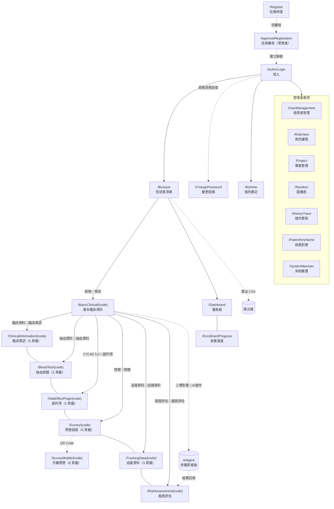

# CTMS 系統完整說明書

- 文件用途：把使用者操作、欄位參考與技術說明組裝成單一檔案，供交付、稽核與離線查閱
- 主要讀者：使用者、開發者、維運人員與稽核
- 對應系統版本：1.1.231 (2026/08/10)
- 最後核對日期：見各章節標頭（本檔為組裝產物，不另行對版）
- 編碼：UTF-8（繁體中文，含 BOM）

---

> 🔴 **本檔由 `scripts/Build-UserManual.ps1` 產生，請勿直接編輯。** 要改內容請改對應的來源檔，再重跑腳本；`scripts/Test-Docs.ps1` 會比對檔尾的來源雜湊，來源改了卻沒重跑就會檢查失敗。

## 目錄

### 導讀與畫面導覽

- [接手指南（新手快速上手）](#接手指南新手快速上手)
- [畫面導覽地圖](#畫面導覽地圖)

### 使用者篇：怎麼操作

- [新手入門：從收案到匯出](#新手入門從收案到匯出)
- [共通訊息與錯誤訊息](#共通訊息與錯誤訊息)
- [手機問卷（/SurveyMobile）](#手機問卷surveymobile)
- [收案進度（/EnrollmentProgress）](#收案進度enrollmentprogress)
- [我的筆記（/MyNote）](#我的筆記mynote)
- [系統維護（/SystemMaintain）](#系統維護systemmaintain)
- [角色與檢視權限（/RoleView）](#角色與檢視權限roleview)
- [使用者管理（/UserManagement）](#使用者管理usermanagement)
- [受試者清單（/Browser）](#受試者清單browser)
- [抽血檢驗（/BloodTest）](#抽血檢驗bloodtest)
- [建立帳號（/SignUp）](#建立帳號signup)
- [AI 風險評估（/RiskAssessment）](#ai-風險評估riskassessment)
- [病患對應（KeyName）（/PatientKeyName）](#病患對應keynamepatientkeyname)
- [追蹤資料與影像（/TrackingData）](#追蹤資料與影像trackingdata)
- [副作用（/SideEffectPage）](#副作用sideeffectpage)
- [問卷（/Questionnaire）](#問卷questionnaire)
- [問卷調查（/Survey）](#問卷調查survey)
- [基本臨床資料（/BasicClinical）](#基本臨床資料basicclinical)
- [專案管理（/Project）](#專案管理project)
- [登入（/Auths/Login）](#登入authslogin)
- [註冊（/Register）](#註冊register)
- [註冊審核（/ApprovalRegistration）](#註冊審核approvalregistration)
- [資料匯出（/Export）](#資料匯出export)
- [儀表板（/Dashboard）](#儀表板dashboard)
- [操作歷程（/HistoryTrace）](#操作歷程historytrace)
- [隨機表（/Random）](#隨機表random)
- [臨床資訊（/ClinicalInformation）](#臨床資訊clinicalinformation)
- [變更密碼（/ChangePassword）](#變更密碼changepassword)

### 欄位參考篇：每個頁籤的每個欄位

- [系統維護（`/SystemMaintain`）欄位參考](#系統維護systemmaintain欄位參考)
- [使用者管理（`/UserManagement`）欄位參考](#使用者管理usermanagement欄位參考)
- [受試者清單（`/Browser`）欄位參考](#受試者清單browser欄位參考)
- [抽血檢驗（`/BloodTest/{code}`）欄位參考](#抽血檢驗bloodtestcode欄位參考)
- [風險評估（`/RiskAssessment/{code}`）欄位參考](#風險評估riskassessmentcode欄位參考)
- [追蹤資料（`/TrackingData/{code}`）欄位參考](#追蹤資料trackingdatacode欄位參考)
- [副作用（`/SideEffectPage/{code}`）欄位參考](#副作用sideeffectpagecode欄位參考)
- [問卷調查（`/Survey/{code}`）與手機問卷（`/SurveyMobile/{code}`）欄位參考](#問卷調查surveycode與手機問卷surveymobilecode欄位參考)
- [基本臨床資料（`/BasicClinical/{code}`）欄位參考](#基本臨床資料basicclinicalcode欄位參考)
- [專案管理（`/Project`）與角色權限（`/RoleView`）欄位參考](#專案管理project與角色權限roleview欄位參考)
- [建立帳號（`/SignUp`）、註冊（`/Register`）與註冊審核（`/ApprovalRegistration`）欄位參考](#建立帳號signup註冊register與註冊審核approvalregistration欄位參考)
- [登入（`/Auths/Login`）與變更密碼（`/ChangePassword`）欄位參考](#登入authslogin與變更密碼changepassword欄位參考)
- [操作歷程（`/HistoryTrace`）與病患對應（`/PatientKeyName`）欄位參考](#操作歷程historytrace與病患對應patientkeyname欄位參考)
- [隨機表（`/Random`）欄位參考](#隨機表random欄位參考)
- [臨床資訊（`/ClinicalInformation/{code}`）欄位參考](#臨床資訊clinicalinformationcode欄位參考)

### 技術篇：資料怎麼被處理與紀錄

- [開發慣例與限制速查（AI／開發者必讀）](#開發慣例與限制速查ai開發者必讀)
- [啟動與初始化](#啟動與初始化)
- [領域資料模型](#領域資料模型)
- [Visit Code：資料結構與關聯](#visit-code資料結構與關聯)
- [問卷與抽血資料的建立與維護](#問卷與抽血資料的建立與維護)
- [外部服務串接](#外部服務串接)
- [資料讀寫與運作狀態落點](#資料讀寫與運作狀態落點)
- [認證授權與權限機制](#認證授權與權限機制)
- [文件維護規範](#文件維護規範)

---

## 導讀與畫面導覽

### 接手指南（新手快速上手）

- 文件用途：給非原始開發者的最快上手指南：系統在幹嘛、程式碼放哪、有哪些地雷
- 主要讀者：開發者與 AI 助手
- 對應系統版本：未核對（僅醫院相關敘述已對照 `HospitalRegistry` 核對）
- 最後核對日期：未核對（醫院敘述：2026/08/10）
- 編碼：UTF-8（繁體中文，含 BOM）

---

> 這份文件寫給**準備接手這套系統、但不是原始開發者**的人。目標是用最少時間讓你搞懂：這系統在幹嘛、資料長怎樣、程式碼放哪、我該從哪看起。看完這頁再依需要往深處鑽。

---

#### 1. 這系統到底在做什麼？（一分鐘版）

**CTMS = 婦科癌症臨床試驗管理平臺。** 給醫院的臨床試驗團隊用，管理「子宮內膜癌 / 卵巢癌」試驗中每位**受試者（病人）**的所有資料，並用 **AI 分析 CT 影像的骨骼肌**來評估風險、決定化療劑量。

服務多家合作醫院；⭐ 名單的唯一出處是 `HospitalRegistry.All`（見 [新增醫院](07-擴充指南/新增醫院.md)），這裡刻意不抄一份。

用白話講，它幫醫護做四件事：
1. **收案分組** — 病人進來，給編號，抽籤分到「實驗組（用 AI 輔助）」或「對照組」。
2. **登錄資料** — 病史、手術、化療、抽血、副作用、問卷……一次次回診累積。
3. **AI 風險評估** — 上傳 CT 影像，系統算出骨骼肌指標，判斷是否高風險、要不要降劑量，醫師簽核確認。
4. **匯出與稽核** — 把資料攤平匯出成 Excel 給研究分析，全程留操作紀錄。

---

#### 2. 誰在用？（角色）

| 角色 | 大概在做什麼 |
| --- | --- |
| CRC / 研究護理師 | 收案、登錄臨床資料、抽血、問卷 |
| 放射科醫師 | 確認 AI 影像分析結果並簽名 |
| 婦產科醫師 | 確認風險評估結果並簽名、決定劑量 |
| 系統管理員 | 開帳號、審核註冊、權限、隨機分組表維護 |

系統用**角色權限（ROLE...）**控制誰能看/改哪一頁。

---

#### 3. 一位受試者的資料生命週期（整體流程）

```
收案 ──► 產生受試者編號(如 NCKUH0001) ──► 亂數表抽籤分組(實驗/對照)
   │
   ▼
每次回診(Visit Code) 累積登錄：
   臨床資訊/病史 → 手術/病理 → 化療/用藥 → 抽血檢驗 → 副作用分級 → 問卷
   │
   ▼
上傳 CT 的 DICOM 影像 ──► AIAgent 背景服務跑 AI 模型 ──► 算骨骼肌指標
   │                                                    (SMI/SMD/SMA/IMAT…)
   ▼
判定「高風險 / 是否降 15% 劑量」 ──► 放射科 + 婦產科醫師雙簽核
   │
   ▼
匯出 Excel/CSV 給研究分析（全程留操作稽核歷程）
```

**關鍵概念：Visit Code（回診代碼）。** 幾乎所有臨床資料都掛在某一次回診下，同一位病人會有多筆。匯出時就是把「病人 × 每次回診」攤平成一列一列的大表。

---

#### 4. 這是什麼技術做的？（接手前先知道）

- **語言/框架**：C# / **.NET 9** + **Blazor Server**（網頁 UI 是 `.razor` 元件，邏輯在後端跑）。
- **UI 套件**：MudBlazor、Syncfusion、AntDesign（三套混用）。
- **資料庫**：**SQLite** + **EF Core**。⚠️ 重要特色：大部分臨床資料**不是拆成一堆資料表**，而是整包序列化成 **JSON 存在 `Patient.JsonData` 這個欄位**裡。所以你在資料庫看不到「抽血表」「化療表」，它們都在 JSON 裡。
- **AI 背景服務**：另有一支獨立的 **AIAgent** Worker 服務，專門輪詢資料夾、轉 DICOM 影像、跑 R 語言的 AI 模型。
- **執行環境**：Windows（用到 WCF、Windows 版 PDF 轉檔元件）。

---

#### 5. 程式碼怎麼分（我要改東西該去哪找）

方案（`src/CTMS/CTMS.sln`）有 9 個專案，記住這幾個就夠開始：

| 專案 | 是什麼 | 你何時會動它 |
| --- | --- | --- |
| **CTMS** | 主網站（所有畫面 `.razor` + 後端） | 改畫面、改流程 → 幾乎都在這 |
| **CTMS.Business** | 商業邏輯（各種 Service） | 改計算/判定邏輯 |
| **CTMS.DataModel** | 資料傳輸模型（DTO / JSON 結構） | 改欄位結構 |
| **CTMS.EntityModel** | EF Core 實體 + 資料庫遷移 | 改資料表、加 Migration |
| **CTMS.ExcelUtility** | Excel 匯入匯出 | 改匯出大表 |
| **AIAgent / AIAgent.Business** | 獨立 AI 背景服務 | 改 AI 推論管線 |

**找畫面的訣竅**：畫面在 `CTMS/Components/Pages/`（整頁）與 `CTMS/Components/Views/`（區塊）。例如個案清單邏輯在 [BrowseView.razor.cs](../src/CTMS/CTMS/Components/Views/Commons/BrowseView.razor.cs)。

---

#### 6. 幾個接手時容易踩到的地雷

- **醫院清單已集中化**：自 1.1.222 起醫院定義集中在 `HospitalRegistry`（`CTMS.Share/Helpers`），原本散落約 18 處的 `switch` / 連續 `if` 都改讀這份清單，新增醫院是「清單加一筆＋備妥資料檔」。🔴 但共用 prefix 的分院要設 `IsPrefixOwner = false`，設錯不會報錯、統計會默默算到母院。務必照 [新增醫院指南](07-擴充指南/新增醫院.md) 走。
- **資料在 JSON 裡**：直接查資料庫看不到臨床細節，要透過程式反序列化 `JsonData` 才看得懂。
- **`/Export` 頁是空殼**：真正能用的匯出按鈕在**個案清單（BrowseView）**上，不是那個看起來像匯出頁的 `/Export`。
- **有已知的小 UI 綁定瑕疵**（複製貼上殘留），詳見各模組文件的說明，接手後可視情況修。
- **改文件要補 BOM**：`docs/` 下所有 `.md` 必須是 UTF-8 **含 BOM**；提交前在本機跑 `pwsh scripts/Test-Docs.ps1`（⚠️ 沒有 CI，不會自動擋）。版本號每次建置要把最後一碼 +1。詳見 [文件維護規範](#文件維護規範)。

---

#### 7. 接下來看哪裡？（依你的目的）

| 你想做的事 | 去看 |
| --- | --- |
| 更完整理解系統與領域 | [系統總覽](01-系統總覽/系統總覽.md) |
| 了解整體架構與專案分層 | [解決方案架構](02-架構/解決方案架構.md)、[資料流與分層](02-架構/資料流與分層.md) |
| 搞懂資料長怎樣（JSON 結構） | [領域資料模型](#領域資料模型) |
| 改某個功能畫面 | [04-功能模組/](04-功能模組/) 對應文件（重點看「畫面商業邏輯」章） |
| 理解 AI 影像分析怎麼跑 | [AI 推論總覽](05-AI推論/overview.md)、[AIAgent 背景服務](05-AI推論/AIAgent背景服務.md) |
| 部署 / 環境設定 | [部署與環境設定](06-部署與維護/部署與環境設定.md) |
| 全部文件的索引 | [docs/README.md](README.md) |


---

### 畫面導覽地圖

- 文件用途：全系統路由的導覽關係、每條路徑的權限閘門，以及每個畫面為什麼存在、誰會用
- 主要讀者：所有人——使用者、開發者與 AI 助手
- 對應系統版本：1.1.230
- 最後核對日期：2026/08/10
- 編碼：UTF-8（繁體中文，含 BOM）

---

> 路由與文件的完整對照（含程式來源）在 [KM 覆蓋矩陣](KM/README.md)。本文件回答的是**怎麼走到那裡、需要什麼權限、為什麼需要這個畫面**。

#### 一、全系統導覽圖



🔑 ＝ 該條導覽線的權限閘門（`BottomNavigationView` 的 `CheckShowPage`）。

#### 二、六個切換鈕與它們的權限

進入某位受試者後，畫面底部固定有六個彩色切換鈕（`BottomNavigationView`）：

| 按鈕文字 | 目的地 | 按鈕檢查的權限 | 目的頁檢查的權限 |
| --- | --- | --- | --- |
| 🧾 臨床資料 | `/ClinicalInformation/{code}` | 🔴 `臨床資訊` | 🔴 `臨床資料` |
| 💉 抽血資料 | `/BloodTest/{code}` | `抽血資料` | `抽血資料` |
| 🧮 CTCAE 5.0 | `/SideEffectPage/{code}` | `副作用` | `副作用` |
| 📝 問卷 | `/Survey/{code}` | `問卷` | `問卷` |
| 🔄 追蹤資料 | `/TrackingData/{code}` | `追蹤資料` | `追蹤資料` |
| ⚠️ 風險評估 | `/RiskAssessment/{code}` | `風險評估` | `風險評估` |

##### 🔴 第一列的按鈕與頁面檢查的是**兩個不同的權限**

「臨床資料」按鈕檢查 `ROLE臨床資訊`（值 `臨床資訊`），但 `/ClinicalInformation` 這一頁自己檢查的是 `ROLE臨床資料`（值 `臨床資料`）。造成兩種怪現象：

| 使用者權限 | 會發生什麼 |
| --- | --- |
| 有「臨床資訊」、沒有「臨床資料」 | 按鈕按得下去，導過去後看到「你沒有權限存取此頁面」 |
| 有「臨床資料」、沒有「臨床資訊」 | 按鈕被擋住，但**直接輸入網址可以進去** |

其餘五條路徑的按鈕與頁面權限一致。

#### 三、每個畫面為什麼需要、誰會用

##### 入口與總覽

| 畫面 | 為什麼需要 | 誰會用 |
| --- | --- | --- |
| [登入](#登入authslogin) | 系統入口，決定你是誰、能看到什麼 | 所有人 |
| [受試者清單](#受試者清單browser) | 日常工作的主入口：找人、收案、匯出 | 研究護理師、醫師、管理者 |
| [儀表板](#儀表板dashboard) | 一眼看收案進度與分組分布 | PI、管理者 |
| [收案進度](#收案進度enrollmentprogress) | 醫院 × 癌別 × 期別 × 組別交叉表，供研究簡報截圖 | PI、研究助理 |

##### 一位受試者的資料

| 畫面 | 為什麼需要 | 誰會用 |
| --- | --- | --- |
| [基本臨床資料](#基本臨床資料basicclinical) | 收案後的第一站；**填妥癌別與分期才會進入隨機分組** | 研究護理師 |
| [臨床資訊](#臨床資訊clinicalinformation) | 手術、病理、化療、用藥、病史的登錄處 | 研究護理師 |
| [抽血檢驗](#抽血檢驗bloodtest) | 檢驗數值登錄；也是**血液副作用分級的數值來源** | 研究護理師 |
| [副作用](#副作用sideeffectpage) | 依 CTCAE 5.0 判讀副作用嚴重度 | 研究護理師、醫師 |
| [問卷調查](#問卷調查survey) ／ [手機問卷](#手機問卷surveymobile) | 收集受試者自填資料；手機版供受試者掃 QR 自填 | 研究護理師／受試者本人 |
| [追蹤資料](#追蹤資料與影像trackingdata) | 主治療之外的縱向追蹤 | 研究護理師 |
| [風險評估](#ai-風險評估riskassessment) | 看 AI 骨骼肌分析結果並由兩位醫師簽核 | 放射科醫師、婦產科醫師 |

##### 管理者專用

| 畫面 | 為什麼需要 | 誰會用 |
| --- | --- | --- |
| [使用者管理](#使用者管理usermanagement) | 開帳號、設角色、停用離職者 | 系統管理者 |
| [角色權限](#角色與檢視權限roleview) | 定義每個角色能看到哪些功能 | 系統管理者 |
| [專案管理](#專案管理project) | 維護試驗計畫清單 | 系統管理者 |
| [隨機表](#隨機表random) | 檢視與校正受試者與隨機分組的對應 | 系統管理者 |
| [操作歷程](#操作歷程historytrace) | 稽核軌跡，滿足臨床試驗的可追溯性要求 | 系統管理者、稽核 |
| [病患對應](#病患對應keynamepatientkeyname) | 下載 AI 結果、變更病歷號 | 系統管理者 |
| [系統維護](#系統維護systemmaintain) | 測試醫院 WCF 介面、一次性資料修復 | 維運人員 |

##### 沒有使用手冊的四個路由

`/`（首頁轉址）、`/Auths/Logout`（登出處理）、`/Error`（系統錯誤頁）、`/Sample`（開發範例頁）——沒有使用者可操作的內容。

#### 四、⚠️ 導覽上的三個坑

1. 🔴 **「臨床資料」按鈕與目的頁權限不一致**（見第二節）。
2. ⚠️ **六個切換鈕之間可以互相跳**，但都必須先從受試者清單進入某位受試者；直接輸入 `/BloodTest` 而不帶 `{code}` 不會有畫面。
3. ⚠️ **`/Export` 是空殼**：側邊選單看得到，但真正的匯出按鈕在受試者清單上。


---

## 使用者篇：怎麼操作

### 新手入門：從收案到匯出

- 文件用途：用一位受試者的完整流程，把 26 份分散的畫面手冊串成一條路
- 主要讀者：第一次使用本系統的研究護理師、醫師與管理者
- 對應系統版本：1.1.229
- 最後核對日期：2026/08/10
- 編碼：UTF-8（繁體中文，含 BOM）

---

這份是**流程書**：從頭讀到尾，你會知道一位受試者從進來到資料交出去，中間會經過哪些畫面、每一步的重點是什麼。

⚠️ 這裡**不重複**任何欄位與按鈕的細節——那些寫在各畫面自己的手冊裡，需要時點進去看。同一件事只寫在一個地方，你才不會遇到兩份文件講不一樣。

#### 全流程一眼看完

```
登入
 └─► 受試者清單 ──► 新增受試者（自動產生病人編號）
                      │
                      ▼
                 基本臨床資料（填癌別與分期）──► 系統進行隨機分組
                      │
                      ▼
        每次回診（Visit Code）逐次累積登錄：
        臨床資訊 → 抽血檢驗 → 副作用 → 問卷 → 追蹤資料
                      │
                      ▼
        上傳 CT 影像 ──► AI 分析骨骼肌 ──► 風險評估結果
                      │
                      ▼
        放射科醫師簽名 ＋ 婦產科醫師簽名
                      │
                      ▼
        從受試者清單匯出 Excel／CSV 給統計分析
```

#### 第 1 步：登入

從 [登入](#登入authslogin) 進入系統。

- ⚠️ 「使用者帳號不存在」和「密碼不正確」是**兩句不同的訊息**。看到前者就別再試密碼了，那是帳號打錯或還沒開通。
- 還沒有帳號：走 [註冊](#註冊register) 送申請，再由管理者在 [註冊審核](#註冊審核approvalregistration) 建立帳號。
- 密碼還是預設值時，系統會要求你先到 [變更密碼](#變更密碼changepassword) 改掉。

#### 第 2 步：收案——新增一位受試者

在 [受試者清單](#受試者清單browser) 按「新增受測者資料」，選院別與收案日期。

- 系統會**自動產生病人編號**（例如 `NCKUH0001`），開頭英文代表收案醫院，不需要也不應該自己編。
- 這個清單是你日後的主要入口：找人、改資料、切換收案／退出狀態、匯出，都從這裡開始。

#### 第 3 步：填基本資料，讓系統分組

點進該位受試者，進入 [基本臨床資料](#基本臨床資料basicclinical)。

- **填妥癌別與分期，才會進入隨機分組。** 這是整個流程的關卡：資料沒填齊，後面的組別就不會出現。
- 分組結果（實驗組／對照組）由系統依隨機表決定。管理者可在 [隨機表](#隨機表random) 檢視與校正對應關係。

#### 第 4 步：每次回診，逐步登錄資料

從這裡開始，所有資料都掛在**某一次回診（Visit Code）**之下。同一位受試者會有很多筆，各自屬於不同回診。

| 要登錄什麼 | 去哪個畫面 |
| --- | --- |
| 手術、病理報告、化療、合併用藥、病史 | [臨床資訊](#臨床資訊clinicalinformation) |
| 血液與生化檢驗數值 | [抽血檢驗](#抽血檢驗bloodtest) |
| 副作用嚴重程度（CTCAE 分級） | [副作用](#副作用sideeffectpage) |
| 各類問卷（研究人員代填） | [問卷調查](#問卷調查survey) |
| 各類問卷（受試者自己用手機填） | [手機問卷](#手機問卷surveymobile) |
| 主治療之外的其他治療、藥物與追蹤影像 | [追蹤資料](#追蹤資料與影像trackingdata) |

⚠️ **先確認自己在正確的 Visit Code 上再輸入。** 填錯回診不會有任何警告，資料會安靜地存到別次去。

#### 第 5 步：AI 風險評估與雙醫師簽核

上傳 CT 影像後，系統會送去做 AI 骨骼肌分析，結果呈現在 [風險評估](#ai-風險評估riskassessment)。

- 送出時畫面會說「已經將此紀錄送至 AI 推論中」——那是**送出**，不是完成。分析要花時間，稍後回來重新整理才看得到結果。
- 結果要由**放射科醫師**與**婦產科醫師各簽一次**。兩個確認框的文字只差「放射科／婦產科」幾個字，按之前先看清楚自己是哪個角色。

#### 第 6 步：匯出資料

回到 [受試者清單](#受試者清單browser)，用上方的匯出按鈕。

- 🔴 **匯出永遠針對全部受試者，不會只匯出你目前篩選出來的那些。** 篩選只影響畫面上看到的清單。
- ⚠️ 側邊選單裡的「[資料匯出](#資料匯出export)」（`/Export`）目前是**空殼**，按鈕沒有作用。真正能用的匯出在受試者清單上。

#### 隨時可以看的

| 想知道什麼 | 去哪 |
| --- | --- |
| 現在收了多少人、各組多少 | [儀表板](#儀表板dashboard) |
| 醫院 × 癌別 × 期別 × 組別的交叉統計 | [收案進度](#收案進度enrollmentprogress) |
| 誰在什麼時候改了什麼（管理者） | [操作歷程](#操作歷程historytrace) |
| 記一下自己的備忘 | [我的筆記](#我的筆記mynote) |

#### 遇到看不懂的錯誤訊息

先查 [共通訊息與錯誤訊息](#共通訊息與錯誤訊息)——儲存、修改、刪除失敗的訊息都集中在那裡。查不到再看該畫面手冊的「狀態與訊息」章節。

#### 三個最容易踩到的地雷

1. 🔴 **匯出不受篩選影響**——以為匯出的是篩選結果，拿到的其實是全部。
2. ⚠️ **Visit Code 選錯不會有警告**——資料會安靜地存到別次回診。
3. ⚠️ **「送出 AI 推論」不等於「分析完成」**——訊息只代表送出成功。

> 全部畫面的清單與各自的手冊，見 [KM 索引](KM/README.md)。


---

### 共通訊息與錯誤訊息

- 文件用途：所有畫面共用的資料存取錯誤訊息一覽，供使用者以畫面上看到的文字回頭查詢
- 主要讀者：系統使用者（研究護理師、醫師、管理者）
- 對應系統版本：1.1.229
- 最後核對日期：2026/08/10
- 編碼：UTF-8（繁體中文，含 BOM）

---

系統的**儲存、修改、刪除**動作失敗時，畫面會跳出一個「警告」或「錯誤」對話框，內容是下表這幾句其中一句。它們不屬於某一個畫面——**任何畫面都可能出現**，所以集中寫在這裡，各畫面文件不重複列出。

> 下列文字**逐字取自程式碼**，可直接複製到搜尋列比對。

#### 一、儲存與修改失敗

| 畫面文字 | 白話意思 | 你該怎麼辦 |
| --- | --- | --- |
| 要新增的紀錄已經存在無法新增 | 這筆資料的關鍵欄位與既有資料重複 | 改一個不重複的值，或改用「修改」既有那一筆 |
| 要修改的紀錄已經存在無法修改 | 改完之後會與另一筆資料重複 | 換一個不重複的值 |
| 要更新的紀錄 發生同時存取衝突 已經不存在資料庫上 | 你在編輯的同時，別人把這筆刪掉了 | 重新整理畫面，確認資料是否還在 |
| 無法修改紀錄 | 系統找不到要修改的那一筆 | 重新整理畫面後再試一次 |
| 新增記錄發生例外異常 | 系統內部錯誤 | 重試一次；仍失敗請記下當時的操作並回報 |
| 修改記錄發生例外異常 | 系統內部錯誤 | 同上 |

#### 二、刪除失敗

| 畫面文字 | 白話意思 | 你該怎麼辦 |
| --- | --- | --- |
| 無法刪除紀錄 | 系統找不到要刪除的那一筆 | 重新整理畫面 |
| 無法刪除紀錄 要刪除的紀錄已經不存在資料庫上 | 這筆已經被刪掉了 | 重新整理畫面 |
| 該紀錄無法刪除因為有其他資料表在使用中 | 有其他資料正在引用它（例如角色仍被帳號使用） | 先解除引用（例如把帳號改成別的角色）再刪 |
| 刪除記錄發生例外異常 | 系統內部錯誤 | 重試；仍失敗請回報 |

#### 三、帳號相關的保護訊息

| 畫面文字 | 什麼情況會看到 |
| --- | --- |
| 開發者帳號不可以被新增 | 想新增一個帳號名稱為 `support` 的帳號 |
| 開發者帳號不可以被刪除 | 想刪除 `support` 帳號 |
| 開發者帳號不可以被停用 | 想把 `support` 帳號改成停用 |
| 使用者帳號不存在 | 登入時輸入的帳號不存在 |
| 密碼不正確 | 登入時密碼錯誤 |

#### 四、⚠️ 兩個容易誤會的地方

- ⚠️ **「要更新的紀錄 發生同時存取衝突」不代表你操作錯誤**，而是同一筆資料被兩個人同時動到。重新整理後確認別人改了什麼，再決定要不要覆蓋。
- ⚠️ 訊息中出現「紀錄」「記錄」兩種寫法（例如「無法刪除紀錄」與「刪除記錄發生例外異常」），這是程式裡原本的用字差異。**搜尋時請照畫面上看到的字**，不要自行代換。

> 各畫面**自己特有的**訊息寫在該畫面的文件裡，見 [KM 索引](KM/README.md)。


---

### 手機問卷（/SurveyMobile）

- 文件用途：使用者操作說明：/SurveyMobile 手機版受試者自填問卷 的欄位、按鈕與常見問答
- 主要讀者：系統使用者（研究護理師、醫師、管理者）
- 對應系統版本：未核對（沿用建立時內容）
- 最後核對日期：未核對
- 編碼：UTF-8（繁體中文，含 BOM）

---

#### 這個畫面是做什麼的？

這是**手機版的問卷填答頁**，設計給**受試者本人用自己的手機**填答用。通常受試者是從研究人員提供的 QR Code 掃描、或點手機連結進來的。

進來後就是一排問卷分頁，受試者可以直接在手機上逐份作答：

- 化療副作用、標靶副作用、放療副作用
- WHOQOL 問卷
- 個人史、家族史
- 生活品質、健康

和電腦版的「[問卷調查](#問卷調查survey)」相比，這個手機版**刻意做得比較單純**：沒有上方的系統標題列、沒有「返回上頁」、沒有 QR Code 分頁，也沒有下方那排跳其他畫面的按鈕，讓受試者專心填問卷就好。

#### 怎麼進到這個畫面？

- **不需要登入、也不需要權限**。受試者只要掃描研究人員提供的 QR Code，或點開「手機填寫連結」，就會直接進到自己的填答頁。
- 這個連結是研究人員在電腦版「問卷調查」畫面的「QR Code」分頁產生的，對應的就是這一位受試者。

#### 畫面欄位說明

##### 分頁（畫面上方一排標籤，每一個是一份問卷）

| 分頁 | 這是什麼問卷 |
| --- | --- |
| 化療副作用 | 化療期間的副作用自填問卷。 |
| 標靶副作用 | 標靶治療的副作用問卷。 |
| 放療副作用 | 放射治療的副作用問卷。 |
| WHOQOL 問卷 | 世界衛生組織生活品質問卷。 |
| 個人史 | 個人病史（例如是否停經、抽菸習慣等）。 |
| 家族史 | 家族疾病史。 |
| 生活品質 | 生活品質相關問卷（周邊神經症狀）。 |
| 健康 | 健康狀態問卷。 |

> 手機版沒有「QR Code」這個分頁（QR Code 是給研究人員在電腦上產生的）。

##### 每份問卷內的題目

| 欄位 | 這是什麼意思 | 怎麼填 / 範例 | 必填 |
| --- | --- | --- | --- |
| 題號 | 每一題前面的編號（例如 7.0、7.1）。 | 系統顯示，不用填。 | 否 |
| 題目 | 這一題要問的內容。 | 系統顯示，不用填。 | 否 |
| 選項題 | 有選項的題目，會列出可點選的項目。 | 直接點你要的那一項，點了會打勾（每題只能選一項）。 | 依問卷 |
| 填空題 | 沒有選項的題目，會出現一個輸入框。 | 直接在框內輸入文字（例如年紀、身高、體重、菸齡等）。 | 依問卷 |

> 有些題目會**依前一題的答案自動出現或隱藏**。例如「是否停經」選「是」，才會接著出現後續相關題目；選「否」就不會出現。

#### 按鈕與操作說明

| 按鈕 | 做什麼 | 誰可以用 |
| --- | --- | --- |
| 儲存（各問卷分頁下方） | 把目前這份問卷填的答案存檔，存好會跳出「儲存成功」。 | 受試者本人（掃 QR 後直接使用） |

> 手機版沒有「返回上頁」，也沒有跳去其他畫面的按鈕，只需要專心填問卷、按「儲存」即可。

#### 常見操作步驟

##### 我是受試者，我想用手機填問卷
1. 掃描研究人員給的 QR Code，或點開他傳給你的「手機填寫連結」。
2. 進到畫面後，從上方分頁點你要填的那一份問卷。
3. 逐題作答：有選項的直接點，沒選項的在框內打字。
4. 填完後按下方的「儲存」，看到「儲存成功」就完成這一份。
5. 其他分頁的問卷也用同樣方式填、分別儲存。

##### 我想確認每份問卷都存好了
1. 每填完一份，按該分頁的「儲存」並確認出現「儲存成功」。
2. 再切換到下一個分頁繼續填。

#### 狀態與訊息

> 下列文字**逐字取自程式碼**，可直接用畫面上看到的字回頭搜尋；`{ }` 內是執行時才代入的實際值。

| 出現時機 | 類型 | 畫面上的文字 |
| --- | --- | --- |
| 任何一份問卷按儲存 | 訊息框 | 標題「資訊」／內容「儲存成功」 |

⚠️ 各問卷分頁共用同一句「儲存成功」，不會標明存的是哪一份。

> 儲存、修改或刪除失敗時出現的共通訊息（例如「要新增的紀錄已經存在無法新增」）集中在 [共通訊息與錯誤訊息](#共通訊息與錯誤訊息)，本頁不重複列出。

#### 常見問答（FAQ）

**Q：我需要帳號密碼才能填手機問卷嗎？**
A：不需要。手機問卷是給受試者本人掃 QR 後直接填答，不用登入。

**Q：手機版為什麼比電腦版少了幾個分頁和按鈕？**
A：手機版是特別為受試者自己填答簡化過的，所以沒有 QR Code 分頁、沒有「返回上頁」、也沒有跳到其他畫面的那排按鈕，讓你專心作答。

**Q：換到別的分頁前，剛填的會不會不見？**
A：每份問卷分頁各自有「儲存」。換分頁前請先按「儲存」、確認看到「儲存成功」，才不會漏存。

**Q：為什麼有些題目一開始沒出現，選了某個答案後才冒出來？**
A：這是正常設計。部分題目會依你前一題的答案自動顯示或隱藏。

**Q：我在手機上填的答案，研究人員看得到嗎？**
A：看得到。你透過這個手機連結填的答案，會存回同一位受試者，研究人員在電腦版「問卷調查」畫面就能看到。

**Q：這個連結可以給別人用嗎？**
A：不建議。這個連結對應的就是你這一位受試者，填的答案會算在你身上，請勿轉給其他人填。


---

### 收案進度（/EnrollmentProgress）

- 文件用途：使用者操作說明：/EnrollmentProgress 收案交叉統計表 的欄位、按鈕與常見問答
- 主要讀者：系統使用者（研究護理師、醫師、管理者）
- 對應系統版本：未核對（沿用建立時內容）
- 最後核對日期：未核對
- 編碼：UTF-8（繁體中文，含 BOM）

---

#### 這個畫面是做什麼的？

這是一張**收案進度總表**，把目前試驗的收案人數，依「醫院 → 癌別 → 期別 → 分組」層層拆開，用一張表格一次呈現。它主要是給你**做進度報告、直接截圖放進簡報**用的。

表格上會告訴你：

- 每一家醫院、每一種癌別、每一個期別，各收了多少對照組、多少實驗組。
- 每家醫院的**小計人數**，以及全部醫院合起來的**總計人數**。
- 兩個計畫預定的里程碑目標人數（期中分析、期末分析），方便對照目前進度離目標還差多少。

這個畫面只用來**看**，沒有任何可以填寫或修改的欄位。

#### 怎麼進到這個畫面？

- 直接在網址列輸入結尾為 `/EnrollmentProgress` 的網址。
- 這個畫面**沒有放進任何選單**，所以只能靠輸入網址進入。
- 進入後系統會即時重新統計一次，稍等「統計中…」跑完就會出現表格。

#### 畫面欄位說明

整張表由上而下分成「分層」「分組」「小計與總計」「里程碑」四個區塊：

| 表格區塊 | 這是什麼意思 |
| --- | --- |
| ① 分層－醫院 | 最上面一排，把收案醫院分成三家：成大、郭綜合、奇美（柳營奇美會併入奇美一起算）。 |
| ① 分層－癌別 | 每家醫院底下再分兩種癌別：卵巢癌、內膜癌。 |
| ① 分層－期別 | 每種癌別底下再分四個期別：I、II、III、IV。 |
| ② 分組－對照組 | 該格條件下，分到對照組的人數。 |
| ② 分組－實驗組 | 該格條件下，分到實驗組的人數。 |
| 小計收案數 | 該家醫院所有格子加起來的人數。 |
| 總計收案數（至 …） | 各醫院小計再加總的全試驗人數；括號內是統計的基準日，以民國年顯示（例如 115.08.04）。 |
| 啟動期中分析（116.01） | 計畫預定的里程碑：期中分析啟動目標為 206 人。此為固定目標值，不是目前人數。 |
| 啟動期末分析（116.07） | 計畫預定的里程碑：期末分析啟動目標為 294 人。此為固定目標值，不是目前人數。 |

> 表格裡的格子如果是 0，會直接**留白**不顯示數字，這樣截圖比較清爽。

> 如果有些人已經收案、也已經分組，但因為醫院、癌別或期別資料還沒填齊，沒辦法歸到任何一格，表格下方會出現一行小字，說明有幾筆因此沒被列進表內。

#### 常見操作步驟（我想做…要怎麼做）

##### 我想擷取最新的收案進度做報告
1. 在網址列輸入結尾為 `/EnrollmentProgress` 的網址進入。
2. 等「統計中…」跑完，表格出現後，數字就是進入當下的最新統計。
3. 用電腦的截圖工具把整張表格擷取下來，貼進簡報即可。

#### 狀態與訊息

這個畫面是唯讀的交叉統計表，**沒有自己的提示訊息**（程式內沒有任何訊息框或確認框）。

⚠️ 待補（尚未查證）：資料載入失敗時畫面會怎麼呈現。

> 儲存、修改或刪除失敗時出現的共通訊息（例如「要新增的紀錄已經存在無法新增」）集中在 [共通訊息與錯誤訊息](#共通訊息與錯誤訊息)，本頁不重複列出。

#### 常見問答（FAQ）

**Q：這張表的人數，和儀表板上看到的人數為什麼對不起來？**
A：這張表**只算已經隨機分組（對照組或實驗組）的收案者**。儀表板的「總病例數」還包含已收案但尚未分組的人，所以儀表板的數字通常會比這張表的總計來得多。這是正常的，兩邊的口徑不一樣。

**Q：我剛新增的受試者，為什麼沒出現在這張表裡？**
A：因為他還沒完成隨機分組。只有已經分到對照組或實驗組的人才會被算進這張表。要進入分組，得先幫他把癌別與期別填好。

**Q：有些格子是空的，是資料漏掉了嗎？**
A：不是。人數為 0 的格子會刻意留白，不顯示 0，只是表示那個組合目前還沒有人而已。

**Q：「啟動期中分析 206 人」「啟動期末分析 294 人」是目前收到的人數嗎？**
A：不是。這兩個數字是計畫**預先訂好的里程碑目標人數**，固定不變，是拿來和目前總計人數對照、看還差多少的。

**Q：括號裡的日期（例如 115.08.04）是什麼？**
A：那是這次統計的基準日，也就是你進入畫面、系統重算的那一天，以民國年顯示。

**Q：表格下方出現「另有 N 筆…未列入表格」是什麼意思？**
A：代表有 N 位受試者雖然已收案也已分組，但他的醫院、癌別或期別其中一項還沒填，系統無法把他歸到表格的某一格，所以先不列入。把缺的資料補齊後，他就會出現在對應格子裡。


---

### 我的筆記（/MyNote）

- 文件用途：使用者操作說明：/MyNote 個人記事 的欄位、按鈕與常見問答
- 主要讀者：系統使用者（研究護理師、醫師、管理者）
- 對應系統版本：未核對（沿用建立時內容）
- 最後核對日期：未核對
- 編碼：UTF-8（繁體中文，含 BOM）

---

#### 這個畫面是做什麼的？

這是一個簡單的**個人記事**畫面，讓你把想記下來的事情建立成一筆一筆的筆記。你可以在這裡：

- **新增**一筆筆記。
- **修改**已建立的筆記名稱。
- **刪除**不需要的筆記。
- 用**分頁**瀏覽所有筆記。

#### 怎麼進到這個畫面？

- 網址：`/MyNote`。

#### 畫面欄位說明

##### 清單欄位（每一筆筆記一列）

| 欄位 | 這是什麼意思 |
| --- | --- |
| 代號 | 系統給每筆筆記的編號。 |
| 名稱 | 這筆筆記的名稱（內容）。 |

##### 新增／編輯欄位（點「新增」或「Edit」才會出現）

| 欄位 | 怎麼填 / 範例 | 必填 |
| --- | --- | --- |
| 記事名稱 | 輸入你要記下的內容，例如「下週回診提醒」。 | 是 |

#### 按鈕與操作說明

| 按鈕 | 做什麼 | 誰可以用 |
| --- | --- | --- |
| 新增 | 打開視窗，建立一筆新的筆記。 | 全部 |
| Edit（每列） | 打開視窗，修改該筆筆記的名稱。 | 全部 |
| Delete（每列） | 刪除該筆筆記。 | 全部 |
| 儲存 | 在新增／編輯視窗中，把內容存起來。 | 全部 |
| 關閉 | 關掉視窗，不做變更。 | 全部 |

#### 常見操作步驟

##### 我想新增一筆筆記
1. 點「新增」。
2. 在「記事名稱」欄輸入內容。
3. 按「儲存」。清單就會出現這筆新筆記。

##### 我想修改一筆筆記
1. 在清單找到那一列，點「Edit」。
2. 修改「記事名稱」。
3. 按「儲存」。

##### 我想刪除一筆筆記
1. 在該列點「Delete」。
2. 該筆筆記就會從清單移除。

##### 我想看更多筆記
1. 清單一頁顯示固定筆數，用清單下方的分頁切換頁面，即可瀏覽其他筆記。

#### 狀態與訊息

這個畫面的程式內**沒有訊息框或確認框**。

⚠️ 待補（尚未查證）：刪除筆記時是否有任何確認提示。**在確認之前，請把刪除當成不可復原的動作。**

> 儲存、修改或刪除失敗時出現的共通訊息（例如「要新增的紀錄已經存在無法新增」）集中在 [共通訊息與錯誤訊息](#共通訊息與錯誤訊息)，本頁不重複列出。

#### 常見問答（FAQ）

**Q：新增筆記時「代號」要自己填嗎？**
A：不用。代號由系統自動給，你只要填「記事名稱」即可。

**Q：按「關閉」和按「儲存」有什麼不同？**
A：「儲存」會把你輸入的內容存起來；「關閉」只是關掉視窗、不會存任何變更。

**Q：刪除筆記會跳確認嗎？**
A：點「Delete」會直接刪除該筆筆記，操作前請確認是不是真的要刪。


---

### 系統維護（/SystemMaintain）

- 文件用途：使用者操作說明：/SystemMaintain 連線測試與一次性資料修復 的欄位、按鈕與常見問答
- 主要讀者：系統使用者（研究護理師、醫師、管理者）
- 對應系統版本：未核對（沿用建立時內容）
- 最後核對日期：未核對
- 編碼：UTF-8（繁體中文，含 BOM）

---

#### 這個畫面是做什麼的？

這是給**系統管理者**使用的維護工具頁。它把幾類「一次性修復／重建」與「連線測試」的工作集中在同一頁，主要用來：

- **測試**系統與醫院檢驗系統之間的連線是否正常，並試查某位病人的抽血檢驗資料。
- 針對過去累積的資料做**一次性修正**（例如補齊缺漏的抽血單位、修正某院的檢驗參考區間、補正問卷筆數等）。
- 在特殊情況下，把某醫院的**隨機表重建**（例如把高榮、嘉長的隨機表比照奇美完全重做）。

> 這頁上的按鈕多半是「執行一次就會實際改動資料」的維護動作，不是日常操作。**執行前請務必確認**，並在確定需要時才按。

#### 怎麼進到這個畫面？（含所需權限）

- 網址：`/SystemMaintain`。
- **限管理者**使用。若你不是管理者，畫面會顯示「你沒有權限存取此頁面」，看不到任何維護按鈕。

#### 畫面欄位說明

畫面上半部是「檢驗系統連線測試」區，需要你填以下欄位後再按查詢：

| 欄位 | 這是什麼意思 | 怎麼填 / 範例 | 必填 |
| --- | --- | --- | --- |
| Chart No | 要查詢的那位病人的病歷號。 | 直接輸入病歷號。 | 是 |
| Begin Time / bg | 查詢的**起始日期**。 | 年月日八碼，例如 `20240101`。 | 是 |
| End Time / ed | 查詢的**結束日期**。 | 年月日八碼，例如 `20241231`。 | 是 |

> 查詢完成後，畫面下方會列出查到的資料表與內容，並可展開查看原始回傳資料，用來確認連線與資料是否正確。

#### 按鈕與操作說明

| 按鈕 | 做什麼 | 誰可以用 |
| --- | --- | --- |
| 測試 API | 測試系統對外連線是否正常。 | 僅管理者 |
| 呼叫 SYSPOWER API | 依上方填的病歷號與起訖日期，向醫院檢驗系統查詢該病人的抽血檢驗資料，並把結果顯示在下方。用來確認連線與資料是否正確。 | 僅管理者 |
| 奇美與郭綜合抽血項目修正 | 一次性修正奇美、郭綜合兩家醫院既有的抽血項目資料。 | 僅管理者 |
| Whooqol問卷缺少數量的修正 | 一次性補正生活品質問卷（WHOQOL）筆數不足的資料。 | 僅管理者 |
| 2026/03/26 修正成大的 eGFR參考區間是>=60 | 一次性把成大醫院抽血生化「eGFR」的參考區間更新為「大於等於 60」。 | 僅管理者 |
| 補齊既有抽血血液/生化單位 | 一次性把過去缺少單位的抽血血液／生化資料補上單位。 | 僅管理者 |
| 高榮/嘉長隨機表比照奇美（複製） | 把高榮、嘉長兩家醫院的隨機表**移除既有項目後，比照奇美完全重建**（複製奇美的排列內容）。只適用於這兩院「還沒有任何受試者被配號」的情況。 | 僅管理者 |

> 除了上方的連線測試外，其餘每一個按鈕都會**實際改動系統資料**，且多半是「一次性」的修復或重建。請在確認確有需要時才執行。

#### 常見操作步驟

##### 我想測試檢驗系統的連線、試查一位病人的檢驗資料
1. 在「Chart No」輸入病人的病歷號。
2. 在「Begin Time / bg」「End Time / ed」分別輸入查詢的起、迄日期（八碼，如 `20240101`）。
3. 按「呼叫 SYSPOWER API」。
4. 等畫面下方出現查詢結果後，展開資料表確認內容是否正確。

##### 我想執行某一項資料修正
1. 先確認這項修正**確實需要執行**（這些多半是一次性動作）。
2. 找到對應按鈕（例如「補齊既有抽血血液/生化單位」）並按下。
3. 依畫面提示的訊息或確認框完成。

##### 我想把高榮、嘉長的隨機表比照奇美重建
1. 先確認高榮、嘉長這兩院**目前還沒有任何受試者被配到隨機組別**（此動作會清掉這兩院既有的隨機表項目）。
2. 按「高榮/嘉長隨機表比照奇美（複製）」。
3. 系統會移除這兩院既有的隨機表項目，並比照奇美重新建立。

#### ✍️ 命名與填寫建議

- 日期欄位接受三種格式：`yyyyMMdd`、`yyyy-MM-dd`、`yyyy/MM/dd`，擇一即可。
- 呼叫醫院介面前**必須先填病歷號（chartNo）**。

#### 狀態與訊息

> 下列文字**逐字取自程式碼**，可直接用畫面上看到的字回頭搜尋；`{ }` 內是執行時才代入的實際值。

這個畫面的訊息**不是跳出對話框，而是直接顯示在按鈕下方的色塊裡**（藍色為一般資訊、黃色為警告）。

| 出現時機 | 類型 | 畫面上的文字 |
| --- | --- | --- |
| 沒填病歷號就呼叫 | 藍色資訊 | 請先輸入 chartNo。 |
| 呼叫完成 | 藍色資訊 | WCF 呼叫完成。 |
| 呼叫完成但用藥日期格式錯 | 藍色資訊 | LIS WCF 呼叫完成；用藥查詢日期格式錯誤：{錯誤說明} |
| 呼叫失敗 | 藍色資訊 | WCF 呼叫失敗：{錯誤說明} |
| 回應解析不出資料 | 黃色警告 | 沒有解析到任何 DataTable，請先查看 Raw XML。 |
| 回應格式有問題 | 黃色警告 | XML 解析失敗：{錯誤說明} |
| 開始日期格式錯 | 畫面訊息 | 開始日期請輸入 yyyyMMdd、yyyy-MM-dd 或 yyyy/MM/dd。 |
| 結束日期格式錯 | 畫面訊息 | 結束日期請輸入 yyyyMMdd、yyyy-MM-dd 或 yyyy/MM/dd。 |

⚠️ 「WCF 呼叫完成。」只代表**呼叫這個動作完成**，不代表真的查到資料。有沒有資料要看下方的結果表格。

> 儲存、修改或刪除失敗時出現的共通訊息（例如「要新增的紀錄已經存在無法新增」）集中在 [共通訊息與錯誤訊息](#共通訊息與錯誤訊息)，本頁不重複列出。

#### 常見問答（FAQ）

**Q：這頁的按鈕我可以隨便按嗎？**
A：不建議。除了上方的連線測試外，其他按鈕都會實際改動系統資料，而且大多是「一次性修復／重建」。請在確定需要、並了解它會做什麼之後再執行。

**Q：為什麼我進來只看到「你沒有權限存取此頁面」？**
A：這頁只開放給管理者。若你不是管理者就無法使用，請洽系統管理者。

**Q：「呼叫 SYSPOWER API」查不到資料怎麼辦？**
A：先確認病歷號、起訖日期是否正確（日期要八碼，例如 `20240101`），再重試。若仍查不到，可能是該區間內沒有資料或連線異常，請洽系統管理者協助。

**Q：「高榮/嘉長隨機表比照奇美（複製）」會不會影響已經分好組的受試者？**
A：這個動作會移除高榮、嘉長既有的隨機表項目後重建，**只適用於這兩院還沒有任何受試者被配號的情況**。若已經有受試者配了組別，請勿執行，以免清掉既有的分配。

**Q：這些「一次性修正」按鈕按第二次會怎樣？**
A：它們是為了修正過去特定資料而做的一次性動作，重複執行通常沒有意義。請不要反覆點按，如有疑問請先洽系統管理者。


---

### 角色與檢視權限（/RoleView）

- 文件用途：使用者操作說明：/RoleView 角色可用功能與可見計畫設定 的欄位、按鈕與常見問答
- 主要讀者：系統使用者（研究護理師、醫師、管理者）
- 對應系統版本：未核對（沿用建立時內容）
- 最後核對日期：未核對
- 編碼：UTF-8（繁體中文，含 BOM）

---

#### 這個畫面是做什麼的？

這是**管理者設定「角色」的地方**。系統用角色來決定每一群使用者能用哪些功能、能看哪些試驗計畫。你可以在這裡：

- 看到目前所有角色的清單。
- **新增**一個角色，並勾選這個角色可以使用的功能。
- **修改**角色的名稱與可用功能。
- 設定角色可以檢視的**試驗計畫**（透過「明細」）。
- **刪除**不再使用的角色。

> 設定好角色後，再到「使用者管理」畫面把使用者指定到對應角色，該使用者登入後就會依角色取得對應的功能。

#### 怎麼進到這個畫面？

- 從上方管理功能列進入「角色管理」，或直接開啟網址 `/RoleView`。
- **只有管理者**才能進入。若你不是管理者，畫面會顯示「你沒有權限存取此頁面」。

#### 畫面欄位說明

##### 清單欄位（每一個角色一列）

| 欄位 | 這是什麼意思 |
| --- | --- |
| 訂單名稱 | 這一欄顯示的其實是**角色的名稱**（例如「醫師」「護理師」「放射科」）。 |
| 命令 | 該列的動作按鈕：「明細」「修改」「刪除」。 |

##### 新增／修改對話框欄位

| 欄位 | 這是什麼意思 | 怎麼填 / 範例 | 必填 |
| --- | --- | --- | --- |
| 名稱 | 角色的名稱。 | 例如 `醫師`、`個案管理師`。 | 是 |
| 請勾選需要功能項目 | 一整排可勾選的功能。勾起來的項目，就是這個角色能使用的功能。 | 依這個角色的職責勾選（見下方清單）。 | 否 |

可勾選的功能項目共有：瀏覽、新增病患、臨床資訊、臨床資料、抽血資料、副作用、問卷、風險評估、通知放射科醫師、風險評估影像確認、風險評估結果確認、風險評估確認歷程、AI操作、備份還原、追蹤資料。

##### 「明細」對話框欄位（設定角色可檢視的試驗計畫）

| 欄位 | 這是什麼意思 |
| --- | --- |
| 名稱 | 這個角色可以檢視的試驗計畫名稱。 |
| 命令 | 該列的動作按鈕：「修改」「刪除」。 |

> 在「明細」的編輯對話框裡，「專案」欄不能直接打字，要點欄位旁的放大鏡從計畫清單挑選。

#### 按鈕與操作說明

| 按鈕 | 做什麼 | 誰可以用 |
| --- | --- | --- |
| 新增 | 開啟空白對話框，建立一個新角色並勾選功能。 | 管理者 |
| 重新整理 | 重新載入角色清單。 | 管理者 |
| 搜尋 | 在清單上方輸入關鍵字，快速過濾角色。 | 管理者 |
| 明細（每列） | 開啟這個角色可檢視的試驗計畫清單，可在此新增或移除計畫。 | 管理者 |
| 修改（每列） | 開啟該角色的對話框，改名稱或調整勾選的功能。 | 管理者 |
| 刪除（每列） | 刪除該角色（會先跳確認框）。 | 管理者 |
| 儲存 | 儲存目前對話框的內容。 | 管理者 |
| 取消 | 放棄目前的編輯，關閉對話框。 | 管理者 |
| 關閉（明細） | 關閉「明細」對話框。 | 管理者 |

#### 常見操作步驟

##### 我想新增一個角色
1. 點「新增」。
2. 在「名稱」填入角色名稱。
3. 在「請勾選需要功能項目」勾選這個角色該有的功能。
4. 按「儲存」。

##### 我想調整某個角色能用的功能
1. 在清單找到那一列，點「修改」。
2. 依需要勾選或取消勾選功能項目。
3. 按「儲存」。改完後，屬於這個角色的使用者**下次登入**即會依新設定生效。

##### 我想設定某個角色能看哪些試驗計畫
1. 在該角色那一列點「明細」。
2. 在對話框內新增一列，點「專案」欄旁的放大鏡挑選計畫。
3. 按「儲存」。不需要的計畫可用該列的「刪除」移除。
4. 完成後按「關閉」。

##### 我想刪除一個角色
1. 在該列點「刪除」。
2. 在確認框確認後即完成。

#### 狀態與訊息

> 下列文字**逐字取自程式碼**，可直接用畫面上看到的字回頭搜尋；`{ }` 內是執行時才代入的實際值。

| 出現時機 | 類型 | 畫面上的文字 |
| --- | --- | --- |
| 刪除一個角色 | 確認框 | 標題「警告」／內容「確認要刪除這筆紀錄嗎?」 |
| 刪除仍被帳號使用中的角色 | 訊息框 | 標題「警告」／內容「該紀錄無法刪除因為有其他資料表在使用中」 |
| 其他驗證沒過 | 訊息框 | 標題「警告」／內容為失敗原因 |

⚠️ 看到「該紀錄無法刪除因為有其他資料表在使用中」，代表還有帳號掛在這個角色上。先到 [使用者管理](#使用者管理usermanagement) 把那些帳號改成別的角色，再回來刪。

> 儲存、修改或刪除失敗時出現的共通訊息（例如「要新增的紀錄已經存在無法新增」）集中在 [共通訊息與錯誤訊息](#共通訊息與錯誤訊息)，本頁不重複列出。

#### 常見問答（FAQ）

**Q：清單標題寫「訂單名稱」，這裡不是跟訂單無關嗎？**
A：對，這個欄位標題是沿用的字樣，實際顯示的是**角色名稱**。你可以把它當成「角色名稱」來看。

**Q：我改了角色的功能勾選，為什麼使用者馬上沒有變化？**
A：角色的變更會在使用者**重新登入後**才套用。請該使用者登出再登入一次。

**Q：功能勾選（例如「臨床資料」）和「明細」裡的計畫有什麼不同？**
A：功能勾選決定這個角色**能操作哪些畫面／動作**；「明細」裡的計畫決定這個角色**能看到哪些試驗計畫的資料**。兩者搭配使用。

**Q：一個使用者可以同時屬於多個角色嗎？**
A：不行。每位使用者在「使用者管理」畫面只會被指定**一個**角色。若需要不同的功能組合，請另外建立合適的角色。

**Q：刪除角色會不會影響已經指定這個角色的使用者？**
A：會。若某角色仍被使用者使用，刪除前請先把那些使用者改指定到別的角色，以免他們登入後沒有可用功能。


---

### 使用者管理（/UserManagement）

- 文件用途：使用者操作說明：/UserManagement 帳號、角色與啟用狀態維護 的欄位、按鈕與常見問答
- 主要讀者：系統使用者（研究護理師、醫師、管理者）
- 對應系統版本：未核對（沿用建立時內容）
- 最後核對日期：未核對
- 編碼：UTF-8（繁體中文，含 BOM）

---

#### 這個畫面是做什麼的？

這是**管理者維護系統帳號**的地方。你可以在這裡：

- 看到目前所有使用者的清單（帳號、名稱、是否啟用）。
- **新增**一個新的使用者帳號。
- **修改**某個使用者的資料（名稱、密碼、電子郵件、是否為管理者、所屬角色）。
- 把帳號**啟用或停用**（停用後該使用者就無法登入）。
- **刪除**不再需要的帳號。

> 每位使用者會被指定一個「角色」，角色決定他登入後能使用哪些功能。角色本身在「角色與檢視權限」畫面設定。

#### 怎麼進到這個畫面？

- 從上方管理功能列進入「使用者管理」，或直接開啟網址 `/UserManagement`。
- **只有管理者**才能進入。如果你不是管理者，畫面會顯示「你沒有權限存取此頁面」。

#### 畫面欄位說明

##### 清單欄位（每一位使用者一列）

| 欄位 | 這是什麼意思 |
| --- | --- |
| 帳號 | 這位使用者登入時輸入的帳號。 |
| 名稱 | 使用者的姓名。 |
| 啟用 | 目前帳號狀態。綠色圓形代表「啟用中」，紅色圓形代表「已停用」。點這個圖示可以切換狀態。 |
| 命令 | 該列的動作按鈕：「修改」與「刪除」。 |

##### 新增／修改對話框欄位

| 欄位 | 這是什麼意思 | 怎麼填 / 範例 | 必填 |
| --- | --- | --- | --- |
| 帳號 | 使用者登入用的帳號。 | 例如 `wang.doctor`。帳號不可與現有帳號重複。 | 是 |
| 名稱 | 使用者的姓名。 | 例如 `王醫師`。 | 是 |
| 密碼 | 登入用的密碼。 | 輸入時會以圓點遮蔽。新增帳號時請設定一組密碼。 | 是 |
| 電子郵件信箱 | 使用者的聯絡信箱。 | 例如 `wang@hospital.org`。 | 否 |
| 是否為管理者 | 勾選後，這位使用者就擁有管理者權限，可進入所有管理畫面。 | 一般使用者不要勾。 | 否 |
| 角色 | 這位使用者所屬的角色，決定他能使用哪些功能。 | 點欄位旁的放大鏡，從角色清單挑一個。此欄不能直接打字。 | 是 |
| 啟用 | 勾選代表帳號可正常登入；取消勾選代表停用。 | 新帳號通常維持勾選。 | 否 |

#### 按鈕與操作說明

| 按鈕 | 做什麼 | 誰可以用 |
| --- | --- | --- |
| 新增 | 開啟空白對話框，建立一位新使用者。 | 管理者 |
| 重新整理 | 重新載入清單，取得最新資料。 | 管理者 |
| 搜尋 | 在清單上方輸入關鍵字，快速過濾使用者。 | 管理者 |
| 啟用圖示（每列） | 點一下切換該帳號的啟用／停用狀態。 | 管理者 |
| 修改（每列） | 開啟該使用者的資料對話框進行編輯。 | 管理者 |
| 刪除（每列） | 刪除該使用者帳號（會先跳確認框）。 | 管理者 |
| 放大鏡（角色欄旁） | 開啟角色清單，替這位使用者挑選角色。 | 管理者 |
| 儲存 | 儲存目前對話框的內容。 | 管理者 |
| 取消 | 放棄目前的編輯，關閉對話框。 | 管理者 |

#### 常見操作步驟

##### 我想新增一位使用者
1. 點「新增」。
2. 依序填入「帳號」「名稱」「密碼」，需要的話填「電子郵件信箱」。
3. 若這位使用者要當管理者，勾「是否為管理者」。
4. 點「角色」欄旁的放大鏡，從清單挑一個角色。
5. 確認「啟用」有勾選，按「儲存」。

##### 我想修改某位使用者的資料
1. 在清單找到那一列，點「修改」。
2. 更改需要調整的欄位（例如更換角色或重設密碼）。
3. 按「儲存」。

##### 我想停用（或重新啟用）一個帳號
1. 在該列的「啟用」欄，看目前是綠色（啟用中）還是紅色（已停用）。
2. 直接點該圖示即可切換。停用後這位使用者就無法登入。

##### 我想刪除一個帳號
1. 在該列點「刪除」。
2. 在確認框確認後即完成。

#### ✍️ 命名與填寫建議

- **帳號 `support` 是系統保留的開發者帳號**：不可新增同名帳號、不可刪除、不可停用，動了就會跳警告。
- 密碼欄**不可留空**。⚠️ 但系統沒有強制密碼強度，請自行採用足夠長度與複雜度（見 [認證授權與權限機制](#認證授權與權限機制)）。

#### 狀態與訊息

> 下列文字**逐字取自程式碼**，可直接用畫面上看到的字回頭搜尋；`{ }` 內是執行時才代入的實際值。

| 出現時機 | 類型 | 畫面上的文字 |
| --- | --- | --- |
| 刪除一個帳號 | 確認框 | 標題「警告」／內容「確認要刪除這筆紀錄嗎?」 |
| 密碼欄空白就儲存 | 訊息框 | 標題「警告」／內容「密碼不能為空白」 |
| 想停用 `support` 帳號 | 訊息框 | 標題「警告」／內容「開發者帳號不可以被停用」 |
| 其他驗證沒過 | 訊息框 | 標題「警告」／內容為失敗原因 |

> 儲存、修改或刪除失敗時出現的共通訊息（例如「要新增的紀錄已經存在無法新增」）集中在 [共通訊息與錯誤訊息](#共通訊息與錯誤訊息)，本頁不重複列出。

#### 常見問答（FAQ）

**Q：為什麼我進不了這個畫面，只看到「你沒有權限存取此頁面」？**
A：這個畫面只開放給管理者。請聯絡系統管理者，把你的帳號設為管理者，或改由管理者代為維護帳號。

**Q：「角色」欄位為什麼打不了字？**
A：角色不能手動輸入，必須點欄位旁的放大鏡從既有角色清單挑選。若清單裡沒有你要的角色，請先到「角色與檢視權限」畫面新增角色。

**Q：勾了「是否為管理者」和選「角色」有什麼差別？**
A：「是否為管理者」決定這個人能不能進入各種管理畫面（例如使用者管理、角色設定）；「角色」則決定他在一般功能畫面上能看到、能操作哪些項目。兩者是分開控制的。

**Q：停用帳號和刪除帳號有什麼不同？**
A：停用只是暫時擋住登入，帳號資料還在，日後可再啟用；刪除則會把帳號移除。若只是人員暫時離開，建議用停用。

**Q：我幫使用者改了密碼，他要怎麼登入？**
A：請把新密碼告知本人，他用新密碼登入即可。若系統判斷該密碼屬於初始密碼，他第一次登入時會被要求先變更密碼。


---

### 受試者清單（/Browser）

- 文件用途：使用者操作說明：/Browser 受試者總清單 的欄位、按鈕與常見問答
- 主要讀者：系統使用者（研究護理師、醫師、管理者）
- 對應系統版本：未核對（沿用建立時內容）
- 最後核對日期：未核對
- 編碼：UTF-8（繁體中文，含 BOM）

---

#### 這個畫面是做什麼的？

這是研究團隊日常工作的**主要入口**。系統把所有受試者集中成一份清單，你可以在這裡：

- 用醫院、癌別、狀態、收案日期或關鍵字**找到**特定受試者。
- **新增**一位受試者（系統會自動幫他產生病人編號）。
- 點進某位受試者去**編輯**他的臨床資料。
- （管理者）把受試者在**收案 / 退出**兩種狀態間切換。
- 把資料**匯出**成 Excel（CSV）。

#### 怎麼進到這個畫面？

- 網址：`/Browser`。
- 需要「瀏覽」權限才能進入。若你沒有權限，畫面不會顯示清單。

#### 畫面欄位說明

##### 清單欄位（每一位受試者一列）

| 欄位 | 這是什麼意思 |
| --- | --- |
| 收案日期 | 這位受試者被收案的日期。 |
| 病人編號 | 系統自動產生的唯一編號（例如 `NCKUH0001`），開頭英文代表收案醫院。 |
| 醫院名稱 | 收案的合作醫院。 |
| 癌症類型 | 受試者的癌別。 |
| 期別 | 癌症分期（例如 I、II、III、IV）。 |
| 組別 | 隨機分組結果：對照組、實驗組，或 NA（尚未分組）。 |
| 狀態 | 收案或退出。 |
| 操作 | 該列的動作按鈕：「修改」；管理者另有「變更狀態」。 |

##### 篩選條件欄位（點「篩選條件」按鈕才會展開）

| 欄位 | 怎麼填 | 必填 |
| --- | --- | --- |
| 醫院名稱 | 下拉選一家醫院，選了立即套用。可同時選多個。 | 否 |
| 癌症類型 | 下拉選一種癌別，選了立即套用。 | 否 |
| 狀態 | 下拉選「收案」或「退出」。 | 否 |
| 收案開始日 | 只看這一天（含）之後收案的人。可清除。 | 否 |
| 收案結束日 | 只看這一天（含）之前收案的人。可清除。 | 否 |
| 搜尋受測者編號 | 輸入關鍵字後點放大鏡才會套用。**實際是比對「醫院或癌別」關鍵字**（見下方 FAQ）。 | 否 |

> 每套用一個條件，上方會出現一個可移除的標籤；點標籤上的叉叉可單獨移除該條件。清單標題會顯示「共找到 N 位符合條件的受測者」。

#### 按鈕與操作說明

| 按鈕 | 做什麼 | 誰可以用 |
| --- | --- | --- |
| 新增受測者資料 | 開啟對話框，選擇院別與收案日期後建立一位新受試者。 | 有「新增病患」權限者 |
| 儀表板 | 跳到收案進度總覽（`/Dashboard`）。 | 全部 |
| 匯出 Excel | 匯出**大表**（所有受試者的完整欄位）成 CSV。 | 全部 |
| 單一筆excel匯出 | 匯出單一筆格式的 CSV。 | 全部 |
| 問卷匯出 | 匯出問卷資料的 CSV。 | 全部 |
| 篩選條件 | 展開／收合上方的篩選條件區。 | 全部 |
| 清除所有篩選條件 | 一次移除目前所有篩選與關鍵字，回到完整清單。 | 全部 |
| 修改（每列） | 進入該位受試者的臨床資料編輯畫面。 | 全部 |
| 變更狀態（每列） | 把該位受試者在「收案 ↔ 退出」之間切換（會先跳確認框）。 | 僅管理者 |

> 三種匯出永遠針對**全部受試者**，不受目前畫面上的篩選影響。

#### 常見操作步驟（我想做…要怎麼做）

##### 我想找出某家醫院、某個癌別的受試者
1. 點「篩選條件」展開條件區。
2. 在「醫院名稱」「癌症類型」下拉各選你要的值（可再加狀態、日期區間）。
3. 清單會立即更新，標題顯示符合的人數。
4. 想重來就按「清除所有篩選條件」。

##### 我想新增一位受試者
1. 點「新增受測者資料」。
2. 在對話框選「醫院名稱」與「收案日期」。
3. 按「確認」。系統會**自動產生病人編號**並把他加到清單。

##### 我想編輯某位受試者的資料
1. 在清單找到那一列。
2. 點該列的「修改」，進入臨床資料編輯畫面。

##### 我想讓某位受試者退出（或重新收案）
1. （需管理者）在該列點「變更狀態」。
2. 在確認框確認「收案 變更為 退出」（或反向），按確認即完成。

##### 我想把資料匯出成 Excel
1. 依需求點「匯出 Excel」「單一筆excel匯出」或「問卷匯出」。
2. 系統會產生 CSV 檔並自動下載。

#### 狀態與訊息

> 下列文字**逐字取自程式碼**，可直接用畫面上看到的字回頭搜尋；`{ }` 內是執行時才代入的實際值。

| 出現時機 | 類型 | 畫面上的文字 |
| --- | --- | --- |
| 按某一列的「變更狀態」 | 確認框 | 標題「變更受測者狀態」／內容「確定要變更受測者 {病人編號} 的狀態從 {原狀態→新狀態} 嗎？」 |
| 刪除某位受測者 | 確認框 | 標題「刪除受測者資料」／內容「確定要刪除受測者 {病人編號} 的資料嗎？」 |
| 刪除完成 | 訊息框 | 標題「成功」／內容「受測者資料已成功刪除。」 |
| 新增完成 | 訊息框 | 標題「成功」／內容「受測者資料已成功新增。」 |
| 新增或刪除失敗 | 訊息框 | 標題「錯誤」／內容為系統回傳的失敗原因 |

⚠️ 變更狀態與刪除**都會先跳確認框**，按下「確定」才真的執行。

> 儲存、修改或刪除失敗時出現的共通訊息（例如「要新增的紀錄已經存在無法新增」）集中在 [共通訊息與錯誤訊息](#共通訊息與錯誤訊息)，本頁不重複列出。

#### 常見問答（FAQ）

**Q：為什麼我看不到「新增受測者資料」或「變更狀態」按鈕？**
A：這兩個動作需要權限。「新增受測者資料」需要「新增病患」權限；「變更狀態」只有管理者看得到、用得到。

**Q：新增受試者時病人編號要自己填嗎？**
A：不用。你只要選醫院和收案日期，系統會依醫院自動產生下一個流水編號（例如 `NCKUH0001`）。

**Q：我在「搜尋受測者編號」欄輸入病人編號，為什麼查不到？**
A：這個欄位雖然提示「搜尋受測者編號」，但實際比對的是**醫院或癌別**的關鍵字，不是病人編號。要找特定編號，建議改用醫院／癌別／狀態等下拉條件縮小範圍。

**Q：我匯出的資料是目前篩選後的，還是全部？**
A：是**全部受試者**。匯出不會套用你畫面上的篩選條件。

**Q：我離開這頁再回來，之前的篩選條件還在，正常嗎？**
A：正常。系統會記住你上次的篩選條件，方便接續工作。要回到完整清單請按「清除所有篩選條件」。

**Q：新增受試者後，他會馬上出現在隨機表（分好組）嗎？**
A：不會。新增只會產生病人編號。要進入隨機分組，必須先到臨床資料畫面填好「癌別」與「癌症分期」並儲存。詳見 [隨機表](#隨機表random)。


---

### 抽血檢驗（/BloodTest）

- 文件用途：使用者操作說明：/BloodTest 血液與生化檢驗數值登錄 的欄位、按鈕與常見問答
- 主要讀者：系統使用者（研究護理師、醫師、管理者）
- 對應系統版本：未核對（沿用建立時內容）
- 最後核對日期：未核對
- 編碼：UTF-8（繁體中文，含 BOM）

---

#### 這個畫面是做什麼的？

這個畫面用來**檢視與登錄**某一位受試者每次回診的抽血檢驗結果，分成兩個頁籤：

- **抽血檢驗(血液)**：血球相關的檢驗項目（例如白血球、血色素、血小板等）。
- **抽血檢驗(生化)**：生化相關的檢驗項目（例如血糖、電解質、腫瘤標記等）。

系統會自動把你填入的數值和該項目的「參考區間」比對，**超出正常範圍的數值會用紅字標示**，方便你一眼看出異常。這裡填的血球數值，也會成為「副作用」畫面判斷嚴重程度的依據。

如果醫院檢驗系統有提供介接，你還可以用「呼叫」功能，直接從醫院系統把該次抽血結果**拉進來**，不必逐筆手動輸入。

#### 怎麼進到這個畫面？（含所需權限）

1. 先從受試者清單點進某一位受試者的臨床資料。
2. 在畫面下方的功能列點「💉 抽血資料」。
3. 需要「抽血資料」的存取權限才能進入；沒有權限時，畫面會顯示「你沒有權限存取此頁面」。

進入後，先在上方「Visit Code」選擇要看的**回診次別**，畫面才會顯示該次的檢驗項目。

#### 畫面欄位說明

##### 上方選擇

| 欄位 | 這是什麼意思 | 怎麼填 / 範例 | 必填 |
| --- | --- | --- | --- |
| Visit Code | 要檢視或登錄的回診次別。 | 從下拉選單選一個回診次別，下方表格會跟著換成該次的資料。 | 是 |

##### 檢驗項目表格（每一列一個檢驗項目）

| 欄位 | 這是什麼意思 | 怎麼填 / 範例 | 必填 |
| --- | --- | --- | --- |
| 檢驗項目 | 檢驗的名稱。 | 系統既定，不可修改。 | － |
| 單位 | 這個數值的計量單位。 | 系統既定，不可修改。 | － |
| 參考區間 | 這個項目的正常範圍，系統用它判斷你填的數值是否異常。 | 系統既定，不可修改（例如 `3.4-9.5`）。 | － |
| 檢驗數據 | 這次抽血的實際數值。 | 進入編輯狀態後輸入數字；超出參考區間會自動變紅字。 | 否 |
| Sampling | 這一列的採檢日期。 | 進入編輯狀態後用日期選擇器選日期。 | 否 |

#### 按鈕與操作說明

| 按鈕 | 做什麼 | 誰可以用 |
| --- | --- | --- |
| 編輯 | 讓表格進入可輸入狀態，才能填數值與日期。 | 有「抽血資料」權限者 |
| 呼叫 | 打開查詢視窗，從醫院檢驗系統把抽血結果拉進來。 | 有「抽血資料」權限者 |
| 儲存 | 把這次輸入的數值與日期存檔。 | 有「抽血資料」權限者 |
| 取消 | 放棄尚未儲存的修改，回到儲存前的內容。 | 有「抽血資料」權限者 |
| 解除鎖定 / 鎖定編輯 | 切換是否保護「已經有數值」的欄位（見下方說明）。 | 有「抽血資料」權限者 |
| 重新設定所有日期 | 先選一個日期，再按「重新設定」，把有填數值的項目採檢日期一次改成同一天。 | 有「抽血資料」權限者 |

> **關於「鎖定編輯」**：進入編輯時預設是**鎖定**狀態，此時**只有原本還沒填數值的項目**可以輸入，已經填過的舊數值會被保護、不能改，避免不小心覆蓋掉歷史資料。若確實需要修改已有的數值，請先按「解除鎖定」。

#### 常見操作步驟

##### 我想登錄某一次回診的抽血數值
1. 在「Visit Code」選要登錄的回診次別。
2. 點右上角的「編輯」。
3. 在「檢驗數據」欄逐項填入數值，並在「Sampling」選採檢日期。
4. 確認無誤後按「儲存」。

##### 我想把所有項目的採檢日期設成同一天
1. 點「編輯」進入可輸入狀態。
2. 在「重新設定所有日期」旁選好日期。
3. 按「重新設定」，有填數值的項目採檢日期會一次帶入該日期。
4. 按「儲存」。

##### 我想修改一筆已經填過的數值
1. 點「編輯」。
2. 按「解除鎖定」，讓已有數值的欄位也能修改。
3. 改好數值後按「儲存」。

##### 我想直接從醫院系統匯入抽血結果
1. 先在「Visit Code」選好要匯入的回診次別。
2. 點「呼叫」，打開「查詢抽血結果」視窗。
3. 填入病歷號與查詢的起訖日期，按「查詢」。
4. 確認查到的資料無誤後按「確認」，數值會帶回表格。
5. 匯入後**不會自動存檔**，請再按「儲存」才會保留。

#### 狀態與訊息

> 下列文字**逐字取自程式碼**，可直接用畫面上看到的字回頭搜尋；`{ }` 內是執行時才代入的實際值。

| 出現時機 | 類型 | 畫面上的文字 |
| --- | --- | --- |
| 從醫院系統查詢抽血資料，欄位沒填齊 | 訊息框 | 標題「錯誤」／內容「請確認輸入的資料是否完整，病歷號、起訖日期必須要有值」 |

> 儲存、修改或刪除失敗時出現的共通訊息（例如「要新增的紀錄已經存在無法新增」）集中在 [共通訊息與錯誤訊息](#共通訊息與錯誤訊息)，本頁不重複列出。

#### 常見問答（FAQ）

**Q：為什麼有些數值顯示成紅色？**
A：代表那個數值超出了該項目的參考區間（正常範圍），提醒你注意可能的異常。系統只是標示，不會自動更改你填的數字。

**Q：我點了編輯，為什麼有些欄位還是不能打字？**
A：因為畫面預設處於「鎖定編輯」狀態，只讓還沒填過的項目輸入，已有數值的項目會被保護。要改舊數值，請先按「解除鎖定」。

**Q：我用「呼叫」查到資料、也按了確認，關掉畫面後卻不見了？**
A：匯入只是把數值帶進表格，並沒有存檔。請記得最後按「儲存」，資料才會真正保留。

**Q：按「呼叫」時出現找不到可用回診次別的提示怎麼辦？**
A：請先回到上方「Visit Code」選一個有效的回診次別，再重新點「呼叫」。

**Q：血液和生化要分開填嗎？**
A：是的，兩者在不同頁籤，各自有自己的檢驗項目與儲存動作，請分別填寫與儲存。

**Q：我在這裡填的血球數值，和「副作用」畫面有關係嗎？**
A：有。副作用畫面會拿這裡的白血球、血色素、血小板等數值來判斷嚴重程度，所以請確保抽血數值正確並已儲存。


---

### 建立帳號（/SignUp）

- 文件用途：使用者操作說明：/SignUp 帳號申請單 的欄位、按鈕與常見問答
- 主要讀者：系統使用者（研究護理師、醫師、管理者）
- 對應系統版本：未核對（沿用建立時內容）
- 最後核對日期：未核對
- 編碼：UTF-8（繁體中文，含 BOM）

---

#### 這個畫面是做什麼的？

這是一張**帳號申請單**。想要使用本平臺、但還沒有帳號的人，可以在這裡填寫基本資料，向管理者提出「請幫我開一個帳號」的申請。

在整個帳號流程裡，這個畫面屬於**第一步（提出申請）**：

- **這個畫面（建立帳號）**：填申請單、送出。
- **註冊審核**：管理者看到你的申請後，決定要不要幫你正式開通帳號。

也就是說，在這裡送出申請並**不代表帳號馬上就能用**，還要等管理者審核並建立帳號之後才算完成。

> 平臺另有一張功能相近的申請單「[註冊](#註冊register)」。兩張單子都是用來提出帳號申請，差別在於欄位不同（註冊那張會請你當場設定密碼；這張則多了一個「備註說明」欄位可以寫申請原因）。實際請用單位規定的那一張。

#### 怎麼進到這個畫面？（含所需權限）

- 網址：`/SignUp`。
- 不需要先登入就能開啟，任何要申請帳號的人都可以填。

#### 畫面欄位說明

| 欄位 | 這是什麼意思 | 怎麼填 / 範例 | 必填 |
| --- | --- | --- | --- |
| 帳號 | 你想使用的登入帳號。 | 輸入想用的帳號名稱（例如 `wang.doctor`）。 | 是 |
| 姓名 | 你的真實姓名。 | 輸入本名（例如 `王小明`）。 | 是 |
| 信箱 | 你的電子郵件，後續通知會寄到這裡。 | 輸入常用信箱（例如 `wang@hospital.org`）。 | 是 |
| 備註說明 | 補充說明，例如申請原因、所屬單位或想要的權限。 | 自由填寫，方便管理者判斷。 | 否 |

#### 按鈕與操作說明

| 按鈕 | 做什麼 | 誰可以用 |
| --- | --- | --- |
| 送出 | 把你填好的申請資料送出給管理者。 | 任何要申請帳號的人 |

#### 常見操作步驟

##### 我想申請一個新帳號
1. 開啟這個畫面。
2. 填「帳號」「姓名」「信箱」，需要的話在「備註說明」寫上申請原因。
3. 按「送出」。
4. 接著等管理者在「註冊審核」畫面幫你建立帳號；完成後你才能用這組帳號登入。

#### 狀態與訊息

這個畫面的程式內**沒有訊息框或確認框**——因為**送出功能尚未實作**，按下去不會有成功或失敗的提示。

要真的建立帳號，請走 [註冊](#註冊register) → [註冊審核](#註冊審核approvalregistration)，或由管理者在 [使用者管理](#使用者管理usermanagement) 直接新增。

> 儲存、修改或刪除失敗時出現的共通訊息（例如「要新增的紀錄已經存在無法新增」）集中在 [共通訊息與錯誤訊息](#共通訊息與錯誤訊息)，本頁不重複列出。

#### 常見問答（FAQ）

**Q：送出之後帳號就能直接登入了嗎？**
A：不行。這裡只是提出申請，還要等管理者在「[註冊審核](#註冊審核approvalregistration)」畫面確認並幫你建立帳號，之後才能登入使用。

**Q：這張單子和「註冊」那張有什麼不一樣？**
A：兩張都是帳號申請單。「註冊」會請你在申請時自己設定密碼；這張「建立帳號」則多了「備註說明」欄位，可以寫申請原因。請依你單位的指示使用其中一張。

**Q：我要填的密碼在哪裡？**
A：這張單子上沒有密碼欄位。若你的單位要求申請時就設定密碼，請改用「[註冊](#註冊register)」那張申請單。

**Q：多久會通過？**
A：由管理者人工審核，時間依單位作業而定。通過與否通常會透過你填的信箱通知。


---

### AI 風險評估（/RiskAssessment）

- 文件用途：使用者操作說明：/RiskAssessment AI 分析結果與醫師簽名 的欄位、按鈕與常見問答
- 主要讀者：系統使用者（研究護理師、醫師、管理者）
- 對應系統版本：未核對（沿用建立時內容）
- 最後核對日期：未核對
- 編碼：UTF-8（繁體中文，含 BOM）

---

#### 這個畫面是做什麼的？

這個畫面用來呈現**AI 影像分析的結果**，並讓醫師對結果**簽名確認**。

系統會針對受試者的 CT 影像，量測腰部一段肌肉的面積、密度與脂肪變化，換算成一組骨骼肌指標，並由 AI 判斷這位受試者的**風險程度**，以及**這次化療是否需要降低劑量**。放射科醫師與婦產科醫師看過結果後，各自在畫面上簽名確認。

簡單說，你在這裡可以：

- 看 CT 影像（原始影像與 AI 標註後的肌肉影像各一張）。
- 看骨骼肌各項量測數值（詳細內容表）。
- 看這位受試者屬於實驗組還是對照組、需不需要參考 AI 輔助決策。
- 看 AI 判定的風險程度與是否需要降 15% 劑量。
- （放射科／婦產科醫師）對結果簽名確認，並查看歷史簽呈。

#### 怎麼進到這個畫面？（含所需權限）

- 從某位受試者的臨床資料進入，透過畫面下方的導覽切換到「風險評估」。
- 需要「風險評估」權限才能開啟。若沒有權限，畫面會顯示「你沒有權限存取此頁面」。
- 簽名確認另需對應的醫師權限（見下方按鈕說明與 FAQ）。

#### 畫面欄位說明

##### 詳細內容（骨骼肌量測數值）

這一區是 AI 從 CT 影像量測出來的數值，由系統自動帶入，**不需要手動填寫**。

| 欄位 | 這是什麼意思 | 必填 |
| --- | --- | --- |
| 骨骼肌面積（SMA） | 這段肌肉的總面積。 | 系統自動 |
| 骨骼肌指標（SMI） | 肌肉面積再依身高換算後的指標，用來評估肌少症。 | 系統自動 |
| 骨骼肌密度（SMD） | 肌肉的密度，數值後面帶「HU」單位。 | 系統自動 |
| 肌間/肌肉脂肪組織（IMAT） | 夾在肌肉之間的脂肪量，單位為平方公分。 | 系統自動 |
| 低密度肌肉區域（LAMA） | 密度偏低（品質較差）的肌肉面積，單位為平方公分。 | 系統自動 |
| 正常密度肌肉區域（NAMA） | 密度正常（品質較好）的肌肉面積，單位為平方公分。 | 系統自動 |
| 肌肉脂肪變性（Myosteatosis） | 肌肉脂肪化的程度，單位為平方公分。 | 系統自動 |

##### AI 輔助決策系統結果

| 欄位 | 這是什麼意思 | 必填 |
| --- | --- | --- |
| 風險程度 | AI 判定的結果，會顯示「高風險」或「低風險」。 | 系統自動 |
| 是否需要降 15% 劑量 | AI 給的用藥建議，會顯示「需要」或「不需要」。 | 系統自動 |

##### 研究組別

| 欄位 | 這是什麼意思 |
| --- | --- |
| 實驗組／對照組 | 這位受試者的分組。實驗組會顯示「需使用 AI 輔助決策系統」；對照組會顯示「不需使用 AI 輔助決策系統」。 |

##### 簽名確認紀錄

| 欄位 | 這是什麼意思 |
| --- | --- |
| 放射科醫師 | 已簽名確認的放射科醫師姓名與簽名日期。尚未簽名時為空白。 |
| 婦產科醫師 | 已簽名確認的婦產科醫師姓名與簽名日期。尚未簽名時為空白。 |

#### 按鈕與操作說明

| 按鈕 | 做什麼 | 誰可以用 |
| --- | --- | --- |
| 簽名確認（放射科醫師） | 以放射科醫師身分確認這份風險評估結果，會先跳出確認框再完成。 | 有放射科影像確認權限者 |
| 簽名確認（婦產科醫師） | 以婦產科醫師身分確認這份風險評估結果，會先跳出確認框再完成。 | 有婦產科結果確認權限者 |
| 歷史簽呈 | 開啟視窗，檢視這位受試者過去的簽名確認紀錄。 | 有查看確認歷程權限者 |

#### 常見操作步驟

##### 我想查看某位受試者的風險評估結果
1. 進入該受試者的臨床資料，切換到「風險評估」。
2. 若結果已產生，畫面會顯示兩張 CT 影像、詳細內容數值表、研究組別與 AI 輔助決策結果。
3. 若畫面沒有出現任何結果，表示 AI 分析尚未完成（見下方 FAQ）。

##### 我想以放射科醫師身分簽名確認
1. 確認畫面已顯示風險評估結果。
2. 在「簽名確認紀錄」區，點放射科醫師這一列的「簽名確認」。
3. 在跳出的確認框確認「以放射科醫師身分確認」，按確認即完成，該列會顯示你的姓名與日期。

##### 我想以婦產科醫師身分簽名確認
1. 在「簽名確認紀錄」區，點婦產科醫師這一列的「簽名確認」。
2. 在確認框確認後即完成簽名。

##### 我想查看過去的簽名紀錄
1. 點「簽名確認紀錄」標題旁的「歷史簽呈」。
2. 在跳出的視窗檢視歷史簽名清單。

#### 狀態與訊息

> 下列文字**逐字取自程式碼**，可直接用畫面上看到的字回頭搜尋；`{ }` 內是執行時才代入的實際值。

| 出現時機 | 類型 | 畫面上的文字 |
| --- | --- | --- |
| 按婦產科醫師簽名確認 | 確認框 | 標題「再次確認」／內容「確定要以婦產科醫師身分確認這些影像與數據正確無誤嗎？」 |
| 按放射科醫師簽名確認 | 確認框 | 標題「再次確認」／內容「確定要以放射科醫師身分確認這些影像與數據正確無誤嗎？」 |

⚠️ 兩個角色**各簽各的**，句子只差「婦產科／放射科」四個字，按之前先確認自己按的是哪一個。

> 儲存、修改或刪除失敗時出現的共通訊息（例如「要新增的紀錄已經存在無法新增」）集中在 [共通訊息與錯誤訊息](#共通訊息與錯誤訊息)，本頁不重複列出。

#### 常見問答（FAQ）

**Q：我進到風險評估畫面，卻只看到標題和病人編號，其他都是空的？**
A：表示這位受試者的 AI 分析還沒完成，所以沒有結果可顯示。要等影像送出分析、系統跑完，畫面才會出現影像、數值表與 AI 結果。分析是在受試者的臨床資料頁送出的，不是在這個畫面。

**Q：風險程度和降劑量是誰算的？我可以自己改嗎？**
A：這兩項都是 AI 依影像分析結果自動判定的，畫面上只能檢視、不能手動修改。風險程度顯示「高風險」時，是否需要降 15% 劑量就會顯示「需要」；顯示「低風險」時就是「不需要」。

**Q：實驗組和對照組有什麼差別？**
A：差別在於「是否建議參考 AI 輔助決策」。實驗組會標示「需使用 AI 輔助決策系統」，對照組標示「不需使用」。無論哪一組，系統都會算出風險結果，只是對照組不採用 AI 的用藥建議。

**Q：為什麼我看不到、或按不了「簽名確認」按鈕？**
A：簽名需要對應的醫師權限。放射科的簽名需要放射科影像確認權限，婦產科的簽名需要婦產科結果確認權限。沒有權限點下去會出現「你沒有權限操作此功能」。

**Q：兩張 CT 影像有什麼不同？**
A：一張是原始的 CT 掃描影像，另一張是 AI 分析後、把肌肉區域標註出來的影像，方便對照 AI 是如何辨識肌肉範圍的。

**Q：簽名後可以反悔嗎？**
A：簽名時系統會先跳確認框，按「否」就不會簽下去。若已簽名需要更正，請洽系統管理者，並可透過「歷史簽呈」查看過往紀錄。


---

### 病患對應（KeyName）（/PatientKeyName）

- 文件用途：使用者操作說明：/PatientKeyName 下載 AI 結果與變更病歷號 的欄位、按鈕與常見問答
- 主要讀者：系統使用者（研究護理師、醫師、管理者）
- 對應系統版本：未核對（沿用建立時內容）
- 最後核對日期：未核對
- 編碼：UTF-8（繁體中文，含 BOM）

---

#### 這個畫面是做什麼的？

這個畫面把每位受試者的**病人編號（Subject Code）**與其對應的 **AI 資料夾名稱（Key Name）**放在一起管理，主要用來：

- **下載**某位受試者的 AI 結果（會打包成壓縮檔）。
- 幫某位受試者**變更病歷號**（把新的病人編號一次套用到相關資料上）。
- **清除**那些沒有對應到任何受試者、用不到的資料夾。

#### 怎麼進到這個畫面？（含所需權限）

- 網址：`/PatientKeyName`。
- **限管理者**使用。若你不是管理者，畫面會顯示「你沒有權限存取此頁面」，看不到清單。

#### 畫面欄位說明

畫面分成上、下兩份清單。

##### 上方清單：沒有用到的資料夾

| 欄位 | 這是什麼意思 |
| --- | --- |
| Key Name 目錄 | 系統裡目前**沒有對應到任何受試者**的資料夾名稱。只有存在這類資料夾時，這份清單與上方的「刪除」按鈕才會出現。 |

##### 下方清單：受試者與其資料夾對應

| 欄位 | 這是什麼意思 |
| --- | --- |
| Subject Code | 這位受試者的病人編號（例如 `NCKUH0001`）。 |
| Key Name | 這位受試者對應的 AI 資料夾名稱。**點這一格就會下載**該受試者的 AI 結果壓縮檔。 |
| 動作 | 這一列的操作按鈕：「變更病歷號」。 |

#### 按鈕與操作說明

| 按鈕 | 做什麼 | 誰可以用 |
| --- | --- | --- |
| 刪除（上方清單） | 一次刪除所有「沒有對應到任何受試者」的資料夾。 | 僅管理者 |
| Key Name（可點的欄位） | 下載這位受試者的 AI 結果（系統會打包成壓縮檔並下載）。 | 僅管理者 |
| 變更病歷號（每列） | 幫這位受試者換一個新的病人編號，並把這個新編號一併套用到他的隨機表、影像檔與各項臨床資料上。 | 僅管理者 |

> 「刪除」與「變更病歷號」都會實際改動資料，屬管理者維護操作，執行前請確認。

#### 常見操作步驟

##### 我想下載某位受試者的 AI 結果
1. 在下方清單找到那一位受試者（用 Subject Code 對照）。
2. 點該列的「Key Name」欄位。
3. 系統會把該受試者的資料打包成壓縮檔並自動下載。

##### 我想幫某位受試者變更病歷號
1. 在下方清單找到那一位受試者的那一列。
2. 點該列的「變更病歷號」。
3. 在跳出的視窗輸入新的病人編號後確認。
4. 系統會把新的編號一併更新到他的隨機表、影像檔與各項臨床資料。

##### 我想清掉沒有用到的資料夾
1. 確認畫面上方有出現「Key Name 目錄」清單（代表確實有用不到的資料夾）。
2. 按上方的「刪除」。
3. 系統會刪除所有沒有對應到受試者的資料夾，並顯示「已成功刪除所有沒有用到的目錄」。

#### ✍️ 命名與填寫建議

- 新的 Subject Code **不可與既有的重複**，重複會被擋下並要求重新輸入。

#### 狀態與訊息

> 下列文字**逐字取自程式碼**，可直接用畫面上看到的字回頭搜尋；`{ }` 內是執行時才代入的實際值。

| 出現時機 | 類型 | 畫面上的文字 |
| --- | --- | --- |
| 清除未使用目錄完成 | 訊息框 | 標題「資訊」／內容「已成功刪除所有沒有用到的目錄。」 |
| 變更的 Subject Code 已存在 | 訊息框 | 標題「錯誤」／內容「此 Subject Code 已存在，請重新輸入。」 |

> 儲存、修改或刪除失敗時出現的共通訊息（例如「要新增的紀錄已經存在無法新增」）集中在 [共通訊息與錯誤訊息](#共通訊息與錯誤訊息)，本頁不重複列出。

#### 常見問答（FAQ）

**Q：點 Key Name 沒有反應、沒有下載檔案？**
A：只有這位受試者確實有對應的資料夾（Key Name 不是空的）時才能下載。若該受試者還沒有對應資料夾，點了不會有下載。

**Q：變更病歷號時提示「此 Subject Code 已存在」怎麼辦？**
A：代表你輸入的新編號已經被其他受試者使用了。請改用一個尚未被使用的編號再試一次。

**Q：變更病歷號後，舊編號的資料會怎樣？**
A：系統會把新的編號套用到這位受試者的隨機表、影像檔與各項臨床資料上，讓所有資料改用新的編號。請務必確認新編號輸入正確再確認。

**Q：上方為什麼有時候沒有出現「Key Name 目錄」清單和「刪除」按鈕？**
A：代表目前沒有「用不到的資料夾」。只有存在沒對應到任何受試者的資料夾時，這份清單與刪除按鈕才會出現。

**Q：「刪除」會不會把受試者正在用的資料夾也刪掉？**
A：不會。這個動作只會刪除**沒有對應到任何受試者**的資料夾；有受試者對應的資料夾不會被列入，也不會被刪除。


---

### 追蹤資料與影像（/TrackingData）

- 文件用途：使用者操作說明：/TrackingData 各回診的其他治療與追蹤影像 的欄位、按鈕與常見問答
- 主要讀者：系統使用者（研究護理師、醫師、管理者）
- 對應系統版本：未核對（沿用建立時內容）
- 最後核對日期：未核對
- 編碼：UTF-8（繁體中文，含 BOM）

---

#### 這個畫面是做什麼的？

這個畫面用來記錄受試者在試驗期間、**主要治療之外**的追蹤資料，依「回診次別（Visit Code）」一次一次累積，方便日後對照同一位受試者跨多次回診的變化。

畫面上方有一個「Visit Code」下拉，先選要看哪一次回診，下方三個分頁分別記錄不同類型的資料：

- **其他治療**：這次回診在住院、急診、門診三種情境下所做的治療、檢驗、影像與其他事項。
- **其他治療-藥物**：這次回診的用藥處方明細。
- **其他治療-影像**：這次回診的影像檢查醫令與報告內容。

其中「藥物」和「影像」兩個分頁可以透過「呼叫」功能，直接向醫院系統查詢資料再帶進來，不必逐筆手打。

#### 怎麼進到這個畫面？（含所需權限）

- 從某位受試者的臨床資料進入，透過畫面下方的導覽切換到「追蹤資料」。
- 需要「追蹤資料」權限才能開啟。若沒有權限，畫面會顯示「你沒有權限存取此頁面」。

#### 畫面欄位說明

##### 共用欄位

| 欄位 | 這是什麼意思 | 怎麼填 | 必填 |
| --- | --- | --- | --- |
| Visit Code | 回診次別。切換不同的 Visit Code，就會顯示那一次回診的資料。 | 從下拉選單選一個。 | 是 |

##### 「其他治療」分頁

每一次回診固定有三列，代表三種就醫情境，情境名稱不可修改。

| 欄位 | 這是什麼意思 | 怎麼填 / 範例 | 必填 |
| --- | --- | --- | --- |
| （情境） | 就醫情境，固定為 Admission（住院）、ER（急診）、Clinics（門診）三列。 | 系統固定，不可修改。 | — |
| Visit | 回診日期。 | 編輯時用日期選擇器挑日期（例如 2026-08-04）。 | 否 |
| Treatment | 這次做的治療。 | 編輯時直接輸入文字。 | 否 |
| Lab | 這次做的檢驗。 | 編輯時直接輸入文字。 | 否 |
| Image | 這次做的影像檢查。 | 編輯時直接輸入文字。 | 否 |
| Others | 其他要記錄的事項。 | 編輯時直接輸入文字。 | 否 |

##### 「其他治療-藥物」分頁

每一列是一筆用藥處方，內容多由「呼叫」功能查回後帶入。

| 欄位 | 這是什麼意思 |
| --- | --- |
| 藥品代碼 | 這筆處方的藥品代碼。 |
| 藥品名稱 | 藥品名稱。 |
| 頻次 | 用藥頻率。 |
| 劑量值 | 劑量。 |
| 劑量單位 | 劑量的單位。 |
| 給藥途徑 | 用藥方式。 |
| 起日 | 這筆處方的開始日期。 |
| 訖日 | 這筆處方的結束日期。 |

##### 「其他治療-影像」分頁

每一列是一筆影像檢查與報告，內容多由「呼叫」功能查回後帶入。

| 欄位 | 這是什麼意思 |
| --- | --- |
| Execute Time | 檢查的執行時間。 |
| Order Code | 檢查醫令代碼。 |
| Order Name | 檢查醫令名稱。 |
| Report Text | 檢查報告的文字內容。 |

#### 按鈕與操作說明

| 按鈕 | 做什麼 | 誰可以用 |
| --- | --- | --- |
| 編輯（「其他治療」分頁） | 切換到編輯模式，各欄位變成可輸入。 | 有追蹤資料權限者 |
| 儲存 | 儲存這次回診的變更，並記錄操作歷程。 | 有追蹤資料權限者 |
| 取消 | 放棄尚未儲存的變更，回到檢視狀態。 | 有追蹤資料權限者 |
| 呼叫（「藥物」「影像」分頁） | 開啟查詢視窗，向醫院系統查詢用藥或影像報告，勾選後帶入清單。 | 有追蹤資料權限者 |
| 刪除（每列，「藥物」「影像」分頁） | 刪除清單中的這一筆資料。 | 有追蹤資料權限者 |

##### 「呼叫」查詢視窗的欄位

點「呼叫」後會跳出查詢視窗，填好條件按「查詢」，下方會列出查到的資料，勾選要的項目後按「確認」帶回主畫面（按「取消」則不帶入）。

| 欄位 | 這是什麼意思 | 範例 |
| --- | --- | --- |
| Chart No | 病歷號。 | 請輸入病歷號 |
| Begin Time／Begin Date | 查詢起始日。 | 20240101 |
| End Time／End Date | 查詢結束日。 | 20241231 |
| RequestNo（僅影像查詢） | 檢查申請單號。 | 請輸入 RequestNo |

#### 常見操作步驟

##### 我想查看某一次回診的追蹤資料
1. 在畫面上方的「Visit Code」下拉選出那一次回診。
2. 在三個分頁之間切換，檢視該次的其他治療、用藥、影像資料。

##### 我想登錄「其他治療」的內容
1. 先在「Visit Code」選好要登錄的回診。
2. 在「其他治療」分頁點右上角的「編輯」。
3. 依住院、急診、門診三列分別填寫日期、治療、檢驗、影像、其他等欄位。
4. 完成後按「儲存」；不想保留就按「取消」。

##### 我想用「呼叫」查用藥或影像資料帶進來
1. 切換到「其他治療-藥物」或「其他治療-影像」分頁。
2. 點右上角的「呼叫」。
3. 在查詢視窗輸入病歷號與日期區間（影像另可輸入 RequestNo），按「查詢」。
4. 在查到的清單勾選要保留的項目，按「確認」帶回主畫面。

##### 我想刪掉一筆用藥或影像資料
1. 在「藥物」或「影像」分頁找到那一列。
2. 點該列的「刪除」。

#### 狀態與訊息

> 下列文字**逐字取自程式碼**，可直接用畫面上看到的字回頭搜尋；`{ }` 內是執行時才代入的實際值。

| 出現時機 | 類型 | 畫面上的文字 |
| --- | --- | --- |
| 查詢用藥資料，欄位沒填齊 | 訊息框 | 標題「錯誤」／內容「請確認輸入的資料是否完整，病歷號、起訖日期必須要有值」 |
| 查詢報告資料，欄位沒填齊 | 訊息框 | 標題「錯誤」／內容同上 |

> 儲存、修改或刪除失敗時出現的共通訊息（例如「要新增的紀錄已經存在無法新增」）集中在 [共通訊息與錯誤訊息](#共通訊息與錯誤訊息)，本頁不重複列出。

#### 常見問答（FAQ）

**Q：Visit Code 是什麼？為什麼一定要先選？**
A：Visit Code 就是回診次別。所有追蹤資料都是「按回診次別」分開存的，先選好 Visit Code，畫面才知道要顯示哪一次的資料；切換 Visit Code 等於切換到另一次回診的資料集。

**Q：「其他治療」為什麼只有三列，還不能新增列？**
A：這是刻意設計的。每次回診固定用 Admission（住院）、ER（急診）、Clinics（門診）三種情境各一列來記錄，你只需要填每一列的內容，不需要、也無法自行增減列數。

**Q：「呼叫」查回來的資料會馬上存起來嗎？**
A：查詢視窗按「確認」會把勾選的資料帶進主畫面清單。實際的保存以主畫面的儲存流程為準，請確認清單內容正確。若不想帶入，在查詢視窗按「取消」即可。

**Q：我在「其他治療」改了資料，離開卻沒存到？**
A：編輯後一定要按「儲存」才會保留。若按了「取消」或未儲存就離開，這次的變更會被放棄。

**Q：藥物和影像分頁怎麼沒有「編輯」，只有「呼叫」？**
A：這兩個分頁的資料主要靠「呼叫」向醫院系統查詢後帶入，所以提供的是「呼叫」查詢與逐列「刪除」，而不是逐欄手動編輯。


---

### 副作用（/SideEffectPage）

- 文件用途：使用者操作說明：/SideEffectPage 副作用嚴重程度記錄 的欄位、按鈕與常見問答
- 主要讀者：系統使用者（研究護理師、醫師、管理者）
- 對應系統版本：未核對（沿用建立時內容）
- 最後核對日期：未核對
- 編碼：UTF-8（繁體中文，含 BOM）

---

#### 這個畫面是做什麼的？

這個畫面用來檢視某一位受試者每次回診的**副作用嚴重程度**，分成三個頁籤：

- **血液副作用 (Adverse event)**：把抽血檢驗的白血球、絕對嗜中性白血球數、血色素、血小板四項數值，自動對應到 grade 1 到 grade 5 的嚴重程度，並**把符合的那一格高亮起來**。
- **其他副作用1**：噁心、嘔吐、口腔炎、拉肚子、便秘、食慾不振等腸胃相關副作用的分級表。
- **其他副作用2**：周邊感覺神經異常、疲倦、紅疹、手足症候群、掉髮等副作用的分級表。

這裡的「grade（分級）」代表副作用的**嚴重程度**：數字越大越嚴重（grade 1 最輕微，grade 5 最嚴重）。畫面會把受試者目前落在的等級高亮顯示，讓研究人員快速判讀。

> 血液副作用的數值來自「抽血檢驗」畫面，所以這一頁的血液分級只呈現結果、不需在這裡輸入數字。

#### 怎麼進到這個畫面？（含所需權限）

1. 先從受試者清單點進某一位受試者的臨床資料。
2. 在畫面下方的功能列點「🧮 CTCAE 5.0」。
3. 需要「副作用」的存取權限才能進入；沒有權限時，畫面會顯示「你沒有權限存取此頁面」。

進入後，先在上方「Visit Code」選擇要看的**回診次別**，畫面才會顯示該次的分級表。

#### 畫面欄位說明

##### 上方選擇

| 欄位 | 這是什麼意思 | 怎麼填 / 範例 | 必填 |
| --- | --- | --- | --- |
| Visit Code | 要檢視的回診次別。 | 從下拉選單選一個回診次別，下方分級表會跟著換成該次的結果。 | 是 |

##### 血液副作用分級表

表格固定為五個等級（grade 1 到 grade 5）× 四個項目。每一格是該項目、該等級的說明文字，系統會把受試者目前符合的那一格**高亮**起來。

| 欄位 | 這是什麼意思 |
| --- | --- |
| 白血球 | 白血球數值對應的嚴重程度分級。 |
| 絕對嗜中性白血球數 | 由抽血數值計算後對應的嚴重程度分級。 |
| 血色素 | 血色素數值對應的嚴重程度分級。 |
| 血小板 | 血小板數值對應的嚴重程度分級。 |

##### 其他副作用1 / 其他副作用2 分級表

同樣是五個等級（grade 1 到 grade 5）的分級表，各欄位為一種副作用，每格說明該副作用在該等級的情形。

| 欄位（其他副作用1） | 這是什麼意思 |
| --- | --- |
| 噁心 | 噁心的嚴重程度分級。 |
| 嘔吐 | 嘔吐的嚴重程度分級。 |
| 口腔炎 | 口腔炎的嚴重程度分級。 |
| 拉肚子 | 腹瀉的嚴重程度分級。 |
| 便秘 | 便秘的嚴重程度分級。 |
| 食慾不振 | 食慾不振的嚴重程度分級。 |

| 欄位（其他副作用2） | 這是什麼意思 |
| --- | --- |
| 周邊感覺神經異常 | 周邊感覺神經異常的嚴重程度分級。 |
| 疲倦 | 疲倦的嚴重程度分級。 |
| 紅疹 | 紅疹的嚴重程度分級。 |
| 手足症候群 | 手足症候群的嚴重程度分級。 |
| 掉髮 | 掉髮的嚴重程度分級。 |

#### 按鈕與操作說明

| 按鈕 | 做什麼 | 誰可以用 |
| --- | --- | --- |
| 更新 | 在「其他副作用1」「其他副作用2」頁籤重新載入最新的分級結果。 | 有「副作用」權限者 |

> 「血液副作用」頁籤只呈現分級結果，沒有輸入或儲存按鈕。

#### 常見操作步驟

##### 我想看某一次回診的血液副作用分級
1. 進入畫面後停在「血液副作用 (Adverse event)」頁籤。
2. 在「Visit Code」選要看的回診次別。
3. 表格會把受試者符合的等級高亮起來，即為該次的分級結果。

##### 我想看腸胃或其他副作用的分級
1. 切到「其他副作用1」或「其他副作用2」頁籤。
2. 在「Visit Code」選回診次別。
3. 若覺得資料沒有更新到最新，點「更新」重新載入。

#### 狀態與訊息

> 下列文字**逐字取自程式碼**，可直接用畫面上看到的字回頭搜尋；`{ }` 內是執行時才代入的實際值。

| 出現時機 | 類型 | 畫面上的文字 |
| --- | --- | --- |
| 刪除某次回診的血液副作用紀錄 | 確認框 | 標題「警告」／內容「確認要刪除這筆 Visit Code ({回診代碼}) 紀錄嗎?」 |
| 開啟 Visit Code 評估日期視窗時沒有帶入資料 | 確認框 | 標題「警告」／內容「沒有傳入任何 Visit Code 物件」 |

⚠️ 第一句的句尾是**半形問號 `?`**，搜尋時請照抄。

> 儲存、修改或刪除失敗時出現的共通訊息（例如「要新增的紀錄已經存在無法新增」）集中在 [共通訊息與錯誤訊息](#共通訊息與錯誤訊息)，本頁不重複列出。

#### 常見問答（FAQ）

**Q：grade 1 到 grade 5 是什麼意思？**
A：代表副作用的嚴重程度。數字越大越嚴重，grade 1 最輕微、grade 5 最嚴重。畫面會把受試者目前落在的等級高亮起來。

**Q：血液副作用這一頁為什麼不能輸入數值？**
A：因為它的數值來自「抽血檢驗」畫面。你在抽血檢驗填好白血球、血色素、血小板等數值並儲存後，這一頁就會自動換算並高亮對應的等級。

**Q：我在抽血檢驗改了數值，這裡卻沒變？**
A：請確認抽血檢驗那邊已經「儲存」，並在這裡重新選一次相同的「Visit Code」，或在其他副作用頁籤點「更新」重新載入。

**Q：為什麼有些等級（例如標示為「-」或「Death」）永遠不會被高亮？**
A：那些是僅供對照顯示的等級，實務上不會被判定命中，屬正常情形，不必擔心。


---

### 問卷（/Questionnaire）

- 文件用途：使用者操作說明：/Questionnaire 生活品質問卷入口 的欄位、按鈕與常見問答
- 主要讀者：系統使用者（研究護理師、醫師、管理者）
- 對應系統版本：未核對（沿用建立時內容）
- 最後核對日期：未核對
- 編碼：UTF-8（繁體中文，含 BOM）

---

#### 這個畫面是做什麼的？

這是一個**單獨的「生活品質問卷」入口**，用來填寫「台灣簡明版世界衛生組織生活品質問卷」（WHOQOL）。

> 提醒：目前這個入口**只會顯示問卷標題**，還沒有把題目載入進來，所以進來後看不到題目、也沒有儲存按鈕。如果你要實際填寫並儲存 WHOQOL 問卷，請改到「[問卷調查](#問卷調查survey)」畫面，點上方的「WHOQOL 問卷」分頁。那裡才是完整可填、可存的版本。

#### 怎麼進到這個畫面？

- 需要「問卷」權限才能進入。若你沒有權限，畫面會顯示「你沒有權限存取此頁面」，看不到內容。
- 這個入口通常是從某位受試者的資料頁連進來的（進來後上方有「返回上頁」可回到該位受試者的臨床資料畫面）。

#### 畫面欄位說明

目前這個畫面只顯示一個標題區塊，沒有可填寫的欄位。

| 欄位 | 這是什麼意思 | 怎麼填 / 範例 | 必填 |
| --- | --- | --- | --- |
| 台灣簡明版世界衛生組織生活品質問卷 | 這是畫面上唯一顯示的標題，代表這一頁對應的是 WHOQOL 生活品質問卷。 | 只是標題，不用填寫。 | 否 |

> 要看到並填寫實際題目（例如身心狀況、日常生活滿意度等），請到「問卷調查」畫面的「WHOQOL 問卷」分頁。

#### 按鈕與操作說明

| 按鈕 | 做什麼 | 誰可以用 |
| --- | --- | --- |
| 返回上頁 | 回到這位受試者的臨床資料畫面。 | 有「問卷」權限者 |

> 這個入口目前沒有「儲存」按鈕，因為題目尚未載入。

#### 常見操作步驟

##### 我想填寫並儲存 WHOQOL 生活品質問卷
1. 這個「問卷」入口目前不能填寫，請改到「[問卷調查](#問卷調查survey)」畫面。
2. 在上方分頁點「WHOQOL 問卷」。
3. 依題目作答後，按該分頁下方的「儲存」。

##### 我想回到受試者的臨床資料
1. 點畫面上方的「返回上頁」即可回到該位受試者的臨床資料畫面。

#### 狀態與訊息

這個畫面目前只顯示標題、無法填答，**沒有任何提示訊息**。要填問卷請改用 [問卷調查](#問卷調查survey)。

> 儲存、修改或刪除失敗時出現的共通訊息（例如「要新增的紀錄已經存在無法新增」）集中在 [共通訊息與錯誤訊息](#共通訊息與錯誤訊息)，本頁不重複列出。

#### 常見問答（FAQ）

**Q：我進到這一頁，為什麼只看到一個標題、沒有任何題目？**
A：這個「問卷」入口目前只顯示 WHOQOL 的標題，題目還沒有載入進來。要實際填寫，請到「問卷調查」畫面的「WHOQOL 問卷」分頁。

**Q：這一頁和「問卷調查」畫面的「WHOQOL 問卷」分頁有什麼不同？**
A：兩者對應的都是同一份 WHOQOL 生活品質問卷，但這個「問卷」入口目前只是一個標題頁；真正能作答、能存檔的是「問卷調查」畫面裡的「WHOQOL 問卷」分頁。

**Q：為什麼我進不去這個畫面，出現「沒有權限」？**
A：進入這個畫面需要「問卷」權限。請聯絡系統管理者為你開通。


---

### 問卷調查（/Survey）

- 文件用途：使用者操作說明：/Survey 電腦版完整問卷填答 的欄位、按鈕與常見問答
- 主要讀者：系統使用者（研究護理師、醫師、管理者）
- 對應系統版本：未核對（沿用建立時內容）
- 最後核對日期：未核對
- 編碼：UTF-8（繁體中文，含 BOM）

---

#### 這個畫面是做什麼的？

這是研究人員在**電腦上**幫某一位受試者填寫各類問卷的地方。系統把多份問卷集中成上方的分頁，你可以在同一個畫面：

- 逐一分頁填寫**副作用問卷**（化療、標靶、放療）。
- 填寫 **WHOQOL 生活品質問卷**。
- 填寫**個人史、家族史**。
- 填寫 **CIPN（生活品質）、EQ5D（健康）** 問卷。
- 產生一張 **QR Code**，讓受試者用手機自己掃描填答。
- 切換不同的「Visit Code（回診）」，分別填寫每一次回診的問卷。

畫面最上方會顯示這位受試者的病人編號與組別，方便你確認填的是不是同一個人。

#### 怎麼進到這個畫面？

- 需要「問卷」權限才能進入。若你沒有權限，畫面會顯示「你沒有權限存取此頁面」。
- 一般是從某位受試者的臨床資料畫面，點下方那排彩色按鈕中的「📝 問卷」進來。
- 畫面上方有「返回上頁」可回到這位受試者的臨床資料畫面。

#### 畫面欄位說明

##### 上方共同欄位

| 欄位 | 這是什麼意思 | 怎麼填 / 範例 | 必填 |
| --- | --- | --- | --- |
| 病人編號與組別 | 畫面最上方顯示目前正在填問卷的受試者編號與其分組。 | 系統自動帶出，不用填。 | 否 |
| Visit Code | 這次要填的是哪一次回診的問卷。切換後，下方題目會換成該次回診的內容。 | 從下拉選單選一個回診（未選時顯示「選擇一個值」）。 | 是 |

##### 分頁（上方一排標籤，每一個是一份問卷）

| 分頁 | 這是什麼問卷 |
| --- | --- |
| 化療副作用 | 化療期間的副作用自填問卷。 |
| 標靶副作用 | 標靶治療的副作用問卷。 |
| 放療副作用 | 放射治療的副作用問卷。 |
| WHOQOL 問卷 | 世界衛生組織生活品質問卷。 |
| 個人史 | 受試者的個人病史（例如是否停經、抽菸習慣等）。 |
| 家族史 | 家族疾病史。 |
| CIPN | 生活品質相關問卷（周邊神經症狀）。 |
| EQ5D | 健康狀態問卷。 |
| QR Code | 產生手機填答連結與 QR Code（見下方說明）。 |

> 每個分頁標籤上會有一個小圖示，用來提示這份問卷目前的完成狀態，方便你一眼看出哪些還沒填完。

##### 每份問卷內的題目

| 欄位 | 這是什麼意思 | 怎麼填 / 範例 | 必填 |
| --- | --- | --- | --- |
| 題號 | 每一題前面的編號（例如 7.0、7.1），方便對照。 | 系統顯示，不用填。 | 否 |
| 題目 | 這一題要問的內容。 | 系統顯示，不用填。 | 否 |
| 選項題 | 有選項的題目，會列出可點選的項目。 | 直接點你要的那一項，點了會打勾（每題只能選一項）。 | 依問卷 |
| 填空題 | 沒有選項的題目，會出現一個輸入框。 | 直接在框內輸入文字（例如年紀、身高、體重、菸齡等）。 | 依問卷 |

> 有些題目會**依你前一題的答案自動出現或隱藏**。例如「個人史」問卷中，若「是否停經」選「是」，才會接著出現「停經年紀」等後續題目；選「否」就不會出現。

##### QR Code 分頁

| 欄位 | 這是什麼意思 | 怎麼填 / 範例 | 必填 |
| --- | --- | --- | --- |
| 手機填寫連結 | 一段可點的網址，點開後就是這位受試者的手機填答頁。 | 系統自動產生，可直接點開或複製給受試者。 | 否 |
| QR Code 圖片 | 上述連結對應的 QR Code。 | 讓受試者用手機掃描，即可在手機上填答。 | 否 |

#### 按鈕與操作說明

| 按鈕 | 做什麼 | 誰可以用 |
| --- | --- | --- |
| 儲存（各問卷分頁下方） | 把目前這份問卷填的答案存檔，存好會跳出「儲存成功」。 | 有「問卷」權限者 |
| 返回上頁（上方） | 回到這位受試者的臨床資料畫面。 | 有「問卷」權限者 |
| 🧾 臨床資料（下方彩色列） | 跳到這位受試者的臨床資料畫面。 | 有對應權限者 |
| 💉 抽血資料（下方彩色列） | 跳到抽血資料畫面。 | 有對應權限者 |
| 🧮 CTCAE 5.0（下方彩色列） | 跳到副作用（CTCAE 分級）畫面。 | 有對應權限者 |
| 📝 問卷（下方彩色列） | 停留 / 回到問卷畫面。 | 有「問卷」權限者 |
| 🔄 追蹤資料（下方彩色列） | 跳到追蹤資料畫面。 | 有對應權限者 |
| ⚠️ 風險評估（下方彩色列） | 跳到風險評估畫面。 | 有對應權限者 |

> 每份問卷分頁各自有自己的「儲存」，換分頁前記得先存，避免答案沒存到。

#### 常見操作步驟

##### 我想幫受試者填一份副作用問卷
1. 確認上方顯示的病人編號是正確的受試者。
2. 在「Visit Code」下拉選好要填的那一次回診。
3. 點上方分頁（例如「化療副作用」）。
4. 逐題作答：有選項的直接點，沒選項的在框內打字。
5. 填完後按該分頁下方的「儲存」，看到「儲存成功」即完成。

##### 我想切換到別次回診再填一次
1. 在「Visit Code」下拉改選另一個回診。
2. 下方題目會換成該次回診的內容，重新作答後再按「儲存」。

##### 我想讓受試者用自己的手機填問卷
1. 點上方的「QR Code」分頁。
2. 把畫面上的 QR Code 給受試者用手機掃描；或把「手機填寫連結」複製傳給他。
3. 受試者會進到手機版填答頁（詳見 [手機問卷](#手機問卷surveymobile)）。

##### 我想回到受試者的臨床資料
1. 點上方的「返回上頁」，或下方那排按鈕中的「🧾 臨床資料」。

#### 狀態與訊息

> 下列文字**逐字取自程式碼**，可直接用畫面上看到的字回頭搜尋；`{ }` 內是執行時才代入的實際值。

| 出現時機 | 類型 | 畫面上的文字 |
| --- | --- | --- |
| 任何一份問卷按儲存 | 訊息框 | 標題「資訊」／內容「儲存成功」 |

⚠️ 九個問卷分頁**共用同一句**「儲存成功」，訊息本身不會告訴你存的是哪一份。存完請確認自己還在原本那個分頁。

> 儲存、修改或刪除失敗時出現的共通訊息（例如「要新增的紀錄已經存在無法新增」）集中在 [共通訊息與錯誤訊息](#共通訊息與錯誤訊息)，本頁不重複列出。

#### 常見問答（FAQ）

**Q：我換到別的分頁，剛剛填的答案會不會不見？**
A：每份問卷分頁各自有「儲存」按鈕。換分頁前請先按該分頁的「儲存」，確定看到「儲存成功」再離開，才不會漏存。

**Q：為什麼有些題目本來沒看到，選了某個答案後才冒出來？**
A：這是正常設計。部分題目會依你前一題的答案自動顯示或隱藏，例如「是否停經」選「是」才會出現後續相關題目。

**Q：我把某題答案改掉、讓後續題目隱藏了，那些已經填過的答案會怎樣？**
A：隱藏的題目可能仍保留先前填過的答案。如果你變更了分支，建議回頭確認相關題目的答案是否還正確。

**Q：「Visit Code」是什麼？我一定要選嗎？**
A：它代表這份問卷是對應哪一次回診。要正確填到對的回診，請先在上方選好 Visit Code 再作答。

**Q：QR Code 分頁產生的連結，是這位受試者專屬的嗎？**
A：是。連結對應的就是目前這位受試者，受試者掃描後填的答案會回寫到同一個人身上。

**Q：我在「WHOQOL 問卷」分頁填的，和另一個「問卷」入口是同一份嗎？**
A：對應的是同一份 WHOQOL 生活品質問卷，但這裡（「問卷調查」的「WHOQOL 問卷」分頁）才是可實際填寫、可存檔的版本；單獨的「[問卷](#問卷questionnaire)」入口目前只顯示標題。


---

### 基本臨床資料（/BasicClinical）

- 文件用途：使用者操作說明：/BasicClinical 單一受試者核心資料頁 的欄位、按鈕與常見問答
- 主要讀者：系統使用者（研究護理師、醫師、管理者）
- 對應系統版本：未核對（沿用建立時內容）
- 最後核對日期：未核對
- 編碼：UTF-8（繁體中文，含 BOM）

---

#### 這個畫面是做什麼的？

這是**單一位受試者的主工作台**。你從受試者清單點某位受試者的「修改」進來後，就會看到這一頁。系統把這位受試者最重要的臨床資料整合在同一畫面，你可以在這裡：

- 檢視與編輯**病人基本資料**（癌別、收案／退出日期、年齡、身高體重、體能狀態等）。
- 檢視與編輯**癌症狀態**（癌症分期、組織型態、分子標記等）。
- 檢視 **CT 影像**與（有權限者）操作 **AI 推論**。
- 設定這位受試者各時點的 **Visit Code**。
- 由畫面下方的彩色按鈕，切換到這位受試者的**抽血、副作用、問卷、追蹤、風險評估**等其他資料。

> 最重要的一件事：受試者要進入「隨機分組」、病人編號才會出現在隨機表，**必須在這個畫面把「臨床資訊 癌別」和「癌症分期（2023 FIGO）」兩個欄位填好並按儲存**。詳見下方操作步驟與常見問答。

#### 怎麼進到這個畫面？

- 從**受試者清單**點某位受試者那一列的「修改」，就會進到他的基本臨床資料頁。
- 需要「瀏覽」權限才能進入。若你沒有權限，畫面會顯示無權限訊息、看不到資料。
- 畫面左上角有返回鍵，可回到受試者清單。

#### 畫面欄位說明

畫面上方會顯示這位受試者的**病人編號**與目前**組別**（括號內；尚未分組會是 NA）。編號開頭字母代表癌別：**E＝子宮內膜癌、O＝卵巢癌**。

資料分成三張卡片。進入時是唯讀，按「編輯」後欄位才會變成可填寫。

##### 卡片一：病人基本資料（粉紅色標題）

| 欄位 | 這是什麼意思 | 怎麼填 / 範例 | 必填 |
| --- | --- | --- | --- |
| 病人編號 Subject No | 系統自動產生的唯一編號 | 不可修改，只供檢視。 | — |
| 臨床資訊 癌別 | 這位受試者的癌別 | 下拉選 EC（子宮內膜癌）或 OC（卵巢癌）。**這是分組必填欄位之一。** | 是（要分組） |
| 收案日期 | 收案的日期 | 用日期選擇器選，格式為年-月-日。 | — |
| 退出日期 | 受試者退出的日期 | 若尚未退出可留空。 | 否 |
| 年齡 (Age) | 受試者年齡 | 下拉選（約 20–80 歲）。 | — |
| 月經狀態 | 停經或未停經 | 下拉選擇。 | — |
| 身高 (Height) cm | 身高 | 下拉選擇；改動後系統會自動重算 BMI 與體表面積。 | — |
| 體重 (BW) kg | 體重 | 下拉選擇；改動後系統會自動重算 BMI 與體表面積。 | — |
| BMI (kg / m²) | 身體質量指數 | 系統自動算出，不必也不能手動填。 | — |
| 體表面積 (BSA) m² | 體表面積 | 系統自動算出，不必也不能手動填。 | — |
| 腰圍 (AC) cm | 腰圍 | 直接輸入數字。 | 否 |
| 日常體能狀態 (PS) | 病人日常活動能力等級 | 下拉選擇。 | — |

##### 卡片二：癌症狀態（黃色標題）

| 欄位 | 這是什麼意思 | 怎麼填 / 範例 | 必填 |
| --- | --- | --- | --- |
| 癌症分期 (2023 FIGO) | 依 2023 FIGO 標準的癌症分期 | 下拉選擇；可選項目會依上面選的癌別自動切換。**這是分組必填欄位之一。** | 是（要分組） |
| AJCC c stage | 臨床分期（T／N／M 三段） | 分別選 T、N、M，系統會依對照表自動顯示分期結果。 | 否 |
| AJCC p stage | 病理分期（T／N／M 三段） | 同上，分別選 T、N、M。 | 否 |
| 組織型態 | 腫瘤的組織型態與細分類 | 下拉選擇；**型態主分類只在癌別為 EC 時出現**，選到「Others」會多出一格讓你補充文字。 | 否 |
| MMR protein | 四種 MMR 蛋白的判讀結果 | 按「設定」勾選各蛋白，畫面會顯示綜合結果。 | 否 |
| p53 | p53 判讀結果 | 下拉選擇。 | 否 |
| Hormon status | 荷爾蒙受體 ER／PR 狀態與百分比 | 分別選 ER、PR 狀態，並各填一個百分比。 | 否 |

> 說明：AJCC 分期與 FIGO 分期的可選內容是依對照表自動帶出的，不是自由打字；癌別決定了可用的分期清單與組織型態選項。BMI、體表面積是自動算出的欄位，編輯時也是唯讀。

##### 卡片三：CT Image / Report（綠色標題）

顯示這位受試者的 CT 影像。影像下方是一排 AI 相關按鈕，**只有具「AI 操作」權限的人才看得到**（詳見下方按鈕說明）。

#### 按鈕與操作說明

##### 頁面上方按鈕

| 按鈕 | 做什麼 | 誰可以用 |
| --- | --- | --- |
| 編輯 | 讓三張卡片的欄位變成可填寫狀態。 | 可進入此頁者 |
| 儲存 | 儲存這次的修改；儲存時會依癌別與癌症分期判定是否分組。 | 編輯中時出現 |
| 取消 | 放棄這次修改、還原成儲存前的內容。 | 編輯中時出現 |
| Visit Code | 開啟設定視窗，維護這位受試者各時點（Visit Code）。 | 可進入此頁者 |
| 通知放射科醫師 | 寄出通知信給放射科醫師（會先跳出確認視窗）。 | 可進入此頁者 |
| 設定（MMR protein 欄） | 開啟勾選視窗，設定四種 MMR 蛋白判讀。 | 編輯中時出現 |
| 病人編號區塊（可點） | 點一下會在二次確認後**重新計算組別**。誤點時請按取消。 | 可進入此頁者 |

##### CT 影像下方的 AI 按鈕（需「AI 操作」權限）

| 按鈕 | 做什麼 | 誰可以用 |
| --- | --- | --- |
| 上傳影像 | 上傳這位受試者的 CT 影像。 | 有「AI 操作」權限者 |
| 上傳修改標註 | 上傳人工修改後的影像標註。 | 有「AI 操作」權限者 |
| AI 推論 | 把影像送去做 AI 推論。送出後狀態會變成「處理中」，並清除原本兩位醫師的簽名（需重新確認）。 | 有「AI 操作」權限者 |
| 推論狀態呈現 | 檢視目前 AI 推論的狀態與結果。 | 有「AI 操作」權限者 |

##### 畫面最下方的彩色導覽按鈕

這一排按鈕帶你到**同一位受試者**的其他資料頁；沒有對應權限時點下去會出現提示。

| 按鈕 | 帶你去哪 |
| --- | --- |
| 臨床資料 | 這位受試者的臨床資訊頁（手術、病理、化療、合併用藥、病史）。 |
| 抽血資料 | 抽血檢驗資料。 |
| CTCAE 5.0 | 副作用（不良事件）紀錄。 |
| 問卷 | 問卷資料。 |
| 追蹤資料 | 治療後追蹤資料。 |
| 風險評估 | 風險評估與簽名。 |

#### 常見操作步驟

##### 我想編輯這位受試者的基本臨床資料
1. 按右上角的「編輯」。
2. 修改需要的欄位（身高、體重改動後 BMI／體表面積會自動更新）。
3. 按「儲存」。想放棄就按「取消」還原。

##### 我想讓這位受試者進入隨機分組（出現在隨機表）
1. 按「編輯」。
2. 在卡片一把「臨床資訊 癌別」選好（EC 或 OC）。
3. 在卡片二把「癌症分期（2023 FIGO）」選好。
4. 按「儲存」。儲存後系統會依癌別與分期判定組別，這位受試者的病人編號才會出現在隨機表。

##### 我想設定 MMR protein
1. 先按「編輯」進入編輯狀態。
2. 在「MMR protein」欄按「設定」。
3. 在跳出的視窗勾選各蛋白判讀，確認後畫面會顯示綜合結果。
4. 記得最後按「儲存」。

##### 我想設定這位受試者的 Visit Code
1. 按上方的「Visit Code」。
2. 在跳出的視窗維護各時點資料，確認即完成。

##### 我想切到這位受試者的抽血 / 副作用 / 問卷等其他資料
1. 拉到畫面最下方的一排彩色按鈕。
2. 點你要去的那一個（例如「抽血資料」「CTCAE 5.0」）。

#### 狀態與訊息

> 下列文字**逐字取自程式碼**，可直接用畫面上看到的字回頭搜尋；`{ }` 內是執行時才代入的實際值。

| 出現時機 | 類型 | 畫面上的文字 |
| --- | --- | --- |
| 送出 AI 推論後 | 訊息框 | 標題「資訊」／內容「已經將此紀錄送至 AI 推論中 (ID: {代號})」 |
| 上傳人工標註檔後 | 訊息框 | 標題「資訊」／內容「已經將此 人工標註 紀錄送至 AI 推論中 (ID: {代號})」 |
| 人工標註所需目錄不存在 | 訊息框 | 標題「警告」／內容「處理上傳人工標註檔案 需要目錄 {路徑} 不存在.」 |
| 送出前的檢查沒通過 | 訊息框 | 標題「錯誤」／內容為該次檢查的失敗原因 |
| 按「重新計算組別」 | 確認框 | 標題「再次確認」／內容「確定要重新計算亂數表中的組別嗎？」 |
| 按「通知放射科醫師」 | 確認框 | 標題「再次確認」／內容「確定要寄送通知給放射科醫師嗎？」 |
| 刪除一個 Visit Code | 確認框 | 標題「警告」／內容「確定要刪除 Visit Code : {回診代碼} 嗎？」 |

> 儲存、修改或刪除失敗時出現的共通訊息（例如「要新增的紀錄已經存在無法新增」）集中在 [共通訊息與錯誤訊息](#共通訊息與錯誤訊息)，本頁不重複列出。

#### 常見問答（FAQ）

**Q：我只是在受試者清單新增了一位受試者，他會自動分組、出現在隨機表嗎？**
A：不會。新增只會產生病人編號。要分組，必須進到這個基本臨床資料畫面，把「臨床資訊 癌別」和「癌症分期（2023 FIGO）」兩個欄位填好並按「儲存」，之後他才會出現在隨機表。

**Q：我填了癌別和分期也按了儲存，組別卻還是 NA？**
A：請確認兩個欄位都確實選了值再儲存（癌別 EC／OC 與癌症分期兩者缺一不可）。都填妥並儲存後，上方病人編號旁的括號才會顯示組別。

**Q：BMI 和體表面積要自己算、自己填嗎？**
A：不用。你只要填身高和體重，系統會自動算出 BMI 與體表面積，這兩欄不開放手動修改。

**Q：為什麼「組織型態」的主分類有時候看不到？**
A：組織型態主分類只在癌別選 EC（子宮內膜癌）時才會出現；若癌別是 OC（卵巢癌），系統會採固定型態，畫面就不顯示該下拉。

**Q：為什麼我看不到「上傳影像」「AI 推論」那一排按鈕？**
A：這些是 AI 相關操作，需要「AI 操作」權限才看得到、用得到。

**Q：我按了「AI 推論」，原本兩位醫師的簽名不見了，正常嗎？**
A：正常。重新推論會清除舊的簽名並重置 AI 狀態，代表結果需要重新確認，是刻意的設計。

**Q：我不小心點到上方的病人編號，跳出確認視窗，會怎樣？**
A：那是「重新計算組別」的確認。若不是想重算，按取消即可，不會有任何變更。

**Q：這個畫面填錯了會擋我儲存嗎？**
A：系統不會對每一欄做必填或格式的硬性檢查，資料正確與否主要靠下拉選單限制。請自行確認關鍵欄位（尤其癌別與分期）填寫正確再儲存。


---

### 專案管理（/Project）

- 文件用途：使用者操作說明：/Project 試驗計畫清單維護 的欄位、按鈕與常見問答
- 主要讀者：系統使用者（研究護理師、醫師、管理者）
- 對應系統版本：未核對（沿用建立時內容）
- 最後核對日期：未核對
- 編碼：UTF-8（繁體中文，含 BOM）

---

#### 這個畫面是做什麼的？

這是管理者用來維護系統中**專案**清單的畫面。你可以在這裡：

- **查看**目前所有的專案。
- **新增**一個專案。
- **修改**專案的名稱。
- **刪除**不再需要的專案。
- 用**關鍵字搜尋**特定專案。

#### 怎麼進到這個畫面？

- 網址：`/Project`。
- 只有**管理者**能進入。若你不是管理者，畫面會顯示「你沒有權限存取此頁面」。
- 進入後，畫面上方有一排切換按鈕：「首頁」「使用者管理」「專案管理」「角色管理」，可快速在這些管理畫面之間切換。

#### 畫面欄位說明

##### 清單欄位（每一個專案一列）

| 欄位 | 這是什麼意思 |
| --- | --- |
| 名稱 | 專案的名稱。（在寬螢幕上會自動收起，改用手機等窄螢幕時才會出現。） |

##### 新增／編輯欄位（點「新增」或某列的「編輯」才會出現）

| 欄位 | 怎麼填 / 範例 | 必填 |
| --- | --- | --- |
| 名稱 | 輸入專案名稱。 | 是 |

#### 按鈕與操作說明

| 按鈕 | 做什麼 | 誰可以用 |
| --- | --- | --- |
| 新增 | 打開視窗，建立一個新專案。 | 管理者 |
| 重新整理 | 重新載入清單，取得最新的專案。 | 管理者 |
| 搜尋 | 在搜尋框輸入關鍵字，找出符合的專案。 | 管理者 |
| 編輯（每列） | 打開視窗，修改該專案的名稱。 | 管理者 |
| 刪除（每列） | 刪除該專案（會先跳確認）。 | 管理者 |
| 儲存 | 在新增／編輯視窗中，把內容存起來。 | 管理者 |
| 取消 | 關掉視窗，不做變更。 | 管理者 |
| 首頁 / 使用者管理 / 專案管理 / 角色管理（上方） | 切換到對應的管理畫面。 | 管理者 |

#### 常見操作步驟

##### 我想新增一個專案
1. 點「新增」。
2. 在「名稱」欄輸入專案名稱。
3. 按「儲存」。清單就會出現這個新專案。

##### 我想修改專案名稱
1. 在清單找到那一列，點「編輯」。
2. 修改「名稱」。
3. 按「儲存」。

##### 我想刪除一個專案
1. 在該列點「刪除」。
2. 在確認框按確認即完成。

##### 我想找特定的專案
1. 在上方搜尋框輸入關鍵字。
2. 清單會列出符合的專案。

##### 我想切換到其他管理畫面
1. 點畫面上方的「使用者管理」「角色管理」或「首頁」按鈕，即可跳到對應畫面。

#### ✍️ 命名與填寫建議

- 計畫**名稱不可留空**，留空儲存會跳警告。

#### 狀態與訊息

> 下列文字**逐字取自程式碼**，可直接用畫面上看到的字回頭搜尋；`{ }` 內是執行時才代入的實際值。

| 出現時機 | 類型 | 畫面上的文字 |
| --- | --- | --- |
| 刪除一個計畫 | 確認框 | 標題「警告」／內容「確認要刪除這筆紀錄嗎?」 |
| 名稱空白就儲存 | 訊息框 | 標題「警告」／內容「名稱不能為空白」 |
| 其他驗證沒過 | 訊息框 | 標題「警告」／內容為失敗原因 |

> 儲存、修改或刪除失敗時出現的共通訊息（例如「要新增的紀錄已經存在無法新增」）集中在 [共通訊息與錯誤訊息](#共通訊息與錯誤訊息)，本頁不重複列出。

#### 常見問答（FAQ）

**Q：為什麼我進不了這個畫面？**
A：這個畫面只開放給管理者。若你不是管理者，會看到「你沒有權限存取此頁面」。

**Q：清單上為什麼有時看不到「名稱」欄？**
A：名稱欄在較寬的螢幕上會自動收起；用手機或把視窗縮小就會顯示。

**Q：按「取消」和按「儲存」有什麼不同？**
A：「儲存」會把你輸入的內容存起來；「取消」只是關掉視窗、不會存任何變更。


---

### 登入（/Auths/Login）

- 文件用途：使用者操作說明：/Auths/Login 系統登入 的欄位、按鈕與常見問答
- 主要讀者：系統使用者（研究護理師、醫師、管理者）
- 對應系統版本：未核對（沿用建立時內容）
- 最後核對日期：未核對
- 編碼：UTF-8（繁體中文，含 BOM）

---

#### 這個畫面是做什麼的？

這是進入系統的**入口**。畫面標題為「AI 臨床試驗管理平臺」，卡片上寫「使用者登入」。你在這裡輸入帳號與密碼，通過驗證後就能進入系統使用各項功能。

#### 怎麼進到這個畫面？

- 開啟系統網址，尚未登入時會自動來到這個畫面（網址 `/Auths/Login`）。
- 任何人都可以看到這個畫面，但要有正確的帳號、密碼才能登入。

#### 畫面欄位說明

| 欄位 | 這是什麼意思 | 怎麼填 / 範例 | 必填 |
| --- | --- | --- | --- |
| 帳號 | 你的登入帳號。 | 由管理者建立帳號時提供給你。 | 是 |
| 密碼 | 你的登入密碼。 | 輸入時會以圓點遮蔽。 | 是 |

#### 按鈕與操作說明

| 按鈕 | 做什麼 | 誰可以用 |
| --- | --- | --- |
| 登入 | 送出帳號與密碼進行驗證，通過後進入系統。 | 全部 |
| 帳號申請 | 前往帳號申請畫面，填寫資料向管理者申請帳號。 | 尚未有帳號的人 |

#### 常見操作步驟

##### 我想登入系統
1. 在「帳號」輸入你的帳號。
2. 在「密碼」輸入你的密碼。
3. 點「登入」。
4. 驗證通過就會進入系統首頁。

##### 我還沒有帳號
1. 點畫面下方的「帳號申請」。
2. 依畫面指示填寫資料送出。
3. 等管理者審核並建立帳號後，再回到本畫面登入。

#### 狀態與訊息

> 下列文字**逐字取自程式碼**，可直接用畫面上看到的字回頭搜尋；`{ }` 內是執行時才代入的實際值。

| 出現時機 | 類型 | 畫面上的文字 |
| --- | --- | --- |
| 沒輸入帳號就登入 | 畫面訊息 | 請輸入帳號 |
| 沒輸入密碼就登入 | 畫面訊息 | 請輸入密碼 |
| 帳號不存在 | 畫面訊息 | 使用者帳號不存在 |
| 密碼錯誤 | 畫面訊息 | 密碼不正確 |

⚠️ 「使用者帳號不存在」與「密碼不正確」是**兩句不同的訊息**——看到前者代表帳號本身打錯或尚未建立，不要一直重試密碼。

> 儲存、修改或刪除失敗時出現的共通訊息（例如「要新增的紀錄已經存在無法新增」）集中在 [共通訊息與錯誤訊息](#共通訊息與錯誤訊息)，本頁不重複列出。

#### 常見問答（FAQ）

**Q：按「登入」後出現「請輸入帳號」或「請輸入密碼」？**
A：代表帳號或密碼欄還沒填。請把兩欄都填好再按「登入」。

**Q：帳號密碼確定沒打錯，卻登不進去？**
A：可能是密碼錯誤，或你的帳號已被停用。請再確認密碼；若仍無法登入，請聯絡管理者確認帳號狀態。

**Q：登入後為什麼馬上被要求變更密碼？**
A：代表你目前用的是初始密碼。基於安全考量，系統會請你先到「變更密碼」畫面設定自己的密碼，改完才能正常使用。

**Q：我送出「帳號申請」後就能馬上登入嗎？**
A：不行。申請送出後要等管理者審核並建立帳號，之後才能用該帳號登入。


---

### 註冊（/Register）

- 文件用途：使用者操作說明：/Register 公開註冊申請 的欄位、按鈕與常見問答
- 主要讀者：系統使用者（研究護理師、醫師、管理者）
- 對應系統版本：未核對（沿用建立時內容）
- 最後核對日期：未核對
- 編碼：UTF-8（繁體中文，含 BOM）

---

#### 這個畫面是做什麼的？

這是給**還沒有帳號的人**提出帳號申請的畫面。你在這裡填好基本資料並自己設定一組密碼，按下送出後，系統會把你的申請放進**待審核**清單，等管理者處理。

在整個帳號流程裡，這個畫面屬於**申請階段**：

- **這個畫面（註冊）**：填申請資料、設定密碼、送出申請。
- **註冊審核**：管理者檢視你的申請，確認後幫你正式建立帳號。

送出申請**不代表馬上就能登入**，要等管理者審核建立帳號後才算完成。

#### 怎麼進到這個畫面？（含所需權限）

- 網址：`/Register`。
- 不需要先登入就能開啟，任何要申請帳號的人都可以填。
- 畫面下方有「回到登入」連結，可回到登入畫面。

#### 畫面欄位說明

| 欄位 | 這是什麼意思 | 怎麼填 / 範例 | 必填 |
| --- | --- | --- | --- |
| 名稱 | 你的姓名。 | 輸入本名（例如 `王小明`）。 | 是 |
| 帳號 | 你想使用的登入帳號。 | 輸入想用的帳號名稱（例如 `wang.doctor`）。 | 是 |
| 密碼 | 你要設定的登入密碼。 | 自行設定一組密碼並牢記。 | 是 |
| 信箱 | 你的電子郵件，後續通知會寄到這裡。 | 輸入常用信箱（例如 `wang@hospital.org`）。 | 是 |

> 四個欄位都要填。只要有任何一欄空白，送出時會出現「請完整填寫所有欄位」的提醒。

#### 按鈕與操作說明

| 按鈕 | 做什麼 | 誰可以用 |
| --- | --- | --- |
| 送出申請 | 把你填好的申請資料送出，加入待審核清單。 | 任何要申請帳號的人 |
| 回到登入 | 不申請，回到登入畫面。 | 全部 |

#### 常見操作步驟

##### 我想申請一個新帳號
1. 開啟這個畫面。
2. 依序填好「名稱」「帳號」「密碼」「信箱」四個欄位。
3. 按「送出申請」。
4. 看到「申請已送出，系統將通知您後續處理」的訊息，代表申請成功，畫面會自動回到首頁。
5. 接著等管理者在「註冊審核」畫面幫你建立帳號；完成後才能用這組帳號和密碼登入。

#### 狀態與訊息

> 下列文字**逐字取自程式碼**，可直接用畫面上看到的字回頭搜尋；`{ }` 內是執行時才代入的實際值。

| 出現時機 | 類型 | 畫面上的文字 |
| --- | --- | --- |
| 欄位沒填齊 | 畫面訊息 | 請完整填寫所有欄位 |
| 送出成功 | 畫面訊息 | 申請已送出，系統將通知您後續處理。 |
| 送出成功 | 訊息框 | 標題「錯誤」／內容「帳號 「{你填的帳號}」 申請已送出，系統將通知您後續處理！」 |
| 送出發生問題 | 畫面訊息 | 註冊發生錯誤，請稍後再試。 |

🔴 **送出成功時跳出的對話框，標題寫的是「錯誤」**——那是程式裡把標題填錯了，內容其實是成功訊息（「申請已送出」）。**看到「錯誤」兩個字不代表申請失敗**，請以內容為準。

> 儲存、修改或刪除失敗時出現的共通訊息（例如「要新增的紀錄已經存在無法新增」）集中在 [共通訊息與錯誤訊息](#共通訊息與錯誤訊息)，本頁不重複列出。

#### 常見問答（FAQ）

**Q：送出申請後就能馬上登入了嗎？**
A：不行。申請會先進入「待審核」狀態，要等管理者在「[註冊審核](#註冊審核approvalregistration)」畫面確認並幫你建立帳號，之後才能登入。

**Q：按送出後跳出「請完整填寫所有欄位」怎麼辦？**
A：代表有欄位沒填。請確認「名稱、帳號、密碼、信箱」四欄都有填寫，再按一次「送出申請」。

**Q：我設定的密碼之後就是登入密碼嗎？**
A：是。管理者建立帳號時會沿用你申請時設定的密碼。若擔心安全，登入後可自行變更密碼。

**Q：我送出後畫面自己跳回首頁了，是失敗了嗎？**
A：不是。看到「申請已送出」的訊息就代表送出成功，之後畫面會自動回到首頁，這是正常流程。


---

### 註冊審核（/ApprovalRegistration）

- 文件用途：使用者操作說明：/ApprovalRegistration 註冊申請審核 的欄位、按鈕與常見問答
- 主要讀者：系統使用者（研究護理師、醫師、管理者）
- 對應系統版本：未核對（沿用建立時內容）
- 最後核對日期：未核對
- 編碼：UTF-8（繁體中文，含 BOM）

---

#### 這個畫面是做什麼的？

這是**管理者專用**的畫面，用來處理別人送來的帳號申請。畫面會把所有申請集中成一份清單，你可以在這裡：

- 看到有哪些人提出了帳號申請、目前的處理狀態。
- 幫某位申請人**建立正式帳號**（建立後對方就能登入）。
- 把不需要的申請**刪除**。

在整個帳號流程裡，這個畫面屬於**最後一步（審核與建立）**：

- **註冊 / 建立帳號**：申請人填申請單、送出。
- **這個畫面（註冊審核）**：管理者確認申請、幫對方建立正式帳號。

申請人送出的資料會先停在「待審核」，一直要到你在這裡按下「建立帳號」，對方才真正擁有可以登入的帳號。

#### 怎麼進到這個畫面？（含所需權限）

- 網址：`/ApprovalRegistration`。
- **僅限管理者**。不是管理者進來會看到「你沒有權限存取此頁面」，看不到清單。

#### 畫面欄位說明

清單中每一筆就是一位申請人：

| 欄位 | 這是什麼意思 | 必填 |
| --- | --- | --- |
| 名稱 | 申請人的姓名。 | 由申請人填寫 |
| 帳號 | 申請人想使用的登入帳號。 | 由申請人填寫 |
| 電子郵件 | 申請人的信箱。 | 由申請人填寫 |
| 建立時間 | 這筆申請送出的日期時間。 | 系統自動記錄 |
| 狀態 | 這筆申請目前的處理狀態：**待審核**（還沒處理）或**已建立帳號**（已幫對方開通）。 | 系統自動顯示 |
| 命令 | 這一列可做的動作：「建立帳號」與「刪除」。 | — |

> 如果目前沒有任何申請，畫面會顯示「沒有申請帳號的資訊」。

#### 按鈕與操作說明

| 按鈕 | 做什麼 | 誰可以用 |
| --- | --- | --- |
| 建立帳號（每列） | 依這筆申請的資料建立一個可登入的正式帳號，並把該筆狀態改為「已建立帳號」。 | 僅管理者 |
| 刪除（每列） | 把這筆申請從清單移除。 | 僅管理者 |

#### 常見操作步驟

##### 我想幫某位申請人開通帳號
1. 在清單找到那一位申請人。
2. 點該列的「建立帳號」。
3. 在跳出的確認框確認「確定建立〈姓名〉帳號嗎？」，按確認。
4. 建立成功後，該列狀態會變成「已建立帳號」，對方就能用申請時的帳號密碼登入了。

##### 我想刪除一筆不需要的申請
1. 在清單找到那一列。
2. 點該列的「刪除」。
3. 在確認框確認「確定刪除〈姓名〉帳號嗎？」，按確認即移除。

#### 狀態與訊息

> 下列文字**逐字取自程式碼**，可直接用畫面上看到的字回頭搜尋；`{ }` 內是執行時才代入的實際值。

| 出現時機 | 類型 | 畫面上的文字 |
| --- | --- | --- |
| 建立帳號 | 確認框 | 標題「再次確認」／內容「確定建立 「{申請人姓名}」 帳號確認嗎？」 |
| 刪除申請 | 確認框 | 標題「再次確認」／內容「確定刪除 「{申請人姓名}」 帳號確認嗎？」 |
| 帳號名稱已被使用 | 訊息框 | 標題「錯誤」／內容「帳號 「{帳號}」 已存在，無法建立帳號！」 |

⚠️ 確認框顯示的是**姓名**，訊息框顯示的是**帳號**。同名不同帳號時，請看清楚再按確定。

> 儲存、修改或刪除失敗時出現的共通訊息（例如「要新增的紀錄已經存在無法新增」）集中在 [共通訊息與錯誤訊息](#共通訊息與錯誤訊息)，本頁不重複列出。

#### 常見問答（FAQ）

**Q：我進來卻看到「你沒有權限存取此頁面」？**
A：這個畫面只有管理者能使用。若你確定需要審核帳號的權限，請聯絡系統管理者調整。

**Q：按「建立帳號」時跳出「帳號已存在，無法建立帳號」？**
A：代表這個帳號或信箱已經有人在用了，不能重複建立。請和申請人確認是否已經有帳號，或請對方換一組帳號 / 信箱重新申請。

**Q：新建立的帳號密碼是什麼？**
A：會沿用申請人在申請時自己設定的密碼。你不需要另外幫對方設定密碼。

**Q：「刪除」會不會把已經建立好的帳號一起刪掉？**
A：不會。刪除只是把這筆「申請紀錄」從清單移除，已經建立好、可以登入的帳號不受影響。

**Q：新建立的帳號有哪些權限？**
A：系統會給新帳號一組預設權限（例如瀏覽、新增病患、臨床資訊、臨床資料、抽血資料、副作用、問卷、追蹤資料、風險評估）。若對方還需要其他功能，請再由管理者另外調整權限。

**Q：狀態一直停在「待審核」是正常的嗎？**
A：正常。只要還沒有人按「建立帳號」，狀態就會維持「待審核」。要幫對方開通，請點該列的「建立帳號」。


---

### 資料匯出（/Export）

- 文件用途：使用者操作說明：/Export 資料匯出說明 的欄位、按鈕與常見問答
- 主要讀者：系統使用者（研究護理師、醫師、管理者）
- 對應系統版本：未核對（沿用建立時內容）
- 最後核對日期：未核對
- 編碼：UTF-8（繁體中文，含 BOM）

---

#### 這個畫面是做什麼的？

這個網址原本是規劃給「資料匯出」用的，但**目前還在建置中，還不是實際匯出資料的地方**。頁面上只有一顆匯出按鈕，現在按下去不會有任何作用。

**要真正把受試者資料匯出，請到「[受試者清單](#受試者清單browser)」畫面操作**，那裡上方有三顆匯出按鈕，是目前唯一可以正常匯出資料的地方。

匯出出來的檔案是可以用 Excel 開啟的表格檔（中文不會亂碼），方便交給統計或研究人員分析。

#### 怎麼進到這個畫面？

- 這個網址（結尾為 `/Export`）目前無法正常使用，先不用進來。
- 想匯出資料，請改走：受試者清單畫面 → 上方三顆匯出按鈕（見下方說明）。

#### 按鈕與操作說明

以下三顆按鈕都在**受試者清單**畫面上方，是實際可用的匯出功能：

| 按鈕 | 做什麼 | 誰可以用 |
| --- | --- | --- |
| 匯出 Excel | 匯出「大表」：每位受試者的**每一次訪視**各一列，包含化療、抽血檢驗、副作用、追蹤治療等回診時記錄的資料。 | 全部 |
| 單一筆excel匯出 | 匯出「單列表」：每位受試者只占**一列**，包含臨床資訊、風險評估、手術、病理、合併用藥、病史等每人只有一份的資料。 | 全部 |
| 問卷匯出 | 匯出「問卷表」：每位受試者的每一次訪視各一列，包含各種問卷（副作用、生活品質、健康狀況、個人史、家族史等）的逐題作答。 | 全部 |

> 三種匯出永遠針對**全部受試者**，不會因為你在受試者清單上設了篩選條件而只匯出部分人。

> 三個檔案的角度不同（訪視、單人、問卷），統計時通常會把需要的檔案各自匯出，再一起分析。

#### 常見操作步驟（我想做…要怎麼做）

##### 我想把所有受試者的資料匯出成 Excel
1. 到「受試者清單」畫面。
2. 依你的需要，點上方的「匯出 Excel」「單一筆excel匯出」或「問卷匯出」。
3. 系統會產生檔案並自動下載到你的電腦，用 Excel 打開即可。

##### 我想同時拿到訪視、單人、問卷三份資料
1. 到「受試者清單」畫面。
2. 三顆匯出按鈕**各點一次**，會分別下載三個檔案。
3. 交給統計人員時，一併把三個檔案提供出去。

#### 狀態與訊息

這個畫面沒有可執行的動作，**沒有任何提示訊息**。實際的匯出按鈕在 [受試者清單](#受試者清單browser)。

> 儲存、修改或刪除失敗時出現的共通訊息（例如「要新增的紀錄已經存在無法新增」）集中在 [共通訊息與錯誤訊息](#共通訊息與錯誤訊息)，本頁不重複列出。

#### 常見問答（FAQ）

**Q：我進到這個「資料匯出」頁，按了畫面上的匯出按鈕卻沒反應，是壞了嗎？**
A：這個頁面目前還在建置中，上面的按鈕還不能用。請改到「受試者清單」畫面，用那裡上方的三顆匯出按鈕來匯出。

**Q：我要匯出資料，到底該去哪裡？**
A：到「受試者清單」畫面。上方有「匯出 Excel」「單一筆excel匯出」「問卷匯出」三顆按鈕，那才是目前正式的匯出入口。

**Q：三種匯出有什麼不一樣，我該用哪一個？**
A：「匯出 Excel」是每次訪視一列的大表（化療、抽血、副作用等）；「單一筆excel匯出」是每人一列（臨床資訊、風險評估、手術、病理等）；「問卷匯出」是各種問卷的逐題答案。看你要分析哪一類資料就匯出哪一個，也可以三個都匯出。

**Q：我在受試者清單設了篩選條件，匯出的會只有篩選後的人嗎？**
A：不會。匯出永遠是**全部受試者**，不受畫面上的篩選影響。

**Q：匯出的檔案用 Excel 打開會不會中文變亂碼？**
A：不會。系統匯出的檔案已經處理過編碼，用 Excel 開啟中文會正常顯示。


---

### 儀表板（/Dashboard）

- 文件用途：使用者操作說明：/Dashboard 收案進度單頁總覽 的欄位、按鈕與常見問答
- 主要讀者：系統使用者（研究護理師、醫師、管理者）
- 對應系統版本：未核對（沿用建立時內容）
- 最後核對日期：未核對
- 編碼：UTF-8（繁體中文，含 BOM）

---

#### 這個畫面是做什麼的？

儀表板把整個試驗的**收案進度**整理成一頁總覽，讓你一眼掌握：收了多少人、離目標還差多少、各醫院與各分期的分佈、實驗組與對照組人數、高風險個案數等。畫面是**唯讀**的，數字進入時即時重算。

> 重要：所有統計只計算**狀態為「收案」**的受試者；已退出的人不列入。

#### 怎麼進到這個畫面？

- 網址：`/Dashboard`。
- 也可以在[受試者清單](#受試者清單browser)畫面點「儀表板」按鈕進來。
- 右上可切換明亮／深色主題。

#### 畫面欄位說明

##### 上方摘要卡片

| 卡片 | 這個數字是什麼意思 |
| --- | --- |
| 合作醫院 | 目前合作的醫院家數，副標列出醫院名稱。共用同一編號前綴的分院（如柳營奇美）會併入母院（奇美）計算。 |
| 總病例數 | 目前收案中的總人數；副標「本月新增 N 例」是這個月新收的人數。 |
| 完成率 | 目前收案人數相對於**目標人數（294）**的百分比。 |
| 分析報告 | 已完成 AI 分析報告的人數。 |
| 實驗組人數 | 被分到實驗組（AI）的人數。 |
| 對照組人數 | 被分到對照組（Dr）的人數。 |
| 高風險人數 | 風險評估結果為「高風險」的人數。 |

##### 統計圖表

| 圖表 | 內容 |
| --- | --- |
| 醫院統計（長條圖） | 各醫院的收案人數，並拆成實驗組／對照組。 |
| 分期統計（長條圖） | 依癌症分期 I / II / III / IV 的人數分佈。 |
| 癌別統計（圓餅圖） | 卵巢癌與子宮內膜癌的比例。 |
| 完成率（圓餅圖） | 已完成與未完成（目標人數減已收案）的比例。 |

#### 按鈕與操作說明

儀表板是總覽畫面，**沒有需要輸入或送出的操作按鈕**。你能做的是：

| 動作 | 說明 |
| --- | --- |
| 切換主題 | 右上角切換明亮／深色顯示。 |
| 回清單 | 透過左側選單或網址回到[受試者清單](#受試者清單browser)進行實際作業。 |

#### 常見操作步驟（我想做…要怎麼做）

##### 我想知道整體收案進度到哪裡
1. 進入 `/Dashboard`。
2. 看「總病例數」與「完成率」兩張卡片，即為目前收案數與相對目標（294）的達成率。

##### 我想知道某家醫院收了多少人
1. 看「醫院統計」長條圖，每根長條就是一家醫院的收案人數（並區分實驗組／對照組）。

#### 狀態與訊息

這個畫面只呈現統計結果，**沒有自己的提示訊息**（程式內沒有任何訊息框或確認框）。

⚠️ 待補（尚未查證）：資料載入失敗時畫面會怎麼呈現。

> 儲存、修改或刪除失敗時出現的共通訊息（例如「要新增的紀錄已經存在無法新增」）集中在 [共通訊息與錯誤訊息](#共通訊息與錯誤訊息)，本頁不重複列出。

#### 常見問答（FAQ）

**Q：這些數字包含已經退出的受試者嗎？**
A：不包含。儀表板只統計「收案」中的受試者。

**Q：完成率的分母「294」是什麼？可以改嗎？**
A：294 是這個試驗設定的目標收案人數。它是系統內建值，如需調整要請系統維護人員修改。

**Q：柳營奇美醫院的個案會算在哪裡？**
A：會併入「奇美」一起計算，因為兩者共用同一組病人編號。

**Q：為什麼某家醫院沒有出現在「醫院統計」長條圖裡？**
A：長條圖只顯示系統能正確辨識院名的醫院。若某位受試者的醫院名稱無法對應到合作醫院清單，他不會進入這張圖（但仍會計入總病例數等不分醫院的統計）。

**Q：我重新整理頁面，數字會更新嗎？**
A：會。每次進入或重新整理，系統都會重新計算最新的收案統計。


---

### 操作歷程（/HistoryTrace）

- 文件用途：使用者操作說明：/HistoryTrace 系統操作稽核紀錄 的欄位、按鈕與常見問答
- 主要讀者：系統使用者（研究護理師、醫師、管理者）
- 對應系統版本：未核對（沿用建立時內容）
- 最後核對日期：未核對
- 編碼：UTF-8（繁體中文，含 BOM）

---

#### 這個畫面是做什麼的？

這是系統的**操作紀錄簿**（稽核軌跡）。使用者在系統裡做過的重要動作——例如登入、修改臨床資料、簽核確認、變更門診代碼等——都會被自動記錄下來，集中在這個畫面。你可以在這裡：

- **查看**誰、在什麼時間、對哪一位受試者、做了什麼事。
- 用**關鍵字搜尋**特定的紀錄。
- **修改**某一筆紀錄的內容。
- 對某一筆紀錄按「重試」，讓系統**重新產生**這筆操作的內容摘要。
- **刪除**不需要的紀錄。

> 這些紀錄是系統在你操作時**自動寫入**的，一般情況你不需要自己新增；此畫面主要用來檢視與查詢。

#### 怎麼進到這個畫面？

- 網址：`/HistoryTrace`。
- 只有**管理者**能進入。若你不是管理者，畫面會顯示「你沒有權限存取此頁面」。

#### 畫面欄位說明

##### 清單欄位（每一筆操作一列）

| 欄位 | 這是什麼意思 |
| --- | --- |
| 使用者 | 執行這個操作的人。 |
| 類型 | 這是哪一類操作（例如登入、門診代碼異動等）。 |
| Subject No | 這筆操作對應的受試者編號；有些操作（例如登入）沒有對應受試者，會是空白。 |
| 主題 | 這筆操作的摘要說明。 |
| 詳細說明 | 這筆操作的細節內容。（在寬螢幕上會自動收起、不顯示，改用手機等窄螢幕時才會出現。） |
| 發生時間 | 這筆操作發生的日期與時間。（在寬螢幕上會自動收起，窄螢幕才會出現。） |

> 清單預設把**最新的操作排在最上面**。

##### 編輯欄位（點某一列的「編輯」才會出現）

| 欄位 | 怎麼填 / 範例 | 必填 |
| --- | --- | --- |
| 使用者 | 操作者名稱。 | 是 |
| 分類 | 這筆操作的類別。 | 是 |
| 主題 | 操作摘要（可輸入多行）。 | 是 |
| 詳細說明 | 操作明細（可輸入多行）。 | 是 |

#### 按鈕與操作說明

| 按鈕 | 做什麼 | 誰可以用 |
| --- | --- | --- |
| 新增 | 開啟一筆空白紀錄的編輯視窗（一般情況紀錄由系統自動產生，很少手動用）。 | 管理者 |
| 重新整理 | 重新載入清單，取得最新的紀錄。 | 管理者 |
| 搜尋 | 在搜尋框輸入關鍵字，比對主題、類型、受試者編號與詳細說明。 | 管理者 |
| 編輯（每列） | 打開該筆紀錄的編輯視窗，可修改使用者、分類、主題、詳細說明。 | 管理者 |
| 重試（每列） | 讓系統重新產生這筆操作的主題與詳細說明。 | 管理者 |
| 刪除（每列） | 刪除該筆紀錄（會先跳確認）。 | 管理者 |

#### 常見操作步驟

##### 我想查某一位受試者的操作紀錄
1. 在上方搜尋框輸入該受試者的編號。
2. 清單會列出比對到的紀錄。
3. 想看更多欄位（詳細說明、發生時間）時，可用手機或縮小視窗檢視。

##### 我想找某一類操作（例如登入）
1. 在搜尋框輸入該類別的關鍵字（例如「登入」）。
2. 清單會列出符合的紀錄。

##### 我想修改一筆紀錄的內容
1. 在清單找到那一列，點「編輯」。
2. 修改使用者、分類、主題或詳細說明。
3. 按「儲存」。

##### 我想讓系統重新產生某筆操作的摘要
1. 在該列點「重試」。
2. 系統會重新整理這筆操作的主題與詳細說明。

##### 我想刪除一筆紀錄
1. 在該列點「刪除」。
2. 在確認框按確認即完成。

#### 狀態與訊息

> 下列文字**逐字取自程式碼**，可直接用畫面上看到的字回頭搜尋；`{ }` 內是執行時才代入的實際值。

| 出現時機 | 類型 | 畫面上的文字 |
| --- | --- | --- |
| 刪除一筆操作歷程 | 確認框 | 標題「警告」／內容「確認要刪除這筆紀錄嗎?」 |
| 送出 AI 差異分析 | 訊息框 | 標題「資訊」／內容「已經送出，透過 AI 進行操作差異分析」 |
| 儲存或刪除失敗 | 訊息框 | 標題「警告」／內容為失敗原因 |

⚠️ 「已經送出，透過 AI 進行操作差異分析」只代表**送出**，不代表分析已完成。分析結果要稍後重新整理才看得到。

> 儲存、修改或刪除失敗時出現的共通訊息（例如「要新增的紀錄已經存在無法新增」）集中在 [共通訊息與錯誤訊息](#共通訊息與錯誤訊息)，本頁不重複列出。

#### 常見問答（FAQ）

**Q：這些紀錄是我要自己一筆一筆輸入的嗎？**
A：不用。你在系統裡做重要操作時，系統會**自動**寫入紀錄。這個畫面主要用來查看與查詢。

**Q：為什麼有些紀錄的「主題」或「詳細說明」看起來還沒有內容？**
A：部分操作的摘要是由系統在背景自動整理產生的，可能需要一點時間；若一直沒有出現，可以按該列的「重試」重新產生。

**Q：清單上為什麼看不到「詳細說明」和「發生時間」這兩欄？**
A：這兩欄在較寬的螢幕上會自動收起，避免畫面太擠；用手機或把視窗縮小就會顯示。

**Q：為什麼我進不了這個畫面？**
A：這個畫面只開放給管理者。若你不是管理者，會看到「你沒有權限存取此頁面」。

**Q：紀錄可以刪除嗎？刪了會怎樣？**
A：管理者可以刪除，但操作紀錄是用來追溯與稽核的重要資料，刪除或修改前請審慎評估，以免影響紀錄的完整性。


---

### 隨機表（/Random）

- 文件用途：使用者操作說明：/Random 受試者隨機分組對應維護 的欄位、按鈕與常見問答
- 主要讀者：系統使用者（研究護理師、醫師、管理者）
- 對應系統版本：未核對（沿用建立時內容）
- 最後核對日期：未核對
- 編碼：UTF-8（繁體中文，含 BOM）

---

#### 這個畫面是做什麼的？

隨機表用來**檢視每位受試者的隨機分組對應**——也就是某個病人編號被分到哪一組（Treatment）。清單本身是事先由統計專家準備好的亂數順序，系統只負責「依條件把下一個空位分給受試者」。管理者可以在這裡查看各條件的分派情形，必要時**人工校正**某一筆的病人編號對應。

> 這是**管理者專用**畫面。非管理者進入會看到「你沒有權限存取此頁面」。

#### 怎麼進到這個畫面？

- 網址：`/Random`。
- 需要**管理者**權限。

#### 畫面結構：分頁怎麼看

畫面上方有多個分頁，依「**醫院 × 癌別 × 分期**」組合切分，例如「奇美 EC Early」「高榮 OC Advance」等。最後一個分頁是「**最後自動編號**」，可查各醫院目前用到的最後一個流水序號。

- 癌別：EC＝子宮內膜癌、OC＝卵巢癌。
- 分期：Early＝早期（第 I、II 期）、Advance＝晚期（第 III、IV 期）。

#### 畫面欄位說明

每個分頁是一張表格，欄位如下：

| 欄位 | 這是什麼意思 |
| --- | --- |
| Id | 這一列在隨機表中的順序編號。 |
| BlockId | 區組編號。隨機分組以「區組」為單位維持組別平衡。 |
| BlockSize | 該區組的大小（幾個人一組）。 |
| Treatment | 這一列預先決定好的**組別**（分派結果）。 |
| SubjectNo | 被分到這一列的**病人編號**。空白代表這個位置還沒有人。 |

#### 按鈕與操作說明

| 按鈕 | 做什麼 | 誰可以用 |
| --- | --- | --- |
| 編輯（每列） | 讓該列的「SubjectNo」變成可輸入，用於人工校正對應。 | 管理者 |
| 儲存 | 儲存你剛剛修改的病人編號對應（會先跳確認框）。 | 管理者 |
| 取消 | 放棄這次修改，恢復原值。 | 管理者 |

> 人工編輯只會更新該筆的病人編號對應，**不會重新洗牌**、也不會重新檢查區組平衡，屬校正用途，請謹慎使用。

#### 隨機表最重要的規則：受試者何時才會出現在這裡？

**新增一位受試者時，隨機表不會有任何變化。** 要讓一個病人編號出現在隨機表上（＝被分組），必須：

1. 先[新增受試者](#受試者清單browser)（此時只產生病人編號，還沒進隨機表）。
2. 進入該受試者的臨床資料畫面，填好**兩個關鍵欄位**並**儲存**：
   - **癌別**（EC 子宮內膜癌 / OC 卵巢癌）
   - **癌症分期**（FIGO 分期：I、II → Early；III、IV → Advance）
3. 儲存後，系統才會在「同醫院 × 同癌別 × 同分期」的隨機表中，把下一個空位分給這個病人編號，並填入組別（Treatment）。

只建立受試者、或臨床資料沒填齊癌別與分期，這個編號就**不會**出現在任何分頁。

#### 常見操作步驟（我想做…要怎麼做）

##### 我想查某位受試者被分到哪一組
1. 先確認他的醫院、癌別、分期。
2. 點對應的分頁（例如「奇美 EC Early」）。
3. 在 SubjectNo 欄找到他的病人編號，同列的 Treatment 就是他的組別。

##### 我要修正某一筆的病人編號對應
1. 找到要修正的那一列，點「編輯」。
2. 修改 SubjectNo 欄的內容。
3. 點「儲存」，在確認框確認。

#### 狀態與訊息

> 下列文字**逐字取自程式碼**，可直接用畫面上看到的字回頭搜尋；`{ }` 內是執行時才代入的實際值。

| 出現時機 | 類型 | 畫面上的文字 |
| --- | --- | --- |
| 按儲存（隨機表或最後編號） | 確認框 | 標題「再次確認」／內容「確定要儲存此次修改動作嗎？」 |
| 清除某個 Subject Code | 確認框 | 標題「再次確認」／內容「確定要清除這個 Subject Code 嗎？」 |

> 儲存、修改或刪除失敗時出現的共通訊息（例如「要新增的紀錄已經存在無法新增」）集中在 [共通訊息與錯誤訊息](#共通訊息與錯誤訊息)，本頁不重複列出。

#### 常見問答（FAQ）

**Q：我剛新增了一位受試者，為什麼隨機表上找不到他？**
A：這是正常的。新增只會產生病人編號，**還沒分組**。請到他的臨床資料畫面填好「癌別」與「癌症分期」並儲存，之後他才會出現在對應分頁。

**Q：我進 `/Random` 卻看到「你沒有權限存取此頁面」？**
A：隨機表只開放給管理者。請用具管理者權限的帳號登入，或洽系統管理者。

**Q：EC / OC、Early / Advance 分別是什麼意思？**
A：EC＝子宮內膜癌、OC＝卵巢癌；Early＝早期（第 I、II 期）、Advance＝晚期（第 III、IV 期）。分期由臨床資料的 FIGO 癌症分期決定。

**Q：為什麼高榮、嘉長的隨機表內容看起來跟奇美一樣？**
A：這是刻意設計。隨機表由統計專家提供，高榮與嘉長沿用奇美的排列（內容、順序完全相同），系統不會自行以亂數產生。

**Q：受試者的分期或癌別後來改了，組別會跟著變嗎？**
A：會。當這兩個條件變更並儲存時，系統會釋放原本的位置，並在新的「醫院 × 癌別 × 分期」條件下重新取一個空位分派。


---

### 臨床資訊（/ClinicalInformation）

- 文件用途：使用者操作說明：/ClinicalInformation 手術、病理、化療等分頁 的欄位、按鈕與常見問答
- 主要讀者：系統使用者（研究護理師、醫師、管理者）
- 對應系統版本：未核對（沿用建立時內容）
- 最後核對日期：未核對
- 編碼：UTF-8（繁體中文，含 BOM）

---

#### 這個畫面是做什麼的？

這是某一位受試者的**臨床資料頁**，用頁籤把治療與病史相關資料集中在一起。你可以在這裡分頁維護同一位受試者的：

- **手術**：手術日期、術式、術中各器官／腹腔的探查所見。
- **病理報告**：切片日期、Histology、TNM 分期與各部位病理判讀。
- **化學治療**：每個療程的治療日期、BSA 與各項化療劑量。
- **合併用藥**：治療期間併用的藥物清單。
- **病史記錄**：各系統的病史（Yes／No）基線表。

每個頁籤的資料都以 **Visit Code（時點）** 區分，方便記錄不同回診／療程的資料。

#### 怎麼進到這個畫面？

- 從某位受試者的**基本臨床資料**畫面，點最下方彩色按鈕的「臨床資料」即可進入。
- 需要「臨床資料」權限才能進入。若你沒有權限，畫面會顯示無權限訊息。
- 畫面左上角有返回鍵，可回到該受試者的基本臨床資料畫面。

#### 畫面欄位說明

畫面上方是**五個頁籤**：手術、病理報告、化學治療、合併用藥、病史記錄。點頁籤即可切換。每個頁籤都會顯示這位受試者的**病人編號**與**組別**，並各自有「編輯／儲存／取消」與一個 **Visit Code** 下拉可切換時點。

以下依頁籤說明重點欄位（各欄位進入時唯讀，按「編輯」後才可填寫）。

##### 頁籤一：手術

以格狀表格呈現，主要內容：

| 欄位 | 這是什麼意思 | 怎麼填 / 範例 | 必填 |
| --- | --- | --- | --- |
| Subject NO. | 受試者編號 | 直接輸入。 | 否 |
| 手術日期 | 開刀日期 | 用日期選擇器選。 | 否 |
| 術式 | 手術方式 | 直接輸入文字。 | 否 |
| OP outcome | 手術結果 | 直接輸入文字。 | 否 |
| 各器官／腹腔探查（如 Ascites、Uterus、Cervix、Endometrium、Left/Right adnexa、Pelvic peritoneal cavity 等） | 各部位是否正常（normal／abnormal）與所見 | 多為下拉選 normal 或 abnormal。**選到 abnormal 時，會自動多出腫瘤位置（site）、數量（Tumor number）、大小（Tumor size）等欄位讓你補充**；切回 normal 會自動清空這些細項。 | 否 |
| Residual tumor、Optimal、Other organ involvement 等 | 殘餘腫瘤與其他所見 | 下拉或直接輸入文字。 | 否 |

##### 頁籤二：病理報告

以格狀表格呈現，全部都是文字欄位（直接輸入）：Subject NO.、切片日期（日期選擇器）、Histology、TNM Stage、Myometrium、Uterine Serosa Involvement、Blood/lymphatic vessel invasion、Cervix、Parametrium、Ovary-Right、Ovary-Left、Fallopian tube-Right、Fallopian tube-Left、Vagina、Regional Lymph Nodes、Isolated tumor cells 等病理判讀欄位。

##### 頁籤三：化學治療

同一個時點下可以有**多筆**療程紀錄，以表格逐列呈現。每一列欄位：

| 欄位 | 這是什麼意思 | 怎麼填 / 範例 | 必填 |
| --- | --- | --- | --- |
| Treatment Date | 治療日期 | 用日期選擇器選。 | 否 |
| BSA | 體表面積 | 直接輸入。 | 否 |
| Regimen Paclitaxel 175 mg/m² | 紫杉醇劑量 | 直接輸入。 | 否 |
| Regimen Carboplatin AUC 5 | 卡鉑劑量 | 直接輸入。 | 否 |
| Reduction | 減量情形 | 直接輸入。 | 否 |
| Bevacizumab Kg/mg | 癌思停劑量 | 直接輸入。 | 否 |

##### 頁籤四：合併用藥

同一個時點下可以有**多筆**用藥紀錄，以表格逐列呈現。每一列欄位：

| 欄位 | 這是什麼意思 | 怎麼填 / 範例 | 必填 |
| --- | --- | --- | --- |
| No. | 序號 | 系統自動編號，不必手動填。 | — |
| Treatment Date | 用藥日期 | 用日期選擇器選。 | 否 |
| Durg（藥名） | 藥品名稱 | 直接輸入。 | 否 |
| Dose | 劑量 | 直接輸入。 | 否 |
| Route Code | 給藥途徑 | 直接輸入。 | 否 |
| Unit Code | 單位 | 直接輸入。 | 否 |

##### 頁籤五：病史記錄

以格狀表格呈現各系統的病史，每一項都用 **Yes／No** 下拉填寫，包括：Cardiovascular（含高血壓）、Peripheral Vascular、Respiratory、Gastrointestinal、Renal、Genitourinary、Metabolic（含糖尿病）、Hematologic-Lymphatic、Musculoskeletal、Dermatologic、Drug Abuse、Tobacco、Neurologic、Psychiatric、Allergies、Neoplasia、Alcohol Use、immunity（含 HIV）、Hepatobiliary（含 HBV／HCV）、other（specify）。

#### 按鈕與操作說明

五個頁籤共用相同的操作按鈕；化學治療與合併用藥另有新增／刪除列的按鈕。

| 按鈕 | 做什麼 | 誰可以用 |
| --- | --- | --- |
| 頁籤（手術／病理報告／化學治療／合併用藥／病史記錄） | 切換到對應的資料頁。 | 可進入此頁者 |
| Visit Code（下拉） | 切換要檢視／編輯的時點。 | 可進入此頁者 |
| 編輯 | 讓欄位變成可填寫。 | 可進入此頁者 |
| 儲存 | 儲存這次修改。 | 編輯中時出現 |
| 取消 | 放棄修改、還原成儲存前內容。 | 編輯中時出現 |
| 新增一筆紀錄（化療／合併用藥） | 在目前時點的表格新增一列。**新增後會立即存檔。** | 可進入此頁者 |
| 垃圾桶圖示（化療／合併用藥每列） | 刪除該列紀錄。**刪除後會立即存檔。** | 唯讀檢視時每列前出現 |

#### 常見操作步驟

##### 我想維護某位受試者的手術紀錄
1. 進到「臨床資訊」頁，點「手術」頁籤。
2. 用上方 Visit Code 下拉選好要記錄的時點。
3. 按「編輯」，填手術日期、術式與各部位所見。
4. 若某部位選了 abnormal，會多出位置／數量／大小欄位，一併補上。
5. 按「儲存」。

##### 我想新增一筆化學治療（或合併用藥）紀錄
1. 點「化學治療」（或「合併用藥」）頁籤，先選好 Visit Code。
2. 按「新增一筆紀錄」，表格會多出一列（此時已自動存檔）。
3. 按「編輯」填入日期與各項數值，再按「儲存」。

##### 我想刪除一筆化療（或合併用藥）紀錄
1. 在唯讀檢視狀態下，找到要刪的那一列。
2. 點該列前面的垃圾桶圖示，該列會被刪除並立即存檔。

##### 我想填某位受試者的病史
1. 點「病史記錄」頁籤，選好 Visit Code。
2. 按「編輯」，逐項用 Yes／No 下拉填寫。
3. 按「儲存」。

#### 狀態與訊息

> 下列文字**逐字取自程式碼**，可直接用畫面上看到的字回頭搜尋；`{ }` 內是執行時才代入的實際值。

| 出現時機 | 類型 | 畫面上的文字 |
| --- | --- | --- |
| 開啟 Visit Code 評估日期視窗時沒有帶入資料 | 確認框 | 標題「警告」／內容「沒有傳入任何 Visit Code 物件」 |

⚠️ 這句是程式的防呆訊息，正常操作看不到。看到就代表畫面狀態異常，請重新整理；重複出現請回報。

> 儲存、修改或刪除失敗時出現的共通訊息（例如「要新增的紀錄已經存在無法新增」）集中在 [共通訊息與錯誤訊息](#共通訊息與錯誤訊息)，本頁不重複列出。

#### 常見問答（FAQ）

**Q：這一頁能不能讓受試者進入隨機分組？**
A：不行。隨機分組是由「基本臨床資料」畫面的「臨床資訊 癌別」與「癌症分期（2023 FIGO）」決定的。要讓受試者出現在隨機表，請回到基本臨床資料畫面填好那兩個欄位並儲存。這一頁的手術、病理、化療等資料不會影響分組。

**Q：為什麼切了頁籤，看到的資料好像不一樣？**
A：每個頁籤的資料是分開的，而且都會依你選的 Visit Code（時點）顯示。若某頁看起來是空的，請先確認上方 Visit Code 是否選對時點。

**Q：化療和合併用藥的「新增一筆紀錄」和垃圾桶，按了要再按儲存嗎？**
A：不用。這兩個頁籤的新增列與刪除列是**立即存檔**的。不過列裡各欄位的內容，仍要按「編輯」填好後按「儲存」才會保存。

**Q：合併用藥的「No.」序號要自己編嗎？**
A：不用。序號由系統自動排列，新增或刪除紀錄後會自動重新編號。

**Q：手術頁某個部位我改回 normal，原本填的腫瘤位置和大小會怎樣？**
A：切回 normal 時，系統會自動清空該部位原本的位置／數量／大小等細項，避免留下無效資料。

**Q：這些頁籤填錯會擋我儲存嗎？**
A：不會，系統沒有對每一欄做必填或格式的硬性檢查。像劑量、術式、病理判讀等自由輸入欄位，請自行確認內容正確再儲存。


---

### 變更密碼（/ChangePassword）

- 文件用途：使用者操作說明：/ChangePassword 變更登入密碼 的欄位、按鈕與常見問答
- 主要讀者：系統使用者（研究護理師、醫師、管理者）
- 對應系統版本：未核對（沿用建立時內容）
- 最後核對日期：未核對
- 編碼：UTF-8（繁體中文，含 BOM）

---

#### 這個畫面是做什麼的？

這是**讓你自己更改登入密碼**的地方。畫面標題為「AI 臨床試驗管理平臺」，卡片上寫「變更密碼」。你在這裡輸入新密碼並確認一次，系統就會把你的密碼換成新的。

系統也會在下列情況主動帶你到這個畫面：當你還在使用**初始密碼**時，登入後會被要求先變更密碼，改完才能正常使用系統。

#### 怎麼進到這個畫面？

- 登入後從功能選單進入「變更密碼」，或直接開啟網址 `/ChangePassword`。
- 需要**先登入**。若尚未登入，系統會把你導回登入畫面。
- 只會變更**你自己**的密碼。（要幫別人重設密碼，請由管理者到「使用者管理」畫面操作。）

#### 畫面欄位說明

| 欄位 | 這是什麼意思 | 怎麼填 / 範例 | 必填 |
| --- | --- | --- | --- |
| 密碼 | 你想設定的新密碼。 | 輸入時會以圓點遮蔽。 | 是 |
| 確認密碼 | 再輸入一次相同的新密碼，用來確認沒有打錯。 | 必須和上面的「密碼」完全一樣。 | 是 |

#### 按鈕與操作說明

| 按鈕 | 做什麼 | 誰可以用 |
| --- | --- | --- |
| 變更密碼 | 送出並套用新密碼。成功後系統會請你重新登入。 | 已登入的使用者本人 |

#### 常見操作步驟

##### 我想更改自己的密碼
1. 進入「變更密碼」畫面。
2. 在「密碼」輸入新密碼。
3. 在「確認密碼」再輸入一次相同的密碼。
4. 點「變更密碼」。
5. 系統會把你登出，請用**新密碼**重新登入。

#### ✍️ 命名與填寫建議

- 新密碼與確認密碼**必須完全一致**，否則不會通過。
- ⚠️ **系統目前沒有強制密碼強度**（程式裡有強度檢查的實作，但沒有被啟用）。也就是說很短、很簡單的密碼也會被接受——請自行採用足夠長度與複雜度。技術細節見 [認證授權與權限機制](#認證授權與權限機制)。
- 若你的密碼目前是 `123456`，系統會在登入後要求你先變更密碼。

#### 狀態與訊息

> 下列文字**逐字取自程式碼**，可直接用畫面上看到的字回頭搜尋；`{ }` 內是執行時才代入的實際值。

| 出現時機 | 類型 | 畫面上的文字 |
| --- | --- | --- |
| 沒輸入密碼 | 畫面訊息 | 請輸入密碼 |
| 兩次輸入不一致 | 畫面訊息 | 密碼與確認密碼不相符 |
| 欄位提示文字 | 輸入框提示 | 請輸入密碼／請再次輸入密碼 |

> 儲存、修改或刪除失敗時出現的共通訊息（例如「要新增的紀錄已經存在無法新增」）集中在 [共通訊息與錯誤訊息](#共通訊息與錯誤訊息)，本頁不重複列出。

#### 常見問答（FAQ）

**Q：我按了「變更密碼」，畫面出現「請輸入密碼」？**
A：代表「密碼」或「確認密碼」有一欄是空的。請把兩欄都填好再送出。

**Q：出現「密碼與確認密碼不相符」怎麼辦？**
A：代表你兩欄輸入的內容不一樣。請重新確認，兩欄要輸入完全相同的密碼。

**Q：改完密碼後為什麼被登出了？**
A：這是正常的。為了確保新密碼生效，系統會請你重新登入一次，用新密碼登入即可。

**Q：一登入就被要求變更密碼，可以跳過嗎？**
A：不行。這代表你目前用的是初始密碼，基於安全考量必須先改成自己的密碼，改完才能繼續使用系統。

**Q：我忘記舊密碼，這個畫面能用嗎？**
A：這個畫面需要先登入才能進入，無法用來找回忘記的密碼。請聯絡管理者，由管理者到「使用者管理」畫面幫你重設。


---

## 欄位參考篇：每個頁籤的每個欄位

### 系統維護（`/SystemMaintain`）欄位參考

- 文件用途：系統維護頁的查詢欄位、結果區塊與訊息
- 主要讀者：開發者、AI 助手與維運人員
- 對應系統版本：1.1.230
- 最後核對日期：2026/08/10
- 編碼：UTF-8（繁體中文，含 BOM）

---

> 這個畫面是**醫院介面（WCF）的測試工具**，不是給研究人員日常使用的。介面本身的說明見 [外部服務串接](#外部服務串接)。操作說明看 [KM／系統維護](#系統維護systemmaintain)。

#### 一、畫面基本資料

| 項目 | 值 |
| --- | --- |
| 路由 | `/SystemMaintain` |
| 主元件 | `SystemMaintainView` |
| 頁籤 | 無；畫面依「查詢條件 → 呼叫 → 三個結果區塊」由上而下排列 |

#### 二、查詢條件欄位

| 畫面標題 | 控制項 | 提示文字 |
| --- | --- | --- |
| Chart No | 文字框 | `請輸入病歷號` |
| Begin Time / bg | 文字框 | `例如 20240101` |
| End Time / ed | 文字框 | `例如 20241231` |

⚠️ 日期是**文字框不是日期選擇器**，可接受 `yyyyMMdd`、`yyyy-MM-dd`、`yyyy/MM/dd` 三種格式；格式錯會出現「開始日期請輸入 yyyyMMdd、yyyy-MM-dd 或 yyyy/MM/dd。」

#### 三、按鈕

| 按鈕 | 按下去會發生什麼 |
| --- | --- |
| 呼叫 SYSPOWER API | 依上面三個條件呼叫醫院 WCF 介面，結果填進下方三個區塊 |

#### 四、條件顯示規則

這個畫面的顯示規則幾乎全部是「有資料才出現」：

| 觸發 | 結果 |
| --- | --- |
| `ApiCallMessage` 不為空 | 按鈕下方出現藍色資訊列 |
| `LabDataResult` 不為 null | 出現「檢驗數值」結果區塊 |
| `TextReportResult` 不為 null | 出現「敘述型報告」結果區塊 |
| `MedicationResult` 不為 null | 出現「用藥」結果區塊 |
| 任一區塊的 `ParseMessage` 不為空 | 該區塊上方出現黃色警告列 |
| 某張結果表 `Rows.Count == 0` | 該表顯示「沒有資料」的替代內容 |
| `MedicationRequestSummary` 或 `MedicationRequestRawXml` 不為空 | 出現用藥請求的摘要／原始 XML 區塊 |

⚠️ 結果表的欄位（`@column`）是**依回傳的 DataTable 動態產生**的，不是固定欄位——醫院介面改欄位，畫面就跟著變。

#### 五、訊息

| 情況 | 類型 | 畫面文字 |
| --- | --- | --- |
| 沒填病歷號 | 藍色資訊 | 請先輸入 chartNo。 |
| 呼叫完成 | 藍色資訊 | WCF 呼叫完成。 |
| 呼叫完成但用藥日期格式錯 | 藍色資訊 | LIS WCF 呼叫完成；用藥查詢日期格式錯誤：{錯誤說明} |
| 呼叫失敗 | 藍色資訊 | WCF 呼叫失敗：{錯誤說明} |
| 解析不到資料 | 黃色警告 | 沒有解析到任何 DataTable，請先查看 Raw XML。 |
| 回應格式有問題 | 黃色警告 | XML 解析失敗：{錯誤說明} |
| 開始／結束日期格式錯 | 畫面訊息 | 開始日期請輸入 yyyyMMdd、yyyy-MM-dd 或 yyyy/MM/dd。（結束日期同格式） |

⚠️ 「WCF 呼叫完成。」只代表**呼叫這個動作完成**，不代表查到資料。


---

### 使用者管理（`/UserManagement`）欄位參考

- 文件用途：使用者管理頁的編輯表單欄位與按鈕行為
- 主要讀者：開發者、AI 助手與系統管理者
- 對應系統版本：1.1.230
- 最後核對日期：2026/08/10
- 編碼：UTF-8（繁體中文，含 BOM）

---

> 本文件**只寫程式碼查證得到的事實**。操作說明看 [KM／使用者管理](#使用者管理usermanagement)；權限機制看 [認證授權與權限機制](#認證授權與權限機制)。

#### 一、畫面基本資料

| 項目 | 值 |
| --- | --- |
| 路由 | `/UserManagement` |
| 主元件 | `MyUserView`（頁面 `MyUserPage`），資料透過 `MyUserViewModel` |
| 頁籤 | 無 |

#### 二、編輯表單欄位

| 畫面標題 | 控制項 | 繫結屬性 | 提示文字 | 何時出現 |
| --- | --- | --- | --- | --- |
| 帳號 | 文字框 | `CurrentRecord.Account` | `請輸入帳號` | 編輯對話框 |
| 名稱 | 文字框 | `CurrentRecord.Name` | `請輸入帳號使用者姓名` | 編輯對話框 |
| 密碼 | 文字框 | `CurrentRecord.PasswordPlaintext` | `請輸入密碼` | 編輯對話框 |
| 電子郵件信箱 | 文字框 | `CurrentRecord.Email` | `請輸入電子郵件信箱` | 編輯對話框 |
| 是否為管理者 | 開關／勾選 | `CurrentRecord.IsAdmin` | — | 編輯對話框 |
| （角色選擇） | 文字框＋挑選鈕 | 由 `OnOpenPicker` 開啟角色挑選器 | — | 編輯對話框 |
| 啟用 | 開關／勾選 | `CurrentRecord.Status` | — | 編輯對話框 |

⚠️ **密碼欄位存的是明文屬性 `PasswordPlaintext`**，儲存時才由 `PasswordHelper.GetPasswordSHA` 轉成雜湊；留空代表不改密碼。

#### 三、條件顯示規則

**無依欄位值變化的條件顯示。**

#### 四、按鈕與驗證

| 按鈕 | 按下去會發生什麼 | 訊息 |
| --- | --- | --- |
| 確認（`OnRecordEditConfirm`） | 驗證後儲存 | 密碼空白 → 「密碼不能為空白」；其他驗證失敗 → 顯示服務回傳訊息 |
| 取消（`OnRecordEditCancel`） | 關閉對話框，不儲存 | — |
| 刪除 | 移除該帳號 | 確認框：「確認要刪除這筆紀錄嗎?」 |

##### 🔒 `support` 帳號的三道保護

| 動作 | 結果訊息 |
| --- | --- |
| 新增帳號名為 `support` | 開發者帳號不可以被新增 |
| 刪除 `support` | 開發者帳號不可以被刪除 |
| 停用 `support` | 開發者帳號不可以被停用 |

⚠️ 即使成功停用其他管理者帳號，`support` 的密碼與管理員身分**每次系統啟動都會被重設**，詳見 [認證授權與權限機制](#認證授權與權限機制) 第四節。


---

### 受試者清單（`/Browser`）欄位參考

- 文件用途：受試者清單頁的篩選欄位、清單欄位與按鈕行為
- 主要讀者：開發者、AI 助手與需要查欄位定義的研究人員
- 對應系統版本：1.1.230
- 最後核對日期：2026/08/10
- 編碼：UTF-8（繁體中文，含 BOM）

---

> 本文件**只寫程式碼查證得到的事實**。操作說明看 [KM／受試者清單](#受試者清單browser)。

#### 一、畫面基本資料

| 項目 | 值 |
| --- | --- |
| 路由 | `/Browser` |
| 主元件 | `BrowseView`（頁面 `BrowserPage`） |
| 頁籤 | 無 |

#### 二、篩選條件欄位

⚠️ **整個篩選區塊預設是收合的**，要按「篩選條件」按鈕才會展開（`@if (isShowFilter)`）。

| 畫面標題 | 控制項 | 繫結屬性 | 可選值 | 何時出現 |
| --- | --- | --- | --- | --- |
| 醫院名稱 | 下拉 | `Select院別` | ⭐ 來自 `Get院別()`，內容是 **`HospitalRegistry.All` 的每一筆 `DisplayName`**——醫院清單不寫在畫面裡 | 展開篩選區時 |
| 癌症類型 | 下拉 | `Select癌別` | `子宮內膜癌`／`卵巢癌`（`Get癌別`） | 展開篩選區時 |
| 狀態 | 下拉 | `Select狀態` | 收案／退出（`Get狀態`，值取自 `MagicObjectHelper.Patient狀態_收案` 與 `_退出`） | 展開篩選區時 |
| 收案開始日 | 日期 | `收案開始日` | 提示文字：`請選擇收案開始日` | 展開篩選區時 |
| 收案結束日 | 日期 | `收案結束日` | 提示文字：`請選擇收案結束日` | 展開篩選區時 |
| （關鍵字） | 文字框 | 由 `OnSetKeyword` 套用 | 提示文字：**`搜尋受測者編號`** | 展開篩選區時 |

🔴 **關鍵字欄位的提示文字是「搜尋受測者編號」，但實際比對的不是受試者編號**——這一點在 [KM／受試者清單](#受試者清單browser) 的 FAQ 有說明。提示文字與實際行為不符，是靜默的誤導。

⚠️ 下拉類條件**選了就立即套用**；關鍵字要按放大鏡（`OnSetKeyword`）才套用。

#### 三、清單欄位

清單資料來源為 `patientsAdapterModel`。欄位定義見 [KM／受試者清單](#受試者清單browser) 的「清單欄位」表（收案日期、病人編號、醫院名稱、癌症類型、期別、組別、狀態、操作）。

#### 四、條件顯示規則

| 觸發 | 結果 |
| --- | --- |
| 按「篩選條件」 | 展開／收合整個篩選區塊 |
| `isAdmin` 為真 | 每列多出「變更狀態」動作；非管理者看不到 |

#### 五、按鈕

按鈕清單、權限與確認框文字見 [KM／受試者清單](#受試者清單browser)。此處只補充程式面的重點：

- 🔴 **三個匯出按鈕都不吃篩選條件**，永遠匯出全部受試者。
- 「變更狀態」與「刪除」都會先跳確認框，文字見 KM 的「狀態與訊息」章節。


---

### 抽血檢驗（`/BloodTest/{code}`）欄位參考

- 文件用途：抽血檢驗頁兩個頁籤的欄位結構、鎖定編輯規則、異常判定與按鈕行為
- 主要讀者：開發者、AI 助手與需要查欄位定義的研究人員
- 對應系統版本：1.1.230
- 最後核對日期：2026/08/10
- 編碼：UTF-8（繁體中文，含 BOM）

---

> 本文件**只寫程式碼查證得到的事實**。操作說明看 [KM／抽血檢驗](#抽血檢驗bloodtest)。

#### 一、畫面基本資料

| 項目 | 值 |
| --- | --- |
| 路由 | `/BloodTest/{code}` |
| 存取權限 | `MagicObjectHelper.ROLE抽血資料`；無權限時整頁換成 `你沒有權限存取此頁面` |
| 頁籤 | 2 個：`抽血檢驗(血液)`（`BloodTestView`）、`抽血檢驗(生化)`（`BloodChemistryTestView`） |

#### 二、欄位結構（兩個頁籤相同）

這兩個頁籤**不是固定表單，而是一張逐列的檢驗項目表**。列數由資料檔決定，不是寫死在畫面裡。

| 表頭 | 控制項 | 繫結屬性 | 何時可編輯 |
| --- | --- | --- | --- |
| 檢驗項目 | 唯讀文字 | `item.項目名稱` | 永不可編輯 |
| 單位 | 唯讀文字 | `item.單位` | 永不可編輯 |
| 參考區間 | 唯讀文字 | `item.參考區間` | 永不可編輯 |
| 檢驗數據 | 文字框 | `item.檢驗數值` | 編輯模式，且受「鎖定編輯」影響（見下節） |
| Sampling | 日期 `yyyy-MM-dd` | `item.SamplingDate` | 同上 |

資料模型為 `TestItem檢驗項目`，另有一個不顯示的 `TextClassName` 欄位用來上色。

##### ⭐ 項目清單的唯一出處是資料檔，不是程式碼

| 類別 | 資料檔 | 項數 |
| --- | --- | --- |
| 血液（Hematology） | `src/CTMS/CTMS/Data/抽血檢驗血液.json`（各院另有 `抽血檢驗血液1`～`4`） | **16 項** |
| 生化（Chemistry） | `src/CTMS/CTMS/Data/抽血檢驗生化.json`（各院另有 `抽血檢驗生化1`～`4`） | **27 項** |

每家醫院用哪一個檔，由 `HospitalRegistry` 的 `BloodHematologyFile` / `BloodBiochemistryFile` 決定（見 [新增醫院](07-擴充指南/新增醫院.md)）。⚠️ **不同醫院的項目名稱與參考區間可能不同**，本文件不列出 43 個項目，以免與資料檔分岔。

#### 三、條件顯示規則

##### 異常值上色

| 條件 | 結果 |
| --- | --- |
| 參考區間為空 | 一律視為正常 |
| 檢驗數值落在參考區間外 | 該格套用「異常」樣式（紅字），來源 `BloodExameService` 設定的 `TextClassName` |
| 其餘 | 套用「正常」樣式 |

⚠️ 上色是**顯示時計算**的，不會存進資料；改了參考區間資料檔，既有紀錄的紅字會跟著變。

##### 🔴 鎖定編輯（`isLockEdit`）

畫面上有一個鎖定鈕。開啟鎖定後，**同一列能不能編輯取決於「這一列原本有沒有值」**：

| 進入編輯模式時的狀態 | 鎖定關閉 | 鎖定開啟 |
| --- | --- | --- |
| 該項目原本**沒有值** | 可編輯 | **可編輯** |
| 該項目原本**已有值** | 可編輯 | 🔴 **變成唯讀文字**，改不了 |
| 該項目不存在於原始資料 | 可編輯 | 可編輯 |

🔴 **鎖定開啟時，已填過的值在編輯模式下看起來就像純文字**——沒有任何提示說明「這格為什麼不能改」。要改必須先關掉鎖定。

「檢驗數據」與「Sampling」兩欄各自套用這套規則，判斷依據都是**檢驗數值**是否原本就有值。

#### 四、按鈕

| 按鈕 | 出現條件 | 按下去會發生什麼 | 確認框 |
| --- | --- | --- | --- |
| 編輯 | 檢視模式 | 進入編輯模式 | — |
| 儲存 | 編輯模式 | 整包 `JsonData` 寫回資料庫，並寫操作歷程 | — |
| 取消 | 編輯模式 | 丟棄未存的修改 | — |
| 鎖定編輯 | 編輯模式 | 切換 `isLockEdit`，影響上一節的可編輯規則 | — |
| 重新設定所有日期 | 編輯模式 | 先在旁邊的日期選擇器挑一個日期，按「重新設定」把**整張表所有列的 Sampling 日期**一次覆蓋 | ⚠️ **無確認框** |
| （查詢 API） | 檢視模式 | 開啟「從醫院系統查詢抽血資料」對話框（`OnShowApiDialogAsync`） | 欄位沒填齊會跳「請確認輸入的資料是否完整，病歷號、起訖日期必須要有值」 |

🔴 **「重新設定」會一次改掉整張表的日期，沒有確認框、也不能只套用到部分列。** 按錯只能按「取消」放棄整批修改（前提是還沒按儲存）。

#### 五、⚠️ 已知問題

| # | 問題 | 後果 |
| --- | --- | --- |
| 1 | 🔴 鎖定編輯把「已有值」的格子變成純文字，畫面上沒有任何說明 | 使用者會以為系統壞了或自己沒進編輯模式 |
| 2 | 🔴 「重新設定所有日期」無確認框且一次覆蓋全表 | 誤按會蓋掉所有列的採檢日期 |
| 3 | ⚠️ 血液與生化兩個頁籤的邏輯各自實作在 `BloodTestView` 與 `BloodChemistryTestView` | 改一邊忘了改另一邊，兩個頁籤行為會不一致 |


---

### 風險評估（`/RiskAssessment/{code}`）欄位參考

- 文件用途：風險評估頁的顯示欄位、簽核按鈕與條件顯示規則
- 主要讀者：開發者、AI 助手與需要查欄位定義的研究人員
- 對應系統版本：1.1.230
- 最後核對日期：2026/08/10
- 編碼：UTF-8（繁體中文，含 BOM）

---

> 本文件**只寫程式碼查證得到的事實**，不解釋各項骨骼肌指標的臨床意義。操作說明看 [KM／風險評估](#ai-風險評估riskassessment)；推論流程看 [05-AI推論](05-AI推論/)。

#### 一、畫面基本資料

| 項目 | 值 |
| --- | --- |
| 路由 | `/RiskAssessment/{code}` |
| 主元件 | `RiskAssessmentView`（頁面 `RiskAssessmentPage`） |
| 存取權限 | `MagicObjectHelper.ROLE風險評估` |
| 頁籤 | 無 |

🔴 **這個畫面沒有任何可輸入的欄位。** 所有數值都是 AI 推論的結果，只能看、不能改；使用者能做的只有「簽名確認」。

#### 二、顯示欄位

##### 骨骼肌分析指標（全部唯讀）

| 畫面標題 | 繫結屬性 |
| --- | --- |
| SMA 骨骼肌面積 | `data.SMA骨骼肌面積` |
| SMI 骨骼肌指標 | `data.SMI骨骼肌指標` |
| SMD 骨骼肌密度 (HU) | `data.SMD骨骼肌密度` |
| IMAT 肌間肌肉脂肪組織 (平方公分) | `data.IMAT肌間肌肉脂肪組織` |
| LAMA 低密度肌肉區域 (平方公分) | `data.LAMA低密度肌肉區域` |
| NAMA 正常密度肌肉區域 (平方公分) | `data.NAMA正常密度肌肉區域` |
| Myosteatosis 肌肉脂肪變性 (平方公分) | `data.Myosteatosis肌肉脂肪變性` |

##### 分組與風險判定（全部唯讀）

| 畫面位置 | 繫結屬性 | 說明 |
| --- | --- | --- |
| 面板標題 | `data.ExperimentalControl` | 實驗組／對照組 |
| 「本個案為 …」 | `data.ExperimentalControl` | 同上，內文重複顯示 |
| 「… 使用AI輔助決策系統」 | `data.ExperimentalControlMessage` | 依組別顯示是否使用 AI 輔助 |
| 風險程度 | `data.風險程度` | |
| 是否需要降 15% 劑量 | `data.是否需要降15Percent劑量` | |

#### 三、條件顯示規則

| 觸發 | 結果 |
| --- | --- |
| `hasRiskAssessment` 為真 | 顯示整個指標與判定區塊；為假時整塊不顯示 |
| `isShowHistory` 為真 | 顯示簽核歷史清單 |

⚠️ **還沒跑過 AI 推論的受試者，這一頁幾乎是空的**——不是壞掉，是還沒有結果。

#### 四、按鈕

| 按鈕 | 出現條件 | 按下去會發生什麼 | 確認框 |
| --- | --- | --- | --- |
| 簽名確認（放射科） | 一律顯示 | 以放射科醫師身分簽核 | 「確定要以放射科醫師身分確認這些影像與數據正確無誤嗎？」 |
| 簽名確認（婦產科） | 一律顯示 | 以婦產科醫師身分簽核 | 「確定要以婦產科醫師身分確認這些影像與數據正確無誤嗎？」 |
| （檢視簽核歷史）`OnShowHistory` | 一律顯示 | 展開／收合簽核歷史 | — |

⚠️ **兩顆按鈕的文字都是「簽名確認」**，差別只在確認框裡的「放射科／婦產科」四個字。按之前先看清楚確認框。

⚠️ 兩個角色的按鈕**不會依登入者角色隱藏**——畫面上都看得到，也都按得下去。實際簽核紀錄留的是誰的名字，見 [簽核確認](04-功能模組/簽核確認.md)。


---

### 追蹤資料（`/TrackingData/{code}`）欄位參考

- 文件用途：追蹤資料頁三個頁籤的欄位、按鈕與資料來源
- 主要讀者：開發者、AI 助手與需要查欄位定義的研究人員
- 對應系統版本：1.1.230
- 最後核對日期：2026/08/10
- 編碼：UTF-8（繁體中文，含 BOM）

---

> 本文件**只寫程式碼查證得到的事實**。操作說明看 [KM／追蹤資料](#追蹤資料與影像trackingdata)。

#### 一、畫面基本資料

| 項目 | 值 |
| --- | --- |
| 路由 | `/TrackingData/{code}` |
| 存取權限 | `MagicObjectHelper.ROLE追蹤資料` |
| 頁籤 | 3 個：`其他治療`（`OtherTreatmentView`）、`其他治療-藥物`（`OtherMedicationView`）、`其他治療-影像`（`OtherImageView`） |

三個頁籤共通：頂端有 Visit Code 下拉、右上角「編輯／儲存／取消」，行為與 [臨床資訊](#臨床資訊clinicalinformationcode欄位參考) 第二節相同。**都無法新增 Visit Code。**

#### 二、頁籤：其他治療（`OtherTreatmentView`）

##### 欄位表

多筆表格，每列一筆紀錄。

| 表頭 | 控制項 | 繫結屬性 | 何時出現 |
| --- | --- | --- | --- |
| Visit | 日期 `yyyy-MM-dd` | `item.Visit` | 編輯模式 |
| Treatment | 文字框 | `item.Treatment` | 編輯模式 |
| Lab | 文字框 | `item.Lab` | 編輯模式 |
| Image | 文字框 | `item.Image` | 編輯模式 |
| Others | 文字框 | `item.Others` | 編輯模式 |

##### 條件顯示規則

**無。** 五個欄位一律顯示，差別只在檢視／編輯模式。

##### 按鈕

只有共通的「編輯／儲存／取消」。

#### 三、頁籤：其他治療-藥物（`OtherMedicationView`）

##### 欄位表

| 表頭 | 繫結屬性 | 說明 |
| --- | --- | --- |
| 藥品代碼 | `item` 對應欄位 | 唯讀或文字框，依編輯模式 |
| 藥品名稱 | 同上 | |
| 頻次 | 同上 | |
| 劑量值 | 同上 | |
| 劑量單位 | 同上 | |
| 給藥途徑 | 同上 | |
| 起日 | 同上 | |
| 訖日 | 同上 | |

⚠️ **待補（尚未查證）**：這八欄各自對應的屬性名稱，以及哪些欄位在編輯模式是輸入控制項。

##### 按鈕

| 按鈕 | 出現條件 | 按下去會發生什麼 | 確認框 |
| --- | --- | --- | --- |
| 新增一筆紀錄 | 有 Visit Code 資料時 | 新增一列 | ⚠️ 待補 |
| 刪除（每列） | 每列都有 | 移除該列 | ⚠️ 待補 |
| （查詢 API） | 檢視模式 | 開啟用藥查詢對話框（`OnShowApiDialog`）；欄位沒填齊會跳「請確認輸入的資料是否完整，病歷號、起訖日期必須要有值」 | — |
| 編輯／儲存／取消 | 見第一節 | | |

#### 四、頁籤：其他治療-影像（`OtherImageView`）

##### 欄位表

| 表頭 | 說明 |
| --- | --- |
| Execute Time | 檢查執行時間 |
| Order Code | 醫囑代碼 |
| Order Name | 醫囑名稱 |
| Report Text | 報告內容 |

⚠️ **待補（尚未查證）**：四欄的繫結屬性名稱與可編輯性。

##### 按鈕

| 按鈕 | 出現條件 | 按下去會發生什麼 |
| --- | --- | --- |
| 刪除（每列） | 每列都有 | 移除該列 |
| （查詢 API） | 檢視模式 | 開啟報告查詢對話框（`OnShowApiDialog`），錯誤訊息同上 |
| 編輯／儲存／取消 | 見第一節 | |

#### 五、條件顯示規則彙總

三個頁籤都**沒有依欄位值變化的條件顯示**，唯一的顯示條件是檢視／編輯模式，以及「沒有任何 Visit Code 紀錄時整張表不顯示」。


---

### 副作用（`/SideEffectPage/{code}`）欄位參考

- 文件用途：副作用頁三個頁籤的欄位結構、CTCAE 分級呈現方式與按鈕行為
- 主要讀者：開發者、AI 助手與需要查欄位定義的研究人員
- 對應系統版本：1.1.230
- 最後核對日期：2026/08/10
- 編碼：UTF-8（繁體中文，含 BOM）

---

> 本文件**只寫程式碼查證得到的事實**。操作說明看 [KM／副作用](#副作用sideeffectpage)。

#### 一、畫面基本資料

| 項目 | 值 |
| --- | --- |
| 路由 | `/SideEffectPage/{code}` |
| 存取權限 | `MagicObjectHelper.ROLE副作用` |
| 頁籤 | 3 個：`血液副作用 (Adverse event)`、`其他副作用1`、`其他副作用2` |

##### 🔴 血液副作用頁籤掛的是 Demo 元件

`SideEffectPage` 裡，正式的 `HematologicSideEffectsView` **整行被註解掉**，實際渲染的是 **`HematologicSideEffectsDemoView`**。

後果：
- 使用者看到的是 Demo 版的行為，正式版的功能（新增／修改／刪除 Visit Code 三個按鈕）**在畫面上不存在**。
- 正式版 `HematologicSideEffectsView` 仍留在專案裡且仍會被編譯，維護時很容易改到**沒有被使用的那一份**。

#### 二、頁籤：血液副作用（`HematologicSideEffectsDemoView`）

##### 欄位表

這個頁籤**不是輸入表單，而是一張 CTCAE 分級對照表**：四個檢驗指標 × grade 1～4，每格顯示該級距的說明文字，並依受試者的實際檢驗值套用強調樣式。

| 欄（指標） | 繫結屬性 |
| --- | --- |
| White blood cell 白血球 | `data.WhiteBloodCell白血球` |
| Neutrophil count 絕對嗜中性白血球數 | `data.NeutrophilCount絕對嗜中性白血球數` |
| hemoglobin (Hb) 血色素 | `data.HemoglobinHb血色素` |
| Platelet count 血小板 | `data.PlateletCount血小板` |

| 列 | 內容 |
| --- | --- |
| grade 1 ～ grade 4 | 各指標的 `GradeN.Title`（級距說明文字），並套用 `GradeN.ApplyCssClass` |

⭐ **數值來源是抽血檢驗**，不是在這一頁輸入的——見 [抽血檢驗](#抽血檢驗bloodtestcode欄位參考)。

##### 條件顯示規則

| 觸發 | 結果 |
| --- | --- |
| 受試者的檢驗值落在某個 grade 的級距內 | 該格套用 `ApplyCssClass` 強調樣式 |
| 沒有任何 Visit Code 紀錄 | 整張表不顯示（`@if (data != null)`） |

##### 按鈕

Demo 元件**只有 Visit Code 下拉，沒有任何操作按鈕**（沒有編輯、沒有儲存）。

#### 三、頁籤：其他副作用1（`Survey1SideEffectsView`）

##### 欄位表

| 表頭 | 說明 |
| --- | --- |
| Nausea（噁心） | |
| Vomiting（嘔吐） | |
| Mucositis oral（口腔炎） | |
| Diarrhea（拉肚子） | |
| Constipation便秘 | ⚠️ 表頭中英文之間**沒有全形括號**，與其他欄不一致 |
| 食慾不振 | ⚠️ 只有中文，沒有英文 |

⚠️ **待補（尚未查證）**：各欄的繫結屬性、分級的輸入方式（下拉或文字）。

##### 按鈕

頁面上有一個以 `@(async () => …)` 綁定的按鈕，⚠️ **待補（尚未查證）**其顯示文字與行為。

#### 四、頁籤：其他副作用2（`Survey2SideEffectsView`）

⚠️ **待補（尚未查證）**：欄位與按鈕結構。

#### 五、⚠️ 已知問題

| # | 問題 | 後果 |
| --- | --- | --- |
| 1 | 🔴 正式的 `HematologicSideEffectsView` 被註解、實際用 Demo 版 | 維護者容易改到沒有被使用的元件；Demo 版沒有 Visit Code 的新增／修改／刪除按鈕 |
| 2 | ⚠️ 「其他副作用1」的表頭中英文標示格式不一致 | 匯出或搜尋時容易對不上 |


---

### 問卷調查（`/Survey/{code}`）與手機問卷（`/SurveyMobile/{code}`）欄位參考

- 文件用途：問卷的題目結構、題型、條件分支規則與資料來源
- 主要讀者：開發者、AI 助手與問卷維護者
- 對應系統版本：1.1.230
- 最後核對日期：2026/08/10
- 編碼：UTF-8（繁體中文，含 BOM）

---

> 🔴 **本文件不逐題複製 206 道題目的文字。** 題目的唯一出處是 `src/CTMS/CTMS/Data/` 下的 JSON 資料檔——抄進文件必然與資料檔分岔，而且沒有任何機制會發現。本文件寫的是**結構與規則**。
>
> 操作說明看 [KM／問卷調查](#問卷調查survey) 與 [KM／手機問卷](#手機問卷surveymobile)。

#### 一、兩個畫面的關係

| | 問卷調查 `/Survey/{code}` | 手機問卷 `/SurveyMobile/{code}` |
| --- | --- | --- |
| 給誰用 | 研究人員代填 | 受試者掃 QR 後自填 |
| 頁籤數 | **9** | **8** |
| 差異 | 多一個 `QR Code` 頁籤 | 沒有 QR Code 頁籤，也沒有頂部 `HeaderView` |
| 元件 | 兩者共用同一組 `*SurveyView` 元件 | 同左 |

⚠️ **八份問卷的填答元件是共用的**，兩個畫面顯示的題目完全相同；改一份問卷資料，電腦版與手機版同時改變。

#### 二、頁籤與資料檔對照

| 頁籤標題 | 元件 | 資料檔 | 題數 | 條件題數 |
| --- | --- | --- | --- | --- |
| 化療副作用 | `ChemotherapySideEffectsSurveyView` | `化療副作用自填問卷.json` | 33 | 22 |
| 標靶副作用 | `TargetedTherapySideEffectsView` | `標靶副作用.json` | 24 | 16 |
| 放療副作用 | `RadiotherapySideEffectsView` | `放療副作用.json` | 36 | 24 |
| WHOQOL 問卷 | `WhoqolQuestionnaireView` | `whooqol問卷.json` | 28 | 0 |
| 個人史 | `PersonalHistorySurveyView` | `個人史問卷.json` | 49 | 19 |
| 家族史 | `FamilyHistorySurveyView` | `家族史問卷.json` | 11 | 6 |
| CIPN | `QualityOfLifeSurveyView` | `QOL-CIPN20生活品質問卷.json` | 20 | 0 |
| EQ5D | `HealthSurveyView` | `EQ-5D-3L健康問卷.json` | 5 | 0 |
| QR Code | `QRCodeSurveyView` | — | — | — |

⚠️ **頁籤標題與資料檔名稱不一致**：頁籤叫「CIPN」對應的檔案是 `QOL-CIPN20生活品質問卷.json`、頁籤叫「EQ5D」對應 `EQ-5D-3L健康問卷.json`、頁籤「WHOQOL 問卷」對應 `whooqol問卷.json`（檔名少一個 `q`、全小寫）。找檔案時不要照頁籤名搜。

⭐ 合計 **206 題**、**87 條條件顯示規則**。這兩個數字的真相在資料檔，本表隨資料檔改版就會過期——改問卷後請重新統計。

#### 三、題目的欄位結構

> 問卷沒有固定表單，**「一題」就相當於其他畫面的「一個欄位」**，所以這一節取代欄位表。

每一題是 JSON 陣列 `questions` 裡的一個物件：

| 鍵 | 型別 | 說明 |
| --- | --- | --- |
| `id` | 字串 | 題號，形如 `"1.0"`、`"1.1"`。⚠️ **是字串不是數字**，`1.10` 與 `1.1` 是不同的題 |
| `type` | 字串 | 題型，見下表 |
| `text` | 字串 | 題目文字 |
| `options` | 陣列 | 選項清單，每項為 `{ "value": 數字, "label": "文字" }`。僅 `single-choice` 有 |
| `visibilityCondition` | 物件 | 條件顯示規則，見第四節。沒有這個鍵就代表一律顯示 |

##### 題型

| `type` | 畫面上的控制項 | 使用題數 |
| --- | --- | --- |
| `single-choice` | 單選（依 `options` 產生） | 175 |
| `number` | 數字輸入 | 31 |

⚠️ **全系統只有這兩種題型**。要加新題型必須改元件程式碼，不是改 JSON 就好。

#### 四、⭐ 條件顯示規則（87 條）

這是使用者最常問的「選了什麼會讓題目跑出來」。規則寫在題目自己的 `visibilityCondition` 上：

```json
{
  "id": "1.1",
  "type": "number",
  "text": "症狀自化療後第幾天開始",
  "visibilityCondition": { "questionId": "1.0", "anyOf": [2, 3, 4] }
}
```

讀法：**當第 `1.0` 題的答案是 `2`、`3` 或 `4` 其中之一時，才顯示這一題。**

| 鍵 | 意義 |
| --- | --- |
| `questionId` | 要看哪一題的答案 |
| `anyOf` | 該題答案**符合其中任一個值**就顯示；比對的是選項的 `value`（數字），不是 `label` |

規則的一致性（已查證）：

- 87 條規則**全部只用 `questionId` + `anyOf` 這兩個鍵**，沒有其他形式（沒有 AND、沒有巢狀條件、沒有跨問卷條件）。
- 條件**只依賴同一份問卷內的另一題**。
- 典型模式是「第 N.0 題問有沒有症狀，答『有』才展開 N.1、N.2 …的細節題」。

##### 三份問卷完全沒有條件顯示

`whooqol問卷`、`QOL-CIPN20生活品質問卷`、`EQ-5D-3L健康問卷` 的所有題目一律顯示。

##### ⚠️ 條件連鎖的後果

- 隱藏的題目**不會清掉已填的答案**——先答了細節題、再把主題改成「否」，細節答案仍留在資料裡。
- 條件只看**直接指定的那一題**：若主題被隱藏，掛在它下面的細節題**仍依自己的條件判斷**，不會自動一起隱藏。

#### 五、按鈕與訊息

| 按鈕 | 出現條件 | 行為 | 訊息 |
| --- | --- | --- | --- |
| 儲存 | 每份問卷各自有 | 寫回 `Patient.JsonData` | 訊息框標題「資訊」／內容 **「儲存成功」** |

⚠️ **九個問卷頁籤共用同一句「儲存成功」**，訊息不會告訴你存的是哪一份。

#### 六、⚠️ 已知問題

| # | 問題 | 後果 |
| --- | --- | --- |
| 1 | ⚠️ 頁籤標題與資料檔名稱對不上（CIPN／EQ5D／WHOQOL） | 維護者容易找錯檔案 |
| 2 | ⚠️ 隱藏題目不清除已填答案 | 匯出時會出現「主題答否、細節卻有值」的矛盾資料 |
| 3 | ⚠️ 題號是字串比對 | 新增題目時若用 `1.10` 這種編號，排序與比對容易出錯 |


---

### 基本臨床資料（`/BasicClinical/{code}`）欄位參考

- 文件用途：基本臨床資料頁的逐欄位、下拉選項、條件顯示規則與按鈕行為
- 主要讀者：開發者、AI 助手與需要查欄位定義的研究人員
- 對應系統版本：1.1.230
- 最後核對日期：2026/08/10
- 編碼：UTF-8（繁體中文，含 BOM）

---

> 本文件**只寫程式碼查證得到的事實**，不寫欄位的臨床意義。操作說明看 [KM／基本臨床資料](#基本臨床資料basicclinical)。

#### 一、畫面基本資料

| 項目 | 值 |
| --- | --- |
| 路由 | `/BasicClinical/{code}` |
| 主元件 | `BasicClinical2View`（頁面 `BasicClinicalPage2`） |
| 畫面標題 | `Basic clinical presentation 臨床資訊` |
| 頁籤 | **無**。畫面分成三個區塊：病人基本資料、癌症資訊、CT Image 與操作 |
| 底部 | `BottomNavigationView`（六個切換鈕，見 [畫面導覽地圖](#畫面導覽地圖)） |

⭐ **這個畫面是唯一可以新增 Visit Code 的臨床畫面之一**（另一個是副作用頁）。臨床資訊頁的五個頁籤都只能選、不能新增。

#### 二、共通行為

與 [臨床資訊](#臨床資訊clinicalinformationcode欄位參考) 相同的檢視／編輯雙模式：右上角「✏️ 編輯」→ 出現「儲存」「取消」。

⚠️ **編輯模式下，「Visit Code」與「通知放射科醫師」兩個按鈕會消失**（它們只在檢視模式顯示）。

#### 三、區塊一：病人基本資料

##### 欄位表

| 畫面標題 | 控制項 | 繫結屬性 | 可選值 | 何時出現 |
| --- | --- | --- | --- | --- |
| 病人編號 Subject No | **唯讀顯示** | `臨床資訊.SubjectNo` | — | 一律顯示（下方附註 `(E代表內膜癌, O代表卵巢癌)`） |
| 臨床資訊 癌別 | 下拉 | `臨床資訊.ECorOC` | `EC`／`OC`（`Get癌別Code`） | 編輯模式 |
| 收案日期 | 日期 `yyyy-MM-dd` | `臨床資訊.收案日期` | — | 編輯模式 |
| 退出日期 | 日期 `yyyy-MM-dd` | `臨床資訊.退出日期` | — | 編輯模式 |
| 年齡 (Age) | 下拉 | `臨床資訊.年齡Age` | `20`～`80`（`GetAge`，共 61 項） | 編輯模式 |
| 月經狀態 | 下拉 | `臨床資訊.月經狀態` | 存進去的值是 `停經`／`未停經`；**畫面上顯示的是 `0 停經`／`1 未停經`**（`Get月經狀態`） | 編輯模式 |
| 身高 (Height) cm | 下拉 | `臨床資訊.身高Height` | `140`～`200`，畫面顯示 `140cm` 這種格式（`Get身高Height`，共 61 項） | 編輯模式 |
| 體重 (BW) kg | 下拉 | `臨床資訊.體重BW` | `30`～`120`，畫面顯示 `30kg`（`Get體重BW`，共 91 項） | 編輯模式 |
| BMI (kg / m²) | **唯讀（自動計算）** | `臨床資訊.BMI` | — | 一律顯示 |
| 體表面積 (BSA) m² | **唯讀（自動計算）** | `臨床資訊.BSA` | — | 一律顯示 |
| 腰圍 (AC) cm | 文字框 | `臨床資訊.AbdominalCircumference` | 自由輸入 | 編輯模式 |
| 日常體能狀態 (PS) | 下拉 | `臨床資訊.日常體能狀態PS` | `0`／`1`／`2`（`Get日常體能狀態PS`） | 編輯模式 |

⚠️ **BMI 與 BSA 不能手動輸入**：改身高或體重時由 `CalculateBMIAndBSA()` 重算。編輯模式與檢視模式顯示的是同一段唯讀文字。

⚠️ **Subject No 在畫面上不能改**：程式裡編輯用的輸入框已被註解掉。要改編號請到 [病患對應](#病患對應keynamepatientkeyname)。

#### 四、區塊二：癌症資訊

##### 欄位表

| 畫面標題 | 控制項 | 繫結屬性 | 可選值 | 何時出現 |
| --- | --- | --- | --- | --- |
| 癌症分期(2023 FIGO) | 下拉 | `臨床資訊.FIGOStaging` | ⭐ **依癌別動態切換**，見下方條件表 | 編輯模式 |
| AJCC c stage | 三個下拉（T／N／M） | `臨床資訊.AJCC_C_StageT`／`N`／`M` | T：`TX`,`T0`,`T1`,`T1a`,`T1b`,`T2`,`T3`,`T3a`,`T3b`,`T4`（`GetAJCC_CP_StageT`）<br>N：`NX`,`N0`,`N0(i+)`,`N1`,`N1mi`,`N1a`,`N2`,`N2mi`,`N2a`（`GetAJCC_CP_StageN`）<br>M：`M0`,`M1`,`M1a`,`M1b`（`GetAJCC_CP_StageM`） | 編輯模式 |
| AJCC p stage | 三個下拉（T／N／M） | `臨床資訊.AJCC_P_StageT`／`N`／`M` | 與 c stage 完全相同的三組清單 | 編輯模式 |
| 組織型態 | 下拉 | `臨床資訊.HistologicalType` | `Type I`／`Type II`（`Get組織型態`） | 🔴 **只有癌別 = `EC` 時才顯示**（見條件表） |
| 組織型態細項 | 下拉 | `臨床資訊.HistologicalTypeDetail` | ⭐ 依「組織型態 × 癌別」動態，見下方條件表 | 編輯模式 |
| （細項選 Others 後出現的文字框） | 文字框 | `臨床資訊.HistologicalTypeDetailOther` | 自由輸入 | **僅當組織型態細項 = `Others`** |
| MMR protein | **按鈕開對話框** | `臨床資訊.MMRProteinSetting` | 對話框內選 `PMS2`／`MSH6`／`MLH1`／`MSH2`（`GetMMRProtein`），每項可設 `Preserved`／`Loss`（`GetMMRProteinDetail`） | 「設定」按鈕僅編輯模式；結果文字一律顯示 |
| p53 | 下拉 | `臨床資訊.P53` | `Wild-type`／`Abnormal - null`／`Abnormal - Overexpression`（`GetP53`） | 編輯模式 |
| Hormon status → ER | 下拉 | `臨床資訊.HormonStatusER` | `ER Positive(%)`／`ER Negative`（`GetHormonStatusER`） | 編輯模式 |
| Hormon status → ER 百分比 | 文字框（後方接 `%`） | `臨床資訊.HormonStatusERPercent` | 自由輸入 | 編輯模式（⚠️ 選 `ER Negative` 也照樣顯示） |
| Hormon status → PR | 下拉 | `臨床資訊.HormonStatusPR` | `PR Positive(%)`／`PR Negative`（`GetHormonStatusPR`） | 編輯模式 |
| Hormon status → PR 百分比 | 文字框（後方接 `%`） | `臨床資訊.HormonStatusPRPercent` | 自由輸入 | 編輯模式 |

##### 條件顯示規則

| 觸發欄位 | 值 | 造成的變化 |
| --- | --- | --- |
| 臨床資訊 癌別 | `EC` | 「癌症分期(2023 FIGO)」的選項換成**子宮內膜癌 19 項**：`IA`,`IB`,`IC`,`IIA`,`IIB`,`IIC`,`IIIA`,`IIIB`,`IIIC1`,`IIIC1i`,`IIIC1ii`,`IIIC2`,`IIIC2i`,`IIIC2ii`,`IVA`,`IVB`,`IA3`,`IAmPOLEmut`,`IICmp53abn`（`GetFIGO癌症分期子宮內膜癌EndometrialCancer`）<br>並且**顯示「組織型態」下拉** |
| 臨床資訊 癌別 | `OC` | 選項換成**卵巢癌 14 項**：`IA`,`IB`,`IC1`,`IC2`,`IC3`,`IIA`,`IIB`,`IIIA1(i)`,`IIIA1(ii)`,`IIIA2`,`IIIB`,`IIIC`,`IVA`,`IVB`（`GetFIGO癌症分期卵巢癌OvarianCancer`）<br>🔴 **「組織型態」下拉隱藏，並由程式自動設成 `Type II`**——使用者沒得選，也看不到被設了什麼 |
| 組織型態 | `Type I` | 細項變成 3 項：`Endometrioid adenocarcinoma Grade 1`／`Grade 2`／`Grade 3` |
| 組織型態 = `Type II` 且癌別 = `EC` | | 細項變成 8 項：`Serous`,`Clear cell`,`Carcinosarcoma`,`Mixed cell adenocarcinoma`,`Neuroendocrine tumors`,`Dedifferentiated carcinoma`,`Undifferentiated carcinoma`,`Others` |
| 組織型態 = `Type II` 且癌別 = `OC` | | 細項變成 7 項（**全小寫**）：`serous`,`endometrioid `,`clear cell`,`mucinous`,`carcinosarcoma`,`mixed cell adenocarcinoma`,`neuroendocrine tumors`,`Others` |
| 組織型態細項 | `Others` | 下方出現「其他說明」文字框 |

⚠️ EC 與 OC 的細項選項**大小寫不同**（`Serous` vs `serous`），統計時是兩個不同的值。
⚠️ OC 的 `endometrioid ` 選項值**尾端有一個空白**（`Key = "endometrioid "`），比對時要注意。

#### 五、區塊三：CT Image 與操作

| 按鈕 | 出現條件 | 按下去會發生什麼 |
| --- | --- | --- |
| 上傳影像 | **需 `ROLEAI操作` 權限** | 開啟 DICOM 上傳對話框 |
| 上傳修改標註 | 需 `ROLEAI操作` 權限 | 開啟人工標註上傳對話框 |
| AI推論 | 需 `ROLEAI操作` 權限 | 把這筆送進 AI 推論，成功後顯示「已經將此紀錄送至 AI 推論中 (ID: …)」 |
| 推論狀態呈現 | 需 `ROLEAI操作` 權限 | 顯示推論狀態 |

⚠️ 沒有 `ROLEAI操作` 權限時，這四個按鈕**整組不顯示**（不是變灰）。

#### 六、其他按鈕

| 按鈕 | 出現條件 | 按下去會發生什麼 | 確認框 |
| --- | --- | --- | --- |
| 編輯／儲存／取消 | 見第二節 | | |
| Visit Code | **僅檢視模式** | 開啟 Visit Code 維護對話框（新增／編輯回診次別） | 刪除時：「確定要刪除 Visit Code : {代碼} 嗎？」 |
| 通知放射科醫師 | **僅檢視模式** | 寄送通知 | 「確定要寄送通知給放射科醫師嗎？」 |
| MMR protein 的「設定」 | 僅編輯模式 | 開啟 MMR protein 設定對話框 | — |

##### 🔴 隱藏的觸發：點病人編號會重算隨機組別

畫面標題下方顯示 Subject No 的那一整塊**是可點擊的**，點下去會觸發「重新計算亂數表中的組別」，並跳出確認框：

> 確定要重新計算亂數表中的組別嗎？

🔴 **它沒有按鈕外觀、沒有游標變化提示**，看起來只是一段文字。誤點會跳出一個跟目前操作完全無關的確認框；按下確定會改動這位受試者的分組。

#### 七、⚠️ 已知問題彙總

| # | 問題 | 後果 |
| --- | --- | --- |
| 1 | 🔴 點 Subject No 區塊會觸發重算隨機組別，且無任何視覺提示 | 誤觸可能改掉分組 |
| 2 | 🔴 癌別選 `OC` 時，組織型態被程式自動設為 `Type II` 且下拉隱藏 | 使用者不知道這個欄位被填了什麼 |
| 3 | ⚠️ EC 與 OC 的組織型態細項大小寫不一致、OC 的 `endometrioid ` 尾端多一個空白 | 匯出統計時同義值會被算成不同類別 |
| 4 | ⚠️ ER／PR 的百分比欄位在選 `Negative` 時仍然顯示 | 可能填入沒有意義的百分比 |
| 5 | ⚠️ BMI／BSA 的 `@if (editMode)` 兩個分支內容完全相同 | 冗餘程式碼，不影響行為 |


---

### 專案管理（`/Project`）與角色權限（`/RoleView`）欄位參考

- 文件用途：專案管理與角色權限兩個維護畫面的欄位與按鈕行為
- 主要讀者：開發者、AI 助手與系統管理者
- 對應系統版本：1.1.230
- 最後核對日期：2026/08/10
- 編碼：UTF-8（繁體中文，含 BOM）

---

> 兩個畫面欄位都很少，合併成一份。操作說明看 [KM／專案管理](#專案管理project) 與 [KM／角色權限](#角色與檢視權限roleview)。

#### 一、專案管理（`/Project`）

##### 欄位表

| 畫面標題 | 控制項 | 繫結屬性 | 提示文字 |
| --- | --- | --- | --- |
| 名稱 | 文字框 | `CurrentRecord.Name` | `請輸入名稱` |

**整個編輯表單只有一個欄位。**

##### 條件顯示規則

**無。**

##### 按鈕與訊息

| 按鈕 | 行為 | 訊息 |
| --- | --- | --- |
| 確認（`OnRecordEditConfirm`） | 驗證後儲存 | 名稱空白 → 「名稱不能為空白」 |
| 取消（`OnRecordEditCancel`） | 關閉不存 | — |
| 刪除 | 移除該計畫 | 確認框：「確認要刪除這筆紀錄嗎?」 |

#### 二、角色權限（`/RoleView`）

##### 欄位表

| 畫面標題 | 控制項 | 繫結屬性 | 說明 |
| --- | --- | --- | --- |
| 名稱 | 文字框 | `CurrentRecord.Name` | 角色名稱 |
| `@role.Name`（動態） | 勾選 | 每個功能一列 | ⭐ **權限項目是逐一動態產生的**，清單來自角色定義而非寫死在畫面 |

⚠️ 權限項目的標題直接取自 `role.Name`，所以畫面上看到的功能名稱與程式裡的 `ROLE*` 常數一致（例如 `臨床資料`、`抽血資料`）。常數清單在 `MagicObjectHelper`。

##### 條件顯示規則

**無依欄位值變化的條件顯示。**

##### 按鈕與訊息

| 按鈕 | 行為 | 訊息 |
| --- | --- | --- |
| 確認（`OnRecordEditConfirm`） | 儲存角色與其權限勾選 | 驗證失敗顯示服務回傳訊息 |
| 取消（`OnRecordEditCancel`） | 關閉不存 | — |
| 刪除 | 移除該角色 | 確認框：「確認要刪除這筆紀錄嗎?」<br>🔴 角色仍被帳號使用時：「該紀錄無法刪除因為有其他資料表在使用中」 |

##### ⚠️ 權限變更不會立即生效

登入時系統把角色的權限 JSON **複製**到目前使用者的 `RoleJson`。在這個畫面改了角色權限後，**已登入的使用者不會馬上套用新權限**——刷新時機尚未查證，見 [認證授權與權限機制](#認證授權與權限機制) 第六節。


---

### 建立帳號（`/SignUp`）、註冊（`/Register`）與註冊審核（`/ApprovalRegistration`）欄位參考

- 文件用途：帳號申請三個畫面的欄位、按鈕與訊息
- 主要讀者：開發者、AI 助手與系統管理者
- 對應系統版本：1.1.230
- 最後核對日期：2026/08/10
- 編碼：UTF-8（繁體中文，含 BOM）

---

> 三個畫面屬於同一條帳號申請流程，合併成一份。操作說明看 [KM／註冊](#註冊register)、[KM／註冊審核](#註冊審核approvalregistration)、[KM／建立帳號](#建立帳號signup)。

#### 一、註冊（`/Register`）— 對外的申請單

畫面標題 `帳號申請`。

##### 欄位表

| 畫面標題 | 控制項 | 繫結屬性 |
| --- | --- | --- |
| 名稱 | 文字框 | `Model.Name` |
| 帳號 | 文字框 | `Model.Account` |
| 密碼 | 密碼框 | `Model.Password` |
| 信箱 | 文字框 | `Model.Email` |

##### 條件顯示規則

| 觸發 | 結果 |
| --- | --- |
| `Message` 不為空 | 下方出現訊息區塊 |

##### 訊息

| 情況 | 畫面文字 |
| --- | --- |
| 欄位沒填齊 | 請完整填寫所有欄位 |
| 送出成功（訊息區） | 申請已送出，系統將通知您後續處理。 |
| 送出成功（對話框） | 標題「錯誤」／內容「帳號 「{帳號}」 申請已送出，系統將通知您後續處理！」 |
| 發生問題 | 註冊發生錯誤，請稍後再試。 |

🔴 **成功時跳出的對話框標題寫的是「錯誤」**——程式把標題填錯了，內容其實是成功訊息。

#### 二、建立帳號（`/SignUp`）— 尚未實作送出

主元件 `SignUpAccountView`。

##### 欄位表

| 畫面標題 | 控制項 | 繫結屬性 |
| --- | --- | --- |
| 帳號 | 文字框 | `data.Account` |
| 姓名 | 文字框 | `data.Name` |
| 信箱 | 文字框 | `data.Email` |
| 備註說明 | 文字框 | `data.Note` |

##### 按鈕

| 按鈕 | 行為 |
| --- | --- |
| 送出（`OnSignAsync`） | ⚠️ **送出功能尚未實作**，按下去不會有成功或失敗的提示 |

要真的建立帳號請走「註冊 → 註冊審核」，或由管理者在 [使用者管理](#使用者管理usermanagement欄位參考) 直接新增。

#### 三、註冊審核（`/ApprovalRegistration`）

主元件 `ApprovalRegistrationView`。畫面為申請清單，每列可建立或刪除。

##### 條件顯示規則

**無依欄位值變化的條件顯示。**

##### 按鈕與訊息

| 按鈕 | 按下去會發生什麼 | 確認框／訊息 |
| --- | --- | --- |
| 建立帳號 | 依申請單建立正式帳號，密碼沿用申請時填的 | 確認框：「確定建立 「{申請人姓名}」 帳號確認嗎？」 |
| 刪除 | 移除該筆申請 | 確認框：「確定刪除 「{申請人姓名}」 帳號確認嗎？」 |
| （帳號重複時） | 建立失敗 | 訊息框標題「錯誤」／「帳號 「{帳號}」 已存在，無法建立帳號！」 |

⚠️ **確認框顯示的是姓名，錯誤訊息顯示的是帳號**。同名不同帳號時容易按錯。

🔒 建立出來的帳號密碼由申請人自己在註冊時決定，**系統不檢查強度**（見 [認證授權與權限機制](#認證授權與權限機制)）。


---

### 登入（`/Auths/Login`）與變更密碼（`/ChangePassword`）欄位參考

- 文件用途：登入與變更密碼兩個畫面的欄位、驗證訊息與按鈕行為
- 主要讀者：開發者、AI 助手與維運人員
- 對應系統版本：1.1.230
- 最後核對日期：2026/08/10
- 編碼：UTF-8（繁體中文，含 BOM）

---

> 兩個畫面都很小，合併成一份。操作說明看 [KM／登入](#登入authslogin) 與 [KM／變更密碼](#變更密碼changepassword)。

#### 一、登入（`/Auths/Login`）

##### 欄位表

| 畫面標題 | 控制項 | 繫結屬性 | 提示文字 | 何時出現 |
| --- | --- | --- | --- | --- |
| 帳號 | 文字框 | `Input.Account` | `請輸入帳號` | 一律顯示 |
| 密碼 | 密碼框 | `Input.Password` | `請輸入密碼` | 一律顯示 |
| **驗證碼** | 文字框＋圖片 | — | `請輸入驗證碼` | 一律顯示 |

⚠️ **登入畫面有驗證碼欄位**（旁邊有一張「驗證圖片」），[KM／登入](#登入authslogin) 目前沒有提到它。⚠️ 待補（尚未查證）：驗證碼比對的實作位置與錯誤訊息。

畫面標題為 `使用者登入`，送出鈕文字為 `登入`。

##### 條件顯示規則

**無。**

##### 訊息

| 情況 | 畫面文字 |
| --- | --- |
| 沒填帳號 | 請輸入帳號 |
| 沒填密碼 | 請輸入密碼 |
| 帳號不存在 | 使用者帳號不存在 |
| 密碼錯誤 | 密碼不正確 |

⚠️ 「帳號不存在」與「密碼不正確」是兩句不同的訊息，會洩漏帳號是否存在。

#### 二、變更密碼（`/ChangePassword`）

##### 欄位表

| 畫面標題 | 控制項 | 繫結屬性 | 提示文字 |
| --- | --- | --- | --- |
| 密碼 | 密碼框 | `Input.NewPassword1` | `請輸入密碼` |
| 確認密碼 | 密碼框 | `Input.NewPassword2` | `請再次輸入密碼` |

畫面標題為 `變更密碼`。

##### 條件顯示規則

| 觸發 | 結果 |
| --- | --- |
| `message` 不為空 | 下方出現訊息區塊 |

##### 驗證規則與訊息

| 情況 | 畫面文字 | 來源 |
| --- | --- | --- |
| 沒輸入密碼 | 請輸入密碼 | 送出時檢查 |
| 兩次不一致 | 密碼與確認密碼不相符 | 送出時檢查，另有相同文字的欄位驗證屬性（`[Compare]`） |

🔴 **沒有任何密碼強度限制**。`PasswordCheck` 類別實作了完整的強度檢查，但這個畫面（以及全專案）**都沒有呼叫它**——一個字元的密碼也會被接受。詳見 [認證授權與權限機制](#認證授權與權限機制) 第二節。

##### 按鈕

| 按鈕 | 按下去會發生什麼 |
| --- | --- |
| 送出（`ProcessChangePassword`） | 驗證兩欄一致後更新密碼 |


---

### 操作歷程（`/HistoryTrace`）與病患對應（`/PatientKeyName`）欄位參考

- 文件用途：兩個管理者專用畫面的欄位與按鈕行為
- 主要讀者：開發者、AI 助手與系統管理者
- 對應系統版本：1.1.230
- 最後核對日期：2026/08/10
- 編碼：UTF-8（繁體中文，含 BOM）

---

> 操作說明看 [KM／操作歷程](#操作歷程historytrace) 與 [KM／病患對應](#病患對應keynamepatientkeyname)。

#### 一、操作歷程（`/HistoryTrace`）

主元件 `OperationHistoryTraceView`，資料透過 `OperationHistoryTraceViewModel`。

##### 編輯表單欄位

| 畫面標題 | 控制項 | 繫結屬性 | 提示文字 |
| --- | --- | --- | --- |
| 使用者 | 文字框 | `CurrentRecord.User` | `請輸入使用者` |
| 分類 | 文字框 | `CurrentRecord.Category` | `請輸入分類` |
| 主題 | 文字框 | `CurrentRecord.Name` | `請輸入主題` |
| 詳細說明 | 文字框 | `CurrentRecord.Description` | `請輸入詳細說明` |

⚠️ **稽核紀錄是可以被編輯與刪除的**。分類欄位的值由系統寫入時帶入（例如 `臨床資料 手術`），但在這個畫面是自由文字，改成什麼都可以。

##### 條件顯示規則

**無。**

##### 按鈕與訊息

| 按鈕 | 行為 | 訊息 |
| --- | --- | --- |
| 確認（`OnRecordEditConfirm`） | 儲存修改 | 驗證失敗顯示服務回傳訊息 |
| 取消（`OnRecordEditCancel`） | 關閉不存 | — |
| 刪除 | 移除該筆歷程 | 確認框：「確認要刪除這筆紀錄嗎?」 |
| （送出 AI 差異分析） | 交給 GPT 產生異動摘要 | 「已經送出，透過 AI 進行操作差異分析」 |

⚠️ 送出訊息只代表**送出**，不代表分析完成；結果要重新整理才看得到。

#### 二、病患對應（`/PatientKeyName`）

主元件 `PatientKeyNameView`。

##### 欄位表

畫面分成兩張表：

**表一：Key Name 目錄**

| 表頭 | 說明 |
| --- | --- |
| Key Name 目錄 | AI 結果檔所在的目錄清單（唯讀） |

**表二：Subject Code 對應**

| 表頭 | 控制項 | 說明 |
| --- | --- | --- |
| Subject Code | 唯讀 | 受試者編號 |
| Key Name | 唯讀 | 對應的 AI 結果目錄名 |
| 動作 | 按鈕 | 每列的操作 |

##### 條件顯示規則

| 觸發 | 結果 |
| --- | --- |
| `KeyNameList` 為空 | 目錄表不顯示 |
| `Items` 為空 | 對應表不顯示 |

##### 按鈕與訊息

| 按鈕 | 按下去會發生什麼 | 訊息 |
| --- | --- | --- |
| （刪除未使用目錄）`OnDeleteKeyNameDirectory` | 刪掉所有沒有被對應到的 Key Name 目錄 | 完成後：「已成功刪除所有沒有用到的目錄。」 |
| 變更病歷號 | 開啟新 Subject Code 輸入對話框 | 重複時：「此 Subject Code 已存在，請重新輸入。」 |

🔴 **「刪除未使用目錄」直接刪除檔案系統上的目錄**，訊息是完成後才出現的，⚠️ 待補（尚未查證）：按下去之前是否有確認框。


---

### 隨機表（`/Random`）欄位參考

- 文件用途：隨機表頁的欄位、頁籤結構與按鈕行為
- 主要讀者：開發者、AI 助手與系統管理者
- 對應系統版本：1.1.230
- 最後核對日期：2026/08/10
- 編碼：UTF-8（繁體中文，含 BOM）

---

> 本文件**只寫程式碼查證得到的事實**。操作說明與「受試者何時才會出現在這裡」的規則看 [KM／隨機表](#隨機表random)。

#### 一、畫面基本資料

| 項目 | 值 |
| --- | --- |
| 路由 | `/Random` |
| 主元件 | `RandomView`＋`LastSubjectNoView`（頁面 `RandomPage`） |
| 頁籤 | ⭐ **動態產生**：每個 prefix 擁有醫院一個頁籤，再加上固定的「最後自動編號」頁籤 |

⚠️ **頁籤數量不是寫死的**：來源是 `HospitalRegistry.PrefixOwners`，新增醫院就會多一個頁籤。文件不記家數，見 [新增醫院](07-擴充指南/新增醫院.md)。

#### 二、隨機表欄位（`RandomView`）

| 表頭 | 控制項 | 繫結屬性 | 何時可編輯 |
| --- | --- | --- | --- |
| Hospital | 唯讀 | — | 永不可編輯 |
| ECorOC | 唯讀 | — | 永不可編輯 |
| EarlyOrAdvance | 唯讀 | — | 永不可編輯 |
| Id | 唯讀 | — | 永不可編輯 |
| BlockId | 唯讀 | — | 永不可編輯 |
| BlockSize | 唯讀 | — | 永不可編輯 |
| Treatment | 唯讀 | — | 永不可編輯 |
| SubjectNo | 文字框 | `item.SubjectNo` | **僅編輯模式** |
| 命令 | 按鈕 | — | 每列一個清除鈕 |

🔴 **整張隨機表只有 `SubjectNo` 一欄可以改。** 其餘欄位（分組結果 `Treatment`、區塊 `BlockId`／`BlockSize`）都是唯讀——也就是說，這個畫面能做的是「把某個受試者編號對應到某一列」，不是改分組結果。

#### 三、條件顯示規則

| 觸發 | 結果 |
| --- | --- |
| `Items` 為空 | 整張表不顯示 |
| `IsEditing` | `SubjectNo` 變成輸入框；右上出現「儲存」「取消」 |

#### 四、按鈕

| 按鈕 | 出現條件 | 按下去會發生什麼 | 確認框 |
| --- | --- | --- | --- |
| 儲存 | 編輯模式 | 寫回隨機表 | 「確定要儲存此次修改動作嗎？」 |
| 取消 | 編輯模式 | 放棄修改 | — |
| 清除（每列） | 每列 | 清掉該列的 Subject Code | 「確定要清除這個 Subject Code 嗎？」 |
| 儲存（最後自動編號頁籤） | 編輯模式 | 寫回最後編號 | 「確定要儲存此次修改動作嗎？」 |

⭐ 隨機表的資料實體與運作規範見 [受試者編號與隨機分組](04-功能模組/受試者編號與隨機分組.md)。


---

### 臨床資訊（`/ClinicalInformation/{code}`）欄位參考

- 文件用途：臨床資訊頁五個頁籤的逐欄位、下拉選項、條件顯示規則與按鈕行為
- 主要讀者：開發者、AI 助手與需要查欄位定義的研究人員
- 對應系統版本：1.1.230
- 最後核對日期：2026/08/10
- 編碼：UTF-8（繁體中文，含 BOM）

---

> 本文件**只寫程式碼查證得到的事實**。欄位的臨床意義不在本文件範圍內——那需要臨床知識，推測出來的說明會被當成事實引用。
>
> 操作說明看 [KM／臨床資訊](#臨床資訊clinicalinformation)；資料怎麼存看 [領域資料模型](#領域資料模型)。

#### 一、畫面基本資料

| 項目 | 值 | 來源 |
| --- | --- | --- |
| 路由 | `/ClinicalInformation/{code}`，`code` 為 Subject No | `ClinicalInformationPage` |
| 瀏覽器標題 | `臨床資料 儀錶板`（原始碼即為「儀**錶**板」） | `<PageTitle>` |
| 存取權限 | `MagicObjectHelper.ROLE臨床資料`（值：**`臨床資料`**） | `CheckAccessPage` |
| 無權限時 | 整頁換成紅色警示列，文字為 **`你沒有權限存取此頁面`**，五個頁籤完全不顯示 | `MagicObjectHelper.你沒有權限存取此頁面` |
| 版面 | `EmptyLayout`＋頂部 `HeaderView`（返回 `/BasicClinical/{code}`）＋底部 `BottomNavigationView` | `ClinicalInformationPage` |

##### 五個頁籤

| 順序 | 頁籤標題 | 元件 | 操作歷程分類 |
| --- | --- | --- | --- |
| 1 | 手術 | `SurgeryView` | `臨床資料 手術` |
| 2 | 病理報告 | `PathologyReportView` | `臨床資料 病理報告` |
| 3 | 化學治療 | `ChemotherapyView` | `臨床資料 化學治療` |
| 4 | 合併用藥 | `CommonMedicationView` | `臨床資料 合併用藥` |
| 5 | 病史記錄 | `BaselineMedicalHistoryFormView` | `臨床資料 病史記錄` |

#### 二、五個頁籤的共通行為

##### 檢視／編輯雙模式

每個頁籤右上角預設是「✏️ 編輯」文字鈕；按下去切換成編輯模式，出現「儲存」「取消」兩個按鈕。

| 按鈕 | 出現條件 | 按下去會發生什麼 |
| --- | --- | --- |
| 編輯 | 檢視模式 | 切成編輯模式，並把當前資料序列化存起來當作異動前快照 |
| 儲存 | 編輯模式 | 整包 `JsonData` 寫回資料庫 → 回到檢視模式 → 寫一筆操作歷程（含異動前後差異） |
| 取消 | 編輯模式 | 從資料庫原始 JSON 重新載入、丟棄未存的修改 → 回到檢視模式 |

⚠️ **多數欄位只在編輯模式才是輸入控制項**，檢視模式是純文字。欄位表的「何時出現」欄若寫「編輯模式」，指的就是這件事。

##### Visit Code 切換

每個頁籤最上方有一個 Visit Code 下拉，切換後畫面換成該次回診的資料。

| 項目 | 說明 |
| --- | --- |
| 選項來源 | 這個頁籤**已存在的紀錄**（`header.Items`），不是固定清單 |
| 顯示格式 | `A: {評估日期 yyyy-MM-dd} B: {Timeline} C: Cycle {CycleMonth}`（`VisitCodeModel.GetVisitCodeTitle()`） |
| 排序 | `VisitCodeHelper.Sort` |
| 空值提示 | `選擇一個值` |

🔴 **這五個頁籤都無法新增 Visit Code。** 程式裡雖然有 `ShowVisitCodeDialog` 變數（化學治療頁還掛了 `VisitCodeAssessmentDateDialog` 元件與 Add／Edit 分支），但**全頁沒有任何地方把它設為 `true`**，那段是死程式碼。要新增回診次別必須到 [基本臨床資料](#基本臨床資料basicclinical) 或 [副作用](#副作用sideeffectpage) 畫面。

⚠️ 沒有任何 Visit Code 紀錄時，整個表格區塊不顯示（`@if (data != null)`），畫面上只剩標題與空的下拉。

---

#### 三、頁籤：手術（`SurgeryView`）

##### 欄位表

| 畫面標題 | 控制項 | 繫結屬性 | 可選值 | 何時出現 |
| --- | --- | --- | --- | --- |
| Subject NO. | 文字框 | `data.SubjectNo` | 自由輸入 | 編輯模式 |
| 手術日期 | 日期 `yyyy-MM-dd` | `data.手術日期` | — | 編輯模式 |
| 術式 | 文字框 | `data.術式` | 自由輸入 | 編輯模式 |
| OP outcome | 文字框 | `data.OPOutcome` | 自由輸入 | 編輯模式 |
| 【Ascites】 | 下拉 | `data.Ascites` | `Yes`／`No`（`GetAscites`） | 編輯模式 |
| 【Uterus】 | 下拉 | `data.Uterus` | `normal`／`abnormal`（`GetUterus`） | 編輯模式 |
| site（Uterus 之下） | 下拉 | `data.UterusSite` | `cervix`／`Endometrium`／`myometrium`（`GetSite`） | **僅當 `Uterus` = `abnormal`** |
| Tumor number（Uterus 之下） | 下拉 | `data.UterusTumorNumber` | `1`／`2`／`more`（`GetTumorNumber`） | **僅當 `Uterus` = `abnormal`** |
| Tumor size（Uterus 之下） | 文字框 | `data.UterusTumorSize` | 自由輸入 | **僅當 `Uterus` = `abnormal`** |
| 【Cervix】 | 下拉 | `data.Cervix` | `normal`／`abnormal`（`GetCervix`） | 編輯模式 |
| site（Cervix 之下） | 下拉 | `data.CervixSite` | `cervix`／`Endometrium`／`myometrium`（`GetSite`） | **僅當 `Cervix` = `abnormal`** |
| Tumor number（Cervix 之下） | 下拉 | `data.CervixTumorNumber` | `1`／`2`／`more`（`GetTumorNumber`） | **僅當 `Cervix` = `abnormal`** |
| 【Endometrium】 | 下拉 | `data.Endometrium` | `normal`／`abnormal`（`GetEndometrium`） | 編輯模式 |
| 【Myometrium】 | 文字框 | `data.Myometrium` | 自由輸入 | 編輯模式 |
| 【Cul de sac】 | 文字框 | `data.CulDeSac` | 自由輸入 | 編輯模式 |
| 【Ovarian surface rupture or not】-Right ovary | 下拉 | 🔴 `data.OvarianSurfaceRuptureOrNotLeftOvary` | `no rupture`／`rupture during the operation`／`rupture before operation`（`GetOvarianSurfaceRuptureOrNotLeftOvary`） | 編輯模式 |
| 【Ovarian surface rupture or not】-Left ovary | 下拉 | 🔴 `data.OvarianSurfaceRuptureOrNotRightOvary` | 同上（`GetOvarianSurfaceRuptureOrNotRightOvary`） | 編輯模式 |
| 【Left adnexa】 | 下拉 | `data.LeftAdnexa` | `normal`／`abnormal`（`GetLeftAdnexa`） | 編輯模式 |
| Tumor number（Left adnexa 之下） | 下拉 | `data.LeftAdnexaTumorNumber` | `1`／`2`／`more`（`GetTumorNumber`） | **僅當 `LeftAdnexa` = `abnormal`** |
| Tumor size（Left adnexa 之下） | 文字框 | `data.LeftAdnexaTumorSize` | 自由輸入 | **僅當 `LeftAdnexa` = `abnormal`** |
| 【Right adnexa】 | 下拉 | `data.RightAdnexa` | `normal`／`abnormal`（`GetRightAdnexa`） | 編輯模式 |
| Tumor number（Right adnexa 之下） | 下拉 | `data.RightAdnexaTumorNumber` | `1`／`2`／`more`（`GetTumorNumber`） | **僅當 `RightAdnexa` = `abnormal`** |
| Tumor size（Right adnexa 之下） | 文字框 | `data.RightAdnexaTumorSize` | 自由輸入 | **僅當 `RightAdnexa` = `abnormal`** |
| 【Pelvic peritoneal cavity】 | 下拉 | `data.PelvicPeritonealCavity` | `free of tumor`／`Not free`（`GetPelvicPeritonealCavity`） | 編輯模式 |
| Tumor size（Pelvic 之下） | 文字框 | `data.PelvicPeritonealCavityTumorSize` | 自由輸入 | 🔴 **永遠不會出現**（見已知問題 3） |
| 【Extrapelvic peritoneal cavity】 | 文字框 | `data.ExtrapelvicPeritonealCavity` | 自由輸入 | 編輯模式 |
| 【Other organ involvement (gross looking)】 | 文字框 | `data.OtherOrganInvolvementGrossLooking` | 自由輸入 | 編輯模式 |
| 【Optimal】 | 文字框 | `data.Optimal` | 自由輸入 | 編輯模式 |
| 【Residual tumor】 | 下拉 | `data.ResidualTumor` | `No visible residual (R0)`／`residual tumor <1 cm (R1)`／`gross tumor >1 cm (R2)`（`GetResidualTumor`） | 編輯模式 |

##### 條件顯示規則

| 觸發欄位 | 選到什麼值 | 會出現 | 改回什麼值會消失 |
| --- | --- | --- | --- |
| 【Uterus】 | `abnormal` | site、Tumor number、Tumor size 三個欄位 | `normal` |
| 【Cervix】 | `abnormal` | site、Tumor number 兩個欄位（**沒有 Tumor size**，與 Uterus 不對稱） | `normal` |
| 【Left adnexa】 | `abnormal` | Tumor number、Tumor size | `normal` |
| 【Right adnexa】 | `abnormal` | Tumor number、Tumor size | `normal` |
| 【Endometrium】 | 任何值 | 無附屬欄位 | — |
| 【Pelvic peritoneal cavity】 | 程式條件寫 `abnormal`，但選項只有 `free of tumor`／`Not free` | 🔴 條件永遠不成立，Tumor size 永遠不出現 | — |

⚠️ **欄位消失時，已經填過的值不會被清掉**——它仍在 `JsonData` 裡，只是畫面不顯示。把【Uterus】從 `abnormal` 改回 `normal` 再儲存，`UterusTumorSize` 的舊值會留著。

##### 按鈕

只有共通的「編輯／儲存／取消」，見第二節。**本頁籤沒有新增、刪除或其他按鈕。**

##### ⚠️ 已知問題

| # | 問題 | 後果 |
| --- | --- | --- |
| 1 | 🔴 **左右卵巢破裂欄位與標題相反**：標題「-Right ovary」那一格綁的是 `OvarianSurfaceRuptureOrNotLeftOvary`，標題「-Left ovary」那一格綁 `...RightOvary` | 使用者照標題填，**左右會存反**。因為兩邊選項完全相同，畫面上看不出任何異常 |
| 2 | 🔴 **【Pelvic peritoneal cavity】檢視模式顯示錯欄位**：非編輯模式顯示的是 `data.RightAdnexa` 與 `RightAdnexaTumorSize` | 存完切回檢視模式，看到的是右側附屬器的值，會讓人以為自己填錯或沒存到 |
| 3 | 🔴 **`PelvicPeritonealCavityTumorSize` 是死欄位**：顯示條件寫 `== "abnormal"`，但該下拉的選項是 `free of tumor`／`Not free`，永遠不會等於 `abnormal` | 這個欄位在畫面上**永遠無法輸入** |
| 4 | ⚠️ `DropDownListDataService` 有 `GetExtrapelvicPeritonealCavity()` 與 `GetExtrapelvicPeritonealCavityOtherFinding()` 兩組選項，但【Extrapelvic peritoneal cavity】用的是自由文字框 | 兩個方法沒有任何呼叫者；資料因此是自由文字、無法統計 |

---

#### 四、頁籤：病理報告（`PathologyReportView`）

##### 欄位表

全部為自由輸入，**沒有任何下拉選單**。

| 畫面標題 | 控制項 | 繫結屬性 | 何時出現 |
| --- | --- | --- | --- |
| Subject NO. | 文字框 | `data.SubjectNo` | 編輯模式 |
| 切片日期 | 日期 `yyyy-MM-dd` | `data.切片日期` | 編輯模式 |
| Histology | 文字框 | `data.Histology` | 編輯模式 |
| TNM Stage | 文字框 | `data.TnmStage` | 編輯模式 |
| 【Myometrium】 | 文字框 | `data.Myometrium` | 編輯模式 |
| 【Uterine Serosa Involvement】 | 文字框 | `data.UterineSerosaInvolvement` | 編輯模式 |
| 【Blood/lymphatic vessel invasion】 | 文字框 | `data.BloodLymphaticVesselInvasion` | 編輯模式 |
| 【Cervix】 | 文字框 | `data.Cervix` | 編輯模式 |
| 【Parametrium】 | 文字框 | `data.Parametrium` | 編輯模式 |
| 【Ovary-Right】 | 文字框 | `data.OvaryRight` | 編輯模式 |
| 【Ovary-Left】 | 文字框 | `data.OvaryLeft` | 編輯模式 |
| 【Fallopian tube - Right】 | 文字框 | `data.FallopianTubeRight` | 編輯模式 |
| 【Fallopian tube - Left】 | 文字框 | `data.FallopianTubeLeft` | 編輯模式 |
| 【Vagina】 | 文字框 | `data.Vagina` | 編輯模式 |
| 【Regional Lymph Nodes】 | 文字框 | `data.RegionalLymphNodes` | 編輯模式 |
| 【Isolated tumor cells】 | 文字框 | `data.IsolatedTumorCells` | 編輯模式 |
| 【Additional pathological findings】 | 文字框 | `data.AdditionalPathologicalFindings` | 編輯模式 |
| 【Immunohistochemical test】 | 文字框 | `data.ImmunohistochemicalTest` | 編輯模式 |
| （無標題的第三格） | 文字框 | 🔴 `data.ImmunohistochemicalTest`（與上一格**同一個屬性**） | 編輯模式 |

##### 條件顯示規則

**無。** 這個頁籤沒有任何條件顯示，所有欄位一律出現（差別只在檢視／編輯模式）。

##### 按鈕

只有共通的「編輯／儲存／取消」。

##### ⚠️ 已知問題

| # | 問題 | 後果 |
| --- | --- | --- |
| 1 | 🔴 **最後一列有兩格都綁 `data.ImmunohistochemicalTest`**，其中第三格沒有表頭文字 | 在任一格輸入都會蓋掉另一格；兩格永遠顯示相同內容，看起來像畫面重複 |

---

#### 五、頁籤：化學治療（`ChemotherapyView`）

這個頁籤是**多筆表格**：同一個 Visit Code 底下可以有多列治療紀錄（`data.Items`）。

##### 欄位表

每一列（`item`）的欄位：

| 表頭 | 控制項 | 繫結屬性 | 何時出現 |
| --- | --- | --- | --- |
| （表頭顯示該筆的 Subject No） | 日期 `yyyy-MM-dd` | `item.TreatmentDate` | 編輯模式 |
| BSA | 文字框 | `item.BSA` | 編輯模式 |
| Regimen<br>Paclitaxel 175 mg/m2 | 文字框 | `item.RegimenPaclitaxel` | 編輯模式 |
| Regimen<br>Carboplatin AUC 5 | 文字框 | `item.RegimenCarboplatin` | 編輯模式 |
| Reduction | 文字框 | `item.Reduction` | 編輯模式 |
| Bevacizumab<br>Kg/mg | 文字框 | `item.Bevacizumab` | 編輯模式 |

⚠️ 第一欄的表頭是 `@data.SubjectNo`——**顯示的是受試者編號，不是欄位名稱**，但該欄實際填的是治療日期。

##### 條件顯示規則

| 觸發 | 結果 |
| --- | --- |
| 檢視模式 | 每列最前面出現🗑️ 刪除鈕，日期以文字顯示 |
| 編輯模式 | 🗑️ 刪除鈕**消失**，日期變成日期選擇器 |

⚠️ **刪除鈕只在檢視模式出現**，這與一般「編輯模式才能改資料」的直覺相反。

##### 按鈕

| 按鈕 | 出現條件 | 按下去會發生什麼 | 確認框 |
| --- | --- | --- | --- |
| 新增一筆紀錄 | 一律顯示（有 Visit Code 資料時） | 在目前 Visit Code 底下加一列空白紀錄，**並立即寫入資料庫**（內部直接呼叫儲存） | **無** |
| 🗑️（每列） | **僅檢視模式** | 移除該列，**並立即寫入資料庫** | **無** |
| 編輯／儲存／取消 | 見第二節 | | |

🔴 **新增與刪除都不經過確認框、也不需要按儲存，按下去就直接進資料庫。** 刪錯沒有復原機制，只能從 [操作歷程](#操作歷程historytrace) 查誰在什麼時候刪的。

##### ⚠️ 已知問題

| # | 問題 | 後果 |
| --- | --- | --- |
| 1 | ⚠️ 頁面掛了 `VisitCodeAssessmentDateDialog` 與 `OnVisiteCodeConfirmAsync`（含 `Add`／`Edit` 兩種模式），但沒有任何按鈕會開啟它 | 死程式碼；這個頁籤**無法新增或編輯 Visit Code** |

---

#### 六、頁籤：合併用藥（`CommonMedicationView`）

與化學治療同為**多筆表格**，行為完全一致。

##### 欄位表

| 表頭 | 控制項 | 繫結屬性 | 何時出現 |
| --- | --- | --- | --- |
| （表頭顯示該筆的 Subject No） | 唯讀序號 `No.{Index}` | `item.Index` | 一律顯示 |
| Treatment Date | 日期 `yyyy-MM-dd` | `item.TreatmentDate` | 編輯模式 |
| **Durg** | 文字框 | `item.Durg` | 編輯模式 |
| Dose | 文字框 | `item.Dose` | 編輯模式 |
| Route Code | 文字框 | `item.RouteCode` | 編輯模式 |
| Unit Code | 文字框 | `item.UnitCode` | 編輯模式 |

⚠️ **表頭與欄位名稱都拼成 `Durg`**（正確拼法應為 `Drug`）。畫面上看到的就是 `Durg`，搜尋時請照抄。

##### 條件顯示規則

| 觸發 | 結果 |
| --- | --- |
| 檢視模式 | 每列序號前出現 🗑️ 刪除鈕 |
| 編輯模式 | 🗑️ 刪除鈕消失，其餘欄位變成輸入控制項 |

##### 按鈕

| 按鈕 | 出現條件 | 按下去會發生什麼 | 確認框 |
| --- | --- | --- | --- |
| 新增一筆紀錄 | 一律顯示 | 加一列空白紀錄並**立即寫入資料庫** | **無** |
| 🗑️（每列） | **僅檢視模式** | 移除該列並**立即寫入資料庫** | **無** |
| 編輯／儲存／取消 | 見第二節 | | |

🔴 同化學治療：新增與刪除都**沒有確認框、立即生效**。

---

#### 七、頁籤：病史記錄（`BaselineMedicalHistoryFormView`）

##### 欄位表

20 個欄位**全部是同一種 Yes/No 下拉**，選項來自 `GetStringYesNo()`：`Yes`／`No`，空值提示為 `選擇 Yes or No`。

| 畫面標題 | 繫結屬性 |
| --- | --- |
| Cardiovascular (include HTN ) | `data.CardiovascularIncludeHtn` |
| Peripheral Vascular | `data.PeripheralVascular` |
| Respiratory | `data.Respiratory` |
| Gastrointestinal | `data.Gastrointestinal` |
| Renal | `data.Renal` |
| Genitourinary | `data.Genitourinary` |
| Metabolic (Include Diabetes) | `data.EndocrineMetabolicIncludeDiabetes` |
| Hematologic-Lymphatic | `data.HematologicLymphatic` |
| Musculoskeletal | `data.Musculoskeletal` |
| Dermatologic | `data.Dermatologic` |
| Drug Abuse | `data.DrugAbuse` |
| Tobacco | `data.Tobacco` |
| Neurologic | `data.Neurologic` |
| Psychiatric | `data.Psychiatric` |
| Allergies | `data.Allergies` |
| Neoplasia | `data.Neoplasia` |
| Alcohol Use | `data.AlcoholUse` |
| immunity (Include HIV) | `data.ImmunityIncludeHiv` |
| Hepatobiliary(Include HBV/HCV) | `data.HepatobiliaryIncludeHbvHcv` |
| other (specify) | `data.OtherSpecify` |

⚠️ 畫面標題「Metabolic (Include Diabetes)」對應的屬性名是 `EndocrineMetabolicIncludeDiabetes`（多了 `Endocrine`）；「other (specify)」是**下拉不是文字框**，只能選 Yes／No，**沒有地方填 specify 的內容**。

##### 條件顯示規則

**無。** 20 個欄位一律顯示，沒有任何依選值展開的子欄位。

##### 按鈕

只有共通的「編輯／儲存／取消」。

---

#### 八、全頁已知問題彙總

| 頁籤 | # | 問題 |
| --- | --- | --- |
| 手術 | 🔴 | 左右卵巢破裂欄位與標題相反，照標題填會存反 |
| 手術 | 🔴 | 【Pelvic peritoneal cavity】檢視模式顯示 `RightAdnexa` 的值 |
| 手術 | 🔴 | `PelvicPeritonealCavityTumorSize` 條件永遠不成立，欄位無法輸入 |
| 病理報告 | 🔴 | 最後一列兩格綁同一個 `ImmunohistochemicalTest` |
| 化學治療／合併用藥 | 🔴 | 新增與刪除**無確認框且立即寫入資料庫** |
| 化學治療／合併用藥 | ⚠️ | 刪除鈕只在**檢視模式**出現 |
| 合併用藥 | ⚠️ | 欄位與表頭拼字為 `Durg` |
| 病史記錄 | ⚠️ | 「other (specify)」只能選 Yes／No，無處填說明 |
| 全部 | 🔴 | 五個頁籤都**無法新增 Visit Code**（觸發程式碼從未被呼叫） |

> 這張表只記錄**查證到的程式行為**，不代表已排定修正。要排入待辦請寫進 [10-規劃待辦](10-規劃待辦/)。


---

## 技術篇：資料怎麼被處理與紀錄

### 開發慣例與限制速查（AI／開發者必讀）

- 文件用途：動手改 CTMS 之前的單一入口，集中列出「改錯就會壞」的鐵則與違反的後果
- 主要讀者：開發者與 AI 助手
- 對應系統版本：1.1.229
- 最後核對日期：2026/08/10
- 編碼：UTF-8（繁體中文，含 BOM）

---

> 本檔採「**一句話 ＋ 連結**」原則，不複製深文件的內容。與其他文件衝突時，**以本檔為準**，並回頭修正衝突的那一份。
>
> 每一條鐵則都寫出「違反會發生什麼」。只寫「要這樣做」的規則會被當成風格偏好而被繞過。

#### 一、必守鐵則

##### 1.1 流程與文件

- **版本號每次建置 Patch +1**：唯一來源是 `src/CTMS/CTMS/appsettings.json` 的 `CTMSSettings:SystemInformation:SystemVersion`（`src/CTMS/AIAgent/appsettings.json` **不是**版本來源，改錯檔不會有任何錯誤訊息）。→ [文件維護規範](#文件維護規範)
- **`docs/` 下所有 `.md` 必須是 UTF-8 含 BOM**：違反會讓 `scripts/Test-DocsEncoding.ps1` 失敗；用一般編輯器另存新檔最容易掉 BOM。
- **改了程式就要同步文件**：對照表在 [文件維護規範](#文件維護規範)。⚠️ 新增一份 `docs/` 文件要**同時**更新分類 README 與 `docs/README.md` **兩處**，只漏一處不會有錯誤訊息。
- **提交前跑 `pwsh scripts/Test-Docs.ps1`**：這是本專案唯一的文件守門，且**只在本機跑**（repo 內沒有 CI 設定）。

##### 1.2 資料層

- 🔴 **臨床資料不在資料表裡**：大部分臨床資料整包序列化成 JSON 存在 `Patient.JsonData`。直接下 SQL 查不到抽血、化療、副作用等明細，必須反序列化才看得懂；寫 SQL 統計會得到「查無資料」而不是錯誤。→ [資料流與分層](02-架構/資料流與分層.md)、[領域資料模型](#領域資料模型)
- **幾乎所有臨床資料都掛在 Visit Code（回診次別）之下**：同一位受試者會有多筆。忽略 Visit Code 去寫查詢或匯出，會把多次回診壓成一筆。→ [資料匯入匯出](04-功能模組/資料匯入匯出.md)

##### 1.3 醫院

- ⭐ **醫院清單的唯一出處是 `HospitalRegistry.All`**（`CTMS.Share/Helpers/HospitalRegistry.cs`）。任何文件或程式碼都不要另抄一份名單或家數。→ [新增醫院](07-擴充指南/新增醫院.md)
- 🔴 **共用 prefix 的分院必須設 `IsPrefixOwner = false`**：它只參與院別下拉與院別→prefix 對應；流水號、隨機表、抽血檔、儀表板一律歸屬 prefix 擁有者。設錯不會報錯，**統計會默默算到母院去**。
- ⚠️ **醫院比對不要只用 `Contains(短名)`**：「高雄榮民總醫院」不包含短名「高榮」，Contains 會漏。正確做法見 `HospitalRegistry.NormalizeToOwnerShortName`（先精確比對 DisplayName，Contains 只留作既有資料的容錯）。

##### 1.4 權限與資安

- 🔴 **`[Authorize]` 在本專案不會生效**：`app.UseAuthentication()` / `app.UseAuthorization()` 在 `Program.cs` 是註解掉的，授權改由 `CascadingAuthenticationState` 與自訂 `AuthenticationStateHelper` 在元件層判定。加了屬性以為有保護，頁面看起來一切正常。→ [認證授權與權限機制](#認證授權與權限機制)
- 🔒 **`support` 帳號的密碼與管理員身分每次啟動都會被程式重設**：手動改掉重啟就會被改回去。→ 同上文件第四節

##### 1.5 UI

- ⚠️ **`/Export` 頁是空殼**：真正可用的匯出按鈕在個案清單（`/Browser`）上。→ [資料匯出（KM）](#資料匯出export)
- **UI 套件三套混用**（MudBlazor、Syncfusion、AntDesign）：改一個畫面前先看它用的是哪一套，混用元件的樣式與事件模型不相容。→ [技術棧](02-架構/技術棧.md)

#### 二、新增或修改功能時的檢查清單

| 你要做的事 | 一定要一起做的事 |
| --- | --- |
| 新增使用者入口／路由 | 補 [KM](KM/) 畫面手冊 ＋ 更新 [KM/README.md](KM/README.md) 的覆蓋矩陣 |
| 新增醫院 | 只改 `HospitalRegistry.All` ＋ 備妥資料檔，照 [新增醫院](07-擴充指南/新增醫院.md) 走 |
| 改資料模型／schema | 更新 [領域資料模型](#領域資料模型) ＋ 加 Migration |
| 改任何會隨版本變動的數字 | 更新該數字的**唯一出處**文件（對照表在 [文件維護規範](#文件維護規範)） |
| 新增 `docs/` 文件 | 分類 README ＋ `docs/README.md`，**兩處都要** |
| 建置出版本 | `appsettings.json` 的 `SystemVersion` Patch +1，並在 commit message 說明 |


---

### 啟動與初始化

- 文件用途：CTMS 主站啟動時做了哪些事、讀了哪些檔、建立了哪些預設資料
- 主要讀者：開發者、AI 助手與維運人員
- 對應系統版本：1.1.230
- 最後核對日期：2026/08/10
- 編碼：UTF-8（繁體中文，含 BOM）

---

> 本文件描述 `src/CTMS/CTMS/Program.cs` 的啟動序列。資料結構本身見 [領域資料模型](#領域資料模型)。

#### 一、啟動序列

| 階段 | 做了什麼 |
| --- | --- |
| 1. 讀設定 | `appsettings.json` → `CTMSSettings`（連線字串、Syncfusion 授權、系統版本）與 `AgentSetting`（AIAgent 的資料夾與佇列） |
| 2. 註冊 DbContext | `AddDbContext<BackendDBContext>`，**使用 SQLite**（`options.UseSqlite(SQLiteDefaultConnection)`） |
| 3. 註冊驗證 | Cookie 驗證，`ExpireTimeSpan = 2 天`、`SlidingExpiration = true`；`CookiePolicyOptions.MinimumSameSitePolicy = None` |
| 4. 註冊上傳限制 | `Configure<FormOptions>`（上傳大小上限；⚠️ 實際值待補） |
| 5. 註冊服務 | 約 30 個專案服務以 `AddTransient` / `AddScoped` / `AddSingleton` 註冊 |
| 6. **執行 Migration** | `dbContext.Database.Migrate()`——**每次啟動都會自動套用未執行的 Migration** |
| 7. **產生預設資料** | 建立預設角色，並建立或**重設** `support` 帳號 |

#### 二、🔴 資料庫連線的兩個坑

1. `appsettings.json` 的 `ConnectionStrings` 同時有 **`DefaultConnection`（SQL Server LocalDB）** 與 **`SQLiteDefaultConnection`**，但 `Program.cs` 只用後者。改 `DefaultConnection` 不會有任何效果，也不會有錯誤訊息。
2. 🔴 **每次啟動都會自動跑 `Database.Migrate()`**。部署新版時資料庫結構會直接被改動，沒有確認步驟；回滾版本並不會回滾 schema。

#### 三、🔒 預設帳號的產生與重設

啟動時的「產生預設帳號」區段：

| 情況 | 行為 |
| --- | --- |
| 找不到 `support` 帳號 | 建立一個，`IsAdmin = true`，`Salt = Guid.NewGuid()`，密碼設為帳號名本身 |
| 找得到 `support` 帳號 | 🔴 **把密碼重設回帳號名本身，並強制 `IsAdmin = true`** |

🔴 **手動改掉 `support` 的密碼或取消它的管理員身分，重啟服務後會被改回去，且沒有任何提示。** 完整分析見 [認證授權與權限機制](#認證授權與權限機制) 第四節。

#### 四、🔴 授權 middleware 沒有被啟用

`Program.cs` 中 `app.UseAuthentication()` 與 `app.UseAuthorization()` **兩行都是註解掉的**。授權改由 `CascadingAuthenticationState` 搭配自訂的 `AuthenticationStateHelper` 在元件層判定（各頁面在 `OnInitializedAsync` 呼叫 `CheckAccessPage`）。

後果：**加上 `[Authorize]` 屬性不會生效**，而且不會有任何錯誤——頁面看起來完全正常。

#### 五、啟動時 vs 執行期讀取的檔案

⚠️ 下列資料檔**不是在啟動時載入的**，而是在需要時才讀：

| 檔案 | 誰讀 | 何時 |
| --- | --- | --- |
| `Data/*問卷*.json`、`Data/*副作用*.json`（8 份） | `SurveyService`（`Path.Combine("Data", 檔名)` → `File.ReadAllText`） | 建立問卷資料時 |
| `Data/抽血檢驗血液*.json`、`抽血檢驗生化*.json` | 抽血相關服務，依 `HospitalRegistry` 的檔名設定挑檔 | 建立抽血紀錄時 |
| `Data/RandomListRuntime.json` | `RandomListService`（`Path.Combine("Data", …)`） | 隨機分組時 |
| `Data/RandomList.xlsx` | `RandomListService` | 產生 runtime 檔時 |
| `Data/EndometrialCancerStage.json`、`OvarianCancerStage.json` | `CancerStageService` | 分期資料 |
| `Data/SubjectNoGenerator.json` | `SubjectNoHelper` / `SubjectNoGeneratorService` | 產生受試者編號 |

⚠️ 路徑是**相對於工作目錄的 `Data/`**，不是內容根目錄的絕對路徑。以不同工作目錄啟動服務會找不到這些檔。

#### 六、⚠️ 待補（尚未查證）

- `FormOptions` 的實際上傳大小上限
- 預設角色的名稱與其預設權限內容
- 首次啟動時資料庫檔案（SQLite）的建立位置與權限需求


---

### 領域資料模型

- 文件用途：EF 實體與 PatientData／JsonData 的資料結構
- 主要讀者：開發者與 AI 助手
- 對應系統版本：未核對（沿用建立時內容）
- 最後核對日期：未核對
- 編碼：UTF-8（繁體中文，含 BOM）

---

本文件說明 CTMS（.NET 9 / Blazor）的領域資料結構，協助人類或 AI 在修改程式前理解資料如何被儲存與組織。所有敘述均以實際程式碼為依據；無法由程式碼確認者會明確標註。

---

#### 1. 兩種持久化策略

CTMS 同時使用兩種完全不同的資料儲存方式：

| 策略 | 儲存位置 | 適用資料 | 序列化方式 |
| --- | --- | --- | --- |
| (A) EF Core 關聯式資料表 | SQL Server（透過 `BackendDBContext` 的 `DbSet`） | 系統面實體（病人主檔列、使用者、專案、角色權限、操作歷程） | EF Core 直接對應欄位 |
| (B) 病人 `JsonData` 文件模型 | `Patient.JsonData`（單一 `string` 欄位） | 一位病人的完整臨床資料 | `System.Text.Json` 序列化的 `PatientData` 物件樹 |

換言之：每一位病人在資料庫只是一**列**（`Patient` 資料表），其少量索引/搜尋欄位（編號、醫院、癌別、組別、狀態、AI 狀態）以關聯式欄位儲存；而該病人**所有臨床細節**則被序列化成一段 JSON 字串，存進同一列的 `JsonData` 欄位。

##### (B) JsonData 如何運作（精確說明）

- 根型別：[`PatientData`](../src/CTMS/CTMS.DataModel/Models/ClinicalInformation/PatientData.cs)（命名空間 `CTMS.DataModel.Models.ClinicalInformation`）。
- 序列化器：`System.Text.Json.JsonSerializer`，並指定 `Encoder = JavaScriptEncoder.Create(UnicodeRanges.All)`，使中文等非 ASCII 字元不被轉成 `\uXXXX`、直接以可讀的 UTF-8 文字輸出。
- 寫入：`PatientData.ToJson()` 將整個物件樹序列化為字串，存入 `Patient.JsonData`。
- 讀取：`PatientData.FromJson(string json)` 反序列化回 `PatientData`，回填 `臨床資訊` 與 `臨床資料` 兩個根屬性，並呼叫 `SyncData()`。
- `SyncData()`：把 `臨床資訊.SubjectNo`（病人編號）向下同步寫入各子清單（手術、病理報告、化學治療、合併用藥、BaselineMedicalHistoryForm）每一筆的 `SubjectNo` 欄位，使子節點保留所屬病人編號。

實際呼叫點位於 [`PatientService.cs`](../src/CTMS/CTMS/Services/PatientService.cs)：讀取時 `patientData.FromJson(item.JsonData)`；新增/更新時 `JsonData = patientData.ToJson()`。

```
SQL Server
└── Patient（資料表，一病人一列）
    ├── Id, Code, 醫院, 癌別, 組別, 狀態, AI評估, AI處理   ← 關聯式欄位（可查詢/篩選）
    └── JsonData : string                                ← 序列化的 PatientData 物件樹（臨床全貌）
```

> 重要影響：對臨床欄位的任何結構變更（新增/改名 `PatientData` 底下的屬性）**不需要 EF Core migration**，因為它們存在 JSON 字串裡；但必須注意舊資料的向後相容（反序列化舊 JSON 時新欄位會取預設值）。反之，`Patient` 資料表本身的欄位變更則需要 migration。

---

#### 2. EF Core 實體

`BackendDBContext` 定義於 [`BackendDBContext.cs`](../src/CTMS/CTMS.EntityModel/BackendDBContext.cs)，註冊以下 `DbSet`：`OperationHistoryTrace`、`Patient`、`MyUser`、`Project`、`RoleView`、`RoleViewProject`。

全域設定：使用定序 `Chinese_Taiwan_Stroke_CI_AS`；所有外鍵的刪除行為一律設為 `DeleteBehavior.Restrict`（父表若有子資料則不可刪除）。

實體類別位於 `CTMS.EntityModel/Models/`。

##### Patient — 病人主檔列

來源：[`Patient.cs`](../src/CTMS/CTMS.EntityModel/Models/Patient.cs)。用途：病人在資料庫的索引列，承載可查詢欄位與序列化後的臨床 JSON。

| 欄位 | 型別 | 用途 |
| --- | --- | --- |
| Id | int | 主鍵 |
| Name | string | 病人名稱 |
| Code | string | 病人編號（外部識別碼） |
| 醫院 | string | 收案醫院 |
| 癌別 | string | 癌症別（如 EC/OC、子宮/卵巢） |
| 組別 | string | 試驗分組（實驗組/對照組） |
| 狀態 | string | 收案/處理狀態 |
| AI評估 | string | AI 評估結果狀態 |
| AI處理 | string | AI 處理進度狀態 |
| JsonData | string | 序列化的 `PatientData`（策略 B 全部臨床資料） |

> 註：`狀態` 欄位由 migration `20251221051131_Add-Status` 加入。`Code`/`SubjectNo` 相關欄位由 `20251113063836_Add-SubjectNo` 引入。

##### MyUser — 使用者

來源：[`MyUser.cs`](../src/CTMS/CTMS.EntityModel/Models/MyUser.cs)。用途：系統登入帳號與其角色關聯。

| 欄位 | 型別 | 用途 |
| --- | --- | --- |
| Id | int | 主鍵 |
| Account | string（必填） | 登入帳號 |
| Password | string（必填） | 密碼（搭配 Salt 雜湊） |
| Name | string（必填） | 顯示名稱 |
| Salt | string? | 密碼雜湊鹽值 |
| Status | bool（預設 true） | 是否啟用 |
| Email | string? | 電子郵件 |
| IsAdmin | bool（預設 false） | 是否為管理員 |
| RoleJson | string | 角色權限的 JSON 快照 |
| RoleViewId | int? | 對應 `RoleView` 外鍵 |
| RoleView | RoleView? | 導覽屬性 |

##### Project — 專案

來源：[`Project.cs`](../src/CTMS/CTMS.EntityModel/Models/Project.cs)。用途：臨床試驗專案，作為權限與資料隔離的範圍單位。

| 欄位 | 型別 | 用途 |
| --- | --- | --- |
| Id | int | 主鍵 |
| Name | string（必填） | 專案名稱 |
| RoleViewProject | ICollection&lt;RoleViewProject&gt; | 與角色檢視的多對多關聯 |
| RoleView | ICollection&lt;RoleView&gt; | 關聯角色檢視集合 |

##### RoleView — 角色檢視（權限）

來源：[`RoleView.cs`](../src/CTMS/CTMS.EntityModel/Models/RoleView.cs)。用途：定義一組頁面可視權限。

| 欄位 | 型別 | 用途 |
| --- | --- | --- |
| Id | int | 主鍵 |
| Name | string（必填） | 角色名稱 |
| TabViewJson | string（必填） | 頁面/分頁可視權限的 JSON |
| RoleViewProject | ICollection&lt;RoleViewProject&gt; | 與專案的關聯 |
| Project | ICollection&lt;Project&gt; | 關聯專案集合 |

##### RoleViewProject — 角色×專案關聯表

來源：[`RoleViewProject.cs`](../src/CTMS/CTMS.EntityModel/Models/RoleViewProject.cs)。用途：`RoleView` 與 `Project` 的多對多中介（join）實體。

| 欄位 | 型別 | 用途 |
| --- | --- | --- |
| Id | int | 主鍵 |
| RoleViewId | int | 外鍵 → RoleView |
| ProjectId | int | 外鍵 → Project |
| RoleView / Project | 導覽屬性 | 兩端關聯 |

##### OperationHistoryTrace — 操作歷程

來源：[`OperationHistoryTrace.cs`](../src/CTMS/CTMS.EntityModel/Models/OperationHistoryTrace.cs)。用途：稽核軌跡，記錄使用者對資料的操作。`CreateAt` 上有索引（`[Index(nameof(CreateAt))]`）。由 migration `20251111023737_Add-OperationHistoryTrace` 加入。

| 欄位 | 型別 | 用途 |
| --- | --- | --- |
| Id | int | 主鍵 |
| User | string | 操作者 |
| SubjectCode | string? | 受影響的病人編號 |
| Category | string | 操作分類 |
| Name | string | 操作名稱 |
| Description | string | 操作說明 |
| CreateAt | DateTime | 操作時間（已建索引） |

##### RoleViewDetail — （存在但未註冊）

來源：[`RoleViewDetail.cs`](../src/CTMS/CTMS.EntityModel/Models/RoleViewDetail.cs)。結構與 `RoleViewProject` 相同（Id / RoleViewId / ProjectId 加兩個導覽屬性）。

> 注意：`BackendDBContext` **未**為 `RoleViewDetail` 註冊 `DbSet`，目前不是一張獨立資料表；其角色由 `RoleViewProject` 擔任。此判斷依據為 `BackendDBContext.cs` 的 `DbSet` 清單，未在其中看到 `RoleViewDetail`。

---

#### 3. JsonData 物件樹（PatientData）

根型別 `PatientData` 僅有兩個屬性，分別代表「病人層級的臨床資訊」與「依就診彙整的臨床資料表」：

```
PatientData                                  ← JsonData 的根
├── 臨床資訊 : BasicClinicalPresentation_臨床資訊   ← 病人基本/癌症/影像/風險評估
└── 臨床資料 : Main臨床資料                          ← 各類臨床資料表的集合（多筆）
    ├── 臨床資料手術 : 臨床資料手術                 { Items: List<臨床資料手術Node> }
    ├── 臨床資料病理報告 : 臨床資料病理報告         { Items: List<臨床資料病理報告Node> }
    ├── 臨床資料化學治療 : 臨床資料化學治療         { Items: List<臨床資料化學治療Node> }
    ├── 臨床資料合併用藥 : 臨床資料合併用藥         { Items: List<臨床資料合併用藥Node> }
    ├── BaselineMedicalHistoryForm                  { Items: List<BaselineMedicalHistoryFormNode> }
    ├── 抽血檢驗血液 : BloodTest抽血檢驗血液        { Items: List<...Node{ List<TestItem檢驗項目> }> }
    ├── 抽血檢驗生化 : BloodTest抽血檢驗生化        { Items: List<...Node{ List<TestItem檢驗項目> }> }
    ├── Survey化療副作用 / Survey標靶副作用 / Survey放療副作用   { Items: List<...Node{ List<Question> }> }
    ├── SurveyWhooqol問卷 / Survey個人史問卷 / Survey家族史問卷
    ├── Survey生活品質問卷 / Survey健康問卷
    ├── HematologicSideEffects血液副作用            { Items: List<...Node{ 4 項 GradeItemSideEffectsItem }> }
    ├── SurveySideEffects副作用1 / SurveySideEffects副作用2
    ├── 其他治療 : OtherTreatment                   { Items: List<OtherTreatmentNode> }
    ├── 其他治療藥物 : OtherMedication              { Items: List<OtherMedicationNode> }
    └── 其他治療影像 : OtherTreatmentImage          { Items: List<OtherTreatmentImageNode> }
```

來源：[`PatientData.cs`](../src/CTMS/CTMS.DataModel/Models/ClinicalInformation/PatientData.cs)、[`Main臨床資料.cs`](../src/CTMS/CTMS.DataModel/Models/ClinicalInformation/Main臨床資料.cs)。

##### VisitCodeModel — 就診識別（貫穿全樹）

來源：[`VisitCodeModel.cs`](../src/CTMS/CTMS.DataModel/Models/ClinicalInformation/VisitCodeModel.cs)。幾乎每個臨床資料 Node 都帶一個 `VisitCode`，用以標示該筆資料屬於哪一次就診。關鍵欄位：`Id`(GUID)、`AssessmentDate`、`Timeline`、`CycleMonth`。`Main臨床資料` 內的 `CollectVisitCode` / `RemoveVisitCode` / `ReplaceVisitCode` 會跨所有子表依 `VisitCode` 彙整或調整資料。

##### 臨床資訊 — BasicClinicalPresentation_臨床資訊

來源：[`BasicClinicalPresentation_臨床資訊.cs`](../src/CTMS/CTMS.DataModel/Models/ClinicalInformation/BasicClinicalPresentation_臨床資訊.cs)。用途：病人層級的單筆基本資料、癌症分期、賀爾蒙/分子標記、影像與風險評估。重要欄位：

- 基本：`SubjectNo`(病人編號)、`收案日期`、`退出日期`、`ECorOC`(EC/OC)、`Age`、`MenstrualStatus`、`Height`/`Weight`/`BMI`/`BSA`/`AbdominalCircumference`、`PerformanceStatus`。
- 癌症：`CancerType`、`FIGOStaging`、`AJCCClinicalStage`(含 T/N/M)、`AJCCPathologicalStage`(含 T/N/M)、`HistologicalType`(+Detail)。
- 分子/賀爾蒙：`MMRProtein` + `MMRProteinSetting`(MSH2/MSH6/PMS2/MLH1 各為 `ProteinInfo`)、`P53`、`HormonStatus`(ER/PR 及百分比)。
- 影像與簽核：`Image`/`ImageDicom`/`ImagePng`、`RadiologistConfirmation`(+List)、`ObstetricianGynecologistConfirmation`(+List)（`SignatureNode`）。
- 風險：`RiskAssessmentResult`（見下）。

##### RiskAssessmentResult — 風險評估結果

來源：[`RiskAssessmentResult.cs`](../src/CTMS/CTMS.DataModel/Models/ClinicalInformation/RiskAssessmentResult.cs)。用途：AI 影像分析後的肌肉指標與分組/風險判讀。重要欄位：`ExperimentalControl`(實驗組/對照組，預設實驗組)、`風險程度`、`是否需要降15Percent劑量`、`SMA骨骼肌面積`、`SMI骨骼肌指標`、`SMD骨骼肌密度`、`IMAT肌間肌肉脂肪組織`、`LAMA低密度肌肉區域`、`NAMA正常密度肌肉區域`、`Myosteatosis肌肉脂肪變性`、`CTImage1/2`、`Image`(AI 分析後影像檔名)。

##### 臨床資料手術 — 臨床資料手術Node

來源：[`臨床資料手術Node.cs`](../src/CTMS/CTMS.DataModel/Models/ClinicalInformation/臨床資料手術Node.cs)。用途：手術紀錄。重要欄位：`VisitCode`、`SubjectNo`、`手術日期`、`術式`、`OPOutcome`、`Ascites`、子宮/子宮頸/卵巢/附件/腹膜腔等部位 grossing 描述（`Uterus`、`Cervix`、`LeftAdnexa`/`RightAdnexa`、`PelvicPeritonealCavity` …）、`Optimal`、`ResidualTumor`。

##### 臨床資料病理報告 — 臨床資料病理報告Node

來源：[`臨床資料病理報告Node.cs`](../src/CTMS/CTMS.DataModel/Models/ClinicalInformation/臨床資料病理報告Node.cs)。用途：病理報告。重要欄位：`VisitCode`、`切片日期`、`Histology`、`TnmStage`、`Myometrium`、`Cervix`、`Parametrium`、`OvaryRight/Left`、`FallopianTubeRight/Left`、`Vagina`、`RegionalLymphNodes`、`IsolatedTumorCells`、`ImmunohistochemicalTest`。

##### 臨床資料化學治療 — 臨床資料化學治療Node / Item

來源：[`臨床資料化學治療Node.cs`](../src/CTMS/CTMS.DataModel/Models/ClinicalInformation/臨床資料化學治療Node.cs)。Node 含 `VisitCode`、`SubjectNo`、`Items: List<臨床資料化學治療Item>`。Item 欄位：`TreatmentDate`、`BSA`、`RegimenPaclitaxel`、`RegimenCarboplatin`、`Reduction`、`Bevacizumab`。

##### 臨床資料合併用藥 — 臨床資料合併用藥Node / Item

來源：[`臨床資料合併用藥Node.cs`](../src/CTMS/CTMS.DataModel/Models/ClinicalInformation/臨床資料合併用藥Node.cs)。Node 含 `VisitCode`、`SubjectNo`、`Items: List<臨床資料合併用藥Item>`。Item 欄位：`Index`、`TreatmentDate`、`Durg`(藥名，原始拼字)、`Dose`、`RouteCode`、`UnitCode`。

##### BaselineMedicalHistoryForm — BaselineMedicalHistoryFormNode

來源：[`BaselineMedicalHistoryFormNode.cs`](../src/CTMS/CTMS.DataModel/Models/ClinicalInformation/BaselineMedicalHistoryFormNode.cs)。用途：基線病史（依系統分類）。重要欄位：`VisitCode`、`AssessmentDate`、`SubjectNo`，以及各系統病史字串：`CardiovascularIncludeHtn`、`Respiratory`、`Gastrointestinal`、`Renal`、`EndocrineMetabolicIncludeDiabetes`、`Neurologic`、`Psychiatric`、`Allergies`、`Neoplasia`、`AlcoholUse`、`Tobacco`、`ImmunityIncludeHiv`、`HepatobiliaryIncludeHbvHcv`、`OtherSpecify` 等。

##### 抽血檢驗血液 / 抽血檢驗生化 + TestItem檢驗項目

來源：[`BloodTest抽血檢驗血液Node.cs`](../src/CTMS/CTMS.DataModel/Models/ClinicalInformation/BloodTest抽血檢驗血液Node.cs)、[`BloodTest抽血檢驗生化Node.cs`](../src/CTMS/CTMS.DataModel/Models/ClinicalInformation/BloodTest抽血檢驗生化Node.cs)、[`TestItem檢驗項目.cs`](../src/CTMS/CTMS.DataModel/Models/ClinicalInformation/TestItem檢驗項目.cs)。

每個血液/生化 Node 含 `VisitCode` 與一份 `List<TestItem檢驗項目>`（血液為 `抽血檢驗血液`，生化為 `抽血檢驗生化`）。`TestItem檢驗項目` 為單一檢驗項目，重要欄位：`項目名稱`、`單位`、`參考區間`(+`參考區間開始`/`結束`/`類型`)、`檢驗數值`、`SamplingDate`、`TextClassName`(依是否異常套用 CSS)。

##### 副作用 — HematologicSideEffects血液副作用Node

來源：[`HematologicSideEffects血液副作用Node.cs`](../src/CTMS/CTMS.DataModel/Models/ClinicalInformation/HematologicSideEffects血液副作用Node.cs)。用途：血液學副作用分級。Node 含 `VisitCode` 與四項 `GradeItemSideEffectsItem`：`WhiteBloodCell白血球`、`NeutrophilCount絕對嗜中性白血球數`、`HemoglobinHb血色素`、`PlateletCount血小板`。每項含 `RetriveValue` 與 `Grade1~Grade5`（各為 `GradeItem`，帶 `Title`、`GradeValue1/2`、`ApplyCssClass`）。

##### Survey / Question（問卷家族）

來源：[`Survey.cs`](../src/CTMS/CTMS.DataModel/Models/ClinicalInformation/Survey.cs)、[`Question.cs`](../src/CTMS/CTMS.DataModel/Models/ClinicalInformation/Question.cs)、[`Survey化療副作用Node.cs`](../src/CTMS/CTMS.DataModel/Models/ClinicalInformation/Survey化療副作用Node.cs)。

各問卷類（`Survey化療副作用`、`Survey標靶副作用`、`Survey放療副作用`、`SurveyWhooqol問卷`、`Survey個人史問卷`、`Survey家族史問卷`、`Survey生活品質問卷`、`Survey健康問卷`、`SurveySideEffects副作用1/2`）皆為「`Title` + `Items: List<...Node>`」的形狀，Node 帶 `VisitCode` 與 `List<Question>`。`Question` 欄位：`Id`、`Type`、`Text`、`Answer`、`Options: List<Option>`、`VisibilityCondition`(依其他題答案決定是否顯示)、`IsVisible`。`Option` 含 `Value`、`Label`、`HasCheck`、`CheckBoxIcon`。

> 註：另有一組獨立的問卷型別位於 `Models/Questionnaire/`（`Survey.cs`、`SurveyWhooqol.cs`）。本文聚焦 `PatientData` 實際引用的 `ClinicalInformation` 版本。

##### 追蹤 — OtherTreatment / OtherMedication / OtherTreatmentImage

- [`OtherTreatmentNode.cs`](../src/CTMS/CTMS.DataModel/Models/ClinicalInformation/OtherTreatmentNode.cs)：`其他治療`，Node 含 `VisitCode`、`SubjectNo`、`Items: List<OtherTreatmentItem>`。`OtherTreatmentItem` 欄位：`First`(如 Admission/ER/Clinics)、`Visit`、`Treatment`、`Lab`、`Image`、`Others`。
- [`OtherMedicationNode.cs`](../src/CTMS/CTMS.DataModel/Models/ClinicalInformation/OtherMedicationNode.cs)：`其他治療藥物`，Node 含 `VisitCode`、`SubjectNo`、`Items: List<OtherMedicationItem>`。`OtherMedicationItem` 欄位：`Order_Code`、`Pharmacy_Name`、`Frequency_Code`、`Totally_Dosage_Unit`、`Dosage_Unit`、`Usage_Code`、`Order_Effect_Date`、`Order_End_Date`。
- `其他治療影像`：`OtherTreatmentImage` 含 `Items: List<OtherTreatmentImageNode>`（`OtherTreatmentImageNode` 定義於另一檔，未於本次逐欄確認）。

##### InputCsvModel — AI 影像分析輸入/輸出 CSV 模型

來源：[`InputCsvModel.cs`](../src/CTMS/CTMS.DataModel/Models/AIAgent/InputCsvModel.cs)（命名空間 `CTMS.DataModel.Models.AIAgent`）。用途：對應 AI 骨骼肌影像分析的 CSV 欄位，並提供自有的 `ToJson()`/`FromJson()`（同樣使用 `System.Text.Json` + `UnicodeRanges.All`）。欄位：`ID`、`Age`、`Tumor_Grade`、`body_height_cm`、`body_weight_kg`、`Vertebral_Body_Area_cm2`、`Total_SMD`、`Total_SMG`(骨骼肌綜合指標)、`Total_ImatA`、`Total_LamaA`、`Total_NamaA`、`VatA`、`SatA`、`Myosteatosis`。

> 註：`InputCsvModel` 是 AI 流程的 DTO，並非 `PatientData` 物件樹的直接子節點；AI 結果回寫病人時對應到 `RiskAssessmentResult`（見上）。

---

#### 無法由程式碼完全確認之處

- `OtherTreatmentImageNode` 的詳細欄位本次未逐一展開（僅確認 `其他治療影像` 為 `Items` 清單）。
- `RoleViewDetail` 雖有類別檔，但在 `BackendDBContext` 未註冊 `DbSet`，故判定其非獨立資料表；若有 migration 另行建立，需再核對。

---

#### 相關文件

- [資料流與分層](02-架構/資料流與分層.md)
- [解決方案架構](02-架構/解決方案架構.md)


---

### Visit Code：資料結構與關聯

- 文件用途：Visit Code（回診次別）的資料結構、標題組成規則，以及它與各類臨床資料的關聯
- 主要讀者：開發者與 AI 助手
- 對應系統版本：1.1.230
- 最後核對日期：2026/08/10
- 編碼：UTF-8（繁體中文，含 BOM）

---

> Visit Code 是 CTMS 最核心的概念：**幾乎所有臨床資料都掛在某一次回診之下**。不理解它就寫不出正確的查詢或匯出。物件樹全貌見 [領域資料模型](#領域資料模型)。

#### 一、資料結構

`VisitCodeModel`（`CTMS.DataModel/Models/ClinicalInformation`）：

| 欄位 | 型別 | 說明 |
| --- | --- | --- |
| `Id` | `string` | ⭐ **關聯鍵**，預設值是 `Guid.NewGuid().ToString()`——每次 `new` 都會產生新值 |
| `AssessmentDate` | `DateTime?` | 評估／回診日期，**可為 null** |
| `Timeline` | `string` | 時間點標籤，例如 `Baseline`、`FU1(3M)`（可選值見下表） |
| `CycleMonth` | `int` | 週期數 |

##### `Timeline` 的可選值

來自 `DropDownListDataService.GetVisitCode()`，共 9 項：

`Baseline`、`FU1(3M)`、`FU2(6M)`、`FU3(9M)`、`FU4(12M)`、`FU5(15M)`、`FU6(18M)`、`FU7(21M)`、`FU8(24M)`

#### 二、畫面上看到的標題怎麼組出來

`GetVisitCodeTitle()` 的組法：

```
A: {AssessmentDate:yyyy-MM-dd} B: {Timeline} C: Cycle {CycleMonth}
```

- 沒有評估日期時，前段變成 `A: `（**冒號後面是空的**，不是省略整段）。
- 各頁籤的 Visit Code 下拉顯示的就是這個字串，排序由 `VisitCodeHelper.Sort` 決定。

⚠️ **標題是每次即時組出來的，不會存起來。** 改了 `Timeline` 或 `AssessmentDate`，所有畫面上的顯示會一起變。

#### 三、比對規則（`CompareTo`）

判斷兩個 Visit Code 是否「相同」時：

| 情況 | 比對依據 |
| --- | --- |
| 兩邊都有 `AssessmentDate` | 日期（只比日期部分）＋ `Timeline` ＋ `CycleMonth` |
| 任一邊沒有日期 | 只比 `Timeline` ＋ `CycleMonth` |

🔴 **`CompareTo` 完全不看 `Id`。** 所以「內容相同但 `Id` 不同」的兩筆會被判定為相同，而畫面上的資料關聯**卻是用 `Id` 找的**（`header.Items.FirstOrDefault(x => x.VisitCode.Id == 選中的 Key)`）。這兩套判定不一致，是重複回診資料最可能的來源。

#### 四、與其他資料的關聯

每一類臨床資料都是「一個 Node 清單」，每個 Node 帶一個 `VisitCode`：

```
Patient.JsonData
└─ PatientData
   ├─ 臨床資訊（單筆，不掛 Visit Code）
   ├─ 臨床資料
   │  ├─ 臨床資料手術.Items[]        → 每筆一個 VisitCode
   │  ├─ 臨床資料病理報告.Items[]     → 每筆一個 VisitCode
   │  ├─ 臨床資料化學治療.Items[]     → 每筆一個 VisitCode，底下再有多列治療紀錄
   │  ├─ 臨床資料合併用藥.Items[]     → 同上
   │  └─ BaselineMedicalHistoryForm  → 每筆一個 VisitCode
   ├─ 抽血檢驗血液 / 抽血檢驗生化      → 每筆一個 VisitCode，底下是 43 個檢驗項目
   ├─ 副作用                        → 每筆一個 VisitCode
   ├─ 問卷（8 份）                   → 每筆一個 VisitCode
   ├─ 追蹤（其他治療／藥物／影像）      → 每筆一個 VisitCode
   └─ RiskAssessmentResult（風險評估）
```

關聯方式是 **Node 內嵌一份 `VisitCodeModel` 的複本**，不是外鍵。同一次回診在不同類別各有一份複本，靠 `Id` 對應。

🔴 **後果：改一個 Visit Code 的日期，只會改到那一類資料裡的那一份複本。** 其他類別的同一次回診仍是舊值——除非程式明確做了同步（`PatientData.SyncData()`）。

#### 五、哪些畫面可以新增 Visit Code

| 畫面 | 可否新增 |
| --- | --- |
| [基本臨床資料](#基本臨床資料basicclinicalcode欄位參考) | ✅ 「Visit Code」按鈕（僅檢視模式） |
| 副作用（正式版 `HematologicSideEffectsView`） | ✅ 新增／修改／刪除三個按鈕——🔴 **但頁面實際掛的是 Demo 版，這些按鈕看不到** |
| [臨床資訊](#臨床資訊clinicalinformationcode欄位參考) 五個頁籤 | ❌ 觸發程式碼從未被呼叫 |
| [抽血檢驗](#抽血檢驗bloodtestcode欄位參考)、[追蹤資料](#追蹤資料trackingdatacode欄位參考) | ❌ 只能選 |

⚠️ **沒有任何 Visit Code 時，各頁籤的表格區塊整個不顯示**（`@if (data != null)`）。使用者會看到一個空白畫面而不是提示。

#### 六、⚠️ 已知風險

| # | 風險 | 說明 |
| --- | --- | --- |
| 1 | 🔴 `CompareTo` 不看 `Id`，畫面關聯卻用 `Id` | 兩套判定不一致 |
| 2 | 🔴 Visit Code 以複本形式散在各類資料中 | 改一處不會全部同步 |
| 3 | ⚠️ 選錯 Visit Code 不會有任何警告 | 資料會安靜地存到別次回診 |
| 4 | ⚠️ `AssessmentDate` 可為 null | 標題會出現空的 `A: `，排序與比對行為不同 |


---

### 問卷與抽血資料的建立與維護

- 文件用途：問卷與抽血檢驗資料如何從範本檔產生、如何被維護、以及改範本會造成什麼影響
- 主要讀者：開發者與 AI 助手
- 對應系統版本：1.1.230
- 最後核對日期：2026/08/10
- 編碼：UTF-8（繁體中文，含 BOM）

---

> 這兩類資料有一個共同特徵：**畫面上的欄位不是寫死的，而是從 `Data/` 下的 JSON 範本產生的**，產生後整包存進 `Patient.JsonData`。理解這個機制才知道「改範本會不會影響既有病人」。

#### 一、共同機制：範本 → 複本 → JsonData

```
Data/*.json（範本）
   │  建立該病人該次回診的紀錄時讀入
   ▼
產生一份「複本」掛在 Visit Code 之下
   │
   ▼
整包序列化寫進 Patient.JsonData（資料庫單一欄位）
```

🔴 **這是複製，不是引用。** 資料一旦建立就與範本脫鉤：

- 改範本**不會**回頭改既有病人已建立的紀錄。
- 改範本**只影響之後才建立**的紀錄。
- 結果是：**不同時期收案的病人，同一份問卷／抽血表的內容可能不同**。匯出統計時必須考慮這件事。

#### 二、問卷

##### 範本來源

`SurveyService` 以固定檔名讀入八份問卷（`Path.Combine("Data", 檔名)` → `File.ReadAllText`）：

| 屬性 | 檔名 |
| --- | --- |
| `化療副作用` | `化療副作用自填問卷.json` |
| `放療副作用` | `放療副作用.json` |
| `標靶副作用` | `標靶副作用.json` |
| `whooqol問卷` | `whooqol問卷.json` |
| `個人史問卷` | `個人史問卷.json` |
| `家族史問卷` | `家族史問卷.json` |
| `生活品質問卷` | `QOL-CIPN20生活品質問卷.json` |
| `健康問卷` | `EQ-5D-3L健康問卷.json` |

🔴 **檔名是寫死在 `SurveyService` 裡的字串。** 改檔名會在執行期丟出檔案找不到的例外，編譯期不會發現。

##### 題目結構與條件分支

題目物件的欄位、題型與 87 條條件顯示規則，見 [問卷欄位參考](#問卷調查surveycode與手機問卷surveymobilecode欄位參考)。

##### 維護一份問卷要注意什麼

1. 改題目文字 → 只影響新建立的紀錄；既有病人看到的仍是舊題目。
2. 刪題目 → 既有紀錄裡那一題的答案**仍留在 JsonData 裡**，只是不再顯示。
3. 改選項的 `value` → 🔴 **既有答案不會被轉換**，舊資料的數字會對應到新的意義，而且沒有任何警告。
4. 改 `id` → 所有指向它的 `visibilityCondition.questionId` 都要一起改，否則條件永遠不成立。

#### 三、抽血檢驗

##### 範本來源

每家醫院各有一組血液／生化範本，檔名由 `HospitalRegistry` 的 `BloodHematologyFile` / `BloodBiochemistryFile` 指定：

| 類別 | 預設檔 | 項數 |
| --- | --- | --- |
| 血液 | `Data/抽血檢驗血液.json`（另有 `1`～`4`） | 16 |
| 生化 | `Data/抽血檢驗生化.json`（另有 `1`～`4`） | 27 |

##### 項目結構

每一項是 `TestItem檢驗項目`：

| 欄位 | 說明 |
| --- | --- |
| `項目名稱` | 檢驗項目名（唯讀顯示） |
| `單位` | 單位（唯讀顯示）。⚠️ 這一欄是後來從「項目名稱」裡抽出來的，舊資料需要用系統維護的補值功能補齊 |
| `參考區間` | 字串，例如 `6-20`；解析成 `參考區間開始`／`參考區間結束` 供異常判定 |
| `檢驗數值` | 使用者輸入或 API 匯入 |
| `SamplingDate` | 採檢日期 |
| `TextClassName` | **不存資料的顯示用欄位**，由 `BloodExameService` 依參考區間即時判定正常／異常 |

##### 三種寫入來源

| 來源 | 說明 |
| --- | --- |
| 建立回診紀錄 | 從範本複製 43 個項目（含單位與參考區間），數值留空 |
| 人工輸入 | [抽血檢驗](#抽血檢驗bloodtestcode欄位參考) 畫面逐格輸入 |
| HIS API 匯入 | 從醫院檢驗系統查回數值後填入，見 [外部服務串接](#外部服務串接) |

##### 維護注意事項

1. 🔴 改範本的**參考區間**不影響既有紀錄的儲存值，但**會改變異常紅字的判定**——因為判定是顯示時即時算的，不是存起來的。
2. 改範本的**項目名稱**會讓既有紀錄與新紀錄對不上（`BloodTestView` 的鎖定編輯就是用 `項目名稱` 做比對）。
3. 各院範本項目不同時，**跨院統計要先對齊項目名稱**。

#### 四、⚠️ 已知風險彙總

| # | 風險 | 影響 |
| --- | --- | --- |
| 1 | 🔴 範本改動不回溯既有資料 | 不同時期的病人資料結構不一致 |
| 2 | 🔴 問卷選項 `value` 改動不轉換舊答案 | 舊資料語意被悄悄改變 |
| 3 | 🔴 問卷檔名寫死在 `SurveyService` | 改檔名只在執行期爆炸 |
| 4 | ⚠️ 參考區間改動會改變既有紀錄的紅字判定 | 歷史紀錄的「異常」認定會變 |
| 5 | ⚠️ 刪除的題目其答案仍留在 JsonData | 匯出時可能出現沒有題目的答案 |


---

### 外部服務串接

- 文件用途：CTMS 對外部系統（醫院 WCF 介面、GPT）的呼叫方式、資料流與錯誤處理
- 主要讀者：開發者、AI 助手與維運人員
- 對應系統版本：1.1.230
- 最後核對日期：2026/08/10
- 編碼：UTF-8（繁體中文，含 BOM）

---

#### 一、外部相依一覽

| 外部系統 | 用途 | 進入點 |
| --- | --- | --- |
| 成大 HIS — LIS（檢驗） | 取回抽血檢驗數值與敘述型報告 | `Connected Services/LisServiceReference` |
| 成大 HIS — PIP（用藥） | 取回用藥紀錄 | `Connected Services/PipServiceReference` |
| GPT | 產生操作歷程的異動差異摘要 | `GptService` |
| AIAgent（本機行程） | 骨骼肌 AI 推論 | 透過**檔案系統佇列**，不是 API，見 [資料讀寫與運作狀態落點](#資料讀寫與運作狀態落點) |

#### 二、醫院 WCF 介面

##### 介面位址與函式

原始紀錄在 [HIS 串接](06-部署與維護/HIS串接.md)：服務位址為 `http://hisweb.hosp.ncku/HISService/…`，主要函式包含依病歷號與起訖日期查詢數值報告與敘述型報告。

⚠️ **位址寫在 Connected Services 的設定裡**，不是 `appsettings.json`。換環境要改的是服務參考設定。

##### 呼叫流程

1. 使用者在畫面上輸入病歷號與起訖日期（[系統維護](#系統維護systemmaintain欄位參考)，或抽血／追蹤頁的查詢對話框）。
2. `NckuhApiService` 組出請求並呼叫 WCF。
3. 回應是 **XML**，由服務端解析成 `DataTable`。
4. 解析結果填回畫面表格；欄位**依回傳內容動態產生**，不是固定欄位。

##### 錯誤處理與訊息

| 情況 | 畫面文字 | 類型 |
| --- | --- | --- |
| 沒填病歷號 | 請先輸入 chartNo。 | 藍色資訊 |
| 呼叫成功 | WCF 呼叫完成。 | 藍色資訊 |
| 用藥查詢日期格式錯 | LIS WCF 呼叫完成；用藥查詢日期格式錯誤：{說明} | 藍色資訊 |
| 呼叫失敗（例外） | WCF 呼叫失敗：{例外訊息} | 藍色資訊 |
| 回應解析不出表格 | 沒有解析到任何 DataTable，請先查看 Raw XML。 | 黃色警告 |
| XML 格式有問題 | XML 解析失敗：{例外訊息} | 黃色警告 |
| 查詢對話框欄位沒填齊 | 請確認輸入的資料是否完整，病歷號、起訖日期必須要有值 | 訊息框 |

🔴 **「WCF 呼叫完成。」只代表呼叫這個動作沒有丟例外，不代表查到資料。** 有沒有資料要看結果表格是否為空。

⚠️ 例外會被記進 log（`logger.LogError`，含 `chartNo`），同時把例外訊息**直接顯示在畫面上**——訊息可能包含內部位址或堆疊資訊。

##### 日期格式

三種都接受：`yyyyMMdd`、`yyyy-MM-dd`、`yyyy/MM/dd`。格式錯誤時的訊息為「開始日期請輸入 yyyyMMdd、yyyy-MM-dd 或 yyyy/MM/dd。」（結束日期同）。

#### 三、GPT

`GptService` 用於操作歷程的「AI 差異分析」：把異動前後的 JSON 交給 GPT 產生摘要。

- 觸發點在 [操作歷程](#操作歷程historytrace與病患對應patientkeyname欄位參考)，送出後顯示「已經送出，透過 AI 進行操作差異分析」。
- ⚠️ 訊息只代表**送出**，結果要重新整理才看得到。
- ⚠️ **待補（尚未查證）**：使用的模型、API 金鑰的來源與存放位置、失敗時的行為。

🔒 送出的內容是**病患資料的異動前後 JSON**。這是把臨床資料送到外部服務，導入前應確認合約與去識別化要求。

#### 四、⚠️ 待補（尚未查證）

- WCF 呼叫的逾時設定值
- 呼叫失敗時是否重試
- GPT 的模型、金鑰來源與失敗處理
- 正式環境的 HIS 位址是否與 Connected Services 內設定相同


---

### 資料讀寫與運作狀態落點

- 文件用途：系統運作時資料被寫到哪裡、各服務對資料庫做了哪些讀寫、以及狀態檔散在哪些位置
- 主要讀者：維運人員、開發者與 AI 助手
- 對應系統版本：1.1.230
- 最後核對日期：2026/08/10
- 編碼：UTF-8（繁體中文，含 BOM）

---

> 一句話總結：**CTMS 的狀態不是只在資料庫裡。** 它散在四個地方——SQLite 資料庫、`Data/` 下的 JSON、AIAgent 的檔案系統佇列、以及匯出檔。備份只備資料庫是不夠的。

#### 一、四個落點

| 落點 | 內容 | 備份重要性 |
| --- | --- | --- |
| **SQLite 資料庫** | 7 個 EF 實體，其中 `Patient.JsonData` 裝了幾乎全部臨床資料 | 🔴 最高 |
| **`Data/` 目錄** | 問卷與抽血範本、癌症分期定義、**隨機表 runtime 檔**、受試者編號產生器狀態 | 🔴 高——`RandomListRuntime.json` 是**運作中會被寫回**的狀態檔 |
| **AIAgent 佇列資料夾** | DICOM 檔與各階段推論的中繼檔 | 中——可重跑，但重跑成本高 |
| **匯出檔** | CSV／Excel 產出 | 低——可重新匯出 |

#### 二、資料庫

| 項目 | 值 |
| --- | --- |
| 引擎 | **SQLite**（`options.UseSqlite`） |
| 連線字串鍵 | `CTMSSettings:ConnectionStrings:SQLiteDefaultConnection`（預設 `Data Source=BackendDB.db`） |
| Migration | **每次啟動自動執行** `Database.Migrate()` |

⚠️ 設定檔裡另有一個 `DefaultConnection`（SQL Server LocalDB），**沒有被使用**。

##### 7 個 EF 實體與誰在讀寫

| 實體 | 主要讀寫者 |
| --- | --- |
| `Patient` | `PatientService`（幾乎所有臨床畫面都經過它）、`BrowsePatientService`、匯出服務 |
| `MyUser` | `MyUserService`、`MyUserServiceLogin`、啟動時的預設帳號程式 |
| `Project` | `ProjectService` |
| `RoleView` / `RoleViewDetail` / `RoleViewProject` | `RoleViewService`、`RolePermissionService` |
| `OperationHistoryTrace` | `OperationHistoryTraceService`（各畫面存檔後寫入） |

##### 🔴 `JsonData` 的整包讀寫模式

臨床資料不是逐欄更新，而是：

```
讀：PatientService.GetAsync(code) → patientData.FromJson(JsonData)
改：在記憶體中改物件
寫：patientAdapterModel.JsonData = patientData.ToJson() → UpdateAsync()
```

後果：

1. 🔴 **每次存檔都覆寫整個 `JsonData` 欄位**。兩個人同時編輯同一位受試者的不同頁籤，**後存的會覆蓋先存的全部內容**，且沒有任何衝突提示。
2. SQL 查不到臨床明細——見 [領域資料模型](#領域資料模型)。
3. 單一欄位會隨回診次數持續變大。⚠️ **待補（尚未查證）**：實際的大小上限與效能拐點。

#### 三、`Data/` 目錄：讀與寫

| 檔案 | 讀 | 寫 |
| --- | --- | --- |
| 八份問卷 JSON | `SurveyService` 建立問卷時 | ❌ 只讀 |
| 抽血範本（各院共 10 個檔） | 建立抽血紀錄時 | ❌ 只讀 |
| `EndometrialCancerStage.json`／`OvarianCancerStage.json` | `CancerStageService` | ❌ 只讀 |
| `RandomList.xlsx` | `RandomListService` 產生 runtime 檔 | ❌ 只讀 |
| **`RandomListRuntime.json`** | `RandomListService` | 🔴 **會被寫回**——這是分組狀態，遺失等於分組結果遺失 |
| `SubjectNoGenerator.json` | `SubjectNoHelper` | ⚠️ 待補（尚未查證）是否會被寫回 |

🔴 **`Data/` 不是唯讀的設定目錄**，裡面混了「範本（只讀）」與「運作狀態（會寫）」兩種性質完全不同的檔案。部署時把整個 `Data/` 用新版覆蓋，會**清掉隨機表的運作狀態**。

⚠️ 路徑是相對於**工作目錄**的 `Data/`（`Path.Combine("Data", …)`），不是內容根目錄。以不同工作目錄啟動會找不到檔案。

#### 四、AIAgent 的檔案系統佇列

AIAgent 與 CTMS **不是用 API 溝通，而是靠資料夾**。設定在 `appsettings.json` 的 `AgentSetting`：

| 設定鍵 | 用途 |
| --- | --- |
| `DicomFolderPath` | DICOM 檔存放處 |
| `QueueFolderPath` | 佇列根目錄 |
| `InBoundQueueName`／`Phase1`～`Phase3`（含各自的 `Waiting`）／`OutBoundQueueName`／`CompleteQueueName` | 三階段推論的各級佇列 |
| `Phase1TmpFolder`／`Phase2TmpFolder` | 各階段暫存 |
| `InferencePath` | 推論輸入 JSON 的落點 |
| `風險評估模型` | R 模型所在路徑 |

流程是**把資料夾從一個佇列搬到下一個**（`Phase1Phase2Service` 用 `Path.Combine` 與 `Directory.CreateDirectory` 搬移），並在 `InferencePath` 寫出 `{KeyName}.json` 當作推論輸入。

⚠️ 這些路徑預設指向 `C:\CanWellBeing`、`C:\temp\CTMS\Queue` 等**絕對路徑**，換機器一定要改。

🔴 **佇列狀態就是資料夾的位置本身**。手動搬動或刪除這些資料夾等同改變推論狀態，且沒有任何紀錄。

#### 五、備份與還原的最低要求

| 一定要備 | 原因 |
| --- | --- |
| SQLite 資料庫檔 | 所有臨床資料 |
| `Data/RandomListRuntime.json` | 隨機分組狀態，重建不回來 |
| `Data/` 下其餘 JSON 與 xlsx | 範本；與資料庫內既有資料的結構對應 |
| AIAgent 各佇列資料夾 | 進行中的推論工作 |

⚠️ **只備份資料庫會遺失分組狀態。**

#### 六、⚠️ 待補（尚未查證）

- `SubjectNoGenerator.json` 是否會被寫回
- 應用程式 log 的輸出位置與保留策略
- `JsonData` 的實際大小分布與效能拐點
- 匯出檔的產生位置與清理機制


---

### 認證授權與權限機制

- 文件用途：CTMS 的登入驗證、密碼儲存、授權模型與已知資安風險
- 主要讀者：開發者、維運人員與資安稽核
- 對應系統版本：1.1.229
- 最後核對日期：2026/08/10
- 編碼：UTF-8（繁體中文，含 BOM）

---

> 本文件所有敘述均逐項對照程式碼查證。**查不到的項目一律列在第六節「尚未查證」，不做推測。**

#### 一、認證（登入）

| 項目 | 現況 | 程式來源 |
| --- | --- | --- |
| 驗證方式 | Cookie 驗證，scheme 為 `MagicObjectHelper.CookieScheme` | `Program.cs` 的 `AddAuthentication` / `AddCookie` |
| Cookie 有效期 | **2 天**（`ExpireTimeSpan`），且 `SlidingExpiration = true`——使用者持續活動就會自動延長 | 同上 |
| SameSite 政策 | `MinimumSameSitePolicy = SameSiteMode.None` | `CookiePolicyOptions` |
| 登入入口 | `/Auths/Login`，密碼比對在 `MyUserServiceLogin` 與 `MyUserService.CheckUser` | `Components/Auths/Login.razor` |

🔴 **`app.UseAuthentication()` 與 `app.UseAuthorization()` 這兩行 middleware 在 `Program.cs` 中是被註解掉的。** 授權不是由 ASP.NET Core 的授權管線執行，而是由 `CascadingAuthenticationState` 搭配自訂的 `AuthenticationStateHelper` 在元件層判定。這代表：**不要假設加上 `[Authorize]` 屬性就會生效**——它不會，而且不會有任何錯誤訊息，頁面看起來一切正常。

#### 二、密碼儲存

| 項目 | 現況 |
| --- | --- |
| 雜湊演算法 | **SHA-256 單輪**，公式為 `SHA256(明文 + "-" + Salt + "@")`，輸出小寫十六進位字串 |
| Salt | 每位使用者一組，建立帳號時以 `Guid.NewGuid().ToString()` 產生，存在 `MyUser.Salt` |
| 程式符號 | `PasswordHelper.GetPasswordSHA` |

🔒 **SHA-256 是單輪快速雜湊，不是密碼雜湊函數。** 它沒有計算成本參數（work factor），資料庫外洩時對離線暴力破解的抵抗力遠低於 PBKDF2 / bcrypt / Argon2。這是設計現況的陳述，改動與否見第五節。

##### 密碼強度政策

`PasswordCheck` 類別（同一個 `PasswordHelper.cs` 檔）提供了 `GetPasswordStrength`、`IsStrongPassword`、`IsValidPassword` 等完整的強度檢查實作。

⚠️ **但全專案沒有任何一處呼叫它們**（已全文搜尋 `IsStrongPassword`、`GetPasswordStrength` 確認）。也就是說**目前沒有強制的密碼強度政策**，管理者在使用者管理頁輸入什麼密碼就是什麼密碼。

##### 「需要變更密碼」的判定

`MyUserService.NeedChangePasswordAsync` 的判定方式是：把 `MagicObjectHelper.NeedChangePassword`（常數值 **`123456`**）用該使用者的 Salt 算出雜湊，與資料庫中的密碼比對——**相等就要求變更密碼**。

⚠️ 系統本身沒有「自動指派預設密碼」的程式點；新帳號的密碼是由管理者在使用者管理頁輸入，或由註冊審核時沿用申請單填寫的密碼。`123456` 是**約定的初始密碼**，不是系統自動產生的。

#### 三、授權與權限模型

| 層級 | 機制 |
| --- | --- |
| 系統管理者 | `MyUser.IsAdmin` 布林值，`AuthenticationStateHelper.CheckIsAdmin()` 判定 |
| 角色 | `MyUser.RoleViewId` 指向一筆 `RoleView`；登入時把 `RoleView.TabViewJson` 複製到 `CurrentUser.RoleJson` |
| 功能權限 | 以 `RoleJson`（頁籤／功能清單的 JSON）決定畫面上哪些項目可見可用 |

⚠️ 權限是**登入當下複製**進 `CurrentUser.RoleJson` 的快照。管理者在 `/RoleView` 改了角色權限，已登入的使用者**不會立即生效**——這一點的實際刷新時機見第六節（尚未查證）。

#### 四、預設帳號 `support`

`MagicObjectHelper.開發者帳號` 的值是 **`support`**。系統啟動時（`Program.cs` 的「產生預設帳號」區段）會：

1. 找不到 `support` 帳號 → 建立一個，`IsAdmin = true`，密碼設為帳號名本身。
2. 🔴 **找得到 → 每次啟動都把密碼重設回帳號名本身，並強制 `IsAdmin = true`。** 這代表**手動改掉 `support` 的密碼或停用它的管理員身分，重啟服務後會被改回去**，而且不會有任何提示。

另外 `MyUserService.CheckUser` 對 `support` 帳號走**另一條驗證路徑**：不比對資料庫密碼，改用設定值 `BackendSystemAssistant:GodPasswordSlat` 與 `BackendSystemAssistant:GodrPasswordHash` 搭配 `PasswordHelper.GetGodPasswordSHA` 驗證。

⚠️ **這兩個設定鍵在 repo 內的 `appsettings.json` 與 `appsettings.Development.json` 都不存在。** 取不到設定值時比對必定失敗，`support` 在這種設定下無法登入。若正式環境另以環境變數、user-secrets 或部署時的設定檔提供這兩個值，就會生效——**本文件無法從 repo 判斷正式環境是否有提供，請維運人員自行確認**。

`support` 帳號另有兩項保護：不可被新增（`MyUserService`）、不可被停用（`MyUserViewModel`，訊息為「開發者帳號不可以被停用」）。

#### 五、🔒 已知風險與建議

| # | 風險 | 依據 | 建議 |
| --- | --- | --- | --- |
| 1 | `support` 密碼每次啟動被重設為帳號名，且強制管理員權限 | 第四節 | 若正式環境不需要這個帳號，移除該啟動區段；需要則改為只在首次建立時設定 |
| 2 | 密碼以 SHA-256 單輪雜湊儲存 | 第二節 | 換成 PBKDF2 / bcrypt / Argon2；換算法需要一次密碼重設或雙軌驗證的遷移設計 |
| 3 | 密碼強度檢查已實作但從未被呼叫 | 第二節 | 在新增使用者與變更密碼兩個入口接上 `IsValidPassword` |
| 4 | Syncfusion 授權金鑰以明碼寫在 `appsettings.json` | `CTMSSettings:SyncfusionLicenseKey` | 移到環境變數或機密管理，設定檔留空 |
| 5 | 授權 middleware 被註解，`[Authorize]` 不會生效 | 第一節 | 至少在文件與程式碼註解中標明，避免後人誤用 |

> 這張表是**現況盤點與建議**，不是已排定的工作。要排入待辦請寫進 [10-規劃待辦](10-規劃待辦/)。

#### 六、尚未查證（待補）

以下項目本次沒有查證到，**刻意不寫推測內容**：

- 登入失敗次數限制、帳號鎖定機制是否存在
- 權限變更後，已登入使用者的 `RoleJson` 何時刷新
- Session 逾時與 Cookie 過期在畫面上的實際行為
- 稽核紀錄（`OperationHistoryTrace`）是否涵蓋登入失敗事件
- 正式環境是否提供 `BackendSystemAssistant:*` 設定值


---

### 文件維護規範

- 文件用途：版本遞增、文件同步、編碼與提交前檢查四項紀律，以及易腐數字的唯一出處對照表
- 主要讀者：開發者與 AI 助手
- 對應系統版本：1.1.229
- 最後核對日期：2026/08/10
- 編碼：UTF-8（繁體中文，含 BOM）

---

#### 一、版本遞增規則

| 項目 | 規定 |
| --- | --- |
| 唯一來源 | `src/CTMS/CTMS/appsettings.json` → `CTMSSettings:SystemInformation:SystemVersion` |
| 格式 | `Major.Minor.Patch (YYYY/MM/DD)`，例如 `1.1.229 (2026/08/10)` |
| 遞增規則 | **每產生一次建置內容就把最後一碼（Patch）加 1**，不進位、不分異動性質 |
| 提交要求 | commit message 要說明版本編號的變更 |

⚠️ `src/CTMS/AIAgent/appsettings.json` 是另一個設定檔，**不含** `SystemVersion`，不是版本來源。改錯檔不會有任何錯誤訊息。

#### 二、文件同步對照表

| 你改了 | 同一次提交就要同步 |
| --- | --- |
| 新增使用者入口／路由 | [KM/README.md](KM/README.md) 的畫面覆蓋矩陣 ＋ 該畫面的 KM 手冊 |
| 模型／schema 變更 | [領域資料模型](#領域資料模型) |
| 醫院清單（`HospitalRegistry`） | 不需要改文件——這正是把它寫成唯一出處的目的 |
| 新增／改名設定鍵 | [部署與環境設定](06-部署與維護/部署與環境設定.md) |
| 認證、權限、密碼相關 | [認證授權與權限機制](#認證授權與權限機制) |
| 第四節表中的任何數字 | 該數字的唯一出處文件 |
| 改畫面欄位、下拉選項或 `@if` 顯示條件 | 對應的 [12-畫面欄位參考](12-畫面欄位參考/) 文件 |
| 改 `DropDownListDataService` 的任何 `Get*` 方法 | 所有引用該方法的欄位參考文件（可用方法名全文搜尋） |
| 改問卷 JSON 的題目、選項或 `visibilityCondition` | [問卷欄位參考](#問卷調查surveycode與手機問卷surveymobilecode欄位參考) 的題數與條件數 |
| **新增 `docs/` 文件** | 分類 `README.md` ＋ [docs/README.md](README.md)，**兩處都要** |
| **任何被說明書收錄的來源檔** | 重跑 `pwsh scripts/Build-UserManual.ps1`，否則守門檢查會失敗 |
| 有意義的異動 | 在 [09-變更紀錄](09-變更紀錄/) 新增一份 `YYYY-MM-DD-主題.md` |

#### 三、編碼規範

- `docs/` 下所有 `.md` 一律 **UTF-8 含 BOM**、繁體中文，且不得含替代字元 `U+FFFD`（亂碼）。
- ⚠️ 用一般編輯器「另存新檔」最容易掉 BOM。若 `scripts/Test-DocsEncoding.ps1` 報 `BOM=False`，用 PowerShell 以 `New-Object System.Text.UTF8Encoding $true` 重寫該檔即可。
- ⚠️ `docs/08-測試/AI自動化測試-成果簡報（GM）.md` 是 **Marp 簡報原始檔**，`marp: true` 的 front matter 必須維持在第一行，因此它不加文件標頭區塊。

#### 四、易腐數字與唯一出處

⭐ **同一個會變動的數字，全 `docs/` 只有一個地方寫它的值，其他文件連結過去。** 兩份文件對同一件事給出不同的值時，讀者無從判斷哪個對，兩份都會失去可信度。

| 數字 | 真相在哪（程式） | 唯一出處文件 | 守門 |
| --- | --- | --- | --- |
| 合作醫院清單與家數 | `HospitalRegistry.All` / `PrefixOwners` | [新增醫院](07-擴充指南/新增醫院.md) | `Test-Docs.ps1` 禁用詞檢查 |
| 方案專案數 | `src/CTMS/CTMS.sln` | [解決方案架構](02-架構/解決方案架構.md) | ⚠️ 無 |
| 畫面與路由清單 | `.razor` 的 `@page` | [KM/README.md](KM/README.md) 覆蓋矩陣 | ⚠️ 無 |
| E2E 測試案數 | `tests/e2e/tests/*.spec.ts` | [tests/e2e 腳本說明](08-測試/tests-e2e-腳本說明.md) | ⚠️ 無 |
| 系統版本 | `appsettings.json` → `SystemVersion` | 本文件第一節 | ⚠️ 無 |
| 套件版本 | 各 `*.csproj` 的 `PackageReference` | [技術棧](02-架構/技術棧.md)（僅記撰寫時的值） | ⚠️ 無 |
| 下拉選單的可選值 | `DropDownListDataService` 的 `Get*` 方法 | 各 [12-畫面欄位參考](12-畫面欄位參考/) 文件（**標出方法名可回溯**） | ⚠️ 無 |
| 問卷題數與條件數 | `Data/*問卷*.json`、`*副作用*.json` | [問卷欄位參考](#問卷調查surveycode與手機問卷surveymobilecode欄位參考) | ⚠️ 無 |
| 抽血檢驗項目數 | `Data/抽血檢驗*.json` | [抽血檢驗欄位參考](#抽血檢驗bloodtestcode欄位參考) | ⚠️ 無 |

⚠️ 標「無」的項目**只靠人眼**，實務上錯最多的正是這些。新增這類守門檢查的投資報酬率極高：一條斷言抵過一次全面校對。

**寫法原則**：能寫成規則、比例、關係的，就不要寫成當下的值。

```markdown
❌ 目前有三家合作醫院          → 加一家就錯
✅ 醫院清單以 HospitalRegistry.All 為唯一出處  → 永遠對
```

#### 五、對版誠實原則

🔴 **沒有逐項核對過程式碼，就不要改文件標頭的「對應系統版本」。**

把標頭一律改成最新版看起來整齊，但那是**謊稱已核對**——下一個維護者會信任那個數字而不去查證，錯誤因此被鎖進系統。寧可讓標頭顯示「未核對」暴露落差，也不要假裝已對版。

只核對了某一節就寫清楚範圍，例如：

```markdown
- 對應系統版本：未核對（僅第 4 節「合作醫院」已對照 HospitalRegistry 核對）
```

#### 六、提交前檢查清單

```powershell
pwsh scripts/Test-Docs.ps1
```

這支腳本會跑**八項**檢查：編碼、連結與錨點、索引完整性、文件標頭、易腐數字禁用詞、KM 必備章節、畫面欄位參考必備章節、**系統完整說明書是否過期**。有任何一項失敗就會以非 0 結束碼中止。

⚠️ 第八項會比對 [系統完整說明書](系統完整說明書.md) 檔尾記錄的來源雜湊。改了任何被收錄的來源檔卻沒重跑組裝腳本，這裡就會失敗並列出是哪幾份檔案：

```powershell
pwsh scripts/Build-UserManual.ps1   # 改完來源檔後重跑
```

⚠️ **本專案 repo 內沒有 CI 設定檔**，這支腳本只在本機執行。它不會自動擋下任何提交——是靠人記得跑。

##### 這些檢查抓不到的事

1. **敘述與程式碼是否相符**——這是文件腐爛的主要形式，只能靠第二、四、五節的紀律與人工校對。
2. **文件寫得對不對、有沒有用**——機械檢查只驗結構。
3. **KM 手冊裡抄的訊息是否與原始碼逐字相符**——改版後訊息變了，文件不會自己知道。


---

## 來源檔與雜湊

下表由組裝腳本產生，供 `Test-Docs.ps1` 判斷本檔是否過期。**請勿手動修改。**

<!-- BUILD-SOURCES-START -->
| 來源檔 | SHA256 |
| --- | --- |
| `docs/01-系統總覽/接手指南.md` | `F4A7FDE239BDFED36C333B90FD24B70F613AAF1A2BA62A8517862D5C0DB44D64` |
| `docs/01-系統總覽/畫面導覽地圖.md` | `B33967F33B077A4D2430869B92E42E23288A8BD5EBE55012CE35D082DCCBB12B` |
| `docs/KM/新手入門-從收案到匯出.md` | `1553660FE1733C243108428D15340E7D6AF8BD567D24EA7CD9F793A91FF6A64A` |
| `docs/KM/共通訊息與錯誤訊息.md` | `A912B80AA6F95F585D4DB2E3A9B37D042559D7DF8894E046E80248267C00B9E9` |
| `docs/KM/手機問卷-SurveyMobile.md` | `66D596E053FFD8DA37C5C9C96E02DBB4E6CF4CCBE689160B451A7188DA15AF63` |
| `docs/KM/收案進度-EnrollmentProgress.md` | `52AE30788D816DACA85B5D2BA77A2A925A41CFE08DC9F6ACC230B82DAF22E719` |
| `docs/KM/我的筆記-MyNote.md` | `2340493AFB412A30A3CFB8C3263B3D57D5A671C24C75F3FCB4B1636B10C3D084` |
| `docs/KM/系統維護-SystemMaintain.md` | `B7A905A2A6746E56C6B51A7D94BDDFF37F8CA7A5F0D6A266B0B5CBB1E0FE7D82` |
| `docs/KM/角色權限-RoleView.md` | `388F014A4C8E8F08C5E6B93C1B1729B203B907B9FA3A8AF256E90A58DF503ECA` |
| `docs/KM/使用者管理-UserManagement.md` | `E023BF279BE2B22773B376F36A58A59C0352818B4BBA0C728AC49F4EC4E528DC` |
| `docs/KM/受試者清單-Browser.md` | `67CD094BFDDFF7AD04BF41873A4F6AE3B97DC80E84756ED25102D48E974EDC96` |
| `docs/KM/抽血檢驗-BloodTest.md` | `4306DB795ECF370D056524A9DCD11D193E94D735C51890807B577704E2EEA2E4` |
| `docs/KM/建立帳號-SignUp.md` | `338F83A4A0AEDBC6C04021E6DCAA68E3D9A4AD80AD9A7406A45A082FF4151E5A` |
| `docs/KM/風險評估-RiskAssessment.md` | `CB548833CE5BBF9668E27B845D5DE590694F27A58B98AEADD8B51509AFFA0D08` |
| `docs/KM/病患對應-PatientKeyName.md` | `1FD43CD2E9EE568F7290DA140CA682ACC85AB7FBE0B610CE0A87DDFCC073C062` |
| `docs/KM/追蹤資料-TrackingData.md` | `53720441FE941DB7B74C55991B4E043644C98539A7DFDD0C9C084A4F64122061` |
| `docs/KM/副作用-SideEffect.md` | `8126C7165F8F971AF2DB997C1A1F9D0969D159A96CCCD3EC4E0DB9AEE0CCC1EB` |
| `docs/KM/問卷-Questionnaire.md` | `ACB45B153E0A71624F90020BEF9570FD3C54F545D9F25CA8BFDE315E9B314E21` |
| `docs/KM/問卷調查-Survey.md` | `0A4A6F62BB7A1EC8045892FBE7DD5BC2C304BDC4E87263D2EC8028E8F1AAF54D` |
| `docs/KM/基本臨床資料-BasicClinical.md` | `976D2A79D6F2BBA89352450D9C301120D48C2F31FCBEEB5A7F836E1803DC0529` |
| `docs/KM/專案管理-Project.md` | `043BBB3C74CB293283D25151D78E33E4FEC1B1249BC931454CCCBAF5C9B68931` |
| `docs/KM/登入-Login.md` | `AF9330E69B4234DC9F4665F444E9E52D386D79B38BEE51CEFDBCA1649FEE04B2` |
| `docs/KM/註冊-Register.md` | `4FCD7BD615C0DAC7FD8E67ECE170AB4C1D428A6C6CCBC684C6A2D0E245E0D1A2` |
| `docs/KM/註冊審核-ApprovalRegistration.md` | `0384882F2BF378777AECC16A5C27E637BD822D7BEC37E675741A73BDCF48B861` |
| `docs/KM/資料匯出-Export.md` | `5114C0EDDAA7EB77578C051408E2860F8F4C31842D30BEF7A138AD919E27B6F7` |
| `docs/KM/儀表板-Dashboard.md` | `0B2C6A42D9A0958FF3989FAB6F0DB9610865034927033B62135EC6BCAD6431C6` |
| `docs/KM/操作歷程-HistoryTrace.md` | `18A5ACB2C5A36494030DFD894080A5E62B75F576A76DAF0F2772071232165DF3` |
| `docs/KM/隨機表-Random.md` | `01EF8990C41FE7B6244B5294F39EC9BD5B039704438C93D4E358E2A3B1C0A477` |
| `docs/KM/臨床資訊-ClinicalInformation.md` | `25E2E160DA6F9104EA79ED6FE8456F2EDC76F09892E386C8EBB9900BBA045848` |
| `docs/KM/變更密碼-ChangePassword.md` | `8E2BAE738BB115D06965CBD9249A7531238CB7D89205F3ED999F7A2558919C85` |
| `docs/12-畫面欄位參考/系統維護.md` | `50199E16A83C4C39FFFCFCF6D25383AC918313341FC5B7AB7483C60247EAA1BA` |
| `docs/12-畫面欄位參考/使用者管理.md` | `9E872D0BCB8CF0BD26D787E6778183DCF85D4D2D58850EFC88C11BD545571386` |
| `docs/12-畫面欄位參考/受試者清單.md` | `7C9FE795DC1E76825D7A6DCD70CA69832D9EFB80980A43BF50A0B91F03951630` |
| `docs/12-畫面欄位參考/抽血檢驗.md` | `DB32CE2A78D751EAD2D9D89257157C1D70FAC21C462BC1A6AAF6E1865D1B7AFD` |
| `docs/12-畫面欄位參考/風險評估.md` | `C039904206630C21CECF20A51B6547B4EAF3CA229D765DF5B922AA4932E61764` |
| `docs/12-畫面欄位參考/追蹤資料.md` | `86AD2B47836018FA836A1620D766486A10E8CEE42AE76F48D831AB007959488E` |
| `docs/12-畫面欄位參考/副作用.md` | `8EFFD647F58D7E0A2692EC19457C6FFDFC25A4B341E812E76A14ECC083A940CF` |
| `docs/12-畫面欄位參考/問卷.md` | `ABE3E991E31ED7183B635D4054209CF86E3BE1857C20883FB2E717C7F3B449CC` |
| `docs/12-畫面欄位參考/基本臨床資料.md` | `9362E0264A9A3D6BE51FECB434C9E2A89657A297178A7BF9361660CBA847C7B9` |
| `docs/12-畫面欄位參考/專案管理與角色權限.md` | `DEB876C09CB1CAB928FE41CB20470E10B300199C110B56EECC79AB8C6D4A6AFE` |
| `docs/12-畫面欄位參考/帳號申請與審核.md` | `7ABC34ADFB7D4C7DD7CA056C4C5B473D07A456A1803BE7A41D18ECC1D1697F3F` |
| `docs/12-畫面欄位參考/登入與變更密碼.md` | `D1487B7041096E8DA2BF58DF62FF1895B37BC76DE92C46306FC04744A3E096F2` |
| `docs/12-畫面欄位參考/操作歷程與病患對應.md` | `B3226F9C40AE6EC50BF89E3DDDA72FD4B843633052658450AD106BF9C19C1B76` |
| `docs/12-畫面欄位參考/隨機表.md` | `A3612BC788849D710C805228E9DAD7B1E84FF8DD081B3250FF45F1455BE14D0D` |
| `docs/12-畫面欄位參考/臨床資訊.md` | `E3CEE00E8E5EC970412EF03BBB8D4D50D8099CD66CBD51E9D38BE1A2C7BC9FF1` |
| `docs/02-架構/開發慣例與限制速查.md` | `350090593D999C43A41BDD27842F3915A1DE749555797DEBCDAFDAB458446BBB` |
| `docs/02-架構/啟動與初始化.md` | `5C036BE231DAEA6B16B53914E357E57973ECA6C9A2F3BD82FA14FE52C0D830BC` |
| `docs/03-資料模型/領域資料模型.md` | `D9B1517B11A9E9DACCF48C92F13EE04A9DFB0739D39EA6CBAAF8C5F8C3A44221` |
| `docs/03-資料模型/VisitCode-資料結構與關聯.md` | `F84A67145B5A25B94BF2BE46AFEF49652E7E8E83D71100E6B17537E258ED3F41` |
| `docs/03-資料模型/問卷與抽血資料的建立與維護.md` | `8779AC1657E672F8FD2C0CF06A578CDB40D5AE3380D1E76096C7FCB7E76C2D4C` |
| `docs/02-架構/外部服務串接.md` | `7E61674B6BFDDD92260B64311B647A6150B1D14D573584184F986BDFD17A2AB5` |
| `docs/06-部署與維護/資料讀寫與運作狀態落點.md` | `D7663B0397261DCE01D5D3110D5D269C9472942D77D6C2FE3BD2FC4501BD2A83` |
| `docs/11-資安/認證授權與權限機制.md` | `DE85CA04A8E5F6FAFFF2467462ADD090519E93CA02A6938CF92CA190F6382B13` |
| `docs/06-部署與維護/文件維護規範.md` | `C7CF0B6CDB44BB30E778044DCB91B284630FB1DA05FD05A7EA93B9370FB28345` |
<!-- BUILD-SOURCES-END -->
